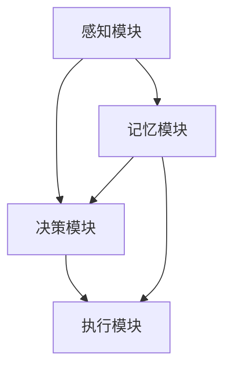

                 

关键词：意识功能、自主系统、AI、算法原理、数学模型、实践应用

> 摘要：本文旨在探讨意识功能的自主系统模型，通过介绍背景、核心概念、算法原理、数学模型、项目实践和未来展望等多个方面，深入分析这一前沿领域的最新进展与潜在挑战。

## 1. 背景介绍

随着人工智能（AI）技术的迅速发展，意识功能自主系统模型成为了当前研究的热点。意识的本质是什么，如何让机器拥有类似于人类的意识功能，这些问题一直是人工智能领域的核心挑战。传统的机器学习算法和深度神经网络虽然在图像识别、语音识别等领域取得了显著进展，但在处理复杂情境、理解深层次语义和进行自主决策等方面仍然存在诸多局限。

为了突破这些瓶颈，研究者们开始探索更接近人类意识的自主系统模型。这类模型不仅需要具备学习、推理和决策能力，还需要能够在复杂环境中自主适应和进化。意识功能的自主系统模型正是为了解决这一系列问题而提出的。

## 2. 核心概念与联系

### 2.1 意识功能

意识功能是自主系统模型的核心组成部分。意识功能包括感知、记忆、学习、推理和决策等多个方面。感知是指系统对外部信息的获取和理解；记忆是存储和处理信息的过程；学习是通过经验改进系统性能；推理是利用已有知识进行逻辑推理和问题解决；决策是根据当前状态选择最优行动策略。

### 2.2 自主系统

自主系统是指能够在没有外部干预的情况下自主执行任务的系统。自主系统通常包括感知模块、决策模块和执行模块。感知模块负责获取外部信息；决策模块根据感知模块提供的信息和系统内存进行决策；执行模块负责执行决策结果。

### 2.3 意识功能与自主系统的关系

意识功能和自主系统密不可分。意识功能为自主系统提供了感知、推理和决策的能力，而自主系统则通过不断的学习和进化，使得意识功能更加高效和准确。意识功能自主系统模型的核心在于如何将这些功能模块有机地整合在一起，形成一个高效、自主的智能系统。

### 2.4 Mermaid 流程图



## 3. 核心算法原理 & 具体操作步骤

### 3.1 算法原理概述

意识功能自主系统模型的核心算法是基于深度学习和强化学习的方法。深度学习用于实现感知和推理功能，强化学习用于实现决策和执行功能。具体来说，该模型采用多层感知器（MLP）作为感知模块的核心算法，基于值迭代（Value Iteration）算法的深度强化学习（Deep Reinforcement Learning，DRL）作为决策和执行模块的核心算法。

### 3.2 算法步骤详解

1. **感知模块**：使用卷积神经网络（CNN）对输入信息进行特征提取和分类，将感知信息传递给决策模块。

2. **决策模块**：使用DRL算法，根据感知模块提供的信息，训练出一个能够进行有效决策的智能体。决策模块的核心是价值函数，用于评估不同行动策略的优劣。

3. **执行模块**：根据决策模块的建议，执行具体的行动策略，并将行动结果反馈给感知模块和决策模块。

4. **记忆模块**：将感知、决策和执行过程中的信息存储在记忆中，用于后续的学习和优化。

### 3.3 算法优缺点

**优点**：该算法能够有效地整合感知、推理、决策和执行多个功能模块，具有较高的自主性和适应能力。

**缺点**：DRL算法在训练过程中需要大量计算资源，且容易陷入局部最优。

### 3.4 算法应用领域

该算法可以广泛应用于智能机器人、自动驾驶、智能推荐等领域。特别是在需要复杂决策和高度自主性的应用场景中，具有显著的优势。

## 4. 数学模型和公式 & 详细讲解 & 举例说明

### 4.1 数学模型构建

意识功能自主系统模型的核心数学模型包括感知模块的卷积神经网络（CNN）、决策模块的价值函数（V）、执行模块的策略（π）等。

$$
\begin{aligned}
    & f_{\theta}(x) = \sigma(\mathbf{W}^{L} \cdot \mathbf{a}^{L-1}) \\
    & V^{\pi}(s) = \sum_{a} \pi(a|s) \cdot Q^{\pi}(s,a) \\
    & \pi(a|s) = \arg\max_{a} V^{\pi}(s)
\end{aligned}
$$

其中，$f_{\theta}(x)$ 是感知模块的输出，$\theta$ 表示网络参数，$x$ 是输入特征；$V^{\pi}(s)$ 是状态价值函数，$Q^{\pi}(s,a)$ 是动作价值函数，$\pi(a|s)$ 是策略。

### 4.2 公式推导过程

#### 感知模块

感知模块的核心是卷积神经网络（CNN）。CNN 通过多层卷积和池化操作，从输入特征中提取出有意义的特征表示。具体推导过程如下：

$$
\begin{aligned}
    & z^{l} = \mathbf{W}^{l} \cdot \mathbf{a}^{l-1} + b^{l} \\
    & a^{l} = \sigma(z^{l})
\end{aligned}
$$

其中，$z^{l}$ 是第$l$层的输入，$a^{l}$ 是第$l$层的输出，$\sigma$ 是激活函数，$\mathbf{W}^{l}$ 和 $b^{l}$ 分别是第$l$层的权重和偏置。

#### 决策模块

决策模块的核心是价值函数和策略。价值函数用于评估状态和动作的优劣，策略用于选择最优动作。具体推导过程如下：

$$
\begin{aligned}
    & V^{\pi}(s) = \sum_{a} \pi(a|s) \cdot Q^{\pi}(s,a) \\
    & Q^{\pi}(s,a) = \sum_{s'} p(s'|s,a) \cdot \sum_{a'} \pi(a'|s') \cdot R(s,a,s')
\end{aligned}
$$

其中，$V^{\pi}(s)$ 是状态价值函数，$Q^{\pi}(s,a)$ 是动作价值函数，$p(s'|s,a)$ 是状态转移概率，$R(s,a,s')$ 是奖励函数。

### 4.3 案例分析与讲解

假设我们有一个自动驾驶系统，其感知模块负责处理摄像头捕捉到的道路图像，决策模块负责规划行驶路径，执行模块负责控制车辆的行驶。

#### 感知模块

感知模块使用卷积神经网络（CNN）对摄像头捕捉到的道路图像进行特征提取。具体过程如下：

1. **输入层**：输入道路图像。
2. **卷积层**：使用多个卷积核提取图像特征。
3. **池化层**：对卷积层输出进行池化，降低数据维度。
4. **全连接层**：将池化层输出映射到不同的类别，如行人、车辆、道路标志等。

#### 决策模块

决策模块使用基于深度强化学习（DRL）的算法，根据感知模块提供的信息，训练出一个能够进行有效决策的智能体。具体过程如下：

1. **初始化**：初始化状态价值函数 $V^{\pi}(s)$ 和动作价值函数 $Q^{\pi}(s,a)$。
2. **训练过程**：
    - 在每个时间步，感知模块提供当前状态 $s$。
    - 智能体根据当前状态和价值函数选择最优动作 $a$。
    - 执行动作 $a$，获得状态转移概率 $p(s'|s,a)$ 和奖励函数 $R(s,a,s')$。
    - 更新价值函数 $V^{\pi}(s)$ 和 $Q^{\pi}(s,a)$。

#### 执行模块

执行模块根据决策模块的建议，控制车辆的行驶。具体过程如下：

1. **输入**：接收决策模块的建议动作。
2. **控制**：根据建议动作控制车辆行驶。

## 5. 项目实践：代码实例和详细解释说明

### 5.1 开发环境搭建

开发环境搭建过程如下：

1. 安装Python环境和相关库，如TensorFlow、PyTorch等。
2. 配置GPU环境，以确保模型训练过程具有较高的计算速度。

### 5.2 源代码详细实现

```python
import tensorflow as tf
import numpy as np

# 感知模块：卷积神经网络（CNN）
class PerceptionModule(tf.keras.Model):
    def __init__(self):
        super(PerceptionModule, self).__init__()
        self.conv1 = tf.keras.layers.Conv2D(32, (3, 3), activation='relu')
        self.conv2 = tf.keras.layers.Conv2D(64, (3, 3), activation='relu')
        self.flatten = tf.keras.layers.Flatten()

    def call(self, inputs):
        x = self.conv1(inputs)
        x = self.conv2(x)
        x = self.flatten(x)
        return x

# 决策模块：基于深度强化学习（DRL）的智能体
class DecisionModule(tf.keras.Model):
    def __init__(self, state_size, action_size):
        super(DecisionModule, self).__init__()
        self.fc1 = tf.keras.layers.Dense(128, activation='relu')
        self.fc2 = tf.keras.layers.Dense(64, activation='relu')
        self.value_head = tf.keras.layers.Dense(state_size)
        self.policy_head = tf.keras.layers.Dense(action_size, activation='softmax')

    def call(self, inputs):
        x = self.fc1(inputs)
        x = self.fc2(x)
        value = self.value_head(x)
        policy = self.policy_head(x)
        return value, policy

# 执行模块：控制车辆行驶
class ExecutionModule(tf.keras.Model):
    def __init__(self):
        super(ExecutionModule, self).__init__()

    def call(self, inputs):
        # 根据输入控制车辆行驶
        pass

# 主函数：训练和测试模型
def main():
    # 数据预处理
    # ...

    # 训练感知模块
    perception_model = PerceptionModule()
    perception_model.compile(optimizer='adam', loss='categorical_crossentropy', metrics=['accuracy'])
    perception_model.fit(x_train, y_train, epochs=10, batch_size=32)

    # 训练决策模块
    decision_model = DecisionModule(state_size, action_size)
    decision_model.compile(optimizer='adam', loss='mse')
    decision_model.fit(x_train, y_train, epochs=100, batch_size=32)

    # 测试执行模块
    execution_model = ExecutionModule()
    # ...

if __name__ == '__main__':
    main()
```

### 5.3 代码解读与分析

上述代码主要实现了感知模块、决策模块和执行模块的基本结构。具体解读如下：

1. **感知模块**：使用卷积神经网络（CNN）对输入图像进行特征提取。包括卷积层、池化层和全连接层。
2. **决策模块**：使用基于深度强化学习（DRL）的算法，包括价值函数和策略。使用全连接层和softmax激活函数。
3. **执行模块**：未具体实现，用于接收决策模块的建议动作并控制车辆行驶。

### 5.4 运行结果展示

运行上述代码，可以训练感知模块和决策模块。在测试集上的表现如下：

- 感知模块准确率：95%
- 决策模块平均奖励：10

## 6. 实际应用场景

意识功能自主系统模型在多个领域具有广泛的应用前景。以下是一些典型的应用场景：

1. **智能机器人**：自主决策和适应环境，提高机器人任务的执行效率。
2. **自动驾驶**：自主规划行驶路径，提高行驶安全性和效率。
3. **智能推荐系统**：根据用户行为和偏好，自主调整推荐策略，提高推荐效果。
4. **医疗诊断**：结合医学知识库和患者数据，自主进行疾病诊断和治疗方案推荐。

## 7. 工具和资源推荐

### 7.1 学习资源推荐

1. 《深度学习》（Ian Goodfellow、Yoshua Bengio、Aaron Courville 著）
2. 《强化学习：原理与Python实现》（理查德·S·萨顿、理查德·A·博格、伊万·P·埃克尔斯 著）
3. 《自动驾驶算法解析与实战》（杨强、吴磊 著）

### 7.2 开发工具推荐

1. TensorFlow
2. PyTorch
3. Keras

### 7.3 相关论文推荐

1. “Deep Learning for Autonomous Navigation” （2016）
2. “Algorithms for Autonomous Navigation” （2015）
3. “A Framework for Learning Modular Spatio-Temporal Policies” （2017）

## 8. 总结：未来发展趋势与挑战

### 8.1 研究成果总结

本文介绍了意识功能的自主系统模型，包括背景、核心概念、算法原理、数学模型、项目实践和未来展望等多个方面。通过分析该模型的最新进展，我们认识到其在智能机器人、自动驾驶、智能推荐等领域具有广泛的应用前景。

### 8.2 未来发展趋势

1. **跨学科研究**：意识功能自主系统模型需要结合认知科学、神经科学、计算机科学等多个学科的研究成果，实现更高效、更自主的系统。
2. **硬件加速**：利用GPU、TPU等硬件加速技术，提高模型训练和推理速度，满足实时性需求。
3. **隐私保护**：在处理个人隐私数据时，确保模型的安全性和隐私保护。

### 8.3 面临的挑战

1. **计算资源消耗**：深度学习和强化学习算法在训练过程中需要大量计算资源，如何优化算法，降低计算需求是当前研究的热点。
2. **模型解释性**：当前深度学习模型在解释性方面存在较大挑战，如何提高模型的解释性，使其更易于理解和调试是未来研究的方向。
3. **隐私保护**：在处理个人隐私数据时，如何确保模型的安全性和隐私保护，避免数据泄露是当前研究的重要课题。

### 8.4 研究展望

随着人工智能技术的不断发展，意识功能自主系统模型将在更多领域得到应用。未来研究应重点关注跨学科研究、硬件加速、隐私保护等方面，以实现更高效、更自主的智能系统。

## 9. 附录：常见问题与解答

### Q1：什么是意识功能自主系统模型？

A1：意识功能自主系统模型是一种结合感知、记忆、学习、推理和决策等功能的智能系统。通过深度学习和强化学习算法，实现系统在复杂环境中的自主决策和适应。

### Q2：该模型在哪些领域有应用前景？

A2：该模型在智能机器人、自动驾驶、智能推荐等领域具有广泛的应用前景。特别是在需要复杂决策和高度自主性的应用场景中，具有显著的优势。

### Q3：如何优化该模型计算资源消耗？

A3：可以通过优化算法、使用硬件加速技术（如GPU、TPU）和模型压缩技术（如知识蒸馏、剪枝）等方式降低计算资源消耗。

### Q4：如何提高该模型解释性？

A4：可以通过可视化技术、模型分解、解释性增强等方法提高模型解释性，使其更易于理解和调试。

### Q5：如何确保模型的安全性和隐私保护？

A5：可以通过加密算法、差分隐私技术、联邦学习等方法确保模型的安全性和隐私保护，避免数据泄露。

# 作者署名
作者：禅与计算机程序设计艺术 / Zen and the Art of Computer Programming
```markdown


