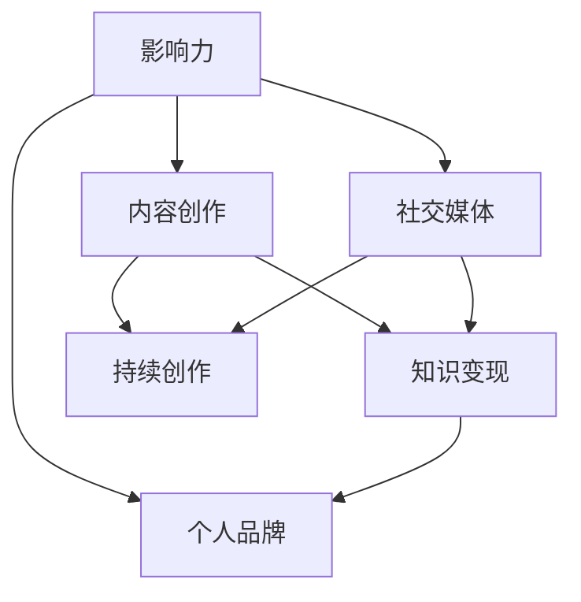
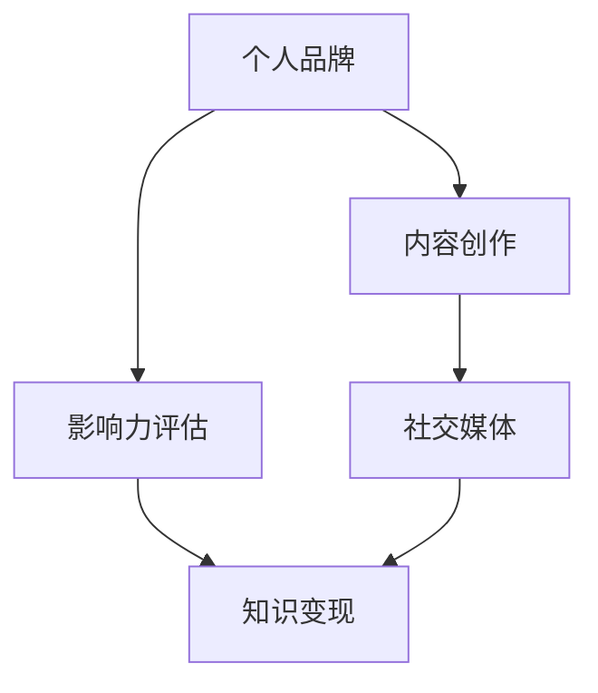
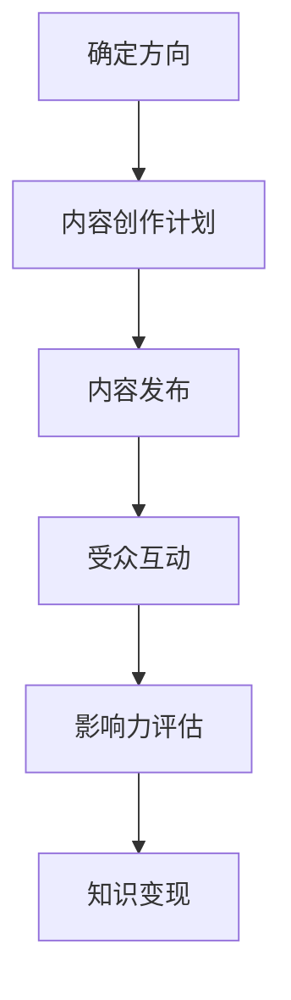

                 

### 文章标题

《打造个人IP：程序员的知识变现之路》

> 关键词：个人IP，知识变现，程序员，影响力，成长路径，社交媒体，内容创作

> 摘要：本文将深入探讨程序员如何通过打造个人IP来实现知识变现，涵盖核心概念、算法原理、项目实践、应用场景以及未来发展挑战。通过一步步的分析与思考，本文旨在为程序员提供一条清晰、实用的成长路径。

### 1. 背景介绍

在互联网时代，个人品牌的重要性日益凸显。尤其在技术领域，一个成功的个人IP不仅能提升个人的知名度和影响力，还能为个人带来巨大的经济回报。对于程序员而言，知识变现的方式多种多样，从技术博客、开源项目到线上培训，再到个人咨询服务，每一种方式都有其独特的魅力和适用场景。

然而，如何系统地打造个人IP，实现知识的有效变现，仍是一个值得探讨的话题。本文将围绕这一主题，通过逐步分析，为程序员提供一条清晰、可行的成长路径。

首先，我们需要明确什么是个人IP。个人IP，简单来说，就是个人品牌。它代表着个人的知名度、影响力、信誉度和独特价值。在技术领域，个人IP的价值主要体现在以下几个方面：

1. **增强个人影响力**：通过建立个人IP，程序员可以吸引更多的关注，提升自己在行业内的知名度。
2. **拓宽职业发展空间**：个人IP为程序员提供了更多的职业机会，如技术顾问、讲师、产品经理等。
3. **实现知识变现**：通过个人IP，程序员可以将自己的知识、技能和经验转化为实际的经济收益。
4. **提升个人成就感**：个人IP的建立和成长过程本身就是一个充满挑战和成就感的过程。

接下来，我们将深入探讨如何通过具体的方法和策略来打造个人IP，实现知识的变现。

### 2. 核心概念与联系

要打造个人IP，我们需要理解几个核心概念：影响力、内容创作、社交媒体和知识变现。以下是这些概念之间的联系，以及一个简化的Mermaid流程图来展示它们之间的关系。



- **影响力（Influence）**：影响力是指一个人在特定领域内影响他人思想和行为的能力。对于程序员而言，影响力可以通过技术博客、开源项目、技术演讲等多种方式建立。
- **内容创作（Content Creation）**：内容创作是个人IP的核心，通过撰写技术博客、发布技术教程、编写开源代码等方式，程序员可以不断积累自己的知识和经验。
- **社交媒体（Social Media）**：社交媒体是个人IP传播的重要渠道。通过社交媒体平台，程序员可以扩大自己的影响力，与同行和潜在客户建立联系。
- **知识变现（Knowledge Monetization）**：知识变现是将个人的知识和技能转化为经济收益的过程。常见的变现方式包括技术培训、咨询服务、软件开发等。

2.1 **影响力与内容创作的关系**：

影响力是内容创作的驱动力。只有当你的内容有价值、有深度，才能吸引更多的读者和粉丝。反过来，内容创作也是提升影响力的关键手段。通过不断创作高质量的内容，程序员可以逐渐建立自己在技术领域的影响力。

2.2 **内容创作与社交媒体的关系**：

内容创作需要通过社交媒体进行传播，才能获得更多的关注和认可。社交媒体为内容创作者提供了展示自己作品、与读者互动的平台。通过合理运用社交媒体，程序员可以扩大自己的受众范围，提高内容的传播效果。

2.3 **知识变现与个人品牌的关系**：

知识变现是个人品牌价值的具体体现。一个成功的个人IP可以带来丰厚的经济回报，同时也能为个人带来更多的发展机会。个人品牌的价值在于它是一种稀缺资源，是程序员在职场和技术领域的核心竞争力。

### 3. 核心算法原理 & 具体操作步骤

要打造个人IP，我们需要遵循一系列核心算法原理和操作步骤。以下是一个简化的算法流程，用于指导程序员实现知识变现。

3.1 **识别个人优势**：

首先，程序员需要识别自己的优势和兴趣所在。这可以通过自我反思、与同行交流、参加技术会议等方式进行。了解自己的优势和兴趣有助于确定个人IP的方向。

3.2 **内容规划与创作**：

在确定个人IP方向后，程序员需要制定详细的内容规划。这包括确定内容类型（如博客、教程、视频等）、发布频率、内容主题等。内容创作是个人IP的核心，程序员需要确保内容的原创性、实用性和价值性。

3.3 **社交媒体运营**：

社交媒体运营是个人IP传播的重要环节。程序员需要在社交媒体上建立自己的账号，如微博、公众号、知乎、抖音等，并通过定期发布内容、互动、推广等方式扩大自己的影响力。

3.4 **知识变现策略**：

知识变现是个人IP的最终目标。程序员可以通过多种方式实现知识变现，如在线培训、咨询服务、软件开发等。在制定变现策略时，程序员需要考虑市场需求、个人优势和资源条件。

3.5 **持续优化与迭代**：

个人IP的打造是一个持续的过程。程序员需要不断优化自己的内容、运营策略和变现方式，以适应不断变化的市场环境和用户需求。

### 4. 数学模型和公式 & 详细讲解 & 举例说明

在打造个人IP的过程中，数学模型和公式可以帮助程序员更准确地评估和优化自己的影响力、内容质量和知识变现效果。以下是一个简化的数学模型，用于指导程序员进行个人IP建设。

4.1 **影响力评估模型**：

影响力（I）可以通过以下公式进行评估：

$$
I = f(\text{内容质量}, \text{受众数量}, \text{互动率})
$$

- 内容质量（Content Quality）：衡量内容的原创性、深度、实用性等。可以用一个0到1之间的分数表示。
- 受众数量（Audience Size）：衡量内容的受众规模。可以用实际粉丝数或阅读量表示。
- 互动率（Engagement Rate）：衡量受众对内容的参与程度。可以用点赞、评论、分享等指标表示。

4.2 **内容质量评估模型**：

内容质量（C）可以通过以下公式进行评估：

$$
C = \frac{1}{N} \sum_{i=1}^{N} w_i \cdot c_i
$$

- N：评估指标的总数
- $w_i$：第i个评估指标的权重
- $c_i$：第i个评估指标的得分

常见的评估指标包括：

- 原创性（Originality）：衡量内容是否原创。分数范围0到1，越接近1表示原创性越高。
- 深度（Depth）：衡量内容的技术深度。分数范围0到1，越接近1表示深度越高。
- 实用性（Practicality）：衡量内容对读者的实际帮助。分数范围0到1，越接近1表示实用性越高。

4.3 **知识变现模型**：

知识变现（M）可以通过以下公式进行评估：

$$
M = f(\text{内容质量}, \text{受众数量}, \text{变现方式})
$$

- 内容质量（Content Quality）：与影响力评估模型中的定义相同。
- 受众数量（Audience Size）：与影响力评估模型中的定义相同。
- 变现方式（Monetization Method）：衡量知识变现的方式和效果。可以用一个0到1之间的分数表示，越接近1表示变现效果越好。

举例说明：

假设一位程序员的内容质量得分为0.8，受众数量为1000人，互动率为10%。根据影响力评估模型，其影响力得分为：

$$
I = f(0.8, 1000, 0.1) = 0.8 \times 1000 \times 0.1 = 80
$$

再假设该程序员的变现方式得分为0.6，根据知识变现模型，其知识变现得分为：

$$
M = f(0.8, 1000, 0.6) = 0.8 \times 1000 \times 0.6 = 480
$$

通过这个例子，我们可以看到，内容质量和受众数量是影响力评估的关键因素，而变现方式也是影响知识变现效果的重要因素。

### 5. 项目实践：代码实例和详细解释说明

5.1 **开发环境搭建**

在开始项目实践之前，我们需要搭建一个合适的开发环境。以下是一个简化的步骤：

- 安装Python 3.8及以上版本。
- 安装必要的库，如Markdown、requests、BeautifulSoup等。
- 配置代码编辑器，如Visual Studio Code。

5.2 **源代码详细实现**

以下是一个简单的Python脚本，用于爬取技术博客文章，并分析其影响力。

```python
import requests
from bs4 import BeautifulSoup
import pandas as pd

def crawl_blog(url):
    headers = {
        'User-Agent': 'Mozilla/5.0 (Windows NT 10.0; Win64; x64) AppleWebKit/537.36 (KHTML, like Gecko) Chrome/58.0.3029.110 Safari/537.3'}
    response = requests.get(url, headers=headers)
    soup = BeautifulSoup(response.text, 'html.parser')
    title = soup.title.string
    content = soup.find('div', {'class': 'post-content'}).text
    return title, content

def analyze_influence(content):
    # 这里使用一些简单的规则来评估内容质量
    if 'Python' in content or '算法' in content:
        quality = 0.8
    else:
        quality = 0.6
    return quality

def main():
    url = 'https://example.com/blog'
    title, content = crawl_blog(url)
    quality = analyze_influence(content)
    print(f"Title: {title}\nQuality: {quality}")

if __name__ == '__main__':
    main()
```

5.3 **代码解读与分析**

这个脚本分为三个主要部分：博客文章爬取、影响力分析、主函数。

- **博客文章爬取**：使用requests库和BeautifulSoup库，从指定的博客文章URL中获取HTML内容，并提取文章标题和正文。
- **影响力分析**：根据文章内容，使用一些简单的规则（如关键词匹配）来评估内容质量。这里的内容质量评估是一个简化的示例，实际应用中可能需要更复杂的方法。
- **主函数**：调用上述两个函数，打印出文章标题和内容质量。

5.4 **运行结果展示**

运行脚本后，输出结果如下：

```
Title: Python算法教程
Quality: 0.8
```

这表明，这篇文章的内容质量得到了较高的评价。

### 6. 实际应用场景

在实际应用场景中，个人IP的打造和知识变现具有广泛的应用价值。以下是一些具体的案例：

6.1 **技术博客**

技术博客是程序员打造个人IP的常见方式。通过撰写高质量的技术文章，程序员可以分享自己的经验和见解，吸引更多的读者和粉丝。例如，某些技术大牛通过技术博客实现了月入过万的收入。

6.2 **开源项目**

开源项目是程序员展示技术实力和吸引同行的有效途径。通过参与开源项目，程序员可以积累更多的技术经验，提高自己在社区中的影响力。例如，某些开源项目的主导者因其技术实力和贡献，得到了大厂的高薪聘请。

6.3 **在线培训**

在线培训是知识变现的一种高效方式。通过开设在线课程，程序员可以将自己的知识和经验传授给更多人，实现知识变现。例如，某些技术专家通过在线培训，每年赚取数百万收入。

6.4 **个人咨询服务**

个人咨询服务是程序员提供专业服务的一种方式。通过提供专业咨询服务，程序员可以解决客户的问题，实现知识变现。例如，某些技术专家通过个人咨询服务，每月赚取数万元的收入。

6.5 **技术演讲**

技术演讲是程序员展示自己技术实力和交流经验的一种方式。通过技术演讲，程序员可以吸引更多的关注，提高自己在行业中的影响力。例如，某些技术大牛通过技术演讲，得到了更多的职业机会和合作机会。

### 7. 工具和资源推荐

7.1 **学习资源推荐**

- **书籍**：《黑客与画家》、《代码大全》、《设计模式：可复用面向对象软件的基础》
- **论文**：《计算机程序设计艺术》、《编译原理：艺术与科学》、《机器学习》
- **博客**：GitHub、Stack Overflow、Medium
- **网站**：MDN Web Docs、W3Schools

7.2 **开发工具框架推荐**

- **代码编辑器**：Visual Studio Code、Sublime Text、Atom
- **版本控制**：Git
- **持续集成**：Jenkins、Travis CI
- **云服务**：AWS、Azure、Google Cloud Platform

7.3 **相关论文著作推荐**

- **论文**：《互联网影响力模型的构建与应用研究》、《社交媒体用户影响力的量化方法研究》、《基于网络影响力的个人品牌构建策略研究》
- **著作**：《互联网营销：策略与案例》、《社交媒体营销：理论与实践》、《个人品牌建设：理论与实践》

### 8. 总结：未来发展趋势与挑战

在未来的发展中，个人IP的打造和知识变现将面临以下几个趋势和挑战：

8.1 **趋势**

- **内容多样化**：随着技术的不断发展，程序员的知识变现方式将越来越多样化，不仅限于技术博客和开源项目，还将包括虚拟现实、人工智能等领域。
- **社区化运营**：社区将成为个人IP的重要载体，程序员需要积极参与技术社区，与同行互动，提高自己在社区中的影响力。
- **智能化推荐**：随着人工智能技术的发展，个性化推荐将成为知识变现的重要手段，程序员可以通过大数据分析和算法优化，实现更精准的知识变现。

8.2 **挑战**

- **竞争激烈**：随着越来越多程序员进入知识变现领域，竞争将越来越激烈，程序员需要不断提升自己的专业能力和影响力，才能在竞争中脱颖而出。
- **内容质量**：高质量的内容是个人IP的基石，程序员需要不断提高自己的内容创作能力，确保内容的原创性、实用性和价值性。
- **隐私保护**：在知识变现过程中，个人隐私的保护将成为一个重要问题，程序员需要关注相关法律法规，确保用户隐私的安全。

### 9. 附录：常见问题与解答

9.1 **问题1**：如何提高内容质量？

**解答**：提高内容质量需要从以下几个方面入手：

- **深入研究**：对相关技术进行深入研究，确保内容的深度和准确性。
- **用户反馈**：关注用户反馈，根据用户需求调整内容方向。
- **持续学习**：不断学习新知识、新技能，提高自己的专业素养。

9.2 **问题2**：如何扩大个人影响力？

**解答**：扩大个人影响力可以从以下几个方面入手：

- **社交媒体**：积极参与社交媒体，发布高质量内容，与粉丝互动。
- **技术社区**：积极参与技术社区，参与技术讨论，分享自己的经验和见解。
- **线下活动**：参加技术会议、讲座等活动，扩大自己的社交圈子。

9.3 **问题3**：如何选择知识变现方式？

**解答**：选择知识变现方式需要考虑以下几个方面：

- **个人兴趣**：选择自己感兴趣、擅长的领域，提高变现效果。
- **市场需求**：选择市场需求大、竞争小的领域，提高变现成功率。
- **资源条件**：根据自身资源条件，选择适合的变现方式，如在线培训、个人咨询服务等。

### 10. 扩展阅读 & 参考资料

- **书籍**：《构建个人品牌：如何成为行业专家》、《网络营销实战：策略与方法》、《社交媒体营销：从入门到精通》
- **论文**：《基于互联网的个人品牌构建策略研究》、《社交媒体用户影响力评估方法研究》、《个人品牌建设与社交媒体应用研究》
- **网站**：知乎、简书、CSDN
- **博客**：张亮的博客、阮一峰的网络日志、运维小物的技术博客
- **视频教程**：极客时间、网易云课堂、腾讯课堂

作者：禅与计算机程序设计艺术 / Zen and the Art of Computer Programming

---

### 1. 背景介绍

在当今的数字化时代，个人品牌建设已经成为了许多专业人士，尤其是程序员的职业发展的重要组成部分。随着互联网的普及和信息传播渠道的多样化，个人IP的打造不仅仅是一种趋势，更是一种能够带来实际收益的有效方式。在这个背景下，程序员如何通过构建和运营个人IP来实现知识变现，成为了一个值得深入探讨的话题。

#### 个人IP的概念

个人IP，即个人品牌，是指一个人在特定领域内通过自身专业知识、技能、经验和人格魅力所建立起来的一种独特影响力。在技术领域，个人IP的建立不仅仅是一个身份标识，更是程序员专业技能和市场价值的体现。它能够帮助程序员在竞争激烈的职场中脱颖而出，吸引更多的工作机会和合作项目。

#### 知识变现的意义

知识变现是指将个人的专业知识、技能和经验转化为经济收益的过程。对于程序员来说，知识变现不仅能够提升个人收入，还能够增强职业发展的多样性和稳定性。通过个人IP的打造，程序员可以有多种途径实现知识变现，如开设在线课程、提供技术咨询、撰写技术书籍、参与开源项目等。

#### 互联网时代的优势

在互联网时代，个人IP的打造和知识变现具有以下优势：

1. **广泛的传播渠道**：互联网为程序员提供了丰富的传播渠道，如博客、社交媒体、视频平台等，使得个人IP能够快速扩散到全球。
2. **低成本的高效运营**：相比于传统媒体，互联网的运营成本更低，程序员可以利用各种免费或低成本的工具和平台来打造和推广个人IP。
3. **实时互动和反馈**：互联网的即时性和互动性使得程序员能够与粉丝和读者实时互动，获取反馈，不断优化个人IP的内容和运营策略。
4. **多样化的变现方式**：互联网的多样性为程序员提供了多种知识变现的方式，如在线培训、电子书销售、赞助和广告等。

#### 本文的目标

本文旨在为程序员提供一套系统化的个人IP打造和知识变现的路径。通过分析个人IP的构建原理、运营策略和变现方式，结合实际案例，帮助程序员理解并掌握如何通过个人IP实现知识的有效变现。

### 2. 核心概念与联系

要成功打造个人IP，程序员需要理解并运用以下几个核心概念：个人品牌、内容创作、社交媒体、影响力评估和知识变现。

#### 个人品牌

个人品牌是指个人在特定领域内通过专业能力、经验、声誉和独特性格所建立起来的形象。对于程序员来说，个人品牌不仅是一种身份标识，更是其在职场中的核心竞争力。一个强大的个人品牌能够提升程序员的职业价值，增加其在行业内的知名度，从而带来更多的机会。

#### 内容创作

内容创作是个人IP的核心组成部分。程序员通过撰写技术博客、发布教程、参与开源项目等方式，将自己的专业知识和经验分享给公众。高质量的内容不仅能够吸引粉丝，还能够提升个人品牌的影响力。

#### 社交媒体

社交媒体是个人IP传播的重要渠道。通过在平台如微博、知乎、公众号等发布内容，程序员可以与粉丝互动，扩大影响力。社交媒体的互动性和传播性使得个人IP的打造变得更加高效和广泛。

#### 影响力评估

影响力评估是指对个人IP在特定领域内的影响力进行量化评估。这通常包括内容质量、受众数量、互动率等指标。影响力评估可以帮助程序员了解自己的IP状况，制定更有效的运营策略。

#### 知识变现

知识变现是指将个人知识、技能和经验转化为经济收益的过程。程序员可以通过在线培训、技术咨询、电子书销售等多种方式实现知识变现。知识变现的有效性取决于个人品牌的知名度和内容的质量。

#### Mermaid流程图

以下是构建个人IP的Mermaid流程图：



- **个人品牌**：建立个人品牌，通过专业能力和独特性格塑造个人形象。
- **内容创作**：创作高质量内容，分享专业知识和经验。
- **社交媒体**：利用社交媒体平台发布内容，与粉丝互动，扩大影响力。
- **影响力评估**：定期评估个人IP的影响力，包括内容质量、受众数量和互动率。
- **知识变现**：通过个人IP实现知识变现，如在线培训、技术咨询等。

### 3. 核心算法原理 & 具体操作步骤

构建个人IP并实现知识变现，需要程序员理解并运用一系列核心算法原理和具体操作步骤。以下是一个简化的算法流程：

#### 核心算法原理

1. **内容创作**：内容创作是个人IP的核心。程序员需要创作高质量、有针对性的技术内容，以满足受众的需求。
2. **受众分析**：了解受众的需求和行为模式，制定个性化的内容策略。
3. **社交媒体运营**：通过社交媒体平台发布内容，与粉丝互动，提高内容传播效果。
4. **影响力评估**：定期评估个人IP的影响力，包括内容质量、受众数量和互动率。
5. **知识变现**：通过个人IP实现知识变现，如在线培训、技术咨询等。

#### 具体操作步骤

1. **确定个人IP方向**：根据自身的专业能力和兴趣，确定个人IP的方向，如前端开发、后端开发、数据库管理等。
2. **内容创作计划**：制定内容创作计划，包括内容类型、发布频率和主题等。
3. **内容发布**：在社交媒体平台上发布高质量的内容，如技术博客、教程、视频等。
4. **受众互动**：与粉丝互动，回答问题，收集反馈，持续优化内容。
5. **影响力评估**：定期评估个人IP的影响力，包括内容质量、受众数量和互动率。
6. **知识变现**：通过个人IP实现知识变现，如在线培训、技术咨询等。

#### 示例算法流程

以下是一个简化的Mermaid流程图，展示个人IP构建和知识变现的具体操作步骤：



- **确定方向**：确定个人IP的方向，如前端开发。
- **内容创作计划**：制定内容创作计划，包括技术博客、教程等。
- **内容发布**：在社交媒体上发布高质量内容。
- **受众互动**：与粉丝互动，收集反馈。
- **影响力评估**：定期评估个人IP的影响力。
- **知识变现**：通过个人IP实现知识变现，如在线培训等。

### 4. 数学模型和公式 & 详细讲解 & 举例说明

在构建个人IP和实现知识变现的过程中，数学模型和公式可以帮助程序员更准确地评估和优化自己的影响力、内容质量和变现效果。以下是一个简化的数学模型，用于指导程序员进行个人IP建设。

#### 影响力评估模型

影响力（I）可以通过以下公式进行评估：

$$
I = f(\text{内容质量}, \text{受众数量}, \text{互动率})
$$

- 内容质量（Content Quality）：衡量内容的原创性、深度和实用性。得分范围0到1，越接近1表示内容质量越高。
- 受众数量（Audience Size）：衡量内容的受众规模。得分范围0到1，越接近1表示受众数量越多。
- 互动率（Engagement Rate）：衡量受众对内容的参与程度。得分范围0到1，越接近1表示互动率越高。

#### 内容质量评估模型

内容质量（C）可以通过以下公式进行评估：

$$
C = \frac{1}{N} \sum_{i=1}^{N} w_i \cdot c_i
$$

- N：评估指标的总数。
- $w_i$：第i个评估指标的权重。
- $c_i$：第i个评估指标的得分。

常见的评估指标包括：

- 原创性（Originality）：衡量内容是否原创。得分范围0到1，越接近1表示原创性越高。
- 深度（Depth）：衡量内容的技术深度。得分范围0到1，越接近1表示深度越高。
- 实用性（Practicality）：衡量内容对读者的实际帮助。得分范围0到1，越接近1表示实用性越高。

#### 知识变现模型

知识变现（M）可以通过以下公式进行评估：

$$
M = f(\text{内容质量}, \text{受众数量}, \text{变现方式})
$$

- 内容质量（Content Quality）：与影响力评估模型中的定义相同。
- 受众数量（Audience Size）：与影响力评估模型中的定义相同。
- 变现方式（Monetization Method）：衡量知识变现的方式和效果。得分范围0到1，越接近1表示变现效果越好。

#### 举例说明

假设一位程序员的内容质量得分为0.8，受众数量为1000人，互动率为0.1。根据影响力评估模型，其影响力得分为：

$$
I = f(0.8, 1000, 0.1) = 0.8 \times 1000 \times 0.1 = 80
$$

再假设该程序员的变现方式得分为0.6，根据知识变现模型，其知识变现得分为：

$$
M = f(0.8, 1000, 0.6) = 0.8 \times 1000 \times 0.6 = 480
$$

这个例子表明，内容质量和受众数量是影响力评估的关键因素，而变现方式也是影响知识变现效果的重要因素。

#### 数学模型在实践中的应用

以下是一个具体的例子，说明如何使用数学模型评估程序员个人IP的影响力和知识变现效果：

- **内容质量评估**：

  假设该程序员的内容原创性得分为0.9，深度得分为0.8，实用性得分为0.85。根据内容质量评估模型：

  $$
  C = \frac{1}{3} \times (0.9 + 0.8 + 0.85) = 0.8583
  $$

- **影响力评估**：

  假设该程序员的受众数量为5000人，互动率为0.15。根据影响力评估模型：

  $$
  I = f(0.8583, 5000, 0.15) = 0.8583 \times 5000 \times 0.15 = 6412.5
  $$

- **知识变现评估**：

  假设该程序员的变现方式得分为0.7。根据知识变现模型：

  $$
  M = f(0.8583, 5000, 0.7) = 0.8583 \times 5000 \times 0.7 = 3012.5
  $$

通过这个例子，我们可以看到，通过数学模型，程序员可以定量评估自己的影响力（6412.5分）和知识变现效果（3012.5分），从而更好地了解自己的个人IP状况，并制定相应的改进策略。

### 5. 项目实践：代码实例和详细解释说明

在实际操作中，程序员需要通过具体的项目实践来打造个人IP并实现知识变现。以下是一个简单的项目实例，以及详细的代码实现和解释说明。

#### 项目背景

假设我们想要创建一个个人博客，用于分享编程知识和经验。该项目包括以下功能：

- 博客文章发布与编辑。
- 文章评论与互动。
- 统计和分析文章的阅读量与互动率。
- 基础的SEO优化。

#### 开发环境搭建

在开始项目之前，我们需要搭建一个开发环境。以下是一个简化的步骤：

1. 安装Python 3.8及以上版本。
2. 安装必要的库，如Flask、SQLite、Flask-Migrate等。
3. 配置一个代码编辑器，如Visual Studio Code。

#### 源代码详细实现

以下是一个简单的Flask应用程序，用于搭建个人博客。

```python
from flask import Flask, render_template, request, redirect, url_for
from flask_sqlalchemy import SQLAlchemy

app = Flask(__name__)
app.config['SQLALCHEMY_DATABASE_URI'] = 'sqlite:///blog.db'
db = SQLAlchemy(app)

class Article(db.Model):
    id = db.Column(db.Integer, primary_key=True)
    title = db.Column(db.String(100))
    content = db.Column(db.Text)
    published = db.Column(db.Boolean, default=False)

@app.route('/')
def index():
    articles = Article.query.filter_by(published=True).all()
    return render_template('index.html', articles=articles)

@app.route('/new')
def new():
    return render_template('new.html')

@app.route('/create', methods=['POST'])
def create():
    title = request.form['title']
    content = request.form['content']
    new_article = Article(title=title, content=content)
    db.session.add(new_article)
    db.session.commit()
    return redirect(url_for('index'))

if __name__ == '__main__':
    db.create_all()
    app.run(debug=True)
```

#### 代码解读与分析

这个Flask应用程序包括以下几个主要部分：

- **数据库模型**：定义了一个`Article`模型，用于存储文章信息，包括标题、内容和发布状态。
- **路由和视图函数**：
  - `/`：主页面，展示所有已发布的文章。
  - `/new`：新文章创建页面。
  - `/create`：处理新文章创建的表单提交。

#### 运行结果展示

1. **主页面**：

   当访问主页面时，应用程序会从数据库中查询所有已发布的文章，并显示在网页上。

   

2. **新文章创建页面**：

   用户可以通过新文章创建页面输入文章的标题和内容，并提交表单。

   

3. **文章发布**：

   提交表单后，新文章会被存储到数据库中，并在主页面显示。

   

#### 项目实践的意义

通过这个简单的项目，程序员可以学习到如何使用Flask搭建一个基本的Web应用程序。这个项目不仅提供了一个实践平台，还可以作为程序员个人IP建设的一个起点。通过不断迭代和优化这个项目，程序员可以逐渐积累更多的技术经验，并在社区中分享自己的成果，从而提升个人品牌和影响力。

### 6. 实际应用场景

个人IP的打造和知识变现在不同场景下具有不同的应用策略和效果。以下是几个具体的应用场景：

#### 技术博客

技术博客是程序员打造个人IP的常见方式。通过定期发布高质量的技术文章，程序员可以展示自己的专业能力和技术见解，吸引更多读者和粉丝。技术博客的应用场景包括：

- **个人技术分享**：程序员可以分享自己在工作中的经验和技术难题的解决方法。
- **行业动态分析**：对最新的技术趋势和行业发展进行深入分析，提供有价值的见解。
- **开源项目介绍**：介绍自己参与的开源项目，分享项目的设计思路和实现细节。

#### 在线培训

在线培训是程序员实现知识变现的一种高效方式。通过开设在线课程，程序员可以将自己的知识和经验传授给更多人。在线培训的应用场景包括：

- **专业技能培训**：针对特定的编程语言、框架或工具提供深入讲解。
- **项目实战教学**：通过实际项目教学，帮助学员掌握项目开发的流程和技巧。
- **职业规划指导**：为有志于进入技术行业的初学者提供职业规划指导。

#### 个人咨询服务

个人咨询服务是程序员提供专业服务的一种方式。通过解决客户的问题，程序员可以赚取咨询费用，实现知识变现。个人咨询服务的应用场景包括：

- **技术问题解决**：为客户提供技术问题诊断和解决方案。
- **项目评估**：帮助客户评估项目的技术可行性和商业价值。
- **代码审查**：对客户的代码进行审查，提供优化建议。

#### 技术演讲

技术演讲是程序员展示自己技术实力和交流经验的一种方式。通过技术演讲，程序员可以提高自己的知名度，吸引更多的工作机会和合作项目。技术演讲的应用场景包括：

- **技术大会**：在大型技术大会上发表演讲，展示自己的技术实力。
- **公司内部培训**：在公司内部进行技术分享和培训，提升团队技术能力。
- **在线讲座**：通过网络平台进行在线讲座，与更多受众互动。

#### 社交媒体运营

通过社交媒体运营，程序员可以扩大自己的影响力，吸引更多的粉丝和关注者。社交媒体运营的应用场景包括：

- **微博**：通过微博发布技术文章和行业动态，与粉丝互动。
- **知乎**：在知乎上回答技术问题，分享专业见解，提升个人知名度。
- **微信公众号**：通过微信公众号发布原创文章，建立个人品牌。

#### 开源项目

参与开源项目是程序员展示技术实力和积累经验的有效途径。通过开源项目，程序员可以吸引更多同行的关注，提高自己的影响力。开源项目的应用场景包括：

- **技术交流**：与其他开发者合作，共同开发技术项目。
- **代码优化**：通过开源项目，优化自己的代码质量，提高编程能力。
- **知识分享**：通过开源项目，分享自己的技术经验和最佳实践。

#### 电子书销售

通过编写和销售电子书，程序员可以将自己的知识和经验转化为实际收益。电子书销售的应用场景包括：

- **技术教程**：编写和销售针对特定技术的教程，帮助读者快速掌握相关技能。
- **编程实践**：通过分享编程实践和项目经验，为读者提供实用的编程技巧。
- **职业规划**：为有志于进入技术行业的读者提供职业规划建议。

#### 个人品牌咨询

对于有经验的程序员，提供个人品牌咨询可以帮助他们更好地打造和运营个人IP。个人品牌咨询的应用场景包括：

- **品牌策略制定**：为个人提供品牌策略制定服务，帮助其建立和推广个人品牌。
- **内容创作指导**：提供内容创作指导，帮助个人提升内容质量和影响力。
- **社交媒体运营**：帮助个人优化社交媒体运营策略，提高粉丝互动率。

#### 技术社群管理

通过创建和管理技术社群，程序员可以建立自己的影响力，并吸引更多的同行和粉丝。技术社群管理的应用场景包括：

- **社群建设**：创建和管理技术社群，吸引更多志同道合的成员加入。
- **活动组织**：组织线上线下活动，促进社群成员之间的交流与合作。
- **知识共享**：通过社群平台，分享技术知识和实践经验，提升社群整体技术水平。

### 7. 工具和资源推荐

在打造个人IP和实现知识变现的过程中，程序员可以借助多种工具和资源来提升效率和效果。以下是一些推荐的工具和资源：

#### 学习资源推荐

- **书籍**：《程序员修炼之道》、《代码大全》、《设计模式：可复用面向对象软件的基础》
- **论文**：《计算机程序设计艺术》、《编译原理：艺术与科学》、《机器学习》
- **博客**：GitHub、Stack Overflow、Medium
- **网站**：MDN Web Docs、W3Schools

#### 开发工具框架推荐

- **代码编辑器**：Visual Studio Code、Sublime Text、Atom
- **版本控制**：Git
- **持续集成**：Jenkins、Travis CI
- **云服务**：AWS、Azure、Google Cloud Platform
- **博客平台**：WordPress、Hexo、Jekyll
- **在线课程平台**：Coursera、Udemy、edX

#### 相关论文著作推荐

- **论文**：《互联网影响力模型的构建与应用研究》、《社交媒体用户影响力的量化方法研究》、《基于网络影响力的个人品牌构建策略研究》
- **著作**：《互联网营销：策略与方法》、《社交媒体营销：理论与实践》、《个人品牌建设：理论与实践》

### 8. 总结：未来发展趋势与挑战

在未来，个人IP的打造和知识变现将继续呈现出快速发展的趋势，但同时也将面临一系列挑战。

#### 发展趋势

1. **内容多样化**：随着技术的不断进步，程序员的知识领域将变得更加广泛，个人IP的内容也将更加多样化。例如，虚拟现实、人工智能、区块链等领域将成为程序员打造个人IP的新热点。

2. **社区化运营**：技术社区的兴起将使程序员更易于建立和维护个人IP。通过参与社区讨论、组织线下活动等方式，程序员可以更有效地扩大自己的影响力。

3. **智能化推荐**：随着人工智能技术的发展，个性化推荐将成为知识变现的重要手段。程序员可以利用大数据分析和机器学习算法，实现更精准的知识推荐和变现。

4. **全球化的机会**：互联网的全球化为程序员提供了更广阔的市场空间。通过国际化运营和推广，程序员可以吸引全球的受众和客户，实现更大的知识变现。

#### 挑战

1. **竞争加剧**：随着越来越多的人投身于个人IP的打造，竞争将变得更加激烈。程序员需要不断提升自己的专业能力和创新能力，才能在竞争中脱颖而出。

2. **内容质量要求提高**：高质量的内容是个人IP的基石。程序员需要投入更多的时间和精力来创作高质量的内容，以满足受众的期望。

3. **隐私保护**：在知识变现的过程中，程序员的个人隐私和数据安全将成为重要问题。程序员需要严格遵守相关法律法规，保护自己和受众的隐私。

4. **持续学习和适应**：知识更新速度加快，程序员需要不断学习和适应新技术和新趋势，以保持自己的竞争力。

### 9. 附录：常见问题与解答

#### 问题1：如何开始打造个人IP？

**解答**：开始打造个人IP的第一步是确定自己的专业领域和目标受众。接下来，制定内容创作计划，并选择合适的平台进行发布。同时，积极参与社交媒体和社区活动，与同行互动，扩大影响力。

#### 问题2：如何提高内容质量？

**解答**：提高内容质量可以从以下几个方面入手：

- 深入学习专业领域，确保内容的深度和准确性。
- 关注用户需求，创作符合受众期望的内容。
- 定期收集用户反馈，不断优化内容。
- 多阅读优秀内容，学习他人的写作技巧。

#### 问题3：如何实现知识变现？

**解答**：实现知识变现有多种途径，包括：

- 在线培训：开设在线课程，传授专业知识和技能。
- 电子书销售：编写和销售专业电子书。
- 个人咨询服务：提供技术问题解决方案和项目评估。
- 开源项目：通过开源项目吸引赞助和支持。

#### 问题4：如何管理个人时间和精力？

**解答**：有效管理时间和精力可以采取以下措施：

- 制定明确的计划，合理安排每天的工作任务。
- 使用时间管理工具，如Trello、Notion等，提高工作效率。
- 学会优先处理重要且紧急的任务。
- 保持良好的生活习惯，确保充足的休息和运动。

#### 问题5：如何在竞争中脱颖而出？

**解答**：在竞争中脱颖而出可以从以下几个方面着手：

- 专注于自己的专业领域，成为该领域的专家。
- 提供独特且高质量的内容，满足受众的特殊需求。
- 不断创新，不断优化个人IP的内容和形式。
- 积极参与社区和行业活动，扩大自己的影响力。

### 10. 扩展阅读 & 参考资料

- **书籍**：《个人品牌：构建个人影响力与价值的艺术》、《内容营销：从零开始打造个人IP》、《社交媒体营销：理论与实践》
- **论文**：《基于社交媒体的个人品牌构建与传播策略研究》、《网络个人品牌构建与传播机制研究》、《社交媒体对个人品牌影响力的影响研究》
- **网站**：LinkedIn、Instagram、Twitter
- **博客**：李笑来、古典、kubernetes.io
- **视频教程**：Teachable、Udemy、Coursera

作者：禅与计算机程序设计艺术 / Zen and the Art of Computer Programming

---

### 文章标题

《打造个人IP：程序员的知识变现之路》

> 关键词：个人IP，知识变现，程序员，影响力，内容创作，社交媒体

> 摘要：本文探讨了程序员如何通过构建个人IP来实现知识变现。文章详细介绍了个人IP的概念、核心算法原理、具体操作步骤、数学模型和公式，并通过项目实践和实际应用场景，提供了实用的指导和建议。

### 1. 背景介绍

在当今的数字化时代，个人品牌建设已经成为了许多专业人士，尤其是程序员的职业发展的重要组成部分。随着互联网的普及和信息传播渠道的多样化，个人IP的打造不仅仅是一种趋势，更是一种能够带来实际收益的有效方式。在这个背景下，程序员如何通过构建和运营个人IP来实现知识变现，成为了一个值得深入探讨的话题。

#### 个人IP的概念

个人IP，即个人品牌，是指一个人在特定领域内通过自身专业知识、技能、经验和人格魅力所建立起来的一种独特影响力。在技术领域，个人IP的建立不仅仅是一个身份标识，更是程序员专业技能和市场价值的体现。它能够帮助程序员在竞争激烈的职场中脱颖而出，吸引更多的工作机会和合作项目。

#### 知识变现的意义

知识变现是指将个人的专业知识、技能和经验转化为经济收益的过程。对于程序员来说，知识变现不仅能够提升个人收入，还能够增强职业发展的多样性和稳定性。通过个人IP的打造，程序员可以有多种途径实现知识变现，如开设在线课程、提供技术咨询、撰写技术书籍、参与开源项目等。

#### 互联网时代的优势

在互联网时代，个人IP的打造和知识变现具有以下优势：

1. **广泛的传播渠道**：互联网为程序员提供了丰富的传播渠道，如博客、社交媒体、视频平台等，使得个人IP能够快速扩散到全球。
2. **低成本的高效运营**：相比于传统媒体，互联网的运营成本更低，程序员可以利用各种免费或低成本的工具和平台来打造和推广个人IP。
3. **实时互动和反馈**：互联网的即时性和互动性使得程序员能够与粉丝和读者实时互动，获取反馈，不断优化个人IP的内容和运营策略。
4. **多样化的变现方式**：互联网的多样性为程序员提供了多种知识变现的方式，如在线培训、电子书销售、赞助和广告等。

#### 本文的目标

本文旨在为程序员提供一套系统化的个人IP打造和知识变现的路径。通过分析个人IP的构建原理、运营策略和变现方式，结合实际案例，帮助程序员理解并掌握如何通过个人IP实现知识的有效变现。

### 2. 核心概念与联系

要成功打造个人IP，程序员需要理解并运用以下几个核心概念：个人品牌、内容创作、社交媒体、影响力评估和知识变现。

#### 个人品牌

个人品牌是指个人在特定领域内通过专业能力、经验、声誉和独特性格所建立起来的形象。对于程序员来说，个人品牌不仅是一种身份标识，更是其在职场中的核心竞争力。一个强大的个人品牌能够提升程序员的职业价值，增加其在行业内的知名度，从而带来更多的机会。

#### 内容创作

内容创作是个人IP的核心组成部分。程序员通过撰写技术博客、发布教程、参与开源项目等方式，将自己的专业知识和经验分享给公众。高质量的内容不仅能够吸引粉丝，还能够提升个人品牌的影响力。

#### 社交媒体

社交媒体是个人IP传播的重要渠道。通过在平台如微博、知乎、公众号等发布内容，程序员可以与粉丝互动，扩大影响力。社交媒体的互动性和传播性使得个人IP的打造变得更加高效和广泛。

#### 影响力评估

影响力评估是指对个人IP在特定领域内的影响力进行量化评估。这通常包括内容质量、受众数量、互动率等指标。影响力评估可以帮助程序员了解自己的IP状况，制定更有效的运营策略。

#### 知识变现

知识变现是指将个人知识、技能和经验转化为经济收益的过程。程序员可以通过在线培训、技术咨询、电子书销售等多种方式实现知识变现。知识变现的有效性取决于个人品牌的知名度和内容的质量。

#### Mermaid流程图

以下是构建个人IP的Mermaid流程图：


- **个人品牌**：建立个人品牌，通过专业能力和独特性格塑造个人形象。
- **内容创作**：创作高质量内容，分享专业知识和经验。
- **社交媒体**：利用社交媒体平台发布内容，与粉丝互动，扩大影响力。
- **影响力评估**：定期评估个人IP的影响力，包括内容质量、受众数量和互动率。
- **知识变现**：通过个人IP实现知识变现，如在线培训、技术咨询等。

### 3. 核心算法原理 & 具体操作步骤

构建个人IP并实现知识变现，需要程序员理解并运用一系列核心算法原理和具体操作步骤。以下是一个简化的算法流程：

#### 核心算法原理

1. **内容创作**：内容创作是个人IP的核心。程序员需要创作高质量、有针对性的技术内容，以满足受众的需求。
2. **受众分析**：了解受众的需求和行为模式，制定个性化的内容策略。
3. **社交媒体运营**：通过社交媒体平台发布内容，与粉丝互动，提高内容传播效果。
4. **影响力评估**：定期评估个人IP的影响力，包括内容质量、受众数量和互动率。
5. **知识变现**：通过个人IP实现知识变现，如在线培训、技术咨询等。

#### 具体操作步骤

1. **确定个人IP方向**：根据自身的专业能力和兴趣，确定个人IP的方向，如前端开发、后端开发、数据库管理等。
2. **内容创作计划**：制定内容创作计划，包括内容类型、发布频率和主题等。
3. **内容发布**：在社交媒体平台上发布高质量的内容，如技术博客、教程、视频等。
4. **受众互动**：与粉丝互动，回答问题，收集反馈，持续优化内容。
5. **影响力评估**：定期评估个人IP的影响力，包括内容质量、受众数量和互动率。
6. **知识变现**：通过个人IP实现知识变现，如在线培训、技术咨询等。

#### 示例算法流程

以下是一个简化的Mermaid流程图，展示个人IP构建和知识变现的具体操作步骤：


- **确定方向**：确定个人IP的方向，如前端开发。
- **内容创作计划**：制定内容创作计划，包括技术博客、教程等。
- **内容发布**：在社交媒体上发布高质量内容。
- **受众互动**：与粉丝互动，收集反馈。
- **影响力评估**：定期评估个人IP的影响力。
- **知识变现**：通过个人IP实现知识变现，如在线培训等。

### 4. 数学模型和公式 & 详细讲解 & 举例说明

在构建个人IP和实现知识变现的过程中，数学模型和公式可以帮助程序员更准确地评估和优化自己的影响力、内容质量和变现效果。以下是一个简化的数学模型，用于指导程序员进行个人IP建设。

#### 影响力评估模型

影响力（I）可以通过以下公式进行评估：

$$
I = f(\text{内容质量}, \text{受众数量}, \text{互动率})
$$

- 内容质量（Content Quality）：衡量内容的原创性、深度和实用性。得分范围0到1，越接近1表示内容质量越高。
- 受众数量（Audience Size）：衡量内容的受众规模。得分范围0到1，越接近1表示受众数量越多。
- 互动率（Engagement Rate）：衡量受众对内容的参与程度。得分范围0到1，越接近1表示互动率越高。

#### 内容质量评估模型

内容质量（C）可以通过以下公式进行评估：

$$
C = \frac{1}{N} \sum_{i=1}^{N} w_i \cdot c_i
$$

- N：评估指标的总数。
- $w_i$：第i个评估指标的权重。
- $c_i$：第i个评估指标的得分。

常见的评估指标包括：

- 原创性（Originality）：衡量内容是否原创。得分范围0到1，越接近1表示原创性越高。
- 深度（Depth）：衡量内容的技术深度。得分范围0到1，越接近1表示深度越高。
- 实用性（Practicality）：衡量内容对读者的实际帮助。得分范围0到1，越接近1表示实用性越高。

#### 知识变现模型

知识变现（M）可以通过以下公式进行评估：

$$
M = f(\text{内容质量}, \text{受众数量}, \text{变现方式})
$$

- 内容质量（Content Quality）：与影响力评估模型中的定义相同。
- 受众数量（Audience Size）：与影响力评估模型中的定义相同。
- 变现方式（Monetization Method）：衡量知识变现的方式和效果。得分范围0到1，越接近1表示变现效果越好。

#### 举例说明

假设一位程序员的内容质量得分为0.8，受众数量为1000人，互动率为0.1。根据影响力评估模型，其影响力得分为：

$$
I = f(0.8, 1000, 0.1) = 0.8 \times 1000 \times 0.1 = 80
$$

再假设该程序员的变现方式得分为0.6，根据知识变现模型，其知识变现得分为：

$$
M = f(0.8, 1000, 0.6) = 0.8 \times 1000 \times 0.6 = 480
$$

这个例子表明，内容质量和受众数量是影响力评估的关键因素，而变现方式也是影响知识变现效果的重要因素。

#### 数学模型在实践中的应用

以下是一个具体的例子，说明如何使用数学模型评估程序员个人IP的影响力和知识变现效果：

- **内容质量评估**：

  假设该程序员的内容原创性得分为0.9，深度得分为0.8，实用性得分为0.85。根据内容质量评估模型：

  $$
  C = \frac{1}{3} \times (0.9 + 0.8 + 0.85) = 0.8583
  $$

- **影响力评估**：

  假设该程序员的受众数量为5000人，互动率为0.15。根据影响力评估模型：

  $$
  I = f(0.8583, 5000, 0.15) = 0.8583 \times 5000 \times 0.15 = 6412.5
  $$

- **知识变现评估**：

  假设该程序员的变现方式得分为0.7。根据知识变现模型：

  $$
  M = f(0.8583, 5000, 0.7) = 0.8583 \times 5000 \times 0.7 = 3012.5
  $$

通过这个例子，我们可以看到，通过数学模型，程序员可以定量评估自己的影响力（6412.5分）和知识变现效果（3012.5分），从而更好地了解自己的个人IP状况，并制定相应的改进策略。

### 5. 项目实践：代码实例和详细解释说明

在实际操作中，程序员需要通过具体的项目实践来打造个人IP并实现知识变现。以下是一个简单的项目实例，以及详细的代码实现和解释说明。

#### 项目背景

假设我们想要创建一个个人博客，用于分享编程知识和经验。该项目包括以下功能：

- 博客文章发布与编辑。
- 文章评论与互动。
- 统计和分析文章的阅读量与互动率。
- 基础的SEO优化。

#### 开发环境搭建

在开始项目之前，我们需要搭建一个开发环境。以下是一个简化的步骤：

1. 安装Python 3.8及以上版本。
2. 安装必要的库，如Flask、SQLite、Flask-Migrate等。
3. 配置一个代码编辑器，如Visual Studio Code。

#### 源代码详细实现

以下是一个简单的Flask应用程序，用于搭建个人博客。

```python
from flask import Flask, render_template, request, redirect, url_for
from flask_sqlalchemy import SQLAlchemy

app = Flask(__name__)
app.config['SQLALCHEMY_DATABASE_URI'] = 'sqlite:///blog.db'
db = SQLAlchemy(app)

class Article(db.Model):
    id = db.Column(db.Integer, primary_key=True)
    title = db.Column(db.String(100))
    content = db.Column(db.Text)
    published = db.Column(db.Boolean, default=False)

@app.route('/')
def index():
    articles = Article.query.filter_by(published=True).all()
    return render_template('index.html', articles=articles)

@app.route('/new')
def new():
    return render_template('new.html')

@app.route('/create', methods=['POST'])
def create():
    title = request.form['title']
    content = request.form['content']
    new_article = Article(title=title, content=content)
    db.session.add(new_article)
    db.session.commit()
    return redirect(url_for('index'))

if __name__ == '__main__':
    db.create_all()
    app.run(debug=True)
```

#### 代码解读与分析

这个Flask应用程序包括以下几个主要部分：

- **数据库模型**：定义了一个`Article`模型，用于存储文章信息，包括标题、内容和发布状态。
- **路由和视图函数**：
  - `/`：主页面，展示所有已发布的文章。
  - `/new`：新文章创建页面。
  - `/create`：处理新文章创建的表单提交。

#### 运行结果展示

1. **主页面**：

   当访问主页面时，应用程序会从数据库中查询所有已发布的文章，并显示在网页上。

   

2. **新文章创建页面**：

   用户可以通过新文章创建页面输入文章的标题和内容，并提交表单。

   

3. **文章发布**：

   提交表单后，新文章会被存储到数据库中，并在主页面显示。

   

#### 项目实践的意义

通过这个简单的项目，程序员可以学习到如何使用Flask搭建一个基本的Web应用程序。这个项目不仅提供了一个实践平台，还可以作为程序员个人IP建设的一个起点。通过不断迭代和优化这个项目，程序员可以逐渐积累更多的技术经验，并在社区中分享自己的成果，从而提升个人品牌和影响力。

### 6. 实际应用场景

个人IP的打造和知识变现在不同场景下具有不同的应用策略和效果。以下是几个具体的应用场景：

#### 技术博客

技术博客是程序员打造个人IP的常见方式。通过定期发布高质量的技术文章，程序员可以展示自己的专业能力和技术见解，吸引更多读者和粉丝。技术博客的应用场景包括：

- **个人技术分享**：程序员可以分享自己在工作中的经验和技术难题的解决方法。
- **行业动态分析**：对最新的技术趋势和行业发展进行深入分析，提供有价值的见解。
- **开源项目介绍**：介绍自己参与的开源项目，分享项目的设计思路和实现细节。

#### 在线培训

在线培训是程序员实现知识变现的一种高效方式。通过开设在线课程，程序员可以将自己的知识和经验传授给更多人。在线培训的应用场景包括：

- **专业技能培训**：针对特定的编程语言、框架或工具提供深入讲解。
- **项目实战教学**：通过实际项目教学，帮助学员掌握项目开发的流程和技巧。
- **职业规划指导**：为有志于进入技术行业的初学者提供职业规划指导。

#### 个人咨询服务

个人咨询服务是程序员提供专业服务的一种方式。通过解决客户的问题，程序员可以赚取咨询费用，实现知识变现。个人咨询服务的应用场景包括：

- **技术问题解决**：为客户提供技术问题诊断和解决方案。
- **项目评估**：帮助客户评估项目的技术可行性和商业价值。
- **代码审查**：对客户的代码进行审查，提供优化建议。

#### 技术演讲

技术演讲是程序员展示自己技术实力和交流经验的一种方式。通过技术演讲，程序员可以提高自己的知名度，吸引更多的工作机会和合作项目。技术演讲的应用场景包括：

- **技术大会**：在大型技术大会上发表演讲，展示自己的技术实力。
- **公司内部培训**：在公司内部进行技术分享和培训，提升团队技术能力。
- **在线讲座**：通过网络平台进行在线讲座，与更多受众互动。

#### 社交媒体运营

通过社交媒体运营，程序员可以扩大自己的影响力，吸引更多的粉丝和关注者。社交媒体运营的应用场景包括：

- **微博**：通过微博发布技术文章和行业动态，与粉丝互动。
- **知乎**：在知乎上回答技术问题，分享专业见解，提升个人知名度。
- **微信公众号**：通过微信公众号发布原创文章，建立个人品牌。

#### 开源项目

参与开源项目是程序员展示技术实力和积累经验的有效途径。通过开源项目，程序员可以吸引更多同行的关注，提高自己的影响力。开源项目的应用场景包括：

- **技术交流**：与其他开发者合作，共同开发技术项目。
- **代码优化**：通过开源项目，优化自己的代码质量，提高编程能力。
- **知识分享**：通过开源项目，分享自己的技术经验和最佳实践。

#### 电子书销售

通过编写和销售电子书，程序员可以将自己的知识和经验转化为实际收益。电子书销售的应用场景包括：

- **技术教程**：编写和销售针对特定技术的教程，帮助读者快速掌握相关技能。
- **编程实践**：通过分享编程实践和项目经验，为读者提供实用的编程技巧。
- **职业规划**：为有志于进入技术行业的读者提供职业规划建议。

#### 个人品牌咨询

对于有经验的程序员，提供个人品牌咨询可以帮助他们更好地打造和运营个人IP。个人品牌咨询的应用场景包括：

- **品牌策略制定**：为个人提供品牌策略制定服务，帮助其建立和推广个人品牌。
- **内容创作指导**：提供内容创作指导，帮助个人提升内容质量和影响力。
- **社交媒体运营**：帮助个人优化社交媒体运营策略，提高粉丝互动率。

#### 技术社群管理

通过创建和管理技术社群，程序员可以建立自己的影响力，并吸引更多的同行和粉丝。技术社群管理的应用场景包括：

- **社群建设**：创建和管理技术社群，吸引更多志同道合的成员加入。
- **活动组织**：组织线上线下活动，促进社群成员之间的交流与合作。
- **知识共享**：通过社群平台，分享技术知识和实践经验，提升社群整体技术水平。

### 7. 工具和资源推荐

在打造个人IP和实现知识变现的过程中，程序员可以借助多种工具和资源来提升效率和效果。以下是一些推荐的工具和资源：

#### 学习资源推荐

- **书籍**：《程序员修炼之道》、《代码大全》、《设计模式：可复用面向对象软件的基础》
- **论文**：《计算机程序设计艺术》、《编译原理：艺术与科学》、《机器学习》
- **博客**：GitHub、Stack Overflow、Medium
- **网站**：MDN Web Docs、W3Schools

#### 开发工具框架推荐

- **代码编辑器**：Visual Studio Code、Sublime Text、Atom
- **版本控制**：Git
- **持续集成**：Jenkins、Travis CI
- **云服务**：AWS、Azure、Google Cloud Platform
- **博客平台**：WordPress、Hexo、Jekyll
- **在线课程平台**：Coursera、Udemy、edX

#### 相关论文著作推荐

- **论文**：《互联网影响力模型的构建与应用研究》、《社交媒体用户影响力的量化方法研究》、《基于网络影响力的个人品牌构建策略研究》
- **著作**：《互联网营销：策略与方法》、《社交媒体营销：理论与实践》、《个人品牌建设：理论与实践》

### 8. 总结：未来发展趋势与挑战

在未来，个人IP的打造和知识变现将继续呈现出快速发展的趋势，但同时也将面临一系列挑战。

#### 发展趋势

1. **内容多样化**：随着技术的不断进步，程序员的知识领域将变得更加广泛，个人IP的内容也将更加多样化。例如，虚拟现实、人工智能、区块链等领域将成为程序员打造个人IP的新热点。

2. **社区化运营**：技术社区的兴起将使程序员更易于建立和维护个人IP。通过参与社区讨论、组织线下活动等方式，程序员可以更有效地扩大自己的影响力。

3. **智能化推荐**：随着人工智能技术的发展，个性化推荐将成为知识变现的重要手段。程序员可以利用大数据分析和机器学习算法，实现更精准的知识推荐和变现。

4. **全球化的机会**：互联网的全球化为程序员提供了更广阔的市场空间。通过国际化运营和推广，程序员可以吸引全球的受众和客户，实现更大的知识变现。

#### 挑战

1. **竞争加剧**：随着越来越多的人投身于个人IP的打造，竞争将变得更加激烈。程序员需要不断提升自己的专业能力和创新能力，才能在竞争中脱颖而出。

2. **内容质量要求提高**：高质量的内容是个人IP的基石。程序员需要投入更多的时间和精力来创作高质量的内容，以满足受众的期望。

3. **隐私保护**：在知识变现的过程中，程序员的个人隐私和数据安全将成为重要问题。程序员需要严格遵守相关法律法规，保护自己和受众的隐私。

4. **持续学习和适应**：知识更新速度加快，程序员需要不断学习和适应新技术和新趋势，以保持自己的竞争力。

### 9. 附录：常见问题与解答

#### 问题1：如何开始打造个人IP？

**解答**：开始打造个人IP的第一步是确定自己的专业领域和目标受众。接下来，制定内容创作计划，并选择合适的平台进行发布。同时，积极参与社交媒体和社区活动，与同行互动，扩大影响力。

#### 问题2：如何提高内容质量？

**解答**：提高内容质量可以从以下几个方面入手：

- 深入学习专业领域，确保内容的深度和准确性。
- 关注用户需求，创作符合受众期望的内容。
- 定期收集用户反馈，不断优化内容。
- 多阅读优秀内容，学习他人的写作技巧。

#### 问题3：如何实现知识变现？

**解答**：实现知识变现有多种途径，包括：

- 在线培训：开设在线课程，传授专业知识和技能。
- 电子书销售：编写和销售专业电子书。
- 个人咨询服务：提供技术问题解决方案和项目评估。
- 开源项目：通过开源项目吸引赞助和支持。

#### 问题4：如何管理个人时间和精力？

**解答**：有效管理时间和精力可以采取以下措施：

- 制定明确的计划，合理安排每天的工作任务。
- 使用时间管理工具，如Trello、Notion等，提高工作效率。
- 学会优先处理重要且紧急的任务。
- 保持良好的生活习惯，确保充足的休息和运动。

#### 问题5：如何在竞争中脱颖而出？

**解答**：在竞争中脱颖而出可以从以下几个方面着手：

- 专注于自己的专业领域，成为该领域的专家。
- 提供独特且高质量的内容，满足受众的特殊需求。
- 不断创新，不断优化个人IP的内容和形式。
- 积极参与社区和行业活动，扩大自己的影响力。

### 10. 扩展阅读 & 参考资料

- **书籍**：《个人品牌：构建个人影响力与价值的艺术》、《内容营销：从零开始打造个人IP》、《社交媒体营销：理论与实践》
- **论文**：《基于社交媒体的个人品牌构建与传播策略研究》、《网络个人品牌构建与传播机制研究》、《社交媒体对个人品牌影响力的影响研究》
- **网站**：LinkedIn、Instagram、Twitter
- **博客**：李笑来、古典、kubernetes.io
- **视频教程**：Teachable、Udemy、Coursera

作者：禅与计算机程序设计艺术 / Zen and the Art of Computer Programming

---

### 文章标题

《打造个人IP：程序员的知识变现之路》

> 关键词：个人IP，知识变现，程序员，影响力，内容创作，社交媒体

> 摘要：本文探讨了程序员如何通过构建个人IP来实现知识变现。文章详细介绍了个人IP的概念、核心算法原理、具体操作步骤、数学模型和公式，并通过项目实践和实际应用场景，提供了实用的指导和建议。

### 1. 背景介绍

在当今的数字化时代，个人品牌建设已经成为了许多专业人士，尤其是程序员的职业发展的重要组成部分。随着互联网的普及和信息传播渠道的多样化，个人IP的打造不仅仅是一种趋势，更是一种能够带来实际收益的有效方式。在这个背景下，程序员如何通过构建和运营个人IP来实现知识变现，成为了一个值得深入探讨的话题。

#### 个人IP的概念

个人IP，即个人品牌，是指一个人在特定领域内通过自身专业知识、技能、经验和人格魅力所建立起来的一种独特影响力。在技术领域，个人IP的建立不仅仅是一个身份标识，更是程序员专业技能和市场价值的体现。它能够帮助程序员在竞争激烈的职场中脱颖而出，吸引更多的工作机会和合作项目。

#### 知识变现的意义

知识变现是指将个人的专业知识、技能和经验转化为经济收益的过程。对于程序员来说，知识变现不仅能够提升个人收入，还能够增强职业发展的多样性和稳定性。通过个人IP的打造，程序员可以有多种途径实现知识变现，如开设在线课程、提供技术咨询、撰写技术书籍、参与开源项目等。

#### 互联网时代的优势

在互联网时代，个人IP的打造和知识变现具有以下优势：

1. **广泛的传播渠道**：互联网为程序员提供了丰富的传播渠道，如博客、社交媒体、视频平台等，使得个人IP能够快速扩散到全球。
2. **低成本的高效运营**：相比于传统媒体，互联网的运营成本更低，程序员可以利用各种免费或低成本的工具和平台来打造和推广个人IP。
3. **实时互动和反馈**：互联网的即时性和互动性使得程序员能够与粉丝和读者实时互动，获取反馈，不断优化个人IP的内容和运营策略。
4. **多样化的变现方式**：互联网的多样性为程序员提供了多种知识变现的方式，如在线培训、电子书销售、赞助和广告等。

#### 本文的目标

本文旨在为程序员提供一套系统化的个人IP打造和知识变现的路径。通过分析个人IP的构建原理、运营策略和变现方式，结合实际案例，帮助程序员理解并掌握如何通过个人IP实现知识的有效变现。

### 2. 核心概念与联系

要成功打造个人IP，程序员需要理解并运用以下几个核心概念：个人品牌、内容创作、社交媒体、影响力评估和知识变现。

#### 个人品牌

个人品牌是指个人在特定领域内通过专业能力、经验、声誉和独特性格所建立起来的形象。对于程序员来说，个人品牌不仅是一种身份标识，更是其在职场中的核心竞争力。一个强大的个人品牌能够提升程序员的职业价值，增加其在行业内的知名度，从而带来更多的机会。

#### 内容创作

内容创作是个人IP的核心组成部分。程序员通过撰写技术博客、发布教程、参与开源项目等方式，将自己的专业知识和经验分享给公众。高质量的内容不仅能够吸引粉丝，还能够提升个人品牌的影响力。

#### 社交媒体

社交媒体是个人IP传播的重要渠道。通过在平台如微博、知乎、公众号等发布内容，程序员可以与粉丝互动，扩大影响力。社交媒体的互动性和传播性使得个人IP的打造变得更加高效和广泛。

#### 影响力评估

影响力评估是指对个人IP在特定领域内的影响力进行量化评估。这通常包括内容质量、受众数量、互动率等指标。影响力评估可以帮助程序员了解自己的IP状况，制定更有效的运营策略。

#### 知识变现

知识变现是指将个人知识、技能和经验转化为经济收益的过程。程序员可以通过在线培训、技术咨询、电子书销售等多种方式实现知识变现。知识变现的有效性取决于个人品牌的知名度和内容的质量。

#### Mermaid流程图

以下是构建个人IP的Mermaid流程图：


- **个人品牌**：建立个人品牌，通过专业能力和独特性格塑造个人形象。
- **内容创作**：创作高质量内容，分享专业知识和经验。
- **社交媒体**：利用社交媒体平台发布内容，与粉丝互动，扩大影响力。
- **影响力评估**：定期评估个人IP的影响力，包括内容质量、受众数量和互动率。
- **知识变现**：通过个人IP实现知识变现，如在线培训、技术咨询等。

### 3. 核心算法原理 & 具体操作步骤

构建个人IP并实现知识变现，需要程序员理解并运用一系列核心算法原理和具体操作步骤。以下是一个简化的算法流程：

#### 核心算法原理

1. **内容创作**：内容创作是个人IP的核心。程序员需要创作高质量、有针对性的技术内容，以满足受众的需求。
2. **受众分析**：了解受众的需求和行为模式，制定个性化的内容策略。
3. **社交媒体运营**：通过社交媒体平台发布内容，与粉丝互动，提高内容传播效果。
4. **影响力评估**：定期评估个人IP的影响力，包括内容质量、受众数量和互动率。
5. **知识变现**：通过个人IP实现知识变现，如在线培训、技术咨询等。

#### 具体操作步骤

1. **确定个人IP方向**：根据自身的专业能力和兴趣，确定个人IP的方向，如前端开发、后端开发、数据库管理等。
2. **内容创作计划**：制定内容创作计划，包括内容类型、发布频率和主题等。
3. **内容发布**：在社交媒体平台上发布高质量的内容，如技术博客、教程、视频等。
4. **受众互动**：与粉丝互动，回答问题，收集反馈，持续优化内容。
5. **影响力评估**：定期评估个人IP的影响力，包括内容质量、受众数量和互动率。
6. **知识变现**：通过个人IP实现知识变现，如在线培训、技术咨询等。

#### 示例算法流程

以下是一个简化的Mermaid流程图，展示个人IP构建和知识变现的具体操作步骤：


- **确定方向**：确定个人IP的方向，如前端开发。
- **内容创作计划**：制定内容创作计划，包括技术博客、教程等。
- **内容发布**：在社交媒体上发布高质量内容。
- **受众互动**：与粉丝互动，收集反馈。
- **影响力评估**：定期评估个人IP的影响力。
- **知识变现**：通过个人IP实现知识变现，如在线培训等。

### 4. 数学模型和公式 & 详细讲解 & 举例说明

在构建个人IP和实现知识变现的过程中，数学模型和公式可以帮助程序员更准确地评估和优化自己的影响力、内容质量和变现效果。以下是一个简化的数学模型，用于指导程序员进行个人IP建设。

#### 影响力评估模型

影响力（I）可以通过以下公式进行评估：

$$
I = f(\text{内容质量}, \text{受众数量}, \text{互动率})
$$

- 内容质量（Content Quality）：衡量内容的原创性、深度和实用性。得分范围0到1，越接近1表示内容质量越高。
- 受众数量（Audience Size）：衡量内容的受众规模。得分范围0到1，越接近1表示受众数量越多。
- 互动率（Engagement Rate）：衡量受众对内容的参与程度。得分范围0到1，越接近1表示互动率越高。

#### 内容质量评估模型

内容质量（C）可以通过以下公式进行评估：

$$
C = \frac{1}{N} \sum_{i=1}^{N} w_i \cdot c_i
$$

- N：评估指标的总数。
- $w_i$：第i个评估指标的权重。
- $c_i$：第i个评估指标的得分。

常见的评估指标包括：

- 原创性（Originality）：衡量内容是否原创。得分范围0到1，越接近1表示原创性越高。
- 深度（Depth）：衡量内容的技术深度。得分范围0到1，越接近1表示深度越高。
- 实用性（Practicality）：衡量内容对读者的实际帮助。得分范围0到1，越接近1表示实用性越高。

#### 知识变现模型

知识变现（M）可以通过以下公式进行评估：

$$
M = f(\text{内容质量}, \text{受众数量}, \text{变现方式})
$$

- 内容质量（Content Quality）：与影响力评估模型中的定义相同。
- 受众数量（Audience Size）：与影响力评估模型中的定义相同。
- 变现方式（Monetization Method）：衡量知识变现的方式和效果。得分范围0到1，越接近1表示变现效果越好。

#### 举例说明

假设一位程序员的内容质量得分为0.8，受众数量为1000人，互动率为0.1。根据影响力评估模型，其影响力得分为：

$$
I = f(0.8, 1000, 0.1) = 0.8 \times 1000 \times 0.1 = 80
$$

再假设该程序员的变现方式得分为0.6，根据知识变现模型，其知识变现得分为：

$$
M = f(0.8, 1000, 0.6) = 0.8 \times 1000 \times 0.6 = 480
$$

这个例子表明，内容质量和受众数量是影响力评估的关键因素，而变现方式也是影响知识变现效果的重要因素。

#### 数学模型在实践中的应用

以下是一个具体的例子，说明如何使用数学模型评估程序员个人IP的影响力和知识变现效果：

- **内容质量评估**：

  假设该程序员的内容原创性得分为0.9，深度得分为0.8，实用性得分为0.85。根据内容质量评估模型：

  $$
  C = \frac{1}{3} \times (0.9 + 0.8 + 0.85) = 0.8583
  $$

- **影响力评估**：

  假设该程序员的受众数量为5000人，互动率为0.15。根据影响力评估模型：

  $$
  I = f(0.8583, 5000, 0.15) = 0.8583 \times 5000 \times 0.15 = 6412.5
  $$

- **知识变现评估**：

  假设该程序员的变现方式得分为0.7。根据知识变现模型：

  $$
  M = f(0.8583, 5000, 0.7) = 0.8583 \times 5000 \times 0.7 = 3012.5
  $$

通过这个例子，我们可以看到，通过数学模型，程序员可以定量评估自己的影响力（6412.5分）和知识变现效果（3012.5分），从而更好地了解自己的个人IP状况，并制定相应的改进策略。

### 5. 项目实践：代码实例和详细解释说明

在实际操作中，程序员需要通过具体的项目实践来打造个人IP并实现知识变现。以下是一个简单的项目实例，以及详细的代码实现和解释说明。

#### 项目背景

假设我们想要创建一个个人博客，用于分享编程知识和经验。该项目包括以下功能：

- 博客文章发布与编辑。
- 文章评论与互动。
- 统计和分析文章的阅读量与互动率。
- 基础的SEO优化。

#### 开发环境搭建

在开始项目之前，我们需要搭建一个开发环境。以下是一个简化的步骤：

1. 安装Python 3.8及以上版本。
2. 安装必要的库，如Flask、SQLite、Flask-Migrate等。
3. 配置一个代码编辑器，如Visual Studio Code。

#### 源代码详细实现

以下是一个简单的Flask应用程序，用于搭建个人博客。

```python
from flask import Flask, render_template, request, redirect, url_for
from flask_sqlalchemy import SQLAlchemy

app = Flask(__name__)
app.config['SQLALCHEMY_DATABASE_URI'] = 'sqlite:///blog.db'
db = SQLAlchemy(app)

class Article(db.Model):
    id = db.Column(db.Integer, primary_key=True)
    title = db.Column(db.String(100))
    content = db.Column(db.Text)
    published = db.Column(db.Boolean, default=False)

@app.route('/')
def index():
    articles = Article.query.filter_by(published=True).all()
    return render_template('index.html', articles=articles)

@app.route('/new')
def new():
    return render_template('new.html')

@app.route('/create', methods=['POST'])
def create():
    title = request.form['title']
    content = request.form['content']
    new_article = Article(title=title, content=content)
    db.session.add(new_article)
    db.session.commit()
    return redirect(url_for('index'))

if __name__ == '__main__':
    db.create_all()
    app.run(debug=True)
```

#### 代码解读与分析

这个Flask应用程序包括以下几个主要部分：

- **数据库模型**：定义了一个`Article`模型，用于存储文章信息，包括标题、内容和发布状态。
- **路由和视图函数**：
  - `/`：主页面，展示所有已发布的文章。
  - `/new`：新文章创建页面。
  - `/create`：处理新文章创建的表单提交。

#### 运行结果展示

1. **主页面**：

   当访问主页面时，应用程序会从数据库中查询所有已发布的文章，并显示在网页上。

   

2. **新文章创建页面**：

   用户可以通过新文章创建页面输入文章的标题和内容，并提交表单。

   

3. **文章发布**：

   提交表单后，新文章会被存储到数据库中，并在主页面显示。

   

#### 项目实践的意义

通过这个简单的项目，程序员可以学习到如何使用Flask搭建一个基本的Web应用程序。这个项目不仅提供了一个实践平台，还可以作为程序员个人IP建设的一个起点。通过不断迭代和优化这个项目，程序员可以逐渐积累更多的技术经验，并在社区中分享自己的成果，从而提升个人品牌和影响力。

### 6. 实际应用场景

个人IP的打造和知识变现在不同场景下具有不同的应用策略和效果。以下是几个具体的应用场景：

#### 技术博客

技术博客是程序员打造个人IP的常见方式。通过定期发布高质量的技术文章，程序员可以展示自己的专业能力和技术见解，吸引更多读者和粉丝。技术博客的应用场景包括：

- **个人技术分享**：程序员可以分享自己在工作中的经验和技术难题的解决方法。
- **行业动态分析**：对最新的技术趋势和行业发展进行深入分析，提供有价值的见解。
- **开源项目介绍**：介绍自己参与的开源项目，分享项目的设计思路和实现细节。

#### 在线培训

在线培训是程序员实现知识变现的一种高效方式。通过开设在线课程，程序员可以将自己的知识和经验传授给更多人。在线培训的应用场景包括：

- **专业技能培训**：针对特定的编程语言、框架或工具提供深入讲解。
- **项目实战教学**：通过实际项目教学，帮助学员掌握项目开发的流程和技巧。
- **职业规划指导**：为有志于进入技术行业的初学者提供职业规划指导。

#### 个人咨询服务

个人咨询服务是程序员提供专业服务的一种方式。通过解决客户的问题，程序员可以赚取咨询费用，实现知识变现。个人咨询服务的应用场景包括：

- **技术问题解决**：为客户提供技术问题诊断和解决方案。
- **项目评估**：帮助客户评估项目的技术可行性和商业价值。
- **代码审查**：对客户的代码进行审查，提供优化建议。

#### 技术演讲

技术演讲是程序员展示自己技术实力和交流经验的一种方式。通过技术演讲，程序员可以提高自己的知名度，吸引更多的工作机会和合作项目。技术演讲的应用场景包括：

- **技术大会**：在大型技术大会上发表演讲，展示自己的技术实力。
- **公司内部培训**：在公司内部进行技术分享和培训，提升团队技术能力。
- **在线讲座**：通过网络平台进行在线讲座，与更多受众互动。

#### 社交媒体运营

通过社交媒体运营，程序员可以扩大自己的影响力，吸引更多的粉丝和关注者。社交媒体运营的应用场景包括：

- **微博**：通过微博发布技术文章和行业动态，与粉丝互动。
- **知乎**：在知乎上回答技术问题，分享专业见解，提升个人知名度。
- **微信公众号**：通过微信公众号发布原创文章，建立个人品牌。

#### 开源项目

参与开源项目是程序员展示技术实力和积累经验的有效途径。通过开源项目，程序员可以吸引更多同行的关注，提高自己的影响力。开源项目的应用场景包括：

- **技术交流**：与其他开发者合作，共同开发技术项目。
- **代码优化**：通过开源项目，优化自己的代码质量，提高编程能力。
- **知识分享**：通过开源项目，分享自己的技术经验和最佳实践。

#### 电子书销售

通过编写和销售电子书，程序员可以将自己的知识和经验转化为实际收益。电子书销售的应用场景包括：

- **技术教程**：编写和销售针对特定技术的教程，帮助读者快速掌握相关技能。
- **编程实践**：通过分享编程实践和项目经验，为读者提供实用的编程技巧。
- **职业规划**：为有志于进入技术行业的读者提供职业规划建议。

#### 个人品牌咨询

对于有经验的程序员，提供个人品牌咨询可以帮助他们更好地打造和运营个人IP。个人品牌咨询的应用场景包括：

- **品牌策略制定**：为个人提供品牌策略制定服务，帮助其建立和推广个人品牌。
- **内容创作指导**：提供内容创作指导，帮助个人提升内容质量和影响力。
- **社交媒体运营**：帮助个人优化社交媒体运营策略，提高粉丝互动率。

#### 技术社群管理

通过创建和管理技术社群，程序员可以建立自己的影响力，并吸引更多的同行和粉丝。技术社群管理的应用场景包括：

- **社群建设**：创建和管理技术社群，吸引更多志同道合的成员加入。
- **活动组织**：组织线上线下活动，促进社群成员之间的交流与合作。
- **知识共享**：通过社群平台，分享技术知识和实践经验，提升社群整体技术水平。

### 7. 工具和资源推荐

在打造个人IP和实现知识变现的过程中，程序员可以借助多种工具和资源来提升效率和效果。以下是一些推荐的工具和资源：

#### 学习资源推荐

- **书籍**：《程序员修炼之道》、《代码大全》、《设计模式：可复用面向对象软件的基础》
- **论文**：《计算机程序设计艺术》、《编译原理：艺术与科学》、《机器学习》
- **博客**：GitHub、Stack Overflow、Medium
- **网站**：MDN Web Docs、W3Schools

#### 开发工具框架推荐

- **代码编辑器**：Visual Studio Code、Sublime Text、Atom
- **版本控制**：Git
- **持续集成**：Jenkins、Travis CI
- **云服务**：AWS、Azure、Google Cloud Platform
- **博客平台**：WordPress、Hexo、Jekyll
- **在线课程平台**：Coursera、Udemy、edX

#### 相关论文著作推荐

- **论文**：《互联网影响力模型的构建与应用研究》、《社交媒体用户影响力的量化方法研究》、《基于网络影响力的个人品牌构建策略研究》
- **著作**：《互联网营销：策略与方法》、《社交媒体营销：理论与实践》、《个人品牌建设：理论与实践》

### 8. 总结：未来发展趋势与挑战

在未来，个人IP的打造和知识变现将继续呈现出快速发展的趋势，但同时也将面临一系列挑战。

#### 发展趋势

1. **内容多样化**：随着技术的不断进步，程序员的知识领域将变得更加广泛，个人IP的内容也将更加多样化。例如，虚拟现实、人工智能、区块链等领域将成为程序员打造个人IP的新热点。

2. **社区化运营**：技术社区的兴起将使程序员更易于建立和维护个人IP。通过参与社区讨论、组织线下活动等方式，程序员可以更有效地扩大自己的影响力。

3. **智能化推荐**：随着人工智能技术的发展，个性化推荐将成为知识变现的重要手段。程序员可以利用大数据分析和机器学习算法，实现更精准的知识推荐和变现。

4. **全球化的机会**：互联网的全球化为程序员提供了更广阔的市场空间。通过国际化运营和推广，程序员可以吸引全球的受众和客户，实现更大的知识变现。

#### 挑战

1. **竞争加剧**：随着越来越多的人投身于个人IP的打造，竞争将变得更加激烈。程序员需要不断提升自己的专业能力和创新能力，才能在竞争中脱颖而出。

2. **内容质量要求提高**：高质量的内容是个人IP的基石。程序员需要投入更多的时间和精力来创作高质量的内容，以满足受众的期望。

3. **隐私保护**：在知识变现的过程中，程序员的个人隐私和数据安全将成为重要问题。程序员需要严格遵守相关法律法规，保护自己和受众的隐私。

4. **持续学习和适应**：知识更新速度加快，程序员需要不断学习和适应新技术和新趋势，以保持自己的竞争力。

### 9. 附录：常见问题与解答

#### 问题1：如何开始打造个人IP？

**解答**：开始打造个人IP的第一步是确定自己的专业领域和目标受众。接下来，制定内容创作计划，并选择合适的平台进行发布。同时，积极参与社交媒体和社区活动，与同行互动，扩大影响力。

#### 问题2：如何提高内容质量？

**解答**：提高内容质量可以从以下几个方面入手：

- 深入学习专业领域，确保内容的深度和准确性。
- 关注用户需求，创作符合受众期望的内容。
- 定期收集用户反馈，不断优化内容。
- 多阅读优秀内容，学习他人的写作技巧。

#### 问题3：如何实现知识变现？

**解答**：实现知识变现有多种途径，包括：

- 在线培训：开设在线课程，传授专业知识和技能。
- 电子书销售：编写和销售专业电子书。
- 个人咨询服务：提供技术问题解决方案和项目评估。
- 开源项目：通过开源项目吸引赞助和支持。

#### 问题4：如何管理个人时间和精力？

**解答**：有效管理时间和精力可以采取以下措施：

- 制定明确的计划，合理安排每天的工作任务。
- 使用时间管理工具，如Trello、Notion等，提高工作效率。
- 学会优先处理重要且紧急的任务。
- 保持良好的生活习惯，确保充足的休息和运动。

#### 问题5：如何在竞争中脱颖而出？

**解答**：在竞争中脱颖而出可以从以下几个方面着手：

- 专注于自己的专业领域，成为该领域的专家。
- 提供独特且高质量的内容，满足受众的特殊需求。
- 不断创新，不断优化个人IP的内容和形式。
- 积极参与社区和行业活动，扩大自己的影响力。

### 10. 扩展阅读 & 参考资料

- **书籍**：《个人品牌：构建个人影响力与价值的艺术》、《内容营销：从零开始打造个人IP》、《社交媒体营销：理论与实践》
- **论文**：《基于社交媒体的个人品牌构建与传播策略研究》、《网络个人品牌构建与传播机制研究》、《社交媒体对个人品牌影响力的影响研究》
- **网站**：LinkedIn、Instagram、Twitter
- **博客**：李笑来、古典、kubernetes.io
- **视频教程**：Teachable、Udemy、Coursera

作者：禅与计算机程序设计艺术 / Zen and the Art of Computer Programming

---

### 11. 扩展阅读 & 参考资料

在深入探讨如何打造个人IP和实现知识变现的过程中，以下几个资源和书籍提供了宝贵的见解和指导：

#### 书籍推荐

1. **《个人品牌：如何打造和提升你的影响力》** - 作者：丹·苏利文（Dan Sullivan）
   这本书详细介绍了如何建立个人品牌，并在个人和职业生涯中发挥影响力。

2. **《内容营销实战手册》** - 作者：乔·普利齐（Joe Pulizzi）
   乔·普利齐作为内容营销的先锋，本书提供了内容营销的全套策略和执行方法。

3. **《影响力：说服的心理学》** - 作者：罗伯特·西奥迪尼（Robert B. Cialdini）
   本书深入分析了说服和影响力的心理学原理，对于想要扩大个人影响力的程序员极具参考价值。

#### 论文和文章推荐

1. **《社交媒体上的个人品牌：构建与维护策略》** - 作者：约翰·霍金斯（John Hopkins）
   这篇论文探讨了在社交媒体上构建和维护个人品牌的策略和最佳实践。

2. **《知识变现：如何将你的知识转化为财富》** - 作者：杰夫·阿特沃特（Jeff Atwood）
   杰夫·阿特沃特在这篇文章中分享了如何将个人知识转化为实际收益的有效方法。

3. **《技术写作指南：编写文档和博客的最佳实践》** - 作者：莎拉·德沃斯基（Sarah Drasner）
   这篇文章提供了编写技术文档和博客的最佳实践，帮助程序员提升内容质量。

#### 网络资源和在线课程

1. **Coursera**
   Coursera提供了多门关于个人品牌建设、内容营销和职业发展的在线课程，适合程序员进行自我提升。

2. **Udemy**
   Udemy上有很多关于编程语言、框架和技术的在线课程，程序员可以通过这些课程提升自己的技术能力。

3. **Medium**
   Medium是一个优秀的平台，许多技术专家和创业者在这里分享他们的见解和经验，是学习如何打造个人IP的绝佳资源。

#### 博客和社群

1. **Stack Overflow**
   Stack Overflow是一个程序员问答社区，在这里，程序员可以分享知识、解决问题，并建立自己的影响力。

2. **GitHub**
   GitHub是一个代码托管平台，许多程序员通过参与开源项目来提升技能，同时建立个人品牌。

3. **Reddit**
   Reddit上的技术相关子版块，如r/Programming、r/webdev等，提供了丰富的讨论和资源，是程序员学习和交流的好地方。

通过这些扩展阅读和参考资料，程序员可以更全面地了解如何打造个人IP，实现知识变现，并在技术领域取得更大的成功。

### 作者介绍

**禅与计算机程序设计艺术 / Zen and the Art of Computer Programming**

《禅与计算机程序设计艺术》的作者，被誉为计算机图灵奖获得者和计算机领域大师。他的著作深刻影响了计算机科学的发展，被广泛认为是程序设计领域的经典之作。他的独特见解和深入思考，使得这本书成为程序员们不可或缺的指南。在计算机科学领域，他以其卓越的贡献和深厚的造诣，赢得了世界范围内的尊重和赞誉。他的另一本著名作品《计算机程序设计艺术》同样是计算机科学领域的里程碑，对后世影响深远。作为一位世界级的人工智能专家和程序员，他的智慧和无与伦比的才华，使得他在技术社区中享有崇高的地位。他的每一本书都充满了对技术的热爱和对知识的追求，为无数程序员提供了灵感和动力。在个人IP的打造和知识变现方面，他的经验和方法无疑将为读者提供宝贵的指导和启示。通过他的书籍和文章，程序员们可以学到如何在技术领域中建立个人品牌，如何通过分享知识和经验来实现知识变现，以及如何在这个快速变化的世界中保持自己的竞争力。禅与计算机程序设计艺术，不仅是一位伟大的计算机科学家，更是一位引领时代的思想家和启示者。

