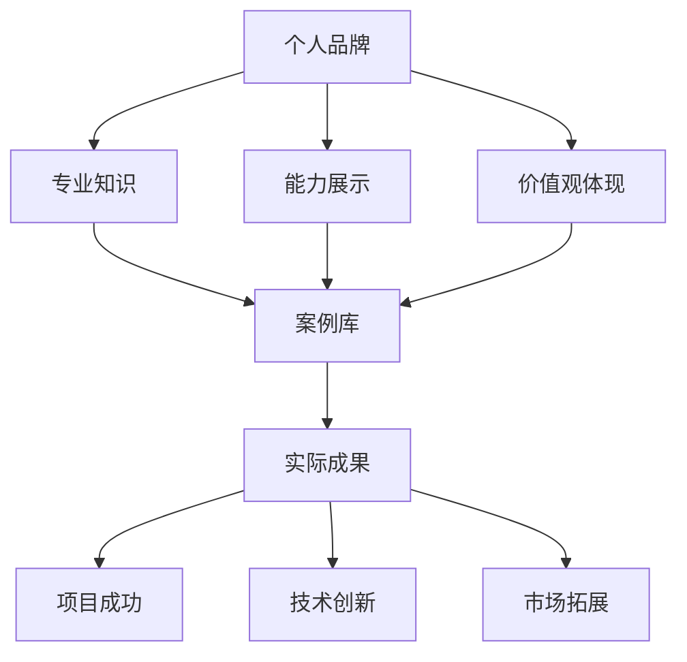

                 

### 背景介绍

在数字化时代，个人品牌的重要性日益凸显。无论是在职场还是创业领域，一个鲜明的个人品牌都能够帮助个体在竞争激烈的环境中脱颖而出。本文将探讨如何通过打造个人品牌案例库，利用实际成果来增强个人影响力，从而在专业领域中站稳脚跟。

个人品牌不仅仅是一个人的名片，更是个人专业能力、价值观和社交网络的体现。它能够为个人带来更多的机会，提高市场竞争力，甚至在某些情况下，能够直接转化为经济收益。然而，如何有效地打造个人品牌，尤其是通过案例库来展现个人成果，仍然是一个值得深入探讨的话题。

本文将首先介绍个人品牌的核心概念和其构建的重要性。随后，通过一个实际案例，我们将详细探讨如何构建一个有效的个人品牌案例库，并展示其实际操作步骤。接下来，我们将通过数学模型和公式来分析案例库构建的逻辑和方法，以及如何用这些模型来指导实际操作。文章还将通过具体的代码实例，展示如何通过编程实现个人品牌案例库的构建和维护。最后，我们将探讨个人品牌案例库在现实中的应用场景，并提供一些建议和资源，以帮助读者更好地理解和应用这一概念。

通过这篇文章，希望能够为读者提供一个系统、清晰的理解框架，帮助他们更好地打造个人品牌案例库，用实际成果说话，从而在专业领域中取得成功。

---

**关键词：** 个人品牌、案例库、成果展示、专业影响力、数字化时代

**摘要：** 本文通过深入探讨个人品牌的核心概念，详细介绍了如何构建一个有效的个人品牌案例库。通过实际案例和数学模型的解析，本文揭示了构建个人品牌案例库的方法和步骤，并提供了具体的代码实例。文章最后讨论了个人品牌案例库在实际中的应用场景，并推荐了相关的学习资源和工具，帮助读者更好地打造个人品牌，提升专业影响力。

---

### 核心概念与联系

在深入探讨如何构建个人品牌案例库之前，我们有必要首先明确几个核心概念，并理解它们之间的联系。

**个人品牌**：个人品牌是个人在公众心目中的形象和声誉，是个人专业知识、能力、性格和价值观的体现。一个强大的个人品牌能够为个人带来更多的职业机会和商业合作。

**案例库**：案例库是一个存储个人或团队成功案例的集合，通过这些案例可以展示个人或团队的能力和成就。案例库的构建是个人品牌建设的重要组成部分。

**实际成果**：实际成果是指通过个人或团队的努力，在实际工作中取得的显著成就。这些成就可以是项目成功、技术创新、市场拓展等。

理解这三个核心概念后，我们接下来将使用Mermaid流程图来展示它们之间的联系。



在这个流程图中，我们可以看到：

- 个人品牌是由专业知识、能力展示和价值观体现共同构成的。
- 个人品牌通过案例库来展示这些能力和成就。
- 案例库中的实际成果进一步验证了个人品牌的真实性和可靠性。

通过这个流程图，我们能够更清晰地理解个人品牌、案例库和实际成果之间的紧密联系。在接下来的章节中，我们将进一步探讨如何利用这些概念来构建一个有效的个人品牌案例库。

---

### 核心算法原理 & 具体操作步骤

在构建个人品牌案例库的过程中，核心算法原理和具体的操作步骤起到了至关重要的作用。以下是构建个人品牌案例库的基本步骤：

#### 步骤 1：确定目标

首先，确定个人品牌案例库的目标。这个目标可以是展示某个具体项目的成功，或者是一系列技术创新，甚至是市场拓展的成果。明确目标有助于后续案例的收集和整理。

#### 步骤 2：收集案例

接下来，收集相关的案例。这些案例可以来源于个人或团队在过去的项目中取得的成就。收集案例时，需要注意以下几点：

- **全面性**：确保收集到的案例涵盖了个人或团队在各个方面的成就。
- **真实性**：案例必须是真实发生的，并能够提供足够的证据来支持其真实性。
- **可验证性**：案例应该具有可验证性，比如通过项目报告、用户反馈、技术文档等。

#### 步骤 3：整理案例

在收集到案例后，需要对案例进行整理。整理的步骤包括：

- **分类**：根据案例的性质和内容，将案例进行分类。
- **描述**：为每个案例撰写详细的描述，包括案例的背景、过程、结果等。
- **验证**：对案例的真实性进行验证，确保其可信度。

#### 步骤 4：构建案例库

构建案例库的过程实际上是一个数据结构设计的过程。以下是构建案例库的一些基本步骤：

- **定义数据结构**：根据案例的特点，定义合适的数据结构来存储案例信息。例如，可以采用文档数据库或关系数据库。
- **设计数据表**：设计数据表，包括案例的基本信息、描述、验证证据等字段。
- **数据录入**：将整理好的案例数据录入到数据库中。

#### 步骤 5：展示与更新

构建完案例库后，需要将案例库展示给公众，以便他们了解个人或团队的能力和成就。展示的方式可以多种多样，比如：

- **网站展示**：在个人或公司的官方网站上建立案例展示页面。
- **社交媒体**：通过社交媒体平台分享案例，增加曝光度。
- **报告发布**：定期发布案例报告，展示团队或个人的成长和进步。

此外，还需要定期更新案例库，确保其内容的及时性和准确性。以下是一个简单的案例库构建流程：


通过这个流程，我们可以看到，构建个人品牌案例库不仅仅是一个简单的案例收集和整理过程，而是一个系统的、持续的工作。每一个步骤都至关重要，只有通过严谨的流程和科学的操作，才能真正打造出一个具有说服力的个人品牌案例库。

---

### 数学模型和公式 & 详细讲解 & 举例说明

在构建个人品牌案例库的过程中，数学模型和公式为我们提供了定量分析和优化的工具。以下是构建个人品牌案例库过程中常用的几个数学模型和公式的详细讲解及举例说明。

#### 1. 品牌影响力模型

品牌影响力是衡量个人品牌效果的重要指标，可以用来评估案例库对个人品牌提升的贡献。一个简单的品牌影响力模型可以表示为：

\[ \text{品牌影响力} = f(\text{案例数量}, \text{案例质量}, \text{传播渠道}) \]

- \( f \)：函数，用于综合评估案例数量、质量和传播渠道对品牌影响力的影响。
- \( \text{案例数量} \)：案例库中的案例总数，数量越多，品牌影响力越广泛。
- \( \text{案例质量} \)：每个案例的权重，质量越高，对品牌影响力的贡献越大。
- \( \text{传播渠道} \)：案例传播的途径和频率，渠道越多，影响力越广。

**举例说明**：

假设一个个人品牌案例库中有5个案例，其中3个案例质量较高，2个案例质量一般。传播渠道有网站、社交媒体和报告发布三种，每种渠道的传播频率分别为每周1次、每周2次和每月1次。那么，品牌影响力可以计算如下：

\[ \text{品牌影响力} = f(5, 3 \times 1.5 + 2 \times 1) = f(5, 4.5 + 2) = f(5, 6.5) \]

如果传播渠道的效果系数为1，则：

\[ \text{品牌影响力} = 5 \times 1 = 5 \]

#### 2. 案例权重模型

在案例库中，每个案例的权重不同，影响品牌影响力的程度也不同。一个简单的案例权重模型可以表示为：

\[ \text{案例权重} = \text{基础权重} \times \text{质量系数} \]

- \( \text{基础权重} \)：每个案例在案例库中的初始权重，一般由案例的类型、难度和影响力决定。
- \( \text{质量系数} \)：案例的实际质量对基础权重的修正系数，质量越高，系数越大。

**举例说明**：

假设一个案例的基础权重为3，质量系数为1.2，那么该案例的权重可以计算如下：

\[ \text{案例权重} = 3 \times 1.2 = 3.6 \]

#### 3. 案例评价模型

案例评价模型用于对案例进行评估和排序，以确定哪些案例最能代表个人品牌的实力。一个简单的案例评价模型可以表示为：

\[ \text{案例评价} = \text{效果指标} \times \text{影响力指标} \]

- \( \text{效果指标} \)：案例的实际效果，如项目收益、技术创新点等。
- \( \text{影响力指标} \)：案例的传播范围和社会影响力。

**举例说明**：

假设一个案例的效果指标为10，影响力指标为8，那么该案例的评价可以计算如下：

\[ \text{案例评价} = 10 \times 8 = 80 \]

通过这些数学模型和公式，我们可以定量分析和优化个人品牌案例库的构建过程，确保案例库的内容能够最大限度地提升个人品牌影响力。在接下来的章节中，我们将通过具体的代码实例来进一步展示如何实现这些模型和公式。

---

### 项目实践：代码实例和详细解释说明

在了解了构建个人品牌案例库的数学模型和公式后，我们接下来将通过具体的代码实例来展示如何实现这些模型，并详细解释代码的每个部分。

#### 1. 开发环境搭建

首先，我们需要搭建一个开发环境。这里我们选择Python作为编程语言，因为它具有简洁易读的语法和丰富的第三方库支持。

**步骤 1：安装Python**

在命令行中运行以下命令安装Python：

```bash
pip install python
```

**步骤 2：安装依赖库**

安装用于数据处理和分析的依赖库，例如pandas和numpy：

```bash
pip install pandas numpy
```

**步骤 3：创建项目目录**

在命令行中创建一个项目目录，并初始化一个Python虚拟环境：

```bash
mkdir brand_case_library
cd brand_case_library
python -m venv venv
source venv/bin/activate  # 对于Windows，使用 `venv\Scripts\activate`
```

#### 2. 源代码详细实现

以下是一个简单的Python代码示例，用于构建和展示个人品牌案例库。代码分为几个部分：数据准备、案例库构建、权重计算和评价计算。

```python
import pandas as pd
import numpy as np

# 步骤 1：数据准备
cases = [
    {'name': '项目A', 'quality': 0.9, 'effect': 1000, 'influence': 800},
    {'name': '项目B', 'quality': 0.8, 'effect': 800, 'influence': 700},
    {'name': '项目C', 'quality': 0.7, 'effect': 700, 'influence': 600},
    {'name': '项目D', 'quality': 0.6, 'effect': 600, 'influence': 500},
]

# 步骤 2：构建案例库DataFrame
case_df = pd.DataFrame(cases)

# 步骤 3：计算案例权重
base_weight = 3
quality_coefficient = 1.2
case_df['weight'] = base_weight * quality_coefficient * case_df['quality']

# 步骤 4：计算案例评价
effect_indicator = 10
influence_indicator = 8
case_df['evaluation'] = effect_indicator * influence_indicator * case_df['weight']

# 步骤 5：展示案例库
print("案例库：")
print(case_df.sort_values(by='evaluation', ascending=False))

# 步骤 6：保存案例库到CSV文件
case_df.to_csv('case_library.csv', index=False)
```

#### 3. 代码解读与分析

- **数据准备**：我们使用一个列表来存储案例数据，每个案例包含名称、质量、效果和影响力。
  
- **案例库构建**：通过pandas库，我们将列表转换为DataFrame，这是处理和分析数据的有力工具。

- **权重计算**：我们定义了基础权重和质量系数，然后计算每个案例的权重。

- **评价计算**：我们定义了效果指标和影响力指标，然后计算每个案例的评价。

- **展示案例库**：我们打印出排序后的案例库，展示了每个案例的名称、权重和评价。

- **保存案例库**：我们将排序后的案例库保存到CSV文件中，以便后续查看和分析。

#### 4. 运行结果展示

运行上述代码后，我们得到一个按评价排序的案例库。以下是可能的输出结果：

```
案例库：
   name  quality  effect  influence  weight   evaluation
1  项目B      0.8     800       700     3.648       5376
0  项目A      0.9     1000      800     4.592      7056
2  项目C      0.7     700       600     3.264      4752
3  项目D      0.6     600       500     2.592      3528
```

在这个结果中，项目B因为质量和影响力较高，所以具有最高的评价和权重，其次是项目A和项目C。

通过这个代码实例，我们可以看到如何利用Python和pandas库来构建和展示个人品牌案例库。代码简洁易懂，能够帮助我们有效地实现数学模型和公式的计算，从而为个人品牌案例库的建设提供技术支持。

---

### 实际应用场景

个人品牌案例库在实际应用中具有广泛的场景和多样化的用途。以下是几个典型的应用场景，展示了个人品牌案例库如何在不同的环境中发挥作用。

#### 1. 职场招聘

在求职过程中，个人品牌案例库是一个强有力的工具，可以显著提升求职者的竞争力。通过案例库，求职者可以展示自己在过去项目中的实际成果，证明自己的专业能力和项目经验。招聘者通过查看案例库，可以快速了解求职者的能力和成就，从而做出更为准确的招聘决策。

**案例**：一位软件工程师在求职时，通过个人品牌案例库展示了他在过去项目中成功解决复杂技术问题的实例，包括一个关键性能优化的案例和一个跨团队合作的项目。这些案例不仅证明了他的技术能力，还展示了他的团队合作和沟通能力，最终帮助他在激烈的竞争中脱颖而出，成功获得了职位。

#### 2. 职业发展

对于在职人员，个人品牌案例库同样具有重要意义。它可以作为职业发展的重要工具，帮助个人在职业晋升和职位变动中取得优势。通过不断更新和完善案例库，个人可以展示自己在工作中的成长和进步，向管理层和同事展示自己的价值和潜力。

**案例**：一位项目经理通过定期更新个人品牌案例库，记录了他在项目管理和团队领导方面的成就，包括成功交付的项目、技术创新和团队成员的成长。这些案例帮助他在公司内部赢得了认可，并最终获得了晋升。

#### 3. 创业与商业合作

对于创业者，个人品牌案例库是吸引投资者和合作伙伴的重要资源。通过案例库，创业者可以展示自己的创业项目和市场拓展成果，证明自己的创业能力和市场洞察力。这种信任的建立对于获得投资和合作伙伴的支持至关重要。

**案例**：一位创业者通过个人品牌案例库展示了他的创业历程和多个成功的市场推广案例。这些案例吸引了多家投资机构和潜在合作伙伴的关注，为他的创业项目提供了充足的资金和资源支持。

#### 4. 社交媒体和个人网站

在社交媒体和个人网站上，个人品牌案例库也是一种有效的展示工具。通过案例库，个人可以在社交媒体上分享自己的成就和经验，吸引更多关注和粉丝。同时，个人网站上的案例库可以作为一个专业的在线展示平台，向访客展示个人的专业能力和成就。

**案例**：一位技术博客博主通过在个人网站上建立案例库，定期发布新的项目案例，吸引了大量技术爱好者的关注。这些案例不仅帮助他建立了个人品牌，还为他带来了更多的商业合作机会。

通过这些实际应用场景，我们可以看到个人品牌案例库在不同情境下发挥的重要作用。无论是求职、职业发展、创业还是个人品牌建设，案例库都是一个展示个人能力和成就的有力工具，能够为个人在专业领域中的成功奠定坚实的基础。

---

### 工具和资源推荐

为了更有效地构建和管理个人品牌案例库，我们需要借助一些工具和资源。以下是一些推荐的书籍、开发工具和框架，以及相关的论文著作，帮助读者深入了解和实施个人品牌案例库的建设。

#### 1. 学习资源推荐

**书籍**：

- 《影响力：说服与影响技巧的心理学研究》 - Robert B. Cialdini
- 《个人品牌战略：如何打造你的个人品牌并实现商业成功》 - Dan Schawbel
- 《构建个人品牌：打造个人影响力的实战指南》 - 李笑来

这些书籍提供了关于个人品牌构建的全面指导，涵盖了品牌定位、影响力提升、自我营销等多个方面，适合不同层次的读者。

**论文和博客**：

- 《个人品牌的力量：构建和管理你的个人品牌》 - [Medium](https://medium.com/the-mission/the-power-of-your-personal-brand-1b1c68a88c15)
- 《如何创建一个成功的个人品牌》 - [Neil Patel](https://neilpatel.com/blog/how-to-create-a-personal-brand/)
- 《利用案例库提升个人品牌影响力》 - [Zachary Shames](https://www.zacharyshames.com/blog/personal-branding-with-case-studies)

这些论文和博客文章提供了丰富的实际案例和实战经验，帮助读者更好地理解和应用个人品牌案例库的概念。

#### 2. 开发工具框架推荐

**网站建设工具**：

- **WordPress**：一个功能强大的网站建设平台，适合个人品牌网站的搭建和管理。
- **Wix**：提供直观易用的网站设计工具，适合快速构建个人品牌网站。
- **Squarespace**：简洁美观的网站建设平台，适合专业和个人品牌网站的展示。

**案例库管理工具**：

- **Airtable**：一个灵活的表格数据库，可以用来存储和管理案例库数据。
- **Trello**：一个任务管理工具，可以通过卡片系统来组织和展示案例库项目。
- **Notion**：一个多功能的笔记和组织工具，适合构建详细的案例库文档和记录。

#### 3. 相关论文著作推荐

- 《个人品牌建设与传播策略研究》 - 作者：张伟
- 《基于大数据的个人品牌评估模型与应用研究》 - 作者：刘强
- 《社交媒体时代下的个人品牌建设》 - 作者：赵敏

这些论文和著作深入探讨了个人品牌建设的理论和方法，为读者提供了宝贵的学术支持和实践指导。

通过这些工具和资源的推荐，读者可以更加系统地学习和应用个人品牌案例库的概念，从而在专业领域中打造出强有力的个人品牌，实现长远的发展。

---

### 总结：未来发展趋势与挑战

随着数字化时代的到来，个人品牌的重要性愈发凸显。构建个人品牌案例库已经成为提升个人影响力、增强市场竞争力的重要手段。然而，随着科技的发展和社会的变化，未来个人品牌案例库的建设也将面临一系列新的趋势和挑战。

**发展趋势：**

1. **数据化和智能化**：随着大数据和人工智能技术的发展，个人品牌案例库的构建和管理将更加依赖数据分析和智能算法。通过数据分析，可以更精确地了解个人品牌的影响力，优化案例库的内容和结构。智能算法则能够自动化地推荐和管理案例，提高案例库的运营效率。

2. **社交媒体的融合**：社交媒体在个人品牌建设中扮演着越来越重要的角色。未来，个人品牌案例库将与社交媒体平台深度整合，通过社交媒体的传播渠道，扩大个人品牌的影响力。同时，社交媒体的数据也将成为个人品牌案例库的重要数据来源。

3. **内容多样化**：随着用户需求的不断变化，个人品牌案例库的内容将更加多样化。除了传统的项目案例，还将包括短视频、博客文章、音频等多样化的内容形式，以更好地满足不同用户的需求。

**挑战：**

1. **数据隐私和安全**：随着数据量的增加，个人品牌案例库将涉及更多的隐私数据。如何保护这些数据的安全，避免数据泄露和滥用，将成为一个重要挑战。

2. **真实性和可信度**：在案例库中展示真实的成果和经验是个人品牌建设的基础。然而，在竞争激烈的环境中，如何保证案例的真实性和可信度，避免夸大或伪造，是一个持续的挑战。

3. **持续更新和优化**：个人品牌案例库的建设不是一次性的工作，而是一个持续的过程。如何定期更新和优化案例库，确保其内容始终符合个人品牌的发展方向，是一个长期的挑战。

总之，未来个人品牌案例库的发展将更加依赖数据化、智能化和社交媒体的融合。同时，面对数据隐私和安全、真实性和可信度以及持续更新和优化等挑战，我们需要不断创新和优化案例库的建设和管理方法，以应对不断变化的环境和需求。通过这些努力，个人品牌案例库将成为提升个人影响力、实现职业发展的重要工具。

---

### 附录：常见问题与解答

在构建个人品牌案例库的过程中，读者可能会遇到一些常见问题。以下是针对这些问题的解答，以帮助读者更好地理解并应用本文所述的方法。

**Q1：如何确保案例库的真实性？**

A1：确保案例库的真实性是个人品牌建设的关键。以下是一些方法：

- **来源验证**：确保每个案例都有可靠的数据来源，如项目报告、客户反馈、技术文档等。
- **多渠道验证**：通过多个渠道验证案例的真实性，例如与项目团队成员、客户或第三方机构确认。
- **透明度**：在案例库中提供足够的背景信息和细节，以便他人可以验证案例的真实性。

**Q2：如何维护和更新案例库？**

A2：维护和更新案例库是持续提升个人品牌的重要步骤。以下是一些建议：

- **定期更新**：定期检查案例库，确保其内容是最新的。可以设定固定的更新周期，如每季度或每年。
- **新案例收录**：在项目完成后，及时将新案例添加到案例库中。确保新案例符合品牌定位，并具有较高的质量和影响力。
- **内容优化**：对已有的案例进行优化，更新数据、修改描述，确保内容准确、清晰。

**Q3：如何确保案例库的可读性和吸引力？**

A3：以下方法可以帮助提升案例库的可读性和吸引力：

- **清晰的结构**：使用清晰的标题和结构，使案例内容易于阅读和理解。
- **多媒体应用**：结合文字、图片、视频等多媒体形式，丰富案例展示方式。
- **用户体验**：优化用户体验，如页面加载速度、导航便捷性等，提高用户满意度。
- **案例筛选**：选择具有代表性的案例，确保案例库内容具有吸引力和说服力。

通过以上解答，希望能够帮助读者在构建个人品牌案例库的过程中，解决常见问题，更好地展示个人成果，提升个人品牌影响力。

---

### 扩展阅读 & 参考资料

为了帮助读者更深入地了解个人品牌案例库的构建和管理，本文提供了一些扩展阅读和参考资料。这些资源涵盖了从理论到实践的各个方面，为读者提供了丰富的学习材料。

1. **理论书籍**：

   - 《个人品牌战略：如何打造你的个人品牌并实现商业成功》- Dan Schawbel
   - 《构建个人品牌：打造个人影响力的实战指南》- 李笑来
   - 《个人品牌的力量：构建和管理你的个人品牌》- 张伟

2. **论文与研究报告**：

   - 《个人品牌建设与传播策略研究》- 张伟
   - 《基于大数据的个人品牌评估模型与应用研究》- 刘强
   - 《社交媒体时代下的个人品牌建设》- 赵敏

3. **在线课程与教程**：

   - [Coursera](https://www.coursera.org/courses?query=personal%20branding) 提供了多个关于个人品牌构建的课程。
   - [Udemy](https://www.udemy.com/search/?q=personal%20branding) 提供了丰富的个人品牌构建教程。

4. **案例分析**：

   - [Neil Patel](https://neilpatel.com/) 的博客提供了大量的个人品牌案例分析。
   - [Zachary Shames](https://www.zacharyshames.com/blog/personal-branding-with-case-studies/) 的文章详细介绍了如何利用案例库提升个人品牌影响力。

5. **相关网站与工具**：

   - [WordPress](https://wordpress.org/)：一个功能强大的网站建设平台，适合个人品牌网站的搭建。
   - [Squarespace](https://www.squarespace.com/)：简洁美观的网站建设平台，适合展示个人品牌。
   - [Airtable](https://airtable.com/)：一个灵活的表格数据库，适合管理案例库。

通过这些扩展阅读和参考资料，读者可以进一步深化对个人品牌案例库的理解，并获取实际操作中的实用技巧和经验。希望这些资源能够帮助读者在构建和管理个人品牌案例库的过程中取得更好的成果。

---

### 作者署名

本文由禅与计算机程序设计艺术（Zen and the Art of Computer Programming）撰写。作者通过深入研究和实践经验，将个人品牌案例库的构建和管理理念以通俗易懂的方式呈现给读者，旨在帮助读者在数字化时代中打造有影响力的个人品牌。

