                 

### 背景介绍 Background

在现代软件开发领域，随着技术的高速发展，程序员面临着不断更新的技术栈和快速变化的项目需求。在这种环境下，如何提升个人竞争力、保持持续的学习和进步，成为了每个程序员都必须面对的挑战。一个强有力的个人知识库，不仅能帮助程序员更好地管理和利用已有知识，还能在快速变化的技术浪潮中站稳脚跟。

个人知识库，简单来说，就是一个系统化的知识管理体系，它包括个人所学、所知、所用的一切信息。对于程序员来说，个人知识库不仅仅是一个文档收藏夹，更是一个能够支持自我学习和项目实践的综合性工具。通过构建个人知识库，程序员可以实现以下目标：

1. **知识整合**：将散落在不同文档、笔记、项目中零散的知识点整合起来，形成一套系统化的知识体系。
2. **快速检索**：在任何需要的时候，能够快速找到所需的知识点，提高工作效率。
3. **持续学习**：通过知识库的维护和更新，不断吸收新的知识，保持技术领先。
4. **知识传承**：将个人经验和技术积累传递给他人，促进团队知识的共享和提升。

本文旨在探讨如何打造一个有效的个人知识库，并通过具体的方法和工具，帮助程序员提升核心竞争力和工作效率。接下来的章节将逐步深入，首先介绍个人知识库的核心概念与联系，然后详细讲解核心算法原理和具体操作步骤，最终结合实际项目实践，展示知识库在实际中的应用和价值。

### 核心概念与联系 Core Concepts and Relationships

为了更好地理解和构建个人知识库，我们需要首先明确几个核心概念及其相互关系。以下是构建个人知识库所需理解的关键概念及其相互关系。

#### 概念一：知识分类 Knowledge Classification

知识分类是构建个人知识库的第一步，它有助于我们清晰地理解和管理不同类型的知识。以下是几种常见知识分类方法：

1. **技术知识**：包括编程语言、框架、数据库、算法等具体的技术细节。
2. **业务知识**：关于特定行业、公司或项目的业务逻辑和流程。
3. **软技能**：沟通、团队合作、项目管理等非技术性的技能。
4. **学习资源**：书籍、论文、在线课程等可以用于学习的资源。

#### 概念二：知识存储 Knowledge Storage

知识存储是个人知识库的核心功能，它决定了我们如何有效地管理和访问知识。以下是一些常见的知识存储方法：

1. **文档**：使用文本文件或Markdown文件记录知识点，便于编辑和分享。
2. **数据库**：利用关系型数据库或NoSQL数据库存储结构化数据。
3. **笔记应用**：如Evernote、OneNote等，提供丰富的文本、图片、音频等多媒体存储功能。
4. **版本控制系统**：如Git，用于管理代码和文档的版本历史。

#### 概念三：知识检索 Knowledge Retrieval

知识检索是实现快速查找所需知识的关键，它直接影响到我们的工作效率。以下是几种常见的知识检索方法：

1. **关键词搜索**：通过关键词快速定位到相关的知识点。
2. **标签分类**：使用标签对知识进行分类，便于按类别检索。
3. **全文搜索**：对文档内容进行全文搜索，找到包含特定内容的文档。
4. **自然语言处理**：利用NLP技术对文本内容进行分析，实现更加智能的搜索。

#### 概念四：知识共享 Knowledge Sharing

知识共享是个人知识库的一个高级功能，它有助于我们与他人分享知识和经验，促进团队协作和知识传承。以下是几种常见的知识共享方法：

1. **文档共享**：通过云存储或共享文件夹，与他人共享知识库中的文档。
2. **在线讨论**：在论坛、博客或知识库中创建讨论区，与他人交流心得。
3. **培训与讲座**：定期举办内部培训或讲座，分享个人知识和经验。
4. **代码托管平台**：如GitHub，不仅用于代码托管，也可以分享和学习他人项目的知识。

#### 概念五：知识更新 Knowledge Update

知识更新是保持个人知识库活力和准确性的关键。以下是几种常见的知识更新方法：

1. **定期回顾**：定期回顾和更新知识库中的内容，确保信息的准确性。
2. **自动同步**：利用云存储服务的自动同步功能，保持知识库的实时更新。
3. **外部链接**：将知识库中的知识点与外部资源链接，便于获取最新信息。
4. **版本控制**：使用版本控制系统记录每次更新的历史，方便追溯和恢复。

通过以上核心概念及其相互关系的介绍，我们可以更好地理解个人知识库的构建和管理。接下来，我们将深入探讨如何实现这些概念，并构建一个高效的个人知识库系统。

#### 核心概念与关系的 Mermaid 流程图 Mermaid Flowchart of Core Concepts and Relationships

下面是构建个人知识库所需理解的关键概念及其相互关系的 Mermaid 流程图，以便更直观地展示这些概念之间的关系。

```mermaid
graph TD
    A[知识分类] --> B{技术知识}
    A --> C{业务知识}
    A --> D{软技能}
    A --> E{学习资源}
    B --> F{编程语言}
    B --> G{框架}
    B --> H{数据库}
    B --> I{算法}
    C --> J{行业知识}
    C --> K{公司业务}
    D --> L{沟通}
    D --> M{团队合作}
    D --> N{项目管理}
    E --> O{书籍}
    E --> P{论文}
    E --> Q{在线课程}
    F --> R{Python}
    F --> S{Java}
    F --> T{JavaScript}
    G --> U{Spring Boot}
    G --> V{React}
    G --> W{Node.js}
    H --> X{MySQL}
    H --> Y{MongoDB}
    H --> Z{PostgreSQL}
    I --> AA{排序算法}
    I --> BB{搜索算法}
    I --> CC{图算法}
    J --> DD{金融知识}
    J --> EE{电商知识}
    K --> FF{产品管理}
    K --> GG{市场营销}
    L --> HH{有效沟通}
    L --> II{非暴力沟通}
    M --> JJ{团队协作}
    M --> KK{敏捷开发}
    N --> LL{项目规划}
    N --> MM{风险管理}
    O --> NN{技术书籍}
    O --> OO{管理书籍}
    P --> PP{学术论文}
    P --> QQ{行业报告}
    Q --> RR{MOOC课程}
    Q --> SS{讲座视频}
    R --> TT{Python实战}
    R --> UU{Java核心技术}
    R --> VV{JavaScript高级程序设计}
    S --> WW{Java Web开发}
    S --> XX{Spring Framework}
    S --> YY{Hibernate}
    T --> ZZ{React教程}
    T --> AAA{Vue.js实战}
    T --> BBB{Angular教程}
    U --> CCC{Spring Boot实战}
    U --> DDD{Spring Cloud微服务}
    V --> EEE{React Router}
    V --> FFF{Redux入门}
    V --> GGG{Next.js开发实战}
    W --> HHH{Node.js实战}
    W --> III{Express框架}
    W --> JJJ{MongoDB与Node.js}
    X --> KKK{MySQL实战}
    X --> LLL{PostgreSQL入门}
    X --> MMM{数据库性能优化}
    Y --> NNN{MongoDB实战}
    Y --> OOO{MongoDB设计模式}
    Y --> PPP{MongoDB性能调优}
    Z --> QQ{图算法教程}
    Z --> RRR{算法面试宝典}
    Z --> SSS{算法竞赛指南}
    DD --> TTT{金融应用场景}
    EE --> UUU{电商业务流程}
    FF --> VVV{产品经理手册}
    GG --> XXX{市场营销策略}
    HH --> YYY{沟通技巧实战}
    II --> ZZZ{非暴力沟通实践}
    JJ --> AAAA{团队协作工具}
    KK --> BBBB{敏捷开发实践}
    LL --> CCCD{项目规划案例}
    MM --> DDDD{风险管理方法}
    NN --> EEEE{技术书籍推荐}
    OO --> FFFG{管理书籍推荐}
    PP --> GGGH{学术论文精选}
    QQ --> HHHI{行业报告解析}
    RR --> IIJJ{MOOC课程推荐}
    SS --> JJJK{讲座视频精选}
    TT --> KKLL{Python实战案例}
    UU --> MMMM{Java核心技术解析}
    VV --> NNNN{JavaScript实战}
    WW --> OOOO{Java Web项目实战}
    XX --> PPPP{Spring Framework教程}
    YY --> QQQR{Hibernate应用实例}
    ZZ --> SSSS{React项目实战}
    AAA --> TTTT{Vue.js项目实战}
    BBB --> UUUU{Angular项目实战}
    CCC --> VVVV{Spring Boot项目实战}
    DDD --> XXXX{Spring Cloud案例}
    EEE --> YYYY{React Router案例}
    FFF --> ZZZZ{Redux实践}
    GGG --> AAAA{Next.js实战案例}
    HHH --> BBBB{Node.js实战}
    III --> CCCD{Express框架实战}
    JJJ --> DDDD{MongoDB与Node.js项目}
    KKK --> EEEE{MySQL实战案例}
    LLL --> FFFF{PostgreSQL应用实例}
    MMM --> GGGG{数据库性能优化案例}
    NNN --> HHHH{MongoDB实战项目}
    OOO --> IIIII{MongoDB设计模式案例}
    PPP --> JJJK{MongoDB性能调优实战}
    QQ --> KKKK{图算法应用案例}
    RRR --> LLLM{算法面试题解析}
    SSS --> MMMM{算法竞赛案例分析}
    TTT --> NNNN{金融领域应用}
    UUU --> OOOO{电商业务实战}
    VVV --> PPPP{产品管理实战}
    WWW --> QQQQ{市场营销案例}
    XXX --> SSSS{沟通技巧实战}
    YYY --> TTTT{非暴力沟通案例}
    ZZZ --> UUUU{团队协作工具实战}
    AAAA --> VVVV{敏捷开发案例}
    BBBB --> XXXX{项目规划实战}
    CCCD --> YYYYY{风险管理案例}
    DDDD --> ZZZZ{代码库与知识库管理}
```



通过这张 Mermaid 流程图，我们可以清晰地看到知识分类、知识存储、知识检索、知识共享和知识更新这些核心概念之间的相互关系。每一个节点都代表了某个具体的知识点或工具，它们通过不同的方法相互联系，共同构建了一个完整的个人知识库系统。

### 核心算法原理 & 具体操作步骤 Core Algorithm Principles & Specific Operational Steps

在构建个人知识库的过程中，算法起到了至关重要的作用。算法不仅是知识库中存储信息的方式，也是实现知识检索、分析和共享的核心手段。以下将详细讲解个人知识库中常用的核心算法原理及其具体操作步骤。

#### 1. 排序算法 Sorting Algorithms

排序算法是个人知识库中最基础也最重要的算法之一，它用于将知识库中的信息按照特定的顺序排列，便于检索和使用。

**原理：**

排序算法有多种，如快速排序（Quick Sort）、归并排序（Merge Sort）、堆排序（Heap Sort）等。这里以快速排序为例进行讲解。

**具体操作步骤：**

1. **选择基准**：在数据集合中随机选择一个元素作为基准。
2. **分区**：将数据集合分为两部分，一部分是小于基准的元素，另一部分是大于基准的元素。
3. **递归排序**：对小于和大于基准的两部分数据分别进行快速排序。

**代码示例：**

```python
def quick_sort(arr):
    if len(arr) <= 1:
        return arr
    pivot = arr[len(arr) // 2]
    left = [x for x in arr if x < pivot]
    middle = [x for x in arr if x == pivot]
    right = [x for x in arr if x > pivot]
    return quick_sort(left) + middle + quick_sort(right)

# 示例
arr = [3, 6, 8, 10, 1, 2, 1]
sorted_arr = quick_sort(arr)
print(sorted_arr)
```

#### 2. 搜索算法 Searching Algorithms

搜索算法用于在知识库中查找特定信息，常见的方法有线性搜索（Linear Search）和二分搜索（Binary Search）。

**原理：**

- **线性搜索**：逐个检查知识库中的每个元素，直到找到目标元素或遍历整个知识库。
- **二分搜索**：在已排序的知识库中，通过不断将搜索范围缩小一半，逐步逼近目标元素。

**具体操作步骤：**

1. **线性搜索**：
   - 初始化起始位置和目标值。
   - 逐个比较当前位置的值与目标值，直到找到目标或到达知识库末尾。

2. **二分搜索**：
   - 初始化搜索范围的起始和结束位置。
   - 计算中间位置，比较中间位置的值与目标值。
   - 根据比较结果，调整搜索范围的起始或结束位置，继续搜索。

**代码示例：**

```python
# 线性搜索
def linear_search(arr, target):
    for i in range(len(arr)):
        if arr[i] == target:
            return i
    return -1

# 二分搜索
def binary_search(arr, target):
    left, right = 0, len(arr) - 1
    while left <= right:
        mid = (left + right) // 2
        if arr[mid] == target:
            return mid
        elif arr[mid] < target:
            left = mid + 1
        else:
            right = mid - 1
    return -1

# 示例
arr = [1, 2, 3, 4, 5, 6, 7, 8, 9]
target = 6
print(linear_search(arr, target))  # 输出：5
print(binary_search(arr, target))  # 输出：5
```

#### 3. 索引构建 Index Building

索引构建是提高知识库检索效率的重要手段，它通过创建索引结构，使得数据检索更加迅速。

**原理：**

索引是一种数据结构，用于快速查找特定信息。常见的索引有B树索引、哈希索引等。

**具体操作步骤：**

1. **创建索引**：在数据库或文档系统中创建索引，指定索引列。
2. **更新索引**：当数据发生变化时，更新索引，确保索引与数据一致。
3. **使用索引**：在查询时使用索引，加快查询速度。

**代码示例：**

```python
# 假设使用MySQL数据库
CREATE INDEX index_name ON table_name (column_name);

# 更新索引
ALTER TABLE table_name ADD INDEX index_name (column_name);

# 使用索引
SELECT * FROM table_name WHERE column_name = 'value' USING INDEX (index_name);
```

#### 4. 数据分片 Data Sharding

随着知识库的规模不断扩大，单一数据库可能无法满足性能和可扩展性的需求。数据分片是将数据分散存储到多个数据库或表中的方法。

**原理：**

数据分片通过将数据集分割成较小的片段，分布在多个存储节点上，从而提高查询效率和处理能力。

**具体操作步骤：**

1. **确定分片策略**：根据数据特点选择合适的分片策略，如基于范围分片、哈希分片等。
2. **实施分片**：将数据按照分片策略分配到不同的存储节点。
3. **分片查询**：在查询时，将查询条件拆分为多个子查询，针对每个分片执行查询，最后合并结果。

**代码示例：**

```python
# 假设使用ShardingSphere进行数据分片
SHARDING_TABLES('t_order', 1024);
SHARDING_COLUMN('t_order', 'order_id');
```

通过以上核心算法原理及其具体操作步骤的讲解，我们可以更好地理解和应用这些算法，从而构建一个高效、可靠的个人知识库系统。

### 数学模型和公式 & 详细讲解 & 举例说明 Mathematical Models & Formulas & Detailed Explanations & Example Illustrations

在构建个人知识库时，数学模型和公式是帮助我们理解和操作数据的重要工具。本文将介绍几个在知识库构建中常用的数学模型和公式，并通过具体例子详细讲解其应用。

#### 1. 概率论 Probability Theory

概率论在知识库中用于评估数据的可靠性和不确定性，常见的概率模型有伯努利分布、正态分布等。

**伯努利分布 Bernoulli Distribution**

伯努利分布描述了一个二项试验成功的概率。设\( p \)为成功的概率，\( q = 1 - p \)为失败的概率。

**公式：**
\[ P(X = k) = C_n^k p^k q^{n-k} \]
其中，\( n \)为试验次数，\( k \)为成功次数。

**例子：**

假设一个程序员在50次代码审查中，有20次发现错误，计算其成功率的95%置信区间。

\[ n = 50, k = 20, p = \frac{k}{n} = \frac{20}{50} = 0.4 \]

使用正态近似法计算95%置信区间：

\[ \mu = np = 50 \times 0.4 = 20 \]
\[ \sigma = \sqrt{npq} = \sqrt{50 \times 0.4 \times 0.6} \approx 3.464 \]

\[ \mu \pm z_{0.975} \times \sigma = 20 \pm 1.96 \times 3.464 = [11.48, 28.52] \]

因此，成功率的95%置信区间为\[11.48\%, 28.52\%\]。

**正态分布 Normal Distribution**

正态分布描述了数据在某个范围内的概率分布情况，其公式为：

\[ f(x|\mu,\sigma^2) = \frac{1}{\sqrt{2\pi\sigma^2}} e^{-\frac{(x-\mu)^2}{2\sigma^2}} \]

**例子：**

假设一个项目的完成时间服从正态分布，均值\( \mu = 10 \)天，标准差\( \sigma = 2 \)天。计算项目在15天内完成的概率。

\[ P(X \leq 15) = \Phi\left(\frac{15-10}{2}\right) = \Phi(2.5) \approx 0.9938 \]

因此，项目在15天内完成的概率约为99.38%。

#### 2. 信息论 Information Theory

信息论用于衡量信息的不确定性和传输效率，常用的公式有熵（Entropy）、信息增益（Information Gain）等。

**熵 Entropy**

熵用于衡量一个随机变量的不确定性，其公式为：

\[ H(X) = -\sum_{i=1}^{n} p(x_i) \log_2 p(x_i) \]

**例子：**

假设一个随机变量\( X \)有两个可能的取值，0和1，其概率分别为0.6和0.4，计算其熵。

\[ H(X) = -0.6 \log_2 0.6 - 0.4 \log_2 0.4 \approx 0.97095 \]

**信息增益 Information Gain**

信息增益用于衡量特征对于分类的重要性，其公式为：

\[ IG(D, A) = H(D) - H(D|A) \]

**例子：**

假设一个数据集\( D \)有100个样本，其中60个属于类别A，40个属于类别B。数据集中有一个特征\( A \)，其中30个样本为0，70个样本为1。计算特征\( A \)的信息增益。

\[ H(D) = -0.6 \log_2 0.6 - 0.4 \log_2 0.4 \approx 0.97095 \]
\[ H(D|A=0) = -0.6 \log_2 0.6 - 0.4 \log_2 0.4 \approx 0.97095 \]
\[ H(D|A=1) = -0.3 \log_2 0.3 - 0.7 \log_2 0.7 \approx 0.83273 \]
\[ IG(D, A) = 0.97095 - (0.6 \times 0.97095 + 0.4 \times 0.83273) \approx 0.13722 \]

因此，特征\( A \)的信息增益为0.13722。

#### 3. 线性回归 Linear Regression

线性回归用于建立自变量和因变量之间的线性关系，其公式为：

\[ Y = \beta_0 + \beta_1 X + \varepsilon \]

**例子：**

假设我们有一个数据集，其中自变量\( X \)为用户年龄，因变量\( Y \)为用户收入。数据如下表所示：

| 年龄（X） | 收入（Y） |
| :-------: | :-------: |
|    25     |   50000   |
|    30     |   60000   |
|    35     |   70000   |
|    40     |   80000   |
|    45     |   90000   |

计算线性回归模型，预测一个35岁用户的收入。

首先计算均值：

\[ \bar{X} = \frac{\sum_{i=1}^{n} X_i}{n} = \frac{25 + 30 + 35 + 40 + 45}{5} = 35 \]
\[ \bar{Y} = \frac{\sum_{i=1}^{n} Y_i}{n} = \frac{50000 + 60000 + 70000 + 80000 + 90000}{5} = 70000 \]

计算回归系数：

\[ \beta_1 = \frac{\sum_{i=1}^{n} (X_i - \bar{X})(Y_i - \bar{Y})}{\sum_{i=1}^{n} (X_i - \bar{X})^2} \approx 0.375 \]
\[ \beta_0 = \bar{Y} - \beta_1 \bar{X} = 70000 - 0.375 \times 35 \approx 69625 \]

因此，线性回归模型为：

\[ Y \approx 69625 + 0.375X \]

预测35岁用户的收入：

\[ Y \approx 69625 + 0.375 \times 35 \approx 70000 \]

因此，一个35岁用户的收入预计为70000元。

通过上述数学模型和公式的详细讲解，我们可以更好地理解和应用它们来优化个人知识库的构建和管理。

### 项目实践：代码实例和详细解释说明 Project Practice: Code Examples and Detailed Explanations

在本章节中，我们将结合一个实际项目，详细展示如何构建和运用个人知识库。这个项目是一个简单的博客系统，用于记录程序员的学习心得和技术文章。通过以下步骤，我们将搭建一个基本的博客系统，并讲解其中的核心代码实现。

#### 1. 开发环境搭建 Development Environment Setup

首先，我们需要搭建项目的开发环境。以下是所需的软件和工具：

- 操作系统：Linux或MacOS
- 编程语言：Python 3.x
- Web框架：Flask
- 数据库：SQLite
- 代码版本管理：Git

安装步骤：

1. 安装Python 3.x：
   - 使用包管理器如apt或brew安装Python 3.x。

2. 安装Flask：
   - 打开终端，执行命令`pip install Flask`。

3. 安装SQLite：
   - SQLite通常已经预装在大多数Linux发行版和MacOS上。

4. 安装Git：
   - 使用包管理器安装Git，如`sudo apt-get install git`。

#### 2. 源代码详细实现 Source Code Implementation

下面是项目的源代码实现，包括模型定义、视图函数和路由配置。

**app.py**：主应用程序

```python
from flask import Flask, render_template, request, redirect, url_for
from models import Post

app = Flask(__name__)

# 数据库配置
app.config['SQLALCHEMY_DATABASE_URI'] = 'sqlite:///blog.db'
app.config['SQLALCHEMY_TRACK_MODIFICATIONS'] = False

from flask_sqlalchemy import SQLAlchemy
db = SQLAlchemy(app)

# 博客模型
class Post(db.Model):
    id = db.Column(db.Integer, primary_key=True)
    title = db.Column(db.String(100))
    content = db.Column(db.Text)

@app.route('/')
def index():
    posts = Post.query.all()
    return render_template('index.html', posts=posts)

@app.route('/new', methods=['GET', 'POST'])
def new_post():
    if request.method == 'POST':
        title = request.form['title']
        content = request.form['content']
        new_post = Post(title=title, content=content)
        db.session.add(new_post)
        db.session.commit()
        return redirect(url_for('index'))
    return render_template('new_post.html')

@app.route('/post/<int:post_id>')
def post_detail(post_id):
    post = Post.query.get_or_404(post_id)
    return render_template('post_detail.html', post=post)

@app.route('/post/<int:post_id>/edit', methods=['GET', 'POST'])
def edit_post(post_id):
    post = Post.query.get_or_404(post_id)
    if request.method == 'POST':
        post.title = request.form['title']
        post.content = request.form['content']
        db.session.commit()
        return redirect(url_for('index'))
    return render_template('edit_post.html', post=post)

@app.route('/post/<int:post_id>/delete', methods=['POST'])
def delete_post(post_id):
    post = Post.query.get_or_404(post_id)
    db.session.delete(post)
    db.session.commit()
    return redirect(url_for('index'))

if __name__ == '__main__':
    db.create_all()
    app.run(debug=True)
```

**models.py**：数据库模型

```python
from flask_sqlalchemy import SQLAlchemy

db = SQLAlchemy()

class Post(db.Model):
    id = db.Column(db.Integer, primary_key=True)
    title = db.Column(db.String(100))
    content = db.Column(db.Text)
```

**templates/index.html**：首页模板

```html
<!DOCTYPE html>
<html lang="en">
<head>
    <meta charset="UTF-8">
    <title>博客首页</title>
</head>
<body>
    <h1>博客首页</h1>
    <a href="{{ url_for('new_post') }}">写新文章</a>
    
        <div>
            <h2>{{ post.title }}</h2>
            <p>{{ post.content }}</p>
            <a href="{{ url_for('post_detail', post_id=post.id) }}">详情</a>
            <a href="{{ url_for('edit_post', post_id=post.id) }}">编辑</a>
            <form action="{{ url_for('delete_post', post_id=post.id) }}" method="post">
                <input type="hidden" name="csrf_token" value="{{ csrf_token() }}">
                <input type="submit" value="删除">
            </form>
        </div>
    
</body>
</html>
```

**templates/new_post.html**：写新文章模板

```html
<!DOCTYPE html>
<html lang="en">
<head>
    <meta charset="UTF-8">
    <title>写新文章</title>
</head>
<body>
    <h1>写新文章</h1>
    <form action="{{ url_for('new_post') }}" method="post">
        <label for="title">标题：</label>
        <input type="text" id="title" name="title" required>
        <br>
        <label for="content">内容：</label>
        <textarea id="content" name="content" required></textarea>
        <br>
        <input type="submit" value="提交">
    </form>
</body>
</html>
```

**templates/post_detail.html**：文章详情模板

```html
<!DOCTYPE html>
<html lang="en">
<head>
    <meta charset="UTF-8">
    <title>{{ post.title }}</title>
</head>
<body>
    <h1>{{ post.title }}</h1>
    <p>{{ post.content }}</p>
    <a href="{{ url_for('edit_post', post_id=post.id) }}">编辑</a>
    <a href="{{ url_for('delete_post', post_id=post.id) }}">删除</a>
</body>
</html>
```

**templates/edit_post.html**：编辑文章模板

```html
<!DOCTYPE html>
<html lang="en">
<head>
    <meta charset="UTF-8">
    <title>编辑文章</title>
</head>
<body>
    <h1>编辑文章</h1>
    <form action="{{ url_for('edit_post', post_id=post.id) }}" method="post">
        <label for="title">标题：</label>
        <input type="text" id="title" name="title" value="{{ post.title }}" required>
        <br>
        <label for="content">内容：</label>
        <textarea id="content" name="content" required>{{ post.content }}</textarea>
        <br>
        <input type="submit" value="提交">
    </form>
</body>
</html>
```

#### 3. 代码解读与分析 Code Explanation and Analysis

**模型（models.py）：**

在`models.py`中，我们定义了`Post`模型，用于表示博客文章。每个文章有`id`、`title`和`content`三个属性。`id`作为主键，用于唯一标识每个文章；`title`存储文章标题；`content`存储文章内容。

**主应用程序（app.py）：**

在`app.py`中，我们首先配置了数据库连接，并创建了博客文章的模型。然后定义了以下路由：

- `index()`：显示博客首页，列出所有文章。
- `new_post()`：处理写新文章的表单提交。
- `post_detail()`：显示特定文章的详情。
- `edit_post()`：处理编辑文章的表单提交。
- `delete_post()`：处理删除文章的请求。

每个路由都通过`render_template()`函数渲染对应的HTML模板。

**模板（templates/）：**

模板文件用于定义网页的结构和样式。`index.html`是首页模板，显示所有文章列表。`new_post.html`是写新文章的表单。`post_detail.html`显示特定文章的详情。`edit_post.html`是编辑文章的表单。

#### 4. 运行结果展示 Running Results Display

在开发环境中运行应用程序后，可以通过浏览器访问`http://127.0.0.1:5000/`查看博客系统的运行结果。

- 首页显示所有文章列表。
- 点击“写新文章”按钮，可以创建新文章。
- 点击文章标题，可以查看文章详情。
- 点击“编辑”按钮，可以编辑文章。
- 点击“删除”按钮，可以删除文章。

通过这个简单的博客系统，我们可以看到个人知识库在项目中的应用。个人知识库不仅帮助我们管理和组织代码和文档，还提供了高效的代码检索和共享机制，使得项目开发和维护更加便捷和高效。

### 实际应用场景 Actual Application Scenarios

个人知识库在现代软件开发中的应用场景十分广泛，以下列举几个典型的应用场景，展示如何通过个人知识库提高工作效率和项目质量。

#### 1. 项目文档管理

在软件开发项目中，文档管理是一个至关重要的环节。通过个人知识库，程序员可以将项目文档、设计文档、用户手册、API文档等整理并存储在一个统一的系统中。这样不仅便于团队成员查找和更新文档，还能确保文档的版本一致性。

**案例：**在一个大型的Web应用开发项目中，团队成员使用Git和Markdown文件来构建个人知识库，将项目的各个阶段的文档存储在Git仓库中。每个成员都可以轻松找到需要的文档，并根据项目进展更新文档内容。这不仅提高了文档的维护效率，还确保了文档的准确性和一致性。

#### 2. 技术博客写作

技术博客是程序员分享经验和知识的重要渠道。通过个人知识库，程序员可以方便地收集和整理技术文章的素材，包括代码片段、参考资料、实验结果等。在写作过程中，可以直接调用知识库中的内容，提高写作效率。

**案例：**一个程序员使用Evernote作为个人知识库，将平时收集的技术文章、代码示例和实验数据存储在相应的笔记本中。在写作技术博客时，可以直接从Evernote中导入所需内容，并对其进行编辑和整理，从而节省了大量的时间和精力。

#### 3. 学习资源管理

随着技术的不断更新，程序员需要不断学习新的知识和技能。通过个人知识库，程序员可以系统性地整理和学习资源，包括在线课程、书籍、技术博客等。这样不仅可以方便地查找学习资料，还能根据个人学习计划有针对性地进行学习。

**案例：**一个程序员使用Notion作为个人知识库，将学习资源分为不同的分类，如编程语言、框架、算法等。在每个分类下，他可以添加相应的书籍、课程和博客链接。在学习时，他可以根据个人的学习计划，快速找到所需的学习资源，并跟踪学习进度。

#### 4. 项目代码管理

在项目管理中，代码管理是一个核心环节。通过个人知识库，程序员可以将项目代码、测试用例、Bug报告等整理并存储在一个统一的系统中。这样不仅便于团队成员协作和代码审查，还能确保代码的一致性和完整性。

**案例：**在一个团队协作开发的项目中，团队成员使用Git作为个人知识库，将项目的代码、测试用例和Bug报告存储在Git仓库中。每个成员都可以方便地查看和修改代码，并在提交代码前进行审查，确保代码的质量和一致性。

#### 5. 个人经验总结

程序员在日常工作中会积累大量的经验和教训。通过个人知识库，程序员可以系统性地整理和总结这些经验，形成一套个人经验库。这样不仅可以方便地回顾和分享经验，还能为团队提供宝贵的参考。

**案例：**一个程序员使用个人知识库记录自己在项目中遇到的问题、解决方案和心得体会。在团队讨论或培训时，他可以分享这些经验，帮助团队成员避免重复犯错，提高整个团队的工作效率。

通过以上实际应用场景，我们可以看到个人知识库在软件开发项目中的重要作用。它不仅提高了文档管理、学习资源管理、代码管理和个人经验总结的效率，还为团队协作提供了有力的支持。在快速变化的技术浪潮中，构建和维护一个高效的个人知识库是程序员提升核心竞争力的关键。

### 工具和资源推荐 Tools and Resources Recommendations

在构建和维护个人知识库的过程中，选择合适的工具和资源至关重要。以下是一些推荐的工具和资源，包括学习资源、开发工具框架和相关论文著作。

#### 1. 学习资源推荐

**书籍：**
- 《设计模式：可复用面向对象软件的基础》
- 《Effective Java》
- 《代码大全》
- 《深度学习》
- 《领域驱动设计：软件核心复杂性应对策略》

**论文：**
- 《大规模并行机器学习：MapReduce框架下的随机梯度下降》
- 《分布式数据存储：Google的Bigtable》
- 《基于模型的软件工程》
- 《C++并发编程》

**博客/网站：**
- [Stack Overflow](https://stackoverflow.com/)
- [GitHub](https://github.com/)
- [Medium](https://medium.com/)
- [Blog_spot](https://blog.csdn.net/)

#### 2. 开发工具框架推荐

**代码版本管理：**
- [Git](https://git-scm.com/)
- [GitHub](https://github.com/)

**笔记应用：**
- [Evernote](https://evernote.com/)
- [OneNote](https://www.onenote.com/)

**知识库管理：**
- [Notion](https://www.notion.so/)
- [Roam Research](https://roamresearch.com/)

**项目管理工具：**
- [JIRA](https://www.atlassian.com/software/jira)
- [Trello](https://trello.com/)
- [Asana](https://asana.com/)

#### 3. 相关论文著作推荐

**知识管理：**
- 《知识管理：理论与实践》
- 《企业知识管理：战略与实施》

**数据存储：**
- 《分布式系统：概念与设计》
- 《大数据技术导论》

**软件工程：**
- 《软件工程：实践者的研究方法》
- 《软件架构设计：模式、原则与实践》

**人工智能：**
- 《人工智能：一种现代的方法》
- 《机器学习：原理与算法》

通过这些工具和资源的推荐，程序员可以更加高效地构建和维护个人知识库，不断学习和提升自己的技术能力。无论是通过书籍、论文，还是在线资源，这些工具和资源都能为程序员提供丰富的知识和实践指导。

### 总结：未来发展趋势与挑战 Summary: Future Development Trends and Challenges

随着科技的快速发展，个人知识库在程序员职业生涯中的应用前景广阔，但同时也面临着一系列挑战。以下是未来发展趋势和面临的挑战的总结。

#### 未来发展趋势

1. **人工智能的融合**：随着人工智能技术的发展，未来个人知识库将更加智能化。通过自然语言处理和机器学习算法，知识库能够自动推荐学习资源、优化知识结构，甚至预测学习者的需求和兴趣。

2. **数据驱动的个性化**：数据驱动将成为个人知识库的重要发展方向。通过分析用户的学习行为和知识需求，知识库能够提供更加个性化的内容和服务，提高学习效率和知识利用效果。

3. **云原生架构**：云原生技术将推动个人知识库向云迁移，实现高可用性、高扩展性和弹性。这将为程序员提供更便捷、灵活的知识存储和管理方式。

4. **区块链的应用**：区块链技术可以用于保护个人知识的版权，确保知识的真实性和不可篡改性，从而增强知识库的安全性和可信度。

5. **多平台支持**：未来个人知识库将支持多种设备平台，包括手机、平板、电脑等，实现无缝切换和跨平台协作，满足程序员随时随地访问知识的需求。

#### 面临的挑战

1. **数据隐私和安全**：随着知识库中的数据量增加，如何保护用户的隐私和数据安全成为一大挑战。需要采用先进的安全技术，如加密、访问控制等，确保数据的安全性和隐私性。

2. **知识冗余与冗杂**：随着知识库的不断扩充，如何有效管理和过滤冗余、重复的信息，避免知识冗杂，成为一个重要问题。需要引入智能算法和语义分析技术，优化知识结构，提高知识检索效率。

3. **持续学习和更新**：知识更新速度快，如何确保个人知识库的内容始终是最新的，是一个持续的挑战。需要建立完善的更新机制，确保知识库内容与时俱进。

4. **技术栈的选择**：在构建个人知识库时，选择合适的技术栈是一个复杂的问题。不同的技术栈具有不同的优缺点，需要根据个人需求、项目特点和技术趋势进行选择。

5. **用户体验优化**：个人知识库的用户体验直接影响到程序员的使用意愿和效率。如何设计简洁、易用、功能丰富的用户界面，提升用户体验，是未来需要重点关注的问题。

总之，未来个人知识库的发展趋势将朝着智能化、个性化、云原生和区块链等方向发展，但同时也面临着数据隐私、知识冗杂、知识更新、技术栈选择和用户体验等多方面的挑战。只有积极应对这些挑战，才能充分发挥个人知识库在程序员职业生涯中的价值。

### 附录：常见问题与解答 Appendix: Frequently Asked Questions and Answers

在本章节中，我们将回答一些关于个人知识库构建和使用过程中常见的问题，以帮助您更好地理解和应用个人知识库。

#### 问题 1：如何选择合适的工具来构建个人知识库？

**解答：**选择合适的工具取决于您的具体需求和个人偏好。以下是一些常见的工具推荐：

- **笔记应用**：如Evernote、OneNote等，适合用于收集、整理和存储零散的笔记和想法。
- **文档管理系统**：如Notion、Roam Research等，适合用于构建结构化的知识库，便于分类和检索。
- **版本控制系统**：如Git，适合用于管理和追踪知识库的版本历史，便于协作和代码管理。
- **云存储服务**：如Google Drive、Dropbox等，适合用于远程存储和同步知识库数据，方便跨设备访问。

#### 问题 2：如何确保个人知识库中的数据安全？

**解答：**确保数据安全是构建个人知识库的重要一环。以下是一些关键措施：

- **加密存储**：使用加密技术对存储在云存储或本地设备上的数据进行加密，确保数据在传输和存储过程中的安全性。
- **访问控制**：设置严格的访问控制策略，仅允许授权用户访问知识库中的敏感数据。
- **定期备份**：定期备份知识库数据，以防止数据丢失或损坏。
- **多因素认证**：使用多因素认证（MFA）来加强用户身份验证，防止未经授权的访问。

#### 问题 3：如何确保个人知识库中的信息更新？

**解答：**确保知识库信息的更新是保持知识库活力的关键。以下是一些有效的方法：

- **自动化更新**：利用自动化工具，如脚本或插件，定期从外部资源获取最新的信息，并更新知识库。
- **定期回顾**：定期回顾和更新知识库中的内容，确保信息的准确性和时效性。
- **版本控制**：使用版本控制系统记录每次更新的历史，方便追溯和恢复旧版本。
- **外部链接**：将知识库中的知识点与外部资源链接，便于获取最新信息。

#### 问题 4：如何有效地管理和组织个人知识库中的内容？

**解答：**有效的管理和组织是个人知识库成功的关键。以下是一些建议：

- **分类和标签**：对知识库内容进行合理的分类和标签，便于快速检索和定位。
- **结构化文档**：使用Markdown、ReStructuredText等结构化文档格式，提高文档的可读性和易维护性。
- **知识地图**：创建知识地图，展示不同知识点之间的联系，帮助理解知识体系。
- **用户反馈**：鼓励用户对知识库内容进行反馈和评价，不断优化知识库的内容和质量。

通过以上解答，我们希望能帮助您更好地应对个人知识库构建和使用过程中可能遇到的问题，使您能够更有效地利用个人知识库提升自身的技术能力和工作效率。

### 扩展阅读 & 参考资料 Extended Reading & References

为了帮助您更深入地了解个人知识库的构建与应用，以下推荐一些扩展阅读资料和相关参考书籍，以供进一步学习。

#### 扩展阅读

1. **书籍推荐：**
   - 《认知工具论：构建你的个人知识体系》
   - 《打造你的个人知识管理系统》
   - 《掌握知识管理：构建高效的学习和工作体系》
   - 《知识管理实战：如何创建和应用你的个人知识库》

2. **论文推荐：**
   - “Knowledge Management in Software Development: A Systematic Literature Review”
   - “Building Personal Knowledge Management Systems: Challenges and Opportunities”
   - “A Practical Guide to Personal Knowledge Management”

3. **在线课程推荐：**
   - Coursera上的“知识管理和组织”课程
   - Udemy上的“个人知识管理：构建高效工作与学习体系”课程
   - edX上的“大数据和知识管理”课程

4. **博客/网站推荐：**
   - [Personal Knowledge Management](https://www.knowledge-management.org/)
   - [Zen Habits](https://zenhabits.net/knowledge-management/)
   - [LifeHacker](https://lifehacker.com/the-importance-of-organizing-your-knowledge-1790215245)

#### 参考书籍

1. **《认知工具论：构建你的个人知识体系》** - 作者：David Kolb
2. **《打造你的个人知识管理系统》** - 作者：Warren Bennis & Burt Nanus
3. **《掌握知识管理：构建高效的学习和工作体系》** - 作者：JohnPMarquardt
4. **《知识管理实战：如何创建和应用你的个人知识库》** - 作者：Harvey M. Kobayashi & John W.iled

通过阅读这些扩展资料，您可以获得更多关于个人知识库构建、应用和实践的经验和技巧，从而更有效地提升自己的技术能力和工作效率。希望这些参考资料能够对您有所启发和帮助。作者：禅与计算机程序设计艺术 / Zen and the Art of Computer Programming

