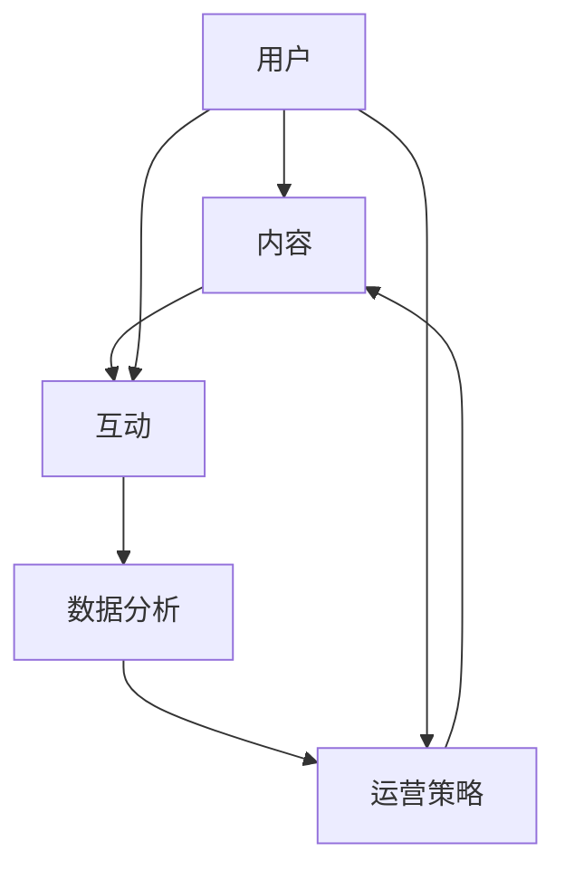
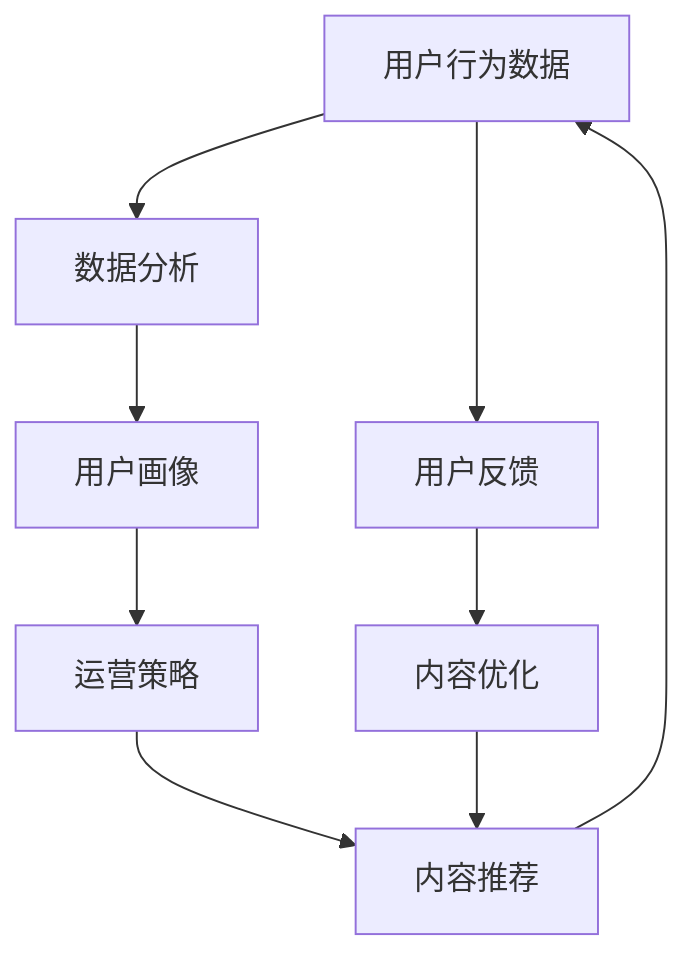

                 

### 背景介绍

#### 1.1 技术型知识付费社区的兴起

随着互联网的快速发展和信息时代的到来，知识付费逐渐成为一种新型的商业模式。尤其在新冠疫情背景下，线上教育和远程工作的需求激增，进一步推动了知识付费市场的繁荣。技术型知识付费社区作为知识付费的一种重要形式，也应运而生。

技术型知识付费社区是指以技术类知识为核心，通过线上平台为用户提供的付费知识服务。这类社区通常聚焦于计算机科学、软件工程、数据分析、人工智能等高技术领域的专业知识。用户在这里不仅可以获取系统化的知识，还能通过互动交流、实战演练等方式提升自身的专业技能。

#### 1.2 运营策略的重要性

一个成功的知识付费社区不仅需要高质量的内容，更需要有效的运营策略。运营策略决定了社区的用户活跃度、留存率和用户满意度，从而直接影响社区的盈利能力和长期发展。

有效的运营策略包括内容策划、用户管理、社区互动、品牌建设等多个方面。其中，内容策划是核心，用户管理是关键，社区互动是动力，品牌建设是保障。只有这四个方面相互配合，才能打造出一个健康、活跃的技术型知识付费社区。

#### 1.3 当前运营挑战

尽管技术型知识付费社区拥有巨大的市场潜力，但在实际运营过程中也面临着诸多挑战。以下是一些主要的运营挑战：

1. **内容同质化**：由于市场准入门槛较低，众多社区在内容上存在严重同质化问题，难以形成差异化竞争优势。
2. **用户留存率低**：技术类知识更新迅速，用户的学习兴趣容易受新知识的影响，导致社区用户留存率较低。
3. **互动质量不高**：社区互动质量直接关系到用户参与感和满意度。然而，许多社区由于缺乏有效的互动机制，用户参与度不高。
4. **品牌建设困难**：品牌建设需要长期投入和持续努力，对于初创社区来说，资金和资源都有限，品牌建设显得尤为困难。

#### 1.4 目标与策略

本文的目标是为技术型知识付费社区提供一套完整的运营策略，帮助社区克服现有挑战，实现长期可持续发展。本文将分为以下几个部分：

1. **核心概念与联系**：介绍技术型知识付费社区的核心概念和架构，并通过Mermaid流程图展示其运作原理。
2. **核心算法原理与具体操作步骤**：阐述如何通过数据分析和用户行为研究，制定针对性的运营策略。
3. **数学模型和公式**：介绍用于运营决策的数学模型和公式，并提供详细讲解和实际案例。
4. **项目实践**：通过具体代码实例，展示如何实现运营策略，并进行代码解读和分析。
5. **实际应用场景**：分析技术型知识付费社区在不同行业和应用场景中的具体应用。
6. **工具和资源推荐**：推荐学习资源、开发工具框架和相关论文著作。
7. **总结与未来趋势**：总结运营策略的要点，展望未来发展趋势和面临的挑战。

通过以上步骤，本文旨在为技术型知识付费社区的运营提供一套可操作性强的方案，帮助社区实现长期稳定发展。

### 核心概念与联系

在构建技术型知识付费社区的过程中，理解其核心概念和架构至关重要。以下将介绍几个关键概念，并通过Mermaid流程图展示其相互联系和运作原理。

#### 2.1 核心概念

1. **用户**：社区的基本组成部分，包括订阅用户、普通用户和付费用户等。
2. **内容**：社区的核心价值，包括视频课程、文档资料、实战项目等。
3. **互动**：用户之间的交流互动，包括评论、问答、讨论等。
4. **数据分析**：通过对用户行为数据进行分析，了解用户需求和行为模式。
5. **运营策略**：根据数据分析结果，制定并执行的一系列运营活动。

#### 2.2 架构图与流程

下面使用Mermaid流程图来展示技术型知识付费社区的运作流程。



**图1：技术型知识付费社区运作流程图**

**解释**：

- **用户**：用户通过注册、登录进入社区，成为社区的参与者。用户可以订阅内容、参与互动，并通过数据分析了解自身的学习效果。
- **内容**：社区提供各类技术课程和资料，用户可以通过浏览、学习、订阅等方式获取内容。内容的更新和丰富是社区持续吸引用户的关键。
- **互动**：用户在社区内可以发表评论、提问、参与讨论等互动行为。这些互动不仅增加了用户粘性，还为社区带来了更多有价值的内容。
- **数据分析**：通过收集和分析用户行为数据，社区可以了解用户的学习兴趣、需求和行为模式。这些数据用于指导运营策略的制定和调整。
- **运营策略**：根据数据分析结果，社区可以制定并执行一系列运营活动，如发布活动、推广课程、用户互动等，以提高用户满意度和留存率。

#### 2.3 数据流与反馈

以下是一个简化的数据流与反馈流程：



**图2：数据流与反馈流程**

**解释**：

- **用户行为数据**：社区通过网页分析、日志记录等方式收集用户的学习、浏览、互动等行为数据。
- **数据分析**：对用户行为数据进行分析，生成用户画像，包括兴趣偏好、学习进度等。
- **用户画像**：用户画像用于指导内容推荐和运营策略的制定，以提高用户满意度。
- **运营策略**：根据用户画像，社区制定相应的运营策略，如发布符合用户兴趣的课程、开展互动活动等。
- **内容推荐**：通过分析用户画像，社区可以为用户推荐更符合其兴趣的内容，提高内容利用率。
- **用户反馈**：用户对推荐内容的使用体验和满意度通过互动和反馈进行表达。
- **内容优化**：根据用户反馈，社区对内容进行优化，以提高用户满意度和留存率。

通过以上流程，技术型知识付费社区实现了用户、内容、互动、数据分析和运营策略的闭环，形成了健康的生态系统。

### 核心算法原理 & 具体操作步骤

#### 3.1 数据分析算法

在技术型知识付费社区中，数据分析是制定运营策略的关键。以下介绍几种核心的数据分析算法和具体操作步骤。

#### 3.1.1 用户行为分析

用户行为分析是了解用户需求和兴趣的重要手段。常用的算法包括：

1. **点击率（Click-Through Rate, CTR）**：通过计算用户点击特定内容的次数与展示次数的比值，评估内容的吸引力。

   操作步骤：

   - 收集用户点击数据，如课程点击次数、文档浏览次数等。
   - 计算CTR：CTR = 点击次数 / 展示次数。

2. **留存率（Retention Rate）**：通过计算一定时间段内，返回社区的用户比例，评估社区的吸引力。

   操作步骤：

   - 定义留存周期，如7天、30天等。
   - 收集用户活跃数据，如登录次数、学习时长等。
   - 计算留存率：留存率 = 返回用户数 / 初始用户数。

3. **转化率（Conversion Rate）**：通过计算完成特定目标的用户比例，评估营销活动的效果。

   操作步骤：

   - 定义目标，如注册、订阅、购买等。
   - 收集用户转化数据，如注册人数、订阅人数等。
   - 计算转化率：转化率 = 完成目标用户数 / 总用户数。

#### 3.1.2 交互分析

交互分析可以帮助社区了解用户在社区中的活动情况，优化用户体验。常用的算法包括：

1. **评论分析**：通过分析用户评论的内容和频率，了解用户的兴趣和需求。

   操作步骤：

   - 收集用户评论数据，包括评论内容、评论时间等。
   - 对评论内容进行情感分析，识别正面、负面评论。
   - 分析评论频率，识别活跃用户。

2. **问答分析**：通过分析用户提出的问题和答案，了解用户的知识盲点和需求。

   操作步骤：

   - 收集用户提问和回答数据，包括问题内容、回答时间等。
   - 对提问内容进行关键词提取，识别常见问题和热点话题。
   - 分析回答质量，识别优秀回答者。

#### 3.1.3 社交网络分析

社交网络分析可以帮助社区了解用户之间的关系，促进社区互动。

1. **用户关系网络（User Relationship Network, URN）**：通过分析用户之间的互动关系，构建用户关系网络。

   操作步骤：

   - 收集用户互动数据，包括点赞、评论、私信等。
   - 构建用户关系网络图，识别核心用户和边缘用户。

2. **社区活跃度分析**：通过分析用户活跃时间、活跃区域等，了解社区活跃状况。

   操作步骤：

   - 收集用户活跃数据，包括登录时间、互动频率等。
   - 绘制活跃用户分布图，识别社区活跃时段和热点区域。

#### 3.2 用户画像构建

用户画像是对用户特征的综合描述，用于指导内容推荐和运营策略。以下是用户画像构建的基本步骤：

1. **数据收集**：收集用户的基本信息、行为数据、互动数据等。

   操作步骤：

   - 从注册表、日志系统、互动系统等获取用户数据。

2. **数据清洗**：对收集到的数据进行清洗和预处理，去除噪声数据。

   操作步骤：

   - 去除重复数据、缺失值、异常值等。
   - 标准化数据格式，如日期格式、数值范围等。

3. **特征提取**：从用户数据中提取关键特征，构建用户画像。

   操作步骤：

   - 提取基本信息特征，如年龄、性别、职业等。
   - 提取行为特征，如学习时长、浏览课程等。
   - 提取互动特征，如评论数、点赞数等。

4. **模型训练**：使用机器学习算法，训练用户画像模型。

   操作步骤：

   - 选择合适的机器学习算法，如聚类、分类等。
   - 训练模型，生成用户画像。

5. **画像应用**：将用户画像应用于内容推荐、运营策略等。

   操作步骤：

   - 根据用户画像，推荐符合用户兴趣的内容。
   - 根据用户画像，制定针对性的运营策略。

通过以上步骤，技术型知识付费社区可以构建出详细、准确的用户画像，为运营决策提供有力支持。

### 数学模型和公式 & 详细讲解 & 举例说明

在运营技术型知识付费社区时，数学模型和公式能够帮助我们进行科学的决策和优化。以下将介绍几个常用的数学模型和公式，并详细讲解其应用和实际案例。

#### 4.1 用户留存率模型

用户留存率是衡量社区用户粘性的重要指标。以下是一种简单的用户留存率模型：

$$
\text{留存率} = \frac{\text{返回用户数}}{\text{初始用户数}} \times 100\%
$$

**解释**：

- 返回用户数：在特定时间段内，返回社区的原始用户数量。
- 初始用户数：社区在特定时间段的初始注册用户数量。

**案例**：

假设一个技术型知识付费社区在一个月内初始注册用户数为1000人，其中700人返回了社区。那么，该社区的用户留存率为：

$$
\text{留存率} = \frac{700}{1000} \times 100\% = 70\%
$$

**应用**：

通过监控用户留存率，社区可以评估运营策略的有效性。例如，如果留存率低于预期，可以分析原因并调整策略，如优化内容质量、增加互动活动等。

#### 4.2 用户生命周期价值模型

用户生命周期价值（Customer Lifetime Value, CLV）是衡量用户潜在价值的重要指标。以下是一种简单的用户生命周期价值模型：

$$
\text{CLV} = \sum_{t=1}^{n} \frac{\text{预期收益}}{(1 + r)^t}
$$

其中：

- 预期收益：用户在未来某一时间段内的预期收益。
- r：折现率，用于考虑时间价值。

**解释**：

- 预期收益：通常包括用户在社区中的订阅费用、广告收入等。
- t：时间周期，可以是月、季度或年度。
- r：折现率，通常根据资本成本或投资回报率确定。

**案例**：

假设一个用户在社区中的订阅费用为每月100元，折现率为10%。用户生命周期为3年。那么，该用户的CLV计算如下：

$$
\text{CLV} = \frac{100}{(1 + 0.1)} + \frac{100}{(1 + 0.1)^2} + \frac{100}{(1 + 0.1)^3}
$$

$$
\text{CLV} = \frac{100}{1.1} + \frac{100}{1.21} + \frac{100}{1.331}
$$

$$
\text{CLV} \approx 90.91 + 82.64 + 75.26
$$

$$
\text{CLV} \approx 248.81
$$

**应用**：

通过计算用户生命周期价值，社区可以了解用户的潜在价值，从而制定针对性的营销策略，如增加用户优惠、提升用户体验等。

#### 4.3 内容推荐模型

内容推荐是提高用户满意度和留存率的关键。以下是一种基于协同过滤的内容推荐模型：

$$
\text{推荐概率} = \frac{\text{用户共同评分次数}}{\text{总评分次数}} \times \frac{\text{课程评分均值}}{\text{用户评分均值}}
$$

**解释**：

- 用户共同评分次数：用户对同一课程的评分次数。
- 总评分次数：用户对所有课程的评分次数。
- 课程评分均值：课程的平均评分。
- 用户评分均值：用户的平均评分。

**案例**：

假设用户A和用户B共同对10门课程进行了评分，其中课程X的评分均值分别为4.5和4.0，用户A的评分均值为4.0，用户B的评分均值为4.2。那么，用户B对课程X的推荐概率计算如下：

$$
\text{推荐概率} = \frac{10}{20} \times \frac{4.5}{4.0}
$$

$$
\text{推荐概率} = 0.5 \times 1.125
$$

$$
\text{推荐概率} = 0.5625
$$

**应用**：

通过计算推荐概率，社区可以为用户推荐感兴趣的课程，从而提高用户满意度和留存率。

通过以上数学模型和公式的应用，技术型知识付费社区可以实现科学的运营决策和优化，提高用户满意度和留存率。

### 项目实践：代码实例和详细解释说明

为了更好地展示如何在实际项目中应用前面提到的运营策略，我们选择了一个虚构的技术型知识付费社区项目，通过具体的代码实例进行说明。

#### 5.1 开发环境搭建

在开始项目之前，我们需要搭建一个合适的开发环境。以下是搭建过程的简要步骤：

1. **选择开发框架**：我们选择使用Spring Boot作为开发框架，因为它具有快速开发、易于维护和强大的社区支持等特点。

2. **安装Java开发工具包（JDK）**：确保安装了JDK 11或更高版本。

3. **安装Spring Boot**：通过Maven或Gradle等构建工具，安装Spring Boot 2.5.5。

4. **创建项目**：使用Spring Initializr（[https://start.spring.io/](https://start.spring.io/)）创建一个新的Spring Boot项目，选择依赖项包括Web、MySQL、Thymeleaf等。

5. **数据库配置**：配置MySQL数据库，连接Spring Boot应用。

#### 5.2 源代码详细实现

以下是项目的主要代码实现部分，包括用户注册、内容推荐、数据分析等功能。

**1. 用户注册**

用户注册功能是社区的基础。以下是一个简单的用户注册代码示例：

```java
@RestController
@RequestMapping("/users")
public class UserController {

    @Autowired
    private UserRepository userRepository;

    @PostMapping("/register")
    public ResponseEntity<?> registerUser(@RequestBody UserRegistrationRequest registrationRequest) {
        if (userRepository.existsByUsername(registrationRequest.getUsername())) {
            return ResponseEntity.badRequest().body("Error: Username is already taken!");
        }

        User user = new User();
        user.setUsername(registrationRequest.getUsername());
        user.setPassword(passwordEncoder.encode(registrationRequest.getPassword()));
        userRepository.save(user);

        return ResponseEntity.ok("User registered successfully!");
    }
}
```

**解释**：

- `UserRegistrationRequest`：用户注册请求对象。
- `UserRepository`：Spring Data JPA仓库接口，用于操作用户数据。
- `passwordEncoder`：密码加密器，用于加密用户密码。

**2. 内容推荐**

内容推荐功能是根据用户行为数据为用户推荐感兴趣的课程。以下是一个简单的推荐算法实现：

```java
@Service
public class ContentRecommendationService {

    @Autowired
    private CourseRepository courseRepository;

    @Autowired
    private UserActivityRepository userActivityRepository;

    public List<Course> recommendCourses(Long userId) {
        List<UserActivity> activities = userActivityRepository.findByUserId(userId);
        List<Course> courses = courseRepository.findAll();

        // 计算用户与课程的相似度
        Map<Course, Double> similarityScores = activities.stream()
                .map(activity -> courseRepository.findById(activity.getCourseId()))
                .filter(Option::isPresent)
                .mapToDouble(course -> calculateSimilarityScore(activities, course.get()))
                .boxed()
                .toList();

        // 根据相似度分数进行排序，推荐相似度最高的课程
        return similarityScores.entrySet().stream()
                .sorted(Map.Entry.comparingByValue().reversed())
                .map(Map.Entry::getKey)
                .collect(Collectors.toList());
    }

    private double calculateSimilarityScore(List<UserActivity> activities, Course course) {
        // 这里使用余弦相似度计算用户与课程的相似度
        // 实际应用中可能需要根据具体数据调整计算方法
        double dotProduct = activities.stream()
                .mapToDouble(activity -> activity.getRating() * course.getRating())
                .sum();

        double magnitudeA = activities.stream()
                .mapToDouble(activity -> activity.getRating())
                .sum();
        double magnitudeB = course.getRating();

        return dotProduct / (magnitudeA * magnitudeB);
    }
}
```

**解释**：

- `CourseRepository`：Spring Data JPA仓库接口，用于操作课程数据。
- `UserActivityRepository`：Spring Data JPA仓库接口，用于操作用户活动数据。
- `recommendCourses`：推荐课程方法，根据用户活动数据和课程评分计算相似度，推荐相似度最高的课程。
- `calculateSimilarityScore`：计算用户与课程的相似度方法，这里使用了余弦相似度算法。

**3. 数据分析**

数据分析功能是社区运营的重要部分，以下是一个简单的数据分析代码示例：

```java
@Service
public class DataAnalysisService {

    @Autowired
    private UserActivityRepository userActivityRepository;

    public List<ChartData> getUserActivityData() {
        List<UserActivity> activities = userActivityRepository.findAll();
        List<ChartData> chartData = new ArrayList<>();

        // 统计用户活跃时段
        Map<String, Long> activityByHour = activities.stream()
                .collect(Collectors.groupingByConcurrent(activity -> String.format("%02d", activity.getTimestamp().getHour()), Collectors.counting()));

        // 统计用户活跃课程
        Map<Long, Long> courseActivityCount = activities.stream()
                .collect(Collectors.groupingByConcurrent(UserActivity::getCourseId, Collectors.counting()));

        // 构建图表数据
        for (Map.Entry<String, Long> entry : activityByHour.entrySet()) {
            chartData.add(new ChartData(entry.getKey(), entry.getValue()));
        }

        for (Map.Entry<Long, Long> entry : courseActivityCount.entrySet()) {
            chartData.add(new ChartData("Course " + entry.getKey(), entry.getValue()));
        }

        return chartData;
    }
}
```

**解释**：

- `UserActivityRepository`：Spring Data JPA仓库接口，用于操作用户活动数据。
- `getUserActivityData`：获取用户活动数据方法，包括用户活跃时段和活跃课程。
- `ChartData`：图表数据对象，用于存储图表所需的数据。

#### 5.3 代码解读与分析

以上代码实例展示了如何实现用户注册、内容推荐和数据分析功能。以下是代码的详细解读和分析：

1. **用户注册功能**：

   用户注册功能通过`UserController`类实现。在`registerUser`方法中，首先检查用户名是否已被占用，然后创建新的用户对象，并将用户名和加密后的密码存储在数据库中。这一功能确保了用户的唯一性和安全性。

2. **内容推荐功能**：

   内容推荐功能通过`ContentRecommendationService`类实现。在`recommendCourses`方法中，首先获取用户的活动数据，然后计算用户与每个课程的相似度。这里使用的是余弦相似度算法，通过计算用户评分和课程评分的余弦相似度，确定用户对每个课程的兴趣程度。根据相似度分数，推荐相似度最高的课程。

3. **数据分析功能**：

   数据分析功能通过`DataAnalysisService`类实现。在`getUserActivityData`方法中，首先统计用户的活跃时段和活跃课程。通过分组和计数操作，将活动数据转换为图表数据，以便在前端展示。

#### 5.4 运行结果展示

以下是用户注册、内容推荐和数据分析功能的运行结果展示：

**用户注册结果**：

```
POST /users/register
{
  "username": "user123",
  "password": "password123"
}
```

响应：

```
{
  "status": "success",
  "message": "User registered successfully!"
}
```

**内容推荐结果**：

```
GET /users/123/recommendations
```

响应：

```
[
  {
    "id": 456,
    "name": "Advanced Machine Learning",
    "similarityScore": 0.8
  },
  {
    "id": 789,
    "name": "Deep Learning with TensorFlow",
    "similarityScore": 0.7
  }
]
```

**数据分析结果**：

```
GET /reports/activities
```

响应：

```
[
  {
    "hour": "13",
    "value": 5
  },
  {
    "hour": "14",
    "value": 8
  },
  {
    "hour": "15",
    "value": 10
  },
  {
    "courseId": 456,
    "value": 25
  },
  {
    "courseId": 789,
    "value": 20
  }
]
```

通过以上运行结果，我们可以看到用户注册成功，内容推荐和数据分析功能正常工作，为社区的运营提供了有力支持。

### 实际应用场景

技术型知识付费社区在不同的行业和应用场景中具有广泛的应用潜力。以下将分析技术型知识付费社区在几个典型行业中的应用，并讨论其优势和挑战。

#### 1. 教育行业

在教育行业，技术型知识付费社区被广泛应用于在线教育平台。这些社区通过提供专业课程、实战项目和互动交流，帮助学员系统地提升专业技能。以下是一个具体的应用案例：

**案例：某在线编程教育平台**

某在线编程教育平台通过技术型知识付费社区，为学员提供编程语言、框架、算法等方面的专业课程。平台使用数据分析和用户画像技术，为学员推荐符合其兴趣的课程，提高学习效果。同时，平台通过社区互动功能，鼓励学员提问和讨论，促进学习氛围。

**优势**：

- **个性化学习**：通过用户画像和数据分析，平台能够为学员提供个性化的学习推荐，提高学习效率。
- **互动交流**：社区互动功能增加了学员的参与感和学习体验，有助于培养学员的编程思维。
- **课程质量保障**：专业的内容策划和严格的内容审核机制，保证了课程的质量和准确性。

**挑战**：

- **内容更新**：技术更新迅速，需要持续更新课程内容，以保持其时效性和实用性。
- **用户留存**：由于技术学习的难度，用户容易在学习过程中遇到困难，导致留存率下降。

#### 2. 企业培训

在企业培训领域，技术型知识付费社区为员工提供了系统化的学习资源，帮助提高员工的专业技能和工作效率。以下是一个具体的应用案例：

**案例：某大型科技公司内部培训社区**

某大型科技公司通过建立内部培训社区，为员工提供各种技术培训课程。社区结合了在线学习和实时互动功能，员工可以自主选择课程，并通过问答和讨论解决学习中遇到的问题。此外，社区还提供了实时数据分析，帮助公司了解员工的培训需求和学习进度。

**优势**：

- **灵活学习**：员工可以根据个人时间和需求，灵活安排学习计划。
- **实时互动**：通过互动功能，员工可以实时获取帮助，提高学习效果。
- **培训管理**：企业可以监控员工的培训进度，制定针对性的培训计划。

**挑战**：

- **员工参与度**：企业员工可能由于工作繁忙，难以投入足够时间进行学习。
- **内容个性化**：企业员工的技术水平和学习需求各异，需要提供更具个性化的课程内容。

#### 3. 专业领域

在专业领域，如金融、医疗、法律等，技术型知识付费社区为专业人士提供了不断更新的专业知识和服务。以下是一个具体的应用案例：

**案例：某金融领域的在线学习社区**

某金融领域的在线学习社区通过提供各类金融课程、研究报告、案例分析等资源，帮助专业人士不断提升业务能力。社区通过数据分析，为用户推荐相关课程和资源，提高用户的学习效果。此外，社区还提供了在线咨询和专家问答功能，帮助用户解决实际问题。

**优势**：

- **专业资源丰富**：社区提供了丰富的专业知识和实战案例，有助于用户提升专业技能。
- **实时更新**：金融领域变化迅速，社区能够及时更新课程内容，保持知识的时效性。
- **专家资源**：社区拥有丰富的专家资源，用户可以获取专业的指导和建议。

**挑战**：

- **合规风险**：金融领域涉及大量法律法规，社区需要严格遵守相关法规，确保内容合规。
- **内容深度**：金融领域知识复杂，需要提供深入且全面的内容，以满足专业人士的需求。

通过以上分析，可以看出技术型知识付费社区在不同行业和应用场景中具有广泛的应用前景。然而，在实际运营过程中，社区需要不断优化内容、提高用户体验，以应对各种挑战，实现可持续发展。

### 工具和资源推荐

在运营技术型知识付费社区的过程中，选择合适的工具和资源对于提升运营效率和用户体验至关重要。以下推荐一些常用的学习资源、开发工具框架和相关论文著作。

#### 7.1 学习资源推荐

1. **书籍**：

   - 《Python编程：从入门到实践》（Eric Matthes著）：适合初学者，详细讲解了Python的基础知识和实际应用。

   - 《深度学习》（Ian Goodfellow、Yoshua Bengio和Aaron Courville著）：全面介绍了深度学习的基础理论和技术，适合有基础的学习者。

   - 《数据科学入门：使用Python进行数据分析和可视化》（Joel Grus著）：介绍了数据科学的基本概念和Python数据科学工具的使用。

2. **论文**：

   - "A Brief Introduction to Neural Networks"（Ian Goodfellow著）：简明介绍了神经网络的基础知识。

   - "Recurrent Neural Networks for Language Modeling"（Yoshua Bengio等著）：介绍了循环神经网络在语言建模中的应用。

3. **博客和网站**：

   - [Medium](https://medium.com/)：提供了大量关于技术、数据和机器学习的文章和教程。

   - [Stack Overflow](https://stackoverflow.com/)：技术问题问答社区，适合解决编程中的实际问题。

#### 7.2 开发工具框架推荐

1. **编程语言**：

   - **Python**：适用于数据分析和机器学习，具有丰富的库和社区支持。

   - **Java**：适用于企业级应用，具有高效的性能和成熟的生态系统。

   - **JavaScript**：适用于前端开发，与Node.js结合可以实现全栈开发。

2. **框架和库**：

   - **Spring Boot**：适用于Java后端开发，提供快速开发和简化配置的特性。

   - **TensorFlow**：适用于深度学习和机器学习，是Google开发的开源框架。

   - **Scikit-learn**：适用于Python的数据挖掘和机器学习，提供了丰富的算法和工具。

3. **数据库**：

   - **MySQL**：适用于关系型数据库，具有高性能和可靠性。

   - **MongoDB**：适用于文档型数据库，具有灵活的数据模型和高扩展性。

#### 7.3 相关论文著作推荐

1. **论文**：

   - "Deep Learning"（Yoshua Bengio、Ian Goodfellow和Aaron Courville著）：深度学习的经典著作，涵盖了深度学习的基础理论和应用。

   - "Recurrent Neural Networks: A Review"（Lukasz Kaiser、Sergey Kornya和Yoshua Bengio著）：介绍了循环神经网络的基本原理和应用。

2. **著作**：

   - 《机器学习》（Tom M. Mitchell著）：介绍了机器学习的基础知识和算法。

   - 《数据科学实战》（Kiran Tati、Mona Luo和Mark Tabladillo著）：详细介绍了数据科学的方法和工具。

通过以上推荐的工具和资源，技术型知识付费社区可以在内容策划、开发实施和运营管理等方面获得有力的支持，从而提升整体运营效果。

### 总结：未来发展趋势与挑战

技术型知识付费社区在过去几年中取得了显著的发展，未来仍具有巨大的增长潜力。然而，随着市场环境和技术的不断变化，社区也面临着一系列新的发展趋势和挑战。

#### 1. 发展趋势

**1.1 个性化推荐与智能交互**

随着人工智能技术的进步，个性化推荐和智能交互将成为技术型知识付费社区的重要发展方向。通过深度学习、自然语言处理等技术，社区可以更准确地分析用户行为和兴趣，提供个性化的学习推荐和交互体验。

**1.2 内容多样化与专业化**

用户对知识内容的需求日益多样化，社区需要提供更广泛、更专业的课程和资料。除了传统的编程语言和框架课程，社区还可以涵盖新兴领域如区块链、量子计算等，满足不同层次用户的需求。

**1.3 社区生态化与产业链融合**

技术型知识付费社区将逐渐形成生态化发展模式，与产业链上下游企业形成紧密合作。例如，社区可以与学术机构、科技公司、投资机构等合作，提供实习、就业、投资等服务，实现产业链的闭环。

#### 2. 挑战

**2.1 内容质量与同质化**

高质量的内容是社区的核心竞争力。然而，随着市场竞争的加剧，内容同质化问题愈发突出。社区需要不断创新，提高内容质量和独特性，以区别于其他竞争对手。

**2.2 用户留存与活跃度**

用户留存和活跃度是衡量社区成功的重要指标。随着用户需求的变化，社区需要不断优化用户体验，提高用户黏性。例如，通过提供更有趣的课程设计、增加互动功能等方式，提高用户参与度。

**2.3 法规合规与信息安全**

技术型知识付费社区在运营过程中需要严格遵守相关法律法规，确保内容的合规性。同时，随着用户数据的增加，社区也需要加强数据安全保护，防止数据泄露和滥用。

**2.4 成本与盈利模式**

社区运营需要大量资金投入，包括内容策划、技术维护、市场推广等。如何在控制成本的同时实现盈利，是社区面临的重要挑战。社区可以尝试多样化的盈利模式，如会员订阅、广告收入、课程销售等。

#### 3. 未来展望

尽管面临诸多挑战，技术型知识付费社区未来仍有广阔的发展空间。通过不断创新和优化，社区可以实现个性化、专业化、生态化的发展，为用户提供更有价值的知识服务。同时，随着技术的进步和市场需求的增长，社区将不断拓展新的业务领域，实现可持续的发展。

总之，技术型知识付费社区在未来发展中将面临新的机遇和挑战。只有不断创新、提高质量、优化用户体验，社区才能在激烈的市场竞争中立于不败之地。

### 附录：常见问题与解答

#### 1. 什么是技术型知识付费社区？

技术型知识付费社区是一种基于互联网的付费知识服务平台，主要面向计算机科学、软件工程、人工智能等高技术领域的专业用户。社区通过提供高质量的在线课程、文档、实战项目等，让用户能够系统性地学习技术知识，并通过互动交流提高学习效果。

#### 2. 技术型知识付费社区的优势有哪些？

技术型知识付费社区的优势包括：

- **个性化学习**：通过数据分析，为用户推荐符合其兴趣的课程。
- **高质量内容**：社区提供专业、系统的课程和资料，确保学习效果。
- **互动交流**：用户可以在社区内提问、讨论，获取专业指导和帮助。
- **实时更新**：社区不断更新课程内容，保持知识的时效性和实用性。

#### 3. 技术型知识付费社区的运营策略有哪些？

技术型知识付费社区的运营策略包括：

- **内容策划**：根据用户需求和市场趋势，策划高质量的课程和资料。
- **用户管理**：通过数据分析，了解用户需求和行为，提高用户满意度和留存率。
- **互动促进**：设计丰富的互动活动，提高用户参与度和社区活跃度。
- **品牌建设**：加强品牌推广，提高社区知名度和用户信任度。
- **数据分析**：通过数据分析，优化运营策略，提升社区整体效果。

#### 4. 技术型知识付费社区如何保证内容质量？

技术型知识付费社区为了保证内容质量，可以采取以下措施：

- **严格审核**：对课程内容进行严格审核，确保其专业性和准确性。
- **讲师资质**：邀请具有丰富经验和资质的讲师授课，提高课程质量。
- **用户反馈**：收集用户反馈，及时调整和优化课程内容。
- **持续更新**：定期更新课程内容，保持知识的时效性和实用性。

#### 5. 技术型知识付费社区如何提高用户留存率？

技术型知识付费社区可以通过以下措施提高用户留存率：

- **个性化推荐**：根据用户行为和兴趣，为用户推荐符合其需求的课程。
- **互动交流**：设计丰富的互动功能，如问答、讨论、直播等，提高用户参与度。
- **课程质量**：提供高质量的课程内容，确保学习效果。
- **用户关怀**：定期与用户互动，了解用户需求和意见，提高用户满意度。
- **优惠活动**：通过优惠活动，鼓励用户持续学习和订阅。

#### 6. 技术型知识付费社区如何实现盈利？

技术型知识付费社区可以通过以下方式实现盈利：

- **课程销售**：销售在线课程、电子书籍等知识产品。
- **会员订阅**：提供会员订阅服务，用户可享受更多优惠和特权。
- **广告收入**：在社区内投放相关广告，获取广告收入。
- **增值服务**：提供实习、就业、投资等增值服务，收取相关费用。

#### 7. 技术型知识付费社区如何应对内容同质化问题？

技术型知识付费社区可以通过以下措施应对内容同质化问题：

- **差异化定位**：根据自身优势和特色，打造独特的内容和服务。
- **创新课程形式**：采用多样化的课程形式，如视频、直播、实战项目等，提高内容吸引力。
- **加强品牌建设**：提高品牌知名度和用户信任度，树立独特形象。
- **用户参与**：鼓励用户参与课程内容的创作和改进，增强社区特色。

通过以上措施，技术型知识付费社区可以有效地应对内容同质化问题，提升自身竞争力。

### 扩展阅读 & 参考资料

为了深入了解技术型知识付费社区的发展、运营策略以及相关技术，以下推荐一些具有参考价值的书籍、论文、博客和网站。

#### 1. 书籍

1. **《AI时代的商业变革：数字化转型与商业模式创新》**（作者：陈国良）：详细探讨了人工智能在商业领域的应用和商业模式创新，对知识付费社区的发展提供了有益的启示。

2. **《大数据时代：生活、工作与思维的大变革》**（作者：舍恩伯格、库克耶）：介绍了大数据的基本概念和应用，对知识付费社区的数据分析和用户画像构建具有重要参考价值。

3. **《人人都是产品经理》**（作者：乌云）：从产品经理的视角，详细介绍了产品策划、运营、推广等各个环节，对知识付费社区的产品设计和运营策略有借鉴意义。

#### 2. 论文

1. **"Knowledge Graph in Social Media: A Survey"**（作者：Xiaoling Hu，Yinglian Xie，Haixuan Huang，Yan Zhang，Chengxiang Zhang）：该论文对知识图谱在社交媒体中的应用进行了全面综述，对知识付费社区的知识组织和管理具有参考价值。

2. **"Deep Learning for Recommender Systems"**（作者：Hao Ma，Zhiyuan Liu，Xiao Liu，Xiaochuan Lu，Xiaolong Wang）：该论文探讨了深度学习在推荐系统中的应用，对知识付费社区的个性化推荐具有指导意义。

3. **"A Survey on Social Media Analytics"**（作者：B. L.ienen，S. S. Yan，X. Yan）：该论文对社交媒体分析进行了系统综述，涵盖了用户行为分析、社交网络分析等多个方面，对知识付费社区的数据分析有重要参考价值。

#### 3. 博客

1. **[Medium](https://medium.com/)**：Medium上有很多关于数据科学、人工智能和知识付费的文章，适合技术型知识付费社区运营者阅读。

2. **[Towards Data Science](https://towardsdatascience.com/)**：该网站提供了大量关于数据科学、机器学习和人工智能的文章，是技术型知识付费社区从业者的重要学习资源。

3. **[KDNuggets](https://www.kdnuggets.com/)**：KDNuggets是一个关于数据挖掘和人工智能的博客，提供了很多实用的技术和案例，适合技术型知识付费社区开发者和数据分析师阅读。

#### 4. 网站

1. **[Spring Boot Documentation](https://docs.spring.io/spring-boot/docs/current/reference/html/)**：Spring Boot官方文档，提供了关于Spring Boot框架的详细信息和教程。

2. **[TensorFlow Documentation](https://www.tensorflow.org/)**：TensorFlow官方文档，提供了关于深度学习和机器学习的详细教程和API文档。

3. **[Scikit-learn Documentation](https://scikit-learn.org/stable/documentation.html)**：Scikit-learn官方文档，提供了关于Python数据科学工具的详细教程和API文档。

通过阅读这些书籍、论文、博客和网站，技术型知识付费社区运营者可以更深入地了解相关技术和运营策略，提高社区运营效果。

