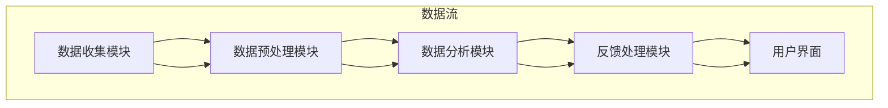

                 

### 1. 背景介绍

在现代商业环境中，客户反馈成为企业改进产品和服务、提升用户满意度的重要手段。对于个人创业者和小型企业来说，掌握有效的客户反馈系统尤为重要。然而，传统客户反馈机制往往耗时耗力，且难以全面覆盖客户需求。在这种背景下，智能客户反馈系统的出现，不仅能够简化流程、提高效率，还能提供深层次的客户洞察，从而成为企业持续改进的关键动力。

一人公司，即“单人创业公司”，通常由创始人独立运营，面临着资源有限、市场竞争力强等挑战。在这种环境中，智能客户反馈系统显得尤为重要。它不仅可以帮助个人创业者更好地理解客户需求，还能通过自动化分析和处理反馈，提高决策质量和效率，从而在激烈的市场竞争中脱颖而出。

本文旨在探讨如何构建一个智能客户反馈系统，以助力一人公司实现持续改进。我们将从核心概念、算法原理、数学模型、项目实践、实际应用场景等多个方面进行详细分析，帮助读者全面了解并掌握这一系统。

智能客户反馈系统的建设涉及多个环节，包括数据收集、数据预处理、数据分析和反馈处理等。这些环节相互作用，共同构建出一个高效、智能的反馈机制。本文将逐一介绍这些环节的技术原理和操作步骤，并结合实际案例进行详细解释。

通过本文的阅读，读者将能够：

1. 理解智能客户反馈系统的基本概念和重要性。
2. 掌握构建智能客户反馈系统的核心算法原理和数学模型。
3. 学习如何利用编程工具和框架实现系统的具体操作。
4. 探讨智能客户反馈系统在实际应用中的场景和效果。
5. 获取构建和维护智能客户反馈系统的实用工具和资源推荐。

总的来说，本文将围绕智能客户反馈系统的构建和优化，提供一系列实用的方法和建议，帮助读者在激烈的市场竞争中把握先机，实现企业持续改进。

### 2. 核心概念与联系

#### 2.1 智能客户反馈系统的定义

智能客户反馈系统是一种利用先进技术和算法，对客户反馈信息进行自动化收集、处理和分析的系统。通过这一系统，企业能够实时获取客户的意见和需求，快速响应并做出改进。与传统客户反馈系统相比，智能客户反馈系统具备更高的效率和更精准的分析能力。

#### 2.2 智能客户反馈系统的组成部分

一个完整的智能客户反馈系统通常包括以下几个关键组成部分：

1. **数据收集模块**：负责从多个渠道（如社交媒体、在线评论、客户调查等）收集客户反馈数据。
2. **数据预处理模块**：对收集到的数据进行分析前的清洗和预处理，包括去除噪音、统一格式、数据标准化等。
3. **数据分析模块**：利用自然语言处理（NLP）和机器学习等技术，对预处理后的数据进行分析，提取关键信息和洞察。
4. **反馈处理模块**：根据分析结果，自动生成反馈报告，并采取相应的改进措施，如优化产品功能、调整营销策略等。
5. **用户界面**：为用户提供一个友好、直观的交互界面，使其能够方便地提交反馈和查看反馈结果。

#### 2.3 智能客户反馈系统的核心概念

智能客户反馈系统中的核心概念包括：

1. **数据源**：数据收集的来源，如社交媒体、在线评论、客户调查问卷等。
2. **文本挖掘**：利用NLP技术，从文本数据中提取有价值的信息，如情感分析、关键词提取等。
3. **机器学习模型**：用于对客户反馈进行分类、预测和趋势分析，如决策树、支持向量机、神经网络等。
4. **可视化工具**：用于将分析结果以图表、图形等形式直观展示，帮助用户更好地理解数据。
5. **反馈机制**：根据分析结果，自动生成反馈报告，并采取相应的改进措施，如优化产品功能、调整营销策略等。

#### 2.4 智能客户反馈系统的架构

为了更好地理解智能客户反馈系统的构建，我们使用Mermaid流程图来展示其核心架构。以下是智能客户反馈系统的Mermaid流程图：



在这个流程图中，数据从数据收集模块开始，经过数据预处理模块、数据分析模块，最终由反馈处理模块进行处理，并通过用户界面展示给用户。

通过这个流程图，我们可以清晰地看到智能客户反馈系统的各个组成部分及其相互关系。这有助于我们更好地理解系统的工作原理，也为后续的具体实现提供了指导。

总的来说，智能客户反馈系统通过数据收集、数据预处理、数据分析和反馈处理等多个环节，实现对客户反馈信息的自动化、智能化处理，为企业提供宝贵的客户洞察和改进建议。这不仅能提高企业的运营效率，还能帮助企业在激烈的市场竞争中持续优化产品和服务，提升客户满意度。

### 3. 核心算法原理 & 具体操作步骤

在构建智能客户反馈系统时，核心算法的选择和实现至关重要。以下是智能客户反馈系统中常用的几种核心算法原理及其具体操作步骤。

#### 3.1 数据收集算法

数据收集算法主要负责从各种渠道（如社交媒体、在线评论、客户调查问卷等）收集客户反馈数据。以下是数据收集算法的具体操作步骤：

1. **数据源识别**：首先，确定数据收集的目标渠道，如社交媒体平台（如微博、Facebook、Twitter等）、在线评论系统（如亚马逊、淘宝等）和客户调查问卷。
2. **API调用**：通过相应的API接口获取数据。例如，对于社交媒体平台，可以使用其官方提供的API接口获取用户的评论、点赞、分享等数据。
3. **数据清洗**：对获取到的数据进行初步清洗，去除无效、重复的数据，并统一数据格式，如日期、时间、地点等。
4. **存储与管理**：将清洗后的数据存储在数据库或数据仓库中，便于后续的数据处理和分析。

#### 3.2 数据预处理算法

数据预处理是智能客户反馈系统中至关重要的一环。它主要包括数据清洗、数据转换和数据归一化等步骤。以下是数据预处理算法的具体操作步骤：

1. **数据清洗**：去除无效、重复的数据，处理缺失值，如使用平均值、中位数等方法进行填补。
2. **数据转换**：将非结构化数据（如文本、图像等）转换为结构化数据，如将文本数据转换为词频矩阵，将图像数据转换为特征向量。
3. **数据归一化**：对数据进行归一化处理，如对数值型数据进行标准化或归一化，使其具有相同的量纲和范围。

#### 3.3 数据分析算法

数据分析算法是智能客户反馈系统的核心，负责从大量数据中提取有价值的信息和洞察。以下是数据分析算法的具体操作步骤：

1. **文本挖掘**：利用自然语言处理（NLP）技术，对文本数据进行分析，如情感分析、关键词提取、主题模型等。
2. **数据可视化**：使用数据可视化工具，将分析结果以图表、图形等形式直观展示，如条形图、折线图、词云图等。
3. **机器学习模型**：选择合适的机器学习模型（如决策树、支持向量机、神经网络等），对数据进行分析和预测，如分类、回归、聚类等。

#### 3.4 反馈处理算法

反馈处理算法负责根据数据分析结果，自动生成反馈报告，并采取相应的改进措施。以下是反馈处理算法的具体操作步骤：

1. **生成反馈报告**：根据数据分析结果，生成详细的反馈报告，如客户满意度分析、产品问题诊断等。
2. **自动化改进建议**：基于反馈报告，自动生成改进建议，如优化产品功能、调整营销策略等。
3. **反馈结果展示**：通过用户界面，将反馈报告和改进建议展示给用户，以便用户查看和理解。

#### 3.5 算法实现示例

以下是一个基于Python的智能客户反馈系统的算法实现示例，主要包括数据收集、数据预处理、文本挖掘和数据可视化等模块。

```python
# 导入相关库
import requests
from sklearn.feature_extraction.text import TfidfVectorizer
import matplotlib.pyplot as plt

# 3.1 数据收集
def collect_data():
    # 使用API获取数据（以微博为例）
    api_url = "https://api.weibo.com/2/statuses/home_timeline.json"
    params = {"access_token": "your_access_token", "count": 50}
    response = requests.get(api_url, params=params)
    data = response.json()["statuses"]
    return [status["text"] for status in data]

# 3.2 数据预处理
def preprocess_data(data):
    # 数据清洗
    cleaned_data = [text.strip() for text in data if text.strip()]
    # 数据转换
    return cleaned_data

# 3.3 文本挖掘
def text_mining(data):
    # 创建TfidfVectorizer对象
    vectorizer = TfidfVectorizer(stop_words='english')
    # 将文本数据转换为词频矩阵
    tfidf_matrix = vectorizer.fit_transform(data)
    # 提取关键词
    feature_names = vectorizer.get_feature_names_out()
    top_keywords = feature_names[:10]
    return top_keywords

# 3.4 数据可视化
def visualize_data(top_keywords):
    # 绘制词云图
    wordcloud = WordCloud(width=800, height=500, background_color="white").generate(" ".join(top_keywords))
    plt.figure(figsize=(10, 5))
    plt.imshow(wordcloud, interpolation="bilinear")
    plt.axis("off")
    plt.show()

# 主函数
def main():
    # 收集数据
    data = collect_data()
    # 数据预处理
    cleaned_data = preprocess_data(data)
    # 文本挖掘
    top_keywords = text_mining(cleaned_data)
    # 数据可视化
    visualize_data(top_keywords)

# 运行主函数
if __name__ == "__main__":
    main()
```

在这个示例中，我们使用了Python和scikit-learn库来实现数据收集、数据预处理、文本挖掘和数据可视化等模块。这个示例仅展示了智能客户反馈系统的一部分功能，实际应用中还需要结合具体业务需求进行进一步开发和优化。

通过以上核心算法原理和具体操作步骤的介绍，读者可以了解到构建智能客户反馈系统的基本方法和流程。在接下来的部分，我们将继续探讨智能客户反馈系统的数学模型和公式，以进一步深入理解其工作原理。

### 4. 数学模型和公式 & 详细讲解 & 举例说明

在智能客户反馈系统中，数学模型和公式是关键组成部分，它们用于对客户反馈进行量化分析和建模，从而提取有价值的洞察和改进建议。以下是几个常用的数学模型和公式的详细讲解，并结合实际应用进行举例说明。

#### 4.1 情感分析模型

情感分析是智能客户反馈系统中最常用的模型之一，它通过分析文本数据中的情感倾向，判断用户对产品或服务的态度。常见的情感分析模型包括：

1. **朴素贝叶斯分类器**：

   朴素贝叶斯分类器是一种基于概率论的分类模型，它通过计算每个类别的概率，选择概率最大的类别作为预测结果。

   数学公式：
   $$ P(C_i|X) = \frac{P(X|C_i)P(C_i)}{P(X)} $$
   其中，$C_i$表示第$i$个类别，$X$表示特征向量。

   举例说明：
   假设我们要判断一段文本数据（$X$）是否正面，我们可以计算正面情感的概率$P(C_{正面}|X)$，如果这个概率大于0.5，则认为该文本数据是正面的。

2. **支持向量机（SVM）**：

   支持向量机是一种基于优化理论的分类模型，它通过找到一个最优超平面，将不同类别的数据分隔开来。

   数学公式：
   $$ \min_{w, b} \frac{1}{2} ||w||^2 $$
   $$ s.t. \ y_i ( \langle w, x_i \rangle + b ) \geq 1 $$
   其中，$w$和$b$分别是超平面的权重和偏置，$x_i$和$y_i$分别是第$i$个样本的特征和标签。

   举例说明：
   假设我们有一个二元分类问题，其中正面情感对应标签1，负面情感对应标签-1。通过训练SVM模型，我们可以找到一个最优超平面，将正面和负面情感的数据分隔开来。

#### 4.2 聚类分析模型

聚类分析是另一种常用的数据挖掘方法，它将相似的数据点归为同一类。常见的聚类分析模型包括：

1. **K-means聚类**：

   K-means聚类是一种基于距离度的聚类方法，它通过迭代计算，将数据点分配到不同的簇中。

   数学公式：
   $$ \min_{C} \sum_{i=1}^{k} \sum_{x \in S_i} ||x - \mu_i||^2 $$
   其中，$C$表示聚类中心，$S_i$表示第$i$个簇，$\mu_i$表示第$i$个簇的中心。

   举例说明：
   假设我们有一个包含用户反馈数据的集合，通过K-means聚类，我们可以将这些反馈数据划分为不同的簇，每个簇代表一组具有相似意见的用户。

2. **层次聚类**：

   层次聚类是一种自底向上的聚类方法，它通过逐步合并相似的数据点，构建出一个层次结构。

   数学公式：
   $$ \min_{C} \sum_{i=1}^{k} \sum_{x \in S_i} ||x - \mu_i||^2 $$
   其中，$C$表示聚类中心，$S_i$表示第$i$个簇，$\mu_i$表示第$i$个簇的中心。

   举例说明：
   假设我们有一个包含产品评价的数据集合，通过层次聚类，我们可以将这些评价数据划分为不同的簇，每个簇代表一种不同的用户评价模式。

#### 4.3 时间序列模型

在智能客户反馈系统中，时间序列模型用于分析客户反馈数据的时间特性，如趋势、周期性等。常见的时间序列模型包括：

1. **ARIMA模型**：

   ARIMA（AutoRegressive Integrated Moving Average）模型是一种广泛应用于时间序列预测的方法，它通过自回归、差分和移动平均过程对时间序列数据进行建模。

   数学公式：
   $$ \Delta^d X_t = c + \phi_1 \Delta^{d-1} X_{t-1} + \phi_2 \Delta^{d-2} X_{t-2} + \ldots + \phi_p \Delta X_{t-p} + \theta_1 \epsilon_{t-1} + \theta_2 \epsilon_{t-2} + \ldots + \theta_q \epsilon_{t-q} $$
   其中，$X_t$表示时间序列数据，$\Delta$表示差分操作，$\epsilon_t$表示白噪声。

   举例说明：
   假设我们有一个客户反馈数量随时间变化的数据集，通过ARIMA模型，我们可以预测未来一段时间内的客户反馈数量。

2. **LSTM模型**：

   LSTM（Long Short-Term Memory）模型是一种基于递归神经网络（RNN）的时序预测模型，它通过记忆单元来捕捉时间序列数据中的长期依赖关系。

   数学公式：
   $$ i_t = \sigma(W_i \cdot [h_{t-1}, x_t] + b_i) $$
   $$ f_t = \sigma(W_f \cdot [h_{t-1}, x_t] + b_f) $$
   $$ o_t = \sigma(W_o \cdot [h_{t-1}, x_t] + b_o) $$
   $$ c_t = f_t \odot c_{t-1} + i_t \odot \tan

