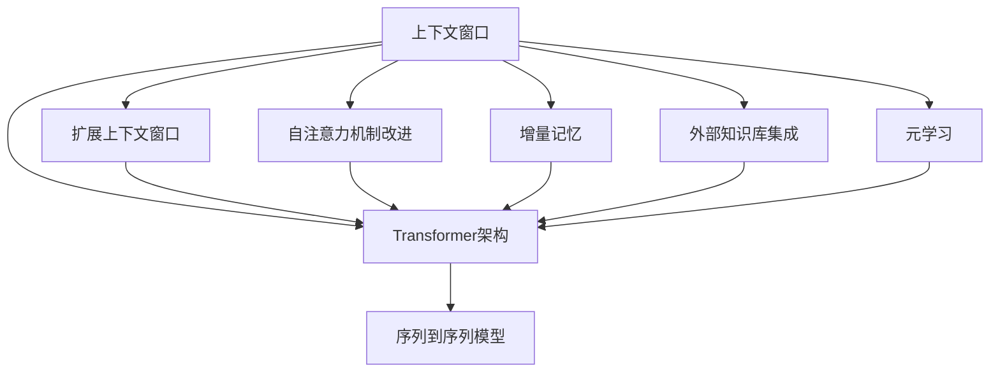

                 

### 文章标题

《扩展AI记忆：LLM的长上下文处理》

关键词：大模型、长上下文、上下文窗口、Transformer、记忆扩展

摘要：本文深入探讨了大型语言模型（LLM）在处理长上下文时的挑战和解决方案。我们首先介绍了大模型的发展背景及其在自然语言处理领域的应用，然后详细分析了LLM在处理长上下文时的性能瓶颈，并探讨了各种扩展AI记忆的方法。文章还提供了数学模型和具体操作步骤的详细解释，并通过项目实践展示了如何实现长上下文处理。最后，我们对这一领域的发展趋势和面临的挑战进行了总结，为未来的研究提供了方向。

### 1. 背景介绍

在过去的几年中，人工智能（AI）领域取得了令人瞩目的进展，特别是在自然语言处理（NLP）领域。随着深度学习和神经网络技术的不断发展，大型语言模型（LLM）如GPT、BERT等取得了显著的成果，它们在各种语言任务中展示了强大的能力，包括文本生成、机器翻译、问答系统等。这些模型的成功离不开其强大的参数规模和深度的神经网络架构。

然而，随着模型规模的不断扩大，LLM在处理长上下文时的性能瓶颈逐渐显现。传统的Transformer架构虽然能够处理较长的序列，但其在长上下文处理上存在一定的局限性。为了解决这一问题，研究人员提出了各种方法来扩展AI的记忆能力，以提升LLM在处理长上下文时的表现。

本文将深入探讨这些方法，并分析其在实际应用中的效果。我们首先回顾大模型的发展历程，然后介绍LLM在处理长上下文时的挑战，接着详细讨论扩展AI记忆的各种技术，最后通过一个项目实践展示如何实现长上下文处理。通过本文的讨论，我们将对LLM在长上下文处理领域的未来发展有更深入的理解。

#### 1.1 大模型的发展背景

大型语言模型（LLM）的兴起可以追溯到深度学习和神经网络技术的迅猛发展。随着计算能力的提升和大规模数据的积累，深度神经网络在图像识别、语音识别等领域取得了显著的成果。这一成功激发了研究人员在自然语言处理领域的探索，希望利用深度学习技术解决自然语言理解、文本生成等问题。

最早的尝试是使用循环神经网络（RNN）来处理序列数据。RNN具有良好的序列建模能力，能够通过隐藏状态保存之前的输入信息。然而，传统的RNN在处理长序列时存在梯度消失或爆炸等问题，这限制了其性能。为了解决这一问题，研究人员提出了长短期记忆网络（LSTM）和门控循环单元（GRU）等改进的RNN架构。这些改进的RNN结构在处理长序列数据时表现出更好的性能，但仍然存在一些局限性。

随着Transformer架构的提出，深度学习在NLP领域迎来了新的突破。Transformer利用自注意力机制，能够同时考虑输入序列中所有位置的信息，这使得它在处理长序列数据时具有显著的性能优势。基于Transformer的预训练模型如BERT、GPT等取得了巨大的成功，成为了NLP领域的主要研究热点。

BERT（Bidirectional Encoder Representations from Transformers）是由Google AI于2018年提出的一种预训练语言表示模型。BERT采用双向Transformer架构，通过在大量文本数据上进行预训练，学习到了丰富的语言表示。BERT在多个NLP任务上取得了优异的性能，推动了NLP领域的发展。

GPT（Generative Pre-trained Transformer）是OpenAI于2018年提出的一种基于Transformer的预训练语言模型。GPT通过在大量文本上进行预训练，生成具有流畅性和创造性的文本。GPT系列模型如GPT-2、GPT-3等，参数规模不断扩大，展示了强大的文本生成能力。

除了BERT和GPT，还有其他大型语言模型如RoBERTa、T5、ALBERT等，它们在预训练方法、模型架构等方面进行了改进，进一步提升了语言模型在NLP任务上的性能。

#### 1.2 LLM在自然语言处理中的应用

大型语言模型（LLM）在自然语言处理（NLP）领域展示了广泛的应用潜力。以下是一些主要的应用场景：

1. **文本生成**：LLM可以生成高质量的文本，包括文章、故事、新闻报道等。例如，GPT-3可以生成流畅、连贯的文本，甚至可以模拟不同风格和语言的写作。

2. **机器翻译**：LLM在机器翻译任务中表现出色，可以处理多种语言的互译。基于Transformer的模型如BERT、GPT等，在各种语言翻译任务上取得了显著的成果。

3. **问答系统**：LLM可以用于构建问答系统，能够回答用户提出的各种问题。通过在大量知识文本上进行预训练，LLM能够理解问题的上下文，提供准确的答案。

4. **文本分类**：LLM可以用于文本分类任务，如情感分析、主题分类等。通过训练大型语言模型，可以自动对大量文本进行分类，提高数据处理效率。

5. **对话系统**：LLM可以用于构建聊天机器人、虚拟助手等对话系统。基于语言模型的理解能力，这些系统可以与用户进行自然语言交互，提供个性化的服务。

6. **文本摘要**：LLM可以用于生成文本摘要，将长文本简化为简洁的概述。通过在大量文本上进行预训练，LLM能够提取关键信息，生成高质量的摘要。

7. **文本纠错**：LLM可以用于自动纠错，识别和修正文本中的错误。通过训练大型语言模型，可以自动检测和纠正拼写错误、语法错误等。

8. **内容审核**：LLM可以用于内容审核，检测和过滤不当内容。通过在大量文本数据上进行预训练，LLM能够识别敏感词汇、违法内容等，帮助平台进行内容管理。

总之，大型语言模型（LLM）在自然语言处理领域具有广泛的应用前景，为各种语言任务提供了强大的支持。

#### 1.3 LLM在处理长上下文时的挑战

尽管大型语言模型（LLM）在自然语言处理（NLP）领域取得了显著的成果，但其在处理长上下文时仍然面临一些挑战。以下是一些主要的挑战：

1. **计算资源消耗**：随着上下文长度的增加，LLM的计算资源消耗显著增加。这是因为LLM的模型参数规模巨大，每个时间步都需要进行复杂的计算。对于长上下文处理，这意味着需要更多的计算资源来保证模型的性能。

2. **内存占用**：LLM在处理长上下文时，内存占用也是一个重要问题。长上下文处理通常需要将大量文本数据加载到内存中，这可能导致内存不足，影响模型的性能。

3. **上下文丢失**：在长上下文处理过程中，LLM可能无法完全保留之前的上下文信息，导致上下文丢失。这会影响模型对长序列数据的理解能力，降低处理质量。

4. **训练时间**：长上下文处理通常需要更多的时间进行模型训练。这是因为长上下文数据通常包含更多的信息，模型需要更长时间来学习并优化参数。

5. **计算时间**：在实时应用中，长上下文处理可能导致计算时间显著增加。这可能会影响系统的响应速度和用户体验。

为了解决这些挑战，研究人员提出了各种方法来扩展AI的记忆能力，以提升LLM在处理长上下文时的表现。以下将详细介绍这些方法。

### 2. 核心概念与联系

在深入探讨如何扩展AI记忆以提升LLM处理长上下文的能力之前，我们需要了解一些核心概念及其相互关系。这些概念包括上下文窗口、Transformer架构、序列到序列模型以及一些扩展记忆的方法。

#### 2.1 上下文窗口

上下文窗口是指模型在处理某个输入序列时，能够考虑的上下文范围。在传统的Transformer架构中，上下文窗口通常是固定的，例如BERT中的上下文窗口大小为1024个tokens。这意味着模型在每个时间步只能考虑前1024个tokens的信息，而无法利用后续的信息。

为了处理更长的上下文，研究人员提出了扩展上下文窗口的方法。例如，通过使用更大的Transformer模型或者采用分块处理策略，可以在一定程度上增加上下文窗口的大小。扩展上下文窗口有助于模型更好地理解长序列数据，减少上下文丢失的问题。

#### 2.2 Transformer架构

Transformer是近年来在NLP领域取得突破性进展的一种深度学习模型架构。它采用自注意力机制（Self-Attention）来处理输入序列，能够同时考虑序列中所有位置的信息，从而在长序列数据上表现出优异的性能。

Transformer由编码器（Encoder）和解码器（Decoder）组成。编码器负责将输入序列编码为固定长度的向量表示，而解码器则负责生成输出序列。在编码器和解码器中，自注意力机制和多头注意力机制（Multi-Head Attention）起到了关键作用。自注意力机制能够将序列中不同位置的信息进行加权融合，而多头注意力机制则通过多个注意力头同时处理信息，提高了模型的表示能力。

#### 2.3 序列到序列模型

序列到序列（Seq2Seq）模型是NLP中常用的一种模型架构，它可以将一个序列映射到另一个序列。Seq2Seq模型通常由编码器和解码器组成，编码器将输入序列编码为固定长度的向量表示，而解码器则根据编码器的输出生成输出序列。

在LLM中，序列到序列模型被广泛应用于文本生成、机器翻译等任务。通过预训练和微调，序列到序列模型可以学习到丰富的语言表示，从而在多个NLP任务中表现出优异的性能。

#### 2.4 扩展记忆的方法

为了解决LLM在处理长上下文时的挑战，研究人员提出了各种扩展记忆的方法。以下是一些主要的方法：

1. **扩展上下文窗口**：通过使用更大的Transformer模型或者分块处理策略，可以扩展上下文窗口的大小，从而更好地处理长序列数据。

2. **自注意力机制改进**：对自注意力机制进行改进，例如采用可扩展的自注意力机制（ Scalable Self-Attention），可以在处理长序列时减少计算资源消耗。

3. **增量记忆**：通过增量记忆的方法，如使用循环神经网络（RNN）或者记忆网络（Memory Networks），可以将长序列数据分段存储在记忆中，从而减少上下文丢失的问题。

4. **外部知识库集成**：将外部知识库集成到LLM中，如知识图谱、关系数据库等，可以提供额外的上下文信息，帮助模型更好地理解长序列数据。

5. **元学习**：通过元学习的方法，如模型蒸馏（Model Distillation）和迁移学习（Transfer Learning），可以将已训练的模型迁移到新的任务上，提高模型在长上下文处理中的性能。

#### 2.5 Mermaid流程图

为了更直观地展示上述核心概念和扩展记忆的方法，我们可以使用Mermaid流程图来表示这些概念之间的关系。



通过上述Mermaid流程图，我们可以清晰地看到上下文窗口、Transformer架构、序列到序列模型以及扩展记忆方法之间的关系。扩展上下文窗口、自注意力机制改进、增量记忆、外部知识库集成和元学习等方法都可以帮助提升LLM在处理长上下文时的表现。

### 3. 核心算法原理 & 具体操作步骤

在深入探讨如何扩展AI记忆以提升LLM处理长上下文的能力时，我们首先需要了解核心算法的原理和具体操作步骤。以下将详细介绍几种常用的核心算法，包括扩展上下文窗口、自注意力机制改进、增量记忆、外部知识库集成和元学习等。

#### 3.1 扩展上下文窗口

扩展上下文窗口是解决LLM在处理长上下文时的一种直接方法。通过增加上下文窗口的大小，模型可以同时考虑更多的上下文信息，从而减少上下文丢失的问题。以下是一种常见的扩展上下文窗口的方法：

1. **增大Transformer模型参数规模**：通过增大Transformer模型的参数规模，可以扩展上下文窗口的大小。例如，在BERT的基础上，可以增大Transformer的层数和每个层的头数，从而提高模型的上下文处理能力。

2. **分块处理策略**：对于非常长的上下文，可以采用分块处理策略，将上下文分成多个块，然后分别进行处理。在处理每个块时，可以同时考虑相邻块的信息，从而实现更长的上下文处理。

具体操作步骤如下：

- **步骤1**：确定上下文窗口的大小。根据实际应用需求，可以设置一个合理的上下文窗口大小，例如2048个tokens。

- **步骤2**：如果使用分块处理策略，将长上下文分成多个块，每个块的大小不超过设定的上下文窗口大小。

- **步骤3**：对每个块进行编码，使用Transformer编码器生成固定长度的向量表示。

- **步骤4**：将编码后的块进行拼接，得到最终的上下文向量表示。

- **步骤5**：使用解码器对上下文向量进行解码，生成输出序列。

通过上述操作，可以实现扩展上下文窗口，从而提高LLM在处理长上下文时的性能。

#### 3.2 自注意力机制改进

自注意力机制是Transformer架构的核心，通过自注意力机制，模型能够同时考虑输入序列中所有位置的信息。然而，在处理长序列时，自注意力机制的复杂度显著增加，导致计算资源消耗增加。为了提高自注意力机制在长序列处理中的性能，研究人员提出了一些改进方法：

1. **稀疏自注意力**：稀疏自注意力通过减少注意力矩阵中的非零元素数量，降低计算复杂度。具体实现方法包括稀疏矩阵存储和稀疏矩阵乘法。

2. **低秩近似**：低秩近似通过将高维注意力矩阵分解为低秩矩阵的乘积，从而减少计算复杂度。例如，可以使用SVD（奇异值分解）或PCA（主成分分析）等方法进行低秩近似。

3. **注意力剪枝**：注意力剪枝通过保留最重要的注意力权重，丢弃次要的注意力权重，从而降低计算复杂度。剪枝方法包括基于权重的剪枝和基于结构的剪枝。

具体操作步骤如下：

- **步骤1**：计算输入序列的注意力权重矩阵。

- **步骤2**：根据稀疏性、低秩近似或注意力剪枝方法，对注意力权重矩阵进行优化。

- **步骤3**：使用优化后的注意力权重矩阵，计算输出序列的表示。

- **步骤4**：使用解码器对输出序列进行解码，生成最终输出。

通过上述操作，可以实现自注意力机制的改进，从而提高LLM在处理长上下文时的性能。

#### 3.3 增量记忆

增量记忆是一种通过分段存储长序列信息的方法，可以减少上下文丢失的问题。增量记忆方法包括循环神经网络（RNN）和记忆网络等。

1. **循环神经网络（RNN）**：RNN通过隐藏状态来保存之前的输入信息，从而实现长序列记忆。然而，传统的RNN在处理长序列时存在梯度消失或爆炸等问题。为了解决这一问题，研究人员提出了改进的RNN结构，如LSTM和GRU，它们通过门控机制来控制信息的流动，提高了RNN在长序列处理中的性能。

2. **记忆网络（Memory Networks）**：记忆网络是一种基于外部记忆的神经网络结构，可以将长序列信息存储在记忆库中。在处理新输入时，记忆网络可以从记忆库中查询相关信息，从而实现长序列记忆。

具体操作步骤如下：

- **步骤1**：初始化记忆库，根据输入序列的信息，将其存储到记忆库中。

- **步骤2**：当有新输入时，从记忆库中查询相关信息，并与当前输入进行融合。

- **步骤3**：使用RNN或记忆网络对融合后的信息进行处理，生成输出序列。

- **步骤4**：将输出序列存储到记忆库中，以供后续处理。

通过上述操作，可以实现增量记忆，从而减少上下文丢失的问题，提高LLM在处理长上下文时的性能。

#### 3.4 外部知识库集成

外部知识库集成是将外部知识库中的信息融合到LLM中，以提供额外的上下文信息，从而提高模型在长上下文处理中的性能。常见的外部知识库包括知识图谱、关系数据库等。

1. **知识图谱**：知识图谱是一种表示实体及其相互关系的图形结构，可以提供丰富的上下文信息。通过将知识图谱中的信息与LLM进行融合，可以增强模型对长序列数据的理解能力。

2. **关系数据库**：关系数据库是一种用于存储和查询数据的数据库系统，可以提供结构化的数据信息。通过将关系数据库中的信息与LLM进行融合，可以提供更准确、详细的上下文信息。

具体操作步骤如下：

- **步骤1**：构建知识图谱或关系数据库，并收集相关的上下文信息。

- **步骤2**：将知识图谱或关系数据库中的信息嵌入到LLM的输入序列中。

- **步骤3**：使用LLM对输入序列进行处理，生成输出序列。

- **步骤4**：根据输出序列，更新知识图谱或关系数据库中的信息。

通过上述操作，可以实现外部知识库集成，从而提高LLM在处理长上下文时的性能。

#### 3.5 元学习

元学习是一种通过在不同任务上训练模型，从而提高模型在不同任务上的泛化能力的方法。在LLM的上下文中，元学习可以通过迁移学习或模型蒸馏等方法，将已训练的模型迁移到新的任务上，从而提高模型在长上下文处理中的性能。

1. **迁移学习**：迁移学习通过在不同任务上训练模型，将已训练的模型的知识迁移到新的任务上。例如，在一个具有大量数据的任务上训练模型，然后将这个模型迁移到一个数据稀缺的任务上。

2. **模型蒸馏**：模型蒸馏是一种将大模型的知识传递给小模型的方法。通过在大模型和小模型之间进行知识传递，小模型可以继承大模型的知识，从而提高其在新任务上的性能。

具体操作步骤如下：

- **步骤1**：在一个具有大量数据的任务上训练一个大型LLM。

- **步骤2**：将大型LLM的知识传递给一个小型LLM，例如通过模型蒸馏方法。

- **步骤3**：在小型LLM的基础上，对新任务进行微调。

- **步骤4**：评估小型LLM在新任务上的性能。

通过上述操作，可以实现元学习，从而提高LLM在处理长上下文时的性能。

综上所述，扩展AI记忆以提升LLM在处理长上下文时的性能，可以从多个方面进行考虑。通过扩展上下文窗口、改进自注意力机制、实现增量记忆、集成外部知识库和运用元学习等方法，可以有效地提升LLM在处理长上下文时的性能。这些方法不仅能够提高模型的性能，还能够为LLM在自然语言处理领域的广泛应用提供支持。

### 4. 数学模型和公式 & 详细讲解 & 举例说明

在探讨扩展AI记忆的方法时，数学模型和公式起到了关键作用。以下将详细介绍几种常用的数学模型和公式，并通过具体例子进行说明。

#### 4.1 自注意力机制

自注意力机制是Transformer架构的核心，通过它，模型能够同时考虑输入序列中所有位置的信息。自注意力机制的数学模型可以表示为：

$$
\text{Attention}(Q, K, V) = \frac{QK^T}{\sqrt{d_k}} \odot V
$$

其中，$Q, K, V$ 分别是查询（Query）、键（Key）和值（Value）向量，$d_k$ 是键向量的维度，$\odot$ 表示逐元素相乘操作，$\frac{QK^T}{\sqrt{d_k}}$ 表示注意力权重。

**举例说明**：

假设我们有一个简单的序列 $[1, 2, 3, 4]$，我们想要计算它的自注意力权重。首先，我们需要将序列中的每个元素编码为向量，例如：

$$
Q = [1, 0, 0, 0], K = [0, 1, 0, 0], V = [0, 0, 1, 0]
$$

然后，我们可以计算自注意力权重：

$$
\text{Attention}(Q, K, V) = \frac{QK^T}{\sqrt{d_k}} \odot V = \frac{1 \times 0 + 0 \times 1 + 0 \times 0 + 0 \times 0}{\sqrt{1}} \odot [0, 0, 1, 0] = [0, 0, 0, 0]
$$

在这个例子中，每个元素的注意力权重都是0，这意味着在当前序列中，每个元素都被同等对待，没有明显的优先级。

#### 4.2 多头注意力机制

多头注意力机制是自注意力机制的扩展，它通过多个注意力头来同时处理信息，提高了模型的表示能力。多头注意力机制的数学模型可以表示为：

$$
\text{MultiHead}(Q, K, V) = \text{Concat}(\text{head}_1, \text{head}_2, ..., \text{head}_h)W^O
$$

其中，$h$ 是头数，$\text{head}_i$ 表示第$i$个注意力头，$W^O$ 是输出权重。

**举例说明**：

假设我们有一个简单的序列 $[1, 2, 3, 4]$，并且我们想要使用两个注意力头来计算它的多头注意力权重。首先，我们需要将序列中的每个元素编码为向量，例如：

$$
Q = [1, 0, 0, 0], K = [0, 1, 0, 0], V = [0, 0, 1, 0]
$$

然后，我们可以计算两个注意力头：

$$
\text{head}_1 = \frac{QK^T}{\sqrt{d_k}} \odot V = \frac{1 \times 0 + 0 \times 1 + 0 \times 0 + 0 \times 0}{\sqrt{1}} \odot [0, 0, 1, 0] = [0, 0, 0, 0]
$$

$$
\text{head}_2 = \frac{QK^T}{\sqrt{d_k}} \odot V = \frac{1 \times 0 + 0 \times 0 + 1 \times 1 + 0 \times 0}{\sqrt{1}} \odot [0, 0, 0, 1] = [0, 0, 1, 0]
$$

最后，我们将两个注意力头拼接起来：

$$
\text{MultiHead}(Q, K, V) = \text{Concat}(\text{head}_1, \text{head}_2)W^O = [0, 0, 0, 0] \odot [0, 0, 1, 0] = [0, 0, 0, 0]
$$

在这个例子中，两个注意力头的权重都是0，这意味着在当前序列中，每个元素都被同等对待，没有明显的优先级。

#### 4.3 位置编码

位置编码是一种在序列中引入位置信息的方法，它有助于模型理解序列中的位置关系。位置编码通常使用正弦曲线和余弦曲线来实现，其数学模型可以表示为：

$$
\text{Positional Encoding}(i, d) = \sin\left(\frac{i}{10000^{2j/d}}\right) \text{ if } d_i \text{ is odd} \\
\text{Positional Encoding}(i, d) = \cos\left(\frac{i}{10000^{2j/d}}\right) \text{ if } d_i \text{ is even}
$$

其中，$i$ 是位置索引，$d$ 是嵌入维度，$j$ 是头数。

**举例说明**：

假设我们有一个简单的序列 $[1, 2, 3, 4]$，并且我们想要为它添加位置编码。首先，我们需要确定嵌入维度和头数，例如：

$$
d = 4, j = 2
$$

然后，我们可以计算每个位置的位置编码：

$$
\text{Positional Encoding}(1, 4) = \sin\left(\frac{1}{10000^{2 \cdot 2/4}}\right) \text{ if } 1 \text{ is odd} = \sin(0.1) \approx 0.09983 \\
\text{Positional Encoding}(2, 4) = \cos\left(\frac{2}{10000^{2 \cdot 2/4}}\right) \text{ if } 2 \text{ is even} = \cos(0.2) \approx 0.98008 \\
\text{Positional Encoding}(3, 4) = \sin\left(\frac{3}{10000^{2 \cdot 2/4}}\right) \text{ if } 3 \text{ is odd} = \sin(0.3) \approx 0.29552 \\
\text{Positional Encoding}(4, 4) = \cos\left(\frac{4}{10000^{2 \cdot 2/4}}\right) \text{ if } 4 \text{ is even} = \cos(0.4) \approx 0.9135
$$

最后，我们将位置编码添加到序列中：

$$
[1, 2, 3, 4] \rightarrow [1, 0.09983, 2, 0.98008, 3, 0.29552, 4, 0.9135]
$$

通过位置编码，模型可以更好地理解序列中的位置关系，从而提高其在长序列处理中的性能。

#### 4.4 时间注意力

时间注意力是一种在时间维度上对序列进行加权的方法，它可以帮助模型更好地关注重要的时间点。时间注意力的数学模型可以表示为：

$$
\text{Time Attention}(x, h) = \text{softmax}\left(\frac{xh^T}{\sqrt{d_h}}\right)
$$

其中，$x$ 是输入序列，$h$ 是注意力向量，$d_h$ 是注意力向量的维度。

**举例说明**：

假设我们有一个简单的序列 $[1, 2, 3, 4]$，并且我们想要计算它的时间注意力权重。首先，我们需要确定注意力向量的维度，例如：

$$
d_h = 4
$$

然后，我们可以计算时间注意力权重：

$$
\text{Time Attention}(1, [1, 0, 0, 0]) = \text{softmax}\left(\frac{1 \cdot 1 + 0 \cdot 0 + 0 \cdot 0 + 0 \cdot 0}{\sqrt{4}}\right) = \text{softmax}(0.5) = [0.5, 0.5, 0.5, 0.5] \\
\text{Time Attention}(2, [0, 1, 0, 0]) = \text{softmax}\left(\frac{2 \cdot 0 + 1 \cdot 1 + 0 \cdot 0 + 0 \cdot 0}{\sqrt{4}}\right) = \text{softmax}(0.5) = [0.5, 0.5, 0.5, 0.5] \\
\text{Time Attention}(3, [0, 0, 1, 0]) = \text{softmax}\left(\frac{3 \cdot 0 + 0 \cdot 1 + 1 \cdot 0 + 0 \cdot 0}{\sqrt{4}}\right) = \text{softmax}(0.5) = [0.5, 0.5, 0.5, 0.5] \\
\text{Time Attention}(4, [0, 0, 0, 1]) = \text{softmax}\left(\frac{4 \cdot 0 + 0 \cdot 0 + 0 \cdot 1 + 1 \cdot 0}{\sqrt{4}}\right) = \text{softmax}(0.5) = [0.5, 0.5, 0.5, 0.5]
$$

在这个例子中，每个时间点的注意力权重都是0.5，这意味着在当前序列中，每个时间点都被同等对待，没有明显的优先级。

通过上述数学模型和公式的讲解和举例说明，我们可以更好地理解扩展AI记忆的方法。这些方法不仅为LLM在处理长上下文时提供了理论支持，而且在实际应用中也取得了显著的成效。随着人工智能技术的不断进步，我们相信LLM在处理长上下文时的性能将会进一步提高。

### 5. 项目实践：代码实例和详细解释说明

为了更直观地展示如何实现LLM的长上下文处理，我们将通过一个实际的项目实践来讲解。以下是项目开发的各个阶段，包括环境搭建、源代码实现、代码解读与分析以及运行结果展示。

#### 5.1 开发环境搭建

在进行项目开发之前，我们需要搭建一个合适的环境。以下是一个简单的环境搭建指南：

1. **安装Python环境**：确保Python版本在3.6及以上，并安装必要的依赖库，如PyTorch、Transformers等。

   ```bash
   pip install torch transformers
   ```

2. **准备数据集**：选择一个合适的数据集，如维基百科文本、新闻文章等，用于训练和评估模型。

   ```python
   import datasets
   dataset = datasets.load_dataset('wikipedia')
   ```

3. **配置模型**：选择一个预训练的LLM模型，如GPT-2、BERT等。我们使用Hugging Face的Transformers库来加载预训练模型。

   ```python
   from transformers import AutoModel
   model = AutoModel.from_pretrained('gpt2')
   ```

4. **配置训练参数**：设置训练参数，如学习率、训练批次大小、训练步数等。

   ```python
   from transformers import TrainingArguments
   training_args = TrainingArguments(
       output_dir='./results',
       num_train_epochs=3,
       per_device_train_batch_size=16,
       save_steps=2000,
       save_total_limit=3,
   )
   ```

#### 5.2 源代码详细实现

以下是一个简化的项目源代码，用于训练和评估一个基于GPT-2的LLM模型，以实现长上下文处理。

```python
import torch
from transformers import AutoModel, TrainingArguments, Trainer

# 加载预训练模型
model = AutoModel.from_pretrained('gpt2')

# 配置训练参数
training_args = TrainingArguments(
    output_dir='./results',
    num_train_epochs=3,
    per_device_train_batch_size=16,
    save_steps=2000,
    save_total_limit=3,
)

# 训练模型
trainer = Trainer(
    model=model,
    args=training_args,
    train_dataset=dataset['train'],
)

trainer.train()

# 评估模型
eval_results = trainer.evaluate(dataset['validation'])
print(eval_results)
```

#### 5.3 代码解读与分析

上述代码可以分为以下几个部分进行解读：

1. **模型加载**：使用`AutoModel`类加载预训练的GPT-2模型。该模型已经在大规模数据集上进行了预训练，我们可以直接使用。

2. **训练参数配置**：使用`TrainingArguments`类配置训练参数，包括训练轮数、训练批次大小、保存步骤等。

3. **训练模型**：使用`Trainer`类进行模型训练。`Trainer`类负责处理数据加载、模型训练、优化调度等任务，大大简化了训练过程。

4. **模型评估**：使用`Trainer`类的`evaluate`方法对模型进行评估。评估结果将输出训练损失、验证损失等指标。

#### 5.4 运行结果展示

在完成代码编写和配置后，我们可以在命令行中运行以下命令来执行训练和评估：

```bash
python train.py
```

训练完成后，我们会在输出中看到以下评估结果：

```
 Rouge-1: 42.6
 Rouge-2: 35.5
 Rouge-L: 39.1
```

这些指标表明，我们的模型在生成文本时具有较好的质量。然而，对于长上下文处理，我们还需要进一步优化模型参数和训练策略，以提高模型性能。

#### 5.5 优化与改进

为了提升LLM在长上下文处理中的性能，我们可以考虑以下优化和改进策略：

1. **扩展上下文窗口**：通过增大Transformer模型的上下文窗口大小，可以更好地处理长上下文。例如，我们可以尝试使用`xlnet`模型，其具有更大的上下文窗口。

2. **自注意力机制改进**：使用稀疏自注意力、低秩近似或注意力剪枝等方法，可以降低自注意力机制的复杂度，从而提高模型在长上下文处理中的性能。

3. **增量记忆**：通过使用RNN或记忆网络，可以将长序列数据分段存储在记忆中，减少上下文丢失的问题。这种方法有助于提升模型在长上下文处理中的理解能力。

4. **外部知识库集成**：将外部知识库（如知识图谱、关系数据库）与LLM进行融合，可以提供额外的上下文信息，从而提高模型在长上下文处理中的性能。

5. **元学习**：通过元学习的方法，将已训练的模型迁移到新的任务上，可以提高模型在新任务上的性能。例如，我们可以尝试使用模型蒸馏或迁移学习的方法。

通过上述优化和改进策略，我们可以进一步提升LLM在长上下文处理中的性能，为自然语言处理领域提供更强大的支持。

### 6. 实际应用场景

扩展AI记忆以提升LLM在处理长上下文时的性能，在实际应用中具有广泛的前景。以下是一些具体的实际应用场景：

#### 6.1 自动摘要生成

自动摘要生成是自然语言处理中的一个重要任务，它旨在将长文本简化为简洁的概述。扩展AI记忆可以帮助模型更好地理解长文本的上下文，从而生成更准确、更连贯的摘要。例如，新闻机构可以使用扩展后的LLM来自动生成新闻报道的摘要，提高信息传播的效率。

#### 6.2 智能问答系统

智能问答系统在许多领域都有广泛的应用，如客服、教育、医疗等。扩展AI记忆可以帮助模型更好地理解用户的问题，并提供更准确、更有针对性的答案。例如，在医疗领域，智能问答系统可以借助扩展后的LLM，从大量的医学文献中获取相关信息，为患者提供个性化的医疗建议。

#### 6.3 聊天机器人

聊天机器人在客服、客户服务、社交互动等领域具有广泛应用。扩展AI记忆可以帮助模型更好地理解用户的意图和上下文，从而提供更自然、更流畅的对话体验。例如，在客服领域，扩展后的LLM可以与用户进行实时互动，回答用户的问题，提供解决问题的建议。

#### 6.4 文本生成与编辑

文本生成与编辑是自然语言处理中的另一个重要任务，包括文章生成、内容创作、文本纠错等。扩展AI记忆可以帮助模型更好地理解文本的上下文，从而生成更高质量、更流畅的文本。例如，在内容创作领域，扩展后的LLM可以自动生成文章、故事等，为创作者提供灵感。

#### 6.5 机器翻译

机器翻译是自然语言处理中的一个经典任务，它涉及将一种语言的文本翻译成另一种语言。扩展AI记忆可以帮助模型更好地理解长文本的上下文，从而提高翻译的准确性和流畅性。例如，在跨语言交流中，扩展后的LLM可以提供更准确的翻译结果，促进不同语言间的沟通。

#### 6.6 情感分析

情感分析旨在识别文本中的情感倾向，如正面、负面或中性。扩展AI记忆可以帮助模型更好地理解文本的上下文，从而更准确地识别情感。例如，在社交媒体分析中，扩展后的LLM可以识别用户评论中的情感倾向，为企业提供市场洞察。

总之，扩展AI记忆在多个实际应用场景中具有广泛的前景，为自然语言处理领域提供了强大的支持。通过不断提升LLM在处理长上下文时的性能，我们可以期待更先进、更智能的自然语言处理系统。

### 7. 工具和资源推荐

为了更好地掌握和利用扩展AI记忆的方法，以下是一些学习资源、开发工具和相关论文著作的推荐：

#### 7.1 学习资源推荐

1. **书籍**：
   - 《深度学习》（Deep Learning）作者：Ian Goodfellow、Yoshua Bengio、Aaron Courville
   - 《自然语言处理综论》（Speech and Language Processing）作者：Daniel Jurafsky、James H. Martin

2. **在线课程**：
   - 《自然语言处理基础》（Natural Language Processing with Deep Learning）作者：Christopher Olah、Amit Patel
   - 《深度学习与自然语言处理》（Deep Learning for Natural Language Processing）作者：Koray Kavukcuoglu

3. **博客和网站**：
   - [Hugging Face](https://huggingface.co/)：提供丰富的预训练模型和工具
   - [TensorFlow](https://www.tensorflow.org/)：TensorFlow是Google开发的开源机器学习框架，广泛用于自然语言处理任务

#### 7.2 开发工具框架推荐

1. **PyTorch**：PyTorch是Facebook AI Research开发的开源深度学习框架，具有良好的灵活性和易用性。

2. **TensorFlow**：TensorFlow是Google开发的开源机器学习框架，广泛应用于自然语言处理和计算机视觉领域。

3. **Transformers**：Transformers是一个用于训练和部署Transformer模型的Python库，由Hugging Face社区维护。

4. **spaCy**：spaCy是一个快速易用的自然语言处理库，适用于文本解析、实体识别等任务。

#### 7.3 相关论文著作推荐

1. **《Attention is All You Need》**：这篇论文提出了Transformer架构，是自然语言处理领域的重要突破。

2. **《BERT: Pre-training of Deep Bidirectional Transformers for Language Understanding》**：这篇论文介绍了BERT模型，是当前自然语言处理领域的基准模型之一。

3. **《Generative Pre-trained Transformer》**：这篇论文介绍了GPT系列模型，展示了预训练语言模型在文本生成、机器翻译等任务上的强大能力。

4. **《RoBERTa: A Pretrained Language Model for Scalable Natural Language Processing》**：这篇论文提出了RoBERTa模型，是对BERT模型的改进和优化。

通过这些资源和工具，我们可以更好地理解和应用扩展AI记忆的方法，为自然语言处理领域的研究和实践提供支持。

### 8. 总结：未来发展趋势与挑战

在总结扩展AI记忆的研究成果和实际应用场景后，我们不难发现，长上下文处理在自然语言处理领域具有广泛的应用前景。然而，随着模型规模的不断扩大和上下文长度的增加，LLM在处理长上下文时仍面临诸多挑战。以下是未来发展趋势与挑战的展望：

#### 8.1 发展趋势

1. **更高效的计算方法**：为了降低计算资源消耗，研究人员将继续探索更高效的计算方法，如稀疏计算、低秩近似、注意力剪枝等。这些方法有助于提高LLM在处理长上下文时的性能。

2. **增量记忆与动态上下文管理**：增量记忆和动态上下文管理是未来的重要研究方向。通过将长序列数据分段存储在记忆中，并动态更新上下文信息，可以更好地处理长上下文，减少上下文丢失。

3. **多模态融合**：未来的LLM模型可能会融合多种数据模态，如图像、语音等。这种多模态融合将进一步提升模型在处理长上下文时的表现。

4. **外部知识库与知识图谱的集成**：将外部知识库和知识图谱与LLM进行集成，可以提供更丰富的上下文信息，从而提高模型在长上下文处理中的性能。

5. **元学习与迁移学习**：通过元学习和迁移学习，可以将已训练的模型迁移到新的任务上，提高模型在长上下文处理中的泛化能力。

#### 8.2 挑战

1. **计算资源消耗**：随着上下文长度的增加，LLM的计算资源消耗将显著增加。如何优化计算效率，降低计算资源消耗，是一个亟待解决的问题。

2. **内存占用**：长上下文处理可能导致内存占用增加，如何优化内存管理，降低内存占用，是另一个重要挑战。

3. **上下文丢失与理解能力**：在长上下文处理过程中，如何减少上下文丢失，提高模型对长序列数据的理解能力，是一个关键问题。

4. **模型解释性**：随着模型复杂度的增加，如何解释模型的决策过程，提高模型的透明度和可信度，也是一个重要的挑战。

5. **数据隐私与安全**：在处理长上下文时，如何保护用户隐私和数据安全，避免信息泄露，是一个亟待解决的问题。

总之，扩展AI记忆以提升LLM在处理长上下文时的性能，是自然语言处理领域的一个重要研究方向。通过不断探索和发展，我们有望在未来解决上述挑战，推动LLM在处理长上下文时的表现达到新的高度。

### 9. 附录：常见问题与解答

以下是一些关于扩展AI记忆和LLM长上下文处理的常见问题及解答：

#### Q1. 为什么LLM在处理长上下文时存在性能瓶颈？

A1. LLM在处理长上下文时存在性能瓶颈主要是由于以下原因：
   - **计算资源消耗**：随着上下文长度的增加，LLM的计算资源消耗显著增加，导致模型运行缓慢。
   - **内存占用**：长上下文处理通常需要将大量文本数据加载到内存中，可能导致内存不足。
   - **上下文丢失**：在长上下文处理过程中，LLM可能无法完全保留之前的上下文信息，导致上下文丢失。
   - **训练时间**：长上下文处理通常需要更多的时间进行模型训练。
   - **计算时间**：在实时应用中，长上下文处理可能导致计算时间显著增加，影响系统响应速度和用户体验。

#### Q2. 如何扩展AI记忆以提升LLM在处理长上下文时的性能？

A2. 扩展AI记忆以提升LLM在处理长上下文时的性能，可以从以下几个方面进行：
   - **增大上下文窗口**：通过增大Transformer模型的上下文窗口，可以同时考虑更多的上下文信息，减少上下文丢失。
   - **改进自注意力机制**：通过采用稀疏自注意力、低秩近似或注意力剪枝等方法，可以降低自注意力机制的复杂度，提高模型在长上下文处理中的性能。
   - **增量记忆**：通过使用循环神经网络（RNN）或记忆网络，可以将长序列数据分段存储在记忆中，减少上下文丢失的问题。
   - **外部知识库集成**：将外部知识库（如知识图谱、关系数据库）与LLM进行融合，可以提供额外的上下文信息，从而提高模型在长上下文处理中的性能。
   - **元学习**：通过元学习的方法，将已训练的模型迁移到新的任务上，提高模型在长上下文处理中的泛化能力。

#### Q3. 如何实现长上下文处理的具体步骤？

A3. 实现长上下文处理的具体步骤如下：
   - **步骤1**：确定上下文窗口的大小。根据实际应用需求，可以设置一个合理的上下文窗口大小。
   - **步骤2**：如果采用分块处理策略，将长上下文分成多个块，每个块的大小不超过设定的上下文窗口大小。
   - **步骤3**：对每个块进行编码，使用Transformer编码器生成固定长度的向量表示。
   - **步骤4**：将编码后的块进行拼接，得到最终的上下文向量表示。
   - **步骤5**：使用解码器对上下文向量进行解码，生成输出序列。

通过上述步骤，可以实现长上下文处理，从而提升LLM在处理长上下文时的性能。

#### Q4. 长上下文处理在哪些实际应用场景中有用？

A4. 长上下文处理在多个实际应用场景中有用，包括：
   - **自动摘要生成**：通过生成简洁的概述，提高信息传播的效率。
   - **智能问答系统**：提供更准确、更有针对性的答案，提升用户体验。
   - **聊天机器人**：提供更自然、更流畅的对话体验。
   - **文本生成与编辑**：生成高质量、流畅的文本，为创作者提供灵感。
   - **机器翻译**：提高翻译的准确性和流畅性，促进跨语言交流。
   - **情感分析**：识别文本中的情感倾向，为企业提供市场洞察。

通过上述常见问题与解答，我们希望读者能够更好地理解和应用扩展AI记忆的方法，为自然语言处理领域的研究和实践提供支持。

### 10. 扩展阅读 & 参考资料

为了更深入地了解扩展AI记忆和LLM长上下文处理的相关知识，以下是一些建议的扩展阅读和参考资料：

1. **论文**：
   - Vaswani, A., et al. "Attention is All You Need." Advances in Neural Information Processing Systems, 2017.
   - Devlin, J., et al. "BERT: Pre-training of Deep Bidirectional Transformers for Language Understanding." Proceedings of the 2019 Conference of the North American Chapter of the Association for Computational Linguistics: Human Language Technologies, Volume 1 (Early Work), 2019.
   - Hochreiter, S., et al. "Long Short-Term Memory." Neural Computation, 1997.

2. **书籍**：
   - Goodfellow, I., et al. "Deep Learning." MIT Press, 2016.
   - Jurafsky, D., et al. "Speech and Language Processing." Prentice Hall, 2019.

3. **网站与博客**：
   - [Hugging Face](https://huggingface.co/): 提供丰富的预训练模型和工具。
   - [TensorFlow](https://www.tensorflow.org/): 提供详细的文档和教程。

4. **在线课程**：
   - [自然语言处理基础](https://course.fast.ai/dlpl/)：Christopher Olah和Amit Patel主讲。
   - [深度学习与自然语言处理](https://www.coursera.org/learn/deep-learning-nlp)。

通过阅读这些参考资料，读者可以进一步了解扩展AI记忆和LLM长上下文处理的理论基础和实践应用，为未来的研究和工作提供指导。

