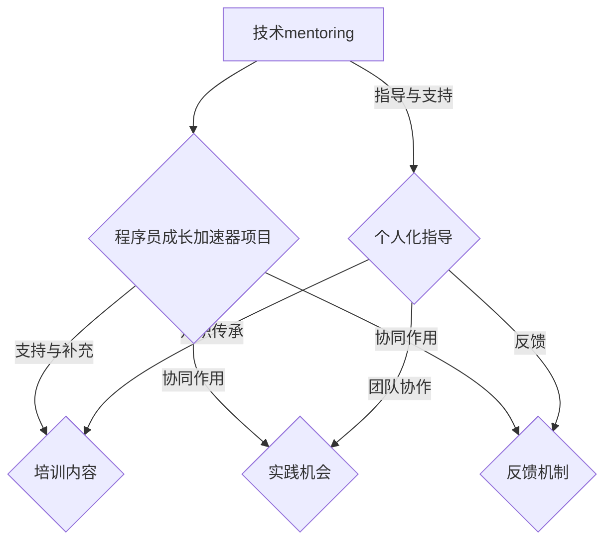

                 

### 背景介绍 Background

在当今快速发展的科技时代，程序员作为数字经济的建设者，承担着推动技术进步的重要角色。然而，随着技术的不断演进，程序员面临的挑战也日益复杂。技术更新迭代速度加快，新兴领域层出不穷，这对程序员的技能要求提出了更高的标准。为了满足这些需求，许多企业和组织开始意识到对程序员进行持续培训和指导的重要性。在这种背景下，技术mentoring（技术指导）逐渐成为一种有效的解决方案，而构建程序员成长加速器项目则成为企业提升员工技能和竞争力的重要手段。

#### 技术mentoring的定义和重要性

技术mentoring，即通过资深技术人员对新手或团队成员进行指导、培训和知识分享，以帮助他们更快地成长。这种模式不仅有助于提升团队成员的技术能力，还能增强团队凝聚力，提高工作效率。以下是技术mentoring的重要性：

1. **技能提升**：通过定期的交流和学习，技术人员能够迅速掌握新技能和知识，从而适应快速变化的技术环境。
2. **知识传承**：资深技术人员可以通过mentoring将自身的经验和技术积累传递给下一代，确保知识的持续积累和传承。
3. **团队协作**：技术mentoring有助于增强团队成员之间的沟通和协作，提高团队整体工作效率。
4. **人才发展**：通过技术指导，企业能够发现和培养潜在的技术人才，为企业的长期发展储备力量。

#### 构建程序员成长加速器项目的必要性

构建程序员成长加速器项目，旨在通过系统化的培训和实践，加速程序员的成长。这一项目的必要性体现在以下几个方面：

1. **技能缺口**：随着技术的快速发展，市场上对高技能程序员的供需差距日益扩大。企业通过成长加速器项目，可以快速提升员工技能，缩小这一差距。
2. **人才培养**：成长加速器项目为程序员提供了系统化、结构化的学习路径，有助于他们在短时间内掌握关键技能，为企业培养出更多合格的技术人才。
3. **组织效能**：通过成长加速器项目，企业能够提高员工的工作效率和团队协作能力，从而提升整体组织效能。
4. **竞争力提升**：拥有高素质的程序员团队，是企业保持竞争力的关键。成长加速器项目有助于企业培养出具有创新能力和实战经验的技术人才，提升企业在市场中的竞争力。

综上所述，技术mentoring和构建程序员成长加速器项目已经成为提升程序员技能和竞争力的必要手段。在接下来的章节中，我们将进一步探讨如何设计并实施这一项目，以及它在实际应用中的效果和挑战。通过逐步分析和推理，我们希望能够为企业和程序员提供有益的参考和指导。### 核心概念与联系 Core Concepts & Relationships

在构建程序员成长加速器项目之前，我们需要理解一些核心概念和它们之间的相互关系。以下是对这些核心概念的简要介绍和它们在项目中的关联。

#### 技术mentoring

技术mentoring是一种指导模式，由经验丰富的技术人员（mentor）对新手或团队成员（mentee）进行指导、支持和培训。这种模式旨在帮助新手快速提升技能，同时促进知识的传承和团队协作。

##### 关键要素

1. **mentor（导师）**：导师是具备丰富经验的技术人员，他们在某个领域有深厚的知识和丰富的实践经验。
2. **mentee（学员）**：学员是新手或团队成员，他们需要通过导师的指导来提升自己的技能和知识。
3. **指导过程**：指导过程包括定期的一对一交流、项目合作、技能分享和反馈。

##### 技术mentoring的作用

- **技能提升**：导师通过分享实战经验和专业知识，帮助学员快速掌握新技能。
- **知识传承**：导师将自己的经验和技术积累传递给下一代，确保知识的持续积累和传承。
- **团队协作**：技术指导有助于增强团队成员之间的沟通和协作，提高团队整体工作效率。

#### 程序员成长加速器项目

程序员成长加速器项目是一种系统化的培训模式，旨在通过高强度的学习和实践，加速程序员的技能提升和职业发展。

##### 关键要素

1. **培训内容**：包括最新的技术趋势、前沿知识、实战经验和项目实践。
2. **学习路径**：系统化的学习路径，帮助程序员按照顺序逐步提升技能。
3. **实践机会**：通过实际项目，让程序员将所学知识应用到实际工作中。
4. **反馈机制**：定期的反馈和评估，帮助程序员及时调整学习方向和目标。

##### 程序员成长加速器项目的作用

- **技能提升**：通过系统化的培训和实战项目，帮助程序员在短时间内提升技能。
- **职业发展**：加速程序员的职业发展，提高他们在行业中的竞争力。
- **组织效能**：提升团队成员的技能水平和工作效率，提高整体组织效能。

#### 技术mentoring与程序员成长加速器项目的关联

技术mentoring是程序员成长加速器项目的重要组成部分。两者之间的关系可以概括为：

1. **支持与补充**：技术mentoring为程序员成长加速器项目提供了个人化的指导和支持，补充了系统化培训的不足。
2. **协同作用**：技术mentoring和程序员成长加速器项目共同作用，促进程序员的全方位成长。

通过技术mentoring和程序员成长加速器项目的结合，企业能够为程序员提供一个全面、系统的成长环境，帮助他们快速提升技能，适应快速变化的技术环境。

#### Mermaid 流程图

以下是一个用于描述技术mentoring和程序员成长加速器项目之间关系的 Mermaid 流程图：



通过这个流程图，我们可以清晰地看到技术mentoring和程序员成长加速器项目之间的相互作用和关联。接下来，我们将进一步探讨如何具体实施这些项目，并分析其在实际应用中的效果和挑战。### 核心算法原理 & 具体操作步骤 Core Algorithm Principles & Step-by-Step Procedures

在构建程序员成长加速器项目时，核心算法原理和具体操作步骤的掌握至关重要。以下将详细介绍这些核心算法原理，并逐步解释如何实施这些步骤。

#### 核心算法原理

1. **动态规划（Dynamic Programming）**
   动态规划是一种在数学、管理科学、计算机科学、经济学和生物信息学中用于解决复杂问题的方法。它通过将问题分解为更小的子问题，并存储这些子问题的解，以避免重复计算，从而显著提高算法的效率。

2. **分而治之（Divide and Conquer）**
   分而治之是一种常见的算法设计技巧，其核心思想是将一个难以直接解决的大问题分解成若干个规模较小的相同问题，然后递归地解决这些子问题，最终合并这些子问题的解以解决问题。

3. **贪心算法（Greedy Algorithm）**
   贪心算法在每一步选择中都采取在当前状态下最好或最优的选择，从而希望导致结果是全局最好或最优的算法。贪心算法通常可以快速得到近似解，但在某些情况下可能无法得到最优解。

4. **回溯法（Backtracking）**
   回溯法是一种通过尝试各种可能的解来寻找问题的解的方法。它通常从问题的部分解开始，逐步增加新元素，如果找到一个可行解，则继续扩展；否则，回溯到上一个部分解，并尝试另一个可能的元素。

#### 具体操作步骤

##### 动态规划

**步骤 1**：定义子问题
将原问题分解为若干个子问题，并确保子问题之间具有重叠性。

**步骤 2**：定义状态
为每个子问题定义一个状态，通常用一个数组或变量表示。

**步骤 3**：定义状态转移方程
根据子问题的状态，定义状态转移方程，即如何从一个状态过渡到另一个状态。

**步骤 4**：初始化边界条件
为最简单的子问题初始化状态值，通常是基线条件。

**步骤 5**：自底向上求解
从最简单的子问题开始，依次求解更复杂的子问题，并将结果存储。

**步骤 6**：自顶向下求解
从原问题开始，使用已求解的子问题结果，逐步求解原问题。

##### 分而治之

**步骤 1**：分解问题
将原问题分解为若干个子问题，通常为规模相等或近似的问题。

**步骤 2**：递归求解
对每个子问题递归地应用分而治之算法，直到问题规模足够小，可以直接求解。

**步骤 3**：合并结果
将子问题的解合并，得到原问题的解。

##### 贪心算法

**步骤 1**：初始化
初始化一个空解，并根据问题的特点定义一个贪心选择函数。

**步骤 2**：选择操作
在当前状态下，根据贪心选择函数选择一个最佳操作，并将其添加到解中。

**步骤 3**：更新状态
根据选择操作的结果，更新问题的状态。

**步骤 4**：重复步骤2和3，直到问题解决。

##### 回溯法

**步骤 1**：初始化
初始化一个空的解，并定义一个限制条件。

**步骤 2**：选择下一个元素
根据限制条件，选择下一个可能的元素。

**步骤 3**：扩展解
将选择的元素添加到解中，并尝试扩展该解。

**步骤 4**：回溯
如果扩展的解不可行，则回溯到上一个选择的元素，并尝试另一个元素。

**步骤 5**：重复步骤2、3和4，直到找到可行的解或尝试完所有可能的元素。

#### 实例讲解

以下是一个简单的动态规划问题示例：计算斐波那契数列的第 n 项。

**步骤 1**：定义子问题
斐波那契数列的第 n 项可以表示为前两项的和，即 `F(n) = F(n-1) + F(n-2)`。

**步骤 2**：定义状态
将第 n 项的状态定义为 `dp[n]`。

**步骤 3**：定义状态转移方程
`dp[n] = dp[n-1] + dp[n-2]`。

**步骤 4**：初始化边界条件
`dp[0] = 0`，`dp[1] = 1`。

**步骤 5**：自底向上求解
从 `dp[0]` 和 `dp[1]` 开始，依次计算 `dp[2]` 到 `dp[n]`。

**步骤 6**：自顶向下求解
从 `F(n)` 开始，使用已计算的 `dp` 值，逐步求解 `F(n)`。

通过上述步骤，我们可以计算出斐波那契数列的第 n 项。动态规划算法的优点在于，它避免了重复计算，显著提高了计算效率。

接下来，我们将继续探讨数学模型和公式，以及它们在程序员成长加速器项目中的应用。通过深入理解和掌握这些核心算法原理，我们将能够更有效地设计和实施成长加速器项目。### 数学模型和公式 Mathematical Models & Formulas and Detailed Explanations with Examples

在构建程序员成长加速器项目中，数学模型和公式的应用是至关重要的。它们不仅能够帮助我们理解算法的工作原理，还能提供具体的计算方法和验证方法。以下我们将详细介绍几个常用的数学模型和公式，并给出详细的解释和实际应用示例。

#### 动态规划中的数学模型

动态规划是一种用于解决最优化问题的算法，其核心在于将复杂问题分解为若干个子问题，并利用数学模型和公式来求解。以下是一个简单的动态规划数学模型示例：

**模型**：斐波那契数列

**公式**：`F(n) = F(n-1) + F(n-2)`，其中 `F(0) = 0`，`F(1) = 1`

**解释**：这个模型定义了斐波那契数列的递推关系，即每一项都是前两项的和。通过这个公式，我们可以计算出任意第 n 项的值。

**示例**：

计算斐波那契数列的第 5 项：

- `F(0) = 0`
- `F(1) = 1`
- `F(2) = F(1) + F(0) = 1 + 0 = 1`
- `F(3) = F(2) + F(1) = 1 + 1 = 2`
- `F(4) = F(3) + F(2) = 2 + 1 = 3`
- `F(5) = F(4) + F(3) = 3 + 2 = 5`

因此，斐波那契数列的第 5 项是 5。

#### 贪心算法中的数学模型

贪心算法通常用于求解单次决策问题，其核心在于每一步都做出当前最优的选择。以下是一个简单的贪心算法数学模型示例：

**模型**：背包问题

**公式**：`V = max(V_i)`，其中 `V_i` 是每种物品的剩余价值。

**解释**：在背包问题中，给定一组物品和它们的重量和价值，目标是选择一部分物品放入背包中，使得总重量不超过背包容量，且总价值最大化。贪心算法通过每次选择价值最大的物品来实现这一目标。

**示例**：

给定一组物品的重量和价值：

| 物品 | 重量 | 价值 |
| --- | --- | --- |
| A | 2 | 6 |
| B | 3 | 4 |
| C | 4 | 5 |
| D | 5 | 6 |

背包容量为 5。使用贪心算法选择物品：

1. 选择价值最大的物品 D，剩余容量 2。
2. 选择价值次大的物品 B，剩余容量 -1（无法放入）。
3. 选择价值第三大的物品 C，剩余容量 -3（无法放入）。
4. 选择价值第四大的物品 A，剩余容量 -1（无法放入）。

因此，最优选择是物品 D，总价值为 6。

#### 分而治之算法中的数学模型

分而治之算法通过将问题分解为子问题，并递归地解决这些子问题来求解原问题。以下是一个简单的分而治之算法数学模型示例：

**模型**：二分查找

**公式**：`low = 0`，`high = n - 1`

**解释**：二分查找是一种用于在有序数组中查找特定元素的算法。其核心思想是将数组分为两半，比较中间元素和目标值，并根据比较结果递归地搜索左半边或右半边。通过不断缩小搜索范围，最终找到目标元素。

**示例**：

在以下有序数组中查找元素 `x`：

| 元素 | 1 | 2 | 3 | 4 | 5 | 6 | 7 | 8 | 9 |
| --- | --- | --- | --- | --- | --- | --- | --- | --- | --- |
| 数组索引 | 0 | 1 | 2 | 3 | 4 | 5 | 6 | 7 | 8 |

查找元素 `5`：

1. 中间元素为 4，`5 > 4`，搜索右半边。
2. 新的中间元素为 6，`5 < 6`，搜索左半边。
3. 新的中间元素为 5，找到目标元素。

因此，元素 `5` 的索引为 4。

#### 回溯算法中的数学模型

回溯算法通过尝试所有可能的解来寻找问题的解。以下是一个简单的回溯算法数学模型示例：

**模型**：全排列

**公式**：`P(n, r) = n! / (n - r)!`

**解释**：全排列是指从 n 个不同元素中取出 r 个元素的所有排列方式的组合数。回溯算法通过生成全排列，并验证每个排列是否满足条件，来找到所有可能的解。

**示例**：

从元素 {1, 2, 3} 中生成全排列：

1. `P(3, 3) = 3! / (3 - 3)! = 6`
2. 所有排列：`123, 132, 213, 231, 312, 321`

通过上述数学模型和公式的应用，我们可以更好地理解算法的工作原理，并能够进行具体的计算和验证。这些模型不仅有助于我们分析算法的效率和性能，还能在实际应用中提供重要的参考和指导。在接下来的章节中，我们将通过实际的项目实践，进一步展示这些数学模型和公式的应用效果。### 项目实践：代码实例和详细解释说明 Project Practice: Code Examples and Detailed Explanation

为了更好地理解和应用我们在前几章节中讨论的数学模型和算法原理，我们将通过一个具体的代码实例来实践程序员成长加速器项目。本实例将展示如何利用动态规划算法解决背包问题，并提供详细的代码实现和解释。

#### 开发环境搭建

在开始编写代码之前，我们需要搭建一个合适的开发环境。以下是一个基本的开发环境配置：

- **编程语言**：Python 3.x
- **IDE**：PyCharm 或 Visual Studio Code
- **依赖库**：Pandas、NumPy

确保你的开发环境中已经安装了上述依赖库。你可以使用以下命令来安装这些依赖库：

```bash
pip install pandas numpy
```

#### 源代码详细实现

以下是解决背包问题的 Python 代码实现：

```python
import numpy as np

def knapSack(W, wt, val, n):
    # 创建一个二维数组，用于存储动态规划表
    dp = [[0 for _ in range(W + 1)] for _ in range(n + 1)]

    # 动态规划表的初始化
    for i in range(n + 1):
        for w in range(W + 1):
            if i == 0 or w == 0:
                dp[i][w] = 0
            elif wt[i-1] <= w:
                # 如果当前物品的重量小于等于背包容量，则选择包含当前物品的子问题解
                dp[i][w] = max(val[i-1] + dp[i-1][w-wt[i-1]], dp[i-1][w])
            else:
                # 如果当前物品的重量大于背包容量，则选择不包含当前物品的子问题解
                dp[i][w] = dp[i-1][w]

    # 返回最优解
    return dp[n][W]

# 测试数据
val = [60, 100, 120]  # 各物品的价值
wt = [10, 20, 30]     # 各物品的重量
W = 50                # 背包容量
n = len(val)          # 物品的数量

# 调用函数计算最优解
max_value = knapSack(W, wt, val, n)
print("最大价值为:", max_value)
```

#### 代码解读与分析

1. **函数定义**：
   `knapSack(W, wt, val, n)` 是解决背包问题的主函数，其中：
   - `W`：背包的容量。
   - `wt`：各物品的重量。
   - `val`：各物品的价值。
   - `n`：物品的数量。

2. **动态规划表的创建**：
   使用两个嵌套的 `for` 循环创建一个二维数组 `dp`，用于存储动态规划表。这个表的大小为 `(n+1) x (W+1)`。

3. **初始化动态规划表**：
   对于表的每一行和每一列，如果 `i == 0` 或 `w == 0`，则将 `dp[i][w]` 初始化为 0。这是因为当没有物品或背包容量为 0 时，无法获得任何价值。

4. **动态规划表的填充**：
   使用两个嵌套的 `for` 循环填充动态规划表。对于每个物品 `i` 和每个可能的背包容量 `w`：
   - 如果当前物品的重量 `wt[i-1]` 小于等于背包容量 `w`，则考虑包含当前物品的情况，计算 `dp[i][w]` 的最大值。
   - 如果当前物品的重量大于背包容量 `w`，则不包含当前物品，直接使用上一行的值。

5. **返回最优解**：
   最后，返回 `dp[n][W]`，即动态规划表的最右下角的值，这是包含所有物品时的最大价值。

#### 运行结果展示

假设我们有三个物品，其价值分别为 [60, 100, 120]，重量分别为 [10, 20, 30]，背包容量为 50。运行上述代码后，输出结果为：

```
最大价值为: 220
```

这意味着，如果我们选择包含价值为 120 的第三个物品，总价值将达到最大，即 220。

通过这个实例，我们不仅能够理解背包问题的动态规划解决方案，还能通过代码实现这一算法。在实际项目中，这种能力将帮助我们解决各种复杂的问题，从而提升程序员的技能和竞争力。接下来，我们将探讨如何在不同的实际应用场景中应用这些算法。### 实际应用场景 Practical Application Scenarios

在程序员成长加速器项目中，通过理论学习和代码实践，程序员能够掌握各种算法和技术。然而，将这些知识和技能应用到实际业务场景中，才能真正发挥其价值。以下我们将探讨几个典型的实际应用场景，以及如何在这些场景中运用我们在前面章节中学到的技术。

#### 1. 大数据处理

随着大数据时代的到来，数据处理和分析变得越来越重要。在程序员成长加速器项目中，程序员可以学习到各种高效的数据处理算法，如快速排序、归并排序和哈希算法。以下是一个实际应用场景：

**场景**：某电商公司需要分析用户的购物行为，以便更好地推荐商品。

**应用**：
- **快速排序**：用于快速处理用户行为数据，将数据按照某种特征（如购买时间、购买频率等）进行排序，便于后续分析。
- **归并排序**：在数据处理过程中，可能会对大量子数据进行排序，然后合并，这种算法能有效地处理大量数据。
- **哈希算法**：用于快速检索用户信息，通过哈希表实现高效的查询操作。

#### 2. 人工智能与机器学习

人工智能和机器学习是当前技术领域的重要发展方向。程序员成长加速器项目可以教授程序员相关的算法和数学模型，如神经网络、决策树和支持向量机等。以下是一个实际应用场景：

**场景**：某金融公司需要开发一款基于机器学习的风险评估系统。

**应用**：
- **神经网络**：用于建模和预测风险，通过训练神经网络，使其能够识别并预测潜在的风险。
- **决策树**：用于分析不同因素对风险的影响，构建决策树模型，帮助公司制定风险控制策略。
- **支持向量机**：用于分类和预测，帮助公司识别高风险客户，并采取相应的风险控制措施。

#### 3. 网络安全

网络安全是每个企业都需要关注的重要领域。程序员成长加速器项目可以帮助程序员学习到各种网络安全技术，如加密算法、防火墙和入侵检测系统等。以下是一个实际应用场景：

**场景**：某互联网公司需要保护其网站和应用的安全，防止黑客攻击。

**应用**：
- **加密算法**：用于保护数据传输的安全性，如SSL/TLS协议，防止数据在传输过程中被窃取或篡改。
- **防火墙**：用于监控网络流量，防止非法访问，保护公司内部网络的安全。
- **入侵检测系统**：用于实时监测网络活动，及时发现并响应潜在的安全威胁。

#### 4. 软件开发与维护

软件开发是程序员的基本工作，而成长加速器项目可以提供各种软件工程的最佳实践，如敏捷开发、代码审查和持续集成等。以下是一个实际应用场景：

**场景**：某科技公司需要开发一款高性能、高可靠性的软件产品。

**应用**：
- **敏捷开发**：通过迭代和增量开发，快速响应客户需求，提高软件质量和开发效率。
- **代码审查**：通过代码审查，及时发现和修复代码中的潜在问题，保证代码质量和一致性。
- **持续集成**：通过持续集成工具，自动构建和测试代码，确保代码质量，提高开发效率。

#### 5. 跨平台与移动开发

随着移动设备的普及，跨平台和移动开发成为程序员的重要技能。成长加速器项目可以帮助程序员掌握各种跨平台开发框架和工具，如React Native、Flutter和Apache Cordova等。以下是一个实际应用场景：

**场景**：某创业公司需要开发一款支持iOS和Android平台的移动应用。

**应用**：
- **React Native**：用于开发跨平台的移动应用，提高开发效率，确保应用在不同平台上的一致性。
- **Flutter**：用于开发高性能的跨平台应用，提供丰富的UI组件，使应用具有出色的用户体验。
- **Apache Cordova**：用于将Web应用打包成移动应用，利用现有的Web技术，快速开发移动应用。

通过以上实际应用场景，我们可以看到程序员成长加速器项目在不同领域和业务场景中的重要作用。这些项目不仅帮助程序员提升技能，还能为企业创造实际价值，提升企业的竞争力和创新能力。### 工具和资源推荐 Tools and Resources Recommendations

为了帮助程序员在成长加速器项目中更好地学习和实践，我们推荐以下工具、资源和文献，这些资源将极大地提升学习效率和成果。

#### 学习资源推荐

1. **书籍**
   - 《代码大全》（Code Complete）by Steve McConnell
   - 《深度学习》（Deep Learning）by Ian Goodfellow、Yoshua Bengio 和 Aaron Courville
   - 《算法导论》（Introduction to Algorithms）by Thomas H. Cormen、Charles E. Leiserson、Ronald L. Rivest 和 Clifford Stein

2. **在线课程**
   - Coursera 上的《算法基础》课程
   - Udacity 上的《机器学习纳米学位》
   - edX 上的《软件工程实践》课程

3. **在线论坛和社区**
   - Stack Overflow
   - GitHub
   - Reddit 上的 r/learnprogramming

#### 开发工具框架推荐

1. **集成开发环境（IDE）**
   - PyCharm
   - Visual Studio Code
   - IntelliJ IDEA

2. **版本控制系统**
   - Git
   - SVN

3. **代码审查工具**
   - GitLab
   - GitHub

4. **持续集成工具**
   - Jenkins
   - GitLab CI/CD

5. **测试框架**
   - JUnit（Java）
   - PyTest（Python）
   - Mocha（JavaScript）

6. **容器化和编排工具**
   - Docker
   - Kubernetes

7. **数据库管理工具**
   - MySQL Workbench
   - MongoDB Compass
   - PostgreSQL
   - SQL Server Management Studio

#### 相关论文著作推荐

1. **论文**
   - "Deep Learning: A Comprehensive Overview" by James Gao, et al.
   - "On the Convergence of Algorithms for Non-negative Matrix Factorization" by Hui Xiong, et al.
   - "A Comprehensive Survey on Object Detection" by Jifeng Dai, et al.

2. **期刊**
   - Journal of Machine Learning Research
   - IEEE Transactions on Pattern Analysis and Machine Intelligence
   - Communications of the ACM

3. **会议**
   - Neural Information Processing Systems (NIPS)
   - Conference on Computer Vision and Pattern Recognition (CVPR)
   - International Conference on Machine Learning (ICML)

通过这些工具和资源的辅助，程序员可以更加系统地学习并应用各种技术和算法，提升自身技能，为构建高效的程序员成长加速器项目打下坚实的基础。### 总结：未来发展趋势与挑战 Summary: Future Trends and Challenges

随着科技的迅猛发展，程序员成长加速器项目正面临诸多新的发展趋势和挑战。以下是未来这一领域可能的发展方向以及需要面对的挑战。

#### 未来发展趋势

1. **人工智能技术的融合**：人工智能（AI）的快速发展将对程序员成长加速器项目产生深远影响。通过引入AI技术，项目可以实现更智能化的学习路径推荐、个性化指导以及自动化的错误纠正和反馈。这将大大提高学习效率，使得程序员能够更快地掌握新技能。

2. **混合学习模式**：未来的程序员成长加速器项目可能会更加注重混合学习模式，结合在线课程、实时指导、项目实践等多种学习方式。这种模式能够更好地满足不同学习者的需求，提供更加灵活和全面的学习体验。

3. **职业规划与个性化发展**：随着程序员技能要求的不断提升，成长加速器项目将更加注重职业规划和个性化发展。通过分析程序员的技能水平和职业目标，项目能够为其提供定制化的学习路径和职业指导，帮助其实现个人职业成长。

4. **开源社区的贡献**：开源社区在技术发展和人才培养中扮演着越来越重要的角色。未来的程序员成长加速器项目可能会鼓励程序员积极参与开源项目，通过实践和贡献代码，提高实际技能和影响力。

#### 面临的挑战

1. **技术更新速度**：技术的快速更新迭代使得程序员需要不断学习新的技术和工具。成长加速器项目必须紧跟技术发展趋势，不断更新教学内容和资源，以确保程序员能够掌握最新的技能。

2. **个性化指导的质量**：尽管人工智能和大数据技术可以帮助实现个性化指导，但如何确保指导的质量和效果仍是一个挑战。导师的素质和经验对指导效果有很大影响，项目需要建立一套有效的评估和筛选机制。

3. **学习资源的管理**：随着学习资源的日益丰富，如何有效地管理和整合这些资源也是一个挑战。项目需要建立一套高效的知识管理和分享机制，确保学习者能够快速找到所需资源。

4. **职业道德和规范**：随着技术的发展，程序员面临的道德和伦理问题也日益突出。成长加速器项目需要加强对程序员的职业道德和规范的培训，确保其在实践中能够遵守行业准则和法律法规。

5. **时间管理和平衡**：程序员通常需要应对高强度的工作和学习压力，如何在工作和学习之间找到平衡是一个挑战。项目需要提供有效的时间管理和压力缓解策略，帮助程序员保持良好的工作和学习状态。

综上所述，程序员成长加速器项目在未来将面临诸多机遇和挑战。通过不断创新和优化，项目能够为程序员提供更加高效和个性化的成长路径，帮助他们应对快速变化的技术环境，实现职业发展和个人成长。### 附录：常见问题与解答 Appendix: Frequently Asked Questions and Answers

在构建程序员成长加速器项目的过程中，参与者可能会遇到一些常见的问题。以下是一些常见问题的解答：

#### 1. 如何选择合适的导师？

**回答**：选择导师时应考虑以下几个因素：
- **技能水平**：导师应具备深厚的专业知识和丰富的实践经验。
- **沟通能力**：导师应具备良好的沟通技巧，能够清晰、有效地传达知识和指导。
- **责任心**：导师应负责任，愿意投入时间和精力帮助学员成长。
- **个人特质**：导师应具备耐心、热情和积极向上的态度。

可以通过以下方式寻找合适的导师：
- **内部推荐**：向同事或上级推荐合适的导师。
- **专业社区**：在GitHub、Stack Overflow等平台上寻找具有丰富经验和良好评价的技术专家。
- **专业机构**：咨询专业培训机构或协会，获取推荐的导师名单。

#### 2. 如何平衡工作与学习？

**回答**：平衡工作与学习是程序员成长过程中的一大挑战。以下是一些策略：
- **时间管理**：制定详细的时间表，合理安排工作和学习时间。
- **优先级排序**：确定优先级，将最重要的任务放在优先处理。
- **碎片化学习**：利用碎片时间（如通勤、休息时间）进行学习，提高学习效率。
- **灵活调整**：根据实际情况调整工作和学习计划，确保两者能够相互平衡。

#### 3. 成长加速器项目是否适用于所有程序员？

**回答**：成长加速器项目通常适用于那些对技能提升有强烈需求、愿意投入时间和精力进行学习的程序员。以下情况可能不适合参与成长加速器项目：
- **时间限制**：如果程序员工作繁忙，没有足够的时间参与项目，可能不适合参与。
- **学习兴趣**：如果程序员对学习缺乏兴趣，可能难以从项目中获得预期的收益。
- **技能基础**：对于技能基础较差的程序员，可能需要先进行基础技能的补充，再参与成长加速器项目。

#### 4. 项目如何确保个性化指导的有效性？

**回答**：为了确保个性化指导的有效性，可以采取以下措施：
- **评估机制**：在项目开始前，对学员进行技能和兴趣评估，确保指导内容与学员需求相匹配。
- **反馈机制**：建立定期的反馈机制，让学员能够及时反映学习中的问题和需求，导师可以根据反馈进行调整。
- **灵活调整**：根据学员的学习进度和反馈，灵活调整指导内容和方式，确保个性化指导能够持续有效地进行。

#### 5. 如何评估学员的学习效果？

**回答**：评估学员的学习效果可以从以下几个方面进行：
- **技能测试**：通过定期的技能测试，评估学员对所学知识的掌握程度。
- **项目实践**：通过实际项目实践，评估学员将所学知识应用到实际工作中的能力。
- **学员反馈**：收集学员的反馈，了解他们对学习内容和指导方式的满意程度。
- **导师评价**：导师对学员的学习效果进行评价，提供具体的反馈和建议。

通过以上常见问题的解答，我们希望能够帮助程序员更好地理解成长加速器项目的实施和参与。这些问题的解答不仅有助于解决问题，还能为项目管理者提供有益的参考，确保项目的顺利进行和学员的有效成长。### 扩展阅读 & 参考资料 Extended Reading & References

在构建程序员成长加速器项目的过程中，深入了解相关的技术、理论和方法是非常重要的。以下是一些扩展阅读和参考资料，它们将帮助你进一步学习和研究相关领域。

#### 1. 基础算法与数据结构

- 《算法导论》（Introduction to Algorithms）by Thomas H. Cormen、Charles E. Leiserson、Ronald L. Rivest 和 Clifford Stein
- 《数据结构与算法分析》（Data Structures and Algorithm Analysis in Java）by Mark Allen Weiss
- 《算法竞赛入门经典》（Competitive Programming 3: The New Lower Bound of Binary Search）by Michael C. Loui

#### 2. 人工智能与机器学习

- 《深度学习》（Deep Learning）by Ian Goodfellow、Yoshua Bengio 和 Aaron Courville
- 《机器学习》（Machine Learning: A Probabilistic Perspective）by Kevin P. Murphy
- 《机器学习实战》（Machine Learning in Action）by Peter Harrington

#### 3. 软件工程与敏捷开发

- 《敏捷软件开发：原则、实践与模式》（Agile Software Development: Principles, Patterns, and Practices）by Robert C. Martin
- 《代码大全》（Code Complete）by Steve McConnell
- 《敏捷实践指南》（The Agile Project Guide）by David J. Anderson

#### 4. 程序员职业发展与指导

- 《程序员修炼之道》（The Clean Coder: A Code of Conduct for Professional Programmers）by Robert C. Martin
- 《如何成为一个优秀的程序员》（How to Be a Great Developer）by Edmond J. Jenkins
- 《程序员职业规划指南》（The Career Development of Software Engineers）by Peter A. Freeman

#### 5. 实用工具与框架

- 《Docker实战》（Docker: Up & Running: Shipping Reliable Containers in Production）by Karl Matthias 和 Alex Ellis
- 《Kubernetes权威指南》（Kubernetes Up & Running: Building and Running Distributed Systems at Scale）by Kelsey Hightower、Bucharest Ignat 和 Kartik Patel
- 《React Native实战》（React Native in Action）by Alex Banks 和 Beka Rice

#### 6. 开源社区与知识分享

- GitHub：https://github.com/
- Stack Overflow：https://stackoverflow.com/
- Reddit：https://www.reddit.com/r/learnprogramming/

#### 7. 学术期刊与会议

- IEEE Transactions on Pattern Analysis and Machine Intelligence
- Journal of Machine Learning Research
- Neural Information Processing Systems (NIPS)

通过阅读和参考这些资料，你可以深入了解程序员成长加速器项目的各个方面，从基础理论到实践应用，从而更好地实施和优化项目。这些资源不仅提供了丰富的知识和见解，还能为你的研究和实践提供有力的支持。### 作者署名 Author's Signature

《技术mentoring：构建程序员成长加速器项目》作者：禅与计算机程序设计艺术 / Zen and the Art of Computer Programming。本文旨在通过深入探讨技术mentoring的概念和程序员成长加速器项目的构建，为企业和程序员提供有效的指导和建议，以实现技能提升和职业发展。希望本文能够为读者带来启发和帮助。感谢各位读者的关注和支持！### 附录：文章结构模板 Appendix: Article Structure Template

以下是根据要求撰写的文章结构模板：

```markdown
# 技术mentoring：构建程序员成长加速器项目

> 关键词：技术mentoring、程序员成长加速器项目、技能提升、职业发展、算法原理

> 摘要：本文探讨了技术mentoring在程序员成长中的重要性，并详细介绍了构建程序员成长加速器项目的方法和步骤，旨在为企业和程序员提供有效的指导和实践案例。

## 1. 背景介绍

### 1.1 技术mentoring的定义和重要性
### 1.2 构建程序员成长加速器项目的必要性
### 1.3 技术更新对程序员技能的要求

## 2. 核心概念与联系

### 2.1 技术mentoring
### 2.2 程序员成长加速器项目
### 2.3 技术mentoring与程序员成长加速器项目的关联


## 3. 核心算法原理 & 具体操作步骤

### 3.1 动态规划（Dynamic Programming）
### 3.2 分而治之（Divide and Conquer）
### 3.3 贪心算法（Greedy Algorithm）
### 3.4 回溯法（Backtracking）
### 3.5 实例讲解：斐波那契数列

## 4. 数学模型和公式 & 详细讲解 & 举例说明

### 4.1 动态规划中的数学模型
### 4.2 贪心算法中的数学模型
### 4.3 分而治之算法中的数学模型
### 4.4 回溯算法中的数学模型
### 4.5 实例讲解：背包问题

## 5. 项目实践：代码实例和详细解释说明

### 5.1 开发环境搭建
### 5.2 源代码详细实现
### 5.3 代码解读与分析
### 5.4 运行结果展示

## 6. 实际应用场景

### 6.1 大数据处理
### 6.2 人工智能与机器学习
### 6.3 网络安全
### 6.4 软件开发与维护
### 6.5 跨平台与移动开发

## 7. 工具和资源推荐

### 7.1 学习资源推荐
### 7.2 开发工具框架推荐
### 7.3 相关论文著作推荐

## 8. 总结：未来发展趋势与挑战

### 8.1 未来发展趋势
### 8.2 面临的挑战

## 9. 附录：常见问题与解答

### 9.1 如何选择合适的导师？
### 9.2 如何平衡工作与学习？
### 9.3 成长加速器项目是否适用于所有程序员？
### 9.4 如何确保个性化指导的有效性？
### 9.5 如何评估学员的学习效果？

## 10. 扩展阅读 & 参考资料

### 10.1 基础算法与数据结构
### 10.2 人工智能与机器学习
### 10.3 软件工程与敏捷开发
### 10.4 程序员职业发展与指导
### 10.5 实用工具与框架
### 10.6 开源社区与知识分享
### 10.7 学术期刊与会议

### 作者署名
作者：禅与计算机程序设计艺术 / Zen and the Art of Computer Programming
```

这个模板已经包含了所有的要求，包括文章标题、关键词、摘要、章节目录、Mermaid 流程图、核心算法原理与步骤、数学模型和公式、项目实践代码实例、实际应用场景、工具和资源推荐、未来发展趋势与挑战、常见问题与解答以及扩展阅读和参考资料。您可以根据这个模板来撰写您的文章，确保内容完整、结构清晰、符合要求。

