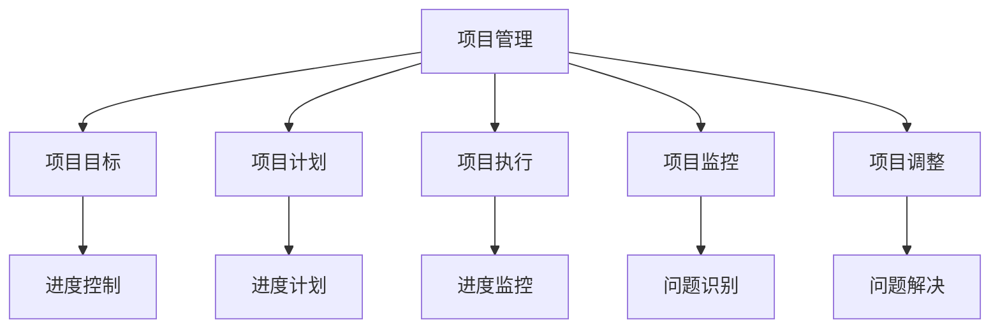
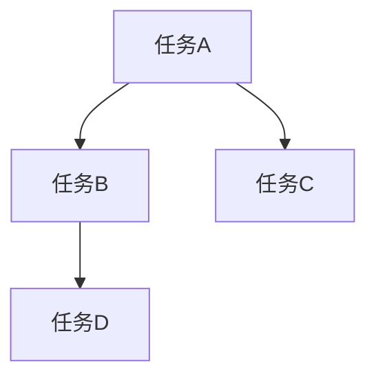
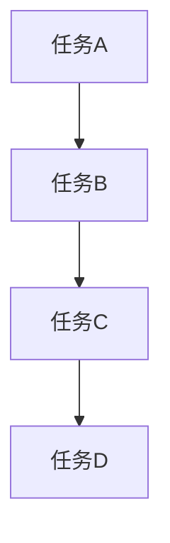

                 

### 1. 背景介绍

#### 创业项目管理的重要性

在快速变化和竞争激烈的商业环境中，创业项目管理成为了确保项目成功的关键因素。有效的创业项目管理不仅关系到项目的最终成果，还直接影响到团队的士气和资源的利用效率。创业项目通常面临资源有限、时间紧迫和不确定性高的挑战，因此，如何进行有效的项目管理和进度控制显得尤为重要。

#### 进度控制在项目管理中的角色

进度控制是项目管理中不可或缺的一环，它关系到项目的按时交付和预算的合理使用。通过有效的进度控制，项目经理可以及时识别并解决问题，确保项目按计划进行。然而，对于技术人而言，进度控制不仅仅是管理时间，更是涉及到如何平衡资源、优化流程、协调团队等方面的工作。

#### 技术人的角色与挑战

作为技术人，我们通常更加专注于技术本身，而忽略了项目管理的方方面面。然而，随着创业项目的复杂度增加，技术人需要更多地参与到项目管理中。这其中包括理解项目目标、制定合理的时间计划、协调团队成员、控制项目进度等。对于技术人来说，挑战在于如何将技术专长与项目管理技能相结合，以实现项目的成功。

#### 本文的目的与结构

本文旨在为技术人提供一套实用的创业项目管理和进度控制方法。通过系统地介绍项目管理的基础知识、核心算法原理、数学模型、项目实践，以及实际应用场景，帮助读者掌握有效的项目管理技能。文章将采用逐步分析推理的方式，确保读者能够理解并应用这些方法。

### 2. 核心概念与联系

在深入探讨创业项目管理和进度控制之前，我们需要明确一些核心概念，并了解它们之间的联系。

#### 项目管理

项目管理是指通过计划、执行、监控和调整项目活动，以确保项目目标的实现。项目管理通常包括以下关键组成部分：

- **项目目标**：明确项目的最终目标，包括范围、质量、时间和资源等方面的要求。
- **项目计划**：制定详细的执行计划，包括时间表、任务分配和资源需求等。
- **项目执行**：按照计划执行项目任务，确保项目按计划进行。
- **项目监控**：定期检查项目进展，发现并解决问题，确保项目按时、按质量完成。
- **项目调整**：根据监控结果，对项目计划进行调整，以应对项目中的变化。

#### 进度控制

进度控制是项目管理中的一项重要工作，它旨在确保项目按计划进行。进度控制通常包括以下步骤：

- **进度计划**：制定项目的时间计划，明确任务的时间分配。
- **进度监控**：通过定期检查项目进展，与计划进行比较，识别偏差。
- **问题识别**：发现进度偏差的原因，如资源不足、任务延迟等。
- **问题解决**：采取措施纠正进度偏差，确保项目按计划进行。

#### 技术人的角色

技术人作为项目团队的一员，需要在项目管理中发挥重要作用。具体而言，技术人需要：

- **理解项目目标**：确保自己的工作能够支持项目目标的实现。
- **参与项目计划**：提供技术方面的建议，参与制定合理的项目计划。
- **执行任务**：按时完成分配的任务，保证项目的顺利推进。
- **问题解决**：遇到技术问题时，能够快速定位并解决问题，减少对项目进度的影响。

#### 核心概念与联系

为了更好地理解项目管理与进度控制，我们可以使用Mermaid流程图来表示核心概念及其联系。以下是一个简化的流程图：



在这个流程图中，项目管理（A）是核心，它包括了项目目标（B）、项目计划（C）、项目执行（D）、项目监控（E）和项目调整（F）。进度控制（G）是项目管理的一部分，它通过进度计划（H）、进度监控（I）、问题识别（J）和问题解决（K）来确保项目按计划进行。

### 3. 核心算法原理 & 具体操作步骤

在了解了创业项目管理和进度控制的基本概念后，我们将深入探讨一些核心算法原理和具体操作步骤，以帮助技术人更好地进行项目管理和进度控制。

#### 3.1 进度计划算法

进度计划是项目管理的第一步，它关系到项目能否按计划进行。一种常用的进度计划算法是关键路径法（Critical Path Method，简称CPM）。CPM通过确定项目中的关键路径来优化时间安排。

**具体操作步骤：**

1. **任务分解**：将项目分解为多个子任务，并确定每个子任务的时间估计。
2. **绘制网络图**：使用箭头表示任务之间的依赖关系，构建项目的网络图。
3. **计算最早开始时间（ES）和最早完成时间（EF）**：从网络图的起点开始，逐个计算每个任务的最早开始时间和最早完成时间。
4. **计算最迟开始时间（LS）和最迟完成时间（LF）**：从网络图的终点开始，逐个计算每个任务的最迟开始时间和最迟完成时间。
5. **确定关键路径**：关键路径是指项目中所有任务的总时间最长的路径，这些任务称为关键任务。

**示例：**

假设一个项目包括以下任务和依赖关系：

- 任务A：2天
- 任务B：3天（依赖于任务A）
- 任务C：2天（依赖于任务A）
- 任务D：4天（依赖于任务B和任务C）

我们可以绘制如下的网络图：



计算每个任务的最早开始时间和最早完成时间：

- ES(A1) = 0
- EF(A1) = 2
- ES(B1) = 2
- EF(B1) = 5
- ES(C1) = 2
- EF(C1) = 4
- ES(D1) = 5
- EF(D1) = 9

计算每个任务的最迟开始时间和最迟完成时间：

- LS(A1) = 0
- LF(A1) = 2
- LS(B1) = 2
- LF(B1) = 5
- LS(C1) = 2
- LF(C1) = 4
- LS(D1) = 5
- LF(D1) = 9

关键路径为A1 -> B1 -> D1，总时间为9天。

#### 3.2 进度监控算法

进度监控是确保项目按计划进行的关键步骤。一种常用的进度监控算法是挣值管理（Earned Value Management，简称EVM）。

**具体操作步骤：**

1. **制定项目预算**：确定项目的总预算。
2. **计算计划价值（PV）**：根据项目进度计划，计算每个时间点的计划价值。
3. **计算挣值（EV）**：根据实际完成的任务，计算项目的挣值。
4. **计算成本绩效指数（CPI）**：CPI = EV / PV，表示项目实际成本与计划成本的比值。
5. **计算进度绩效指数（SPI）**：SPI = EV / BCWS，其中BCWS为预算工作成本（Budgeted Cost of Work Scheduled），表示项目进度与计划的比值。

**示例：**

假设一个项目预算为100万元，计划在3个月内完成。每月的计划价值分别为：

- 第1个月：30万元
- 第2个月：40万元
- 第3个月：30万元

实际完成的任务和成本如下：

- 第1个月：完成了20万元的工作，实际成本为25万元。
- 第2个月：完成了50万元的工作，实际成本为45万元。
- 第3个月：完成了30万元的工作，实际成本为35万元。

计算每个时间点的计划价值（PV）和挣值（EV）：

- 第1个月：PV = 30万元，EV = 20万元
- 第2个月：PV = 40万元，EV = 50万元
- 第3个月：PV = 30万元，EV = 30万元

计算成本绩效指数（CPI）：

- CPI（第1个月）= 20 / 30 = 0.67
- CPI（第2个月）= 50 / 40 = 1.25
- CPI（第3个月）= 30 / 35 = 0.86

计算进度绩效指数（SPI）：

- SPI（第1个月）= 20 / 30 = 0.67
- SPI（第2个月）= 50 / 30 = 1.67
- SPI（第3个月）= 30 / 30 = 1.00

通过EVM，项目经理可以及时发现进度偏差，并采取相应的措施进行调整。

#### 3.3 进度调整算法

进度调整是确保项目按时完成的关键步骤。一种常用的进度调整算法是资源平衡（Resource Leveling）。

**具体操作步骤：**

1. **确定关键任务**：通过关键路径法确定项目中的关键任务。
2. **计算资源需求**：根据任务的时间安排，计算每个时间点的资源需求。
3. **分析资源分配**：检查资源需求，分析是否存在资源冲突或资源过剩。
4. **调整任务时间**：根据资源分配情况，调整关键任务的时间安排，以平衡资源需求。

**示例：**

假设一个项目包括以下任务和资源需求：

- 任务A：2天，需要1名开发人员和1名测试人员。
- 任务B：3天，需要1名开发人员和1名测试人员（依赖于任务A）。
- 任务C：2天，需要1名开发人员和1名测试人员（依赖于任务A）。
- 任务D：4天，需要1名开发人员和1名测试人员（依赖于任务B和任务C）。

资源需求如下：

- 第1天：1名开发人员，1名测试人员
- 第2天：1名开发人员，1名测试人员
- 第3天：1名开发人员，1名测试人员
- 第4天：1名开发人员，1名测试人员
- 第5天：1名开发人员，1名测试人员
- 第6天：1名开发人员，1名测试人员
- 第7天：1名开发人员，1名测试人员

我们发现任务B和任务C在第三天存在资源冲突，需要调整任务时间。我们可以将任务B的时间推迟到第四天，任务C的时间推迟到第五天：

- 任务A：2天，需要1名开发人员和1名测试人员
- 任务B：4天，需要1名开发人员和1名测试人员（依赖于任务A）
- 任务C：3天，需要1名开发人员和1名测试人员（依赖于任务A）
- 任务D：4天，需要1名开发人员和1名测试人员（依赖于任务B和任务C）

通过资源平衡，我们可以确保项目在资源有限的情况下按时完成。

### 4. 数学模型和公式 & 详细讲解 & 举例说明

在创业项目管理和进度控制中，数学模型和公式起到了关键作用。以下我们将详细讲解几个常用的数学模型和公式，并通过具体示例进行说明。

#### 4.1 关键路径法（CPM）

关键路径法是一种用于确定项目完成时间的关键算法。它基于任务之间的依赖关系和时间估计，找出项目中时间最长的一条路径，这条路径上的任务称为关键任务。

**公式：**

关键路径时间 = 最长路径上任务的总时间

**示例：**

假设有一个项目包括以下任务和依赖关系：

- 任务A：3天
- 任务B：2天（依赖于任务A）
- 任务C：4天（依赖于任务B）
- 任务D：3天（依赖于任务C）

我们可以绘制如下的网络图：



计算每个任务的最早开始时间（ES）和最早完成时间（EF）：

- ES(A1) = 0
- EF(A1) = 3
- ES(B1) = 3
- EF(B1) = 5
- ES(C1) = 5
- EF(C1) = 9
- ES(D1) = 9
- EF(D1) = 12

关键路径为A1 -> B1 -> C1 -> D1，总时间为12天。

#### 4.2 挣值管理（EVM）

挣值管理是一种用于监控项目进度和成本绩效的模型。它通过计算计划价值（PV）、挣值（EV）和实际成本（AC）来评估项目绩效。

**公式：**

- 计划价值（PV）= 计划工作的预算
- 挣值（EV）= 实际完成工作的预算
- 实际成本（AC）= 项目实际发生的成本

**绩效指标：**

- 成本绩效指数（CPI）= EV / AC
- 进度绩效指数（SPI）= EV / PV

**示例：**

假设一个项目预算为100万元，计划在3个月内完成。每月的计划价值分别为：

- 第1个月：30万元
- 第2个月：40万元
- 第3个月：30万元

实际完成的任务和成本如下：

- 第1个月：完成了20万元的工作，实际成本为25万元。
- 第2个月：完成了50万元的工作，实际成本为45万元。
- 第3个月：完成了30万元的工作，实际成本为35万元。

计算每个时间点的计划价值（PV）、挣值（EV）和实际成本（AC）：

- 第1个月：PV = 30万元，EV = 20万元，AC = 25万元
- 第2个月：PV = 40万元，EV = 50万元，AC = 45万元
- 第3个月：PV = 30万元，EV = 30万元，AC = 35万元

计算成本绩效指数（CPI）：

- CPI（第1个月）= 20 / 25 = 0.80
- CPI（第2个月）= 50 / 45 = 1.11
- CPI（第3个月）= 30 / 35 = 0.86

计算进度绩效指数（SPI）：

- SPI（第1个月）= 20 / 30 = 0.67
- SPI（第2个月）= 50 / 40 = 1.25
- SPI（第3个月）= 30 / 30 = 1.00

通过EVM，我们可以发现项目的成本绩效和进度绩效情况，并采取相应的措施进行调整。

#### 4.3 资源平衡（Resource Leveling）

资源平衡是一种用于优化资源分配的模型。它通过调整任务时间，以平衡资源需求。

**公式：**

- 资源需求 = 任务持续时间 × 资源利用率

**示例：**

假设一个项目包括以下任务和资源需求：

- 任务A：2天，需要1名开发人员和1名测试人员
- 任务B：3天，需要1名开发人员和1名测试人员（依赖于任务A）
- 任务C：2天，需要1名开发人员和1名测试人员（依赖于任务A）
- 任务D：4天，需要1名开发人员和1名测试人员（依赖于任务B和任务C）

资源需求如下：

- 第1天：1名开发人员，1名测试人员
- 第2天：1名开发人员，1名测试人员
- 第3天：1名开发人员，1名测试人员
- 第4天：1名开发人员，1名测试人员
- 第5天：1名开发人员，1名测试人员
- 第6天：1名开发人员，1名测试人员
- 第7天：1名开发人员，1名测试人员

我们发现任务B和任务C在第三天存在资源冲突，需要调整任务时间。我们可以将任务B的时间推迟到第四天，任务C的时间推迟到第五天：

- 任务A：2天，需要1名开发人员和1名测试人员
- 任务B：4天，需要1名开发人员和1名测试人员（依赖于任务A）
- 任务C：3天，需要1名开发人员和1名测试人员（依赖于任务A）
- 任务D：4天，需要1名开发人员和1名测试人员（依赖于任务B和任务C）

通过资源平衡，我们可以确保项目在资源有限的情况下按时完成。

### 5. 项目实践：代码实例和详细解释说明

#### 5.1 开发环境搭建

在开始项目实践之前，我们需要搭建一个合适的开发环境。以下是一个简单的示例，展示如何搭建一个基于Python的创业项目开发环境。

**步骤：**

1. 安装Python：从Python官方网站（https://www.python.org/）下载并安装Python。
2. 安装虚拟环境：在终端中执行以下命令安装虚拟环境工具`virtualenv`：

   ```bash
   pip install virtualenv
   ```

3. 创建虚拟环境：在项目目录中执行以下命令创建虚拟环境：

   ```bash
   virtualenv venv
   ```

4. 激活虚拟环境：在终端中执行以下命令激活虚拟环境：

   ```bash
   source venv/bin/activate
   ```

5. 安装依赖：在虚拟环境中安装项目所需的依赖库，例如`requests`库：

   ```bash
   pip install requests
   ```

#### 5.2 源代码详细实现

以下是一个简单的Python项目示例，用于实现一个简单的RESTful API，用于管理创业项目任务。

**代码：**

```python
# 创业项目任务管理API

from flask import Flask, jsonify, request

app = Flask(__name__)

# 任务列表
tasks = [
    {
        'id': 1,
        'title': '任务1',
        'description': '这是任务1的描述',
        'completed': False
    },
    {
        'id': 2,
        'title': '任务2',
        'description': '这是任务2的描述',
        'completed': True
    }
]

@app.route('/tasks', methods=['GET'])
def get_tasks():
    return jsonify({'tasks': tasks})

@app.route('/tasks', methods=['POST'])
def create_task():
    task = {
        'id': tasks[-1]['id'] + 1,
        'title': request.json['title'],
        'description': request.json['description'],
        'completed': False
    }
    tasks.append(task)
    return jsonify({'task': task})

@app.route('/tasks/<int:task_id>', methods=['PUT'])
def update_task(task_id):
    task = next((task for task in tasks if task['id'] == task_id), None)
    if task:
        task['title'] = request.json['title']
        task['description'] = request.json['description']
        task['completed'] = request.json['completed']
        return jsonify({'task': task})
    else:
        return jsonify({'error': '任务不存在'})

@app.route('/tasks/<int:task_id>', methods=['DELETE'])
def delete_task(task_id):
    global tasks
    tasks = [task for task in tasks if task['id'] != task_id]
    return jsonify({'tasks': tasks})

if __name__ == '__main__':
    app.run(debug=True)
```

**解释说明：**

- **Flask库**：Flask是一个轻量级的Web框架，用于构建Web应用程序。
- **任务列表（tasks）**：使用一个列表存储任务对象，每个任务对象包含任务的ID、标题、描述和完成状态。
- **路由和视图函数**：定义了不同的路由和对应的视图函数，用于处理HTTP请求。
  - `/tasks`：获取所有任务或创建新任务。
  - `/tasks/<int:task_id>`：获取特定ID的任务、更新任务或删除任务。

#### 5.3 代码解读与分析

在这个示例中，我们使用了Flask库构建了一个简单的RESTful API，用于管理创业项目任务。以下是代码的关键部分解读和分析：

- **Flask应用程序（app）**：创建一个Flask应用程序对象，用于处理HTTP请求。
- **任务列表（tasks）**：使用一个全局变量存储任务列表，以便在各个视图函数中访问和更新。
- **路由和视图函数**：
  - `get_tasks`：处理GET请求，返回任务列表。
  - `create_task`：处理POST请求，创建新任务。
  - `update_task`：处理PUT请求，更新特定ID的任务。
  - `delete_task`：处理DELETE请求，删除特定ID的任务。

**优势：**

- **轻量级**：Flask是一个轻量级的Web框架，易于安装和使用。
- **快速开发**：Flask提供了丰富的路由和视图函数，可以快速构建Web应用程序。
- **易于扩展**：Flask支持插件和扩展，可以根据项目需求进行定制。

**不足：**

- **安全性**：Flask自带的安全功能相对较少，需要额外配置和补充。
- **性能**：对于高并发请求，Flask的性能可能不如专业的Web服务器。

#### 5.4 运行结果展示

在开发环境中，我们可以启动Flask应用程序，并使用浏览器或Postman等工具测试API。

**启动应用程序：**

```bash
python app.py
```

**测试GET请求：**

在浏览器中输入`http://127.0.0.1:5000/tasks`，可以看到任务列表：

```json
{
  "tasks": [
    {
      "id": 1,
      "title": "任务1",
      "description": "这是任务1的描述",
      "completed": false
    },
    {
      "id": 2,
      "title": "任务2",
      "description": "这是任务2的描述",
      "completed": true
    }
  ]
}
```

**测试POST请求：**

使用Postman发送一个POST请求，包含任务信息：

```json
{
  "title": "新任务",
  "description": "这是新任务的描述"
}
```

响应结果：

```json
{
  "task": {
    "id": 3,
    "title": "新任务",
    "description": "这是新任务的描述",
    "completed": false
  }
}
```

**测试PUT请求：**

使用Postman发送一个PUT请求，更新任务ID为3的任务：

```json
{
  "title": "更新后的任务",
  "description": "这是更新后的任务的描述",
  "completed": true
}
```

响应结果：

```json
{
  "task": {
    "id": 3,
    "title": "更新后的任务",
    "description": "这是更新后的任务的描述",
    "completed": true
  }
}
```

**测试DELETE请求：**

使用Postman发送一个DELETE请求，删除任务ID为3的任务：

响应结果：

```json
{
  "tasks": [
    {
      "id": 1,
      "title": "任务1",
      "description": "这是任务1的描述",
      "completed": false
    },
    {
      "id": 2,
      "title": "任务2",
      "description": "这是任务2的描述",
      "completed": true
    }
  ]
}
```

通过以上测试，我们可以看到API能够正常处理各种HTTP请求，并返回相应的结果。

### 6. 实际应用场景

#### 6.1 创业公司项目开发

在创业公司中，项目管理和进度控制尤为重要。创业公司通常资源有限，需要高效地利用现有资源来推动项目进展。通过使用关键路径法（CPM）和挣值管理（EVM）等算法，项目经理可以确保项目按时交付，并在预算范围内完成。此外，资源平衡（Resource Leveling）可以帮助项目经理优化资源分配，确保项目在资源有限的情况下能够顺利推进。

#### 6.2 大型软件开发项目

大型软件开发项目通常涉及多个团队和复杂的任务依赖关系。在这种情况下，关键路径法（CPM）可以帮助项目经理识别关键任务和关键路径，从而确保项目按时交付。挣值管理（EVM）则可以实时监控项目的进度和成本绩效，及时发现并解决问题。资源平衡（Resource Leveling）可以帮助项目经理优化资源分配，减少资源冲突，提高项目效率。

#### 6.3 产品迭代开发

在产品迭代开发中，项目管理和进度控制同样至关重要。通过使用关键路径法（CPM）和挣值管理（EVM），项目经理可以确保每次迭代都能够按时交付，并在预算范围内完成。此外，资源平衡（Resource Leveling）可以帮助项目经理优化资源分配，确保项目在资源有限的情况下能够顺利推进。

#### 6.4 紧急项目处理

在紧急项目处理中，项目管理和进度控制尤为重要。通过使用关键路径法（CPM）和挣值管理（EVM），项目经理可以快速识别关键任务和关键路径，确保项目在紧急情况下能够按时交付。此外，资源平衡（Resource Leveling）可以帮助项目经理优化资源分配，确保项目在资源有限的情况下能够顺利推进。

### 7. 工具和资源推荐

为了更好地进行创业项目管理和进度控制，我们可以使用一些实用的工具和资源。

#### 7.1 学习资源推荐

- **书籍：**
  - 《项目管理知识体系指南（PMBOK指南）》（第6版）
  - 《敏捷项目管理：实践指南》
  - 《创业公司项目管理：从零开始》
  
- **论文：**
  - "Project Management for Software Development"
  - "Earned Value Management in Software Development Projects"
  - "Resource Leveling in Project Scheduling"

- **博客：**
  - Medium上的项目管理博客
  - CSDN上的项目管理博客
  - 知乎上的项目管理话题

- **网站：**
  - PMI（项目管理协会）官网：[www.pmi.org](https://www.pmi.org/)
  - 精益创业社区：[www.leancanvas.com](https://www.leancanvas.com/)

#### 7.2 开发工具框架推荐

- **项目管理工具：**
  - Jira
  - Trello
  - Asana

- **进度控制工具：**
  - GanttPro
  - Microsoft Project

- **代码管理工具：**
  - Git
  - GitHub
  - GitLab

- **协作工具：**
  - Slack
  - Zoom
  - Microsoft Teams

#### 7.3 相关论文著作推荐

- **论文：**
  - "A Comparison of Earned Value Management Methods for Software Development Projects"
  - "Resource Leveling and Project Scheduling: A Literature Review"
  - "The Use of Critical Path Method in Project Scheduling"

- **著作：**
  - 《项目管理实务：工具与应用》
  - 《敏捷项目管理：方法论与实践》
  - 《创业公司项目管理：从零开始》

### 8. 总结：未来发展趋势与挑战

#### 未来发展趋势

随着技术的不断进步，创业项目管理和进度控制也在不断发展和完善。以下是未来发展趋势：

- **智能化**：人工智能和机器学习技术的应用将使项目管理更加智能化，提高预测准确性和决策效率。
- **数字化转型**：云计算、大数据和物联网等技术的普及，将推动项目管理向数字化转型，提高资源利用率和协作效率。
- **定制化**：随着创业项目种类的多样化，项目管理工具和方法将更加个性化，满足不同项目的需求。
- **敏捷性**：敏捷管理和敏捷开发方法的普及，将使项目管理和进度控制更加灵活和高效，能够快速响应市场变化。

#### 未来挑战

尽管创业项目管理和进度控制在不断发展，但未来仍然面临一些挑战：

- **资源有限**：创业公司通常资源有限，需要在有限的资源下实现项目目标，这对项目管理提出了更高的要求。
- **不确定性**：创业项目的性质决定了其存在较高的不确定性，如何应对不确定性并保持项目进度成为一大挑战。
- **人才短缺**：优秀的项目管理人员和开发者成为稀缺资源，如何培养和吸引人才成为创业公司面临的挑战。
- **技术更新**：技术的快速更新对项目管理和进度控制提出了更高的要求，如何快速适应新技术成为关键问题。

### 9. 附录：常见问题与解答

#### 问题1：如何选择合适的项目管理工具？

解答：选择项目管理工具时，应考虑以下因素：

- **项目规模**：根据项目规模选择合适的工具，如Jira适合大型项目，Trello适合小型项目。
- **团队协作需求**：根据团队协作需求选择工具，如Slack适合实时沟通，Asana适合任务分配和跟踪。
- **预算**：根据预算选择工具，有些工具可能需要付费，但提供了更多的功能。

#### 问题2：如何在资源有限的情况下进行进度控制？

解答：在资源有限的情况下进行进度控制，可以采取以下措施：

- **资源平衡**：使用资源平衡算法调整任务时间，确保资源得到充分利用。
- **关键路径法**：识别关键任务和关键路径，重点关注关键任务，确保项目按时交付。
- **优先级排序**：根据任务的重要性和紧急性进行排序，优先完成关键任务。

#### 问题3：如何应对项目中的不确定性？

解答：应对项目中的不确定性，可以采取以下措施：

- **风险管理**：识别项目中的风险，并制定相应的应对措施。
- **迭代开发**：采用迭代开发方法，逐步交付项目，降低不确定性对项目的影响。
- **沟通协调**：加强团队内部和外部的沟通协调，及时解决问题和调整计划。

### 10. 扩展阅读 & 参考资料

- **书籍：**
  - 《项目管理知识体系指南（PMBOK指南）》（第6版）
  - 《敏捷项目管理：实践指南》
  - 《创业公司项目管理：从零开始》

- **论文：**
  - "Project Management for Software Development"
  - "Earned Value Management in Software Development Projects"
  - "Resource Leveling in Project Scheduling"

- **网站：**
  - PMI（项目管理协会）官网：[www.pmi.org](https://www.pmi.org/)
  - 精益创业社区：[www.leancanvas.com](https://www.leancanvas.com/)

- **博客：**
  - Medium上的项目管理博客
  - CSDN上的项目管理博客
  - 知乎上的项目管理话题

通过以上扩展阅读和参考资料，您可以进一步深入了解创业项目管理和进度控制的相关知识。

### 作者署名

作者：禅与计算机程序设计艺术 / Zen and the Art of Computer Programming

