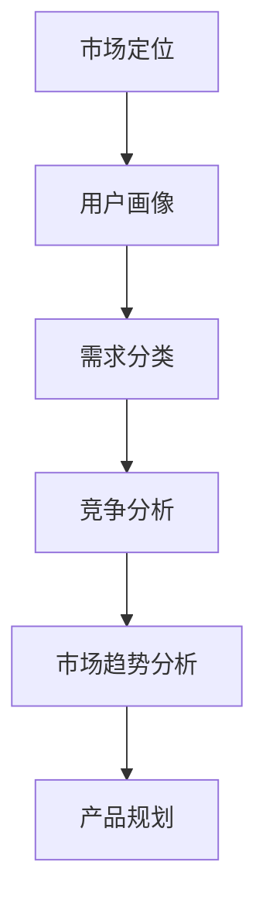

                 

在这个技术迅猛发展的时代，技术的创新和进步对市场需求产生了深远的影响。作为技术人，不仅需要掌握先进的技术，还要具备洞察市场需求的能力。本文将深入探讨技术人如何进行有效的市场需求分析，以帮助读者更好地理解市场需求，把握技术发展方向，实现技术的商业价值。

## 关键词
- 市场需求分析
- 技术人
- 商业洞察
- 市场趋势
- 数据分析

## 摘要
本文旨在为技术人提供一套系统化的市场需求分析框架和方法。通过对市场需求分析的核心概念、关键步骤、数学模型以及实际案例的详细探讨，帮助技术人更好地理解市场需求，优化产品设计，提升技术应用的商业价值。

## 1. 背景介绍
在当今全球化、数字化的时代，市场需求的变化速度前所未有。技术人不仅需要关注技术的创新，还要密切关注市场的需求变化，以快速响应市场动态。有效的市场需求分析不仅能够帮助技术人更好地理解用户需求，还能够指导产品设计和开发，提高产品的市场竞争力。

### 1.1 市场需求的重要性
市场需求分析是产品开发和管理的关键环节。通过市场需求分析，技术人可以：
- 明确产品的目标市场和用户群体。
- 洞察市场趋势，把握行业发展方向。
- 确定产品功能需求，优化产品设计。
- 减少开发风险，提高产品成功率。

### 1.2 市场需求分析的基本概念
市场需求分析涉及多个基本概念，包括但不限于：
- 市场定位：明确产品在市场中的位置。
- 用户画像：描述产品的目标用户特征。
- 需求分类：区分核心需求、重要需求和可选需求。
- 竞争分析：分析竞争对手的产品和市场策略。

## 2. 核心概念与联系
为了更好地理解市场需求分析，我们将使用Mermaid流程图来展示市场需求分析的核心概念及其相互关系。



### 2.1 市场定位
市场定位是市场需求分析的第一步，它决定了产品在市场中的位置。市场定位需要考虑产品的目标市场、用户需求、市场竞争等因素。

### 2.2 用户画像
用户画像是对目标用户特征的描述，包括用户的年龄、性别、职业、教育程度、生活习惯等。用户画像有助于技术人更深入地了解用户需求，从而更好地设计产品。

### 2.3 需求分类
需求分类是将用户需求划分为核心需求、重要需求和可选需求。核心需求是用户最基本的需求，必须满足；重要需求是用户较为关注的需求，应优先考虑；可选需求是用户非必要的需求，可以作为产品的附加功能。

### 2.4 竞争分析
竞争分析是了解竞争对手的产品和市场策略的过程。通过竞争分析，技术人可以了解市场的竞争格局，发现自身产品的优势和劣势。

### 2.5 市场趋势分析
市场趋势分析是洞察市场发展动态的过程。通过市场趋势分析，技术人可以预测未来的市场变化，把握行业发展的方向。

### 2.6 产品规划
产品规划是基于市场需求分析的结果，制定产品开发计划的过程。产品规划包括产品的功能规划、技术规划、市场推广策略等。

## 3. 核心算法原理 & 具体操作步骤

### 3.1 算法原理概述
市场需求分析的核心算法是数据分析算法。数据分析算法通过对大量市场数据的处理和分析，提取有用的信息，帮助技术人洞察市场需求。

### 3.2 算法步骤详解

#### 3.2.1 数据收集
数据收集是数据分析的基础。技术人需要收集市场数据、用户数据、竞争数据等。数据来源可以包括问卷调查、用户反馈、市场研究报告等。

#### 3.2.2 数据清洗
数据清洗是确保数据质量的过程。技术人需要处理缺失值、异常值、重复值等问题，确保数据的一致性和准确性。

#### 3.2.3 数据分析
数据分析是提取有用信息的过程。技术人可以使用统计分析、机器学习等方法，对市场数据进行深入分析，发现市场趋势和用户需求。

#### 3.2.4 需求建模
需求建模是构建需求模型的过程。技术人可以根据数据分析的结果，构建用户画像、需求分类等模型。

#### 3.2.5 决策制定
决策制定是基于需求分析结果，制定产品规划和市场策略的过程。技术人可以根据需求模型，优化产品设计，提高产品的市场竞争力。

### 3.3 算法优缺点

#### 优点
- 数据驱动的决策制定，更具有客观性和准确性。
- 可以发现市场趋势和用户需求，指导产品开发。
- 提高产品的市场竞争力。

#### 缺点
- 数据收集和处理需要大量时间和资源。
- 分析结果可能受到数据质量的影响。
- 需要专业的数据分析技能。

### 3.4 算法应用领域
市场需求分析算法广泛应用于多个领域，包括电子商务、金融科技、医疗健康、物联网等。通过市场需求分析，技术人可以更好地把握市场动态，优化产品设计，提升用户体验。

## 4. 数学模型和公式 & 详细讲解 & 举例说明

### 4.1 数学模型构建
市场需求分析的数学模型主要包括用户画像模型、需求分类模型、市场趋势预测模型等。

#### 用户画像模型
用户画像模型可以使用聚类分析方法，如K-means算法，将用户划分为不同的群体。

$$
\text{聚类中心} = \frac{1}{n}\sum_{i=1}^{n}x_i
$$

其中，$x_i$ 表示第$i$个用户的特征向量，$n$ 表示用户总数。

#### 需求分类模型
需求分类模型可以使用决策树算法，将用户需求划分为核心需求、重要需求和可选需求。

$$
\text{分类结果} = \text{决策树}(\text{特征向量})
$$

#### 市场趋势预测模型
市场趋势预测模型可以使用时间序列分析方法，如ARIMA模型，预测市场未来的发展趋势。

$$
y_t = c + \phi_1 y_{t-1} + \phi_2 y_{t-2} + ... + \phi_p y_{t-p} + \varepsilon_t
$$

其中，$y_t$ 表示时间序列数据，$\phi_1, \phi_2, ..., \phi_p$ 为自回归系数，$\varepsilon_t$ 为误差项。

### 4.2 公式推导过程
用户画像模型的公式推导如下：

假设有 $n$ 个用户，每个用户的特征向量表示为 $x_i = [x_{i1}, x_{i2}, ..., x_{id}]$，其中 $d$ 为特征维度。

定义聚类中心 $m = [m_1, m_2, ..., m_d]$，每个用户到聚类中心的距离表示为 $d(x_i, m)$。

目标是最小化所有用户到聚类中心的距离之和：

$$
\min \sum_{i=1}^{n} d(x_i, m)
$$

取距离的平方和作为目标函数：

$$
\min \sum_{i=1}^{n} ||x_i - m||^2
$$

对目标函数求导，得到：

$$
\frac{\partial}{\partial m_j} \sum_{i=1}^{n} ||x_i - m||^2 = 2 \sum_{i=1}^{n} (x_{ij} - m_j)
$$

令导数为零，得到：

$$
\sum_{i=1}^{n} (x_{ij} - m_j) = 0
$$

解得聚类中心：

$$
m_j = \frac{1}{n} \sum_{i=1}^{n} x_{ij}
$$

### 4.3 案例分析与讲解

#### 案例背景
某科技公司开发了一款智能健康监测设备，面向中老年用户。公司希望通过对市场需求的分析，优化产品的设计和功能，提高产品的市场竞争力。

#### 数据收集
公司收集了以下数据：
- 用户调查问卷：包括用户的年龄、性别、生活习惯、健康状况等信息。
- 销售数据：包括产品的销售量、销售额、用户反馈等。
- 竞争对手分析：包括竞争对手的产品功能、市场策略、用户评价等。

#### 数据分析
通过数据分析，公司提取了以下信息：
- 用户画像：用户主要集中在50-70岁之间，大部分为女性，注重健康监测和预防。
- 需求分类：核心需求包括实时监测、数据存储、健康报告等；重要需求包括远程控制、个性化设置等；可选需求包括音乐播放、智能提醒等。
- 市场趋势：随着老龄化社会的到来，智能健康监测设备市场潜力巨大。

#### 需求建模
基于数据分析结果，公司构建了用户画像模型、需求分类模型和市场趋势预测模型，用于指导产品规划和市场策略。

#### 决策制定
基于需求分析结果，公司制定了以下产品规划和市场策略：
- 优化核心需求，提高产品功能稳定性。
- 添加重要需求，提升用户体验。
- 探索可选需求，拓展产品应用场景。
- 加强市场推广，提高品牌知名度。

## 5. 项目实践：代码实例和详细解释说明

### 5.1 开发环境搭建
为了进行市场需求分析，需要搭建以下开发环境：
- Python编程环境
- 数据库（如MySQL）
- 数据分析库（如Pandas、NumPy）
- 机器学习库（如Scikit-learn）

### 5.2 源代码详细实现
以下是一个简单的Python代码示例，用于进行用户画像和需求分类。

```python
import pandas as pd
from sklearn.cluster import KMeans
from sklearn.tree import DecisionTreeClassifier

# 读取用户数据
data = pd.read_csv('user_data.csv')

# 用户画像聚类
kmeans = KMeans(n_clusters=3)
user_clusters = kmeans.fit_predict(data)

# 需求分类
dt_classifier = DecisionTreeClassifier()
dt_classifier.fit(data, user_clusters)

# 预测用户需求
predictions = dt_classifier.predict(data)

# 打印用户需求
for i, pred in enumerate(predictions):
    if pred == 0:
        print(f"用户{i+1}:核心需求")
    elif pred == 1:
        print(f"用户{i+1}:重要需求")
    else:
        print(f"用户{i+1}:可选需求")
```

### 5.3 代码解读与分析
上述代码首先读取用户数据，然后使用K-means算法进行用户画像聚类，最后使用决策树算法进行需求分类。代码的核心部分包括：
- 用户数据读取：使用Pandas库读取用户数据。
- 用户画像聚类：使用K-means算法进行聚类，将用户划分为不同群体。
- 需求分类：使用决策树算法进行需求分类，根据用户特征预测用户需求。
- 打印需求：根据预测结果，打印用户的分类结果。

## 6. 实际应用场景

### 6.1 智能健康监测设备
智能健康监测设备是市场需求分析的一个典型应用场景。通过分析用户需求和市场趋势，公司可以优化产品功能，提高用户满意度，拓展市场份额。

### 6.2 电子商务平台
电子商务平台通过市场需求分析，可以优化商品推荐、营销策略和用户体验，提高销售额和用户粘性。

### 6.3 金融科技
金融科技领域通过市场需求分析，可以设计更符合用户需求的金融产品，提高用户满意度和市场竞争力。

## 6.4 未来应用展望
随着人工智能和大数据技术的不断发展，市场需求分析的应用前景将更加广阔。未来，技术人可以更加精准地预测市场趋势和用户需求，实现更智能的产品设计和决策制定。

## 7. 工具和资源推荐

### 7.1 学习资源推荐
- 《大数据时代：生活、工作与思维的大变革》
- 《机器学习实战》
- 《Python数据分析》

### 7.2 开发工具推荐
- Jupyter Notebook
- PyCharm
- MySQL

### 7.3 相关论文推荐
- "Market Basket Analysis: A Machine Learning Perspective"
- "Predictive Analytics: The Power to Predict Who Will Click, Buy, Lie, or Die"
- "Recommender Systems Handbook"

## 8. 总结：未来发展趋势与挑战

### 8.1 研究成果总结
市场需求分析在产品开发、市场策略制定等方面取得了显著成果。通过数据分析算法和模型，技术人可以更精准地预测市场趋势和用户需求，实现更智能的产品设计和决策制定。

### 8.2 未来发展趋势
未来，市场需求分析将更加智能化和自动化，结合人工智能、大数据等技术，实现更高效、更精准的分析。

### 8.3 面临的挑战
- 数据质量和隐私保护：确保数据质量，保护用户隐私。
- 复杂性：处理海量数据，应对复杂的市场环境。
- 技术更新：跟上技术发展的步伐，应对不断变化的市场需求。

### 8.4 研究展望
市场需求分析将继续融合人工智能、大数据等技术，实现更智能、更精准的分析，为技术人和企业提供更强大的支持。

## 9. 附录：常见问题与解答

### 9.1 市场需求分析有哪些方法？
市场需求分析的方法包括用户调研、竞争分析、数据分析等。

### 9.2 数据分析在市场需求分析中的作用是什么？
数据分析可以帮助技术人提取用户需求、洞察市场趋势，为产品设计和决策制定提供依据。

### 9.3 如何确保数据质量？
确保数据质量的方法包括数据清洗、数据验证、数据监控等。

### 9.4 市场需求分析对产品开发的影响是什么？
市场需求分析可以优化产品设计，提高产品的市场竞争力，降低开发风险。

---

本文从市场需求分析的重要性、核心概念、算法原理、数学模型、实际案例、应用场景、未来展望等方面，系统地介绍了技术人如何进行有效的市场需求分析。希望本文能为技术人在市场需求分析方面提供有益的参考和指导。作者：禅与计算机程序设计艺术 / Zen and the Art of Computer Programming。
----------------------------------------------------------------


