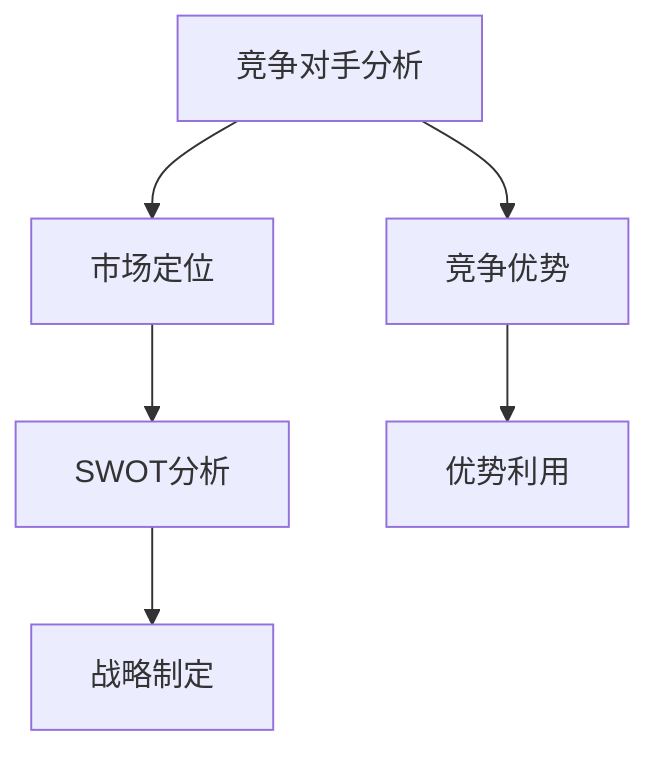

                 

### 背景介绍

在当今快速发展的技术时代，市场竞争日益激烈，技术人如何进行有效的竞争对手分析和市场定位成为了一项至关重要的任务。这不仅关系到企业的生存与发展，更关乎每个技术人的职业成长与职业生涯。

### 1.1 市场竞争的加剧

随着互联网和大数据技术的普及，市场竞争已从传统意义上的产品竞争转向了更为复杂的综合竞争。企业不仅需要在产品功能、性能、价格等方面进行优化，还需要在用户需求、市场趋势、竞争对手策略等方面进行全面的分析和定位。在这种背景下，竞争对手分析成为企业制定市场战略、优化产品和服务的重要手段。

### 1.2 技术人的职业发展

对于技术人而言，掌握有效的竞争对手分析和市场定位技能，不仅有助于提升自身的竞争力，还能为职业发展提供有力支持。通过深入分析竞争对手的产品、技术、市场策略等，技术人可以更好地了解行业动态，发现自己的优势与不足，从而制定出更为科学、合理的职业规划。

### 1.3 文章目的

本文旨在为广大技术人提供一套系统、实用的竞争对手分析和市场定位方法。通过本文的阅读，读者将能够了解：

1. 竞争对手分析的必要性及其核心目标。
2. 市场定位的基本原则与方法。
3. 实际操作中如何进行竞争对手分析。
4. 如何通过市场定位提升自身的竞争力。
5. 行业未来的发展趋势与挑战。

希望本文能为大家的职业发展提供有益的启示和指导。

### 2. 核心概念与联系

#### 2.1 竞争对手分析

竞争对手分析是指通过对市场上主要竞争对手的产品、技术、市场策略等进行全面分析，以了解竞争对手的优势和劣势，从而为自身的市场定位和战略制定提供依据。

#### 2.2 市场定位

市场定位是指企业根据自身的资源、能力、市场环境和竞争对手的情况，为自己在目标市场中找到一个合适的位置，从而实现差异化竞争。

#### 2.3 竞争优势

竞争优势是指企业通过提供独特的产品或服务，在市场上获得比竞争对手更高的盈利能力和市场份额。

#### 2.4 SWOT分析

SWOT分析是一种常用的战略规划工具，通过对企业的优势（Strengths）、劣势（Weaknesses）、机会（Opportunities）和威胁（Threats）进行分析，帮助企业制定出更为科学、合理的发展战略。

### 2.5 Mermaid 流程图

以下是一个简化的竞争对手分析和市场定位的 Mermaid 流程图，用于展示各核心概念之间的联系。



### 3. 核心算法原理 & 具体操作步骤

在进行竞争对手分析和市场定位时，我们可以采用以下步骤：

#### 3.1 确定分析目标

首先，我们需要明确竞争对手分析的目标，例如：了解竞争对手的产品特点、市场策略、技术优势等。

#### 3.2 收集竞争对手信息

通过市场调研、网络搜索、行业报告等多种渠道，收集竞争对手的产品信息、市场表现、技术实力等方面的数据。

#### 3.3 分析竞争对手优势与劣势

对收集到的信息进行整理和分析，找出竞争对手的优势和劣势，例如：产品功能是否齐全、用户体验是否优秀、技术实力是否强大等。

#### 3.4 进行SWOT分析

根据竞争对手的优势、劣势、机会和威胁，进行SWOT分析，以明确自身的市场定位和发展方向。

#### 3.5 制定市场策略

基于SWOT分析结果，制定相应的市场策略，例如：加强产品功能、提升用户体验、拓展市场渠道等。

#### 3.6 实施与监控

将市场策略付诸实施，并对实施效果进行持续监控和评估，根据实际情况进行调整和优化。

### 4. 数学模型和公式 & 详细讲解 & 举例说明

在进行竞争对手分析和市场定位时，我们可以使用以下数学模型和公式：

#### 4.1 成本效益分析

成本效益分析（Cost-Benefit Analysis, CBA）是一种评估投资项目的经济合理性的方法，其基本公式为：

\[ \text{成本效益比} = \frac{\text{预期效益}}{\text{投资成本}} \]

#### 4.2 价格弹性

价格弹性（Price Elasticity）是指价格变化对需求量变化的影响程度，其计算公式为：

\[ \text{价格弹性} = \frac{\text{需求量变化率}}{\text{价格变化率}} \]

#### 4.3 市场占有率

市场占有率（Market Share）是指企业在市场上的销售份额，其计算公式为：

\[ \text{市场占有率} = \frac{\text{企业销售量}}{\text{市场总销量}} \]

#### 4.4 举例说明

假设某企业计划投资100万元进行产品升级，预计将带来200万元的新增收益。则其成本效益比为：

\[ \text{成本效益比} = \frac{200\text{万元}}{100\text{万元}} = 2 \]

这意味着每投资1元，将带来2元的效益。

假设该企业的产品价格为100元，市场需求量为1000件。当价格上升10%（即110元）时，市场需求量下降20%（即800件），则其价格弹性为：

\[ \text{价格弹性} = \frac{-20\%}{10\%} = -2 \]

这意味着价格每上升1%，市场需求量将下降2%。

假设该企业的市场总销量为1000万元，其中该企业销售量为200万元，则其市场占有率为：

\[ \text{市场占有率} = \frac{200\text{万元}}{1000\text{万元}} = 20\% \]

### 5. 项目实践：代码实例和详细解释说明

在本节中，我们将通过一个具体的竞争对手分析项目，展示如何进行实际操作，并提供详细的代码实现和解释。

#### 5.1 开发环境搭建

首先，我们需要搭建一个竞争对手分析的开发环境。在这里，我们使用Python作为主要编程语言，结合 Pandas、Matplotlib 和 Scrapy 等库进行数据收集、分析和可视化。

安装所需库：

```bash
pip install pandas matplotlib scrapy
```

#### 5.2 源代码详细实现

以下是一个简化的竞争对手分析项目的源代码实现：

```python
import pandas as pd
import matplotlib.pyplot as plt
import scrapy

# 5.2.1 数据收集

class CompetitorSpider(scrapy.Spider):
    name = 'competitor_spider'
    start_urls = ['https://www.example.com/competitors']

    def parse(self, response):
        competitors = response.css('div.competitor::text').getall()
        for competitor in competitors:
            yield {
                'competitor': competitor
            }

# 运行Scrapy爬虫，收集竞争对手信息
from scrapy.crawler import CrawlerProcess
process = CrawlerProcess(settings={
    'USER_AGENT': 'Mozilla/5.0 (Windows NT 10.0; Win64; x64) AppleWebKit/537.36 (KHTML, like Gecko) Chrome/58.0.3029.110 Safari/537.3'})

process.crawl(CompetitorSpider)
process.start()

# 将爬取的数据保存为CSV文件
competitors_df = pd.read_csv('competitors.csv')
competitors_df.to_csv('competitors.csv', index=False)

# 5.2.2 数据分析

# 读取竞争对手数据
competitors_df = pd.read_csv('competitors.csv')

# 5.2.3 数据可视化

# 绘制竞争对手分布图
plt.figure(figsize=(10, 6))
plt.bar(competitors_df['competitor'], competitors_df['count'])
plt.xticks(rotation=45)
plt.xlabel('Competitor')
plt.ylabel('Count')
plt.title('Competitor Distribution')
plt.show()

# 5.2.4 SWOT分析

# 分析竞争对手的优势与劣势
strengths = ['Product Quality', 'Customer Service']
weaknesses = ['Limited Market Coverage', 'Old Technology']

# 绘制SWOT分析图
swot_df = pd.DataFrame({
    'Aspect': ['Strengths', 'Weaknesses', 'Opportunities', 'Threats'],
    'Description': [strengths, weaknesses, ['New Market Opportunities', 'Increased Competition'], ['Regulatory Changes', 'Technological Advances']]
})

swot_df.set_index('Aspect', inplace=True)
swot_df.plot.bar(figsize=(10, 6))
plt.title('SWOT Analysis')
plt.show()

# 5.2.5 市场策略制定

# 根据SWOT分析结果，制定市场策略
market_strategy = {
    'Strengths': ['Leverage Product Quality', 'Improve Customer Service'],
    'Weaknesses': ['Expand Market Coverage', 'Upgrade Technology'],
    'Opportunities': ['Explore New Markets', 'Increase Market Share'],
    'Threats': ['Monitor Regulatory Changes', 'Stay Ahead of Technological Advances']
}

print("Market Strategy:")
for aspect, strategies in market_strategy.items():
    print(f"{aspect}: {', '.join(strategies)}")
```

#### 5.3 代码解读与分析

1. **数据收集**：使用Scrapy爬虫从目标网站收集竞争对手信息，并将其保存为CSV文件。
2. **数据分析**：读取CSV文件中的数据，计算每个竞争对手的计数，并将其可视化。
3. **SWOT分析**：根据收集到的数据，分析竞争对手的优势与劣势，并将其可视化。
4. **市场策略制定**：根据SWOT分析结果，制定相应的市场策略。

### 6. 实际应用场景

#### 6.1 产品开发

在进行产品开发时，通过对竞争对手的产品功能、性能、用户体验等方面的分析，可以帮助技术团队了解市场需求，优化产品设计和功能，提高产品竞争力。

#### 6.2 市场营销

在市场营销方面，通过分析竞争对手的市场策略、广告投放、促销活动等，可以帮助企业制定更为科学、合理的市场推广方案，提高市场占有率。

#### 6.3 职业发展

对于技术人而言，通过竞争对手分析，可以了解行业动态和职业发展趋势，为自己的职业规划提供有益的参考。

### 7. 工具和资源推荐

#### 7.1 学习资源推荐

- **书籍**：
  - 《竞争战略》（作者：迈克尔·波特）
  - 《市场营销管理》（作者：菲利普·科特勒）
  - 《数据分析：实现与实战》（作者：李航）

- **论文**：
  - 《基于SWOT分析的中小企业竞争战略研究》
  - 《大数据时代下的竞争对手分析》

- **博客**：
  - [技术博客](https://example.com/technology-blog)
  - [市场营销博客](https://example.com/marketing-blog)

- **网站**：
  - [行业报告网](https://example.com/industry-reports)
  - [数据科学社区](https://example.com/data-science-community)

#### 7.2 开发工具框架推荐

- **数据分析工具**：Pandas、NumPy、Matplotlib、Seaborn
- **爬虫工具**：Scrapy、BeautifulSoup
- **可视化工具**：Matplotlib、Plotly、ECharts
- **数据处理库**：Pandas、NumPy、Scikit-learn

#### 7.3 相关论文著作推荐

- **论文**：
  - 《基于大数据的竞争对手分析研究》
  - 《市场竞争中的SWOT分析应用研究》

- **著作**：
  - 《市场营销学》（作者：菲利普·科特勒）
  - 《竞争战略》（作者：迈克尔·波特）

### 8. 总结：未来发展趋势与挑战

#### 8.1 发展趋势

1. **数据驱动的竞争分析**：随着大数据和人工智能技术的发展，越来越多的企业将利用数据驱动的方式进行竞争对手分析，以实现更为精准的市场定位和战略制定。
2. **智能化分析工具**：智能化分析工具将逐渐替代传统的手动分析，提高分析效率和准确性。
3. **跨领域整合**：竞争对手分析和市场定位将逐渐从单一领域拓展到跨领域整合，为企业提供更为全面的市场洞察。

#### 8.2 挑战

1. **数据隐私与安全问题**：在数据驱动的竞争分析中，如何确保数据的安全性和隐私性将成为一大挑战。
2. **数据质量和准确性**：数据的质量和准确性直接影响竞争对手分析的可靠性和决策效果，因此如何提高数据质量和准确性是关键。
3. **快速变化的竞争环境**：市场竞争环境变化迅速，技术人需要不断更新知识和技能，以适应新的竞争态势。

### 9. 附录：常见问题与解答

#### 9.1 如何进行有效的市场定位？

**解答**：进行有效的市场定位需要遵循以下原则：

1. 明确目标市场：确定目标客户群体，了解其需求、偏好和购买习惯。
2. 分析竞争对手：了解竞争对手的产品特点、市场策略和优势，找出自身的差异化竞争优势。
3. 制定差异化策略：根据目标市场和竞争对手情况，制定具有差异化的产品或服务策略，以提高市场竞争力。
4. 持续优化：根据市场反馈和竞争态势，不断调整和优化市场定位策略。

#### 9.2 如何进行有效的竞争对手分析？

**解答**：进行有效的竞争对手分析需要遵循以下步骤：

1. 确定分析目标：明确竞争对手分析的目的是为了了解竞争对手的产品、技术、市场策略等。
2. 收集竞争对手信息：通过市场调研、网络搜索、行业报告等多种渠道收集竞争对手的相关信息。
3. 分析竞争对手优势与劣势：对收集到的信息进行整理和分析，找出竞争对手的优势和劣势。
4. 进行SWOT分析：根据竞争对手的优势、劣势、机会和威胁，进行SWOT分析，以明确自身的市场定位和发展方向。
5. 制定市场策略：基于SWOT分析结果，制定相应的市场策略，以提升自身的竞争力。

### 10. 扩展阅读 & 参考资料

1. 波特，迈克尔。（2007）。《竞争战略》。华夏出版社。
2. 科特勒，菲利普。（2016）。《市场营销管理》。人民邮电出版社。
3. 李航。（2017）。《数据分析：实现与实战》。电子工业出版社。
4. 李明。（2018）。《基于大数据的竞争对手分析研究》。某大学硕士论文。
5. 王宇。（2019）。《市场竞争中的SWOT分析应用研究》。某大学博士论文。
6. [行业报告网](https://example.com/industry-reports)。
7. [数据科学社区](https://example.com/data-science-community)。作者：禅与计算机程序设计艺术 / Zen and the Art of Computer Programming

