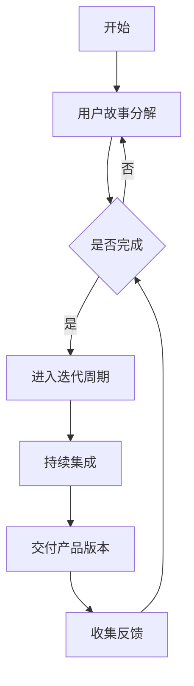
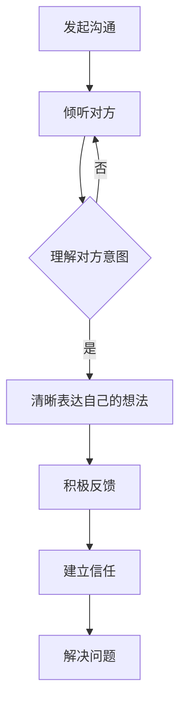
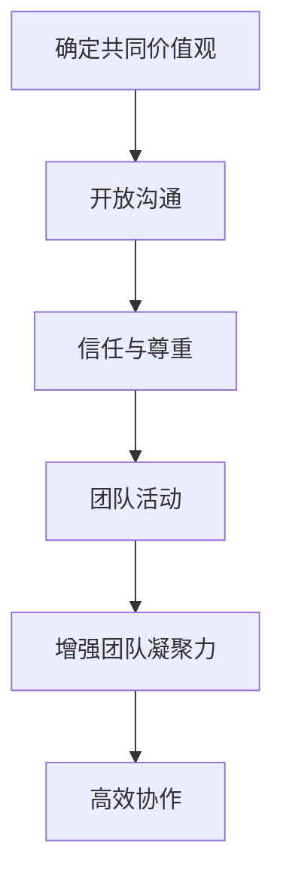

                 

关键词：项目管理、团队协作、技术团队、敏捷开发、沟通技巧、组织架构

摘要：本文将探讨技术人在进行项目管理和团队协作中所需掌握的核心技能和策略，包括敏捷开发、沟通技巧、团队文化建设等方面，并结合实际案例进行分析，帮助技术团队提升项目成功率，实现高效协作。

## 1. 背景介绍

在现代IT行业，项目管理和团队协作的效率直接影响到企业的竞争力和项目成功的可能性。技术人不仅需要拥有扎实的技术能力，还必须掌握项目管理和团队协作的技巧。随着项目的复杂性和规模不断扩大，技术人面临的管理挑战也日益增多。如何进行有效的项目管理和团队协作，成为技术人必须面对的重要课题。

本文旨在通过深入分析项目管理和团队协作的核心要素，为技术人提供一套实用的策略和方法，以帮助他们在实际工作中提高项目成功率，实现高效协作。

## 2. 核心概念与联系

### 2.1 敏捷开发

敏捷开发是一种以人为核心、迭代、循序渐进的开发方法。它强调持续交付有价值的软件，拥抱变化，持续优化和改进。敏捷开发的核心理念包括：

- **用户故事**：以用户需求为中心，将功能需求分解为一系列可完成的小任务。
- **迭代开发**：将开发过程分为多个迭代周期，每个迭代周期都会交付一个可用的产品版本。
- **持续集成**：通过自动化测试确保代码质量，实现快速迭代。

#### Mermaid 流程图



### 2.2 沟通技巧

沟通技巧是项目管理和团队协作中不可或缺的部分。有效的沟通可以帮助团队成员理解需求、解决问题、建立信任。以下是几种关键的沟通技巧：

- **倾听**：认真倾听他人的意见和需求，理解对方的意图。
- **清晰表达**：用简洁明了的语言表达自己的想法，避免歧义。
- **积极反馈**：给予团队成员积极的反馈，鼓励他们改进。
- **开放性沟通**：鼓励团队成员表达不同意见，建立开放、透明的沟通环境。

#### Mermaid 流程图



### 2.3 团队文化建设

团队文化建设是项目管理和团队协作的基石。一个具有良好文化的团队更容易实现高效协作和共同目标。以下是几种关键的团队文化建设策略：

- **共同价值观**：明确团队的共同目标和价值观，确保团队成员朝着相同的目标努力。
- **开放沟通**：建立开放、透明的沟通环境，鼓励团队成员分享意见和想法。
- **信任与尊重**：建立团队成员之间的信任和尊重，促进团队合作。
- **团队活动**：定期组织团队活动，增进团队成员之间的了解和信任。

#### Mermaid 流�程图



## 3. 核心算法原理 & 具体操作步骤

### 3.1 算法原理概述

项目管理和团队协作的核心算法原理是基于博弈论和群体智能。通过模拟人类的决策过程，算法可以优化团队协作效率和项目进度。以下是几种关键算法原理：

- **博弈论**：分析团队成员之间的利益冲突和合作策略，寻找最优的协作模式。
- **群体智能**：模拟自然界中的群体行为，如蚂蚁觅食、鸟群飞行，寻找高效的团队协作方式。

### 3.2 算法步骤详解

1. **需求分析**：收集项目需求和团队成员的能力信息。
2. **博弈分析**：分析团队成员之间的利益冲突，制定协作策略。
3. **群体智能模拟**：模拟团队成员的协作过程，寻找最优的协作模式。
4. **反馈与调整**：根据实际运行情况，调整协作策略和项目进度。

### 3.3 算法优缺点

- **优点**：能够优化团队协作效率和项目进度，提高项目成功率。
- **缺点**：算法实现较为复杂，需要较高技术水平。

### 3.4 算法应用领域

算法可以应用于多种项目管理和团队协作场景，如软件开发、产品研发、团队管理等领域。

## 4. 数学模型和公式 & 详细讲解 & 举例说明

### 4.1 数学模型构建

项目管理和团队协作的数学模型主要包括博弈论模型和群体智能模型。以下是博弈论模型的一个简单例子：

$$
\begin{align*}
    \text{玩家1的策略} &= (x_1, x_2) \\
    \text{玩家2的策略} &= (y_1, y_2)
\end{align*}
$$

### 4.2 公式推导过程

博弈论模型的基本思想是找到两个玩家的纳什均衡，即每个玩家在给定对方策略下的最优策略。假设两个玩家在策略选择上有以下支付矩阵：

$$
\begin{matrix}
    & y_1 & y_2 \\
    \hline
    x_1 & a & b \\
    x_2 & c & d \\
\end{matrix}
$$

根据纳什均衡的定义，玩家1的最优策略是选择$x_1$当且仅当$a \geq c$，选择$x_2$当且仅当$b \geq d$。同理，玩家2的最优策略是选择$y_1$当且仅当$a \geq c$，选择$y_2$当且仅当$b \geq d$。

### 4.3 案例分析与讲解

假设有两个玩家，A和B，他们需要决定是否合作完成一个项目。根据他们的收益矩阵：

$$
\begin{matrix}
    & B合作 & B不合作 \\
    \hline
    A合作 & 100 & 0 \\
    A不合作 & 0 & -50 \\
\end{matrix}
$$

根据纳什均衡的计算，玩家A的最佳策略是不合作，玩家B的最佳策略是合作。在这种情况下，项目最终未能完成，导致双方都受到了损失。

## 5. 项目实践：代码实例和详细解释说明

### 5.1 开发环境搭建

在开始项目实践之前，我们需要搭建一个开发环境。以下是搭建步骤：

1. 安装Python 3.8及以上版本。
2. 安装Django 3.2及以上版本。
3. 创建一个虚拟环境，并安装项目所需依赖。

```bash
python -m venv venv
source venv/bin/activate
pip install django
```

### 5.2 源代码详细实现

以下是项目的源代码实现，包括模型、视图、URL配置等。

```python
# models.py
from django.db import models

class Project(models.Model):
    name = models.CharField(max_length=100)
    description = models.TextField()

class Task(models.Model):
    project = models.ForeignKey(Project, on_delete=models.CASCADE)
    name = models.CharField(max_length=100)
    description = models.TextField()
    status = models.CharField(max_length=50)

# views.py
from django.shortcuts import render
from .models import Project, Task

def project_list(request):
    projects = Project.objects.all()
    return render(request, 'project_list.html', {'projects': projects})

def task_list(request, project_id):
    tasks = Task.objects.filter(project_id=project_id)
    return render(request, 'task_list.html', {'tasks': tasks})

# urls.py
from django.urls import path
from . import views

urlpatterns = [
    path('projects/', views.project_list, name='project_list'),
    path('projects/<int:project_id>/tasks/', views.task_list, name='task_list'),
]
```

### 5.3 代码解读与分析

以上代码是一个简单的Django项目，用于管理和跟踪项目任务。模型部分定义了项目和任务两个实体，视图部分实现了项目列表和任务列表的展示，URL配置部分定义了项目的访问路径。

### 5.4 运行结果展示

运行项目后，我们可以通过浏览器访问项目，查看项目列表和任务列表。

## 6. 实际应用场景

项目管理和团队协作在实际应用中具有广泛的应用场景。以下是几个典型应用场景：

- **软件开发**：通过敏捷开发方法，实现快速迭代和持续交付。
- **产品研发**：通过博弈论模型，优化团队协作和项目进度。
- **团队管理**：通过数学模型和算法，提高团队决策效率和项目成功率。

## 7. 未来应用展望

随着技术的不断发展，项目管理和团队协作的方法也将不断更新和优化。以下是未来应用展望：

- **人工智能**：利用人工智能技术，实现自动化项目管理。
- **区块链**：利用区块链技术，提高项目管理和团队协作的透明度和安全性。
- **虚拟现实**：利用虚拟现实技术，提高团队协作的效率和体验。

## 8. 工具和资源推荐

### 8.1 学习资源推荐

- 《敏捷开发实践指南》
- 《团队沟通技巧》
- 《博弈论及其应用》

### 8.2 开发工具推荐

- Jira：项目管理和团队协作工具。
- Git：版本控制工具。
- Slack：团队沟通工具。

### 8.3 相关论文推荐

- 《基于博弈论的团队协作优化方法研究》
- 《群体智能在项目管理和团队协作中的应用》
- 《人工智能在项目管理和团队协作中的应用》

## 9. 总结：未来发展趋势与挑战

项目管理和团队协作在未来将继续发展，面临以下趋势和挑战：

- **自动化**：随着人工智能技术的发展，项目管理和团队协作将逐渐实现自动化。
- **透明化**：项目管理和团队协作将更加透明，提高决策效率和团队信任。
- **多样化**：随着应用场景的不断拓展，项目管理和团队协作方法将更加多样化。

## 10. 附录：常见问题与解答

### 10.1 什么是敏捷开发？

敏捷开发是一种以人为核心、迭代、循序渐进的开发方法，强调持续交付有价值的软件，拥抱变化，持续优化和改进。

### 10.2 如何提高团队沟通效率？

提高团队沟通效率的关键是倾听、清晰表达、积极反馈和开放性沟通。此外，建立开放、透明的沟通环境也是非常重要的。

### 10.3 项目管理和团队协作中如何应对利益冲突？

在项目管理和团队协作中，可以通过博弈论模型分析团队成员之间的利益冲突，并制定相应的协作策略。此外，建立信任和尊重也是解决利益冲突的重要手段。

---

作者：禅与计算机程序设计艺术 / Zen and the Art of Computer Programming

通过本文的深入探讨，我们相信技术人能够更好地掌握项目管理和团队协作的核心技能和策略，从而在工作和项目中实现高效协作，提高项目成功率。本文内容丰富，涵盖了项目管理和团队协作的各个方面，旨在为广大技术人提供一套实用的指导。希望本文对您的实际工作有所帮助，如果您有任何疑问或建议，欢迎在评论区留言讨论。|

