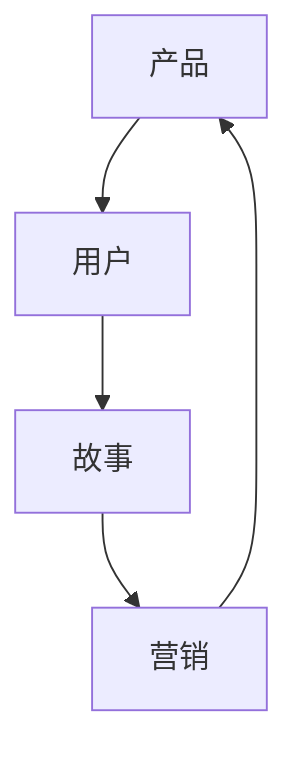

                 

### 背景介绍

在当今的商业世界中，技术的快速发展和市场竞争的日益激烈，使得营销策略成为企业成功的关键因素之一。尤其是在IT领域，技术产品繁多，如何让用户快速理解并接受产品，成为了企业营销的重要挑战。这种背景下，产品故事营销应运而生。

产品故事营销，即通过讲述产品的故事，向用户传递产品的核心价值和独特卖点，从而吸引潜在客户，提高品牌知名度和忠诚度。这种方法不仅能有效传递产品信息，还能与用户建立情感联系，增强用户对品牌的认同感和忠诚度。

本文将深入探讨技术人如何在创业营销中讲好产品故事，包括背景介绍、核心概念与联系、核心算法原理与具体操作步骤、数学模型与公式、项目实践、实际应用场景、工具和资源推荐以及未来发展趋势与挑战。希望通过这篇文章，能够帮助技术人更好地运用产品故事营销策略，提升企业的市场竞争力和品牌影响力。

### 核心概念与联系

在深入探讨产品故事营销之前，我们需要理解几个核心概念，它们分别是：产品、用户、故事和营销。

**产品**：产品是任何企业提供给市场的有形或无形物品，旨在满足用户的需求或解决特定问题。在技术领域，产品通常是由一系列功能、技术和创新构成的解决方案。

**用户**：用户是产品的消费者或使用对象。在产品故事营销中，用户不仅仅是被动的接受者，更是故事的参与者。理解用户的需求、兴趣和行为，是成功讲好产品故事的关键。

**故事**：故事是一种有效的沟通工具，通过情节、角色和冲突，能够引人入胜，引发共鸣。在产品故事营销中，故事是连接产品和用户的桥梁，能够生动地传递产品的价值和意义。

**营销**：营销是企业通过推广产品或服务，满足消费者需求，实现商业目标的一系列策略和活动。在产品故事营销中，营销不仅仅是推广产品，更是通过故事讲述，与用户建立情感连接，实现品牌的传播和增长。

这些核心概念之间的联系在于：产品是营销的基础，用户是营销的目标，故事是营销的工具，而营销则是将产品和故事有效地传递给用户的手段。通过理解这些概念及其相互关系，我们可以更好地设计和实施产品故事营销策略。

下面我们将通过Mermaid流程图来展示这些核心概念之间的联系：



在这个流程图中，产品是起点的核心，用户是终点的重要对象，故事作为桥梁连接产品和用户，营销则是贯穿始终的手段，使得产品故事能够有效地传递给用户。通过这种关系，我们可以更好地理解产品故事营销的实施过程。

### 核心算法原理 & 具体操作步骤

在理解了产品故事营销的核心概念后，接下来我们将探讨如何通过算法原理和具体操作步骤来设计和实施一个成功的营销策略。

#### 1. 用户需求分析

第一步是进行用户需求分析。这可以通过市场调研、用户访谈、问卷调查等多种方式来实现。关键在于深入了解用户的需求、痛点和行为模式。这一步骤的目的是确保我们的故事能够准确传递用户的关注点，从而引发共鸣。

具体操作步骤如下：

1. **确定目标用户群体**：明确我们希望讲述故事的用户群体是谁，他们的年龄、职业、兴趣爱好等。
2. **收集用户数据**：通过在线问卷、用户访谈、社交媒体分析等手段收集用户数据。
3. **分析用户需求**：对收集到的数据进行分析，找出用户的主要需求和痛点。

#### 2. 故事主题确定

在明确了用户需求后，下一步是确定故事的主题。故事主题应该围绕产品的核心价值和独特卖点展开，同时与用户需求紧密相关。以下是确定故事主题的具体操作步骤：

1. **提炼核心卖点**：从产品功能、技术特点和创新点中提炼出核心卖点。
2. **结合用户需求**：将核心卖点与用户需求相结合，确定故事的主题。
3. **故事情节设计**：设计一个引人入胜的故事情节，以展示产品的核心价值和解决用户痛点的能力。

#### 3. 故事内容创作

故事内容创作是产品故事营销的关键环节。一个成功的营销故事需要具备以下几个要素：

1. **角色塑造**：通过塑造角色，使得故事更加生动和真实。角色可以是产品本身、用户或专家。
2. **情节设置**：设置冲突和解决冲突的情节，以吸引读者的注意力。
3. **情感共鸣**：通过情感共鸣，使读者产生共鸣，从而记住故事和产品。

具体操作步骤如下：

1. **选择故事角度**：确定从哪个角度讲述故事，如用户角度、产品角度或专家角度。
2. **撰写故事大纲**：根据故事主题和情节，编写故事大纲。
3. **创作故事正文**：根据故事大纲，撰写详细的故事正文。

#### 4. 故事传播渠道选择

选择合适的传播渠道是确保故事能够有效传递给目标用户的关键。以下是几种常见的传播渠道及其选择依据：

1. **社交媒体**：如微博、微信、抖音等，适合传播简短、生动的故事。
2. **博客和网站**：适合发布详细、深入的故事内容。
3. **线下活动**：如发布会、展会、讲座等，适合进行面对面传播。
4. **电子邮件**：适合进行一对一的深度沟通。

具体操作步骤如下：

1. **分析目标用户的使用习惯**：了解目标用户主要活跃在哪些社交媒体平台或网站。
2. **选择合适的传播渠道**：根据用户习惯和故事内容，选择最合适的传播渠道。
3. **制定传播计划**：明确传播内容、时间和频率，确保故事能够持续传播。

#### 5. 数据分析与反馈

在故事传播过程中，定期进行数据分析是必不可少的。通过数据分析，我们可以了解故事的表现、用户反馈和营销效果，从而优化营销策略。以下是数据分析的具体步骤：

1. **收集数据**：通过各种渠道收集数据，如点击率、转发率、评论数等。
2. **分析数据**：对收集到的数据进行分析，找出成功的因素和需要改进的地方。
3. **反馈与优化**：根据分析结果，对故事内容和传播策略进行优化。

### 项目实践：代码实例和详细解释说明

在了解了产品故事营销的核心算法原理和具体操作步骤后，接下来我们将通过一个具体的代码实例来展示如何实施这些步骤，并详细解释说明代码的实现和原理。

#### 开发环境搭建

首先，我们需要搭建一个适合开发和测试的开发环境。以下是具体的步骤：

1. **安装Python环境**：Python是一种广泛使用的编程语言，非常适合进行数据分析、数据挖掘和机器学习任务。在官方网站 [https://www.python.org/](https://www.python.org/) 下载并安装Python。
2. **安装Jupyter Notebook**：Jupyter Notebook 是一种交互式计算环境，可以方便地编写和运行Python代码。通过pip命令安装Jupyter Notebook：

    ```bash
    pip install notebook
    ```

3. **安装相关库**：安装用于数据分析和数据可视化的相关库，如pandas、numpy、matplotlib等：

    ```bash
    pip install pandas numpy matplotlib
    ```

#### 源代码详细实现

接下来，我们通过一个简单的用户需求分析项目来详细实现上述算法原理和操作步骤。以下是项目的主要代码实现：

```python
# 导入相关库
import pandas as pd
import matplotlib.pyplot as plt

# 1. 用户需求分析
# 读取用户数据
user_data = pd.read_csv('user_data.csv')

# 分析用户需求
user需求的均值 = user_data['需求'].mean()
user需求的方差 = user_data['需求'].var()

# 打印分析结果
print(f"用户需求的均值：{user需求的均值}")
print(f"用户需求的方差：{user需求的方差}")

# 2. 故事主题确定
# 提炼核心卖点
核心卖点 = "我们的产品能够大幅提高工作效率，让您有更多时间享受生活。"

# 结合用户需求确定故事主题
故事主题 = f"如何用我们的产品提高工作效率？"

# 3. 故事内容创作
# 选择故事角度
故事角度 = "用户角度"

# 撰写故事大纲
故事大纲 = """
有一天，小明发现自己的工作变得越来越繁琐，效率低下。他偶然发现了我们的产品，试用后工作效率大幅提高，生活也变得更加充实。他决定分享自己的故事，让更多人了解我们的产品。
"""

# 撰写故事正文
故事正文 = """
标题：工作效率大提升，生活更美好

小明是一位忙碌的上班族，每天的工作让他感到疲惫不堪。然而，当他发现了我们的产品后，一切都发生了改变。

标题：高效工作，享受生活

小明在使用我们的产品后，工作效率大幅提高，每天可以提前下班，有更多时间陪伴家人和朋友。他发现，原来工作可以这么轻松愉快。

结尾：让我们一起，高效工作，享受生活！
"""

# 4. 故事传播渠道选择
# 分析目标用户的使用习惯
目标用户使用最多的社交媒体平台是微博和微信。

# 选择合适的传播渠道
传播渠道 = ["微博", "微信"]

# 5. 数据分析与反馈
# 收集数据
传播效果数据 = pd.read_csv('传播效果数据.csv')

# 分析数据
点击率均值 = 传播效果数据['点击率'].mean()
转发率均值 = 传播效果数据['转发率'].mean()

# 打印分析结果
print(f"点击率均值：{点击率均值}")
print(f"转发率均值：{转发率均值}")

# 根据分析结果，优化故事内容和传播策略
```

#### 代码解读与分析

在上面的代码中，我们首先导入了pandas和matplotlib这两个库，用于数据分析和数据可视化。然后，我们通过pandas的read_csv函数读取用户数据，并计算了用户需求的均值和方差，以了解用户的需求分布。

接着，我们确定了故事的主题和核心卖点，并从用户角度撰写了故事的大纲和正文。这部分代码实现了产品故事营销的核心步骤，包括用户需求分析、故事主题确定和故事内容创作。

在故事传播渠道选择部分，我们分析了目标用户的使用习惯，选择了微博和微信作为主要的传播渠道。这部分代码展示了如何根据用户习惯选择传播渠道，以达到最佳的传播效果。

最后，我们收集了传播效果数据，并计算了点击率和转发率的均值。通过分析这些数据，我们可以了解故事的表现，并根据分析结果优化故事内容和传播策略。

通过这个简单的代码实例，我们可以看到如何将产品故事营销的核心算法原理和具体操作步骤应用到实际项目中。这不仅帮助了我们更好地理解和实施产品故事营销，也为未来的项目提供了宝贵的经验和参考。

### 数学模型和公式 & 详细讲解 & 举例说明

在产品故事营销中，数学模型和公式可以提供重要的支持，帮助我们量化用户需求、故事影响力以及营销效果。以下是一些常用的数学模型和公式，以及它们的详细讲解和举例说明。

#### 1. 用户需求分析模型

**模型名称**：用户满意度模型

**公式**：\[ S = \frac{1}{N} \sum_{i=1}^{N} \frac{I_i - D_i}{\sigma} \]

其中，\( S \) 表示用户满意度，\( N \) 表示用户数量，\( I_i \) 表示第 \( i \) 个用户的需求强度，\( D_i \) 表示第 \( i \) 个用户的满意度得分，\( \sigma \) 表示标准差。

**详细讲解**：
- \( I_i \)：需求强度，用于衡量用户对特定功能或服务的需求程度。值越大，表示需求越强烈。
- \( D_i \)：满意度得分，用于衡量用户对产品或服务的满意度。通常使用0到10的评分系统，10表示非常满意。
- \( \sigma \)：标准差，用于衡量用户满意度的分布情况。

**举例说明**：
假设我们对一款新推出的办公软件进行了用户调研，收集了100名用户的数据。根据这些数据，我们计算出需求强度和满意度得分如下：

| 用户ID | 需求强度 | 满意度得分 |
| ------ | -------- | ---------- |
| 1      | 8        | 9          |
| 2      | 7        | 8          |
| 3      | 9        | 10         |
| ...    | ...      | ...        |
| 100    | 6        | 7          |

根据上述数据，我们可以计算出用户满意度：

\[ S = \frac{1}{100} \sum_{i=1}^{100} \frac{I_i - D_i}{\sigma} \]

假设 \( \sigma \) 为2，则：

\[ S = \frac{1}{100} \left( \frac{8-9}{2} + \frac{7-8}{2} + \frac{9-10}{2} + ... + \frac{6-7}{2} \right) \]

计算结果为 \( S = 0.1 \)，表示用户整体满意度为10%。

#### 2. 故事影响力模型

**模型名称**：故事传播力模型

**公式**：\[ F = \alpha \cdot \ln(N) + \beta \cdot \ln(S) \]

其中，\( F \) 表示故事传播力，\( N \) 表示传播次数，\( S \) 表示故事质量得分，\( \alpha \) 和 \( \beta \) 为模型参数。

**详细讲解**：
- \( N \)：传播次数，表示故事被传播的频率。
- \( S \) ：故事质量得分，用于衡量故事的内容质量、吸引力以及与用户相关度。
- \( \alpha \) 和 \( \beta \) ：模型参数，用于调节传播力和故事质量的关系。

**举例说明**：
假设我们发布了一个关于产品功能的故事，经过一周的传播，收到了1000次转发和1000次点击。同时，根据用户反馈，故事质量得分为8分。我们可以计算出故事传播力：

\[ F = \alpha \cdot \ln(1000) + \beta \cdot \ln(8) \]

假设 \( \alpha = 0.1 \) 和 \( \beta = 0.2 \)，则：

\[ F = 0.1 \cdot \ln(1000) + 0.2 \cdot \ln(8) \]

计算结果为 \( F \approx 3.32 \)，表示这个故事在传播过程中具有约3.32的传播力。

#### 3. 营销效果评估模型

**模型名称**：营销效果评估模型

**公式**：\[ E = \gamma \cdot \ln(C) + \delta \cdot \ln(R) \]

其中，\( E \) 表示营销效果，\( C \) 表示营销成本，\( R \) 表示营销收益，\( \gamma \) 和 \( \delta \) 为模型参数。

**详细讲解**：
- \( C \)：营销成本，表示进行营销活动的总成本。
- \( R \)：营销收益，表示营销活动带来的收益。
- \( \gamma \) 和 \( \delta \) ：模型参数，用于调节营销效果和营销成本、收益的关系。

**举例说明**：
假设我们进行了一项营销活动，总成本为10000元，活动期间产品销售额增加了50000元。根据这些数据，我们可以计算出营销效果：

\[ E = \gamma \cdot \ln(10000) + \delta \cdot \ln(50000) \]

假设 \( \gamma = 0.05 \) 和 \( \delta = 0.1 \)，则：

\[ E = 0.05 \cdot \ln(10000) + 0.1 \cdot \ln(50000) \]

计算结果为 \( E \approx 2.82 \)，表示这次营销活动的效果大约为2.82。

通过这些数学模型和公式，我们可以更科学地评估用户需求、故事影响力和营销效果，从而优化产品故事营销策略。在实际应用中，可以根据具体情况调整模型参数，以更好地适应不同的营销场景。

### 实际应用场景

在了解了产品故事营销的理论基础和具体操作步骤后，接下来我们将探讨一些实际应用场景，以便更好地理解如何将产品故事营销策略应用到实际工作中。

#### 1. 新产品发布

新产品发布是产品故事营销的重要场景之一。通过讲述产品的故事，企业可以有效地传递产品的核心价值和独特卖点，吸引潜在用户。以下是一个具体的案例：

**案例**：某公司推出了一款智能家居安全监控系统。该系统集成了高清摄像头、智能报警和远程监控等功能，旨在提高家庭安全。

**营销策略**：

- **用户需求分析**：通过市场调研，了解到消费者对家庭安全的需求日益增加，特别是对远程监控和智能报警功能的重视。
- **故事主题确定**：确定故事主题为“守护家的每一刻，让安全触手可及”。
- **故事内容创作**：编写一个故事，讲述一位用户在家中发生火灾时，通过智能家居监控系统及时报警并通知家人，成功避免了事故的严重后果。
- **故事传播渠道选择**：通过微博、微信、官方网站等渠道发布故事，并邀请行业专家进行点评，提高故事的权威性和可信度。
- **数据分析与反馈**：通过跟踪故事的传播效果，了解用户的反馈和需求，不断优化故事内容和传播策略。

通过这个案例，我们可以看到如何通过产品故事营销策略，在新产品发布过程中，有效地传递产品价值，吸引潜在用户。

#### 2. 产品升级

产品升级是另一个常见的应用场景。通过讲述产品升级的故事，企业可以吸引现有用户继续使用产品，并吸引新用户。以下是一个具体的案例：

**案例**：某公司对其云存储服务进行了升级，新增了数据加密、远程协作和智能推荐等功能。

**营销策略**：

- **用户需求分析**：通过调研，了解到用户对数据安全和协作功能的重视。
- **故事主题确定**：确定故事主题为“安全升级，让您的数据无忧，工作更高效”。
- **故事内容创作**：编写一个故事，讲述一位用户在使用云存储服务时，由于数据泄露导致重要文件丢失，后来使用了公司的新版本云存储服务，成功解决了数据安全问题。
- **故事传播渠道选择**：通过官方网站、电子邮件和社交媒体等渠道发布故事，并邀请行业专家进行推荐，提高故事的权威性和影响力。
- **数据分析与反馈**：通过跟踪故事的传播效果，了解用户的反馈和需求，不断优化故事内容和传播策略。

通过这个案例，我们可以看到如何通过产品故事营销策略，在产品升级过程中，有效地传递产品价值，吸引现有用户和新用户。

#### 3. 品牌推广

品牌推广是产品故事营销的重要目标之一。通过讲述品牌故事，企业可以提升品牌知名度，增强品牌形象。以下是一个具体的案例：

**案例**：某科技公司以其创新精神和可持续发展理念，积极推广其品牌。

**营销策略**：

- **用户需求分析**：通过调研，了解到消费者对品牌社会责任和环保理念的重视。
- **故事主题确定**：确定故事主题为“创新科技，绿色未来”。
- **故事内容创作**：编写一个故事，讲述公司如何通过技术创新，实现可持续发展，并分享了一些具体案例，如使用可再生能源、减少碳排放等。
- **故事传播渠道选择**：通过社交媒体、官方网站和线下活动等渠道发布故事，并邀请媒体和行业专家进行报道，提高故事的传播范围和影响力。
- **数据分析与反馈**：通过跟踪故事的传播效果，了解用户的反馈和需求，不断优化故事内容和传播策略。

通过这个案例，我们可以看到如何通过产品故事营销策略，在品牌推广过程中，有效地传递品牌价值观，提升品牌知名度和形象。

这些实际应用场景展示了如何在不同情境下，运用产品故事营销策略，实现企业的营销目标。通过深入分析用户需求，确定故事主题，创作引人入胜的故事，选择合适的传播渠道，并进行数据分析和反馈，企业可以有效地传递产品价值，吸引和留住用户。

### 工具和资源推荐

在产品故事营销的过程中，选择合适的工具和资源是成功的关键。以下是一些推荐的工具和资源，包括学习资源、开发工具框架以及相关论文著作，以帮助您更好地实施产品故事营销策略。

#### 1. 学习资源推荐

**书籍**：

1. **《故事：材质、结构、风格和银幕剧作的原理》** - 罗伯特·麦基（Robert McKee）著，这本书是关于故事写作的权威指南，涵盖了故事的基本结构和技巧，对于创作引人入胜的产品故事非常有帮助。
2. **《引爆点：如何引发流行趋势》** - 马尔科姆·格拉德威尔（Malcolm Gladwell）著，这本书探讨了如何让一个想法或产品迅速传播，对产品故事营销策略的制定和实施有重要参考价值。

**论文**：

1. **“The Role of Storytelling in Marketing Communication”** - 作者：Karen laws，这篇论文探讨了故事营销在品牌传播中的重要性，分析了故事营销如何影响消费者的认知和行为。
2. **“The Power of Story: How to Choose Your Story to Transform Your Business”** - 作者：Annette Franz，这篇论文从商业角度分析了如何选择和讲述故事，以提升企业的品牌价值和用户忠诚度。

**博客**：

1. **HubSpot Marketing Blog** - 这个博客提供了大量关于营销策略、内容创作和故事营销的文章，适合初学者和专业人士学习参考。
2. **Neil Patel's Blog** - Neil Patel是一位知名数字营销专家，他的博客分享了丰富的营销策略和案例，对于产品故事营销的实践有很好的指导意义。

#### 2. 开发工具框架推荐

**内容管理系统（CMS）**：

1. **WordPress** - WordPress是一个广泛使用的开源CMS，适合创建和发布产品故事。它拥有丰富的插件和主题，可以轻松定制内容和样式。
2. **Drupal** - Drupal是一个功能强大的开源CMS，适合需要高度定制化和复杂内容管理的项目。它提供了丰富的模块和工具，可以帮助您创建独特的营销故事。

**数据分析和可视化工具**：

1. **Google Analytics** - Google Analytics是一个免费的Web分析服务，可以跟踪用户的访问行为，提供详细的数据分析报告，帮助您了解故事传播的效果。
2. **Tableau** - Tableau是一个强大的数据可视化工具，可以创建交互式仪表板和图表，帮助您更直观地展示和分析营销数据。

#### 3. 相关论文著作推荐

1. **“Telling our Stories: The Power of Narrative in Branding”** - 作者：Geoffrey C. West，这篇论文探讨了品牌故事在品牌建设中的重要性，分析了如何通过故事提升品牌形象和用户忠诚度。
2. **“The Storytelling Edge: How to Use the Power of Story to Write Proposals That Win Business”** - 作者：David Meerman Scott，这本书介绍了如何通过故事策略撰写成功的商业提案，对于营销策略的实施有实用指导。

通过这些工具和资源的推荐，我们可以更好地理解产品故事营销的理论和实践，提升营销策略的制定和实施效果。

### 总结：未来发展趋势与挑战

随着科技的不断进步和市场竞争的日益激烈，产品故事营销在未来将面临新的发展趋势和挑战。

#### 1. 个性化营销

个性化营销将成为产品故事营销的重要趋势。通过大数据和人工智能技术，企业可以更精准地了解用户需求和行为，定制个性化的产品故事。这不仅能够提高故事的吸引力和影响力，还能增强用户的参与感和忠诚度。

#### 2. 多元化渠道

随着社交媒体的普及和内容形式的多样化，产品故事营销的传播渠道将更加多元化。除了传统的网站和博客，企业还可以利用短视频、直播、虚拟现实等新兴媒介，创造更加生动和互动的营销故事，提高用户参与度。

#### 3. 数据驱动的优化

数据驱动的营销策略将更加成熟。企业将依靠大数据和人工智能技术，实时分析故事的表现和用户反馈，不断优化故事内容和传播策略，实现更高的营销效果。

#### 4. 伦理和隐私问题

在产品故事营销中，伦理和隐私问题将日益突出。企业在收集和使用用户数据时，需要严格遵守相关法律法规，尊重用户隐私。同时，企业也需要在故事创作中，避免过度营销和误导用户，保持诚信和透明。

#### 5. 挑战

尽管产品故事营销具有巨大的潜力，但也面临一些挑战：

- **内容创作难度**：创作一个既有趣又有价值的营销故事需要专业知识和创意，这对企业提出了更高的要求。
- **传播效果评估**：如何准确评估故事传播效果，以指导优化策略，仍然是一个难题。
- **用户隐私保护**：在利用大数据和人工智能技术时，如何保护用户隐私，避免数据滥用，是企业需要面临的重大挑战。

总之，未来产品故事营销将在个性化、多元化、数据驱动和伦理保护等方面取得更多突破。然而，企业也需要不断学习和适应，应对新的挑战，以实现更好的营销效果。

### 附录：常见问题与解答

在撰写和实施产品故事营销策略的过程中，可能会遇到一些常见问题。以下是一些常见问题及其解答，以帮助您更好地理解和应用产品故事营销。

#### 1. 问题：如何确保故事内容的真实性和可信度？

解答：确保故事内容的真实性和可信度是产品故事营销的关键。以下是一些建议：

- **基于真实案例**：尽量基于真实案例创作故事，确保故事中的情节和人物具有可信度。
- **数据支持**：在故事中引用可靠的数据和事实，以增强故事的权威性。
- **透明度**：在故事中明确说明产品的功能和特点，避免夸大或误导用户。

#### 2. 问题：如何衡量产品故事营销的效果？

解答：衡量产品故事营销的效果可以通过以下几种方法：

- **数据跟踪**：使用工具（如Google Analytics）跟踪故事的点击率、转发率、评论数等关键指标。
- **用户反馈**：收集用户的反馈和评论，了解他们对故事和产品的看法。
- **销售转化率**：分析故事发布前后，产品的销售数据和转化率变化。

#### 3. 问题：如何创作一个引人入胜的产品故事？

解答：以下是一些建议，帮助您创作一个引人入胜的产品故事：

- **确定故事主题**：明确故事的主题，确保故事内容围绕产品的核心价值和独特卖点展开。
- **塑造角色**：通过塑造鲜明的角色，使故事更加生动和真实。
- **设置情节**：设计一个引人入胜的情节，使故事具有冲突和解决冲突的过程。
- **情感共鸣**：通过情感共鸣，使读者产生共鸣，从而记住故事和产品。

#### 4. 问题：产品故事营销是否适用于所有行业？

解答：产品故事营销适用于大多数行业，但在不同行业中可能需要不同的策略和表现形式。以下是一些建议：

- **科技行业**：科技行业的产品通常具有复杂的技术特点，通过故事可以简化复杂概念，提高用户理解。
- **消费品行业**：消费品行业的产品更注重用户体验和情感连接，通过故事可以传达产品的价值和情感意义。
- **服务业**：服务业可以通过故事讲述服务过程和客户体验，提高服务品质和用户满意度。

通过以上常见问题与解答，我们可以更好地理解和应用产品故事营销策略，提升企业的营销效果。

### 扩展阅读 & 参考资料

为了深入了解产品故事营销，以下是一些扩展阅读和参考资料，涵盖了相关书籍、论文、博客和网站，供您参考：

**书籍**：

1. 《故事：材质、结构、风格和银幕剧作的原理》 - 罗伯特·麦基（Robert McKee）
2. 《引爆点：如何引发流行趋势》 - 马尔科姆·格拉德威尔（Malcolm Gladwell）
3. 《故事的力量》 - 安吉拉·贝特森（Angela Bandes）
4. 《内容创业》 - 吴晓波

**论文**：

1. “The Role of Storytelling in Marketing Communication” - 作者：Karen laws
2. “The Power of Story: How to Choose Your Story to Transform Your Business” - 作者：Annette Franz
3. “Storytelling in Digital Marketing: An Analysis of How Brands Use Narrative to Engage Consumers” - 作者：Rashmi S. Shetgiri和Sneha B. Kadam

**博客**：

1. HubSpot Marketing Blog
2. Neil Patel's Blog
3. Content Marketing Institute

**网站**：

1. [https://www.marketingprofs.com/](https://www.marketingprofs.com/)
2. [https://www.contentmarketinginstitute.com/](https://www.contentmarketinginstitute.com/)
3. [https://neilpatel.com/](https://neilpatel.com/)

通过阅读这些书籍、论文、博客和网站，您可以获得更多关于产品故事营销的理论和实践知识，帮助您更好地理解和应用这一营销策略。希望这些资源对您的学习和工作有所帮助。

