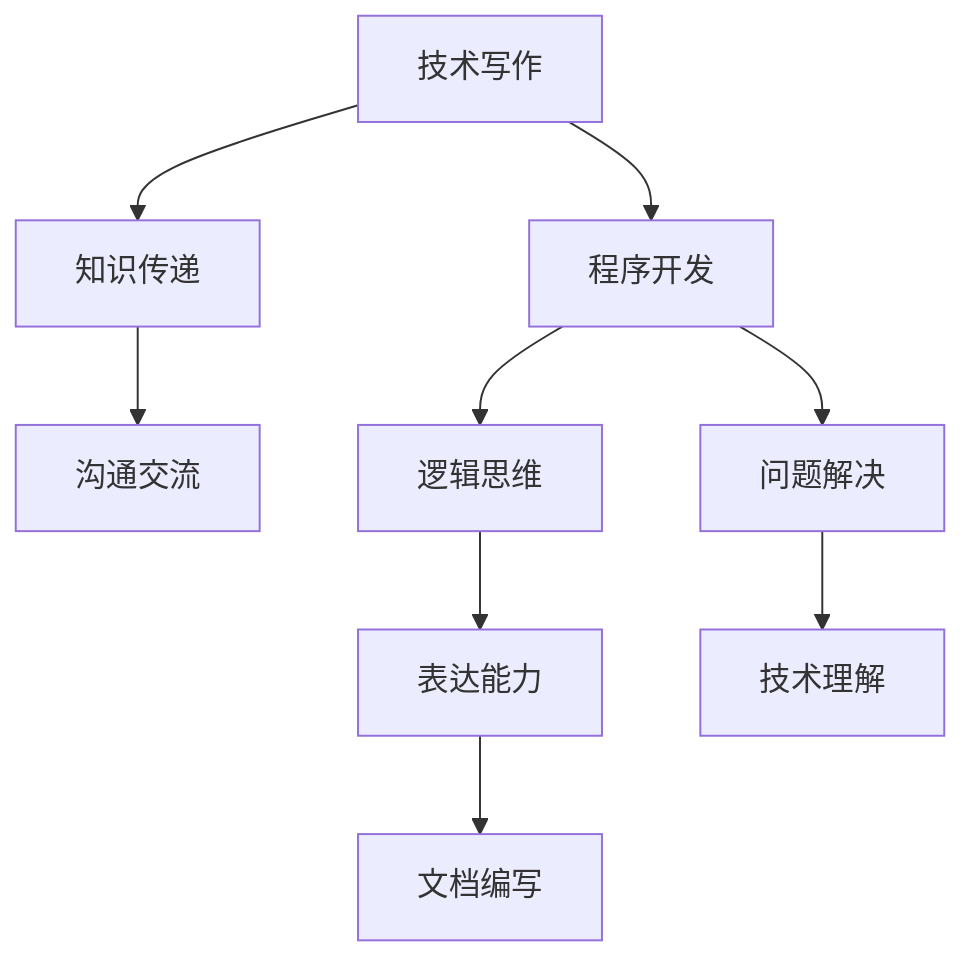
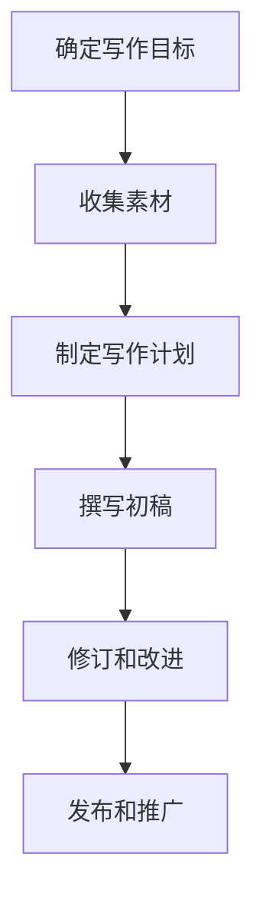

                 

# 技术写作：程序员的副业选择

## 摘要

本文旨在探讨技术写作作为程序员副业的价值和可行性。我们将从多个角度分析技术写作的吸引力，探讨其带来的潜在收益，以及如何成为一名合格的技术作家。文章将涵盖技术写作的定义、市场需求、写作技巧、时间和资源管理、以及未来趋势和挑战。通过本文，程序员可以更好地了解技术写作的潜力和如何将其作为副业实现个人和职业发展。

## 1. 背景介绍

技术写作是一种专业性的写作形式，旨在传达复杂的技术概念和知识，使其易于理解。它包括但不限于编程指南、技术博客、用户手册、白皮书、技术报告、书籍等。随着互联网和数字化的发展，技术写作的需求日益增长。企业和开发者需要通过高质量的文档和文章来促进知识共享、提高产品使用率、吸引和保留客户。

程序员作为技术领域的专业人士，拥有丰富的知识和实践经验。将这一优势转化为技术写作，不仅能够帮助他人更好地理解技术，还能为自己的职业发展带来新的机遇。事实上，许多成功的程序员已经通过技术写作获得了额外的收入、提升了个人品牌，并在行业内获得了更多的认可。

## 2. 核心概念与联系

### 技术写作的定义

技术写作是将技术概念、理论和实践以清晰、简洁、易懂的方式表达出来的过程。它不仅仅是写作，更是沟通。一个好的技术作品不仅要传递信息，还要激发读者的兴趣和思考。技术写作的关键在于理解目标受众，以及如何用恰当的语言和结构将复杂的技术知识传达给他们。

### 技术写作与程序开发的联系

程序开发和技术写作有许多相似之处。两者都需要清晰的表达能力、逻辑思维和问题解决能力。程序员在开发过程中积累的编程知识和实践经验，为技术写作提供了宝贵的素材。同时，技术写作也需要程序员具备良好的技术理解能力和文档编写能力，这些能力在程序开发中同样至关重要。

### 技术写作的市场需求

随着信息技术的快速发展，技术写作的市场需求也在不断扩大。以下是一些主要需求来源：

1. **企业内部文档**：企业需要详细的开发文档、用户手册、操作指南等来支持内部团队的工作和产品的推广。
2. **开源项目**：开源社区需要高质量的文档来吸引开发者参与和维护项目。
3. **在线教育**：在线教育平台和课程开发者需要编写系统的教程和课程材料，以传授技术知识。
4. **技术博客和出版**：技术博客和出版机构需要作者撰写技术文章和书籍，以提供有价值的内容。
5. **市场营销和公关**：企业需要技术文章来宣传产品、提高品牌知名度，以及吸引潜在客户。

### 技术写作的商业模式

技术写作的商业模式多种多样，以下是一些常见的收入来源：

1. **企业咨询**：为企业提供技术写作服务，如编写文档、撰写技术博客等。
2. **独立写作**：为个人或企业撰写技术文章、博客、书籍等。
3. **版权收益**：出售或授权技术作品的使用权，如出版书籍、版权转让等。
4. **广告收入**：通过个人博客或平台吸引流量，并通过广告获得收入。
5. **培训与演讲**：提供技术写作培训或进行技术演讲，收取费用。

### 技术写作与编程的关系图



## 3. 核心算法原理 & 具体操作步骤

### 核心算法原理

技术写作的核心算法可以概括为以下三个步骤：

1. **理解目标受众**：明确读者群体的背景、知识水平和需求，以便选择合适的表达方式和语言。
2. **组织内容结构**：将技术知识合理地组织成逻辑清晰、易于阅读的结构，如章节、小节、列表等。
3. **撰写和修订**：使用简洁、准确的语言撰写文章，并进行反复修订，以确保内容的准确性和可读性。

### 具体操作步骤

1. **确定写作目标**：明确你要写的内容、目标受众和写作目的。这有助于你更好地规划写作过程和内容结构。
2. **收集素材**：阅读相关文献、参考他人作品、了解最新技术动态，为你的写作积累素材。
3. **制定写作计划**：规划写作时间表，确保能够按时完成写作任务。你可以使用项目管理工具如Trello、JIRA等来管理你的写作进度。
4. **撰写初稿**：按照内容结构和素材，开始撰写初稿。在撰写过程中，注意保持逻辑清晰、语言简洁。
5. **修订和改进**：完成初稿后，进行多轮修订和改进。你可以请教同行或导师提供反馈，并根据反馈调整文章内容。
6. **发布和推广**：将完成的作品发布到适当的平台，如个人博客、技术社区、社交媒体等，并利用各种渠道进行推广。

### 技术写作流程图



## 4. 数学模型和公式 & 详细讲解 & 举例说明

### 数学模型和公式

在技术写作中，数学模型和公式是常见的内容。以下是一些基本的数学模型和公式，以及它们的详细讲解和举例说明。

#### 欧拉公式

欧拉公式（Euler's formula）是复分析中的一个重要公式，它将指数函数和三角函数联系起来：

\[ e^{i\pi} + 1 = 0 \]

这个公式在计算机科学中有着广泛的应用，特别是在算法复杂性和信息论等领域。

#### 举例说明

假设我们要计算 \( e^{i\pi} \) 的值，可以使用以下步骤：

1. 计算指数部分：\( i\pi \)
2. 计算结果：\( e^{i\pi} \)
3. 将结果加上1：\( e^{i\pi} + 1 \)
4. 检验结果是否为0

根据欧拉公式，结果应该是0。

```python
import math

# 计算指数部分
index = math.pi * 1j

# 计算结果
result = math.exp(index)

# 将结果加上1
result += 1

# 检验结果是否为0
print(result == 0)
```

输出结果应该是 `True`。

#### 另一个例子

假设我们要计算两个数的平均值：

\[ \text{平均值} = \frac{a + b}{2} \]

其中，\( a \) 和 \( b \) 是两个数。

```python
# 定义两个数
a = 10
b = 20

# 计算平均值
average = (a + b) / 2

# 输出结果
print("平均值：", average)
```

输出结果应该是 `15.0`。

### 总结

数学模型和公式在技术写作中是非常重要的组成部分。通过合适的例子和解释，读者可以更好地理解和应用这些数学概念。这不仅有助于提高文章的可读性，还能帮助读者在实际工作中解决问题。

## 5. 项目实践：代码实例和详细解释说明

### 5.1 开发环境搭建

为了演示如何将技术写作的知识应用到实际项目中，我们将创建一个简单的博客系统。首先，我们需要搭建开发环境。

#### 1. 安装Python

Python是一种广泛使用的编程语言，适合用于编写博客系统。首先，确保你的计算机上安装了Python。

在Windows上，可以通过Python官方网站下载并安装Python。在安装过程中，确保选择“Add Python to PATH”选项。

在macOS和Linux上，可以使用包管理器安装Python。例如，在Ubuntu上，可以使用以下命令：

```bash
sudo apt-get install python3
```

#### 2. 安装依赖库

接下来，我们需要安装一些依赖库来帮助我们构建博客系统。使用pip命令来安装这些库。

```bash
pip3 install Flask
```

Flask是一个轻量级的Web框架，非常适合用于构建小型博客系统。

#### 3. 创建项目目录

在计算机上创建一个项目目录，用于存放博客系统的代码和相关文件。

```bash
mkdir my_blog
cd my_blog
```

### 5.2 源代码详细实现

在项目目录中，创建一个名为`app.py`的Python文件，这是博客系统的主文件。

```python
from flask import Flask, render_template, request

app = Flask(__name__)

@app.route('/')
def index():
    posts = [
        {
            'title': '我的第一篇博客',
            'content': '这是我的第一篇博客，感谢您阅读。',
            'author': '作者：禅与计算机程序设计艺术',
            'date': '2023-03-01'
        },
        {
            'title': 'Python基础入门',
            'content': '在这篇文章中，我将介绍Python的基础知识。',
            'author': '作者：禅与计算机程序设计艺术',
            'date': '2023-03-02'
        }
    ]
    return render_template('index.html', posts=posts)

if __name__ == '__main__':
    app.run(debug=True)
```

在这个文件中，我们导入了Flask库，并定义了一个名为`app`的Flask应用。接下来，我们定义了一个名为`index`的路由函数，这个函数会返回一个包含两篇博客文章的列表。

```html
<!-- templates/index.html -->
<!DOCTYPE html>
<html lang="en">
<head>
    <meta charset="UTF-8">
    <meta name="viewport" content="width=device-width, initial-scale=1.0">
    <title>我的博客</title>
</head>
<body>
    <h1>我的博客</h1>
    
        <div>
            <h2>{{ post.title }}</h2>
            <p>{{ post.content }}</p>
            <p>作者：{{ post.author }}</p>
            <p>日期：{{ post.date }}</p>
        </div>
    
</body>
</html>
```

在这个HTML模板文件中，我们使用Jinja2模板语言遍历博客文章列表，并渲染每个文章的标题、内容和作者等信息。

### 5.3 代码解读与分析

在`app.py`文件中，我们首先导入了Flask库，这是我们的Web框架。然后，我们创建了一个名为`app`的Flask应用实例。

```python
app = Flask(__name__)
```

这个应用实例是我们的博客系统的核心，它负责处理HTTP请求并返回响应。

```python
@app.route('/')
def index():
    posts = [
        # ... 博客文章列表 ...
    ]
    return render_template('index.html', posts=posts)
```

`@app.route('/')`装饰器定义了一个URL路由，当访问网站的根目录（`/`）时，会调用`index`函数处理请求。`index`函数返回了一个包含两篇博客文章的列表，并传递给`render_template`函数。`render_template`函数会根据传递的模板文件（`index.html`）渲染HTML页面，并将博客文章列表渲染到页面上。

在`index.html`模板文件中，我们使用Jinja2模板语言遍历博客文章列表，并为每个文章渲染标题、内容和作者等信息。

```html

    <div>
        <h2>{{ post.title }}</h2>
        <p>{{ post.content }}</p>
        <p>作者：{{ post.author }}</p>
        <p>日期：{{ post.date }}</p>
    </div>

```

这个模板代码使用了``循环来遍历博客文章列表，并使用`{{ post.title }}`、`{{ post.content }}`、`{{ post.author }}`和`{{ post.date }}`变量来渲染每个文章的标题、内容、作者和日期。

### 5.4 运行结果展示

完成代码编写后，我们可以在本地运行博客系统。在终端中，导航到项目目录并运行以下命令：

```bash
python3 app.py
```

这将在本地启动Flask开发服务器。在浏览器中访问`http://127.0.0.1:5000/`，你应该能够看到博客系统的主页，其中包含两篇示例博客文章。

```html
<!DOCTYPE html>
<html lang="en">
<head>
    <meta charset="UTF-8">
    <meta name="viewport" content="width=device-width, initial-scale=1.0">
    <title>我的博客</title>
</head>
<body>
    <h1>我的博客</h1>
    <div>
        <h2>我的第一篇博客</h2>
        <p>这是我的第一篇博客，感谢您阅读。</p>
        <p>作者：禅与计算机程序设计艺术</p>
        <p>日期：2023-03-01</p>
    </div>
    <div>
        <h2>Python基础入门</h2>
        <p>在这篇文章中，我将介绍Python的基础知识。</p>
        <p>作者：禅与计算机程序设计艺术</p>
        <p>日期：2023-03-02</p>
    </div>
</body>
</html>
```

这个简单的博客系统展示了技术写作项目的基本结构和实现方法。通过这个示例，你可以更好地理解如何将技术写作与实际项目结合，并掌握相关技术。

## 6. 实际应用场景

技术写作在许多实际应用场景中发挥着重要作用。以下是一些常见应用场景：

### 1. 企业内部文档

企业内部文档是技术写作的重要应用场景之一。企业需要详细的技术文档来指导开发人员、运维人员和其他团队成员。这些文档包括API文档、开发指南、操作手册、故障排除指南等。高质量的技术文档不仅有助于提高团队协作效率，还能减少技术支持成本。

### 2. 开源项目

开源项目通常依赖高质量的技术文档来吸引开发者参与。文档涵盖了项目的背景、功能、安装教程、使用指南、贡献指南等。清晰的文档能帮助开发者快速上手项目，提高项目的社区参与度。

### 3. 在线教育

在线教育平台和课程开发者需要编写系统的教程和课程材料，以传授技术知识。这些教程和材料需要涵盖基础知识、实战案例、学习路径等，以适应不同层次的学习者。

### 4. 技术博客

技术博客是程序员展示技术能力和分享经验的重要平台。通过技术博客，程序员可以记录自己的学习过程、分享解决方案、探讨技术趋势。此外，技术博客还能帮助程序员建立个人品牌，吸引更多的职业机会。

### 5. 技术出版

技术出版是技术写作的传统应用场景。程序员可以通过撰写技术书籍、发表学术论文等方式，将知识系统化地传递给更广泛的读者。这不仅能提升个人影响力，还能为程序员带来额外的收入。

### 6. 市场营销和公关

企业需要通过技术文章来宣传产品、提高品牌知名度，以及吸引潜在客户。这些文章通常涵盖了产品的技术原理、应用案例、市场趋势等，以吸引读者的关注。

## 7. 工具和资源推荐

### 7.1 学习资源推荐

1. **书籍**：
   - 《代码大全》（"Code Complete" by Steve McConnell）
   - 《技术写作》（"Technical Writing" by Elizabeth Churchill and Gloria Mark）
   - 《程序员写书式编程》（"Writing is Essential" by Dave Copeland）

2. **论文**：
   - "A Study of Errors in Written Computer Programs" by Richard L. Bobrow and Margaret A. Linder
   - "The Importance of Writing in Learning to Program" by A. Rogers and M. Erwig

3. **博客和网站**：
   - **A List Apart**：一个关于Web设计和Web开发的知名博客。
   - **GitHub**：GitHub上有许多优秀的编程和实践指南。
   - **Stack Overflow**：一个庞大的问答社区，适合寻找技术写作灵感和答案。

### 7.2 开发工具框架推荐

1. **Markdown编辑器**：
   - **Visual Studio Code**：一个功能强大的代码编辑器，支持Markdown写作。
   - **Typora**：一个轻量级的Markdown编辑器，支持实时预览。

2. **写作工具**：
   - **Scrivener**：一个专门用于长篇写作的软件，适合编写技术书籍。
   - **Google Docs**：一个在线文档编辑工具，适合团队协作写作。

3. **项目管理工具**：
   - **Trello**：一个简单易用的项目管理工具，适合规划写作任务。
   - **JIRA**：一个功能丰富的项目管理工具，适合跟踪和管理工作流程。

### 7.3 相关论文著作推荐

1. **《程序员写书式编程》**（"Writing is Essential" by Dave Copeland）
   - 本书详细介绍了如何将编程思维应用到写作中，提高写作质量和效率。

2. **《技术写作：理论与实践》**（"Technical Writing: Theory and Practice" by Elizabeth Churchill and Gloria Mark）
   - 本书系统地讲解了技术写作的基本原理和方法，适合初学者和专业人员。

3. **《软件工程：实践者的研究方法》**（"Software Engineering: A Practitioner's Study of Methods" by Roger S. Pressman）
   - 本书涵盖了软件工程中的各种方法和技术，包括文档编写。

### 总结

技术写作是程序员副业选择的一个非常有价值的方向。通过技术写作，程序员不仅可以分享知识和经验，还能提升个人品牌、扩大影响力，并实现额外的收入。本文介绍了技术写作的核心概念、市场需求、写作技巧、项目实践、应用场景和资源推荐。希望这些信息能够帮助程序员更好地理解和选择技术写作作为自己的副业。

## 8. 总结：未来发展趋势与挑战

### 未来发展趋势

1. **人工智能助写**：随着人工智能技术的发展，AI将越来越多地参与到技术写作过程中。例如，自动生成文档、实时建议和校对功能等，将提高写作效率和准确性。

2. **多渠道发布**：技术写作不再局限于传统的书籍和博客，将逐渐向视频、播客、社交媒体等多种形式扩展，以满足不同读者的需求和偏好。

3. **个性化内容**：通过大数据和机器学习技术，技术写作将更加个性化，为读者提供更符合其兴趣和需求的内容。

4. **开源社区合作**：技术写作与开源社区的结合将更加紧密，更多的协作项目和共同创作的文档将涌现，促进知识的共享和传播。

### 挑战

1. **技术更新迅速**：技术领域更新迅速，技术写作需要不断跟进最新的技术动态，以保持内容的时效性和准确性。

2. **专业知识深度**：技术写作不仅需要丰富的编程和计算机科学知识，还需要深入理解所写领域的专业知识，这要求作者具备较高的专业素养。

3. **市场竞争激烈**：随着越来越多的人参与技术写作，市场竞争将变得更加激烈。如何写出高质量、有特色的内容，吸引读者的关注，是每个技术作者面临的挑战。

4. **版权和知识产权**：技术写作涉及到大量的知识产权问题，如何保护自己的原创作品，防止侵权和抄袭，是作者需要关注的重要方面。

## 9. 附录：常见问题与解答

### 问题1：如何开始技术写作？

**解答**：开始技术写作的第一步是确定你的兴趣领域和目标读者。然后，阅读相关的技术文档和书籍，积累知识。接下来，选择一个适合自己的写作平台，如博客、GitHub、Medium等，开始撰写文章。此外，参加技术社区和论坛，与其他技术作者交流，获取反馈和建议，也是提高写作能力的重要途径。

### 问题2：技术写作有哪些收入来源？

**解答**：技术写作的收入来源多种多样，包括但不限于以下几种：

1. **为企业撰写技术文档和博客**：为企业提供技术文档和博客写作服务，按篇收费或按月收费。
2. **出版书籍**：撰写并出版技术书籍，通过版权收益获得收入。
3. **开设在线课程**：通过在线教育平台开设技术课程，按学员人数收费。
4. **广告收入**：在个人博客或平台上吸引流量，通过广告获得收入。
5. **咨询和顾问服务**：为企业提供技术写作咨询服务。

### 问题3：技术写作需要哪些技能和知识？

**解答**：技术写作需要以下技能和知识：

1. **编程知识**：掌握至少一门编程语言，了解软件开发过程。
2. **计算机科学基础**：了解计算机科学的基本原理和概念。
3. **文档编写能力**：能够编写清晰、结构化的文档。
4. **沟通能力**：能够清晰地表达技术概念，适应不同读者的需求。
5. **研究能力**：能够快速查找和整理相关技术资料。

### 问题4：技术写作的时间如何管理？

**解答**：有效管理技术写作时间的关键在于：

1. **制定计划**：提前制定写作计划，明确写作目标和时间表。
2. **专注写作**：在写作过程中保持专注，避免分心。
3. **合理安排时间**：合理分配工作时间，确保有足够的时间进行研究和写作。
4. **利用工具**：使用项目管理工具和写作辅助工具，如Markdown编辑器、Trello等，提高写作效率。

### 问题5：如何保护自己的原创作品？

**解答**：保护原创作品的方法包括：

1. **版权登记**：在版权机构登记作品，获取版权保护。
2. **使用数字水印**：在作品中加入数字水印，以便追踪侵权行为。
3. **签订合同**：在与他人合作或委托他人写作时，签订详细的合同，明确版权归属和使用权限。
4. **监控侵权行为**：定期监控互联网上的侵权行为，采取措施维护自己的权益。

## 10. 扩展阅读 & 参考资料

为了深入了解技术写作，以下是一些扩展阅读和参考资料：

1. **《程序员写书式编程》**（"Writing is Essential" by Dave Copeland）：详细介绍如何将编程思维应用于写作，提高写作质量和效率。
2. **《技术写作：理论与实践》**（"Technical Writing: Theory and Practice" by Elizabeth Churchill and Gloria Mark）：系统地讲解技术写作的基本原理和方法。
3. **《技术写作手册》**（"The Technical Writer's Handbook" by Gary B. Johnson and Elizabeth J. Martin）：一本全面的技术写作指南，适合初学者和专业人员。
4. **《技术写作教程》**（"Technical Writing" by John C. W. Boos and Tanya E. Howland）：详细介绍技术写作的教学方法和实践技巧。
5. **在线资源**：
   - **GitHub**：许多技术作者在GitHub上分享了自己的技术写作资源和经验。
   - **Stack Overflow Documentation**：Stack Overflow上的文档部分提供了大量技术写作的实际案例和经验。
   - **A List Apart**：一个关于Web设计和Web开发的知名博客，涵盖了技术写作的最新趋势和实践。

通过阅读这些资料，你可以深入了解技术写作的各个方面，提升自己的写作能力。此外，参与技术社区和论坛，与其他技术作者交流，也是学习的重要途径。不断实践和反思，你将逐渐成长为一名优秀的技术作家。作者：禅与计算机程序设计艺术。

