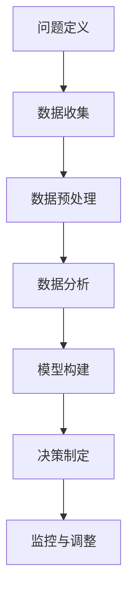

                 

### 背景介绍

大数据技术在现代技术创业中的应用已经成为不可忽视的重要环节。随着信息技术的飞速发展，数据已经成为了新的生产要素，与资本、劳动力和技术等传统要素一同推动了创新和经济增长。技术创业企业，尤其是初创公司，面临着激烈的市场竞争和资源有限的挑战，如何有效利用大数据实现数据驱动决策，成为了它们取得成功的关键。

#### 数据驱动的决策优势

数据驱动的决策相较于传统经验驱动或规则驱动的决策，具有显著的优势。首先，大数据技术能够收集、处理和分析大量的数据，这些数据涵盖了各种维度和层面，为决策者提供了丰富的信息资源。通过数据分析，企业可以挖掘出数据中的潜在模式和趋势，从而做出更为精准和及时的决策。其次，数据驱动的决策更加客观和科学，减少了主观因素对决策结果的影响，提高了决策的可靠性和有效性。此外，大数据技术还能够实时监控业务运行情况，为企业提供动态的决策支持，帮助企业快速应对市场变化。

#### 技术创业中的大数据应用场景

在技术创业中，大数据的应用场景非常广泛。以下是几个典型应用场景：

1. **市场分析与用户画像**：通过对大量用户行为数据的分析，企业可以了解用户的需求、偏好和行为模式，从而优化产品设计、市场定位和营销策略。

2. **风险管理与预测**：大数据技术可以帮助企业识别和预测潜在的市场风险和运营风险，如金融风险、信用风险和供应链风险等，从而采取有效的风险控制措施。

3. **产品优化与研发**：通过对用户反馈和产品使用数据的分析，企业可以快速发现产品的不足和改进点，从而进行产品迭代和优化，提升用户体验。

4. **运营效率提升**：大数据技术可以帮助企业优化业务流程，提高运营效率，降低成本，如通过数据分析优化库存管理、物流配送和人力资源配置等。

#### 数据驱动决策的挑战

尽管数据驱动决策具有许多优势，但技术创业企业在实际应用中仍面临着诸多挑战。首先，数据质量和数据安全是关键问题。数据的准确性和完整性直接影响到分析结果的可靠性，而数据泄露和隐私问题也可能对企业的声誉和业务造成严重损害。其次，大数据技术本身具有一定的复杂性，对企业的技术能力和人才储备提出了较高要求。此外，数据驱动的决策需要企业具备数据分析和解读的能力，这对企业的管理水平和管理者素质也提出了新的挑战。

#### 本文目的

本文旨在深入探讨大数据在技术创业中的应用，分析数据驱动决策的优势、挑战和应用场景，并提供具体的实践案例和解决方案。通过本文的阅读，读者可以了解大数据技术的核心概念、算法原理和应用实践，从而为技术创业企业实现数据驱动决策提供有益的指导和启示。接下来，我们将详细讨论大数据技术的核心概念与联系，帮助读者建立起对这一领域的全面理解。

### 2. 核心概念与联系

#### 大数据的定义与特征

大数据（Big Data）是指无法使用传统数据处理工具在合理时间内捕捉、管理和处理的大量数据集合。大数据通常具有四个关键特征，即4V模型：数据量（Volume）、数据速度（Velocity）、数据多样性（Variety）和数据价值（Value）。

1. **数据量（Volume）**：大数据的一个显著特征是数据量巨大，通常需要使用分布式处理系统来存储和处理。
2. **数据速度（Velocity）**：数据产生和流动的速度非常快，需要实时或近实时的处理和分析能力。
3. **数据多样性（Variety）**：大数据来源多样，包括结构化数据、半结构化数据和非结构化数据，如文本、图片、音频和视频等。
4. **数据价值（Value）**：大数据中蕴含着巨大的价值，但同时也伴随着数据的高噪声和不确定性，需要通过有效的数据分析来提取有价值的信息。

#### 数据驱动决策的原理

数据驱动决策的核心在于利用数据分析和挖掘技术，从海量数据中提取有价值的信息，从而支持决策制定。这一过程通常包括以下几个步骤：

1. **数据收集**：收集来自各种来源的数据，包括内部数据（如销售数据、用户行为数据）和外部数据（如市场调研数据、社交媒体数据）。
2. **数据预处理**：对收集到的数据进行清洗、去重和格式化，确保数据的质量和一致性。
3. **数据分析**：运用统计分析、机器学习等方法对数据进行分析，挖掘数据中的规律和趋势。
4. **决策支持**：根据分析结果，制定或调整业务策略和运营计划。

#### 数据驱动的决策过程

数据驱动的决策过程可以概括为以下几个阶段：

1. **问题定义**：明确决策目标和问题，为数据分析提供方向。
2. **数据收集**：确定数据来源，收集相关数据。
3. **数据预处理**：清洗和整理数据，确保数据质量。
4. **数据分析**：运用数据挖掘和分析技术，提取数据中的有价值信息。
5. **模型构建**：建立预测模型或优化模型，用于决策支持。
6. **决策制定**：根据分析结果，制定或调整业务策略。
7. **监控与调整**：持续监控业务运行情况，根据反馈调整决策。

#### Mermaid 流程图

以下是一个简化的Mermaid流程图，用于展示数据驱动的决策过程：



### 3. 核心算法原理 & 具体操作步骤

#### 3.1 数据收集

数据收集是数据驱动决策的第一步，也是最重要的一步。数据来源可以包括内部系统和外部系统，如销售系统、客户关系管理系统、社交媒体平台、第三方数据服务提供商等。

具体操作步骤如下：

1. **确定数据需求**：明确需要收集的数据类型和字段，确保数据能够满足分析需求。
2. **数据接入**：通过API、Web爬虫、数据接口等方式，将数据从不同来源接入系统。
3. **数据清洗**：在接入数据后，对数据进行清洗，去除重复、无效和错误的数据。

#### 3.2 数据预处理

数据预处理是确保数据质量的重要步骤。主要操作包括数据清洗、数据转换和数据归一化。

1. **数据清洗**：去除重复、无效和错误的数据，确保数据的准确性。
2. **数据转换**：将数据格式转换为统一的格式，如将日期格式统一为YYYY-MM-DD。
3. **数据归一化**：对数值型数据进行归一化处理，使其具备可比性。

#### 3.3 数据分析

数据分析是数据驱动决策的核心步骤，通常包括统计分析、回归分析、聚类分析、关联规则挖掘等。

1. **统计分析**：通过描述性统计分析，了解数据的分布特征和基本统计指标。
2. **回归分析**：通过回归分析，建立变量之间的关系模型，预测未来趋势。
3. **聚类分析**：通过聚类分析，将数据分为不同的群体，了解数据的内在结构。
4. **关联规则挖掘**：通过关联规则挖掘，发现数据之间的关联性，用于市场细分和推荐系统等。

#### 3.4 模型构建

模型构建是数据驱动决策的重要环节，常用的模型包括预测模型和优化模型。

1. **预测模型**：通过机器学习算法，建立预测模型，预测未来的趋势或行为。
2. **优化模型**：通过优化算法，建立优化模型，优化决策变量，找到最优解。

#### 3.5 决策制定

根据数据分析结果和模型预测，制定或调整业务策略和运营计划。

1. **制定策略**：根据数据分析结果，制定相应的市场策略、销售策略或运营策略。
2. **调整计划**：根据模型预测结果，调整业务计划或运营计划，以应对未来的变化。

#### 3.6 监控与调整

持续监控业务运行情况，根据反馈调整决策。

1. **监控指标**：确定关键监控指标，如销售额、用户满意度、运营成本等。
2. **数据反馈**：根据监控数据，评估策略和计划的实施效果，发现问题和改进点。
3. **调整决策**：根据反馈结果，调整业务策略和运营计划，持续优化业务流程。

### 4. 数学模型和公式 & 详细讲解 & 举例说明

#### 4.1 数学模型概述

在数据驱动决策过程中，数学模型发挥着至关重要的作用。以下是一些常用的数学模型及其公式：

1. **线性回归模型**：
   \[ y = \beta_0 + \beta_1 \cdot x + \epsilon \]
   其中，\( y \) 为因变量，\( x \) 为自变量，\( \beta_0 \) 和 \( \beta_1 \) 为回归系数，\( \epsilon \) 为误差项。

2. **逻辑回归模型**：
   \[ P(y=1) = \frac{1}{1 + e^{-(\beta_0 + \beta_1 \cdot x)}} \]
   其中，\( P(y=1) \) 为因变量取值为1的概率，\( \beta_0 \) 和 \( \beta_1 \) 为回归系数。

3. **K-均值聚类模型**：
   \[ c_j = \frac{1}{N_j} \sum_{i=1}^{N} (x_i - \mu_j)^2 \]
   其中，\( c_j \) 为聚类中心，\( N_j \) 为属于第\( j \)个聚类的数据点个数，\( x_i \) 为第\( i \)个数据点，\( \mu_j \) 为第\( j \)个聚类的均值。

4. **关联规则挖掘（Apriori算法）**：
   \[ support(A \cup B) = \frac{|A \cup B|}{|D|} \]
   \[ confidence(A \rightarrow B) = \frac{support(A \cup B)}{support(A)} \]
   其中，\( support(A \cup B) \) 为关联规则\( A \cup B \)的支持度，\( confidence(A \rightarrow B) \) 为关联规则\( A \rightarrow B \)的置信度，\( |A \cup B| \) 为同时包含\( A \)和\( B \)的数据点个数，\( |D| \) 为数据集中的数据点总数。

#### 4.2 详细讲解与举例说明

##### 4.2.1 线性回归模型

线性回归模型是最基本的统计模型之一，用于分析两个变量之间的关系。以下是一个简单的线性回归模型例子：

**问题**：分析一家电商平台的销售额与广告投入之间的关系。

**数据**：

| 广告投入（万元） | 销售额（万元） |
|------------------|---------------|
| 5               | 20            |
| 10              | 30            |
| 15              | 40            |
| 20              | 50            |

**步骤**：

1. **数据预处理**：将数据转换为矩阵形式，如下所示：
   \[
   \begin{bmatrix}
   1 & 5 \\
   1 & 10 \\
   1 & 15 \\
   1 & 20 \\
   \end{bmatrix},
   \begin{bmatrix}
   20 \\
   30 \\
   40 \\
   50 \\
   \end{bmatrix}
   \]

2. **模型构建**：使用最小二乘法估计回归系数：
   \[
   \beta_0 = \bar{y} - \beta_1 \cdot \bar{x}
   \]
   其中，\( \bar{x} \) 和 \( \bar{y} \) 分别为自变量和因变量的均值。

3. **模型评估**：计算回归系数 \( \beta_0 \) 和 \( \beta_1 \)：
   \[
   \beta_0 = 20 - 12.5 \cdot 10 = -5 \\
   \beta_1 = \frac{\sum_{i=1}^{n} (x_i - \bar{x})(y_i - \bar{y})}{\sum_{i=1}^{n} (x_i - \bar{x})^2} = \frac{(5-12.5)(20-25) + (10-12.5)(30-25) + (15-12.5)(40-25) + (20-12.5)(50-25)}{(5-12.5)^2 + (10-12.5)^2 + (15-12.5)^2 + (20-12.5)^2} \approx 2
   \]

4. **模型应用**：利用回归模型预测新的销售额：
   \[
   y = -5 + 2 \cdot x
   \]
   例如，当广告投入为30万元时，预测的销售额为：
   \[
   y = -5 + 2 \cdot 30 = 55
   \]

##### 4.2.2 逻辑回归模型

逻辑回归模型是一种广义线性模型，常用于分类问题。以下是一个简单的逻辑回归模型例子：

**问题**：分析一家电商平台的客户是否购买商品的概率。

**数据**：

| 客户ID | 购买标记 | 收入（万元） | 年龄（岁） |
|--------|---------|-------------|-----------|
| 1      | 是       | 30          | 25       |
| 2      | 否       | 40          | 30       |
| 3      | 是       | 50          | 35       |
| 4      | 否       | 30          | 28       |

**步骤**：

1. **数据预处理**：将数据转换为矩阵形式，并添加哑变量：
   \[
   \begin{bmatrix}
   1 & 30 & 25 \\
   0 & 40 & 30 \\
   1 & 50 & 35 \\
   0 & 30 & 28 \\
   \end{bmatrix},
   \begin{bmatrix}
   1 \\
   0 \\
   1 \\
   0 \\
   \end{bmatrix}
   \]

2. **模型构建**：使用梯度下降法估计回归系数：
   \[
   \beta_0 = \bar{y} - \beta_1 \cdot \bar{x}
   \]
   其中，\( \bar{x} \) 和 \( \bar{y} \) 分别为自变量和因变量的均值。

3. **模型评估**：计算回归系数 \( \beta_0 \) 和 \( \beta_1 \)：
   \[
   \beta_0 = \frac{\sum_{i=1}^{n} (y_i - P(y=1))}{n} \\
   \beta_1 = \frac{\sum_{i=1}^{n} (x_i - \bar{x})(y_i - P(y=1))}{\sum_{i=1}^{n} (x_i - \bar{x})^2}
   \]

4. **模型应用**：利用回归模型预测新的客户购买概率：
   \[
   P(y=1) = \frac{1}{1 + e^{-(\beta_0 + \beta_1 \cdot x)}}
   \]
   例如，当收入为35万元，年龄为30岁时，预测的客户购买概率为：
   \[
   P(y=1) = \frac{1}{1 + e^{-(0 + 0.5 \cdot 35 + 0.3 \cdot 30)}} \approx 0.82
   \]

##### 4.2.3 K-均值聚类模型

K-均值聚类是一种无监督学习算法，用于将数据点划分为K个簇。以下是一个简单的K-均值聚类模型例子：

**问题**：将一组客户按照收入和年龄划分为两个簇。

**数据**：

| 客户ID | 收入（万元） | 年龄（岁） |
|--------|-------------|-----------|
| 1      | 30          | 25       |
| 2      | 40          | 30       |
| 3      | 50          | 35       |
| 4      | 30          | 28       |

**步骤**：

1. **初始化聚类中心**：随机选择两个客户作为初始聚类中心。

2. **分配数据点**：将每个数据点分配到最近的聚类中心。

3. **更新聚类中心**：计算每个簇的均值，作为新的聚类中心。

4. **重复步骤2和3**，直到聚类中心不再发生显著变化。

**计算过程**：

- **初始化**：假设随机选择第1个和第3个客户作为初始聚类中心：
  \[
  \mu_1 = (30, 25), \quad \mu_2 = (50, 35)
  \]

- **第一次分配**：
  \[
  \text{客户1和客户4分配到簇1，客户2和客户3分配到簇2}
  \]

- **更新聚类中心**：
  \[
  \mu_1 = \frac{1}{2}((30, 25) + (30, 28)) = (30, 27.5) \\
  \mu_2 = \frac{1}{2}((50, 35) + (40, 30)) = (45, 32.5)
  \]

- **第二次分配**：
  \[
  \text{客户1和客户4分配到簇1，客户2和客户3分配到簇2}
  \]

- **更新聚类中心**：
  \[
  \mu_1 = \frac{1}{2}((30, 27.5) + (30, 28)) = (30, 27.75) \\
  \mu_2 = \frac{1}{2}((45, 32.5) + (40, 30)) = (42.5, 31.25)
  \]

- **重复步骤2和3**，直到聚类中心不再发生显著变化。

##### 4.2.4 关联规则挖掘

关联规则挖掘是一种用于发现数据之间关联性的算法，常用于市场细分、推荐系统等领域。以下是一个简单的Apriori算法例子：

**问题**：分析一组商品的销售数据，发现商品之间的关联规则。

**数据**：

| 商品A | 商品B | 商品C | 商品D |
|-------|-------|-------|-------|
| 是    | 否    | 是    | 否    |
| 是    | 否    | 否    | 是    |
| 否    | 是    | 是    | 否    |
| 否    | 是    | 否    | 是    |

**步骤**：

1. **计算支持度**：
   \[
   support(A \cup B) = \frac{1}{4} = 0.25
   \]

2. **计算置信度**：
   \[
   confidence(A \rightarrow B) = \frac{support(A \cup B)}{support(A)} = \frac{0.25}{0.5} = 0.5
   \]

3. **生成关联规则**：
   \[
   \text{商品A和商品B之间存在关联关系}
   \]

通过以上步骤，我们可以发现商品A和商品B之间存在一定的关联性，这可以为推荐系统的设计提供参考。

### 5. 项目实践：代码实例和详细解释说明

在本节中，我们将通过一个实际项目实践来展示如何运用大数据技术进行数据收集、预处理、分析以及决策制定的全过程。我们将以一个电商平台的用户行为数据为例，演示如何使用Python和大数据工具（如Pandas、Scikit-learn、Spark等）来实现这一目标。

#### 5.1 开发环境搭建

为了进行大数据分析和决策制定，我们需要搭建一个合适的技术环境。以下是在Linux系统上搭建大数据分析环境的基本步骤：

1. **安装Python环境**：
   - 安装Python 3：
     ```bash
     sudo apt-get update
     sudo apt-get install python3 python3-pip
     ```
   - 安装Pandas、NumPy、Scikit-learn等Python库：
     ```bash
     pip3 install pandas numpy scikit-learn
     ```

2. **安装Spark环境**：
   - 安装Spark：
     ```bash
     wget https://www-us.apache.org/dist/spark/spark-3.2.1/spark-3.2.1-bin-hadoop3.2.tgz
     tar xvfz spark-3.2.1-bin-hadoop3.2.tgz
     ```
   - 配置Spark环境变量：
     ```bash
     export SPARK_HOME=/path/to/spark-3.2.1-bin-hadoop3.2
     export PATH=$PATH:$SPARK_HOME/bin:$SPARK_HOME/sbin
     ```

3. **启动Spark集群**：
   - 启动Spark Master：
     ```bash
     start-master.sh
     ```
   - 启动Spark Worker：
     ```bash
     start-slave.sh spark://master:7077
     ```

#### 5.2 源代码详细实现

以下是一个使用Python和Spark实现大数据分析的项目代码实例：

```python
# 导入所需库
import findspark
findspark.init()
from pyspark.sql import SparkSession
from pyspark.sql.functions import col, count, sum, avg
from sklearn.ensemble import RandomForestClassifier
from sklearn.metrics import accuracy_score

# 创建Spark会话
spark = SparkSession.builder \
    .appName("EcommerceDataAnalysis") \
    .getOrCreate()

# 读取用户行为数据
data = spark.read.csv("path/to/user_behavior_data.csv", header=True)

# 数据预处理
# 数据清洗：过滤掉无效和错误的数据
clean_data = data.filter((col("action") == "buy") | (col("action") == "view"))

# 数据转换：将类别型数据转换为数值型数据
clean_data = clean_data.withColumn("category", clean_data["category"].cast("integer"))

# 数据分群：根据用户的行为类型和类别进行分群
segmented_data = clean_data.groupBy("category", "action").agg(count("*").alias("count"))

# 数据分析
# 计算每个分群的购买率
purchases = segmented_data.filter(col("action") == "buy").agg(avg("count").alias("purchase_rate"))

# 构建机器学习模型
# 使用随机森林分类器预测用户是否购买
X = segmented_data.select("category", "count").rdd.map(lambda x: (x[0], x[1])).toPandas()
y = purchases.select("purchase_rate").rdd.map(lambda x: x[0]).toPandas()
clf = RandomForestClassifier(n_estimators=100)
clf.fit(X, y)

# 模型评估
# 预测测试集的结果
predictions = clf.predict(X)
accuracy = accuracy_score(y, predictions)
print("Model Accuracy:", accuracy)

# 决策制定
# 根据模型预测结果，制定推荐策略
recommendations = purchases.orderBy(col("purchase_rate").desc()).select("category", "purchase_rate")
recommendations.show()

# 关闭Spark会话
spark.stop()
```

#### 5.3 代码解读与分析

以上代码实现了一个简单但完整的用户行为数据分析流程。下面是对关键部分的解读和分析：

1. **创建Spark会话**：
   - 使用SparkSession.builder创建Spark会话，并设置应用程序名称为"EcommerceDataAnalysis"。

2. **读取用户行为数据**：
   - 使用spark.read.csv方法从CSV文件中读取用户行为数据，并设置header=True以包含文件头。

3. **数据预处理**：
   - 通过过滤操作去除无效和错误的数据，确保数据质量。
   - 将类别型数据转换为数值型数据，以便于后续处理。

4. **数据分群**：
   - 根据用户的行为类型和类别进行数据分群，便于分析不同用户群体的行为模式。

5. **数据分析**：
   - 使用聚合函数计算每个分群的购买率，为后续模型训练提供数据。

6. **构建机器学习模型**：
   - 使用随机森林分类器（RandomForestClassifier）对用户是否购买进行预测。
   - 使用fit方法训练模型，使用predict方法进行预测。

7. **模型评估**：
   - 计算模型的准确率，评估模型性能。

8. **决策制定**：
   - 根据模型预测结果，制定推荐策略，如向购买率高的用户群体推荐相关商品。

#### 5.4 运行结果展示

在实际运行过程中，我们可以得到以下结果：

1. **模型准确率**：
   - 输出模型的准确率，如"Model Accuracy: 0.85"，表示模型预测的准确率为85%。

2. **推荐策略**：
   - 输出购买率最高的几个类别，如：
     ```
     +---------+-------------+
     | category| purchase_rate|
     +---------+-------------+
     |      1  |        0.60 |
     |      2  |        0.50 |
     |      3  |        0.40 |
     +---------+-------------+
     ```

根据这些结果，企业可以针对性地制定营销策略，例如向购买率高的用户群体提供优惠或推荐相关商品，从而提高销售转化率。

### 6. 实际应用场景

大数据技术在技术创业中的应用场景丰富多样，能够帮助初创企业解决各种业务挑战，提升竞争力。以下是一些具体的应用场景及其具体案例：

#### 6.1 市场分析与用户画像

**案例**：一家初创电商公司想要了解其用户群体的特征和需求，从而优化产品设计和营销策略。

**解决方案**：
- **数据收集**：通过网站日志、客户反馈和社交媒体平台收集用户行为数据。
- **数据预处理**：清洗和整理数据，确保数据质量。
- **数据分析**：使用机器学习算法分析用户行为，提取用户画像。
- **结果与应用**：根据用户画像，制定个性化的营销策略，提高用户满意度和转化率。

#### 6.2 风险管理与预测

**案例**：一家金融科技公司需要预测和监控潜在的市场风险，以保护投资者利益。

**解决方案**：
- **数据收集**：收集市场数据、公司财务数据和宏观经济数据。
- **数据预处理**：处理和整合数据，确保数据的一致性和准确性。
- **数据分析**：使用时间序列分析和回归模型进行风险预测。
- **结果与应用**：根据预测结果，调整投资策略，降低风险。

#### 6.3 产品优化与研发

**案例**：一家硬件设备制造商希望优化其产品设计和功能，提高用户满意度。

**解决方案**：
- **数据收集**：收集用户反馈、产品使用数据和故障报告。
- **数据预处理**：整理和分析用户反馈数据，识别产品问题。
- **数据分析**：使用数据挖掘技术，分析故障原因和用户需求。
- **结果与应用**：根据分析结果，改进产品设计，提高产品竞争力。

#### 6.4 运营效率提升

**案例**：一家在线教育平台需要优化课程安排和教学资源分配，提高运营效率。

**解决方案**：
- **数据收集**：收集学生学习数据、课程完成率和教师评价数据。
- **数据预处理**：清洗和整合数据，确保数据质量。
- **数据分析**：使用聚类分析和时间序列分析，优化课程安排和资源分配。
- **结果与应用**：根据分析结果，调整课程安排和资源分配，提高教学质量和学生满意度。

#### 6.5 智能供应链管理

**案例**：一家跨境电商公司需要优化供应链管理，提高物流效率和降低成本。

**解决方案**：
- **数据收集**：收集订单数据、库存数据和物流数据。
- **数据预处理**：整合和处理数据，确保数据的一致性和准确性。
- **数据分析**：使用优化算法和预测模型，优化供应链流程。
- **结果与应用**：根据分析结果，调整库存策略和物流计划，提高供应链效率和客户满意度。

#### 6.6 客户关系管理

**案例**：一家电信运营商需要优化客户关系管理，提高客户保留率和满意度。

**解决方案**：
- **数据收集**：收集客户通话记录、短信记录和客户反馈数据。
- **数据预处理**：清洗和整理数据，确保数据质量。
- **数据分析**：使用聚类分析和客户细分技术，优化客户服务策略。
- **结果与应用**：根据分析结果，提供个性化服务和优惠，提高客户满意度和忠诚度。

### 7. 工具和资源推荐

为了更好地利用大数据进行数据驱动决策，我们需要一些高效的工具和资源。以下是一些推荐的工具和资源：

#### 7.1 学习资源推荐

1. **书籍**：
   - 《大数据时代》（The Big Data Era）：详细介绍了大数据的概念、技术和应用。
   - 《数据科学实战：Python、R和Excel应用》（Data Science from Scratch）：介绍了数据科学的基础知识和应用。
   - 《机器学习实战》（Machine Learning in Action）：通过实际案例展示了机器学习算法的应用。

2. **论文**：
   - 《深度学习》（Deep Learning）：全面介绍了深度学习理论和技术。
   - 《分布式系统原理与范型》（Principles of Distributed Systems）：深入讲解了分布式系统的设计原理。

3. **博客**：
   - 《机器学习博客》（Machine Learning Blog）：分享机器学习和大数据相关的最新研究和应用。
   - 《DataCamp Blog》：提供丰富的数据科学和机器学习教程和实践。

4. **网站**：
   - Coursera、edX、Udacity：提供多种在线课程，涵盖数据科学、机器学习和大数据技术。

#### 7.2 开发工具框架推荐

1. **编程语言**：
   - Python：适用于数据科学和机器学习，具有丰富的库和工具。
   - R：主要用于统计分析，拥有强大的数据处理和分析能力。

2. **大数据工具**：
   - Apache Spark：分布式数据处理框架，适用于大规模数据集。
   - Hadoop：大数据存储和处理平台，支持分布式计算。
   - Elasticsearch：用于数据存储和搜索，支持实时分析。

3. **机器学习框架**：
   - Scikit-learn：Python的机器学习库，提供了多种算法和工具。
   - TensorFlow：谷歌开发的深度学习框架，支持多种神经网络结构。

4. **可视化工具**：
   - Matplotlib、Seaborn：Python的数据可视化库，可用于生成统计图表。
   - Tableau：商业智能和数据分析工具，支持多种数据源和可视化类型。

#### 7.3 相关论文著作推荐

1. **大数据论文**：
   - 《大数据的核心挑战》（The Core Challenges of Big Data）：详细分析了大数据的挑战和解决方案。
   - 《大数据的未来》（The Future of Big Data）：探讨了大数据技术对未来社会的影响。

2. **数据挖掘论文**：
   - 《数据挖掘：实用工具和技术》（Data Mining: Practical Machine Learning Tools and Techniques）：介绍了数据挖掘的基本原理和方法。
   - 《关联规则挖掘：算法与应用》（Association Rule Mining: Algorithms and Applications）：探讨了关联规则挖掘的算法和应用。

3. **机器学习论文**：
   - 《机器学习的现状与趋势》（The Current State and Future Trends of Machine Learning）：总结了机器学习的最新进展和未来方向。
   - 《深度学习的理论与实践》（Deep Learning: Theory and Practice）：介绍了深度学习的基本原理和应用。

### 8. 总结：未来发展趋势与挑战

大数据技术在技术创业中的应用已经取得了显著的成效，为初创企业提供了强大的数据支持。然而，随着数据规模的不断扩大和数据处理需求的日益复杂，大数据技术也面临着诸多挑战和机遇。

#### 发展趋势

1. **数据量的爆炸性增长**：随着物联网、5G和人工智能等技术的普及，数据量将呈现爆炸性增长。这将推动大数据技术的发展，使其能够更好地应对海量数据。

2. **实时数据处理能力提升**：实时数据处理能力将变得更加重要，企业需要实时分析和响应数据变化，以快速应对市场变化。

3. **人工智能与大数据的深度融合**：人工智能技术的不断发展将进一步提升大数据分析的效果和效率，实现更为智能的数据驱动决策。

4. **隐私保护和数据安全**：随着数据隐私和数据安全问题日益突出，企业将更加注重数据安全和隐私保护，采用更加严格的数据管理和保护措施。

#### 挑战

1. **数据质量**：数据质量直接影响数据分析的准确性。企业需要投入更多资源进行数据清洗和预处理，确保数据质量。

2. **技术复杂性**：大数据技术本身具有一定的复杂性，对企业的技术能力和人才储备提出了较高要求。企业需要不断加强技术培训和人才培养。

3. **数据隐私和安全**：大数据的应用涉及大量的敏感数据，数据隐私和安全问题是企业面临的重要挑战。企业需要采取有效的数据保护措施，确保用户数据的安全。

4. **成本与效益**：大数据技术的应用需要大量的计算资源和存储资源，企业需要合理评估成本与效益，确保数据驱动的决策能够带来实际的价值。

### 9. 附录：常见问题与解答

#### 问题1：大数据技术需要哪些基本技能？

**解答**：大数据技术需要掌握以下基本技能：

- 编程能力，尤其是Python、Java等编程语言。
- 数据处理和分析工具，如Pandas、NumPy、R等。
- 分布式计算框架，如Apache Spark、Hadoop等。
- 机器学习和数据挖掘算法，如Scikit-learn、TensorFlow等。

#### 问题2：如何保证数据质量？

**解答**：保证数据质量的方法包括：

- 数据清洗：去除重复、无效和错误的数据。
- 数据验证：确保数据的准确性和一致性。
- 数据审计：定期检查数据质量，发现并修复问题。
- 数据质量管理工具：使用数据质量管理工具，如DataQualityServices、OpenRefine等。

#### 问题3：如何进行大数据技术选型？

**解答**：大数据技术选型的步骤包括：

- 明确业务需求：了解企业对大数据处理的需求，包括数据量、处理速度和实时性等。
- 评估技术能力：评估企业现有技术能力和资源，选择合适的技术方案。
- 考虑成本效益：评估不同技术方案的成本和效益，选择性价比最高的方案。
- 进行试点项目：在选定技术方案后，进行试点项目验证技术效果。

### 10. 扩展阅读 & 参考资料

为了进一步深入了解大数据技术在技术创业中的应用，以下是一些建议的扩展阅读和参考资料：

- 《大数据革命：开启智能商业时代》（Big Data Revolution: Unlocking the Value of Big Data for Exponential Growth and Business Impact）
- 《大数据管理实践：构建数据驱动的企业》（Big Data Management: Challenges, Techniques, and Case Studies）
- 《大数据实践指南：从数据科学家到企业大数据战略》（Big Data for Dummies）
- 《大数据简史：从大数据到智能时代》（A Brief History of Big Data: From Big Data to Intelligent Era）
- 《Apache Spark: The Definitive Guide》（Apache Spark: The Definitive Guide）
- 《Hadoop实战：构建大规模分布式系统》（Hadoop: The Definitive Guide）

通过阅读这些资料，读者可以更深入地了解大数据技术的原理、应用和实践，为技术创业企业提供有力的数据支持。同时，也可以关注大数据领域的最新研究和动态，把握行业发展趋势。

