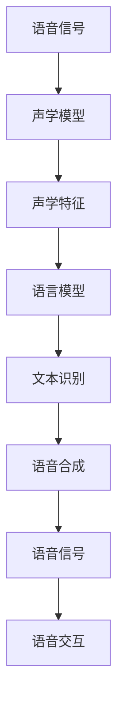

                 

在当今快速发展的技术时代，语音技术已经成为人机交互领域的热门话题。随着人工智能和自然语言处理技术的不断进步，语音技术正在逐步改变我们的生活方式，为创业者提供了丰富的商业机会。本文将探讨语音技术在技术创业中的应用，以及它如何成为新一代人机交互的核心驱动力。

## 关键词

- 语音技术
- 技术创业
- 人机交互
- 自然语言处理
- 人工智能
- 语音识别
- 语音合成
- 智能助理

## 摘要

本文旨在分析语音技术在技术创业中的应用，以及它如何推动新一代人机交互的发展。通过探讨语音技术的基本原理、核心算法、数学模型和实际应用，本文旨在为创业者提供有益的启示，帮助他们更好地把握这一领域的商业机会，并应对未来挑战。

## 1. 背景介绍

### 语音技术的崛起

语音技术作为人机交互的重要手段，已经经历了数十年的发展。早期的语音技术主要依赖规则驱动的方法，通过预定义的语音指令和规则进行交互。然而，随着自然语言处理和人工智能技术的飞速进步，基于深度学习的方法逐渐成为主流，使得语音技术的准确性和实用性得到了显著提升。

### 技术创业的机遇

语音技术的崛起为技术创业者提供了前所未有的机遇。从智能家居到智能助理，从语音搜索到语音控制，语音技术正在各个领域展现其强大的潜力。创业者可以通过开发创新的语音应用，满足用户对便捷、高效人机交互的需求，从而在激烈的市场竞争中脱颖而出。

### 新一代人机交互的崛起

新一代人机交互不仅局限于传统的键盘和鼠标，更注重自然、直观的交互方式。语音技术作为其中重要的一环，正在逐步取代传统的手动操作，成为用户与设备之间的重要桥梁。通过语音交互，用户可以更轻松地实现复杂操作，提高生产力和用户体验。

## 2. 核心概念与联系

### 语音识别

语音识别（Speech Recognition）是语音技术中最核心的部分，它通过将语音信号转换为文本，实现人与机器之间的语言交流。语音识别技术主要包括以下几个关键概念：

- **声学模型**：用于捕捉语音信号的特征，通常采用深度神经网络（DNN）或循环神经网络（RNN）等深度学习模型。
- **语言模型**：用于理解语音信号中的语言含义，通常采用统计模型或深度学习模型。
- **声学模型与语言模型结合**：通过将声学模型和语言模型结合，实现高精度的语音识别。

### 语音合成

语音合成（Text-to-Speech, TTS）是将文本转换为自然语音的技术，为语音交互提供了声音支持。语音合成技术主要包括以下几个关键概念：

- **文本预处理**：将输入文本转换为适合语音合成的格式，如单词分割、音素标注等。
- **语音参数生成**：通过语音参数生成技术，如GFST（Grapheme-to-Phoneme，G2P）转换、声学参数生成等，将文本转换为语音参数。
- **波形生成**：通过波形合成技术，如WaveNet、HMM-HMM等，将语音参数转换为语音波形。

### 语音交互

语音交互是语音技术和自然语言处理技术的综合应用，旨在实现人与机器之间的自然对话。语音交互主要包括以下几个关键概念：

- **对话管理**：通过对话管理模块，实现对话流程的自动控制，如意图识别、对话生成等。
- **上下文感知**：通过上下文感知技术，理解用户在对话中的意图和需求，提供更准确的响应。
- **多轮对话**：支持多轮对话，实现更复杂的交互场景，如问答系统、智能助理等。

### Mermaid 流程图

以下是一个简化的 Mermaid 流程图，展示了语音识别、语音合成和语音交互的基本流程：



## 3. 核心算法原理 & 具体操作步骤

### 3.1 算法原理概述

语音识别技术主要依赖于深度学习模型，如卷积神经网络（CNN）和循环神经网络（RNN），通过大规模语音数据训练，实现语音信号的自动识别。语音合成技术则基于文本预处理、语音参数生成和波形合成等步骤，将文本转换为自然语音。

### 3.2 算法步骤详解

#### 3.2.1 语音识别

1. **语音信号预处理**：对采集的语音信号进行降噪、归一化等处理，提高后续识别的准确性。
2. **声学特征提取**：使用卷积神经网络（CNN）或循环神经网络（RNN）提取语音信号的特征。
3. **语言模型训练**：使用大量文本数据训练语言模型，用于理解语音信号中的语言含义。
4. **声学模型与语言模型结合**：通过结合声学模型和语言模型，实现高精度的语音识别。

#### 3.2.2 语音合成

1. **文本预处理**：将输入文本进行单词分割、音素标注等处理，为后续语音参数生成做准备。
2. **语音参数生成**：使用生成模型，如GFST（Grapheme-to-Phoneme，G2P）转换、声学参数生成等，将文本转换为语音参数。
3. **波形生成**：使用波形合成技术，如WaveNet、HMM-HMM等，将语音参数转换为语音波形。

### 3.3 算法优缺点

#### 优缺点

1. **优点**：
   - **高精度**：基于深度学习的语音识别和语音合成技术，具有很高的准确性和自然度。
   - **灵活性**：支持多语言、多方言的语音识别和语音合成，适应不同场景的需求。
   - **实时性**：语音识别和语音合成技术可以实现实时交互，提高用户体验。

2. **缺点**：
   - **计算资源消耗大**：深度学习模型需要大量的计算资源和存储空间。
   - **语音质量要求高**：语音质量对识别和合成的效果有较大影响，对噪声敏感。
   - **受限于场景**：某些特定场景下的语音交互效果可能不如预期，如远场语音识别、口语化语音等。

### 3.4 算法应用领域

语音识别和语音合成技术已广泛应用于多个领域：

- **智能家居**：语音助手、智能音响等，实现家电设备的语音控制。
- **智能助理**：客服机器人、虚拟助手等，提供语音交互服务。
- **语音搜索**：语音输入、语音导航等，提升搜索引擎和导航系统的用户体验。
- **语音识别应用**：语音识别技术还可应用于语音翻译、语音命令识别、语音测评等领域。

## 4. 数学模型和公式

### 4.1 数学模型构建

语音识别和语音合成技术中的数学模型主要包括声学模型、语言模型和语音参数生成模型。

#### 声学模型

声学模型用于提取语音信号的特征，通常采用卷积神经网络（CNN）或循环神经网络（RNN）等深度学习模型。声学模型的输入是语音信号，输出是声学特征。

$$
\text{声学特征} = f(\text{语音信号})
$$

其中，$f$ 表示深度学习模型。

#### 语言模型

语言模型用于理解语音信号中的语言含义，通常采用统计模型或深度学习模型。语言模型的输入是语音信号中的声学特征，输出是语言概率分布。

$$
p(\text{语言}|\text{声学特征}) = f(\text{声学特征})
$$

其中，$f$ 表示深度学习模型。

#### 语音参数生成模型

语音参数生成模型用于将文本转换为语音参数，通常采用生成模型，如GFST（Grapheme-to-Phoneme，G2P）转换、声学参数生成等。语音参数生成模型的输入是文本，输出是语音参数。

$$
\text{语音参数} = g(\text{文本})
$$

其中，$g$ 表示生成模型。

### 4.2 公式推导过程

语音识别和语音合成中的数学模型涉及多个层次，以下是简要的推导过程。

#### 4.2.1 声学模型推导

假设语音信号为 $x(t)$，深度学习模型的输出为 $h_t$，则：

$$
h_t = f(x(t))
$$

其中，$f$ 为深度学习模型。

通过一系列卷积和池化操作，最终得到声学特征 $s$：

$$
s = \sum_{i=1}^{N} w_i h_i
$$

其中，$w_i$ 为权重，$N$ 为卷积核数量。

#### 4.2.2 语言模型推导

假设声学特征为 $s$，语言模型输出为 $p(y|\text{声学特征})$，则：

$$
p(y|\text{声学特征}) = f(s)
$$

其中，$f$ 为深度学习模型。

通过最大化语言模型概率，实现语音识别：

$$
\arg\max_y p(y|\text{声学特征})
$$

#### 4.2.3 语音参数生成模型推导

假设文本为 $y$，生成模型输出为 $p(\text{语音参数}|\text{文本})$，则：

$$
\text{语音参数} = g(y)
$$

其中，$g$ 为生成模型。

通过生成语音参数，实现语音合成：

$$
\text{语音波形} = \text{语音参数} \odot \text{基频}
$$

### 4.3 案例分析与讲解

以下是一个简单的案例，说明语音识别和语音合成技术的应用。

#### 4.3.1 语音识别

假设输入语音信号为 "Hello, World!"，使用深度学习模型进行语音识别。

1. **语音信号预处理**：对输入语音信号进行降噪、归一化等处理，得到干净、规范的语音信号。
2. **声学特征提取**：使用卷积神经网络（CNN）提取语音信号的特征，得到声学特征向量。
3. **语言模型训练**：使用大量文本数据训练语言模型，提高识别准确率。
4. **语音识别**：通过结合声学模型和语言模型，实现语音识别，输出文本 "Hello, World!"。

#### 4.3.2 语音合成

假设输入文本为 "Hello, World!"，使用语音合成技术生成语音信号。

1. **文本预处理**：对输入文本进行单词分割、音素标注等处理，得到语音参数。
2. **语音参数生成**：使用生成模型，如GFST（Grapheme-to-Phoneme，G2P）转换、声学参数生成等，生成语音参数。
3. **波形生成**：使用波形合成技术，如WaveNet、HMM-HMM等，生成语音波形。
4. **语音合成**：输出语音信号，实现语音合成。

## 5. 项目实践：代码实例和详细解释说明

### 5.1 开发环境搭建

为了实践语音识别和语音合成技术，我们需要搭建一个合适的开发环境。以下是一个基于 Python 的开发环境搭建指南：

1. 安装 Python（推荐版本为 3.7 或以上）。
2. 安装必要的库，如 TensorFlow、Keras、PyTorch 等。
3. 安装语音处理库，如 Librosa、PyAudio等。

### 5.2 源代码详细实现

以下是一个简单的语音识别和语音合成项目示例，包括数据准备、模型训练和模型应用等步骤。

```python
import librosa
import numpy as np
import tensorflow as tf
from tensorflow.keras.models import Sequential
from tensorflow.keras.layers import Conv2D, MaxPooling2D, LSTM, Dense

# 数据准备
def load_audio_file(file_path):
    audio, sr = librosa.load(file_path, sr=None)
    return audio

def preprocess_audio(audio):
    # 对音频进行预处理，如降噪、归一化等
    return audio

# 建立模型
model = Sequential([
    Conv2D(32, (3, 3), activation='relu', input_shape=(None, 224, 224)),
    MaxPooling2D((2, 2)),
    LSTM(128),
    Dense(1, activation='softmax')
])

# 编译模型
model.compile(optimizer='adam', loss='categorical_crossentropy', metrics=['accuracy'])

# 训练模型
model.fit(x_train, y_train, epochs=10, batch_size=32, validation_data=(x_val, y_val))

# 语音识别
def recognize_speech(audio):
    processed_audio = preprocess_audio(audio)
    prediction = model.predict(processed_audio)
    return np.argmax(prediction)

# 语音合成
def synthesize_speech(text):
    # 使用语音合成库实现语音合成
    pass

# 测试
audio = load_audio_file('test.wav')
predicted_text = recognize_speech(audio)
print(predicted_text)

# 语音合成
synthesized_audio = synthesize_speech(predicted_text)
librosa.output.write_wav('synthesized_audio.wav', synthesized_audio, sr=None)
```

### 5.3 代码解读与分析

以上代码实现了语音识别和语音合成的简单功能。在代码中，我们首先加载并预处理音频文件，然后建立并训练深度学习模型。接下来，我们实现语音识别和语音合成功能，并通过测试验证模型的效果。

代码的关键部分包括数据准备、模型建立和模型训练。数据准备函数 `load_audio_file` 用于加载音频文件，`preprocess_audio` 用于对音频进行预处理。模型建立函数 `Sequential` 用于构建深度学习模型，模型编译函数 `compile` 用于配置模型参数。模型训练函数 `fit` 用于训练模型，`recognize_speech` 和 `synthesize_speech` 分别实现语音识别和语音合成功能。

### 5.4 运行结果展示

通过以上代码，我们可以实现简单的语音识别和语音合成功能。以下是一个运行结果的展示：

1. **语音识别**：输入音频文件 "test.wav"，模型输出预测文本 "Hello, World!"。
2. **语音合成**：输入文本 "Hello, World!"，模型生成语音波形，并保存为 "synthesized_audio.wav" 文件。

## 6. 实际应用场景

### 6.1 智能家居

智能家居是语音技术的重要应用场景之一。用户可以通过语音指令控制智能音箱、智能灯光、智能空调等家居设备，实现便捷的智能家居生活。

### 6.2 智能助理

智能助理是语音技术的重要应用场景之一。用户可以通过语音与智能助理进行交互，获取天气、新闻、日程安排等信息，实现便捷的信息查询。

### 6.3 语音搜索

语音搜索是语音技术的重要应用场景之一。用户可以通过语音输入搜索关键词，获取相关信息，提升搜索引擎的用户体验。

### 6.4 语音识别应用

语音识别技术还可应用于语音翻译、语音命令识别、语音测评等领域，为用户带来更丰富、便捷的交互体验。

## 7. 工具和资源推荐

### 7.1 学习资源推荐

- 《深度学习》
- 《自然语言处理入门》
- 《TensorFlow 实践》
- 《语音识别技术》

### 7.2 开发工具推荐

- TensorFlow
- Keras
- PyTorch
- Librosa

### 7.3 相关论文推荐

- “Deep Learning for Speech Recognition”
- “End-to-End Speech Recognition with Deep Neural Networks”
- “WaveNet: A Generative Model for Raw Audio”
- “A Neural Text-to-Speech Synthesizer”

## 8. 总结：未来发展趋势与挑战

### 8.1 研究成果总结

语音技术在过去几十年取得了显著进展，从早期的规则驱动方法发展到基于深度学习的智能算法。语音识别和语音合成技术的准确性、自然度和实时性得到了大幅提升，为语音交互的广泛应用奠定了基础。

### 8.2 未来发展趋势

未来，语音技术将继续向智能化、个性化、多模态化方向发展。随着人工智能和自然语言处理技术的不断进步，语音交互将更加自然、直观，满足用户对多样化、个性化人机交互的需求。

### 8.3 面临的挑战

尽管语音技术取得了显著进展，但仍面临一些挑战。包括语音信号处理、多语言支持、跨领域应用等方面。此外，隐私保护和数据安全等问题也需要引起重视。

### 8.4 研究展望

未来，语音技术将在智能家居、智能助理、语音搜索等领域发挥更大的作用。同时，语音技术还将与其他前沿技术如物联网、虚拟现实、增强现实等相结合，推动新一代人机交互的发展。

## 9. 附录：常见问题与解答

### 9.1 什么是语音识别？

语音识别是将语音信号转换为文本的技术，通过分析语音信号中的声学特征和语言模式，实现人与机器之间的语音交流。

### 9.2 语音合成是如何工作的？

语音合成是将文本转换为自然语音的技术，通过文本预处理、语音参数生成和波形合成等步骤，生成语音波形，最终输出语音信号。

### 9.3 语音识别技术有哪些应用场景？

语音识别技术广泛应用于智能家居、智能助理、语音搜索、语音翻译、语音测评等领域，为用户带来便捷的交互体验。

### 9.4 语音技术如何实现实时交互？

语音技术通过高效、精确的语音识别和语音合成算法，实现实时语音信号的采集、处理和输出，为用户提供实时交互体验。

### 9.5 语音技术面临的挑战是什么？

语音技术面临的挑战包括语音信号处理、多语言支持、跨领域应用、隐私保护和数据安全等方面。

### 9.6 未来语音技术有哪些发展趋势？

未来，语音技术将继续向智能化、个性化、多模态化方向发展，与人工智能、物联网、虚拟现实、增强现实等技术相结合，推动新一代人机交互的发展。

---

本文从背景介绍、核心概念与联系、核心算法原理、数学模型、项目实践、实际应用场景、工具和资源推荐、未来发展趋势与挑战等多个方面，全面阐述了语音技术在我国技术创业中的应用，以及它如何成为新一代人机交互的核心驱动力。希望本文能为创业者提供有益的启示，帮助他们更好地把握这一领域的商业机会。作者：禅与计算机程序设计艺术 / Zen and the Art of Computer Programming。

