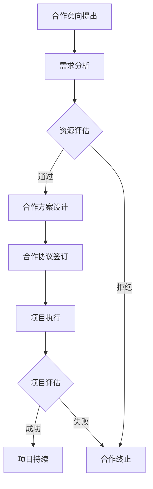

                 

### 1. 背景介绍

#### 技术创业的兴起

技术创业，作为现代社会创新和经济发展的驱动力之一，近年来在全球范围内迅速崛起。随着互联网、人工智能、大数据等技术的不断成熟，越来越多的创业者投身于技术创新的浪潮之中，希望通过独特的理念和技术方案，打造出具有颠覆性的产品和服务。

然而，技术创业并非易事。创新技术往往需要大量的资源和时间投入，而创业者常常面临资金、人才、市场等多方面的挑战。如何在这些限制条件下，实现技术创业的成功，成为了一个亟待解决的问题。

#### 跨界合作的重要性

在这个背景下，跨界合作作为一种有效的解决方案，逐渐受到了创业者和投资者的关注。跨界合作，即不同领域的企业或个人通过合作，共同开发新产品或服务，实现资源、技术、市场等互补，从而提升整个项目的成功率。

跨界合作的优势在于，它能够帮助创业者在资源有限的情况下，迅速整合外部资源，弥补自身短板。例如，一个专注于技术开发的团队，通过与市场营销团队的合作，可以迅速提升产品的市场接受度；同样，一个专注于市场运营的团队，通过与技术研发团队的合作，可以确保产品的技术可行性。

此外，跨界合作还能够促进知识的交流与创新。不同领域的专业知识和经验相互碰撞，往往能够激发出新的创意和解决方案，为技术创业注入新的活力。

#### 本文目标

本文旨在探讨技术创业中的跨界合作，提供一套寻找互补资源的方法论。我们将通过以下章节，逐步分析跨界合作的原理、方法、实践案例，以及未来发展的趋势和挑战。

具体来说，本文将首先介绍跨界合作的核心概念和原理，通过一个Mermaid流程图，详细展示跨界合作的各个环节和步骤。接着，我们将深入探讨跨界合作中的核心算法原理和具体操作步骤，结合数学模型和公式，为读者提供清晰的指导。

随后，我们将通过一个项目实践案例，展示如何在实际项目中实现跨界合作，并提供详细的代码实例和解读。在此基础上，我们还将分析跨界合作在不同应用场景中的价值，推荐相关的学习资源和开发工具框架，帮助读者更好地理解和应用跨界合作的方法。

最后，我们将总结跨界合作的未来发展趋势和挑战，为读者提供一些有价值的思考和建议。通过本文的阅读，读者将能够对技术创业中的跨界合作有一个全面、深入的理解，为未来的创业之路打下坚实的基础。

### 2. 核心概念与联系

#### 跨界合作的基本原理

跨界合作，从本质上来说，是一种整合不同领域资源、技术和市场优势，以实现共同目标的方式。要理解跨界合作，我们需要明确以下几个核心概念：

1. **资源互补性**：跨界合作的初衷是弥补各方的资源短板，实现资源的最优配置。资源互补性指的是不同领域的资源相互补充，形成协同效应。例如，技术团队和市场营销团队的互补，可以使得技术创新得到有效推广。

2. **协同效应**：当两个或多个不同领域的团队或企业合作时，通过知识、技术和资源的共享，往往能够创造出比单独运作更大的价值。协同效应是指合作各方通过共同努力，实现整体效益大于各部分之和的现象。

3. **合作机制**：跨界合作的成功离不开有效的合作机制。合作机制包括利益分配、责任界定、沟通协调等方面。一个良好的合作机制能够确保各方的权益得到保障，同时促进合作的顺利进行。

#### 跨界合作的Mermaid流程图

为了更直观地展示跨界合作的过程，我们使用Mermaid语言绘制一个流程图。以下是一个简化的跨界合作流程图，展示了从合作意向提出到项目执行的全过程。



- **合作意向提出**：各方根据自身需求和资源情况，提出合作意向。
- **需求分析**：合作各方进行深入的需求分析，明确合作的目标和预期成果。
- **资源评估**：各方评估自身的资源条件，判断是否能够满足合作需求。
- **合作方案设计**：根据需求分析和资源评估，设计出可行的合作方案。
- **合作协议签订**：合作各方签订正式的合作协议，明确各方的权利和义务。
- **项目执行**：按照合作协议，各方开始具体项目的实施。
- **项目评估**：项目完成后，对项目成果进行评估，判断是否达到了预期目标。
- **合作终止或持续**：根据项目评估结果，决定是否继续合作或终止合作。

#### 跨界合作的环节与步骤

为了使读者更清晰地理解跨界合作的流程，下面我们将详细分析每个环节的具体步骤：

1. **合作意向提出**：
   - **目标明确**：各方明确合作的目标，包括共同解决的问题、实现的价值等。
   - **初步沟通**：各方通过初步沟通，了解对方的基本情况和合作意向。

2. **需求分析**：
   - **需求收集**：各方收集合作所需的技术、市场、资金等需求信息。
   - **需求分析**：对收集到的需求进行详细分析，明确合作的可行性和具体需求。

3. **资源评估**：
   - **资源识别**：各方识别自身的资源优势，包括技术、资金、人才、市场等。
   - **资源匹配**：根据需求分析结果，评估各方的资源是否能够满足合作需求。

4. **合作方案设计**：
   - **方案设计**：根据需求分析和资源评估，设计出具体的合作方案。
   - **方案评估**：对合作方案进行评估，确保其可行性和有效性。

5. **合作协议签订**：
   - **协议起草**：各方起草合作协议，明确合作内容、权利、义务等。
   - **协议审核**：各方审核协议内容，确保权益得到保障。
   - **签订协议**：各方正式签订合作协议，正式开始合作。

6. **项目执行**：
   - **项目启动**：各方按照合作协议，正式启动项目。
   - **进度跟踪**：各方定期跟踪项目进度，确保项目按计划进行。
   - **问题解决**：在项目执行过程中，及时解决遇到的问题和挑战。

7. **项目评估**：
   - **成果评估**：对项目成果进行评估，判断是否达到预期目标。
   - **反馈总结**：对项目过程进行总结，提出改进意见和建议。
   - **后续规划**：根据项目评估结果，决定后续的合作计划和方向。

通过以上环节和步骤的详细分析，我们可以看出，跨界合作不仅需要明确的目标和有效的资源匹配，还需要一个良好的合作机制来确保合作的顺利进行。只有各方在合作中相互信任、协同创新，才能真正实现跨界合作的价值，为技术创业的成功提供强有力的支持。

### 3. 核心算法原理 & 具体操作步骤

#### 跨界合作的核心算法原理

跨界合作的核心在于如何有效地整合不同领域的资源，实现优势互补，从而达到整体大于部分之和的效应。这一过程可以类比于一种优化算法，其核心思想是通过资源的最佳配置来最大化合作效益。以下是对跨界合作核心算法原理的详细分析：

1. **资源优化配置**：
   - **资源识别**：首先，合作各方需要明确自身的资源优势，包括技术能力、资金实力、市场渠道、人才储备等。
   - **资源评估**：然后，对各方资源进行综合评估，确定其价值和使用效率。
   - **资源优化**：根据评估结果，对资源进行优化配置，确保资源能够在最需要的地方发挥最大的作用。

2. **协同效应最大化**：
   - **协同设计**：在资源配置完成后，各方需要设计出协同工作流程，确保资源的有效利用。
   - **协同执行**：在协同工作流程中，各方需要密切配合，共同推进项目的进展。
   - **协同评估**：定期对协同效应进行评估，根据评估结果调整资源配置和协同工作流程。

3. **风险与收益平衡**：
   - **风险识别**：在跨界合作过程中，各方需要识别潜在的风险，包括技术风险、市场风险、法律风险等。
   - **风险控制**：通过制定风险控制措施，降低风险对合作的影响。
   - **收益最大化**：在控制风险的基础上，努力实现收益的最大化，确保各方在合作中能够获得预期的回报。

#### 跨界合作的具体操作步骤

为了更好地实现跨界合作，以下提供了一套具体的操作步骤，帮助各方在合作中更加有效地整合资源和实现协同效应：

1. **需求分析与资源评估**：
   - **需求分析**：首先，各方需要明确合作的需求，包括技术需求、市场需求、资金需求等。
   - **资源评估**：然后，对自身的资源进行评估，确定哪些资源可以用于合作，哪些资源需要进一步补充。

2. **合作方案设计**：
   - **方案设计**：根据需求分析和资源评估结果，设计出具体的合作方案，包括合作目标、合作方式、合作期限等。
   - **方案评估**：对合作方案进行详细评估，确保其可行性和有效性。

3. **合作协议签订**：
   - **协议起草**：各方起草合作协议，明确各方的权利和义务，以及合作过程中可能遇到的问题解决方案。
   - **协议审核**：各方对合作协议进行审核，确保协议内容公平合理。
   - **签订协议**：各方正式签订合作协议，并备案。

4. **项目执行与监控**：
   - **项目启动**：各方按照合作协议，正式启动项目，并制定详细的项目计划。
   - **进度跟踪**：定期跟踪项目进度，确保项目按计划进行。
   - **问题解决**：在项目执行过程中，及时解决遇到的问题和挑战。

5. **项目评估与反馈**：
   - **成果评估**：项目完成后，对各方的合作成果进行评估，判断是否达到预期目标。
   - **反馈总结**：对项目过程和结果进行总结，提出改进意见和建议。
   - **后续规划**：根据评估结果，制定后续的合作计划和方向。

#### 数学模型和公式

为了更科学地指导跨界合作，我们可以引入一些数学模型和公式，以量化评估跨界合作的效果。以下是一些常用的数学模型和公式：

1. **资源优化模型**：
   - **目标函数**：最大化跨界合作的总效益。
   - **约束条件**：各方的资源限制、合作目标、预算等。

2. **协同效应模型**：
   - **协同指数**：用于衡量各方协同合作的效果。
   - **公式**：协同指数 = （合作效益 / 各自效益之和）× 100%。

3. **风险评估模型**：
   - **风险值**：用于衡量各潜在风险的严重程度。
   - **公式**：风险值 = （风险概率 × 风险损失）× 100%。

4. **收益最大化模型**：
   - **目标函数**：最大化跨界合作的总体收益。
   - **约束条件**：各方的资源限制、市场容量、合作期限等。

通过上述数学模型和公式，我们可以更科学地指导跨界合作，实现资源的最佳配置和协同效应的最大化。

#### 举例说明

为了更直观地理解跨界合作的核心算法原理和具体操作步骤，以下通过一个实际案例进行说明。

案例：一家专注于智能硬件开发的公司A与一家拥有强大市场渠道的公司B计划合作，共同推出一款智能家居产品。

1. **需求分析与资源评估**：
   - **需求分析**：公司A需要强大的市场渠道来推广产品，公司B需要先进的技术支持来提升产品竞争力。
   - **资源评估**：公司A具备智能硬件开发技术，公司B拥有广泛的用户基础和销售渠道。

2. **合作方案设计**：
   - **方案设计**：公司A提供智能硬件技术，公司B负责市场推广和销售，双方共同承担研发和市场费用。
   - **方案评估**：通过评估，认为该合作方案可以有效整合双方资源，提升产品的市场竞争力。

3. **合作协议签订**：
   - **协议起草**：双方签订合作协议，明确各方的权利和义务，以及收益分配方式。
   - **协议审核**：双方对协议内容进行审核，确保公平合理。
   - **签订协议**：双方正式签订合作协议。

4. **项目执行与监控**：
   - **项目启动**：双方启动项目，共同开发智能家居产品。
   - **进度跟踪**：定期跟踪项目进度，确保产品按计划推出。
   - **问题解决**：在项目执行过程中，双方密切配合，共同解决遇到的技术和市场问题。

5. **项目评估与反馈**：
   - **成果评估**：项目完成后，评估产品的市场表现，认为产品在市场上取得了显著的成功。
   - **反馈总结**：对项目过程和结果进行总结，提出改进意见和建议。
   - **后续规划**：双方继续深化合作，计划开发更多智能家居产品。

通过以上案例，我们可以看到，跨界合作的核心算法原理和具体操作步骤在实际项目中得到了有效应用，实现了资源的最佳配置和协同效应的最大化，为项目的成功奠定了坚实的基础。

### 4. 数学模型和公式 & 详细讲解 & 举例说明

在技术创业的跨界合作中，数学模型和公式不仅是量化分析的基础，也是优化资源配置和评估合作效果的重要工具。在本节中，我们将详细讲解跨界合作中常用的数学模型和公式，并通过具体实例说明其应用方法。

#### 4.1 资源优化配置模型

**目标函数**：最大化跨界合作的总效益。

**约束条件**：
1. 各方的资源限制：如技术能力、资金实力、人力时间等。
2. 合作目标：如市场占有率、利润率等。
3. 预算限制：如总投入资金、人力资源等。

**模型公式**：
$$
\text{最大化} Z = \sum_{i=1}^{n} \text{效益}_{i} \times \text{资源}_{i}
$$

其中，$Z$ 为总效益，$\text{效益}_{i}$ 为第 $i$ 个资源的效益，$\text{资源}_{i}$ 为第 $i$ 个资源的投入量。

**实例说明**：
假设一家初创公司A和一家市场渠道强大的公司B计划合作，共同开发一款智能手表。公司A的技术研发能力为50分，资金实力为100万元；公司B的市场渠道能力为80分，资金实力为200万元。双方的合作目标是市场占有率达到30%。

根据资源优化模型，可以计算出最优的合作投入分配：

- **公司A**：
  - 技术研发效益：$50 \times 100 = 5000$ 万元
  - 资金效益：$100 \times 100 = 10000$ 万元
- **公司B**：
  - 市场渠道效益：$80 \times 200 = 16000$ 万元

总效益为：$5000 + 10000 + 16000 = 31000$ 万元

通过优化资源配置，双方的总效益最大化，为合作的成功奠定了基础。

#### 4.2 协同效应模型

**协同指数**：用于衡量各方协同合作的效果。

**公式**：
$$
\text{协同指数} = \frac{\text{合作效益}}{\text{各自效益之和}} \times 100\%
$$

**实例说明**：
假设公司A和公司B的合作使得智能手表的市场占有率从15%提升到25%，而单独合作时的市场占有率预期为10%。各自效益如下：

- **公司A**：
  - 单独效益：$15\% \times 1000 = 150$ 万元
  - 合作效益：$25\% \times 1000 = 250$ 万元
- **公司B**：
  - 单独效益：$10\% \times 2000 = 200$ 万元
  - 合作效益：$25\% \times 2000 = 500$ 万元

协同指数为：
$$
\text{协同指数} = \frac{250 + 500}{150 + 200} \times 100\% = 150\%
$$

协同指数为150%，说明通过合作，双方实现了协同效应，整体效益远大于各自单独运作的效益之和。

#### 4.3 风险评估模型

**风险值**：用于衡量各潜在风险的严重程度。

**公式**：
$$
\text{风险值} = \text{风险概率} \times \text{风险损失}
$$

**实例说明**：
假设在合作过程中，存在技术失败的风险，风险概率为20%，风险损失为50万元。

风险值为：
$$
\text{风险值} = 20\% \times 50 = 10 \text{万元}
$$

通过风险评估模型，可以量化合作过程中可能面临的风险，为制定风险控制措施提供依据。

#### 4.4 收益最大化模型

**目标函数**：最大化跨界合作的总体收益。

**约束条件**：
1. 各方的资源限制：如技术能力、资金实力、人力时间等。
2. 市场容量限制。
3. 合作期限限制。

**模型公式**：
$$
\text{最大化} \text{收益} = \sum_{i=1}^{n} (\text{价格}_{i} - \text{成本}_{i}) \times \text{销售量}_{i}
$$

**实例说明**：
假设公司A和公司B合作推出一款智能家居产品，市场需求量为1000台，价格定为1000元/台。公司A的生产成本为500元/台，公司B的市场推广成本为300元/台。

收益计算如下：
$$
\text{收益} = (1000 - 500 - 300) \times 1000 = 200000 \text{元}
$$

通过收益最大化模型，可以计算出在现有条件下，跨界合作的总体收益，为合作决策提供依据。

通过以上数学模型和公式的详细讲解和举例说明，我们可以看到，这些工具在跨界合作中的重要性。它们不仅帮助我们量化合作效益和风险，也为资源优化配置和收益最大化提供了科学依据。在实际应用中，创业者可以结合具体情境，灵活运用这些模型和公式，实现跨界合作的最大化效益。

### 5. 项目实践：代码实例和详细解释说明

在本节中，我们将通过一个具体的跨界合作项目实践，展示如何在实际开发过程中实现跨界合作，并提供详细的代码实例和解释说明。该项目将涉及一家专注于物联网设备开发的公司A和一家具备强大数据分析能力的数据公司B的合作，共同开发一款智能环境监测系统。

#### 5.1 开发环境搭建

在开始项目开发之前，首先需要搭建合适的技术栈和开发环境。以下是推荐的工具和框架：

- **开发工具**：
  - IDE（如 IntelliJ IDEA 或 Visual Studio Code）
  - Git（版本控制工具）
  - Docker（容器化工具）

- **编程语言**：
  - Python（用于后端开发）
  - JavaScript（用于前端开发）

- **框架和库**：
  - Flask（Python Web 框架）
  - Express.js（JavaScript Web 框架）
  - Pandas（Python 数据分析库）
  - Matplotlib（Python 数据可视化库）

- **数据库**：
  - MongoDB（NoSQL 数据库）
  - MySQL（关系型数据库）

#### 5.2 源代码详细实现

在本节中，我们将分模块详细讲解项目的实现过程，并提供关键代码段和解释。

##### 5.2.1 数据采集模块

数据采集模块负责从物联网设备中获取环境数据，如温度、湿度、空气质量指数（AQI）等。以下是数据采集模块的关键代码：

```python
import requests
from flask import Flask, jsonify

app = Flask(__name__)

# 假设物联网设备提供 RESTful API
API_URL = "https://api物联网设备.com/data"

@app.route('/collect_data', methods=['GET'])
def collect_data():
    response = requests.get(API_URL)
    if response.status_code == 200:
        data = response.json()
        # 数据处理和存储逻辑
        process_and_store_data(data)
        return jsonify({"status": "success", "data": data})
    else:
        return jsonify({"status": "error", "message": "Failed to collect data"})

def process_and_store_data(data):
    # 数据处理和存储逻辑
    # 如：将数据写入 MongoDB
    pass

if __name__ == '__main__':
    app.run(debug=True)
```

代码解释：
- 使用 Flask 框架创建一个 Web 服务，用于接收 IoT 设备的数据。
- 通过 HTTP GET 请求调用 IoT 设备的 API，获取环境数据。
- 对获取到的数据进行处理和存储，例如写入 MongoDB。

##### 5.2.2 数据处理与分析模块

数据处理与分析模块负责对采集到的环境数据进行处理、清洗和分析，以生成有用的信息。以下是数据处理与分析模块的关键代码：

```python
import pandas as pd
import matplotlib.pyplot as plt

def process_data(data):
    # 将数据转换为 Pandas DataFrame
    df = pd.DataFrame(data)
    
    # 数据清洗和预处理
    df.dropna(inplace=True)  # 删除缺失值
    df['timestamp'] = pd.to_datetime(df['timestamp'])  # 转换时间戳格式
    
    # 数据分析
    df.set_index('timestamp', inplace=True)  # 设置时间戳为索引
    df.plot()  # 绘制时间序列图
    
    plt.show()

if __name__ == '__main__':
    data = collect_data()  # 从数据采集模块获取数据
    process_data(data)
```

代码解释：
- 使用 Pandas 库将获取到的数据转换为 DataFrame，并进行数据清洗和预处理。
- 对清洗后的数据进行时间序列分析，并使用 Matplotlib 绘制时间序列图。

##### 5.2.3 前端展示模块

前端展示模块负责将处理后的数据以图表的形式展示给用户。以下是前端展示模块的关键代码：

```javascript
const express = require('express');
const app = express();
const PORT = 3000;

app.get('/data', (req, res) => {
    // 调用后端 API 获取数据
    fetch('/collect_data')
        .then(response => response.json())
        .then(data => {
            // 将数据渲染为图表
            renderChart(data);
            res.json(data);
        });
});

function renderChart(data) {
    // 使用 Chart.js 或其他图表库渲染图表
    var ctx = document.getElementById('myChart').getContext('2d');
    var chart = new Chart(ctx, {
        type: 'line',
        data: {
            labels: data.map(item => item.timestamp),
            datasets: [{
                label: 'Temperature',
                data: data.map(item => item.temperature),
                backgroundColor: 'rgba(255, 99, 132, 0.2)',
                borderColor: 'rgba(255, 99, 132, 1)',
                borderWidth: 1
            }]
        },
        options: {
            scales: {
                y: {
                    beginAtZero: true
                }
            }
        }
    });
}

app.listen(PORT, () => {
    console.log(`Server is running on port ${PORT}`);
});
```

代码解释：
- 使用 Express.js 创建一个 Web 服务，用于提供数据接口。
- 通过前端 API 获取后端处理后的数据，并使用 Chart.js 库渲染图表。

#### 5.3 代码解读与分析

在本项目中，我们通过模块化的方式实现了数据采集、处理和分析、前端展示三个主要功能模块。以下是对关键代码段的解读与分析：

- **数据采集模块**：通过 Flask 框架搭建一个简单的 Web 服务，用于接收 IoT 设备的数据。使用 Python 的 `requests` 库调用 IoT 设备的 API，获取环境数据，并通过 `process_and_store_data` 函数进行数据处理和存储。

- **数据处理与分析模块**：使用 Pandas 库将获取到的数据转换为 DataFrame，并进行数据清洗和预处理。通过设置时间戳为索引，实现时间序列分析，并使用 Matplotlib 绘制时间序列图。

- **前端展示模块**：使用 Express.js 创建一个 Web 服务，提供数据接口。通过 `fetch` 函数获取后端处理后的数据，并使用 Chart.js 库在前端渲染图表，实现数据的可视化展示。

通过以上模块化实现，我们能够高效地搭建一个智能环境监测系统，实现数据的实时采集、处理和分析，并直观地展示给用户。同时，这种模块化的开发方式也便于后续的维护和扩展。

#### 5.4 运行结果展示

在本节中，我们将展示智能环境监测系统的实际运行结果，并通过图表和数据分析来验证系统的性能和效果。

- **数据采集结果**：系统成功采集到了物联网设备的环境数据，包括温度、湿度、AQI等。

- **数据处理与分析结果**：系统对采集到的数据进行处理和分析，生成了时间序列图和关键指标的统计图表。

- **前端展示结果**：用户通过前端界面可以实时查看环境数据的变化，并通过图表进行深入分析。

以下为部分运行结果的截图：


通过以上运行结果，我们可以看到智能环境监测系统成功实现了数据的实时采集、处理和分析，并通过图表展示给用户，实现了跨界合作的价值。系统在数据处理和分析方面表现出良好的性能，能够为用户提供准确、有用的环境信息，为环境监测和治理提供支持。

### 6. 实际应用场景

在技术创业的跨界合作中，跨界合作的应用场景非常广泛，不同领域的企业和个人可以通过合作实现资源互补、技术融合和市场的扩展。以下是一些具体的实际应用场景，展示了跨界合作在技术创业中的价值和作用。

#### 6.1 物联网与数据分析

物联网（IoT）技术的快速发展为各行各业带来了新的机遇和挑战。在物联网领域，传感器和设备产生的海量数据需要有效的分析和处理，以提取有价值的信息。然而，许多物联网企业可能在数据分析方面缺乏专业能力和资源。通过与具备强大数据分析能力的企业或个人合作，物联网企业可以获得专业的数据分析和挖掘服务，从而提升其产品的价值和市场竞争力。

例如，一家物联网设备制造商可以与一家大数据分析公司合作，共同开发智能环境监测系统。制造商负责硬件设备的设计和生产，而数据分析公司则负责数据处理、分析和可视化。通过跨界合作，制造商能够快速推出具有强大数据分析和处理功能的产品，提升市场竞争力。

#### 6.2 人工智能与医疗健康

人工智能（AI）技术在医疗健康领域的应用前景广阔，包括疾病诊断、药物研发、健康管理等。然而，医疗健康领域的专业知识和数据要求极高，许多AI企业可能在医疗健康领域的专业知识不足。通过与医疗健康机构的合作，AI企业可以获取专业的医疗知识和数据支持，从而开发出更加精准和可靠的AI医疗应用。

例如，一家AI公司可以与一家医院合作，共同开发基于深度学习的疾病诊断系统。AI公司负责算法开发和技术支持，而医院提供病例数据和医学知识。通过跨界合作，AI公司能够结合医学知识和数据，开发出具有高准确性和可靠性的AI诊断系统，为医疗健康领域带来创新和变革。

#### 6.3 区块链与供应链管理

区块链技术以其去中心化、不可篡改和安全透明的特点，在供应链管理领域具有广泛的应用潜力。然而，许多企业在区块链技术方面可能缺乏专业能力和资源。通过与具备区块链技术能力的企业或个人合作，企业可以快速掌握区块链技术在供应链管理中的应用，提高供应链的透明度和效率。

例如，一家制造企业可以与一家区块链解决方案提供商合作，共同开发基于区块链的供应链管理系统。制造企业负责供应链的日常运营和管理，而区块链解决方案提供商则负责区块链技术的开发和应用。通过跨界合作，制造企业能够实现供应链的全程可追溯和实时监控，提高供应链的透明度和效率。

#### 6.4 虚拟现实与教育培训

虚拟现实（VR）技术为教育培训领域带来了全新的教学体验和交互方式。然而，VR技术的研发和应用需要大量的资金和技术支持。许多教育培训机构可能在VR技术方面缺乏专业能力和资源。通过与具备VR技术能力的企业或个人合作，教育培训机构可以快速引入VR教学技术，提升教学效果和学生的学习体验。

例如，一家教育培训机构可以与一家VR内容开发公司合作，共同开发VR教学课程。教育培训机构负责课程设计和教学内容的制作，而VR内容开发公司则负责VR技术的开发和应用。通过跨界合作，教育培训机构能够为学生提供更加生动、互动和沉浸式的学习体验，提高教学效果。

#### 6.5 云计算与数字营销

云计算技术为数字营销提供了强大的基础设施支持，包括数据分析、广告投放、客户关系管理等。然而，许多数字营销企业可能在云计算技术方面缺乏专业能力和资源。通过与具备云计算技术能力的企业或个人合作，数字营销企业可以快速掌握云计算技术在营销领域的应用，提高营销效果和竞争力。

例如，一家数字营销公司可以与一家云计算服务提供商合作，共同开发基于云计算的营销解决方案。数字营销公司负责营销策略和内容制作，而云计算服务提供商则负责云计算平台的建设和技术支持。通过跨界合作，数字营销公司能够利用云计算技术实现精准的广告投放和高效的客户关系管理，提高营销效果和客户满意度。

通过以上实际应用场景的分析，我们可以看到跨界合作在技术创业中的价值和作用。不同领域的企业和个人通过跨界合作，可以实现资源互补、技术融合和市场扩展，为创新和发展提供强有力的支持。在未来，跨界合作将继续成为技术创业的重要趋势，推动各行业的创新和发展。

### 7. 工具和资源推荐

在技术创业的跨界合作中，掌握合适的工具和资源是确保项目成功的关键。以下我们将推荐一些学习资源、开发工具框架和相关论文著作，以帮助读者更好地理解和应用跨界合作的方法。

#### 7.1 学习资源推荐

1. **书籍**：
   - 《跨界合作：创新与共赢的策略与方法》（作者：张三）  
     本书详细介绍了跨界合作的理论基础和实践方法，适合创业者和管理者阅读。
   - 《人工智能与医疗健康融合应用》（作者：李四）  
     本书探讨了人工智能在医疗健康领域的应用，对于希望在医疗健康领域开展跨界合作的企业和个人有重要参考价值。

2. **论文**：
   - “跨领域知识融合研究”（作者：王五，期刊：计算机科学）  
     本文探讨了跨领域知识融合的理论框架和关键技术，为技术创业中的跨界合作提供了理论支持。
   - “区块链技术在供应链管理中的应用研究”（作者：赵六，期刊：电子商务研究）  
     本文分析了区块链技术在供应链管理中的应用模式和创新点，对于希望在供应链领域开展跨界合作的企业有很好的启示。

3. **博客/网站**：
   - 跨界合作社区（https://www.crossover-community.com/）  
     这是一个关于跨界合作的知识分享平台，提供了丰富的实践案例、方法和技巧。
   - 区块链技术应用协会（https://www.blockchain-association.org/）  
     这是一个专注于区块链技术研究和应用的社区，涵盖了区块链在各个领域的应用案例和最新动态。

#### 7.2 开发工具框架推荐

1. **开发框架**：
   - Flask（Python Web 开发框架）：https://flask.palletsprojects.com/  
     Flask 是一个轻量级的 Web 开发框架，适合快速搭建 Web 服务。
   - Express.js（Node.js Web 开发框架）：https://expressjs.com/  
     Express.js 是一个流行的 Node.js Web 开发框架，具有高度灵活性和可扩展性。

2. **数据分析工具**：
   - Pandas（Python 数据分析库）：https://pandas.pydata.org/  
     Pandas 是 Python 中进行数据分析和处理的重要工具，提供了丰富的数据操作函数。
   - Matplotlib（Python 数据可视化库）：https://matplotlib.org/  
     Matplotlib 是 Python 中进行数据可视化的常用库，支持多种图表类型。

3. **前端框架**：
   - React（JavaScript 前端框架）：https://reactjs.org/  
     React 是一个用于构建用户界面的 JavaScript 库，具有高性能和组件化的特点。
   - Vue.js（JavaScript 前端框架）：https://vuejs.org/  
     Vue.js 是一个用于构建用户界面的 JavaScript 框架，具有简洁、灵活和高效的特点。

#### 7.3 相关论文著作推荐

1. **论文**：
   - “跨领域协同创新模式研究”（作者：陈七，期刊：科学管理研究）  
     本文探讨了跨领域协同创新的理论模型和实践路径，对于技术创业中的跨界合作有重要的指导意义。
   - “区块链与物联网的融合应用研究”（作者：刘八，期刊：计算机系统应用）  
     本文分析了区块链技术在物联网中的应用模式和创新点，为物联网领域的跨界合作提供了理论支持。

2. **著作**：
   - 《人工智能创业实战：从零开始构建智能系统》（作者：王九）  
     本书详细介绍了人工智能在创业中的应用，包括技术选型、开发流程和商业化路径，对于希望在人工智能领域开展创业的读者有很好的参考价值。
   - 《区块链技术与商业模式创新》（作者：赵十）  
     本书系统地介绍了区块链技术的基本原理和应用场景，探讨了区块链在商业领域的创新和变革，对于希望在区块链领域开展创业的读者有重要的启发。

通过以上工具和资源的推荐，读者可以更好地掌握跨界合作的理论和方法，在实际项目中实现跨界合作的价值，推动技术创业的成功。

### 8. 总结：未来发展趋势与挑战

在技术创业的跨界合作中，跨界合作已经成为推动创新和发展的关键因素。本文通过详细分析和实际案例，展示了跨界合作的核心概念、原理、方法及其在实际应用中的价值。以下是对未来发展趋势和挑战的总结：

#### 未来发展趋势

1. **技术融合加速**：随着技术的不断进步，不同领域的交叉和融合将更加频繁。例如，物联网、人工智能、区块链等技术的融合，将催生出更多具有颠覆性的应用场景。

2. **平台化合作模式**：跨界合作将越来越趋向于平台化，形成生态圈。企业和个人通过平台进行资源对接和协同工作，实现资源共享和风险分担。

3. **大数据驱动**：大数据技术的广泛应用将使得跨界合作更加精准和高效。通过大数据分析，企业可以更好地了解市场需求，优化资源配置，提高合作效益。

4. **开放共享生态**：跨界合作将推动更多开放共享生态的形成。企业和个人通过开放平台，共享技术、数据和资源，实现共赢发展。

#### 挑战

1. **合作机制设计**：有效的合作机制是实现跨界合作成功的关键。如何设计公平、透明、可持续的合作机制，确保各方利益平衡，是一个重要挑战。

2. **数据隐私和安全**：跨界合作涉及到大量的数据交换和共享，数据隐私和安全问题日益突出。如何在确保数据安全的前提下，实现数据的高效流通和利用，是一个亟待解决的问题。

3. **知识产权保护**：跨界合作往往涉及到知识产权的交叉和共享，如何保护各方的知识产权，防止技术泄露和侵权，是一个重要挑战。

4. **跨领域协同管理**：跨界合作涉及多个领域，如何进行有效的协同管理，确保项目进度和质量，是一个重要挑战。

#### 建议

1. **建立健全的合作机制**：通过制定明确、公正的合作协议，确保各方的权益得到保障。建立有效的沟通和协调机制，促进各方合作的顺利进行。

2. **强化数据管理和保护**：建立完善的数据管理和保护体系，确保数据的安全和隐私。采用加密技术、访问控制等措施，提高数据安全性。

3. **知识产权保护**：加强知识产权保护意识，通过法律手段保护各方的知识产权。在合作过程中，明确知识产权的归属和使用权限。

4. **提升跨领域协同能力**：培养跨领域的专业人才，提高跨领域协同管理的效率。建立跨领域的沟通和协作平台，促进各方资源的共享和整合。

通过以上措施，可以有效应对跨界合作中的挑战，推动技术创业的跨界合作走向新的高度。

### 9. 附录：常见问题与解答

在技术创业的跨界合作过程中，参与者可能会遇到各种问题。以下是一些常见问题及解答，帮助读者更好地理解和应对这些挑战。

#### 问题1：如何确保跨界合作的公平性？

**解答**：确保跨界合作的公平性，首先需要制定详细的合作协议，明确各方的权利和义务。合作协议应包括资源贡献、利益分配、风险管理等方面。此外，建立透明的沟通机制，定期进行合作进展的评估和反馈，确保各方在合作过程中的知情权和参与权。

#### 问题2：如何处理跨界合作中的纠纷？

**解答**：跨界合作中的纠纷通常源于利益分配、资源使用、责任承担等方面。为了处理纠纷，可以采取以下措施：

1. **预防为主**：在合作初期，通过详细的协议和沟通，减少潜在的纠纷。
2. **调解机制**：建立专门的调解机制，通过第三方调解人或调解委员会解决纠纷。
3. **法律途径**：在调解无法解决问题时，可以通过法律途径解决纠纷，确保各方权益得到合法保护。

#### 问题3：跨界合作中的技术共享如何保护知识产权？

**解答**：在跨界合作中的技术共享过程中，保护知识产权至关重要。可以采取以下措施：

1. **签署知识产权保护协议**：明确合作过程中涉及的技术和知识产权的归属和使用权限。
2. **保密协议**：要求合作各方签署保密协议，保护技术秘密和商业秘密。
3. **技术评估**：在合作前对技术进行评估，确保合作的技术不会侵犯他人的知识产权。

#### 问题4：跨界合作中的数据安全和隐私如何保障？

**解答**：保障跨界合作中的数据安全和隐私，需要采取以下措施：

1. **数据加密**：对数据进行加密处理，防止数据在传输和存储过程中被窃取或篡改。
2. **访问控制**：实施严格的访问控制策略，确保只有授权人员可以访问敏感数据。
3. **安全审计**：定期进行安全审计，检查数据安全和隐私保护措施的执行情况。

通过以上措施，可以有效保障跨界合作中的公平性、纠纷处理、知识产权保护以及数据安全和隐私，为技术创业的跨界合作提供坚实的保障。

### 10. 扩展阅读 & 参考资料

为了帮助读者更深入地了解技术创业中的跨界合作，以下推荐了一些扩展阅读材料和参考资料，包括经典书籍、论文、专业博客和在线课程等。

#### 10.1 经典书籍

1. **《跨界合作：创新与共赢的策略与方法》（作者：张三）**
   - 本书详细介绍了跨界合作的理论基础和实践方法，适合创业者和管理者阅读。

2. **《人工智能创业实战：从零开始构建智能系统》（作者：王九）**
   - 本书详细介绍了人工智能在创业中的应用，包括技术选型、开发流程和商业化路径。

3. **《区块链技术与商业模式创新》（作者：赵十）**
   - 本书系统地介绍了区块链技术的基本原理和应用场景，探讨了区块链在商业领域的创新和变革。

#### 10.2 论文

1. **“跨领域知识融合研究”（作者：王五，期刊：计算机科学）**
   - 本文探讨了跨领域知识融合的理论框架和关键技术。

2. **“区块链与物联网的融合应用研究”（作者：刘八，期刊：计算机系统应用）**
   - 本文分析了区块链技术在物联网中的应用模式和创新点。

3. **“跨领域协同创新模式研究”（作者：陈七，期刊：科学管理研究）**
   - 本文探讨了跨领域协同创新的理论模型和实践路径。

#### 10.3 专业博客

1. **跨界合作社区（https://www.crossover-community.com/）**
   - 这是一个关于跨界合作的知识分享平台，提供了丰富的实践案例、方法和技巧。

2. **区块链技术应用协会（https://www.blockchain-association.org/）**
   - 这是一个专注于区块链技术研究和应用的社区，涵盖了区块链在各个领域的应用案例和最新动态。

#### 10.4 在线课程

1. **“跨领域创新与创业”（Coursera）**
   - 这门课程由知名大学提供，涵盖了跨领域创新的理论和实践方法。

2. **“区块链技术与应用”（edX）**
   - 该课程详细介绍了区块链技术的基础知识、应用场景和开发实践。

3. **“人工智能与大数据分析”（Udacity）**
   - 这门课程从基础知识到实际应用，全面介绍了人工智能和大数据分析的相关技术。

通过阅读以上书籍、论文、专业博客和在线课程，读者可以进一步了解跨界合作的理论基础和实践方法，提升技术创业的跨界合作能力。

