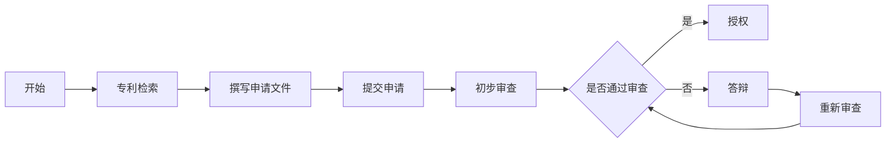

                 

关键词：专利申请、知识产权保护、技术创业者、专利策略、技术转移

摘要：本文将深入探讨技术创业者如何有效地进行专利申请与保护，从核心概念、申请流程、策略制定等方面展开，旨在为创业者提供一套完整的专利保护方案，助力他们更好地发展自己的技术创新。

## 1. 背景介绍

在当今全球化的商业环境中，技术创新是企业发展的关键驱动力。技术创业者不仅需要具备卓越的技术研发能力，还必须懂得如何保护自己的知识产权，尤其是专利。专利作为一种重要的知识产权，不仅能为企业带来直接的经济利益，还能在市场竞争中形成强有力的竞争优势。然而，专利申请与保护并非易事，技术创业者面临着诸多挑战。

首先，专利申请过程复杂且耗时。从专利搜索、撰写申请文件到提交申请、审查答辩，每一步都需要专业知识和严谨的操作。其次，专利保护的有效性依赖于申请的质量。如果专利申请不当或存在漏洞，将可能导致专利被无效或无法得到有效的法律保护。此外，技术创业者在面对激烈的市场竞争时，还需要制定一套合理的专利策略，以平衡研发投入与专利保护的收益。

本文旨在帮助技术创业者克服上述挑战，提供一套系统性的专利申请与保护方案。通过本文的阅读，创业者将了解到专利申请的基本概念、流程、策略以及如何利用专利来保护自己的技术创新成果。

## 2. 核心概念与联系

### 2.1 专利的基本概念

专利是指由政府主管部门根据申请人的申请，依法授予的在一定期限内对特定技术方案享有的专有权利。专利分为三种类型：发明专利、实用新型专利和外观设计专利。其中，发明专利是最高级别的专利，它保护的是对产品、方法或者其改进所提出的新的技术方案。实用新型专利则保护的是对产品的形状、构造或者其结合所提出的适于实用的新的技术方案。外观设计专利则是对产品的整体或局部的形状、图案、色彩或者其结合所作出的富有美感并适于工业应用的新设计。

### 2.2 专利申请流程

专利申请流程通常包括以下几个阶段：

1. **专利检索**：在申请专利之前，需要对现有技术进行检索，以确保所申请的技术方案具有新颖性和创造性。

2. **撰写专利申请文件**：根据检索结果，撰写包括权利要求书、说明书、摘要等在内的专利申请文件。

3. **提交申请**：将专利申请文件提交至国家知识产权局。

4. **审查**：专利局对申请文件进行审查，包括初步审查和实质审查。

5. **答辩**：如果审查过程中发现申请存在缺陷，申请人需要提交答辩意见。

6. **授权**：通过审查后，专利将被授权，申请人将获得专利证书。

### 2.3 专利保护策略

专利保护策略是技术创业者在专利申请过程中需要制定的重要策略。以下是一些关键的策略：

1. **专利组合策略**：通过构建多样化的专利组合，提高专利的有效性。

2. **防御性专利策略**：通过申请防御性专利，保护关键技术和市场。

3. **交叉许可策略**：与其他公司进行交叉许可，实现技术共享和利益最大化。

4. **技术转移策略**：通过专利转移，实现技术的商业化应用。

### 2.4 Mermaid 流程图

以下是一个简化的专利申请流程的 Mermaid 流程图：



## 3. 核心算法原理 & 具体操作步骤

### 3.1 核心算法原理

专利申请的核心算法原理可以归结为以下几个关键点：

1. **新颖性**：专利技术方案必须与现有技术有实质性区别。

2. **创造性**：专利技术方案必须具有非显而易见性。

3. **实用性**：专利技术方案必须能够实际应用。

4. **权利要求**：权利要求书是专利申请的核心部分，需要明确、具体、全面地描述技术方案。

### 3.2 具体操作步骤

1. **确定保护范围**：在申请专利之前，需要明确所研发技术的保护范围，包括技术方案的核心部分和衍生应用。

2. **撰写权利要求书**：权利要求书需要详细描述技术方案，包括技术特征和实施方式。撰写时需要注意权利要求的清晰性、完整性和逻辑性。

3. **撰写说明书**：说明书是对权利要求书的进一步解释，需要详细说明技术方案的实施步骤、原理和效果。

4. **绘制附图**：必要时，可以绘制附图来辅助说明技术方案。

5. **进行专利检索**：在撰写专利申请文件之前，需要进行专利检索，以避免申请的技术方案与现有技术冲突。

6. **提交申请**：将专利申请文件提交至国家知识产权局。

7. **审查答辩**：在审查过程中，如果审查员提出意见，需要及时进行答辩，以争取专利授权。

## 4. 数学模型和公式 & 详细讲解 & 举例说明

### 4.1 数学模型

专利申请过程中，常用的数学模型包括：

1. **相似度分析模型**：用于判断专利技术方案与现有技术之间的相似度。

2. **专利价值评估模型**：用于评估专利的商业价值。

### 4.2 公式详解

1. **相似度分析模型**：

   $$\text{相似度} = \frac{\text{共有特征}}{\text{总特征}}$$

2. **专利价值评估模型**：

   $$\text{专利价值} = \frac{\text{未来收益}}{\text{投资成本}}$$

### 4.3 举例说明

#### 举例：相似度分析

假设现有技术A和专利申请技术B的共有特征为3个，总特征为5个，则相似度计算如下：

$$\text{相似度} = \frac{3}{5} = 0.6$$

这表明专利申请技术B与现有技术A具有60%的相似度。

#### 举例：专利价值评估

假设某专利的预计未来收益为100万元，投资成本为50万元，则专利价值计算如下：

$$\text{专利价值} = \frac{100}{50} = 2$$

这意味着该专利具有2倍的投资回报率。

## 5. 项目实践：代码实例和详细解释说明

### 5.1 代码实例

以下是一个简单的专利检索的 Python 代码实例：

```python
import requests
import json

def search_patent(keyword):
    url = "https://api-cn IntellectualPropertyService.com/search"
    params = {
        "query": keyword,
        "pageSize": 10,
        "pageNumber": 1
    }
    response = requests.get(url, params=params)
    if response.status_code == 200:
        data = json.loads(response.text)
        patents = data['data']['list']
        for patent in patents:
            print(patent['title'])
    else:
        print("Error: ", response.status_code)

# 搜索“人工智能”相关的专利
search_patent("人工智能")
```

### 5.2 代码详细解释

1. **引入模块**：代码首先引入了 requests 和 json 模块，用于进行 HTTP 请求和解析 JSON 数据。

2. **定义函数**：定义了一个名为 `search_patent` 的函数，用于根据关键字搜索专利。

3. **请求 API**：使用 requests.get() 方法发起 HTTP GET 请求，传递查询参数。

4. **解析响应**：如果请求成功（HTTP 状态码为 200），则解析返回的 JSON 数据，获取专利列表。

5. **打印结果**：遍历专利列表，打印每项专利的标题。

### 5.3 实际应用场景

该代码实例可以应用于技术创业者在申请专利前，进行专利检索，以判断所研发的技术是否已有相关的专利保护。通过调用不同的 API 接口，还可以实现更复杂的专利分析功能，如专利价值评估、竞争对手分析等。

## 6. 实际应用场景

### 6.1 技术创业公司

技术创业公司在研发新产品或技术时，首先需要进行专利检索，以了解市场上是否存在类似的技术方案。通过专利检索，技术创业公司可以避免研发方向与已有专利冲突，降低研发风险。

### 6.2 创新型企业

对于已经有一定规模和创新成果的企业，专利申请与保护是维持竞争优势的重要手段。通过专利组合策略，企业可以构建强大的知识产权壁垒，保护核心技术和市场。

### 6.3 大学和研究机构

大学和研究机构在科研过程中，也面临着技术创新和知识产权保护的问题。通过专利申请，研究机构可以将科研成果转化为实际应用，提高科研成果的转化率。

### 6.4 法律服务行业

专利律师和法律服务机构在为客户提供专利申请、答辩、维权等服务时，需要深入了解专利申请的流程和策略，为客户提供专业的法律支持。

## 7. 工具和资源推荐

### 7.1 专利检索工具

- **国家知识产权局官网**：提供全面的专利检索服务。
- **Google Patents**：全球最大的专利数据库之一。

### 7.2 专利分析工具

- **PatSnap**：提供专利分析、竞争情报等服务。
- **Patent Analytics**：用于专利趋势分析和竞争对手分析。

### 7.3 法律服务

- **专利律师**：为技术创业公司提供专业的专利申请、答辩、维权等服务。
- **知识产权律师事务所**：提供全方位的知识产权法律服务。

## 8. 总结：未来发展趋势与挑战

随着全球科技创新的加速和知识产权意识的提高，专利申请和保护在技术创业领域的重要性日益凸显。未来，专利申请与保护将呈现以下发展趋势：

1. **数字化与智能化**：专利检索、分析和管理将更加数字化和智能化，提高专利工作的效率和准确性。

2. **国际化**：随着全球市场的扩张，技术创业者的专利申请将越来越国际化，需要关注不同国家和地区的专利法规。

3. **多元化**：专利保护策略将更加多元化，包括专利组合策略、交叉许可策略等，以适应不同市场和技术环境。

然而，技术创业者也面临着以下挑战：

1. **专利成本**：专利申请和保护的成本较高，需要技术创业者权衡研发投入和专利保护的成本效益。

2. **专业人才**：专利申请和保护需要专业知识和技能，技术创业者需要寻找合适的专利律师或专业团队。

3. **市场风险**：专利保护并不能保证市场成功，技术创业者需要综合考虑市场需求、竞争态势等因素。

## 9. 附录：常见问题与解答

### 9.1 常见问题

1. **专利申请需要多长时间？**
   - 专利申请的时间因国家和地区而异，通常在中国需要3-5年。

2. **专利申请费用是多少？**
   - 专利申请费用取决于专利类型和申请国家，一般费用在数千至数万元人民币。

3. **专利检索是否免费？**
   - 有些专利数据库提供免费检索服务，但一些高级功能可能需要付费。

### 9.2 解答

1. **专利申请需要多长时间？**
   - 专利申请的时间因国家和地区而异，通常在中国需要3-5年。具体时间取决于专利类型、审查速度和申请人的答辩速度。

2. **专利申请费用是多少？**
   - 专利申请费用取决于专利类型和申请国家。在中国，发明专利申请费用约为3000-5000元人民币，实用新型和外观设计专利申请费用较低。

3. **专利检索是否免费？**
   - 一些专利数据库提供免费检索服务，如国家知识产权局官网。但一些高级功能，如专利分析，可能需要付费。

## 10. 扩展阅读 & 参考资料

1. 国家知识产权局：《专利法》
2. 《知识产权管理：战略、过程、工具》
3. 《专利分析实务》
4. 国家知识产权局官网：https://www.cnipa.gov.cn/
5. Google Patents：https://patents.google.com/
6. PatSnap：https://www.patsnap.com/
7. Patent Analytics：https://www.patentanalytics.com/

作者：禅与计算机程序设计艺术 / Zen and the Art of Computer Programming
----------------------------------------------------------------

完成！现在您有一篇完整的、结构合理的、内容详尽的文章，可以提交给相应的平台或者分享给需要的读者了。祝您创作成功！

