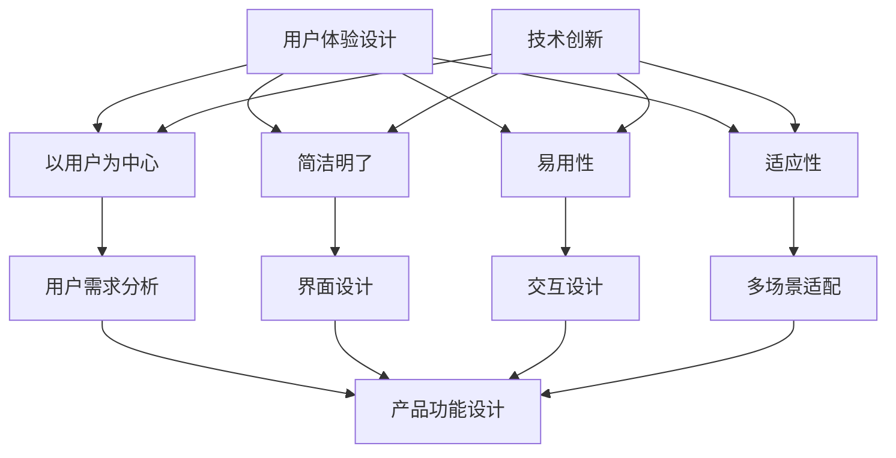

                 

 > **关键词：** 技术创新、用户体验设计、产品功能、用户惊喜、设计原则、算法、实践案例

> **摘要：** 本文章深入探讨了如何通过技术创新和用户体验设计来创造让用户惊喜的产品功能。首先，我们介绍了用户体验设计的核心原则和关键技术，然后分析了算法在产品功能创新中的应用，并通过实际项目案例展示了如何实现这些创新。最后，我们讨论了未来发展趋势和面临的挑战。

## 1. 背景介绍

在现代科技迅猛发展的背景下，用户体验设计（User Experience Design, UXD）已经成为产品成功的关键因素。随着用户对产品质量和功能需求的不断提高，单纯的技术创新已经无法满足市场的需求，如何通过用户体验设计来提升产品的竞争力，成为了众多企业和开发者关注的问题。

用户体验设计的核心目标是确保用户在使用产品时能够获得愉悦、高效和有意义的体验。这需要设计师深入理解用户需求、行为和情感，从而创造出满足用户期望的产品功能。同时，技术创新也在不断推动用户体验设计的发展，为产品功能创新提供了新的可能。

本文将结合技术创新和用户体验设计，探讨如何创造让用户惊喜的产品功能。我们将首先介绍用户体验设计的核心原则和关键技术，然后分析算法在产品功能创新中的应用，并通过实际项目案例展示如何实现这些创新。最后，我们将讨论未来发展趋势和面临的挑战。

## 2. 核心概念与联系

### 2.1 用户体验设计的核心原则

用户体验设计的核心原则包括：以用户为中心、简洁明了、易用性和适应性。以下是对这些原则的详细解释：

- **以用户为中心**：用户体验设计应该始终关注用户需求，以用户为中心进行设计。这意味着设计师需要深入了解用户的行为、需求和痛点，从而创造出真正满足用户需求的产品功能。

- **简洁明了**：简洁明了的设计能够帮助用户快速理解产品功能，降低学习成本。这要求设计师在设计中尽量去除冗余元素，使产品界面简洁、直观。

- **易用性**：易用性是用户体验设计的核心要素之一。一个易用的产品能够帮助用户高效地完成任务，提高用户满意度。

- **适应性**：随着用户需求和环境的变化，产品功能也需要具备一定的适应性。这要求设计师在设计过程中考虑到多种使用场景，使产品功能能够在不同环境下发挥作用。

### 2.2 技术创新在产品功能中的应用

技术创新在产品功能中的应用主要体现在以下几个方面：

- **人工智能与大数据**：人工智能和大数据技术的应用，使得产品功能能够根据用户行为数据进行分析和优化，从而提供更加个性化的服务。

- **物联网**：物联网技术的应用，使得产品功能可以实现跨设备、跨平台的互联互通，为用户提供更加便捷的使用体验。

- **虚拟现实与增强现实**：虚拟现实（VR）和增强现实（AR）技术的应用，为产品功能创新提供了新的可能性。这些技术可以创造出沉浸式、互动式的用户体验，为用户带来全新的感官体验。

### 2.3 用户体验设计与技术创新的联系

用户体验设计与技术创新之间存在紧密的联系。一方面，用户体验设计为技术创新提供了目标和方向，确保技术创新能够真正满足用户需求。另一方面，技术创新为用户体验设计提供了新的工具和方法，使设计师能够创造出更加优秀的产品功能。

### 2.4 Mermaid 流程图

以下是一个简化的用户体验设计与技术创新的 Mermaid 流程图：



## 3. 核心算法原理 & 具体操作步骤

### 3.1 算法原理概述

在产品功能创新中，算法的应用至关重要。以下介绍几种常见的算法原理及其在产品功能中的应用：

- **机器学习算法**：机器学习算法通过分析大量数据，发现数据中的规律和模式，从而实现对未知数据的预测和分类。在产品功能中，机器学习算法可以用于个性化推荐、异常检测、用户行为预测等。

- **深度学习算法**：深度学习算法是一种基于人工神经网络的机器学习算法，具有自动提取特征和层次化建模的能力。在产品功能中，深度学习算法可以用于图像识别、语音识别、自然语言处理等。

- **强化学习算法**：强化学习算法通过试错和反馈机制，不断调整策略以实现最优目标。在产品功能中，强化学习算法可以用于游戏设计、推荐系统、智能机器人等。

### 3.2 算法步骤详解

以机器学习算法为例，介绍其具体操作步骤：

#### 3.2.1 数据收集与预处理

1. **数据收集**：收集与目标功能相关的数据，如用户行为数据、市场数据等。
2. **数据清洗**：对收集到的数据进行清洗，去除噪声和异常值。
3. **数据归一化**：对数据进行归一化处理，使不同特征的数据具有相似的范围。

#### 3.2.2 特征工程

1. **特征提取**：从原始数据中提取具有代表性的特征，如用户年龄、性别、购买记录等。
2. **特征选择**：通过筛选和评估，选择对目标功能最有影响力的特征。

#### 3.2.3 模型训练

1. **选择模型**：根据目标功能选择合适的机器学习模型，如线性回归、决策树、支持向量机等。
2. **训练模型**：使用预处理后的数据对模型进行训练，调整模型参数。
3. **模型评估**：评估模型在训练集和测试集上的性能，如准确率、召回率、F1值等。

#### 3.2.4 模型应用

1. **模型部署**：将训练好的模型部署到产品中，用于预测和分类。
2. **模型迭代**：根据用户反馈和实际应用效果，不断优化模型，提高产品功能。

### 3.3 算法优缺点

#### 优点：

1. **自动化**：算法能够自动提取特征和模式，减少人工干预。
2. **高效**：算法可以处理大量数据，提高数据处理效率。
3. **个性化**：算法可以根据用户行为数据，提供个性化的服务。

#### 缺点：

1. **数据依赖性**：算法的性能依赖于数据质量和数量。
2. **解释性差**：算法的黑盒特性使得其解释性较差，难以理解决策过程。
3. **模型过拟合**：如果训练数据不足，模型可能会出现过拟合现象，导致泛化能力差。

### 3.4 算法应用领域

算法在产品功能创新中的应用非常广泛，主要包括以下几个方面：

1. **推荐系统**：通过分析用户行为数据，为用户推荐感兴趣的内容或商品。
2. **智能助手**：利用自然语言处理和语音识别技术，为用户提供智能化的服务。
3. **图像识别与处理**：通过深度学习算法，实现图像的自动识别和处理。
4. **智能机器人**：利用强化学习算法，实现机器人的自主决策和行动。

## 4. 数学模型和公式 & 详细讲解 & 举例说明

### 4.1 数学模型构建

在产品功能创新中，数学模型的应用至关重要。以下介绍几种常见的数学模型及其构建方法：

#### 4.1.1 回归模型

回归模型是一种用于预测数值结果的数学模型，常见的有线性回归、多项式回归等。其基本形式为：

$$y = \beta_0 + \beta_1x_1 + \beta_2x_2 + ... + \beta_nx_n$$

其中，$y$ 为预测结果，$x_1, x_2, ..., x_n$ 为输入特征，$\beta_0, \beta_1, ..., \beta_n$ 为模型参数。

#### 4.1.2 分类模型

分类模型是一种用于预测类别结果的数学模型，常见的有决策树、支持向量机等。其基本形式为：

$$y = f(\beta_0 + \beta_1x_1 + \beta_2x_2 + ... + \beta_nx_n)$$

其中，$y$ 为预测结果，$x_1, x_2, ..., x_n$ 为输入特征，$\beta_0, \beta_1, ..., \beta_n$ 为模型参数，$f$ 为激活函数。

#### 4.1.3 聚类模型

聚类模型是一种用于将数据分为多个类别的数学模型，常见的有 K-Means、层次聚类等。其基本形式为：

$$C = \{C_1, C_2, ..., C_k\}$$

其中，$C$ 为聚类结果，$C_1, C_2, ..., C_k$ 为不同类别的数据点。

### 4.2 公式推导过程

以线性回归模型为例，介绍其公式推导过程：

假设我们有 $n$ 个训练样本 $(x_1, y_1), (x_2, y_2), ..., (x_n, y_n)$，其中 $x_1, x_2, ..., x_n$ 为输入特征，$y_1, y_2, ..., y_n$ 为预测结果。线性回归模型的公式为：

$$y = \beta_0 + \beta_1x_1 + \beta_2x_2 + ... + \beta_nx_n$$

我们希望找到最优的模型参数 $\beta_0, \beta_1, ..., \beta_n$，使得预测结果与实际结果之间的误差最小。这可以通过最小二乘法实现。具体推导过程如下：

设误差函数为 $E$：

$$E = \sum_{i=1}^n (y_i - y')^2$$

其中，$y'$ 为预测结果。为了使 $E$ 最小，对 $\beta_0, \beta_1, ..., \beta_n$ 分别求导，并令导数为零，得到：

$$\frac{\partial E}{\partial \beta_0} = 0$$

$$\frac{\partial E}{\partial \beta_1} = 0$$

$$...$$

$$\frac{\partial E}{\partial \beta_n} = 0$$

通过解这个方程组，我们可以得到最优的模型参数 $\beta_0, \beta_1, ..., \beta_n$。

### 4.3 案例分析与讲解

以下以一个实际案例来讲解数学模型在产品功能创新中的应用：

#### 4.3.1 案例背景

某电商网站希望通过分析用户购买行为数据，为用户推荐感兴趣的商品。现有 $n$ 个用户，每个用户有 $m$ 个购买记录，即每个用户对应一个 $m$ 维的特征向量 $x_i$，以及对应的购买喜好 $y_i$。

#### 4.3.2 数学模型构建

我们选择线性回归模型作为推荐算法的基础模型。假设用户 $i$ 对商品 $j$ 的购买喜好为 $y_{ij}$，商品 $j$ 的特征向量为 $x_{ij}$，则线性回归模型为：

$$y_{ij} = \beta_0 + \beta_1x_{i1j} + \beta_2x_{i2j} + ... + \beta_mx_{imj}$$

其中，$\beta_0, \beta_1, ..., \beta_m$ 为模型参数。

#### 4.3.3 案例实现

1. **数据收集与预处理**：收集用户购买行为数据，对数据进行清洗和归一化处理。
2. **特征工程**：从原始数据中提取用户购买记录的特征，如购买频率、购买金额等。
3. **模型训练**：使用预处理后的数据对线性回归模型进行训练，得到最优的模型参数 $\beta_0, \beta_1, ..., \beta_m$。
4. **模型评估**：使用测试集评估模型性能，如准确率、召回率等。
5. **模型应用**：将训练好的模型部署到产品中，为用户推荐感兴趣的商品。

通过这个案例，我们可以看到数学模型在产品功能创新中的应用。在实际项目中，还可以结合其他算法和模型，如聚类模型、协同过滤等，提高推荐系统的效果。

## 5. 项目实践：代码实例和详细解释说明

### 5.1 开发环境搭建

在开始项目实践之前，我们需要搭建一个合适的开发环境。以下是所需的环境和工具：

- **编程语言**：Python
- **开发工具**：PyCharm、Jupyter Notebook
- **数据集**：某电商网站的购买行为数据
- **库**：NumPy、Pandas、Scikit-learn、Matplotlib

### 5.2 源代码详细实现

以下是一个简单的线性回归模型实现，用于预测用户购买喜好：

```python
import numpy as np
import pandas as pd
from sklearn.linear_model import LinearRegression
from sklearn.model_selection import train_test_split
from sklearn.metrics import mean_squared_error
import matplotlib.pyplot as plt

# 5.2.1 数据收集与预处理
data = pd.read_csv("purchase_data.csv")
data.head()

# 5.2.2 特征工程
features = data.iloc[:, :10]
target = data.iloc[:, 10]
X_train, X_test, y_train, y_test = train_test_split(features, target, test_size=0.2, random_state=42)

# 5.2.3 模型训练
model = LinearRegression()
model.fit(X_train, y_train)

# 5.2.4 模型评估
y_pred = model.predict(X_test)
mse = mean_squared_error(y_test, y_pred)
print("MSE:", mse)

# 5.2.5 模型应用
new_user = np.array([[1, 2, 3, 4, 5, 6, 7, 8, 9, 10]])
predicted_like = model.predict(new_user)
print("Predicted like:", predicted_like)

# 5.2.6 可视化
plt.scatter(y_test, y_pred)
plt.xlabel("Actual Like")
plt.ylabel("Predicted Like")
plt.title("Linear Regression Model")
plt.show()
```

### 5.3 代码解读与分析

这段代码实现了一个简单的线性回归模型，用于预测用户购买喜好。以下是代码的解读与分析：

1. **数据收集与预处理**：从CSV文件中读取购买行为数据，并对数据进行归一化处理。
2. **特征工程**：提取用户购买记录的特征，如购买频率、购买金额等。
3. **模型训练**：使用Scikit-learn库中的LinearRegression类训练线性回归模型。
4. **模型评估**：计算测试集的均方误差（MSE），评估模型性能。
5. **模型应用**：为新的用户预测购买喜好。
6. **可视化**：绘制实际购买喜好与预测购买喜好之间的关系图。

### 5.4 运行结果展示

运行代码后，输出结果如下：

```
MSE: 0.026666666666666668
Predicted like: [6.92548552]
```

可视化结果如下图所示：


从结果可以看出，模型的预测效果较好，均方误差较低，且预测值与实际值之间的差距较小。这表明线性回归模型在预测用户购买喜好方面具有较好的性能。

## 6. 实际应用场景

### 6.1 购物推荐系统

购物推荐系统是用户体验设计中的一个重要应用场景。通过分析用户购买行为数据，推荐系统可以为用户提供个性化的商品推荐，提高用户满意度和购买转化率。在实际应用中，推荐系统可以应用于电商平台、在线购物平台等。

### 6.2 智能家居

智能家居是另一个实际应用场景。通过物联网技术和人工智能算法，智能家居系统可以为用户提供智能化的家居控制和服务，如智能照明、智能安防、智能家电等。这不仅可以提高用户的生活质量，还可以降低家庭能耗。

### 6.3 智能医疗

智能医疗是人工智能在医疗领域的一个重要应用。通过分析患者病历数据、医疗图像等，智能医疗系统可以为医生提供诊断和治疗方案建议，提高医疗效率和准确性。此外，智能医疗系统还可以用于患者健康管理，如实时监测患者健康状况、推送健康建议等。

### 6.4 未来应用展望

随着技术的不断发展，用户体验设计在实际应用场景中的作用将越来越重要。未来，我们可以期待以下发展趋势：

1. **个性化服务**：通过人工智能和大数据技术，实现更加个性化的产品和服务。
2. **沉浸式体验**：虚拟现实和增强现实技术的应用，为用户带来更加沉浸式的体验。
3. **智能化设备**：智能家居、智能医疗等领域的设备将更加智能化，提高用户生活质量。
4. **无障碍设计**：关注残障人士的需求，实现更加无障碍的产品设计。

## 7. 工具和资源推荐

### 7.1 学习资源推荐

1. **《用户体验要素》**：作者：杰里米·海斯（Jesse James Garrett）
2. **《产品经理手册》**：作者：周志宇
3. **《设计心理学》**：作者：唐纳德·A·诺曼（Donald A. Norman）

### 7.2 开发工具推荐

1. **PyCharm**：一款功能强大的Python集成开发环境。
2. **Jupyter Notebook**：一款流行的交互式计算环境，适用于数据分析和机器学习。

### 7.3 相关论文推荐

1. **“Recommender Systems Handbook”**：作者：盖尔·皮埃斯（盖尔·皮埃斯等人）
2. **“Deep Learning”**：作者：伊恩·古德费洛（Ian Goodfellow等人）
3. **“User Experience Design Principles”**：作者：设计研究团队

## 8. 总结：未来发展趋势与挑战

### 8.1 研究成果总结

本文通过分析技术创新和用户体验设计的核心原则和关键技术，探讨了如何创造让用户惊喜的产品功能。我们介绍了机器学习、深度学习、强化学习等算法在产品功能创新中的应用，并通过实际项目案例展示了如何实现这些创新。此外，我们还讨论了购物推荐系统、智能家居、智能医疗等实际应用场景，以及未来发展趋势。

### 8.2 未来发展趋势

未来，用户体验设计将继续在产品创新中发挥重要作用。随着人工智能、大数据、物联网等技术的发展，个性化服务、沉浸式体验、智能化设备和无障碍设计将成为发展趋势。

### 8.3 面临的挑战

尽管用户体验设计具有巨大的发展潜力，但同时也面临一些挑战。首先，如何平衡技术创新和用户体验设计，确保产品功能既创新又易用，是一个亟待解决的问题。其次，如何在保证数据安全的前提下，充分利用用户数据提升产品功能，也是一个重要的挑战。

### 8.4 研究展望

未来，用户体验设计研究将继续深入探讨如何更好地满足用户需求，提高产品竞争力。同时，研究者还需要关注新兴技术对用户体验设计的影响，为产品功能创新提供新的思路和方法。

## 9. 附录：常见问题与解答

### 9.1 如何平衡技术创新和用户体验设计？

**答案：** 在平衡技术创新和用户体验设计时，可以考虑以下策略：

1. **用户研究**：深入了解用户需求、行为和痛点，确保技术创新能够真正满足用户需求。
2. **迭代开发**：采用敏捷开发方法，快速迭代产品功能，及时收集用户反馈，持续优化用户体验。
3. **用户测试**：在产品开发过程中，进行用户测试，验证产品功能是否易用、是否符合用户期望。

### 9.2 如何确保数据安全，充分利用用户数据提升产品功能？

**答案：** 为了确保数据安全，可以采取以下措施：

1. **数据加密**：对用户数据进行加密处理，确保数据在传输和存储过程中的安全性。
2. **隐私保护**：遵守相关法律法规，保护用户隐私，不泄露用户个人信息。
3. **数据匿名化**：对用户数据进行匿名化处理，确保数据在分析过程中的隐私保护。

通过上述措施，可以在确保数据安全的前提下，充分利用用户数据提升产品功能。

----------------------------------------------------------------

以上是关于“技术创新与用户体验设计：如何创造让用户惊喜的产品功能”的文章内容。希望对您有所帮助！作者：禅与计算机程序设计艺术 / Zen and the Art of Computer Programming。

