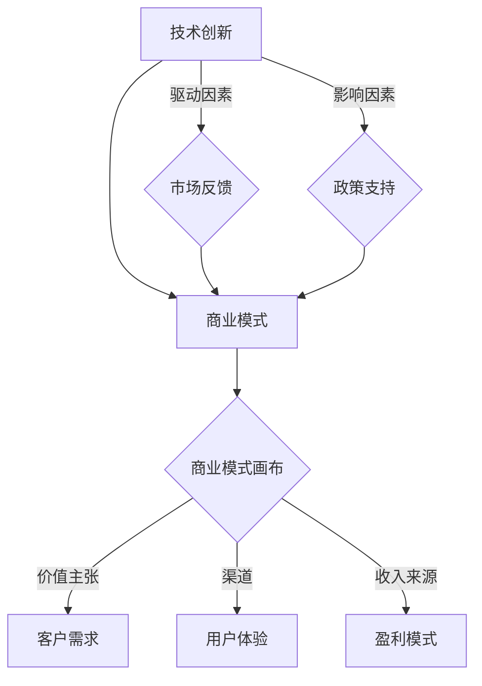

                 

### 文章标题

《技术创新的商业模式画布：构建可持续盈利模式》

> **关键词**：商业模式画布、技术创新、盈利模式、可持续性、商业策略。

> **摘要**：本文旨在探讨如何在快速变化的技术领域中构建一个可持续盈利的商业模式。通过分析技术创新的核心概念和其与商业模式的关系，结合实际案例，本文提出了一个系统化的方法论，帮助企业和创业者有效地将技术创新转化为商业成功。文章从背景介绍、核心概念与联系、算法原理、数学模型、项目实践、应用场景等多个角度，详细阐述了一个技术创新的商业模式画布的构建过程，并对其未来发展趋势与挑战进行了深入分析。

---

### 1. 背景介绍

在当今社会，技术创新已经成为推动经济增长和社会进步的重要驱动力。无论是互联网、人工智能、大数据，还是区块链等前沿技术，都不断在改变着我们的生活方式和工作模式。然而，技术创新并不总是能够直接转化为商业成功。许多具有创新潜力的技术和公司，在初期的研发阶段表现得非常出色，但随着时间的推移，却无法实现持续盈利，最终导致失败。

商业模式在企业的生存和发展中扮演着至关重要的角色。商业模式不仅决定了企业如何创造、传递和获取价值，还决定了企业的盈利模式。因此，如何将技术创新与商业模式有效结合，构建一个可持续的盈利模式，是当前商业环境中面临的一个重大挑战。

本文的目标是提供一个系统化的方法论，帮助企业和创业者更好地理解技术创新的商业模式构建，从而实现持续盈利。本文将首先介绍商业模式画布的概念和重要性，然后逐步深入探讨技术创新的核心概念和其与商业模式的联系，最后结合实际案例，展示如何将技术创新成功转化为商业盈利。

### 2. 核心概念与联系

#### 商业模式画布

商业模式画布（Business Model Canvas）是由亚历山大·奥斯特瓦尔德（Alexander Osterwalder）和伊芙·皮涅尔（Yves Pigneur）提出的，是一种直观、灵活的工具，用于描述企业的商业模式。它由九个关键组件组成，包括客户 segments（客户群体）、value propositions（价值主张）、channels（渠道）、customer relationships（客户关系）、revenue streams（收入来源）、key activities（关键活动）、key resources（关键资源）、key partnerships（关键伙伴关系）和cost structure（成本结构）。

商业模式画布的核心在于它的可视化特性，使得企业可以在一个统一的框架内清晰地描述和优化其商业模式。通过这种工具，企业可以快速迭代和测试不同的商业模式，以提高其可行性和可持续性。

#### 技术创新

技术创新（Technological Innovation）指的是通过新技术、新方法或新流程来创造或改进产品、服务或业务模式。技术创新可以源于研发、市场反馈或用户需求。技术创新的驱动因素包括科技进步、市场需求、竞争压力和政策支持等。

技术创新通常可以分为三种类型：产品创新、过程创新和商业模式创新。产品创新指的是创造全新的产品或服务；过程创新指的是改进现有的产品或服务生产过程；商业模式创新则是通过改变业务模式来创造新的盈利模式。

#### 技术创新与商业模式的关系

技术创新与商业模式之间存在密切的联系。一方面，技术创新为商业模式提供了新的可能性。例如，互联网技术的兴起为电子商务和在线支付等新的商业模式创造了条件。另一方面，商业模式的选择和实施也会影响技术创新的方向和速度。例如，一些公司可能更倾向于通过技术创新来支持其现有的商业模式，而另一些公司可能更愿意通过改变商业模式来推动技术创新。

#### Mermaid 流程图

为了更直观地展示技术创新与商业模式之间的联系，我们可以使用 Mermaid 流程图来描述这一过程。

在这个流程图中，技术创新（A）作为输入，通过商业模式画布（C）与客户需求（D）、用户体验（E）、盈利模式（F）等关键组件相连接。同时，市场反馈（G）和政策支持（H）作为外部因素，影响商业模式的选择和实施。

通过这个流程图，我们可以清晰地看到技术创新与商业模式之间的互动关系。技术创新不仅是商业模式的重要组成部分，也是推动商业模式创新的关键因素。而商业模式的选择和优化，则反过来会影响技术创新的路径和速度。

---

在下一部分中，我们将深入探讨技术创新的核心算法原理和具体操作步骤。敬请期待。

