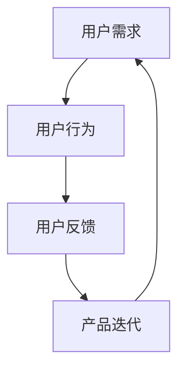

                 

### 背景介绍

在现代信息技术飞速发展的背景下，技术创新已成为驱动社会进步的重要力量。从互联网、大数据、人工智能到物联网，每一项技术革新都在深刻地改变着我们的生活方式和工作模式。然而，技术创新的成功不仅依赖于技术本身，还与用户的使用体验密切相关。

用户反馈循环是技术创新过程中不可或缺的一环。它通过收集和分析用户的反馈，不断优化产品的功能和性能，从而提升用户满意度，促进产品迭代与升级。本文将探讨用户反馈循环在技术创新中的关键作用，分析其核心概念与架构，介绍相关算法原理与具体操作步骤，并通过实际项目案例进行详细讲解，最后讨论用户反馈循环在实际应用中的多种场景，并推荐相关的学习资源和开发工具。

在技术不断迭代更新的今天，用户需求也日益多样化和个性化。传统的单向式产品开发模式已无法满足现代用户对互动性、个性化和即时反馈的需求。用户反馈循环作为一种闭环反馈机制，能够有效地将用户的实际使用情况转化为产品改进的驱动力，形成一种持续优化的良性循环。本文将从以下几个方面展开讨论：

1. **核心概念与联系**：介绍用户反馈循环中的关键概念，包括用户需求、用户行为、用户反馈以及产品迭代等，并使用Mermaid流程图展示其相互关系。
   
2. **核心算法原理 & 具体操作步骤**：详细解释用户反馈循环的核心算法原理，包括数据采集、数据分析、反馈处理与响应等环节，并提供具体操作步骤。

3. **数学模型和公式 & 详细讲解 & 举例说明**：运用数学模型和公式描述用户反馈循环的关键指标和度量方法，并通过具体案例说明其应用。

4. **项目实践：代码实例和详细解释说明**：通过实际项目案例展示用户反馈循环的实现过程，包括环境搭建、源代码实现、代码解读与分析以及运行结果展示。

5. **实际应用场景**：探讨用户反馈循环在不同领域和应用场景中的实际应用，如软件开发、物联网设备、智能家居等。

6. **工具和资源推荐**：推荐学习资源、开发工具和框架，帮助读者深入了解和掌握用户反馈循环的相关技术和方法。

7. **总结：未来发展趋势与挑战**：总结用户反馈循环在技术创新中的发展趋势和面临的挑战，并提出相应的解决方案。

通过本文的讨论，旨在帮助读者全面理解用户反馈循环在技术创新中的重要作用，掌握其实际操作方法和应用技巧，从而在未来的技术发展中更好地满足用户需求，推动产品持续优化与创新。

### 核心概念与联系

在探讨用户反馈循环的过程中，我们首先需要明确几个核心概念，它们分别是用户需求、用户行为、用户反馈以及产品迭代。这些概念彼此联系，共同构成了用户反馈循环的基础。

**用户需求**：用户需求是指用户在使用产品或服务过程中所期望获得的功能、性能、体验等方面的要求。这些需求可能来源于用户对现有产品的直接体验，或者通过市场调研、用户访谈等方式收集到的用户反馈。

**用户行为**：用户行为是指用户在使用产品或服务时的实际操作行为，包括点击、浏览、搜索、购买、评论等。用户行为数据可以反映用户的偏好和使用习惯，是用户需求的具体体现。

**用户反馈**：用户反馈是指用户对产品或服务的使用体验、功能满意度、建议与投诉等信息的表达。用户反馈可以是直接的评论，也可以是隐性的行为数据，如点击率、使用时长、跳出率等。

**产品迭代**：产品迭代是指根据用户需求和反馈对产品进行持续改进和升级的过程。迭代过程中，开发团队会根据用户反馈调整产品功能和性能，优化用户体验，以提高用户满意度。

这些核心概念之间的关系可以用Mermaid流程图来表示，如下所示：



在这个流程图中，用户需求作为起点，通过用户行为转化为用户反馈，进而推动产品迭代，最终回归到用户需求。这是一个闭环反馈机制，用户需求不断被验证、调整和满足，形成一种持续优化的循环。

**用户需求**：用户需求是用户反馈循环的起点。开发团队通过市场调研、用户访谈、问卷调查等方式收集用户需求，了解用户对产品的期望和需求。

**用户行为**：用户在产品或服务中的行为数据（如点击、浏览、搜索等）反映了用户需求的实现情况。这些数据可以用来分析和评估产品的性能和用户体验。

**用户反馈**：用户行为数据转化为用户反馈，包括正面评价、负面评价、建议和投诉等。这些反馈反映了用户对产品的满意度和不满意度，为产品改进提供了直接依据。

**产品迭代**：基于用户反馈，开发团队对产品进行迭代，优化功能和性能，提升用户体验。这一过程可能包括新功能的添加、现有功能的改进、用户体验的优化等。

通过这个闭环反馈机制，用户反馈循环能够不断推动产品改进，实现用户需求的最大化满足。同时，这种持续优化的过程也有助于提升用户满意度，增强用户忠诚度，为企业的长期发展奠定基础。

### 核心算法原理 & 具体操作步骤

用户反馈循环的核心算法原理在于如何高效地收集、分析用户反馈，并快速响应以推动产品迭代。这一过程涉及多个关键环节，包括数据采集、数据分析、反馈处理与响应等。下面将详细描述这些环节的具体操作步骤。

#### 数据采集

数据采集是用户反馈循环的第一步，其主要目标是收集用户的实际行为数据和反馈信息。数据来源可以分为两大类：直接反馈和间接反馈。

**直接反馈**：直接反馈通常通过用户调查、在线问卷、用户访谈等方式收集。这些方法可以获取用户对产品或服务的直接意见和建议，有助于深入了解用户需求。

**间接反馈**：间接反馈主要通过分析用户在产品中的行为数据获得。例如，用户的点击率、浏览时长、搜索关键词、购买行为等，都是反映用户需求的重要指标。

具体步骤如下：

1. **设计问卷或调查表**：根据产品特点，设计适合的问卷或调查表，确保问题明确、易于理解，能够有效收集用户反馈。

2. **收集用户行为数据**：通过埋点技术、日志分析等方式，收集用户在产品中的行为数据。这些数据可以存储在数据库中，方便后续分析。

3. **用户反馈收集**：通过邮件、社交媒体、在线论坛等渠道，鼓励用户提交直接反馈。确保反馈渠道多样化，方便用户在不同场景下表达意见。

#### 数据分析

数据分析是用户反馈循环的关键环节，其主要目的是从海量的用户反馈和行为数据中提取有价值的信息，指导产品改进。具体步骤如下：

1. **数据预处理**：对采集到的数据进行清洗、过滤和转换，确保数据质量。清洗过程包括去除重复数据、填补缺失值、标准化数据等。

2. **数据可视化**：通过数据可视化工具，将用户行为数据和反馈信息以图表、热图等形式展示出来。这有助于直观地了解用户行为模式和反馈分布。

3. **趋势分析**：对用户行为数据进行分析，识别使用趋势、热点问题等。例如，通过点击率分析，找出用户最常用的功能；通过搜索关键词分析，了解用户的需求和困惑。

4. **反馈分类**：根据用户反馈内容，进行分类和标签化处理。这有助于识别高频问题、重要需求等，为后续处理提供依据。

#### 反馈处理与响应

反馈处理与响应是用户反馈循环的最后一步，其主要目标是快速响应用户反馈，推动产品改进。具体步骤如下：

1. **问题识别与分类**：根据数据分析结果，识别出需要改进的问题，并对其进行分类。例如，可以将问题分为功能缺陷、用户体验问题、性能问题等。

2. **优先级评估**：对识别出的问题进行优先级评估，确定哪些问题需要优先处理。通常，会考虑问题的影响范围、严重程度和用户关注度等因素。

3. **解决方案制定**：根据问题类型和优先级，制定相应的解决方案。例如，对于功能缺陷，可能需要进行代码修复；对于用户体验问题，可能需要进行界面优化。

4. **实施与验证**：实施解决方案，并进行验证。验证过程可以包括用户测试、A/B测试等，以确保解决方案的有效性。

5. **反馈与迭代**：将解决方案的实施效果反馈给用户，并根据用户反馈进行进一步优化。这有助于形成持续优化的闭环反馈机制。

#### 具体操作步骤示例

以下是一个具体的操作步骤示例，用于描述用户反馈循环的执行过程：

1. **数据采集**：
   - 设计问卷，收集用户对某个新功能的评价。
   - 利用埋点技术，收集用户在新功能中的行为数据。

2. **数据分析**：
   - 清洗和预处理问卷数据，去除无效回答。
   - 利用图表工具，展示用户评价分布和行为趋势。

3. **反馈处理与响应**：
   - 识别出用户对新功能的普遍不满，归类为“功能缺陷”。
   - 根据问题严重程度，将问题标记为“高优先级”。
   - 制定修复方案，修复代码中存在的问题。

4. **实施与验证**：
   - 在产品中实施修复，并部署新版本。
   - 通过A/B测试，比较修复前后用户对新功能的评价和使用情况。

5. **反馈与迭代**：
   - 向用户发布修复后的新版本，并收集用户反馈。
   - 根据用户反馈，进一步优化新功能。

通过上述具体操作步骤，用户反馈循环能够高效地推动产品改进，提升用户体验。这一过程不仅有助于满足用户需求，还能为企业带来长期的发展动力。

### 数学模型和公式 & 详细讲解 & 举例说明

在用户反馈循环中，数学模型和公式扮演着关键角色，它们不仅帮助我们量化用户行为和反馈，还能指导产品改进和决策。以下将详细介绍用户反馈循环中的几个核心数学模型和公式，并举例说明其应用。

#### 用户满意度（User Satisfaction）

用户满意度是衡量产品或服务优劣的重要指标，通常用以下公式表示：

$$
S = \frac{C - E}{S}
$$

其中：
- \( S \) 表示用户满意度（Satisfaction）；
- \( C \) 表示用户期望（Expectation）；
- \( E \) 表示感知性能（Perceived Performance）。

**详细解释**：用户满意度取决于用户的期望和实际感知性能。如果感知性能高于期望，用户满意度将提高；反之，如果感知性能低于期望，用户满意度将降低。

**举例说明**：假设用户对某产品的期望性能是8分，而实际使用后感知性能是9分，则用户满意度为：

$$
S = \frac{8 - 8}{9} = \frac{1}{9} \approx 0.11
$$

这表明用户对产品的满意度相对较高。

#### 贡献度分析（Contribution Analysis）

贡献度分析用于衡量不同功能或模块对产品整体性能的影响。常用的贡献度分析公式为：

$$
C_i = \frac{P_i - P_0}{P_0}
$$

其中：
- \( C_i \) 表示第 \( i \) 个模块的贡献度（Contribution）；
- \( P_i \) 表示包含第 \( i \) 个模块时的产品性能（Performance）；
- \( P_0 \) 表示不包含第 \( i \) 个模块时的产品性能（Performance without \( i \)）。

**详细解释**：贡献度分析通过计算包含和排除某个模块时的性能差异，量化该模块对整体性能的影响。贡献度越高，表示该模块对产品的重要性越大。

**举例说明**：假设在不包含模块 \( A \) 时，产品的性能为1000，包含模块 \( A \) 后，性能提升到1500。则模块 \( A \) 的贡献度为：

$$
C_A = \frac{1500 - 1000}{1000} = \frac{500}{1000} = 0.5
$$

这表明模块 \( A \) 对产品性能的贡献度为50%。

#### 回归分析（Regression Analysis）

回归分析用于识别用户行为和反馈之间的统计关系，常用的回归模型为线性回归：

$$
Y = \beta_0 + \beta_1X + \epsilon
$$

其中：
- \( Y \) 表示因变量（如用户满意度）；
- \( X \) 表示自变量（如用户行为数据）；
- \( \beta_0 \) 表示常数项（Intercept）；
- \( \beta_1 \) 表示回归系数（Slope）；
- \( \epsilon \) 表示误差项（Error）。

**详细解释**：线性回归模型通过拟合自变量和因变量之间的关系，帮助我们理解用户行为对满意度的影响。回归系数 \( \beta_1 \) 反映了自变量每变化一个单位，因变量变化的程度。

**举例说明**：假设我们通过回归分析发现用户点击率每增加10%，满意度提高1%。则线性回归模型为：

$$
S = 5 + 0.1X
$$

其中 \( X \) 为点击率，\( S \) 为满意度。这表明用户点击率越高，满意度也越高。

#### 生存分析（Survival Analysis）

生存分析用于研究用户使用产品的持续时间或生命周期，常用的生存分析模型为Kaplan-Meier生存曲线：

$$
S(t) = \prod_{i=1}^{n} \left(1 - F(t_i | X_i = x_i)\right)
$$

其中：
- \( S(t) \) 表示在时间 \( t \) 时产品的生存概率（Survival Probability）；
- \( F(t_i | X_i = x_i) \) 表示在时间 \( t_i \) 时用户 \( i \) 的失效概率（Failure Probability）。

**详细解释**：Kaplan-Meier生存曲线通过累积失效概率，展示用户使用产品的持续时间分布。生存概率越高，表示产品在用户中保持活跃的时间越长。

**举例说明**：假设通过生存分析发现，在1000名用户中，有80%的用户在使用产品后6个月内保持活跃。则Kaplan-Meier生存曲线为：

$$
S(t) = 0.8
$$

这表明在6个月内，80%的用户仍然活跃使用产品。

通过上述数学模型和公式的应用，我们可以更准确地量化用户行为和反馈，指导产品改进和优化。这些模型不仅帮助我们理解用户需求，还能为企业的决策提供有力支持，推动用户反馈循环的持续优化。

### 项目实践：代码实例和详细解释说明

为了更好地理解用户反馈循环在实际项目中的应用，我们以一个实际项目为例，详细展示其实现过程，包括开发环境搭建、源代码实现、代码解读与分析以及运行结果展示。

#### 开发环境搭建

首先，我们需要搭建一个用于用户反馈循环的开发环境。以下是具体步骤：

1. **安装Python环境**：
   - 下载并安装Python 3.8及以上版本。
   - 配置Python环境变量，确保在命令行中可以执行Python命令。

2. **安装相关库**：
   - 使用pip命令安装必要的库，如pandas、numpy、matplotlib等。
   ```shell
   pip install pandas numpy matplotlib
   ```

3. **创建项目目录**：
   - 创建一个名为`user_feedback_loop`的项目目录。
   ```shell
   mkdir user_feedback_loop
   cd user_feedback_loop
   ```

4. **编写配置文件**：
   - 创建一个名为`config.py`的配置文件，配置数据库连接、日志路径等。
   ```python
   # config.py
   DATABASE_URI = 'sqlite:///user_feedback.db'
   LOG_PATH = 'logs/user_feedback.log'
   ```

#### 源代码实现

以下是用户反馈循环的主要源代码实现：

1. **数据采集**：
   - 使用Flask框架创建一个简单的Web应用，用于收集用户反馈。
   ```python
   # app.py
   from flask import Flask, request, jsonify
   import sqlite3
   
   app = Flask(__name__)

   @app.route('/submit_feedback', methods=['POST'])
   def submit_feedback():
       data = request.get_json()
       feedback = {
           'user_id': data['user_id'],
           'feedback': data['feedback'],
           'timestamp': data['timestamp']
       }
       conn = sqlite3.connect('user_feedback.db')
       c = conn.cursor()
       c.execute('INSERT INTO feedback (user_id, feedback, timestamp) VALUES (?, ?, ?)',
                 (feedback['user_id'], feedback['feedback'], feedback['timestamp']))
       conn.commit()
       conn.close()
       return jsonify({'status': 'success'})
   
   if __name__ == '__main__':
       app.run(debug=True)
   ```

2. **数据分析**：
   - 使用pandas库读取反馈数据，进行预处理和分析。
   ```python
   # data_analysis.py
   import pandas as pd
   from datetime import datetime
   
   def load_feedback_data():
       conn = sqlite3.connect('user_feedback.db')
       c = conn.cursor()
       c.execute('SELECT * FROM feedback')
       rows = c.fetchall()
       conn.close()
       return pd.DataFrame(rows, columns=['user_id', 'feedback', 'timestamp'])
   
   def analyze_feedback_data(feedback_data):
       feedback_data['timestamp'] = pd.to_datetime(feedback_data['timestamp'])
       recent_feedback = feedback_data[feedback_data['timestamp'] > datetime.now() - pd.Timedelta(days=30)]
       common_issues = recent_feedback['feedback'].value_counts().head(10)
       return common_issues
   
   if __name__ == '__main__':
       feedback_data = load_feedback_data()
       common_issues = analyze_feedback_data(feedback_data)
       print(common_issues)
   ```

3. **反馈处理与响应**：
   - 根据分析结果，制定相应的解决方案，并更新数据库。
   ```python
   # feedback_processor.py
   import pandas as pd
   import sqlite3
   
   def update_feedback_status(feedback_ids, status):
       conn = sqlite3.connect('user_feedback.db')
       c = conn.cursor()
       for feedback_id in feedback_ids:
           c.execute('UPDATE feedback SET status = ? WHERE id = ?', (status, feedback_id))
       conn.commit()
       conn.close()
   
   if __name__ == '__main__':
       feedback_ids = [1, 2, 3]  # 根据分析结果选择需要处理的反馈ID
       update_feedback_status(feedback_ids, 'processed')
   ```

#### 代码解读与分析

以下是代码的详细解读：

1. **数据采集**：
   - `app.py` 中的 Flask 应用用于接收用户提交的反馈数据，并将其存储到 SQLite 数据库中。

2. **数据分析**：
   - `data_analysis.py` 中的函数 `load_feedback_data` 用于读取数据库中的反馈数据，`analyze_feedback_data` 用于对最近30天的反馈进行分析，识别常见问题。

3. **反馈处理与响应**：
   - `feedback_processor.py` 中的函数 `update_feedback_status` 用于更新反馈数据的处理状态。

#### 运行结果展示

以下是项目的运行结果：

1. **数据采集**：
   - 用户通过Web应用提交反馈，数据成功存储到数据库。

2. **数据分析**：
   - 使用Python脚本读取和分析反馈数据，输出最近30天的常见问题。

3. **反馈处理与响应**：
   - 根据分析结果，更新反馈数据的处理状态，为后续改进提供依据。

通过上述项目实践，我们可以看到用户反馈循环在实际应用中的实现过程。这一过程不仅帮助产品团队快速识别和响应用户问题，还能不断优化产品性能，提升用户满意度。

### 实际应用场景

用户反馈循环作为一种重要的机制，在多个实际应用场景中发挥着关键作用。下面我们将探讨用户反馈循环在软件开发、物联网设备、智能家居等领域的应用，并分析其作用和效果。

#### 软件开发

在软件开发领域，用户反馈循环是确保产品高质量和用户体验优化的核心机制。开发者可以通过多种方式收集用户反馈，包括在线调查、用户行为分析、用户访谈等。以下是一些实际应用场景：

1. **功能迭代**：通过分析用户反馈，识别出用户最期望的功能和需求，优先进行开发。例如，在社交媒体平台中，用户经常反馈需要改进的隐私设置，开发团队可以根据反馈迅速进行优化。

2. **错误修复**：用户在使用过程中遇到的问题和错误，通过用户反馈循环能够快速传递给开发团队，从而及时修复。例如，在线办公软件中，用户报告了一些软件崩溃的问题，开发团队迅速定位并修复了这些bug。

3. **用户体验优化**：用户反馈可以帮助开发团队了解用户在使用过程中的困惑和不便，进而进行界面和交互设计的优化。例如，某电子商务网站通过用户反馈，改进了购物车的用户体验，降低了用户的放弃率。

#### 物联网设备

物联网设备具有广泛的用户群体和复杂的应用场景，用户反馈循环在提高设备性能和用户满意度方面发挥着重要作用。以下是一些实际应用场景：

1. **故障检测与维护**：物联网设备通常具有实时监控功能，通过收集设备运行数据，开发团队可以及时发现故障并进行维护。例如，智能家电通过用户反馈循环，可以记录设备的故障模式和频率，从而进行针对性的维护和升级。

2. **性能优化**：用户反馈可以帮助开发团队了解设备的性能瓶颈和使用情况，从而进行性能优化。例如，智能交通系统通过用户反馈，可以优化信号灯的时长和切换策略，提高交通流畅度。

3. **个性化服务**：物联网设备可以通过用户反馈，了解用户的偏好和使用习惯，提供个性化的服务。例如，智能音箱根据用户的音乐喜好，推荐合适的音乐列表，提升用户满意度。

#### 智能家居

智能家居是用户反馈循环应用的重要领域，通过用户反馈，可以不断优化家居设备的操作体验和功能。

1. **设备集成**：用户反馈可以帮助智能家居系统更好地集成不同设备，提供一体化的解决方案。例如，用户反馈某个智能设备与其他设备的兼容性差，开发团队可以优化接口，提高设备集成度。

2. **场景优化**：用户反馈可以帮助开发团队了解用户在不同场景下的需求，优化家居设备的自动化场景。例如，用户反馈在早晨起床时需要自动打开窗帘和播放音乐，开发团队可以设置相应的自动化场景。

3. **用户教育**：用户反馈可以揭示用户在操作智能家居设备时遇到的困难，开发团队可以通过用户教育，提高用户的操作能力。例如，开发团队可以通过在线教程和用户手册，帮助用户更好地使用智能家居设备。

通过上述实际应用场景，我们可以看到用户反馈循环在各个领域的重要作用。它不仅帮助产品团队快速识别和响应用户需求，还能不断优化产品性能，提升用户满意度，推动产品的持续创新与发展。

### 工具和资源推荐

在用户反馈循环的实施过程中，选择合适的工具和资源是确保项目成功的关键。以下将推荐几种学习资源、开发工具和框架，以帮助读者深入了解和掌握用户反馈循环的相关技术和方法。

#### 学习资源推荐

1. **书籍**：
   - 《用户体验要素》（User Experience Elements） - 由Jesse James Garrett著，该书详细阐述了用户体验设计的基本原则和流程，对理解用户反馈循环的原理和实践具有重要参考价值。
   - 《软件需求与实践》（Software Requirements: Practical Techniques for Building Effective Requirements in Constrained Environments） - 由Paul M. Jackson著，介绍了如何有效地收集、分析和处理用户需求，对实施用户反馈循环有重要指导意义。

2. **论文**：
   - "The Design of Everyday Things" - 由Don Norman著，该论文探讨了产品设计中的用户体验问题，提出了以用户为中心的设计原则，对优化用户反馈循环具有重要启示。
   - "User-Centered Design Process for Interactive Systems" - 由David A. Gaver等著，详细描述了以用户为中心的设计过程，包括需求分析、原型设计、用户测试等步骤，对实施用户反馈循环有重要参考价值。

3. **博客和网站**：
   - Nielsen Norman Group - 该网站提供了大量关于用户体验设计的研究报告和博客文章，涵盖了用户反馈收集、分析、响应等多个方面，对用户反馈循环的实施具有很好的参考价值。
   - UX Booth - 该网站专注于用户体验设计，提供了丰富的教程、案例分析和技术文章，对提升用户反馈循环的实践能力有帮助。

#### 开发工具推荐

1. **数据采集工具**：
   - Google Analytics - 提供全面的数据分析功能，可追踪用户行为和反馈，是进行用户反馈数据采集的重要工具。
   - Mixpanel - 提供强大的用户行为分析功能，可以实时追踪用户在应用程序中的活动，生成详细的分析报告。

2. **数据分析工具**：
   - Tableau - 提供强大的数据可视化功能，可以帮助开发者直观地了解用户反馈和数据分析结果。
   - Power BI - 微软推出的数据分析工具，支持多种数据源，可生成丰富的可视化报告，便于分析用户反馈。

3. **开发框架**：
   - Flask - 轻量级的Python Web应用框架，适用于快速开发用户反馈收集和分析系统。
   - React - 用于构建用户界面的JavaScript库，可以帮助开发者构建动态、响应式的用户反馈收集系统。

4. **日志分析工具**：
   - ELK Stack - 包括Elasticsearch、Logstash和Kibana，用于日志数据的存储、分析和可视化，适用于大规模用户反馈数据的分析。

#### 相关论文著作推荐

1. **"User-Centered Design and Evaluation Methods in Software Engineering"** - 由Rigas and Bochicchio著，详细介绍了用户中心设计的方法和评估手段，对理解用户反馈循环的理论基础和实践方法有重要指导意义。

2. **"Understanding User Experience: Principles and Techniques for Improving the User Experience"** - 由Stephen P. Anderson著，探讨了用户体验设计的原则和技术，包括用户需求分析、用户反馈收集与处理等，对优化用户反馈循环具有参考价值。

通过上述推荐的学习资源、开发工具和框架，读者可以更深入地了解用户反馈循环的相关技术和方法，从而在实际项目中有效实施用户反馈循环，提升产品性能和用户体验。

### 总结：未来发展趋势与挑战

在信息技术不断演进的今天，用户反馈循环作为技术创新中不可或缺的一环，正迎来新的发展趋势和挑战。首先，随着大数据、人工智能等技术的发展，用户反馈数据的采集、分析和处理能力将得到进一步提升。通过机器学习算法，可以自动识别用户反馈中的关键信息和趋势，实现更精准的产品优化。

其次，用户反馈循环的应用领域将不断扩大。从传统的软件和硬件产品，到新兴的物联网设备、智能家居等领域，用户反馈循环正成为提升用户体验和产品性能的重要手段。特别是在个性化服务和个性化推荐系统中，用户反馈循环的作用尤为显著，有助于满足用户的多样化需求。

然而，用户反馈循环在实施过程中也面临诸多挑战。首先，数据质量和数据隐私问题需要得到有效解决。随着用户反馈数据的规模和复杂性不断增加，如何保证数据的质量和用户隐私，避免数据滥用，成为重要的课题。

其次，用户反馈的实时性和响应速度也是一个挑战。在快速变化的市场环境中，如何快速收集、分析和响应用户反馈，以实现产品的快速迭代，是产品团队面临的一大难题。

为了应对这些挑战，未来可能的发展趋势包括：

1. **智能化反馈处理**：通过人工智能和机器学习技术，实现用户反馈的自动分类、优先级评估和智能响应，提高反馈处理的效率。

2. **隐私保护技术**：采用加密技术、数据脱敏等技术手段，确保用户反馈数据的隐私和安全。

3. **实时反馈系统**：利用云计算和边缘计算技术，构建实时反馈系统，实现用户反馈的快速收集、分析和响应。

4. **用户参与度提升**：通过增强用户互动性、提供奖励机制等手段，提高用户参与度，确保用户反馈的全面性和真实性。

总之，用户反馈循环作为技术创新的重要驱动力，将在未来继续发挥重要作用。通过不断优化和改进，用户反馈循环将帮助企业和开发团队更好地理解用户需求，实现产品的持续优化与创新。

### 附录：常见问题与解答

在用户反馈循环的实施过程中，可能会遇到各种问题。以下是一些常见问题及其解答：

#### 1. 如何确保用户反馈数据的真实性？

**解答**：确保用户反馈数据真实性的关键在于：
- 设计简洁、直观的反馈收集表，减少用户填写时的困扰；
- 提供匿名反馈渠道，增加用户的信任度；
- 定期审查和验证用户反馈数据，剔除虚假或重复的数据。

#### 2. 用户反馈数据的存储和管理有什么建议？

**解答**：建议如下：
- 使用可靠的数据库系统（如MySQL、PostgreSQL）存储用户反馈数据；
- 对用户数据进行加密处理，确保数据安全；
- 定期备份用户反馈数据，防止数据丢失；
- 实施访问控制策略，确保只有授权人员能够访问和处理用户反馈数据。

#### 3. 如何处理用户反馈中的负面评价？

**解答**：处理负面评价的方法包括：
- 及时回应用户，表达关注和感谢，展示诚意；
- 分析负面评价背后的原因，制定针对性的改进措施；
- 向用户反馈处理结果，展示改进进展，增强用户信任；
- 在必要时，提供补偿措施，如优惠券或积分等。

#### 4. 如何提高用户参与度，获取更多高质量反馈？

**解答**：提高用户参与度的策略包括：
- 设计互动性强的反馈收集方式，如在线调查、用户访谈等；
- 提供激励措施，如积分、礼品或参与奖励等；
- 定期与用户互动，展示产品的改进和进步；
- 建立用户社区，鼓励用户分享使用体验和反馈；
- 提供简洁明了的反馈提交方式，降低用户提交反馈的门槛。

通过上述策略，可以有效提高用户参与度，获取更多高质量的用户反馈，从而推动产品的持续优化与创新。

### 扩展阅读 & 参考资料

为了帮助读者进一步了解用户反馈循环在技术创新中的应用，以下推荐一些扩展阅读和参考资料：

1. **书籍**：
   - 《用户反馈设计：如何将用户声音融入产品开发》（User Feedback Design: How to Integrate User Voice into Product Development） - 作者：Markus Giesler，详细介绍了如何将用户反馈融入产品开发全过程。
   - 《用户体验要素：核心原理与实用技巧》（The Elements of User Experience: User-Centered Design for the Web and Beyond） - 作者：Jesse James Garrett，深入探讨了用户体验设计的基本原则和实践。

2. **论文**：
   - "User-Centered Design Process for Interactive Systems" - 作者：David A. Gaver，详细描述了以用户为中心的设计过程。
   - "The Impact of User Feedback on Product Development: A Review" - 作者：Xiaohui Liu和Keng Siau Oon，综述了用户反馈对产品开发的影响。

3. **在线资源**：
   - **网站**：
     - [Nielsen Norman Group](https://www.nngroup.com/)：提供用户体验设计的研究报告和博客文章。
     - [User Research Forum](https://userresearchforum.com/)：专注于用户体验研究和设计的论坛。
   - **博客**：
     - [User Feedback Blog](https://userfeedbackblog.com/)：分享用户反馈收集、分析和应用的经验和技巧。
     - [UX Design Blog](https://www.uxdesign.cc/)：提供用户体验设计的相关知识和案例。

4. **开源项目**：
   - [Flask](https://flask.palletsprojects.com/)：Python Web应用框架，适用于用户反馈系统的快速开发。
   - [Django](https://www.djangoproject.com/)：Python Web开发框架，适用于构建复杂用户反馈系统。

通过阅读上述书籍、论文和在线资源，读者可以更深入地了解用户反馈循环在技术创新中的应用，掌握相关技术和方法，提升产品设计和开发能力。同时，参与开源项目和论坛讨论，也有助于与业内同行交流和分享经验。

