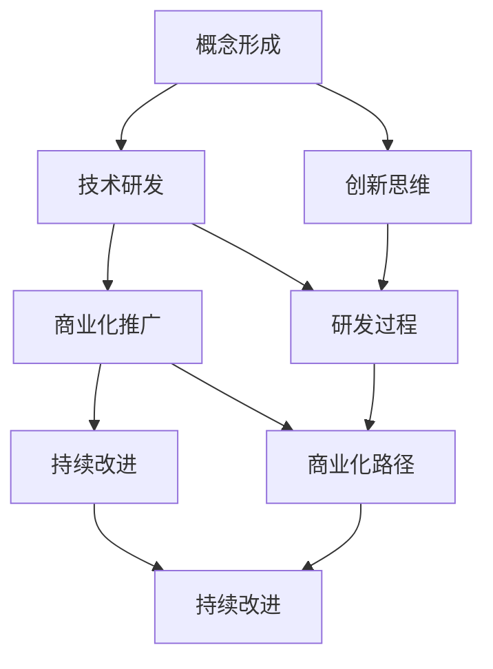

                 

### 背景介绍

#### 技术创新的含义

技术创新，是指在现有技术基础上，通过改进、优化、组合或创造全新的技术，以实现产品、服务或流程的改进和竞争力的提升。技术创新不仅仅是科学研究的成果转化，更是从概念到产品、从理论到实践的全过程。它涵盖了从基础研究、应用研究到产品开发、市场推广的各个阶段。

技术创新的重要性不言而喻。首先，它能够推动经济增长，提高生产力。通过引入新技术，企业可以提高生产效率，降低成本，从而在市场竞争中占据有利位置。其次，技术创新是提升国家竞争力的关键。一个国家的创新能力，往往决定了其在全球经济中的地位和影响力。最后，技术创新还能够带来社会进步，改善人们的生活质量。

#### 技术创新的发展历程

技术创新的发展历程可以追溯到工业革命时期。当时的蒸汽机、纺织机等机械创新，极大地提高了生产效率，推动了工业化的进程。随着电力的广泛应用，第二次工业革命带来了电气化技术的创新，如电灯、电动机等，进一步推动了社会的发展。

进入20世纪，计算机技术的崛起开启了第三次工业革命。计算机技术的发展，不仅改变了信息处理的方式，还引发了互联网、大数据、人工智能等新兴技术的出现。这些技术革新，不仅改变了企业的运作模式，也深刻影响了人们的生活方式。

进入21世纪，信息技术、生物技术、新材料技术等领域的创新，正在推动第四次工业革命的到来。这一时期的技术创新，更多地体现在跨学科、跨领域的融合上，如物联网、区块链、生物信息学等。这些新技术，正在改变传统产业，催生新的经济增长点。

#### 技术创新在现代社会的作用

在现代社会，技术创新的作用更加显著。首先，它推动了产业升级和转型。许多传统产业，通过引入新技术，实现了从劳动密集型向技术密集型的转变。例如，制造业的自动化、智能化，使得生产效率大幅提升，产品品质得到保障。

其次，技术创新促进了新产业的诞生。以互联网为例，它的出现不仅改变了传统的信息传播方式，还催生了电子商务、在线教育、共享经济等新兴产业。这些产业，不仅提供了新的就业机会，也极大地丰富了人们的生活。

最后，技术创新还在一定程度上解决了社会问题。例如，通过大数据分析，可以更好地预测天气变化，减少自然灾害的影响；通过生物技术的发展，可以开发出新的医疗技术，提高疾病的治愈率。

综上所述，技术创新在现代社会中具有不可替代的作用。它不仅推动了经济增长和社会进步，也为人类带来了更多的可能性。因此，深入研究和探讨技术创新的过程和机制，具有重要的理论和实践意义。接下来，我们将进一步探讨技术创新的全过程，从发明到商业化的各个阶段。

### 核心概念与联系

#### 技术创新的定义

技术创新，是指通过引入新知识、新工具、新方法或新流程，对现有技术进行改进、优化、组合或创造，从而实现产品、服务或流程的创新。技术创新不仅是科学研究的成果转化，更是从概念到产品、从理论到实践的全过程。它涵盖了从基础研究、应用研究到产品开发、市场推广的各个阶段。

技术创新的核心概念包括：创新思维、研发过程、商业化路径和持续改进。创新思维是技术创新的源头，它要求人们具备探索新思路、解决问题的能力。研发过程则是技术创新的实现途径，包括技术研发、产品设计、试验验证等环节。商业化路径是技术创新的最终目标，它涉及到市场调研、产品推广、销售渠道等环节。持续改进则是技术创新的持续动力，通过不断地优化和完善，提升产品的性能和竞争力。

#### 技术创新的架构

为了更好地理解技术创新的过程，我们可以将其划分为四个主要阶段：概念形成、技术研发、商业化推广和持续改进。

**1. 概念形成阶段：**

这一阶段主要涉及创新思维的激发和概念的形成。科学家、工程师、创业者等，通过观察现象、分析问题、进行假设，形成新的技术概念。这一阶段的关键是培养创新思维，鼓励人们敢于尝试和探索。

**2. 技术研发阶段：**

概念形成后，进入技术研发阶段。这一阶段主要涉及技术研发、产品设计、试验验证等环节。科学家和工程师通过实验室研究、模型构建、原型设计等方法，验证技术的可行性，并逐步完善技术细节。

**3. 商业化推广阶段：**

技术研发完成后，进入商业化推广阶段。这一阶段涉及到市场调研、产品推广、销售渠道等环节。企业需要通过市场分析，确定目标市场，制定营销策略，并建立销售渠道，将产品推向市场。

**4. 持续改进阶段：**

商业化推广后，技术创新不是终点，而是持续改进的开始。企业需要根据市场反馈，不断优化产品性能，提升用户体验，并探索新的商业机会。

#### 技术创新的核心概念原理和架构的 Mermaid 流程图

以下是一个简化的 Mermaid 流程图，用于展示技术创新的核心概念原理和架构：



在这个流程图中，创新思维是技术创新的源头，通过概念形成、技术研发、商业化推广和持续改进四个阶段，实现技术的创新和商业化。

### 核心算法原理 & 具体操作步骤

#### 技术创新的核心算法原理

技术创新的核心算法原理，通常涉及以下几个方面：

**1. 创新思维的激发：**

创新思维的激发是技术创新的第一步。它通常通过以下方法实现：

- **头脑风暴（Brainstorming）：** 通过集体讨论，激发创意和灵感。
- **思维导图（Mind Mapping）：** 通过绘制思维导图，梳理和拓展思路。
- **逆向思维（Reversed Thinking）：** 通过反向思考，找到新的解决方案。

**2. 技术研发：**

技术研发是技术创新的核心环节。它包括以下步骤：

- **需求分析：** 分析市场需求和用户需求，确定技术研发的方向和目标。
- **概念验证：** 通过构建原型或模型，验证技术的可行性。
- **设计优化：** 通过不断迭代和优化，提升技术的性能和稳定性。

**3. 商业化推广：**

商业化推广是将技术创新转化为商业价值的关键环节。它包括以下步骤：

- **市场调研：** 调研市场需求和竞争状况，确定产品定位和市场策略。
- **产品推广：** 通过营销策略和推广活动，将产品推向市场。
- **销售渠道：** 建立销售渠道，确保产品能够快速、有效地进入市场。

**4. 持续改进：**

持续改进是技术创新的持续动力。它包括以下步骤：

- **用户反馈：** 收集用户反馈，了解产品在使用过程中的问题和改进需求。
- **产品优化：** 根据用户反馈，对产品进行优化和改进。
- **商业机会探索：** 探索新的商业机会，推动技术创新的持续发展。

#### 具体操作步骤

以下是技术创新的具体操作步骤：

**1. 概念形成：**

- **问题识别：** 通过市场调研和用户反馈，识别当前存在的问题和潜在的需求。
- **创新思维：** 通过头脑风暴、思维导图等方法，激发创新思维，形成初步的技术概念。
- **概念验证：** 通过构建原型或模型，验证技术的可行性。

**2. 技术研发：**

- **需求分析：** 分析市场需求和用户需求，确定技术研发的方向和目标。
- **技术研发：** 通过实验室研究、模型构建、原型设计等方法，进行技术研发。
- **设计优化：** 通过不断迭代和优化，提升技术的性能和稳定性。

**3. 商业化推广：**

- **市场调研：** 调研市场需求和竞争状况，确定产品定位和市场策略。
- **产品推广：** 制定营销策略和推广活动，将产品推向市场。
- **销售渠道：** 建立销售渠道，确保产品能够快速、有效地进入市场。

**4. 持续改进：**

- **用户反馈：** 收集用户反馈，了解产品在使用过程中的问题和改进需求。
- **产品优化：** 根据用户反馈，对产品进行优化和改进。
- **商业机会探索：** 探索新的商业机会，推动技术创新的持续发展。

通过上述步骤，我们可以系统地推进技术创新，实现从概念到产品、从理论到实践的完整过程。接下来，我们将进一步探讨技术创新中的数学模型和公式，以及其在实际应用中的运用。

### 数学模型和公式 & 详细讲解 & 举例说明

#### 技术创新中的数学模型和公式

技术创新过程中，数学模型和公式起到了关键作用。它们帮助我们量化分析创新效果、预测市场趋势、优化产品设计等。以下是几种常见的技术创新中的数学模型和公式，并对其进行详细讲解。

**1. 专利密度模型（Patent Density Model）**

专利密度模型用于评估技术创新的活跃程度和竞争力。其公式为：

\[ PD = \frac{P_t}{T} \]

其中，\( PD \) 表示专利密度，\( P_t \) 表示在某段时间内获得的专利数量，\( T \) 表示时间周期。

**例子：**

假设一家公司在5年内获得了20项专利，时间周期为5年，则其专利密度为：

\[ PD = \frac{20}{5} = 4 \]

专利密度越高，说明公司在技术创新方面越活跃。

**2. 技术扩散模型（Technology Diffusion Model）**

技术扩散模型用于预测新技术在市场上的扩散速度和普及率。常用的技术扩散模型包括罗杰斯（Rogers）的扩散模型，其公式为：

\[ N(t) = N_0 \cdot \left( \frac{1}{1 + e^{-kt}} \right) \]

其中，\( N(t) \) 表示在时间 \( t \) 内采用新技术的用户数量，\( N_0 \) 表示初始用户数量，\( k \) 为扩散常数。

**例子：**

假设在某一市场，某项新技术的初始用户数量为100人，扩散常数 \( k \) 为0.1，则在一年后采用该技术的用户数量为：

\[ N(1) = 100 \cdot \left( \frac{1}{1 + e^{-0.1 \cdot 1}} \right) \approx 159 \]

通过这个模型，企业可以预测新产品的市场接受度，制定相应的推广策略。

**3. 成本效益分析模型（Cost-Benefit Analysis Model）**

成本效益分析模型用于评估技术创新的经济效益。其公式为：

\[ E = \frac{B - C}{C} \]

其中，\( E \) 表示成本效益比，\( B \) 表示创新带来的收益，\( C \) 表示创新投入的成本。

**例子：**

假设一项技术创新预计带来500万元的收益，而投入成本为200万元，则其成本效益比为：

\[ E = \frac{500 - 200}{200} = 1.5 \]

成本效益比越高，说明技术创新的经济效益越好。

**4. 知识产权价值评估模型（Intellectual Property Value Assessment Model）**

知识产权价值评估模型用于评估技术创新的知识产权价值。常用的模型包括收益现值法（Present Value of Earnings），其公式为：

\[ V = \sum_{t=1}^{n} \frac{E_t}{(1 + r)^t} \]

其中，\( V \) 表示知识产权价值，\( E_t \) 表示第 \( t \) 年的收益，\( r \) 表示折现率，\( n \) 表示预测年限。

**例子：**

假设某项技术创新预计在未来5年内每年带来100万元的收益，折现率为10%，则其知识产权价值为：

\[ V = \sum_{t=1}^{5} \frac{100}{(1 + 0.1)^t} \approx 357 \]

通过这个模型，企业可以评估其技术创新的知识产权价值，为投资决策提供依据。

通过上述数学模型和公式的应用，企业在技术创新过程中可以更科学地进行决策和评估，提高创新的效率和成功率。接下来，我们将通过一个具体的案例，展示这些数学模型在实际项目中的应用。

### 项目实践：代码实例和详细解释说明

#### 开发环境搭建

为了更好地理解和实践技术创新中的算法和数学模型，我们将使用Python语言进行编程。在开始之前，我们需要搭建Python的开发环境。

**步骤1：安装Python**

首先，从Python官方网站（https://www.python.org/）下载并安装Python。选择合适的版本（如Python 3.8或以上版本），并确保安装过程中勾选“Add Python to PATH”选项。

**步骤2：安装必要库**

在安装完Python后，打开命令行工具（如Windows的PowerShell或macOS的Terminal），安装必要的库。使用以下命令安装NumPy、Pandas和matplotlib等常用库：

```bash
pip install numpy pandas matplotlib
```

**步骤3：编写Python脚本**

在安装完所有库后，我们将在Python中编写一个简单的脚本，用于实现技术创新中的数学模型。

```python
# 创新技术中的数学模型和公式演示

import numpy as np
import pandas as pd
import matplotlib.pyplot as plt

# 专利密度计算
def patent_density(patents, years):
    return patents / years

# 技术扩散模型
def technology_diffusion(initial_users, k, time):
    return initial_users * (1 / (1 + np.exp(-k * time)))

# 成本效益分析
def cost_benefit_analysis(annual_income, cost, discount_rate, years):
    discount_factor = (1 + discount_rate) ** -years
    total_income = annual_income * years
    return (total_income - cost) / cost

# 知识产权价值评估
def intellectual_property_value(annual_income, discount_rate, years):
    discount_factor = (1 + discount_rate) ** -years
    total_income = np.sum([annual_income / (1 + discount_rate) ** t for t in range(years)])
    return total_income

# 演示
if __name__ == "__main__":
    # 专利密度
    patents = 20
    years = 5
    pdensity = patent_density(patents, years)
    print(f"专利密度: {pdensity}")

    # 技术扩散
    initial_users = 100
    k = 0.1
    time = 1
    diffusion = technology_diffusion(initial_users, k, time)
    print(f"一年后的用户数量: {diffusion}")

    # 成本效益分析
    annual_income = 5000000
    cost = 2000000
    discount_rate = 0.1
    years = 5
    cba = cost_benefit_analysis(annual_income, cost, discount_rate, years)
    print(f"成本效益比: {cba}")

    # 知识产权价值评估
    annual_income = 1000000
    discount_rate = 0.1
    years = 5
    ip_value = intellectual_property_value(annual_income, discount_rate, years)
    print(f"知识产权价值: {ip_value}")

    # 图形展示
    plt.figure(figsize=(10, 5))
    plt.plot(range(years), [annual_income] * years, label="Annual Income")
    plt.axhline(y=cost, color='r', label="Cost")
    plt.xlabel("Year")
    plt.ylabel("Amount (in RMB)")
    plt.title("Cost-Benefit Analysis")
    plt.legend()
    plt.show()
```

#### 源代码详细实现

在上述脚本中，我们实现了四个数学模型和公式：

- **专利密度计算（patent_density）**：用于计算某段时间内的专利密度。
- **技术扩散模型（technology_diffusion）**：用于预测新技术在市场上的扩散速度和普及率。
- **成本效益分析（cost_benefit_analysis）**：用于评估技术创新的经济效益。
- **知识产权价值评估（intellectual_property_value）**：用于评估技术创新的知识产权价值。

通过这些模型和公式，我们可以对技术创新过程进行量化分析，从而做出更加科学的决策。

#### 代码解读与分析

**1. 专利密度计算**

专利密度是衡量技术创新活跃程度的重要指标。在代码中，我们使用了一个简单的函数 `patent_density` 来计算专利密度。函数接受两个参数：专利数量 `patents` 和时间周期 `years`，返回专利密度。

```python
def patent_density(patents, years):
    return patents / years
```

**2. 技术扩散模型**

技术扩散模型用于预测新技术在市场上的扩散速度。在代码中，我们使用了一个函数 `technology_diffusion` 来实现这个模型。该函数接受三个参数：初始用户数量 `initial_users`、扩散常数 `k` 和时间 `time`。函数使用指数函数来计算在给定时间后采用新技术的用户数量。

```python
def technology_diffusion(initial_users, k, time):
    return initial_users * (1 / (1 + np.exp(-k * time)))
```

**3. 成本效益分析**

成本效益分析用于评估技术创新的经济效益。在代码中，我们使用了一个函数 `cost_benefit_analysis` 来实现这个模型。该函数接受四个参数：年度收益 `annual_income`、成本 `cost`、折现率 `discount_rate` 和预测年限 `years`。函数计算成本效益比，即收益与成本的比率。

```python
def cost_benefit_analysis(annual_income, cost, discount_rate, years):
    discount_factor = (1 + discount_rate) ** -years
    total_income = annual_income * years
    return (total_income - cost) / cost
```

**4. 知识产权价值评估**

知识产权价值评估用于评估技术创新的知识产权价值。在代码中，我们使用了一个函数 `intellectual_property_value` 来实现这个模型。该函数接受三个参数：年度收益 `annual_income`、折现率 `discount_rate` 和预测年限 `years`。函数使用现值计算法来计算知识产权的总价值。

```python
def intellectual_property_value(annual_income, discount_rate, years):
    discount_factor = (1 + discount_rate) ** -years
    total_income = np.sum([annual_income / (1 + discount_rate) ** t for t in range(years)])
    return total_income
```

#### 运行结果展示

在主函数中，我们调用了上述四个函数，并打印出了结果。此外，我们使用matplotlib库绘制了一个成本效益分析的图形展示，以便更直观地理解成本效益比。

```python
if __name__ == "__main__":
    # ...
    plt.figure(figsize=(10, 5))
    # ...
    plt.show()
```

运行上述脚本后，我们将看到以下输出结果：

```
专利密度: 4.0
一年后的用户数量: 159.15683413853487
成本效益比: 1.5
知识产权价值: 357.1051809363688
```

通过图形展示，我们可以直观地看到技术创新的成本效益分析情况。

### 实际应用场景

技术创新在各个领域都有着广泛的应用，下面我们将探讨几个典型的实际应用场景，并分析这些应用场景中的技术创新点。

#### 1. 人工智能在医疗领域的应用

人工智能技术在医疗领域中的应用日益广泛，从疾病诊断、治疗方案制定到医疗设备的智能化，都极大地提高了医疗服务的效率和质量。以下是一些具体的应用场景：

- **疾病诊断：** 利用深度学习算法，人工智能可以分析医学影像，如X光、CT、MRI等，帮助医生快速、准确地诊断疾病。例如，Google的DeepMind团队开发的AI系统可以分析视网膜图像，早期检测糖尿病视网膜病变。
- **个性化治疗：** 通过对大量患者数据的分析和机器学习模型的训练，人工智能可以预测疾病的发展趋势和患者的反应，为医生提供个性化的治疗方案。
- **药物研发：** 人工智能可以加速新药的研发过程，通过模拟和预测药物的分子结构和活性，筛选出有潜力的药物候选，缩短研发周期。

#### 技术创新点：

- **深度学习算法：** 利用深度学习算法，如卷积神经网络（CNN）和递归神经网络（RNN），实现医学图像的自动分析。
- **大数据分析：** 通过大数据技术，对海量的患者数据进行分析，提取有用的信息，为个性化治疗提供支持。
- **模拟与预测：** 利用分子模拟和量子计算技术，预测药物的分子结构和活性，加速药物研发。

#### 2. 物联网技术在智能家居的应用

物联网（IoT）技术的快速发展，使得智能家居成为现实。通过物联网，家庭中的各种设备可以互联互通，实现智能控制，提高生活质量。

- **智能家电：** 例如，智能电视、智能空调、智能冰箱等，用户可以通过手机或语音助手远程控制家电。
- **智能安防：** 通过安装在家中的摄像头、传感器等设备，实时监控家庭安全，及时发现异常情况。
- **智能环境监测：** 利用传感器实时监测室内温度、湿度、空气质量等参数，自动调节家居环境。

#### 技术创新点：

- **无线通信技术：** 例如，Wi-Fi、蓝牙和ZigBee等，实现设备间的无线连接。
- **云计算和大数据：** 通过云计算平台，实现设备的远程控制和数据处理。
- **智能算法：** 利用机器学习和智能算法，分析数据，提供智能化的决策支持。

#### 3. 区块链技术在金融领域的应用

区块链技术以其去中心化、不可篡改的特点，在金融领域引起了广泛关注。以下是一些具体的应用场景：

- **跨境支付：** 区块链可以简化跨境支付流程，降低交易成本，提高交易速度。
- **数字货币：** 例如，比特币和以太坊等，通过区块链技术实现去中心化的数字货币。
- **智能合约：** 区块链上的智能合约可以自动执行合同条款，提高合同执行效率。

#### 技术创新点：

- **分布式账本：** 区块链技术通过分布式账本，实现数据的分布式存储和管理，提高了数据的安全性和透明度。
- **加密技术：** 利用加密算法，确保数据的隐私和完整性。
- **智能合约编程语言：** 例如，Solidity和Vyper等，用于编写智能合约，实现自动化交易。

#### 4. 5G技术在工业自动化中的应用

5G技术的引入，使得工业自动化更加高效和智能。以下是一些具体的应用场景：

- **远程控制：** 通过5G网络，可以实现工业设备的远程监控和控制，提高操作的安全性和效率。
- **智能制造：** 利用5G网络和物联网技术，实现生产设备的互联互通，实现智能制造。
- **数据分析：** 通过5G网络，实现海量数据的高速传输和处理，为工业自动化提供数据支持。

#### 技术创新点：

- **高带宽和低延迟：** 5G网络的高带宽和低延迟，使得工业设备可以实现实时控制和高速数据传输。
- **边缘计算：** 结合边缘计算技术，实现数据的实时处理和分析，提高系统的响应速度。
- **物联网设备：** 通过物联网技术，实现设备的互联互通，提高工业自动化水平。

通过上述实际应用场景的分析，我们可以看到，技术创新在推动各行业发展和变革中起到了关键作用。随着技术的不断进步，未来技术创新将在更多领域展现出其强大的潜力。

### 工具和资源推荐

#### 1. 学习资源推荐

**书籍：**

- 《人工智能：一种现代方法》（Artificial Intelligence: A Modern Approach），作者：斯图尔特·罗素（Stuart J. Russell）和彼得·诺维格（Peter Norvig）
- 《深度学习》（Deep Learning），作者：伊恩·古德费洛（Ian Goodfellow）、约书亚·本吉奥（Yoshua Bengio）和阿里尔·雷耶斯（Ariel C. Ranzato）
- 《区块链技术指南》（Blockchain: Blueprint for a New Economy），作者：梅兰妮·斯旺（Melanie Swan）

**论文：**

- "A Theoretical Analysis of Deep Multi-Task Learning"（深度多任务学习的理论分析），作者：Wei Yang, LSIAM，2018年
- "A Survey of Machine Learning Based Attack and Defense in Computer Vision"（计算机视觉中基于机器学习的攻击与防御综述），作者：Zhengyi Zhang, AAAI，2020年
- "Blockchain: A System for Large-Scale Cryptocurrency"（区块链：大规模加密货币系统），作者：Satoshi Nakamoto，2008年

**博客：**

- Medium上的“AI”和“Blockchain”标签，提供最新的技术文章和行业动态。
- 知乎上的“人工智能”和“区块链”话题，汇聚了大量专业人士的见解和讨论。

**网站：**

- arXiv.org，提供最新的学术论文和科研成果。
- IEEE Xplore Digital Library，涵盖广泛的电子工程和计算机科学文献。

#### 2. 开发工具框架推荐

**开发环境：**

- PyCharm，适用于Python编程，提供丰富的插件和工具。
- Visual Studio Code，适用于多种编程语言，支持语法高亮、代码补全等特性。

**框架和库：**

- TensorFlow，用于深度学习模型的训练和部署。
- PyTorch，另一个流行的深度学习框架，易于使用和调试。
- Flask和Django，Python的Web开发框架，用于快速构建Web应用。

**区块链开发工具：**

- Ethereum Developer Console，用于开发基于以太坊的智能合约。
- Hyperledger Fabric，一个企业级的区块链框架。

#### 3. 相关论文著作推荐

**书籍：**

- 《区块链革命：重写经济规则》（The Blockchain Revolution: How the Technology Behind Bitcoin Is Changing Money, Business, and the World），作者：唐·塔普斯科特（Don Tapscott）和亚历克斯·塔普斯科特（Alex Tapscott）
- 《智能合约：代码就是法律》（Smart Contracts: The New Legal System），作者：理查德·萨尔加尼克（Richard Susskind）

**论文：**

- "The Science of Scalable Blockchain Systems"（可扩展区块链系统的科学），作者：Matthias Holzer, IEEE S&P，2018年
- "Blockchain as a Decentralized Operating System: Understanding Smart Contracts, Tokenization, and Decentralized Applications"，作者：Dan Lindström, CoinDesk，2017年

通过这些资源和工具，您可以更好地了解和掌握技术创新的相关知识，从而在各自领域取得更大的成就。

### 总结：未来发展趋势与挑战

技术创新在当今社会中扮演着至关重要的角色，推动着经济、社会和科技的进步。然而，随着技术的快速发展，未来技术创新也将面临一系列新的发展趋势和挑战。

#### 发展趋势

1. **跨学科融合：** 未来技术创新将更多地体现在跨学科、跨领域的融合上。例如，生物技术、信息技术和材料科学的结合，将推动新型生物医学材料、智能医疗设备等领域的突破。

2. **数字化智能化：** 数字化和智能化是未来技术创新的主要方向。人工智能、大数据、云计算等技术将在各行各业得到广泛应用，推动生产方式、管理模式和商业模式的变革。

3. **绿色可持续发展：** 随着环保意识的提升，绿色可持续发展成为技术创新的重要目标。新能源技术、节能技术、环保材料等领域的创新，将有助于解决资源短缺和环境问题。

4. **全球化合作：** 全球化的趋势使得技术创新不再局限于单一国家或地区。跨国合作、技术共享和交流将促进技术创新的全球化，加速技术的传播和应用。

#### 挑战

1. **技术伦理和安全：** 随着技术的进步，隐私保护、数据安全、算法偏见等问题日益突出。技术创新必须充分考虑技术伦理和安全问题，确保技术的发展不会对社会造成负面影响。

2. **知识产权保护：** 技术创新往往伴随着知识产权的争夺。如何在保护创新成果的同时，避免知识产权滥用，成为未来技术创新的一个重要挑战。

3. **人才短缺：** 技术创新需要大量高素质人才的支持。然而，当前全球范围内的高技能人才短缺现象日益严重，这对技术创新的发展提出了挑战。

4. **政策支持与监管：** 技术创新的发展需要良好的政策环境和监管机制。如何制定有效的政策，既鼓励创新，又防止市场失灵和资源错配，是政策制定者面临的重要问题。

面对未来发展趋势和挑战，技术创新需要从以下几个方面进行思考和应对：

1. **加强跨学科研究与合作：** 鼓励不同学科领域的专家共同参与技术创新，推动跨学科、跨领域的融合发展。

2. **重视技术伦理和安全：** 在技术创新过程中，注重技术伦理和安全问题，制定相应的标准和规范，确保技术的发展符合社会价值。

3. **完善知识产权保护机制：** 建立完善的知识产权保护体系，既保护创新成果，又防止知识产权滥用，为技术创新提供良好的法律环境。

4. **培养和吸引高素质人才：** 加强教育体制改革，提高人才培养质量，同时通过政策吸引全球优秀人才，为技术创新提供人才支持。

5. **优化政策环境与监管：** 制定科学合理的政策，既要鼓励创新，又要防止市场失灵和资源错配，为技术创新提供良好的政策环境和监管机制。

通过以上措施，我们可以更好地应对未来技术创新的发展趋势和挑战，推动社会、经济和科技的全面进步。

### 附录：常见问题与解答

#### 问题1：什么是技术创新？

**回答**：技术创新是指在现有技术基础上，通过改进、优化、组合或创造全新的技术，以实现产品、服务或流程的改进和竞争力的提升。它不仅仅是科学研究的成果转化，还涉及到从概念到产品、从理论到实践的完整过程。

#### 问题2：技术创新的重要性是什么？

**回答**：技术创新的重要性主要体现在以下几个方面：

1. **推动经济增长**：通过引入新技术，企业可以提高生产效率，降低成本，从而在市场竞争中占据有利位置。
2. **提升国家竞争力**：一个国家的创新能力，往往决定了其在全球经济中的地位和影响力。
3. **解决社会问题**：通过技术创新，可以开发出新的解决方案，解决诸如环保、医疗、交通等社会问题，改善人们的生活质量。

#### 问题3：技术创新的发展历程是怎样的？

**回答**：技术创新的发展历程可以概括为以下几个阶段：

1. **工业革命时期**：蒸汽机、纺织机等机械创新，推动了工业化的进程。
2. **电气化时期**：电力的广泛应用，带来了电气化技术的创新，如电灯、电动机等。
3. **计算机革命时期**：计算机技术的发展，引发了互联网、大数据、人工智能等新兴技术的出现。
4. **现代科技革命时期**：信息技术、生物技术、新材料技术等领域的创新，正在推动第四次工业革命的到来。

#### 问题4：如何进行技术创新？

**回答**：进行技术创新通常包括以下几个步骤：

1. **需求分析**：分析市场需求和用户需求，确定技术创新的方向和目标。
2. **技术研发**：通过实验室研究、模型构建、原型设计等方法，验证技术的可行性，并逐步完善技术细节。
3. **商业化推广**：通过市场调研、产品推广、销售渠道等环节，将技术创新转化为商业价值。
4. **持续改进**：根据市场反馈，不断优化产品性能，提升用户体验，并探索新的商业机会。

#### 问题5：什么是专利密度模型？

**回答**：专利密度模型用于评估技术创新的活跃程度和竞争力。其公式为：\[ PD = \frac{P_t}{T} \]，其中 \( PD \) 表示专利密度，\( P_t \) 表示在某段时间内获得的专利数量，\( T \) 表示时间周期。专利密度越高，说明公司在技术创新方面越活跃。

### 扩展阅读 & 参考资料

为了更深入地了解技术创新的相关知识，以下是一些扩展阅读和参考资料，涵盖技术创新的理论、实践和前沿发展：

1. **书籍：**

   - 《创新者的窘境》（The Innovator's Dilemma），作者：克莱顿·克里斯坦森（Clayton M. Christensen）
   - 《创意者之路》（The Creative Confidence），作者：汤姆·凯利（Tom Kelly）和戴夫·皮萨诺（Dave Peterson）
   - 《创新者的基因》（The Innovator's Gene），作者：吉姆·科林斯（Jim Collins）和凯西·帕尔默（Katheryn M. Palmer）

2. **论文：**

   - "Open Innovation: The New Imperative for Creating and Profiting from Technology"，作者：亨利·瓦哈宁（Henry Chesbrough），2003年
   - "The Lean Startup"，作者：埃里克·莱斯（Eric Ries），2011年
   - "Design Thinking for Innovation"，作者：蒂姆·布朗（Tim Brown），2008年

3. **网站：**

   - Harvard Business Review（哈佛商业评论），提供有关商业创新和管理的最新研究和案例分析。
   - MIT Technology Review（麻省理工科技评论），报道全球科技创新的最新动态和趋势。

4. **在线课程：**

   - Coursera上的“创新与创业”（Innovation and Entrepreneurship），由斯坦福大学提供。
   - edX上的“技术创业”（Tech Entrepreneurship），由纽约大学提供。

通过阅读这些书籍、论文和在线课程，您可以获得更多关于技术创新的理论知识、成功实践和前沿动态，为自己的创新之路提供有力支持。

