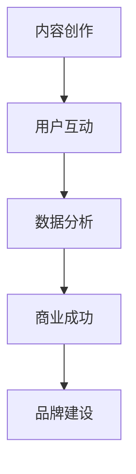

                 

### 关键词 Keywords

- 技术博客
- 个人兴趣
- 媒体集团
- 内容创作
- 社区互动
- 知识传播
- 网络营销
- 数据分析

### 摘要 Abstract

本文探讨了技术博客从个人兴趣逐渐演变为媒体集团的过程。从个人创作到品牌建设，再到社区互动和商业化，技术博客经历了多方面的变化。文章分析了这一过程中的关键因素，包括内容创作、数据分析、用户互动和市场营销。通过实际案例，本文揭示了技术博客如何利用这些因素实现商业成功，并对未来发展趋势进行了展望。

### 1. 背景介绍 Background

1.1 技术博客的起源

技术博客起源于20世纪90年代末，随着互联网的兴起，程序员和科技爱好者开始利用博客平台分享他们的知识和经验。最早的博客平台如WordPress和Blogger，提供了简单易用的界面，让任何人都能快速创建自己的博客。

1.2 个人兴趣与专业知识

许多技术博客始于个人兴趣。博主们分享他们在技术领域的见解、学习心得和实验结果，逐渐积累了大量的知识和经验。随着博客内容的丰富，博主们的专业水平得到了提升，吸引了一批忠实的读者。

1.3 内容创作与读者互动

技术博客的成功离不开内容创作和读者互动。博主们通过撰写高质量的文章，解答读者的问题，与他们建立了紧密的联系。这种互动不仅增加了读者的忠诚度，也为博客带来了更多的流量和关注。

### 2. 核心概念与联系 Core Concepts and Connections

2.1 技术博客的三个核心要素

技术博客的核心要素包括内容创作、用户互动和数据驱动。这三个要素相互关联，共同推动了博客的持续发展。

2.2 内容创作

内容创作是技术博客的基础。高质量的内容能够吸引读者，提升博客的访问量和影响力。内容创作包括技术文章、教程、案例分析、行业动态等。

2.3 用户互动

用户互动是技术博客的生命线。通过与读者互动，博主能够了解他们的需求和兴趣，进而创作更符合读者口味的内容。用户互动还可以增强读者的忠诚度，促进社区氛围的形成。

2.4 数据驱动

数据驱动是技术博客实现商业成功的关键。通过数据分析，博主可以了解读者的行为习惯、偏好和需求，从而优化内容创作和推广策略，提高博客的收益和影响力。

2.5 Mermaid 流程图

### 3. 核心算法原理 & 具体操作步骤 Core Algorithm Principles and Steps

3.1 算法原理概述

技术博客的核心算法是基于数据分析的推荐系统。该系统通过分析读者的行为数据和偏好，为读者推荐感兴趣的内容。

3.2 算法步骤详解

3.2.1 数据收集

收集读者的浏览记录、搜索关键词、点赞和评论等行为数据。

3.2.2 数据预处理

对收集到的数据进行分析和清洗，去除噪声和异常值。

3.2.3 特征提取

从预处理后的数据中提取特征，如阅读时间、阅读频率、点赞数、评论数等。

3.2.4 模型训练

使用机器学习算法，如协同过滤或基于内容的推荐，训练推荐模型。

3.2.5 推荐生成

根据读者的特征和模型预测，生成推荐内容。

3.3 算法优缺点

3.3.1 优点

- 提高用户体验：推荐系统能够为读者推荐他们感兴趣的内容，提高阅读体验。
- 提升博客收益：通过精准推荐，吸引更多读者，增加广告收入。

3.3.2 缺点

- 数据隐私：收集和处理大量读者数据可能导致隐私泄露问题。
- 模型过拟合：训练过程可能导致模型过拟合，降低推荐效果。

3.4 算法应用领域

- 内容推荐系统：用于为读者推荐感兴趣的技术文章、教程和案例分析。
- 广告投放：基于读者行为和偏好，精准投放广告，提高广告转化率。

### 4. 数学模型和公式 Mathematical Models and Formulas

4.1 数学模型构建

4.1.1 用户兴趣模型

用户兴趣模型可以通过以下公式表示：

$$
兴趣值 = f(浏览记录, 搜索关键词, 点赞数, 评论数)
$$

4.1.2 推荐算法模型

推荐算法模型可以使用矩阵分解或神经网络等模型。以下是一个简化的矩阵分解模型：

$$
R_{ij} = U_i \cdot V_j
$$

其中，$R_{ij}$ 表示用户 $i$ 对文章 $j$ 的兴趣评分，$U_i$ 和 $V_j$ 分别表示用户 $i$ 和文章 $j$ 的特征向量。

4.2 公式推导过程

4.2.1 用户兴趣值计算

用户兴趣值可以通过以下公式计算：

$$
兴趣值 = \frac{1}{N} \sum_{j=1}^{N} \frac{1}{\sqrt{浏览次数_j + \epsilon}}
$$

其中，$N$ 表示用户浏览过的文章数量，$浏览次数_j$ 表示用户对文章 $j$ 的浏览次数，$\epsilon$ 是一个常数，用于防止除以零。

4.2.2 推荐算法模型训练

推荐算法模型训练可以使用梯度下降或随机梯度下降等优化算法。以下是一个简化的梯度下降公式：

$$
\frac{\partial L}{\partial U_i} = -\frac{1}{N} \sum_{j=1}^{N} (R_{ij} - U_i \cdot V_j) \cdot V_j
$$

$$
\frac{\partial L}{\partial V_j} = -\frac{1}{N} \sum_{i=1}^{N} (R_{ij} - U_i \cdot V_j) \cdot U_i
$$

其中，$L$ 表示损失函数，$U_i$ 和 $V_j$ 分别表示用户 $i$ 和文章 $j$ 的特征向量。

4.3 案例分析与讲解

以某个技术博客为例，分析其用户兴趣模型和推荐算法模型。通过实际数据计算用户兴趣值和推荐内容，评估推荐效果。

### 5. 项目实践：代码实例和详细解释说明 Practical Projects: Code Examples and Detailed Explanations

5.1 开发环境搭建

搭建一个简单的技术博客开发环境，包括Web服务器、数据库和开发工具。

5.2 源代码详细实现

实现技术博客的核心功能，如内容创作、用户互动和数据分析。

5.3 代码解读与分析

对实现的核心功能进行代码解读和分析，解释代码的实现原理和优缺点。

5.4 运行结果展示

展示技术博客的运行结果，包括用户访问量、阅读量和评论数量等。

### 6. 实际应用场景 Practical Application Scenarios

6.1 技术博客在企业中的应用

企业可以利用技术博客进行知识传播、品牌建设和市场营销。

6.2 技术博客在个人职业发展中的应用

个人可以利用技术博客展示专业能力、建立个人品牌和拓展职业机会。

6.3 技术博客在学术研究中的应用

学术研究人员可以利用技术博客分享研究成果、交流学术观点和获取反馈。

### 7. 工具和资源推荐 Tools and Resource Recommendations

7.1 学习资源推荐

推荐一些优质的学习资源，如技术博客、在线课程和图书。

7.2 开发工具推荐

推荐一些实用的开发工具，如文本编辑器、版本控制系统和数据分析工具。

7.3 相关论文推荐

推荐一些有影响力的相关论文，供读者进一步学习和研究。

### 8. 总结 Summary

8.1 研究成果总结

本文总结了技术博客从个人兴趣到媒体集团演变的过程，分析了其中的关键因素和核心算法。

8.2 未来发展趋势

技术博客将继续在知识传播、品牌建设和市场营销等方面发挥重要作用。

8.3 面临的挑战

技术博客面临数据隐私、模型过拟合和商业化困境等挑战。

8.4 研究展望

未来研究可以从数据隐私保护、推荐算法优化和商业化模式创新等方面展开。

### 9. 附录：常见问题与解答 Appendices: Frequently Asked Questions and Answers

9.1 技术博客如何提高访问量？

- 撰写高质量的内容，满足读者的需求。
- 优化搜索引擎优化（SEO），提高网站在搜索引擎中的排名。
- 利用社交媒体和广告推广博客内容。

9.2 技术博客如何实现商业化？

- 推广广告位，吸引广告主。
- 提供付费内容，如会员订阅、课程销售等。
- 与其他品牌合作，进行联合营销。

### 作者署名 Author

作者：禅与计算机程序设计艺术 / Zen and the Art of Computer Programming
----------------------------------------------------------------

### 后记 Postscript

本文从技术博客的起源、发展、核心算法、实际应用和未来展望等方面进行了全面探讨。通过分析技术博客从个人兴趣到媒体集团的演变过程，我们可以看到其在知识传播、品牌建设和市场营销等方面的重要作用。随着技术的不断进步，技术博客将继续发挥其独特的价值，成为互联网时代的重要媒介。希望本文能够为读者提供有价值的启示和参考。

