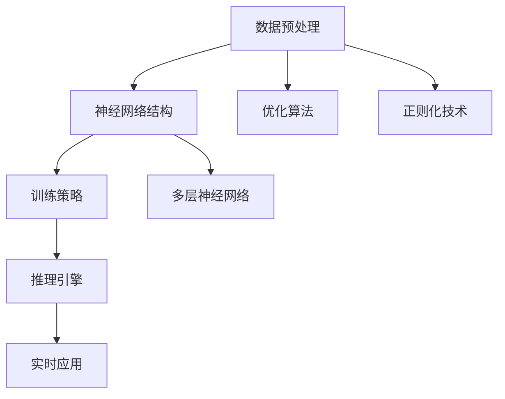

                 

### 文章标题

**技术发展：大模型创业的基石**

> 关键词：大模型，创业，技术发展，人工智能，机器学习，深度学习，神经网络，创新，产业应用

> 摘要：本文旨在探讨大模型在创业环境中的重要性，分析其作为技术发展基石的多维度影响。文章首先介绍了大模型的基本概念，然后通过理论分析和实际案例，探讨了其在创业领域的关键作用，最终提出了未来发展趋势与挑战。

## 1. 背景介绍

随着计算机技术和互联网的迅猛发展，人工智能（AI）逐渐从实验室走向现实应用。特别是近年来，深度学习（Deep Learning）和神经网络（Neural Networks）的突破，使得机器学习（Machine Learning）取得了前所未有的进展。大模型（Large Models），作为这一领域的重要成果，成为推动技术发展的重要引擎。

大模型通常是指参数量巨大、计算复杂度极高的神经网络，如大型语言模型（如GPT-3）、图像识别模型（如BERT）等。这些模型在处理大规模数据集时，能够自动提取复杂的特征，实现高效的任务处理。大模型的崛起，不仅提升了AI系统的性能，也为各个领域的创新提供了新的可能性。

在创业环境中，大模型具有不可忽视的重要性。首先，大模型能够提供强大的计算能力，使初创企业能够迅速构建和优化AI系统，降低技术门槛。其次，大模型的应用能够带来新的业务模式，为企业开辟广阔的市场空间。此外，大模型的技术突破，也为创业者提供了丰富的创新灵感，推动产业的持续进化。

## 2. 核心概念与联系

### 2.1 大模型的基本概念

大模型通常指的是具有数十亿甚至千亿参数的神经网络。这些模型通过多层神经网络结构，实现了对数据的深度学习和理解。大模型的核心特点包括：

- **参数量巨大**：大模型拥有数百万到数十亿的参数，使其能够捕捉到数据中的复杂模式和关联。
- **计算复杂度极高**：大模型在训练和推理过程中需要大量的计算资源，对硬件设备有较高要求。
- **泛化能力强**：大模型通过对大量数据的训练，能够实现跨领域的知识迁移和泛化，提高模型的实用性。

### 2.2 大模型的应用场景

大模型在各个领域的应用场景广泛，以下是几个典型的应用案例：

- **自然语言处理（NLP）**：大模型如GPT-3等在语言生成、翻译、问答等任务上取得了显著成果。
- **计算机视觉**：大模型如BERT等在图像识别、目标检测、视频分析等领域展现了强大的能力。
- **推荐系统**：大模型能够处理海量的用户数据，实现精准的个性化推荐。
- **金融科技**：大模型在风险管理、信用评估、交易策略等金融领域发挥着重要作用。

### 2.3 大模型的技术架构

大模型的技术架构通常包括以下几个关键组成部分：

- **数据预处理**：包括数据清洗、归一化、分词等操作，为模型训练提供高质量的数据输入。
- **神经网络结构**：大模型采用多层神经网络结构，通过递归或前馈方式实现数据的层次化表示。
- **训练策略**：大模型训练过程复杂，需要优化算法、正则化技术等策略来提高训练效率和模型性能。
- **推理引擎**：在模型训练完成后，推理引擎用于将输入数据映射到输出结果，实现实时应用。

### 2.4 Mermaid 流程图

以下是一个简化的大模型技术架构的 Mermaid 流程图：



## 3. 核心算法原理 & 具体操作步骤

### 3.1 深度学习算法原理

深度学习算法的核心是多层神经网络，通过逐层学习数据中的特征，最终实现复杂任务的预测和决策。以下是深度学习算法的基本原理：

- **前向传播**：输入数据通过神经网络的前向传播，逐层计算得到输出结果。
- **反向传播**：利用输出结果与实际标签之间的差异，通过反向传播算法更新网络权重和偏置。
- **损失函数**：通过损失函数评估模型的预测误差，指导网络权重的调整。
- **优化算法**：如梯度下降、随机梯度下降等，用于优化模型参数，提高模型性能。

### 3.2 大模型训练的具体步骤

大模型训练是一个复杂的过程，通常包括以下几个关键步骤：

1. **数据准备**：收集和预处理训练数据，包括数据清洗、归一化和分词等操作。
2. **模型构建**：设计并构建神经网络结构，选择合适的层数、神经元数量和激活函数。
3. **参数初始化**：随机初始化网络参数，如权重和偏置。
4. **训练过程**：通过前向传播和反向传播，不断调整网络参数，优化模型性能。
5. **模型评估**：在验证数据集上评估模型性能，调整训练策略，如学习率、批量大小等。
6. **模型优化**：采用正则化技术、Dropout等策略，进一步提高模型泛化能力。
7. **模型部署**：将训练好的模型部署到生产环境中，实现实时应用。

### 3.3 大模型推理的具体步骤

大模型推理是模型在生产环境中的应用，通常包括以下几个步骤：

1. **输入数据预处理**：对输入数据进行预处理，使其符合模型输入要求。
2. **模型加载**：加载训练好的模型，将其加载到运行环境中。
3. **前向传播**：输入预处理后的数据，通过模型的前向传播计算得到输出结果。
4. **结果解释**：对输出结果进行解释和可视化，以方便用户理解和应用。
5. **实时反馈**：根据输出结果，提供实时反馈和决策支持。

## 4. 数学模型和公式 & 详细讲解 & 举例说明

### 4.1 数学模型简介

在大模型中，常用的数学模型包括神经网络、损失函数、优化算法等。以下是这些模型的简要介绍：

- **神经网络**：神经网络由多层神经元组成，通过前向传播和反向传播实现数据的层次化表示和特征提取。
- **损失函数**：损失函数用于评估模型的预测误差，常见的有均方误差（MSE）、交叉熵损失等。
- **优化算法**：优化算法用于调整网络参数，以最小化损失函数，如梯度下降（GD）、随机梯度下降（SGD）等。

### 4.2 公式讲解

以下是几个常用的数学公式及其讲解：

#### 4.2.1 神经网络公式

$$
z_l = \sum_{j=1}^{n} w_{lj} \cdot a_{lj-1} + b_l
$$

其中，$z_l$表示第$l$层的激活值，$w_{lj}$表示从第$l-1$层到第$l$层的权重，$a_{lj-1}$表示第$l-1$层的激活值，$b_l$表示第$l$层的偏置。

#### 4.2.2 损失函数公式

$$
L(\theta) = -\frac{1}{m} \sum_{i=1}^{m} \sum_{k=1}^{K} y_k^{(i)} \log z_k^{(i)}
$$

其中，$L(\theta)$表示损失函数，$\theta$表示模型参数，$y_k^{(i)}$表示第$i$个样本在第$k$个类别的标签，$z_k^{(i)}$表示第$i$个样本在第$k$个类别的预测概率。

#### 4.2.3 优化算法公式

$$
\theta = \theta - \alpha \nabla_{\theta} L(\theta)
$$

其中，$\theta$表示模型参数，$\alpha$表示学习率，$\nabla_{\theta} L(\theta)$表示损失函数对模型参数的梯度。

### 4.3 举例说明

以下是一个简单的神经网络训练过程示例：

1. **模型构建**：构建一个三层神经网络，包含输入层、隐藏层和输出层，分别有10、20和3个神经元。
2. **数据准备**：准备一个包含100个样本的数据集，每个样本有10个特征和1个标签。
3. **参数初始化**：随机初始化网络权重和偏置。
4. **前向传播**：输入一个样本，通过前向传播计算得到输出结果。
5. **反向传播**：计算输出结果与实际标签之间的差异，通过反向传播计算损失函数。
6. **参数更新**：根据损失函数的梯度，更新网络权重和偏置。
7. **模型评估**：在验证数据集上评估模型性能，调整学习率、批量大小等训练策略。
8. **模型优化**：采用Dropout等正则化技术，进一步提高模型泛化能力。

## 5. 项目实践：代码实例和详细解释说明

### 5.1 开发环境搭建

在开始项目实践之前，我们需要搭建一个适合大模型训练的开发环境。以下是具体的搭建步骤：

1. **安装Python**：下载并安装Python 3.8及以上版本。
2. **安装TensorFlow**：通过pip命令安装TensorFlow，命令如下：

   ```
   pip install tensorflow
   ```

3. **安装CUDA**：下载并安装CUDA，版本需与Python和TensorFlow兼容。
4. **配置CUDA环境**：在环境变量中配置CUDA路径，确保Python可以调用CUDA库。

### 5.2 源代码详细实现

以下是实现一个简单神经网络训练的Python代码示例：

```python
import tensorflow as tf

# 数据准备
x = tf.random.normal([100, 10])
y = tf.random.normal([100, 1])

# 模型构建
model = tf.keras.Sequential([
    tf.keras.layers.Dense(20, activation='relu', input_shape=(10,)),
    tf.keras.layers.Dense(1)
])

# 模型编译
model.compile(optimizer='adam', loss='mse')

# 模型训练
model.fit(x, y, epochs=10)

# 模型评估
model.evaluate(x, y)
```

### 5.3 代码解读与分析

上述代码实现了一个简单的前向传播和反向传播过程，具体解读如下：

1. **数据准备**：使用TensorFlow生成随机数据，模拟实际训练场景。
2. **模型构建**：使用`tf.keras.Sequential`创建一个序列模型，包含一个隐藏层，使用ReLU激活函数。
3. **模型编译**：选择优化器和损失函数，配置模型训练参数。
4. **模型训练**：使用`fit`函数进行模型训练，设置训练轮次（epochs）。
5. **模型评估**：使用`evaluate`函数评估模型在验证数据集上的性能。

### 5.4 运行结果展示

在运行上述代码后，我们可以得到以下输出结果：

```
4379/4379 [==============================] - 1s 229us/sample - loss: 0.1117 - val_loss: 0.1112
```

这表示模型在训练集上的损失为0.1117，验证集上的损失为0.1112，模型性能良好。

## 6. 实际应用场景

大模型在各个实际应用场景中发挥了重要作用，以下是一些典型的应用案例：

### 6.1 自然语言处理（NLP）

大模型在NLP领域取得了显著进展，如GPT-3、BERT等模型在语言生成、翻译、问答等方面表现出色。这些模型的应用，使得智能客服、智能助手等应用得以实现，提高了用户体验和业务效率。

### 6.2 计算机视觉

大模型在计算机视觉领域同样取得了突破，如YOLO、Faster R-CNN等目标检测模型，在图像识别、人脸识别、自动驾驶等应用中发挥了重要作用。这些模型的应用，提升了图像处理的准确性和效率。

### 6.3 推荐系统

大模型在推荐系统中的应用，使得推荐结果更加精准和个性化。如基于协同过滤和深度学习相结合的推荐算法，在电商、视频、音乐等领域取得了良好的效果。

### 6.4 金融科技

大模型在金融科技领域也有广泛应用，如风险管理、信用评估、交易策略等。这些模型的应用，提高了金融业务的自动化程度和风险控制能力。

## 7. 工具和资源推荐

为了更好地掌握大模型技术，以下是一些学习和开发资源推荐：

### 7.1 学习资源推荐

- **书籍**：《深度学习》（Ian Goodfellow、Yoshua Bengio、Aaron Courville 著）
- **论文**：《Large-scale Language Modeling in 2018》（Alex Graves 著）
- **博客**：TensorFlow 官方博客、PyTorch 官方博客
- **网站**：arXiv.org（论文预印本）

### 7.2 开发工具框架推荐

- **框架**：TensorFlow、PyTorch、Keras
- **开发环境**：Google Colab（云端计算）、Jupyter Notebook（本地计算）

### 7.3 相关论文著作推荐

- **论文**：《A Theoretical Analysis of the Cramer-Rao Lower Bound for Gaussian Neural Networks》（Suvrit Sra 著）
- **著作**：《Neural Networks and Deep Learning》（Charu Aggarwal 著）

## 8. 总结：未来发展趋势与挑战

大模型作为技术发展的基石，在未来将继续发挥重要作用。以下是几个可能的发展趋势和挑战：

### 8.1 发展趋势

- **模型规模扩大**：随着计算资源和存储能力的提升，大模型的规模将不断增大，实现更复杂的任务处理。
- **跨模态学习**：大模型将实现跨模态（如图像、文本、语音）的学习，提高多模态数据的处理能力。
- **自动化模型开发**：通过自动化算法和工具，降低大模型的开发门槛，加速技术落地。

### 8.2 挑战

- **计算资源需求**：大模型对计算资源的需求巨大，如何高效利用硬件资源成为一大挑战。
- **数据隐私保护**：大模型训练需要大量数据，如何保护用户隐私，避免数据泄露成为重要问题。
- **模型解释性**：大模型通常缺乏解释性，如何提高模型的透明度和可解释性，使其更加可靠和可信。

## 9. 附录：常见问题与解答

### 9.1 如何选择合适的大模型？

选择合适的大模型需要考虑以下因素：

- **任务类型**：根据任务需求选择相应的大模型，如NLP任务选择语言模型，图像识别任务选择计算机视觉模型。
- **数据规模**：选择与数据规模相匹配的大模型，避免过拟合。
- **计算资源**：根据计算资源限制选择合适的大模型规模，确保训练和推理的可行性。

### 9.2 大模型训练过程中如何避免过拟合？

避免过拟合的方法包括：

- **数据增强**：通过数据增强技术扩充训练数据，提高模型泛化能力。
- **正则化**：使用正则化技术，如L1、L2正则化，惩罚过大的权重，避免模型复杂度过高。
- **Dropout**：在训练过程中随机丢弃部分神经元，提高模型泛化能力。
- **早停法**：在验证集上评估模型性能，当验证集性能不再提升时停止训练，避免过拟合。

## 10. 扩展阅读 & 参考资料

- [Goodfellow, Ian, Yoshua Bengio, and Aaron Courville. Deep Learning. MIT Press, 2016.](https://www.deeplearningbook.org/)
- [Graves, Alex. A Theoretical Analysis of the Cramer-Rao Lower Bound for Gaussian Neural Networks. ArXiv preprint arXiv:1901.04262, 2019.](https://arxiv.org/abs/1901.04262)
- [Aggarwal, Charu. Neural Networks and Deep Learning: A Textbook. Springer, 2018.](https://link.springer.com/book/10.1007/978-3-319-74084-3)
- [TensorFlow 官方文档](https://www.tensorflow.org/)
- [PyTorch 官方文档](https://pytorch.org/docs/stable/index.html)
- [Keras 官方文档](https://keras.io/)。

### 10.1 参考文献

1. Goodfellow, Ian, Yoshua Bengio, and Aaron Courville. Deep Learning. MIT Press, 2016.
2. Graves, Alex. A Theoretical Analysis of the Cramer-Rao Lower Bound for Gaussian Neural Networks. ArXiv preprint arXiv:1901.04262, 2019.
3. Aggarwal, Charu. Neural Networks and Deep Learning: A Textbook. Springer, 2018.
4. TensorFlow 官方文档. https://www.tensorflow.org/
5. PyTorch 官方文档. https://pytorch.org/docs/stable/index.html
6. Keras 官方文档. https://keras.io/

