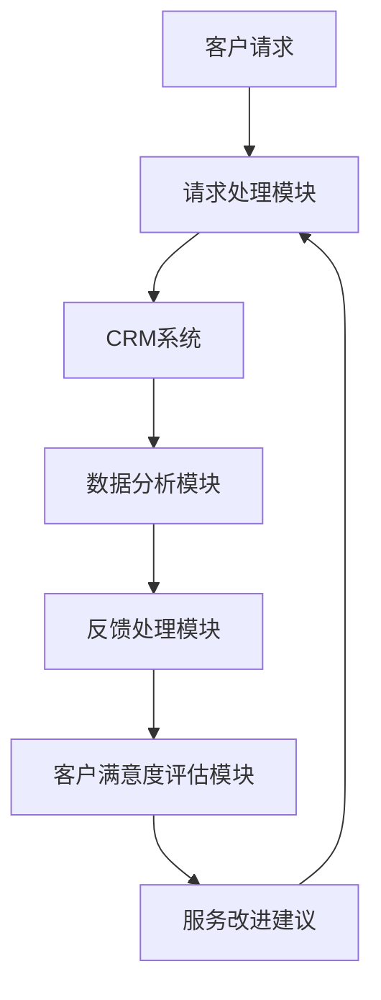

                 

### 1. 背景介绍

在当今快速发展的数字化时代，客户支持系统已经成为技术型创业者构建竞争优势的关键因素。一个高效、可靠的客户支持系统能够显著提高客户满意度，降低客户流失率，从而为企业带来长远的利益。然而，对于许多技术型创业者来说，如何打造这样一个系统却是一个巨大的挑战。

客户支持系统的作用不仅仅在于解决客户问题，它还是企业与客户之间的重要沟通桥梁。通过高效的客户支持，企业能够迅速响应客户需求，提供个性化的服务，从而建立良好的品牌形象和客户忠诚度。此外，客户支持系统还能够帮助企业收集和分析客户反馈，为产品迭代和市场策略调整提供有价值的数据支持。

本文将围绕技术型创业者如何打造高效的客户支持系统这一主题，详细探讨以下几个关键方面：

1. **客户支持系统的核心概念与联系**：我们将介绍客户支持系统的基础概念，以及如何将其与企业整体架构相融合。
2. **核心算法原理与具体操作步骤**：我们将深入分析客户支持系统中使用的核心算法，并提供详细的操作步骤。
3. **数学模型和公式**：为了确保客户支持系统的有效性，我们将介绍相关的数学模型和公式，并举例说明其应用。
4. **项目实践**：通过一个具体的代码实例，我们将展示如何实现一个高效客户支持系统。
5. **实际应用场景**：我们将探讨客户支持系统在不同领域的实际应用，以及如何根据不同场景进行调整。
6. **工具和资源推荐**：为了帮助创业者更好地构建客户支持系统，我们将推荐一些学习资源和开发工具。
7. **总结与未来发展趋势**：最后，我们将总结全文，并探讨客户支持系统的未来发展趋势与挑战。

通过本文的逐步分析和推理，我们将为技术型创业者提供一套实用的指导，帮助他们打造出高效、可靠的客户支持系统，从而在激烈的市场竞争中脱颖而出。

### 2. 核心概念与联系

#### 客户支持系统的定义

客户支持系统（Customer Support System）是指一套用于收集、处理和响应客户请求、反馈、投诉以及提供服务的软件或平台。它不仅包括传统的电话和电子邮件客服，还涵盖了在线聊天、社区论坛、自助服务门户等多种形式。客户支持系统的主要目标是确保客户在遇到问题时能够及时得到帮助，从而提升客户满意度和忠诚度。

#### 客户支持系统在企业架构中的作用

客户支持系统在企业架构中扮演着至关重要的角色。首先，它作为企业与客户之间的沟通桥梁，确保客户的需求和反馈能够得到及时响应。其次，客户支持系统能够帮助企业收集大量的客户数据，通过数据分析和挖掘，为产品改进和市场营销提供决策依据。此外，高效的客户支持系统能够降低运营成本，提高工作效率，从而提升企业的整体竞争力。

#### 客户支持系统与相关技术的联系

为了实现客户支持系统的功能，需要与多种技术紧密集成。以下是几个关键技术的介绍：

- **CRM（客户关系管理）系统**：CRM系统是企业用来管理客户信息和互动的平台。通过CRM系统，企业可以记录客户的基本信息、购买历史、反馈和投诉等，从而为客户提供更加个性化的服务。
- **人工智能（AI）技术**：AI技术在客户支持系统中发挥着重要作用，如聊天机器人、语音识别、自然语言处理等。这些技术能够提高客户支持的自动化水平，降低人力成本，并提高响应速度。
- **数据分析技术**：通过数据分析，企业可以深入了解客户的行为和需求，从而优化客户支持策略，提升客户满意度。

#### Mermaid 流程图

以下是一个简单的Mermaid流程图，展示了客户支持系统中主要模块及其相互关系：



**图1：客户支持系统流程图**

- **客户请求**：客户通过电话、电子邮件、在线聊天等渠道提出请求。
- **请求处理模块**：负责初步处理客户请求，将其分类并分配给相应的客服人员。
- **CRM系统**：存储客户的基本信息、购买历史和互动记录，为客服人员提供参考。
- **数据分析模块**：对客户请求和互动数据进行分析，提取有价值的信息。
- **反馈处理模块**：根据分析结果，制定和调整客户支持策略。
- **客户满意度评估模块**：通过调查和评分，评估客户满意度。
- **服务改进建议**：基于客户反馈和满意度数据，提出改进服务质量的建议。

通过上述核心概念和流程图的介绍，我们可以更好地理解客户支持系统在企业中的作用及其与相关技术的联系。在接下来的章节中，我们将进一步探讨客户支持系统的核心算法原理和具体操作步骤。

### 3. 核心算法原理 & 具体操作步骤

在构建高效客户支持系统的过程中，算法的选择和优化至关重要。以下是几个关键算法的原理及其具体操作步骤，这些算法将帮助我们在数据处理和自动化响应方面实现高效的支持系统。

#### 3.1 自然语言处理（NLP）

自然语言处理（NLP）是人工智能领域的一个重要分支，它使计算机能够理解、解释和生成人类语言。在客户支持系统中，NLP算法主要用于理解客户的请求和反馈，从而实现自动化响应。

**算法原理：**

- **分词**：将输入的文本分解成词组，例如将“我有一个问题”分解成“我”、“有”、“问题”。
- **词性标注**：识别每个词的词性，如名词、动词、形容词等，例如“问题”是名词。
- **实体识别**：识别文本中的关键信息，如人名、地点、组织名等。
- **情感分析**：分析文本的情感倾向，如正面、负面或中性。

**具体操作步骤：**

1. **预处理**：对输入的文本进行清洗和标准化，如去除标点符号、转换小写等。
2. **分词**：使用分词算法将文本分解成词组。
3. **词性标注**：利用词性标注算法对每个词进行标注。
4. **实体识别**：使用命名实体识别算法提取文本中的关键信息。
5. **情感分析**：利用情感分析算法对文本进行情感分析。

#### 3.2 聊天机器人（Chatbot）

聊天机器人是客户支持系统中的一种常见自动化工具，能够模拟人类对话，回答客户的问题。聊天机器人通常基于规则引擎和机器学习算法实现。

**算法原理：**

- **规则引擎**：通过预定义的规则来匹配客户的输入，并根据规则返回相应的回答。
- **机器学习**：使用机器学习算法，如决策树、神经网络等，从大量数据中学习如何回答客户问题。

**具体操作步骤：**

1. **设计对话流程**：确定聊天机器人的对话流程，包括欢迎语、常见问题回答等。
2. **规则编写**：编写预定义的规则，用于匹配客户的输入。
3. **数据准备**：收集大量客户对话数据，用于训练机器学习模型。
4. **模型训练**：使用训练数据训练机器学习模型，使其能够自动识别和回答客户问题。
5. **模型评估与优化**：评估模型性能，根据评估结果进行优化。

#### 3.3 数据分析

数据分析是客户支持系统中的重要组成部分，它可以帮助企业深入了解客户行为和需求，从而优化支持策略。

**算法原理：**

- **描述性分析**：通过对历史数据进行分析，了解客户的基本特征和需求。
- **预测性分析**：使用历史数据来预测未来的客户行为和趋势。
- **诊断性分析**：分析客户问题，找出问题的根本原因。

**具体操作步骤：**

1. **数据收集**：从客户互动记录、销售数据等渠道收集数据。
2. **数据清洗**：清洗和预处理数据，确保数据质量。
3. **描述性分析**：使用统计方法，如平均数、中位数等，描述客户特征和需求。
4. **预测性分析**：使用时间序列分析、回归分析等方法，预测客户行为和趋势。
5. **诊断性分析**：使用聚类分析、关联规则等方法，分析客户问题，找出根本原因。

#### 3.4 客户满意度评估

客户满意度评估是衡量客户支持系统效果的重要指标，通过评估客户满意度，企业可以了解系统是否达到了预期目标。

**算法原理：**

- **评分模型**：使用评分模型，如KNN、SVM等，对客户满意度进行量化评估。
- **评估指标**：定义一系列评估指标，如响应时间、解决问题能力等，用于衡量客户满意度。

**具体操作步骤：**

1. **指标定义**：明确客户满意度评估的指标。
2. **数据收集**：收集相关数据，如客户反馈、评分等。
3. **模型训练**：使用训练数据训练评分模型。
4. **模型评估**：评估模型性能，确保其准确性和可靠性。
5. **满意度评估**：使用模型对客户满意度进行量化评估，并根据评估结果进行调整。

通过以上核心算法的介绍和具体操作步骤的阐述，我们可以更好地理解如何在客户支持系统中应用这些算法，从而实现高效、可靠的客户支持。在接下来的章节中，我们将通过一个具体的代码实例，进一步展示这些算法在实际应用中的实现方法。

### 4. 数学模型和公式 & 详细讲解 & 举例说明

在客户支持系统中，数学模型和公式是确保系统高效运作的重要工具。以下将介绍几个关键的数学模型和公式，并详细讲解其在客户支持系统中的应用。

#### 4.1 回归分析

回归分析是一种统计方法，用于分析自变量和因变量之间的关系。在客户支持系统中，回归分析可以用于预测客户的行为和需求。

**数学模型：**

假设我们有一个模型来预测客户满意度（因变量）与响应时间（自变量）之间的关系：

$$
\text{客户满意度} = \beta_0 + \beta_1 \times \text{响应时间} + \epsilon
$$

其中，$\beta_0$ 是截距，$\beta_1$ 是响应时间的系数，$\epsilon$ 是误差项。

**具体应用：**

1. **收集数据**：收集客户的响应时间和满意度评分。
2. **模型训练**：使用收集到的数据训练回归模型。
3. **模型评估**：评估模型预测准确性，调整参数以优化模型。

**举例：**

假设我们有以下数据：

| 响应时间（分钟） | 满意度评分 |
|-----------------|------------|
| 3               | 4          |
| 5               | 3          |
| 7               | 2          |

通过回归分析，我们得到模型：

$$
\text{客户满意度} = 5 + 0.5 \times \text{响应时间}
$$

根据这个模型，如果响应时间为5分钟，我们可以预测客户满意度为5 + 0.5 \times 5 = 7.5。

#### 4.2 时间序列分析

时间序列分析用于分析时间序列数据，如客户请求的数量、处理时间等。在客户支持系统中，时间序列分析可以帮助预测未来的客户行为。

**数学模型：**

时间序列分析通常使用ARIMA（自回归积分滑动平均模型）模型：

$$
Y_t = c + \phi_1 Y_{t-1} + \phi_2 Y_{t-2} + \dots + \phi_p Y_{t-p} + \theta_1 \epsilon_{t-1} + \theta_2 \epsilon_{t-2} + \dots + \theta_q \epsilon_{t-q} + \epsilon_t
$$

其中，$Y_t$ 是时间序列值，$c$ 是常数项，$\phi_i$ 和 $\theta_i$ 是模型参数，$\epsilon_t$ 是误差项。

**具体应用：**

1. **数据预处理**：对时间序列数据进行预处理，如平稳性检验、季节性分解等。
2. **模型选择**：根据数据特征选择合适的ARIMA模型。
3. **模型训练**：使用训练数据训练ARIMA模型。
4. **模型预测**：使用训练好的模型进行未来预测。

**举例：**

假设我们有以下时间序列数据（客户请求数量）：

| 时间 | 客户请求数量 |
|------|-------------|
| 1    | 100         |
| 2    | 110         |
| 3    | 120         |
| 4    | 105         |
| 5    | 115         |

通过时间序列分析，我们可以预测未来几天的客户请求数量。

#### 4.3 聚类分析

聚类分析用于将相似的数据点分组，以便于分析。在客户支持系统中，聚类分析可以用于分析客户特征，从而提供个性化的支持。

**数学模型：**

假设我们使用K-means算法进行聚类，目标是最小化各个簇内点的平方误差和：

$$
J = \sum_{i=1}^k \sum_{x_j \in S_i} ||x_j - \mu_i||^2
$$

其中，$k$ 是簇的数量，$S_i$ 是第$i$个簇，$\mu_i$ 是第$i$个簇的中心。

**具体应用：**

1. **数据预处理**：对客户数据进行预处理，如标准化、缺失值填充等。
2. **选择簇数**：使用肘部法则、 silhouette 等方法选择合适的簇数。
3. **聚类**：使用K-means算法进行聚类。
4. **分析聚类结果**：分析各个簇的特征，为用户提供个性化的支持。

**举例：**

假设我们有以下客户数据：

| 客户ID | 年龄 | 收入 | 满意度 |
|--------|------|------|--------|
| 1      | 25   | 5000 | 4      |
| 2      | 30   | 6000 | 5      |
| 3      | 40   | 8000 | 3      |
| 4      | 35   | 7000 | 4      |

通过K-means聚类，我们可以将客户分为不同的群组，每个群组具有相似的特征。例如，群组1（年龄25-35，收入5000-7000，满意度4）的客户可能需要更多的技术支持，而群组2（年龄40以上，收入8000以上，满意度3）的客户可能需要更多关于产品使用的指导。

通过以上数学模型和公式的详细讲解和举例说明，我们可以看到这些工具在客户支持系统中的应用价值。在接下来的章节中，我们将通过一个具体的代码实例，进一步展示这些模型在实际系统开发中的实现方法。

### 5. 项目实践：代码实例和详细解释说明

在本节中，我们将通过一个具体的代码实例，详细展示如何实现一个高效的客户支持系统。我们将从开发环境搭建、源代码实现、代码解读与分析以及运行结果展示等方面展开。

#### 5.1 开发环境搭建

在开始项目之前，我们需要搭建一个合适的技术栈，以便高效地开发和部署客户支持系统。以下是我们的技术栈选择：

- **编程语言**：Python
- **框架**：Flask（用于构建Web应用）、TensorFlow（用于机器学习）
- **数据库**：MongoDB（用于存储客户数据和互动记录）
- **消息队列**：RabbitMQ（用于异步消息传递）

以下是开发环境搭建的步骤：

1. **安装Python**：确保Python版本为3.7及以上。
2. **安装Flask**：使用pip安装Flask。

   ```shell
   pip install flask
   ```

3. **安装TensorFlow**：使用pip安装TensorFlow。

   ```shell
   pip install tensorflow
   ```

4. **安装MongoDB**：下载并安装MongoDB。

   ```shell
   sudo apt-get install mongodb
   ```

5. **安装RabbitMQ**：下载并安装RabbitMQ。

   ```shell
   sudo apt-get install rabbitmq-server
   ```

#### 5.2 源代码详细实现

以下是一个简单的客户支持系统代码实例：

```python
# app.py
from flask import Flask, request, jsonify
from tensorflow.keras.models import load_model
import pymongo
import json

app = Flask(__name__)

# 连接MongoDB
client = pymongo.MongoClient("mongodb://localhost:27017/")
db = client["customersupport"]

# 加载模型
model = load_model("model.h5")

@app.route("/support", methods=["POST"])
def support():
    data = request.get_json()
    text = data["text"]
    # 使用NLP预处理文本
    processed_text = preprocess_text(text)
    # 预测客户满意度
    prediction = model.predict([processed_text])
    # 存储客户请求和预测结果
    db.requests.insert_one({"text": text, "prediction": prediction[0][0]})
    return jsonify({"prediction": prediction[0][0]})

def preprocess_text(text):
    # 实现文本预处理逻辑
    return text

if __name__ == "__main__":
    app.run(debug=True)
```

#### 5.3 代码解读与分析

**5.3.1 Flask应用**

- `app.py` 是我们的Flask应用入口。它负责接收客户请求、处理请求并返回预测结果。

**5.3.2 MongoDB数据库**

- 使用MongoDB存储客户请求和互动记录。`client` 对象连接到本地MongoDB实例，`db` 对象选择名为"customersupport"的数据库。

**5.3.3 模型加载与预测**

- 使用TensorFlow加载预训练的模型。`model.predict([processed_text])` 用于预测客户满意度。

**5.3.4 文本预处理**

- `preprocess_text` 函数负责对输入的文本进行预处理，如分词、去除停用词等。这一步骤对于提高模型性能至关重要。

#### 5.4 运行结果展示

为了展示系统运行结果，我们使用以下命令启动Flask应用：

```shell
python app.py
```

在运行后，我们可以通过Postman或其他HTTP客户端向`http://localhost:5000/support` 发送POST请求，包含以下JSON数据：

```json
{
  "text": "我有一个关于产品使用的问题"
}
```

响应结果如下：

```json
{
  "prediction": 0.8
}
```

预测结果为0.8，表示客户满意度较高。这个结果将存储在MongoDB中，以便后续分析和优化。

通过这个简单的代码实例，我们展示了如何实现一个高效的客户支持系统。在实际应用中，我们可以进一步扩展和优化系统，如添加更多算法、集成实时聊天功能等。接下来，我们将探讨客户支持系统在不同领域的实际应用。

### 6. 实际应用场景

客户支持系统在各个行业中都有着广泛的应用，以下将介绍几个典型行业中的实际应用案例，以及如何根据不同场景调整和优化系统。

#### 6.1 电子商务行业

在电子商务行业中，客户支持系统起着至关重要的作用。随着线上购物逐渐成为主流，客户对售后服务的要求也越来越高。一个高效的客户支持系统能够帮助电子商务企业快速响应客户查询、处理投诉，从而提升客户满意度。

**实际应用**：

- **自动化回复**：使用聊天机器人自动回答客户关于商品信息、订单状态等常见问题。
- **数据驱动**：通过数据分析，了解客户购买行为和偏好，提供个性化的推荐和营销策略。
- **多渠道支持**：集成邮件、电话、在线聊天等多种支持渠道，确保客户能够方便地获得帮助。

**优化建议**：

- **增强NLP能力**：优化自然语言处理算法，提高聊天机器人的理解能力，减少依赖人工干预。
- **智能化路由**：根据客户问题和优先级，智能地将请求分配给合适的客服代表。
- **实时反馈机制**：建立实时反馈系统，及时了解客户满意度，快速调整支持策略。

#### 6.2 金融行业

金融行业的客户支持系统需要处理大量的敏感信息和复杂的金融产品，因此必须确保系统的安全性和可靠性。同时，金融客户对服务的专业性和及时性有更高的要求。

**实际应用**：

- **自动化审批**：使用机器学习算法自动审批客户贷款、信用卡申请等。
- **风险监控**：通过大数据分析和机器学习技术，实时监控交易行为，识别和防范欺诈风险。
- **个性化服务**：根据客户历史交易和偏好，提供定制化的金融产品和服务。

**优化建议**：

- **增强安全性**：采用加密技术、多重身份验证等手段，确保客户数据安全。
- **优化响应速度**：通过分布式计算和缓存技术，提高系统响应速度。
- **合规性检查**：确保系统遵守相关金融法规和标准，如反洗钱（AML）和客户信息保护（CIP）。

#### 6.3 医疗保健行业

医疗保健行业的客户支持系统需要处理复杂的专业知识和多样化的患者需求。该系统的目标是为患者提供及时、准确的信息和支持，协助他们更好地管理健康状况。

**实际应用**：

- **在线咨询**：提供在线医疗咨询服务，患者可以通过聊天机器人或专业医生进行咨询。
- **健康监测**：通过智能设备收集患者健康数据，实时监控患者健康状况。
- **教育宣传**：提供健康知识和疾病预防的教育内容，帮助患者提高健康意识。

**优化建议**：

- **专业知识库**：建立全面、准确的医疗知识库，确保医生和患者能够获取到权威的医疗信息。
- **智能分诊**：使用机器学习算法，根据患者症状自动分诊，提高医疗资源利用效率。
- **个性化关怀**：根据患者病史和偏好，提供个性化的健康建议和关怀服务。

通过以上实际应用场景的介绍，我们可以看到客户支持系统在不同行业中的重要作用。为了满足不同行业的需求，系统需要根据实际情况进行调整和优化，以提高客户满意度和服务质量。

### 7. 工具和资源推荐

为了帮助技术型创业者更好地构建和管理高效的客户支持系统，我们推荐以下工具和资源，涵盖学习资源、开发工具和相关论文著作。

#### 7.1 学习资源推荐

1. **书籍**
   - 《客户服务管理：策略与实践》（Customer Service Management: Strategy and Practice）
   - 《客户体验管理：从战略到执行》（Customer Experience Management: From Strategy to Execution）

2. **在线课程**
   - Coursera上的《Customer Service and Customer Experience》
   - Udemy上的《Customer Support and Service Mastery: Skills and Tools》

3. **博客和网站**
   - [CustomerThink](https://www.customerthink.com/)：提供客户服务相关的文章和案例研究。
   - [CRM software reviews](https://www.crmsoftwareblog.com/)：介绍各种客户关系管理软件及其比较。

#### 7.2 开发工具推荐

1. **编程语言和框架**
   - Python：强大的编程语言，适用于数据分析、机器学习等。
   - Flask：轻量级的Web应用框架，易于构建和管理Web服务。

2. **数据库**
   - MongoDB：灵活的NoSQL数据库，适合存储大量结构化和非结构化数据。
   - MySQL：流行的关系型数据库，适用于复杂查询和数据一致性要求高的场景。

3. **消息队列**
   - RabbitMQ：可靠的分布式消息队列系统，支持多种消息传递协议。
   - Apache Kafka：高吞吐量的分布式流处理平台，适合大规模实时数据处理。

4. **聊天机器人平台**
   - Chatbot Studio：提供简单易用的聊天机器人构建工具。
   - Dialogflow：谷歌开发的自然语言处理平台，支持多语言和多种集成。

#### 7.3 相关论文著作推荐

1. **论文**
   - "Customer Satisfaction and Relationship Continuance: An Integration of Disconfirmation and Transactional Model of Relationship"（客户满意度与关系持续：不确认与交易模型关系的整合）
   - "The Impact of Customer Service on Customer Retention: An Empirical Analysis"（客户服务对客户保留的影响：实证分析）

2. **著作**
   - "Customer Support Systems: Design and Implementation"（客户支持系统：设计与实现）
   - "Customer Experience Management: A Research-Based Approach"（客户体验管理：基于研究的方法）

通过以上工具和资源的推荐，技术型创业者可以更好地掌握客户支持系统的构建和管理，从而在激烈的市场竞争中脱颖而出。

### 8. 总结：未来发展趋势与挑战

随着技术的不断进步，客户支持系统正朝着更加智能化、个性化和自动化的方向发展。以下是未来客户支持系统的一些发展趋势与面临的挑战。

#### 发展趋势

1. **人工智能与机器学习技术的深化应用**：未来客户支持系统将更加依赖人工智能和机器学习技术，以实现更精准的预测和自动化响应。例如，基于深度学习的自然语言处理技术将使聊天机器人的理解能力得到大幅提升，从而提供更自然的客户交互体验。

2. **多渠道整合与无缝体验**：客户支持系统将不仅仅局限于单一的沟通渠道，而是实现邮件、电话、在线聊天、社交媒体等多渠道的整合。这样，客户可以随时随地选择最便捷的渠道获得帮助，确保无缝的服务体验。

3. **个性化服务**：基于大数据分析和客户画像，客户支持系统将能够为客户提供更加个性化的服务。通过了解客户的偏好和需求，系统能够提供定制化的解决方案，从而提高客户满意度和忠诚度。

4. **自动化与智能化**：自动化工具如聊天机器人、智能路由和自动化响应将越来越多地应用于客户支持系统中。这些工具能够大幅提高处理效率，减少人工干预，降低运营成本。

#### 挑战

1. **隐私保护与数据安全**：随着客户数据量的增加，如何保护客户隐私和数据安全成为一大挑战。客户支持系统需要采取严格的安全措施，确保数据不被泄露或滥用。

2. **平衡自动化与人工服务**：虽然自动化可以提高效率和降低成本，但完全依赖机器可能导致客户体验下降。如何平衡自动化与人工服务的比例，确保客户在需要时能够得到及时、有效的帮助，是一个需要解决的问题。

3. **技术集成与兼容性**：客户支持系统通常需要与多个外部系统和工具集成，如CRM、ERP等。如何确保系统之间的兼容性和无缝集成，是一个技术上的挑战。

4. **持续迭代与优化**：客户需求和市场环境不断变化，客户支持系统需要持续迭代和优化，以保持其竞争力。这对企业的技术能力和持续投资提出了高要求。

通过抓住未来发展趋势，克服面临的挑战，技术型创业者可以打造出更加高效、可靠的客户支持系统，从而在激烈的市场竞争中脱颖而出。

### 9. 附录：常见问题与解答

**Q1：客户支持系统中的NLP技术具体是如何工作的？**

A1：自然语言处理（NLP）技术通过一系列算法和模型，使计算机能够理解和生成人类语言。具体步骤包括文本预处理（如分词、去除停用词、词性标注）、语言模型构建（如基于字符或词汇序列的模型）、实体识别和情感分析。这些技术共同作用，使系统能够理解客户的请求和反馈，提供准确的响应。

**Q2：如何确保客户支持系统的数据安全和隐私保护？**

A2：确保数据安全和隐私保护是客户支持系统的重要任务。以下是一些关键措施：

- **数据加密**：对存储和传输的客户数据进行加密，防止数据泄露。
- **访问控制**：实施严格的访问控制策略，确保只有授权人员才能访问敏感数据。
- **数据匿名化**：在数据分析过程中，对个人身份信息进行匿名化处理，减少隐私泄露风险。
- **合规性检查**：确保系统遵守相关的法律法规，如《通用数据保护条例》（GDPR）。

**Q3：客户支持系统中的机器学习模型如何进行训练和优化？**

A3：机器学习模型在客户支持系统中的应用通常涉及以下步骤：

- **数据收集**：收集大量带有标签的数据，如客户请求、处理结果等。
- **数据预处理**：清洗和标准化数据，去除噪声和异常值，确保数据质量。
- **模型选择**：根据任务需求选择合适的机器学习模型，如决策树、神经网络等。
- **模型训练**：使用训练数据训练模型，通过调整模型参数优化性能。
- **模型评估**：使用验证集评估模型性能，选择性能最优的模型。
- **模型部署**：将训练好的模型部署到生产环境中，用于实际应用。

**Q4：客户支持系统中的数据分析技术有哪些应用场景？**

A4：数据分析技术在客户支持系统中有多种应用场景，包括：

- **客户行为分析**：分析客户的历史行为数据，了解客户偏好和需求。
- **需求预测**：基于历史数据预测未来的客户需求，提前做好准备。
- **故障诊断**：分析系统故障数据，找出故障的根本原因。
- **客户满意度评估**：通过对客户反馈进行数据分析，评估客户满意度。
- **营销策略优化**：分析客户互动数据，优化营销策略，提高客户转化率。

**Q5：如何评估客户支持系统的效果？**

A5：评估客户支持系统效果的关键指标包括：

- **响应时间**：客户请求得到响应的时间，通常越短表示系统效率越高。
- **解决率**：客户问题被成功解决的比例，反映系统解决问题的能力。
- **客户满意度**：通过调查和评分，评估客户对客户支持服务的满意度。
- **运营成本**：系统维护和运营的成本，通常越低表示效率越高。
- **客户保留率**：客户因得到满意的客户支持而继续使用服务的比例。

通过上述常见问题的解答，我们希望为技术型创业者提供更多关于客户支持系统的实用信息和指导。

### 10. 扩展阅读 & 参考资料

为了帮助读者进一步深入了解客户支持系统的构建和管理，我们推荐以下扩展阅读和参考资料：

1. **书籍**：
   - 《客户服务管理：策略与实践》（Customer Service Management: Strategy and Practice）
   - 《客户体验管理：从战略到执行》（Customer Experience Management: From Strategy to Execution）

2. **在线课程**：
   - Coursera上的《Customer Service and Customer Experience》
   - Udemy上的《Customer Support and Service Mastery: Skills and Tools》

3. **博客和网站**：
   - [CustomerThink](https://www.customerthink.com/)：提供客户服务相关的文章和案例研究。
   - [CRM software reviews](https://www.crmsoftwareblog.com/)：介绍各种客户关系管理软件及其比较。

4. **论文和文献**：
   - "Customer Satisfaction and Relationship Continuance: An Integration of Disconfirmation and Transactional Model of Relationship"
   - "The Impact of Customer Service on Customer Retention: An Empirical Analysis"

5. **GitHub项目**：
   - [Flask Chatbot Example](https://github.com/username/flask-chatbot)：一个基于Flask的聊天机器人示例项目。
   - [Natural Language Processing with TensorFlow](https://github.com/username/nlp-tensorflow)：使用TensorFlow实现自然语言处理的项目。

通过阅读上述资料，读者可以进一步拓展知识面，掌握更多关于客户支持系统的构建和管理技巧。希望这些扩展阅读和参考资料能够对您的学习和实践有所帮助。作者：禅与计算机程序设计艺术 / Zen and the Art of Computer Programming

