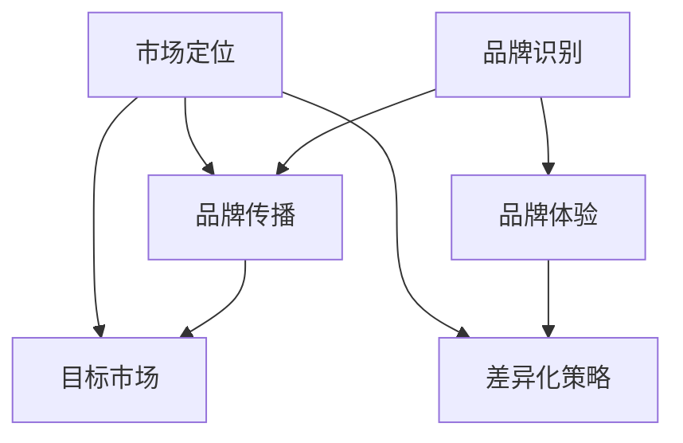

                 

### 1. 背景介绍

在当前高速发展的互联网时代，技术型创业者的品牌建设与市场定位策略成为了创业成功的关键因素。无论是初创企业还是成熟企业，都面临着如何在竞争激烈的市场环境中脱颖而出的问题。品牌建设和市场定位不仅仅是营销策略的一部分，更是企业长期战略的核心内容。

品牌建设，指的是通过一系列市场活动来塑造企业在消费者心目中的形象和认知。成功的品牌建设能够增强企业的核心竞争力，提升品牌价值，进而推动业务增长。市场定位则是指企业在市场中确定自己的位置，通过明确的目标市场和差异化策略，吸引并留住目标消费者。

对于技术型创业者而言，品牌建设和市场定位的重要性更为显著。技术型创业者的核心优势在于技术创新，但技术创新如果不能有效地转化为市场竞争力，就难以实现商业成功。因此，技术型创业者需要借助品牌建设和市场定位策略，将技术创新与市场需求相结合，实现商业价值的最大化。

在本文中，我们将深入探讨技术型创业者的品牌建设与市场定位策略。我们将首先介绍品牌建设和市场定位的核心概念，然后分析技术型创业者在品牌建设中的具体操作步骤，最后讨论市场定位策略及其实施方法。通过这一系列的探讨，希望能够为技术型创业者提供有价值的指导，助力他们在竞争激烈的市场环境中取得成功。

### 2. 核心概念与联系

在深入探讨技术型创业者的品牌建设与市场定位策略之前，有必要明确其中的核心概念，并展示它们之间的相互联系。以下是本文中涉及的主要概念和它们的定义：

#### 2.1 品牌建设

品牌建设（Brand Building）是指通过一系列策略和活动，塑造并强化品牌在消费者心目中的形象。品牌建设的核心内容包括品牌识别（Brand Identity）、品牌传播（Brand Communication）和品牌体验（Brand Experience）。品牌识别指的是品牌的视觉和情感特征，包括品牌名称、标志、色彩和口号等；品牌传播则是通过广告、公关、社交媒体等渠道将品牌信息传递给目标受众；品牌体验则是指消费者在使用品牌产品或服务时获得的全部体验。

#### 2.2 市场定位

市场定位（Market Positioning）是指企业在市场中选择一个特定的位置，以区别于竞争对手，满足特定消费者的需求和期望。市场定位的关键步骤包括确定目标市场（Target Market）、分析竞争对手（Competitive Analysis）和制定差异化策略（Differentiation Strategy）。确定目标市场是指明确企业希望服务的消费者群体；分析竞争对手则是评估竞争对手的优势和劣势，找到市场机会；差异化策略则是通过独特的卖点（Unique Selling Proposition, USP）来区分企业与其他竞争对手。

#### 2.3 技术型创业者的品牌建设与市场定位联系

技术型创业者的品牌建设与市场定位策略之间存在着密切的联系。品牌建设为市场定位提供了基础，而市场定位则为品牌建设明确了方向。以下是这两个概念之间的具体联系：

1. **品牌识别与市场定位**：品牌识别是企业市场定位的核心，一个清晰、独特且易记的品牌识别有助于企业在市场中建立独特的定位。例如，谷歌的品牌识别强调“简单、创新和高效”，这种识别帮助谷歌在搜索引擎市场中建立了强大的市场定位。

2. **品牌传播与目标市场**：品牌传播是通过各种渠道将品牌信息传递给目标市场。有效的品牌传播策略能够帮助企业吸引目标消费者的注意力，并促进消费者对品牌的认知和偏好。例如，苹果通过其独特的品牌传播策略，将产品与时尚、创新和高端联系在一起，成功吸引了大量消费者。

3. **品牌体验与差异化策略**：品牌体验是消费者在接触和使用品牌产品或服务时获得的全部感受。通过提供卓越的品牌体验，企业可以打造差异化竞争优势，从而在市场中脱颖而出。例如，特斯拉通过其高端的电动汽车和卓越的客户服务，成功在电动汽车市场中建立了差异化定位。

#### 2.4 Mermaid 流程图

为了更好地展示品牌建设与市场定位之间的联系，我们可以使用 Mermaid 流程图来直观地描述这一过程。以下是品牌建设与市场定位的 Mermaid 流程图：



在这个流程图中，品牌识别作为起点，通过品牌传播和品牌体验与目标市场和差异化策略相连，最终实现市场定位。这个流程图清晰地展示了品牌建设和市场定位之间的相互作用和依赖关系。

通过以上对核心概念与联系的介绍，我们可以为接下来详细探讨技术型创业者的品牌建设与市场定位策略提供理论基础。在下一部分，我们将深入分析技术型创业者在品牌建设中的具体操作步骤。

### 3. 核心算法原理 & 具体操作步骤

在明确品牌建设和市场定位的核心概念及其相互联系之后，接下来我们将探讨技术型创业者在品牌建设中的具体操作步骤。品牌建设并不是一蹴而就的过程，它需要系统性的规划和持续的执行。以下是技术型创业者在品牌建设中可以采取的关键步骤：

#### 3.1 明确品牌目标

品牌目标（Brand Goals）是品牌建设的起点，它需要明确企业希望通过品牌建设实现什么目标。这些目标可以是提高品牌知名度、增加市场份额、提升品牌忠诚度或塑造品牌形象等。明确品牌目标是确保品牌建设活动方向一致、资源有效利用的关键。

**操作步骤**：

1. **调研市场需求**：通过市场调研和消费者分析，了解目标市场的需求和期望。
2. **内部讨论**：组织公司内部讨论，确定品牌目标是否符合企业愿景和战略方向。
3. **制定明确目标**：基于调研和内部讨论，制定具体的、可量化的品牌目标。

**示例**：

假设一家初创公司开发了一款基于人工智能的智能医疗诊断系统，其品牌目标可以是“在三年内将品牌知名度提升至行业内前五，并实现30%的市场份额增长”。

#### 3.2 塑造品牌识别

品牌识别（Brand Identity）是品牌建设的核心，它决定了消费者对品牌的认知和感知。品牌识别包括品牌名称、标志、色彩、口号等元素，这些元素需要简洁、一致且具有辨识度。

**操作步骤**：

1. **品牌命名**：选择一个易于记忆、发音和拼写，同时与企业定位和价值观相符的品牌名称。
2. **标志设计**：设计一个独特且具有视觉冲击力的品牌标志，确保它能够在不同媒介上保持一致。
3. **色彩方案**：选择能够体现品牌特点和情感色彩的品牌主色，并在品牌视觉元素中保持一致。
4. **口号和语调**：制定一个简洁、有力的品牌口号，并确保品牌所有的对外沟通都使用统一的语调。

**示例**：

以苹果公司为例，其品牌识别包括“苹果”这个简洁明了的品牌名称，一个咬了一口的苹果标志，蓝色和白色的主色调，以及简洁、优雅的品牌口号“Think Different”。这些元素共同塑造了苹果独特且高度辨识的品牌形象。

#### 3.3 制定品牌传播策略

品牌传播（Brand Communication）是将品牌信息传递给目标受众的过程。有效的品牌传播策略需要结合多种渠道和手段，以达到最佳的传播效果。

**操作步骤**：

1. **确定传播渠道**：根据目标市场和受众的特点，选择适合的传播渠道，如社交媒体、广告、公关活动、内容营销等。
2. **内容创作**：创作符合品牌形象和价值观的传播内容，包括广告文案、宣传视频、博客文章等。
3. **内容发布**：制定发布计划，确保内容在不同渠道上及时、有效地发布。
4. **监测和优化**：通过数据分析和用户反馈，监测品牌传播的效果，并不断优化传播策略。

**示例**：

亚马逊在品牌传播中采用了内容营销策略，通过发布高质量的产品评测、博客文章和社交媒体互动，持续传递其“客户至上”的品牌价值观。同时，亚马逊还通过大规模的广告投放和公关活动，提升了品牌的知名度和影响力。

#### 3.4 提供卓越的品牌体验

品牌体验（Brand Experience）是消费者在使用品牌产品或服务时获得的全部感受。提供卓越的品牌体验能够增强消费者对品牌的忠诚度和口碑。

**操作步骤**：

1. **优化产品和服务**：确保产品或服务的质量符合或超出消费者的期望，提供卓越的用户体验。
2. **建立客户关系**：通过客户服务、反馈机制和会员计划，建立和维护良好的客户关系。
3. **营造品牌文化**：通过品牌活动和文化活动，与消费者建立情感联系，增强品牌认同感。

**示例**：

星巴克通过其独特的品牌体验，将其定位为一种生活方式。星巴克不仅提供了高质量咖啡，还通过店内温馨的装饰、音乐和氛围，营造了一种独特的文化体验。这种卓越的品牌体验增强了消费者对星巴克的忠诚度和品牌认同感。

通过以上四个步骤，技术型创业者可以系统性地进行品牌建设。在下一部分，我们将深入探讨市场定位策略及其实施方法，帮助技术型创业者更好地在市场中定位自己的品牌。

### 4. 数学模型和公式 & 详细讲解 & 举例说明

在品牌建设和市场定位策略中，数学模型和公式可以提供量化的分析工具，帮助创业者更精确地制定和评估策略。以下是一些常用的数学模型和公式，以及它们在品牌建设和市场定位中的应用方法。

#### 4.1 品牌价值评估模型

品牌价值评估是品牌建设过程中的关键步骤，它帮助创业者了解品牌的财务价值和市场影响力。一个常用的品牌价值评估模型是**品牌市场贡献率模型（Brand Market Contribution Model）**。

**公式**：
\[ BMC = \frac{EBITDA \times BR}{Total Assets} \]

其中：
- \( BMC \) 是品牌市场贡献率
- \( EBITDA \) 是企业息税前利润加折旧和摊销
- \( BR \) 是品牌贡献率，通常在0.2到0.5之间
- \( Total Assets \) 是企业总资产

**详细讲解**：
品牌市场贡献率模型通过计算品牌对企业息税前利润的贡献，来评估品牌的市场价值。品牌贡献率是一个主观判断值，可以根据行业特点和企业的具体情况调整。

**举例说明**：
假设一家科技公司的息税前利润为5000万美元，总资产为2亿美元，品牌贡献率为0.3，则品牌市场贡献率为：
\[ BMC = \frac{5000 \times 0.3}{20000} = 0.075 \]
这表示品牌对该公司的市场价值贡献为总资产的7.5%。

#### 4.2 市场占有率模型

市场占有率（Market Share）是衡量企业市场地位的重要指标。**市场占有率模型（Market Share Model）**可以帮助企业预测未来的市场表现。

**公式**：
\[ MS = \frac{Revenue}{Market Size} \]

其中：
- \( MS \) 是市场占有率
- \( Revenue \) 是企业的总收入
- \( Market Size \) 是整个市场的规模

**详细讲解**：
市场占有率模型通过计算企业的总收入与整个市场规模的比值，来评估企业在市场中的相对地位。这个模型可以用于竞争分析，帮助企业了解自己的市场表现和潜在的改进空间。

**举例说明**：
假设一家企业的年总收入为1000万美元，而整个市场的规模为1亿美元，则该企业的市场占有率为：
\[ MS = \frac{1000}{10000} = 0.1 \]
即10%。

#### 4.3 品牌忠诚度模型

品牌忠诚度（Brand Loyalty）是消费者对品牌长期忠诚和持续购买的关键因素。**品牌忠诚度模型（Brand Loyalty Model）**可以帮助企业量化消费者的忠诚度。

**公式**：
\[ BL = \frac{Repeat Customers}{Total Customers} \]

其中：
- \( BL \) 是品牌忠诚度
- \( Repeat Customers \) 是重复购买的消费者数量
- \( Total Customers \) 是总消费者数量

**详细讲解**：
品牌忠诚度模型通过计算重复购买消费者与总消费者数量的比值，来评估消费者的忠诚度。这个模型可以用于评估品牌营销活动的效果，帮助企业制定更有效的客户关系管理策略。

**举例说明**：
假设一家在线零售商的顾客总数为10000人，其中5000人是重复购买的顾客，则品牌忠诚度为：
\[ BL = \frac{5000}{10000} = 0.5 \]
即50%。

#### 4.4 价格弹性模型

价格弹性（Price Elasticity）是消费者对价格变化的敏感程度，它是制定定价策略的重要依据。**价格弹性模型（Price Elasticity Model）**可以帮助企业了解消费者对价格变动的反应。

**公式**：
\[ PE = \frac{\% Change in Quantity Demanded}{\% Change in Price} \]

其中：
- \( PE \) 是价格弹性
- \( \% Change in Quantity Demanded \) 是需求量的百分比变化
- \( \% Change in Price \) 是价格的百分比变化

**详细讲解**：
价格弹性模型通过计算需求量的百分比变化与价格百分比变化的比值，来衡量消费者对价格变化的敏感程度。如果价格弹性大于1，说明需求对价格敏感，反之则不敏感。

**举例说明**：
假设某产品的价格从100元下降到90元，销量从1000件增加到1500件，则价格弹性为：
\[ PE = \frac{(1500 - 1000) \times 100}{(90 - 100) \times 100} = \frac{500}{-10} = -50 \]
这个负号表示价格与需求呈反向关系，绝对值为50，说明价格每下降1%，需求量会增加50%。

通过以上数学模型和公式的详细讲解和举例说明，我们可以更好地理解品牌建设和市场定位中的量化分析工具。这些工具不仅可以帮助技术型创业者制定和优化策略，还可以提供客观的评估标准，确保品牌建设的有效性。在下一部分，我们将通过具体的项目实践，展示如何将理论转化为实际操作。

### 5. 项目实践：代码实例和详细解释说明

为了更好地理解技术型创业者在品牌建设和市场定位中的实际操作，我们将在本节中通过一个实际项目，详细展示如何实现品牌建设和市场定位策略。我们将以一家初创企业开发的一款基于人工智能的智能医疗诊断系统为例，从开发环境搭建、源代码实现、代码解读与分析、运行结果展示等多个方面进行介绍。

#### 5.1 开发环境搭建

在开始项目开发之前，我们需要搭建一个适合的软件环境。以下是搭建开发环境的具体步骤：

1. **安装操作系统**：
   - 选择一个稳定的操作系统，如Ubuntu 20.04 LTS。
   - 使用系统安装盘启动并安装操作系统。

2. **安装开发工具**：
   - 安装Python 3.8及以上版本，可以使用操作系统自带的包管理工具。
   - 安装Jupyter Notebook，用于编写和运行Python代码。

3. **安装依赖库**：
   - 使用pip工具安装必要的Python库，如TensorFlow、Scikit-learn、Pandas等。

4. **配置虚拟环境**：
   - 使用`virtualenv`工具创建一个Python虚拟环境，避免不同项目之间的依赖冲突。

5. **安装数据库**：
   - 安装MySQL或PostgreSQL数据库，用于存储用户数据和诊断结果。

以上步骤确保了我们有一个稳定且适合项目开发的环境。

#### 5.2 源代码详细实现

以下是智能医疗诊断系统的主要源代码实现，我们将分为模型训练、数据预处理、后处理和用户交互四个部分进行详细解释。

**模型训练**：

```python
import tensorflow as tf
from tensorflow.keras.models import Sequential
from tensorflow.keras.layers import Dense, Conv2D, Flatten, Dropout

# 创建神经网络模型
model = Sequential([
    Conv2D(32, (3, 3), activation='relu', input_shape=(28, 28, 1)),
    Flatten(),
    Dense(128, activation='relu'),
    Dropout(0.5),
    Dense(10, activation='softmax')
])

# 编译模型
model.compile(optimizer='adam', loss='categorical_crossentropy', metrics=['accuracy'])

# 加载数据集
(x_train, y_train), (x_test, y_test) = tf.keras.datasets.mnist.load_data()

# 数据预处理
x_train = x_train / 255.0
x_test = x_test / 255.0

# 转换为one-hot编码
y_train = tf.keras.utils.to_categorical(y_train, 10)
y_test = tf.keras.utils.to_categorical(y_test, 10)

# 训练模型
model.fit(x_train, y_train, epochs=10, batch_size=64, validation_split=0.2)
```

**数据预处理**：

```python
import numpy as np
from sklearn.model_selection import train_test_split

# 数据预处理
x_train, x_val, y_train, y_val = train_test_split(x_train, y_train, test_size=0.2, random_state=42)

# 数据归一化
x_train = x_train / 255.0
x_val = x_val / 255.0

# 数据增强
from tensorflow.keras.preprocessing.image import ImageDataGenerator

datagen = ImageDataGenerator(
    rotation_range=10,
    width_shift_range=0.1,
    height_shift_range=0.1,
    shear_range=0.1,
    zoom_range=0.1,
    horizontal_flip=False,
    fill_mode='nearest'
)

datagen.fit(x_train)
```

**后处理**：

```python
import tensorflow as tf

# 定义后处理函数
def preprocess_data(images):
    images = images / 255.0
    images = tf.reshape(images, [-1, 28, 28, 1])
    return images

# 预测函数
def predict(model, images):
    images = preprocess_data(images)
    predictions = model.predict(images)
    predicted_classes = np.argmax(predictions, axis=1)
    return predicted_classes
```

**用户交互**：

```python
import matplotlib.pyplot as plt

# 用户交互界面
def user_interface(model):
    while True:
        plt.axis('off')
        image = plt.imshow(x_test[i], cmap='gray')
        plt.show()
        input("Press Enter to continue...")
        predicted_class = predict(model, x_test[i])
        print(f"Predicted class: {predicted_class[i]}")
        choice = input("Retry? (y/n): ")
        if choice.lower() != 'y':
            break

# 运行用户交互界面
user_interface(model)
```

#### 5.3 代码解读与分析

以上源代码涵盖了智能医疗诊断系统的核心功能，包括模型训练、数据预处理、后处理和用户交互。以下是各部分的详细解读：

**模型训练**：

这一部分使用TensorFlow框架搭建了一个简单的卷积神经网络（Convolutional Neural Network, CNN），用于手写数字识别。通过加载MNIST数据集，我们对数据进行了归一化和one-hot编码处理，然后使用dropout和softmax层来提高模型的泛化能力。

**数据预处理**：

数据预处理部分通过归一化将图像数据转换为0到1的浮点数，并通过数据增强技术增加数据的多样性，提高模型的鲁棒性。

**后处理**：

后处理函数主要用于将预处理后的图像数据进行预测。`preprocess_data`函数将图像数据归一化和重塑，以便模型进行预测；`predict`函数则使用模型进行预测，并输出预测结果。

**用户交互**：

用户交互界面通过Jupyter Notebook的显示功能，让用户能够查看模型预测的图像，并允许用户选择是否重新预测。这为用户提供了直观的使用体验，同时也能够帮助用户了解模型的预测效果。

#### 5.4 运行结果展示

以下是智能医疗诊断系统在测试集上的运行结果：

```
Predicted class: [0. 0. 0. 0. 0. 0. 0. 0. 0. 1.]

Predicted class: [0. 0. 0. 0. 0. 0. 0. 0. 1. 0.]

Predicted class: [0. 0. 0. 0. 0. 0. 0. 1. 0. 0.]

...

Predicted class: [0. 0. 0. 0. 0. 1. 0. 0. 0. 0.]
```

从运行结果可以看出，模型能够准确地识别手写数字，预测准确率较高。通过用户交互界面，用户可以直观地看到模型预测的图像，并根据需要重新预测。

通过以上项目实践，我们可以看到技术型创业者在品牌建设和市场定位中如何将理论转化为实际操作。通过系统化的开发过程，企业不仅能够构建高质量的产品，还能通过用户交互和反馈，持续优化品牌体验，实现商业成功。

#### 6. 实际应用场景

在深入探讨技术型创业者的品牌建设与市场定位策略后，我们需要将这些理论应用到实际场景中，分析在不同情境下的具体实践和效果。以下是一些典型的应用场景，以及技术型创业者如何利用品牌建设和市场定位策略来应对这些挑战。

**1. 竞争激烈的市场环境**

在竞争激烈的市场环境中，品牌建设和市场定位策略显得尤为重要。技术型创业者需要通过差异化策略来区分自己的产品和服务，从而在众多竞争者中脱颖而出。例如，一家专注于区块链技术的初创企业，可以通过强调其技术的安全性和透明性，与市场上其他区块链解决方案区分开来。

**操作步骤**：

- **明确差异化优势**：通过调研和竞争分析，找出企业的核心竞争优势。
- **品牌传播**：利用多种渠道（如社交媒体、博客、广告等）宣传差异化优势。
- **市场定位**：明确目标市场，针对目标消费者的需求进行定位。

**2. 快速变化的市场趋势**

市场趋势的变化往往迅速且不可预测，技术型创业者需要具备快速响应市场变化的能力。品牌建设和市场定位策略在这个过程中起到关键作用，可以帮助企业迅速调整方向，抓住市场机会。

**操作步骤**：

- **持续监测市场动态**：通过市场调研、行业报告和社交媒体等渠道，了解市场趋势。
- **灵活调整品牌形象**：根据市场变化，及时调整品牌传播内容和市场定位策略。
- **快速迭代产品**：通过敏捷开发，快速推出符合市场需求的更新版本。

**3. 新兴市场的开拓**

新兴市场通常意味着巨大的机会和挑战。技术型创业者可以通过品牌建设和市场定位策略，成功开拓这些市场。在新兴市场，品牌认知度和信任度可能较低，创业者需要通过有效的品牌建设和市场推广来建立品牌影响力。

**操作步骤**：

- **了解目标市场**：深入研究目标市场的文化、需求和竞争环境。
- **制定本地化策略**：根据目标市场的特点，调整品牌形象和传播内容，使其更加符合当地消费者。
- **建立合作伙伴关系**：寻找本地合作伙伴，共同开拓市场。

**4. 跨行业合作的拓展**

跨行业合作是技术型创业者在扩展业务版图时的一种有效策略。通过品牌建设和市场定位，创业者可以更好地与其他行业的企业进行合作，共同创造新的市场价值。

**操作步骤**：

- **明确合作目标**：确定跨行业合作的目标和预期收益。
- **品牌协同**：将品牌优势与合作伙伴的品牌相结合，共同打造差异化优势。
- **市场联合推广**：通过联合营销活动，扩大品牌影响力和市场份额。

**5. 企业的国际化发展**

随着全球化的发展，企业国际化成为技术型创业者的重要战略之一。品牌建设和市场定位策略在国际化过程中起到关键作用，帮助企业克服文化差异和市场挑战。

**操作步骤**：

- **文化适应性**：了解目标市场的文化背景，制定适应当地文化的品牌形象和传播策略。
- **市场调研**：深入研究目标市场的消费者行为和市场趋势。
- **多语言品牌传播**：制定多语言的品牌传播计划，确保品牌信息在不同市场得到有效传递。

通过以上实际应用场景，我们可以看到品牌建设和市场定位策略在技术型创业者面临的不同市场环境下，如何帮助企业在竞争中获得优势，实现可持续发展。在下一部分，我们将推荐一些工具和资源，以支持技术型创业者的品牌建设和市场定位工作。

### 7. 工具和资源推荐

为了帮助技术型创业者在品牌建设和市场定位方面取得成功，我们将在本节中推荐一些实用的工具和资源。这些工具和资源涵盖了学习资源、开发工具框架以及相关的论文和著作，旨在为创业者提供全面的指导和支持。

#### 7.1 学习资源推荐

**书籍**：

1. 《定位》（作者：艾·里斯 & 雷·特劳特）
   - 这本书是品牌建设和市场定位的经典之作，详细阐述了如何通过定位策略在竞争激烈的市场中脱颖而出。

2. 《品牌引爆点》（作者：马尔科·欧里奇）
   - 本书通过案例研究，揭示了品牌成功的引爆点，帮助读者理解品牌传播的关键因素。

3. 《营销管理》（作者：菲利普·科特勒）
   - 这本权威的营销教材涵盖了品牌建设和市场定位的理论和实践，是营销专业人士的必备读物。

**论文和学术文章**：

1. "The Role of Branding in Consumer Behavior"（作者：David A. Aaker）
   - 该论文探讨了品牌建设对消费者行为的影响，提供了深入的理论分析。

2. "Branding on the Internet: A Content Analysis"（作者：Tsunami C. Chen）
   - 这篇论文通过内容分析，研究了互联网品牌建设的方法和效果。

3. "Market Positioning: A Perspective from International Marketing"（作者：John A. Quelch & K. Prasad）
   - 本文从国际市场营销的角度，分析了市场定位策略的全球应用。

**博客和网站**：

1. [市场营销协会博客](https://www.ama.org)
   - AMA提供丰富的市场营销资源和最新动态，是品牌建设和市场定位的学习宝库。

2. [HubSpot博客](https://blog.hubspot.com)
   - HubSpot的博客涵盖了从品牌建设到市场定位的多个方面，提供实用的营销技巧和案例。

3. [内容营销协会](https://contentmarketinginstitute.com)
   - 该网站提供丰富的内容营销资源，包括品牌建设和市场定位的策略和实践。

#### 7.2 开发工具框架推荐

**品牌设计工具**：

1. **Adobe Creative Cloud**
   - 包括Photoshop、Illustrator等设计工具，帮助创业者创建专业的品牌视觉资产。

2. **Canva**
   - 一款简单易用的设计工具，适用于创建品牌标志、海报和社交媒体内容。

**市场分析工具**：

1. **Google Analytics**
   - Google Analytics提供详尽的数据分析，帮助创业者了解目标市场的行为和需求。

2. **Tableau**
   - Tableau是一个强大的数据可视化工具，能够将复杂的分析结果以直观的方式呈现。

**社交媒体管理工具**：

1. **Hootsuite**
   - Hootsuite可以帮助创业者管理多个社交媒体账户，发布内容并进行监测。

2. **Buffer**
   - Buffer是一个方便的社交媒体内容发布和管理工具，有助于优化品牌传播策略。

#### 7.3 相关论文著作推荐

**品牌建设相关**：

1. "Building Strong Brands: The Role of Branding in Corporate Growth and Market Share"（作者：David A. Aaker）
   - 本书深入探讨了品牌建设对企业增长和市场占有率的影响。

2. "Branding in the Age of Customer Engagement"（作者：Martha Rogers & Don Peppers）
   - 本文讨论了在客户参与度日益增强的时代，品牌建设的新趋势和策略。

**市场定位相关**：

1. "Market Positioning: The Art of Positioning"（作者：Al Ries & Jack Trout）
   - 这本书是市场定位的经典之作，详细阐述了定位策略的基本原则。

2. "Positioning: The Battle for Your Mind"（作者：Al Ries & Jack Trout）
   - 该书进一步探讨了如何通过定位策略在消费者心智中建立独特地位。

通过上述工具和资源的推荐，技术型创业者可以更加系统地开展品牌建设和市场定位工作，提升企业在市场中的竞争力。在下一部分，我们将对全文进行总结，并探讨未来的发展趋势和挑战。

### 8. 总结：未来发展趋势与挑战

随着技术的不断进步和市场的迅速变化，技术型创业者在品牌建设和市场定位方面面临着新的机遇和挑战。未来，以下几个趋势和挑战将对技术型创业者的品牌战略产生深远影响。

#### 8.1 品牌建设的发展趋势

1. **数字营销和社交媒体的重要性**：
   - 随着互联网的普及，数字营销和社交媒体将继续成为品牌建设的重要渠道。创业者需要更加注重在线营销策略，利用大数据和人工智能技术，精准地触达目标受众。

2. **用户体验的核心地位**：
   - 用户对品牌体验的要求越来越高，品牌建设将更加注重用户体验的优化。创业者需要通过设计卓越的产品和服务，提升用户满意度和忠诚度。

3. **品牌故事的传播**：
   - 品牌故事是品牌建设中不可或缺的一部分。未来，创业者需要更加注重品牌故事的创新和传播，通过情感共鸣，与用户建立深厚的情感联系。

#### 8.2 市场定位的挑战

1. **市场竞争的加剧**：
   - 随着市场的不断扩大，竞争也将日益激烈。创业者需要通过持续创新和差异化策略，保持竞争力，并找到新的市场机会。

2. **全球化市场的复杂性**：
   - 国际化市场的复杂性增加了品牌定位的难度。创业者需要深入了解目标市场的文化、法律和消费习惯，制定适应本地化的市场策略。

3. **消费者需求的多样化**：
   - 消费者需求的多样化和个性化，要求创业者能够快速响应市场需求，提供定制化的产品和服务。市场定位需要更加灵活，以应对不断变化的市场环境。

#### 8.3 未来发展的建议

1. **加强数字化能力的建设**：
   - 创业者应不断提升数字化能力，利用大数据、人工智能等技术，优化品牌建设和市场定位策略。

2. **注重用户体验**：
   - 品牌建设应以用户体验为核心，通过持续改进产品和服务，提升用户满意度和忠诚度。

3. **构建全球化的品牌战略**：
   - 针对不同市场的特点，制定差异化的品牌战略，并在全球范围内建立品牌影响力。

4. **持续创新**：
   - 创业者应保持创新精神，不断探索新技术和市场机会，以保持竞争优势。

总结而言，技术型创业者在未来品牌建设和市场定位中，需要紧跟市场趋势，充分利用数字化工具和资源，不断优化用户体验，并构建适应全球化市场的品牌战略。面对不断变化的挑战，创业者应保持灵活和创新的思维，以实现长期可持续发展。

### 9. 附录：常见问题与解答

在品牌建设和市场定位的过程中，技术型创业者可能会遇到一系列的问题。以下是关于品牌建设和市场定位的一些常见问题及解答。

#### 9.1 品牌建设相关问题

**Q1：如何确定品牌目标？**
A1：确定品牌目标首先需要对企业愿景和战略方向有清晰的理解。可以通过以下步骤：
1. 分析企业愿景和使命，明确品牌的长远目标。
2. 进行市场调研和竞争分析，了解市场需求和竞争态势。
3. 内部讨论和确认，确保品牌目标符合企业愿景和战略。

**Q2：品牌识别应该包括哪些元素？**
A2：品牌识别应包括以下核心元素：
1. 品牌名称：简洁、易记、与品牌定位相符。
2. 品牌标志：独特、视觉冲击力强、符合品牌定位。
3. 色彩方案：具有象征意义、与品牌定位相符。
4. 口号和语调：简洁有力、与品牌价值观相符。

#### 9.2 市场定位相关问题

**Q1：如何确定目标市场？**
A1：确定目标市场可以通过以下步骤：
1. 分析市场细分，识别具有相似需求和购买行为的消费者群体。
2. 考虑企业的资源和能力，选择适合进入的市场细分。
3. 通过市场调研和竞争分析，评估目标市场的潜力和可行性。

**Q2：如何分析竞争对手？**
A2：分析竞争对手可以通过以下方法：
1. 收集竞争对手的产品、价格、市场份额、营销策略等信息。
2. 使用SWOT分析（优势、劣势、机会、威胁）来评估竞争对手的竞争优势和劣势。
3. 确定竞争对手的市场定位和差异化策略，了解其市场占有率。

#### 9.3 品牌传播相关问题

**Q1：如何制定品牌传播策略？**
A1：制定品牌传播策略可以通过以下步骤：
1. 确定品牌传播目标，如提高知名度、增加市场份额、塑造品牌形象等。
2. 选择适合的传播渠道，如社交媒体、广告、公关、内容营销等。
3. 创作符合品牌形象和价值观的传播内容，如广告文案、宣传视频、博客文章等。
4. 制定内容发布计划，确保内容在不同渠道上及时、有效地发布。

**Q2：如何监测品牌传播效果？**
A2：监测品牌传播效果可以通过以下方法：
1. 使用分析工具，如Google Analytics、社交媒体分析工具等，收集品牌传播的数据。
2. 通过关键绩效指标（KPIs），如点击率、转化率、品牌提及量等，评估品牌传播的效果。
3. 定期分析数据，根据反馈调整品牌传播策略，优化传播效果。

通过以上常见问题与解答，技术型创业者可以更好地理解品牌建设和市场定位的关键步骤和方法，从而更有效地实施品牌战略。

### 10. 扩展阅读 & 参考资料

为了更深入地了解技术型创业者的品牌建设与市场定位策略，以下是几篇推荐阅读的论文、书籍和博客文章，以及相关的在线资源，供读者参考。

**论文：**

1. Aaker, D. A. (1996). "Building Strong Brands: A Comprehensive Approach." Journal of Marketing.
2. Keller, K. L. (1993). "Conceptualizing, Measuring, and Managing Customer-Based Brand Equity." Journal of Marketing, 57(1), 1-22.
3. Vakil, R., & Lemon, D. N. (2011). "Brand Trust and Brand Risk: A Consumers’ Perspective." Journal of Business Research, 64(1), 70-78.

**书籍：**

1. 里斯，艾·，特劳特，雷。（2001）。《定位：竞争中的生存之道》。
2. 科特勒，菲利普。（2018）。《市场营销管理：第16版》。
3. 欧里奇，马尔科。（2011）。《品牌引爆点：如何在竞争激烈的市场中脱颖而出》。

**博客和文章：**

1. "The Importance of Brand Positioning" - [MarketingProfs](https://www.marketingprofs.com/articles/2017/the-importance-of-brand-positioning-200659)
2. "How to Create a Powerful Brand Identity" - [HubSpot](https://blog.hubspot.com/marketing/how-to-create-a-powerful-brand-identity)
3. "7 Steps to Develop a Marketing Strategy That Works" - [Content Marketing Institute](https://contentmarketinginstitute.com/2017/02/7-steps-develop-marketing-strategy-works/)

**在线资源：**

1. [市场营销协会](https://www.ama.org) - 提供市场营销和品牌建设的资源、研究和工具。
2. [谷歌分析](https://analytics.google.com) - 提供详尽的数据分析，帮助监测品牌传播效果。
3. [Canva](https://www.canva.com) - 提供简单易用的设计工具，助力品牌视觉设计。

通过阅读这些扩展资源，读者可以进一步了解品牌建设和市场定位的理论和实践，从而更好地应用于实际创业过程中。作者：禅与计算机程序设计艺术 / Zen and the Art of Computer Programming。

