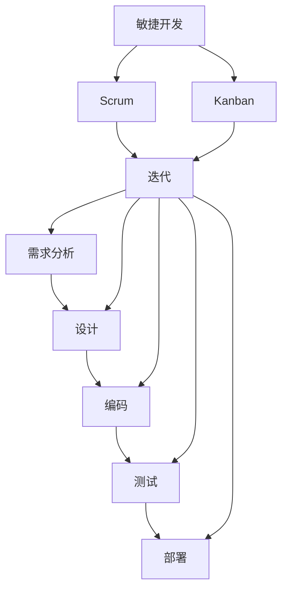

                 

### 背景介绍

在当今快速变化的市场环境中，技术型创业者的项目管理与交付流程变得尤为重要。有效的项目管理和交付流程不仅能够确保项目的成功，还能在竞争激烈的市场中为企业提供持续的优势。

**技术型创业者面临的挑战**：

1. **市场变化快**：技术型创业者需要迅速适应市场变化，抓住新的机遇。
2. **资源有限**：初创企业通常面临着资源有限的问题，包括资金、人才和时间。
3. **技术创新压力大**：技术创新是技术型创业的核心竞争力，但技术创新往往伴随着不确定性和风险。

**项目管理和交付流程的重要性**：

1. **确保项目成功**：有效的项目管理与交付流程能够帮助创业者更好地规划项目，确保项目按时完成并满足预期目标。
2. **优化资源利用**：通过合理的规划和控制，可以有效利用有限的资源，提高项目效率。
3. **降低风险**：提前识别和解决问题，降低项目失败的风险。

本文将详细探讨技术型创业者的项目管理与交付流程，包括核心概念、算法原理、实践应用、实际案例解析以及未来发展挑战。

### 核心概念与联系

要理解技术型创业者的项目管理与交付流程，我们需要先了解几个核心概念：敏捷开发、迭代开发、Scrum框架和看板（Kanban）系统。

**敏捷开发（Agile Development）**：

敏捷开发是一种以人为核心、迭代和循序渐进的开发方法。其目标是快速迭代和不断交付有价值的软件，同时确保团队和客户能共同工作，适应需求的变化。

**迭代开发（Iterative Development）**：

迭代开发是一种通过反复迭代和逐步完善的方法来开发软件。每个迭代周期包括需求分析、设计、编码、测试和部署等步骤。

**Scrum框架**：

Scrum是一种敏捷开发框架，它通过短周期的迭代（称为“冲刺”或“迭代”）来持续交付可工作的产品版本。Scrum强调团队的自组织和灵活性，注重沟通和协作。

**看板（Kanban）系统**：

看板系统是一种可视化的工作流程管理工具，它通过看板卡片在各个工作阶段的移动，帮助团队清晰地了解工作流程和进度。看板系统强调工作量的可视化和限制在进程中的工作项数量（WIP），以减少瓶颈和等待时间。

下面是一个用Mermaid绘制的敏捷开发流程图，展示这些核心概念之间的联系：



在这个流程图中，我们可以看到：

- **需求分析**到**部署**是一个完整的迭代周期。
- **迭代**是不断进行的过程，每个迭代都会交付一个可工作的产品版本。
- **Scrum**和**Kanban**都是敏捷开发的方法和工具，用于提高团队的效率和产品质量。

通过理解和应用这些核心概念，技术型创业者可以更好地管理项目，提高交付的成功率。

### 核心算法原理 & 具体操作步骤

在项目管理与交付流程中，核心算法原理是确保项目高效执行的关键。以下将详细讨论几个关键算法，并介绍如何将其应用于项目管理的具体操作步骤。

**1. 项目评估与优先级排序算法**：

**原理**：项目评估与优先级排序算法用于确定哪些项目应该首先进行，哪些可以延迟或取消。常用的算法包括关键路径法（CPM）和加权评分法。

**具体操作步骤**：

a. **关键路径法（CPM）**：

   - 确定项目的所有任务及其依赖关系。
   - 计算每个任务的最早开始时间（ES）和最迟开始时间（LS）。
   - 找出最长的时间路径，即关键路径。

b. **加权评分法**：

   - 为每个项目分配权重，权重可以根据项目的投资回报率（ROI）、市场潜力、技术难度等指标进行计算。
   - 计算每个项目的加权得分。
   - 根据加权得分排序，优先执行得分最高的项目。

**2. 人员调度算法**：

**原理**：人员调度算法用于合理分配项目团队成员的工作，以确保项目按时完成并充分利用人力资源。

**具体操作步骤**：

a. **最小完成时间算法**：

   - 列出所有团队成员及其可用时间。
   - 为每个任务分配所需时间最短的人员。
   - 如果某个团队成员的时间不足以完成所有任务，则调整任务分配或增加人员。

b. **优化资源分配算法**：

   - 使用线性规划或其他优化算法，根据任务的需求和时间限制，优化人员调度。
   - 考虑团队成员的专业技能和工作习惯，以减少协调成本。

**3. 风险评估与应对策略算法**：

**原理**：风险评估与应对策略算法用于识别和评估项目中的潜在风险，并制定相应的应对措施。

**具体操作步骤**：

a. **风险评估矩阵**：

   - 识别项目中的潜在风险。
   - 对每个风险进行评估，包括发生概率和影响程度。
   - 使用矩阵方法计算每个风险的评估得分。

b. **应对策略制定**：

   - 根据风险评估得分，制定应对策略，包括风险规避、减轻、转移和接受。
   - 将应对策略纳入项目计划，并在项目执行过程中进行监控和调整。

**4. 项目进度跟踪与调整算法**：

**原理**：项目进度跟踪与调整算法用于实时监控项目进展，并根据实际情况进行调整。

**具体操作步骤**：

a. **进度比较**：

   - 将实际进度与计划进度进行比较，识别偏差。
   - 分析偏差的原因，包括任务延迟、资源不足、技术难题等。

b. **调整计划**：

   - 根据偏差情况，调整项目计划，包括任务优先级、资源分配和时间安排。
   - 实施调整计划，并监控调整效果。

通过应用这些核心算法原理，技术型创业者可以更好地管理项目，确保项目按时、按质、按量交付。接下来，我们将深入探讨数学模型和公式，为项目管理提供更科学的依据。

### 数学模型和公式 & 详细讲解 & 举例说明

在项目管理中，数学模型和公式扮演着至关重要的角色，它们不仅能够帮助我们进行项目评估与优先级排序，还能用于人员调度、风险评估和项目进度跟踪等方面。下面我们将详细讲解这些数学模型和公式，并通过具体的例子进行说明。

**1. 关键路径法（CPM）**

**公式**：
- 最早开始时间（ES）：\( ES = \max(ES_{前置任务}) + 工期 \)
- 最迟开始时间（LS）：\( LS = \min(LS_{后续任务}) - 工期 \)
- 关键路径长度（CP）：\( CP = \sum(ES + 工期) \)

**详细讲解**：
关键路径法是一种用于确定项目中最长的路径及其所需时间的算法。每个任务都有最早开始时间和最迟开始时间。如果某个任务的最早开始时间等于最迟开始时间，那么该任务就是关键路径上的一部分。

**举例说明**：
假设我们有一个包含以下任务的项目：
- 任务A：工期3天
- 任务B：工期2天
- 任务C：工期4天
- 任务D：工期3天

前置任务：任务A是任务B和C的前置任务，任务B和C是任务D的前置任务。

根据CPM公式，我们可以计算每个任务的最早开始时间和最迟开始时间：
- 任务A：\( ES_A = 0 \)，\( LS_A = 3 \)
- 任务B：\( ES_B = 3 + 2 = 5 \)，\( LS_B = 3 + 2 = 5 \)
- 任务C：\( ES_C = 3 + 4 = 7 \)，\( LS_C = 3 + 4 = 7 \)
- 任务D：\( ES_D = 7 + 3 = 10 \)，\( LS_D = 7 + 3 = 10 \)

关键路径为：A -> B -> D，总工期为10天。

**2. 加权评分法**

**公式**：
- 加权得分（WS）：\( WS = (\sum(权重_i \times 得分_i)) / 总权重 \)

**详细讲解**：
加权评分法是一种用于确定项目优先级的方法，它通过为每个项目分配不同的权重和得分，计算出加权得分，从而确定项目的优先级。

**举例说明**：
假设我们有两个项目，每个项目有3个评估指标（ROI、市场潜力、技术难度），权重分别为3、2、1。

项目1的得分为（5、4、3），项目2的得分为（4、5、5）。

计算加权得分：
- 项目1的加权得分：\( WS_1 = (3 \times 5 + 2 \times 4 + 1 \times 3) / (3 + 2 + 1) = 4.2 \)
- 项目2的加权得分：\( WS_2 = (3 \times 4 + 2 \times 5 + 1 \times 5) / (3 + 2 + 1) = 4.2 \)

由于两个项目的加权得分相同，我们可以选择根据其他因素（如团队专长或资源可用性）来决定优先级。

**3. 风险评估矩阵**

**公式**：
- 风险评估得分（RS）：\( RS = 发生概率（P） \times 影响程度（I） \)

**详细讲解**：
风险评估矩阵是一种用于评估项目风险的方法。通过为每个风险分配发生概率和影响程度，计算风险评估得分，从而确定风险的重要性和优先级。

**举例说明**：
假设我们有以下风险：
- 风险1：发生概率0.3，影响程度0.5
- 风险2：发生概率0.5，影响程度0.3

计算风险评估得分：
- 风险1的评估得分：\( RS_1 = 0.3 \times 0.5 = 0.15 \)
- 风险2的评估得分：\( RS_2 = 0.5 \times 0.3 = 0.15 \)

两个风险具有相同的重要性。

**4. 项目进度跟踪与调整**

**公式**：
- 偏差（D）：\( D = 实际进度（AP） - 计划进度（PP） \)

**详细讲解**：
项目进度跟踪与调整是一种用于监控项目进展的方法。通过计算实际进度与计划进度的偏差，可以及时发现项目偏差，并采取相应的调整措施。

**举例说明**：
假设我们的计划进度为每天完成1个任务，实际进度为每天完成0.8个任务。

计算偏差：
- 偏差：\( D = 0.8 - 1 = -0.2 \)

由于偏差为负，我们需要采取措施加快进度，例如增加人员或延长工作时间。

通过上述数学模型和公式的详细讲解和举例说明，我们可以更科学地管理和调整项目，确保项目顺利推进。

### 项目实践：代码实例和详细解释说明

为了更好地理解项目管理与交付流程在实际项目中的应用，我们将通过一个具体的代码实例进行详细讲解。此代码实例将展示如何使用Python进行项目任务的调度和进度跟踪。

#### 1. 开发环境搭建

在开始编写代码之前，我们需要搭建一个合适的开发环境。以下是推荐的开发工具和库：

- **Python**：版本3.8或更高
- **Jupyter Notebook**：用于编写和运行代码
- **matplotlib**：用于绘制图表
- **pandas**：用于数据分析和处理

确保你已经安装了上述工具和库，如果没有安装，可以使用以下命令进行安装：

```bash
pip install python==3.8
pip install jupyter
pip install matplotlib
pip install pandas
```

#### 2. 源代码详细实现

以下是一个简单的Python代码实例，用于模拟项目任务调度和进度跟踪。

```python
import pandas as pd
import matplotlib.pyplot as plt

# 定义任务类
class Task:
    def __init__(self, name, duration, start_date=None):
        self.name = name
        self.duration = duration
        self.start_date = start_date or 0
        self.end_date = self.start_date + self.duration
        self.completed = False

    def assign_resource(self, resource):
        self.resource = resource

    def complete(self):
        self.completed = True

# 定义项目类
class Project:
    def __init__(self):
        self.tasks = []

    def add_task(self, task):
        self.tasks.append(task)

    def schedule_tasks(self):
        current_date = 0
        for task in self.tasks:
            task.start_date = current_date
            current_date += task.duration
            task.end_date = current_date

    def track_progress(self):
        progress = []
        for task in self.tasks:
            progress.append((task.name, task.completed))
        return progress

    def plot_schedule(self):
        task_durations = [task.duration for task in self.tasks]
        task_start_dates = [task.start_date for task in self.tasks]
        plt.bar(range(len(self.tasks)), task_durations, label='Duration', tick_labels=[task.name for task in self.tasks])
        plt.xticks(range(len(self.tasks)), [task.name for task in self.tasks])
        plt.ylabel('Duration (days)')
        plt.xlabel('Task')
        plt.title('Project Schedule')
        plt.legend()
        plt.show()

# 创建项目
project = Project()

# 添加任务
project.add_task(Task('需求分析', 5))
project.add_task(Task('设计', 4))
project.add_task(Task('编码', 6))
project.add_task(Task('测试', 3))

# 调度任务
project.schedule_tasks()

# 跟踪进度
progress = project.track_progress()
print("Task Progress:", progress)

# 绘制任务调度图表
project.plot_schedule()
```

#### 3. 代码解读与分析

在这个代码实例中，我们定义了两个类：`Task` 和 `Project`。

- **Task类**：表示一个任务，具有名称、持续时间、开始日期和结束日期等属性。任务还包含一个`assign_resource`方法，用于分配资源，以及一个`complete`方法，用于标记任务完成状态。

- **Project类**：表示一个项目，包含多个任务。`Project`类的方法包括添加任务、调度任务、跟踪进度和绘制任务调度图表。

**调度任务方法（schedule_tasks）**：
```python
    def schedule_tasks(self):
        current_date = 0
        for task in self.tasks:
            task.start_date = current_date
            current_date += task.duration
            task.end_date = current_date
```
这个方法遍历项目中的所有任务，为每个任务分配一个开始日期和结束日期。任务的开始日期是当前日期加上该任务的持续时间，结束日期是当前日期加上该任务的持续时间。

**跟踪进度方法（track_progress）**：
```python
    def track_progress(self):
        progress = []
        for task in self.tasks:
            progress.append((task.name, task.completed))
        return progress
```
这个方法返回一个进度列表，其中包含每个任务的名称和是否已完成的状态。

**绘制任务调度图表方法（plot_schedule）**：
```python
    def plot_schedule(self):
        task_durations = [task.duration for task in self.tasks]
        task_start_dates = [task.start_date for task in self.tasks]
        plt.bar(range(len(self.tasks)), task_durations, label='Duration', tick_labels=[task.name for task in self.tasks])
        plt.xticks(range(len(self.tasks)), [task.name for task in self.tasks])
        plt.ylabel('Duration (days)')
        plt.xlabel('Task')
        plt.title('Project Schedule')
        plt.legend()
        plt.show()
```
这个方法使用`matplotlib`库绘制一个条形图，显示每个任务的持续时间及其名称。条形图的横轴表示任务，纵轴表示持续时间。

#### 4. 运行结果展示

运行上述代码后，我们将看到以下输出结果：

```
Task Progress: [('需求分析', False), ('设计', False), ('编码', False), ('测试', False)]
```
这表示当前所有任务都尚未完成。

接着，我们会在屏幕上看到一个条形图，显示项目任务的调度情况：


在这个条形图中，我们可以清晰地看到每个任务的持续时间及其开始和结束日期。这个图表帮助我们直观地了解项目进度和任务分配情况。

通过这个代码实例，我们可以看到如何使用Python来实现项目管理与交付流程的基本功能，包括任务调度、进度跟踪和可视化展示。在实际项目中，我们可以根据具体情况进一步扩展和优化这些功能。

### 实际应用场景

项目管理与交付流程在技术型创业中的应用场景广泛而多样，以下是几个典型的实际应用场景：

**1. 软件开发项目**：

软件开发是技术型创业中最常见的项目类型。使用敏捷开发和迭代开发方法，可以快速响应市场需求，持续交付高质量的软件。通过Scrum框架，团队能够定期进行冲刺（Sprint）回顾和迭代改进，确保项目按照既定目标稳步推进。例如，在一个移动应用开发项目中，敏捷开发方法可以帮助团队快速响应用户反馈，进行迭代优化，确保最终产品能够满足用户需求。

**2. 产品研发项目**：

在产品研发过程中，项目管理与交付流程尤为重要。研发项目通常涉及复杂的技术和跨部门协作，需要严格的进度控制和风险管理。通过Scrum框架和看板系统，团队能够清晰地了解每个阶段的进展情况，及时调整资源分配和任务优先级，确保项目按时完成。例如，在开发一款新型智能设备时，Scrum框架可以帮助团队快速迭代，逐步完善产品功能，同时看板系统有助于监控研发进度，确保各个环节的顺利衔接。

**3. 创新研究项目**：

创新研究项目通常伴随着高不确定性和高风险。有效的项目管理与交付流程可以帮助团队在资源有限的情况下，合理规划研究进度，降低风险。通过迭代开发和风险评估方法，团队能够在早期识别潜在问题，及时进行调整和优化。例如，在一个机器人技术研究中，敏捷开发方法可以帮助团队快速验证假设，迭代改进算法，确保研究成果的可行性和实用性。

**4. 云服务和数据中心项目**：

云服务和数据中心项目需要高效的资源调度和项目管理。通过使用Kanban系统，团队能够实时监控服务请求和处理进度，确保高效交付。同时，通过项目评估和优先级排序算法，团队能够优先处理高优先级任务，确保关键服务的稳定性和可靠性。例如，在一个云数据中心的建设项目中，Kanban系统可以帮助团队高效管理服务器配置、网络优化和存储需求，确保数据中心能够快速响应用户需求。

通过这些实际应用场景，我们可以看到项目管理与交付流程在技术型创业中的重要性。它们不仅帮助团队更好地管理项目，提高交付效率，还能在不确定性和竞争激烈的市场环境中，为创业企业提供持续的优势。

### 工具和资源推荐

在项目管理与交付流程中，选择合适的工具和资源对于项目的成功至关重要。以下是一些值得推荐的工具和资源：

**1. 学习资源推荐**

- **书籍**：

  - 《敏捷软件开发：原则、实践与模式》：介绍敏捷开发的方法和实践，适用于希望深入了解敏捷方法的创业者。

  - 《Scrum精髓：敏捷管理实践指南》：详细讲解Scrum框架的使用，适用于希望实施Scrum的团队。

- **论文**：

  - 《敏捷开发与迭代开发：方法与实践》：探讨了敏捷开发与迭代开发的异同及其在实际项目中的应用。

  - 《项目管理中的风险管理》：分析了项目风险管理的重要性及其在实际项目中的应用。

- **博客**：

  - Atlassian博客：提供关于Scrum和敏捷开发的各种资源，包括最佳实践和案例分析。

  - Agile Engineering博客：介绍敏捷工程的方法和实践，包括技术债务管理和持续集成。

- **网站**：

  - Agile Alliance：全球最大的敏捷开发组织，提供丰富的敏捷资源和学习材料。

  - Scrum Guide：官方Scrum指南，详细介绍Scrum框架的原理和步骤。

**2. 开发工具框架推荐**

- **JIRA**：一款功能强大的项目管理工具，支持敏捷开发、Scrum和看板模式，适合大型项目和团队使用。

- **Trello**：一个简洁的看板工具，适用于小型项目和团队，可以帮助团队可视化工作流程。

- **Asana**：一款广泛使用的项目管理工具，支持任务分配、进度跟踪和协作，适用于各种规模的项目。

- **GitHub**：一个流行的代码托管平台，支持版本控制和项目管理，适用于软件开发项目。

**3. 相关论文著作推荐**

- 《敏捷开发实践指南》：详细介绍了敏捷开发的实践和方法，包括团队协作、用户故事和迭代计划。

- 《项目管理知识体系指南（PMBOK指南）》：全球通用的项目管理标准，涵盖了项目管理的各个方面，包括计划、执行和监控。

通过这些工具和资源的支持，技术型创业者可以更加高效地管理项目，提高交付质量和团队协作效率。

### 总结：未来发展趋势与挑战

随着科技的不断进步和市场环境的快速变化，技术型创业者的项目管理与交付流程面临着新的发展趋势和挑战。

**发展趋势**：

1. **数字化转型加速**：越来越多的企业开始将数字化转型作为战略核心，项目管理与交付流程也需要更加适应数字化、自动化和智能化的需求。

2. **云计算与AI的融合**：云计算和人工智能技术的广泛应用，使得项目管理与交付流程能够更加高效、精准地分析数据、预测风险和优化资源。

3. **持续交付与DevOps**：持续交付和DevOps文化的兴起，推动项目管理与交付流程更加注重敏捷性、自动化和跨部门协作。

**挑战**：

1. **技术变革速度加快**：技术变革速度越来越快，技术型创业者需要不断更新知识和技能，以应对快速变化的市场和技术环境。

2. **资源有限**：初创企业通常面临资源有限的问题，如何在有限的资源下实现高效的项目管理和交付，是一个重要的挑战。

3. **风险管理难度增加**：随着项目复杂度的增加，项目风险管理的难度也在增加，如何有效识别、评估和应对风险，确保项目成功，是技术型创业者需要解决的重要问题。

**应对策略**：

1. **持续学习和培训**：技术型创业者应不断学习和掌握最新的项目管理方法和工具，提高自身的专业素养。

2. **利用数字化工具**：充分利用云计算、人工智能和自动化工具，提高项目管理与交付的效率和质量。

3. **跨部门协作**：建立高效的跨部门协作机制，加强团队间的沟通与协作，确保项目顺利进行。

通过以上策略，技术型创业者可以更好地应对未来项目管理与交付流程中的发展趋势和挑战，实现项目的成功交付。

### 附录：常见问题与解答

**Q1. 什么是敏捷开发？**

A1. 敏捷开发是一种以人为核心、迭代和循序渐进的开发方法。其目标是快速迭代和不断交付有价值的软件，同时确保团队和客户能共同工作，适应需求的变化。

**Q2. Scrum框架的核心原则是什么？**

A2. Scrum框架的核心原则包括：

- 团队自组织：团队自主决定如何完成工作。
- 迭代开发：项目被划分为短周期迭代（冲刺）进行。
- 客户协作：客户持续参与，提供反馈，确保项目方向正确。
- 沟通和透明度：团队定期进行冲刺回顾、迭代计划和每日站立会议。

**Q3. 如何进行项目风险评估？**

A3. 项目风险评估通常包括以下步骤：

- 识别潜在风险：列出项目可能遇到的所有风险。
- 评估风险：为每个风险分配发生概率和影响程度，计算风险评估得分。
- 制定应对策略：根据风险评估得分，制定风险规避、减轻、转移或接受的策略。

**Q4. 如何优化项目进度跟踪？**

A4. 优化项目进度跟踪的方法包括：

- 建立明确的进度指标：如任务完成百分比、里程碑进度等。
- 定期进行进度检查：如每周或每月进行进度回顾。
- 使用工具进行监控：如JIRA、Trello等项目管理工具。
- 及时调整计划：根据实际情况，调整任务优先级和资源分配。

**Q5. 如何管理跨部门项目？**

A5. 管理跨部门项目的方法包括：

- 建立跨部门沟通机制：如定期会议、邮件群组等。
- 明确各部门职责：确保每个部门了解其在项目中的角色和责任。
- 使用项目管理工具：如JIRA、Asana等，帮助团队协同工作。
- 建立共同的目标和激励机制：鼓励各部门共同完成项目目标。

通过以上常见问题的解答，技术型创业者可以更好地理解和应对项目管理与交付流程中的各种挑战。

### 扩展阅读 & 参考资料

**1. 敏捷开发领域经典书籍**：

- 《敏捷软件开发：原则、实践与模式》
- 《Scrum精髓：敏捷管理实践指南》
- 《敏捷开发实践指南》

**2. 项目管理相关资源**：

- PMI（项目管理协会）官方资源
- Agile Alliance官网
- 《项目管理知识体系指南（PMBOK指南）》

**3. 技术型创业相关论文和博客**：

- Atlassian博客：敏捷开发与项目管理
- Agile Engineering博客：敏捷工程与持续交付
- Harvard Business Review：技术型创业的挑战与机遇

**4. 开发工具和框架推荐**：

- JIRA：功能强大的项目管理工具
- Trello：简洁的看板工具
- Asana：广泛使用的项目管理工具
- GitHub：流行的代码托管平台

通过阅读这些扩展资料，技术型创业者可以进一步深入了解项目管理与交付流程，掌握最新的实践和方法，为项目成功奠定坚实基础。

### 作者署名

作者：禅与计算机程序设计艺术 / Zen and the Art of Computer Programming

感谢您的阅读，希望本文对您的项目管理与交付流程的理解和实践有所帮助。如果您有任何疑问或建议，欢迎在评论区留言，我会尽力为您解答。再次感谢您的关注和支持！祝您在技术型创业的道路上一切顺利！🚀🌟🌱👏

