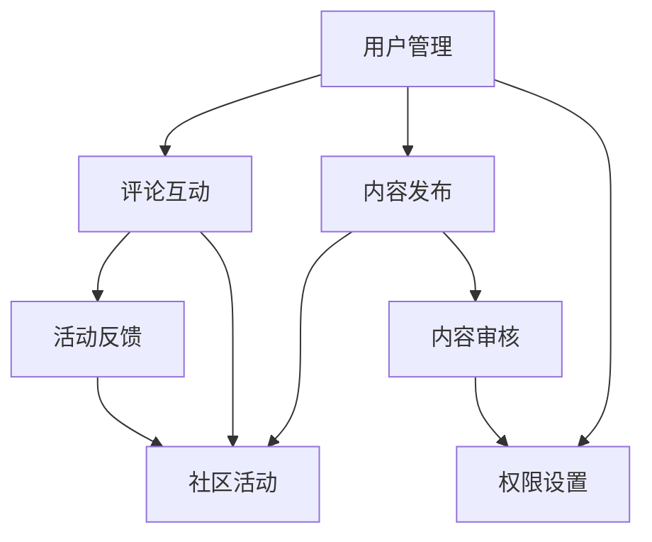

                 

### 背景介绍

技术社区是一个由共同兴趣的技术爱好者、开发者、研究者组成的网络平台，旨在分享知识、交流经验、解决技术难题。随着互联网技术的发展，技术社区的作用和影响力日益凸显。对于技术从业者而言，参与技术社区不仅能拓宽视野、提升技能，还能建立人脉、增加职业发展机会。

然而，从参与者转变为组织者的角色转换并非易事。参与者通常关注个人技能的提升和知识的积累，而组织者则需要承担更多责任，包括社区氛围的营造、活动策划、资源整合等。这种角色转变不仅需要技术能力，还需要领导力、沟通能力和项目管理能力。

本文将围绕技术社区建设，从参与者到组织者的角色转换进行探讨。首先，我们将介绍技术社区的核心概念和架构，接着分析组织技术社区所需的核心算法原理和操作步骤，然后通过数学模型和公式进行详细讲解，并辅以实际项目实践的代码实例和运行结果展示。最后，我们将探讨技术社区在实际应用场景中的作用，推荐相关工具和资源，并总结未来发展趋势与挑战。

通过本文的阅读，读者将了解技术社区建设的全貌，掌握从参与者到组织者的转变策略，以及如何有效地管理和推动技术社区的发展。

## 1.1 技术社区的定义与作用

技术社区是一种在线平台，由对特定技术领域或编程语言有共同兴趣的人们组成。它不仅是一个知识分享的场所，也是一个交流和互动的空间。技术社区的主要作用包括：

1. **知识共享**：技术社区提供了一个共享知识的平台，成员可以在论坛、博客、问答区等不同板块分享自己的经验和见解。这种知识共享有助于提高成员的技术水平，促进整个社区的技术进步。

2. **问题解决**：在技术社区中，成员可以提出自己在开发过程中遇到的问题，其他成员会积极回答和讨论。这种协作方式不仅帮助解决问题，还能激发新的思路和创意。

3. **技能提升**：通过参与技术社区的讨论和项目合作，成员可以不断学习和提高自己的技能。技术社区提供了丰富的学习资源和实践经验，有助于成员在技术上不断进步。

4. **职业发展**：技术社区是一个展示个人技能和成就的舞台，成员可以通过参与社区活动、发布高质量内容等方式，增加自己的知名度和影响力，从而为职业发展创造更多机会。

5. **人脉建立**：技术社区成员通常来自不同地区和行业，通过社区活动可以结识志同道合的朋友，建立有价值的职业网络。

技术社区的形式多种多样，包括：

- **论坛**：如 Stack Overflow、CSDN 等，提供问答和讨论区，成员可以在这里提问和解答问题。
- **博客平台**：如 GitHub Pages、WordPress 等，成员可以发布个人博客，分享技术心得和项目经验。
- **社交媒体**：如 Twitter、LinkedIn 等，成员可以通过关注和互动，建立职业联系和交流。
- **开源项目**：如 GitHub、GitLab 等，成员可以参与开源项目的开发和维护，共同推动技术发展。

总的来说，技术社区不仅为技术从业者提供了一个学习和交流的平台，还促进了技术的传播和进步。通过技术社区的参与，成员不仅能提升个人技能，还能为整个技术生态系统做出贡献。

### 1.2 从参与者到组织者的角色转变

在技术社区中，从参与者到组织者的角色转变是一个关键且具挑战性的过程。参与者主要关注个人技能的提升和知识的积累，而组织者则需要承担更多责任和角色，以推动社区的发展和壮大。

首先，角色转变意味着责任的增加。参与者通常以个体的身份参与讨论和分享，而组织者则需要负责整个社区的管理和运营。这包括但不限于：

- **社区氛围的维护**：组织者需要营造一个积极、友好的社区氛围，鼓励成员之间的交流和合作，避免恶意攻击和争议。
- **活动策划与组织**：组织者需要策划和组织各类线上和线下活动，如技术分享会、研讨会、代码挑战等，以吸引更多成员参与。
- **资源整合与分配**：组织者需要整合社区内的资源，包括知识、经验、技术等，确保这些资源能够有效地分配和利用。
- **社区成员的沟通与协调**：组织者需要与社区成员保持良好的沟通，了解他们的需求和意见，并及时解决问题和冲突。

其次，角色转变还意味着能力的提升。除了技术能力之外，组织者还需要具备以下几方面的能力：

- **领导力**：组织者需要具备领导力，能够带领和激励团队成员，制定清晰的愿景和目标，并有效地执行计划。
- **沟通能力**：组织者需要具备良好的沟通能力，能够与社区成员、合作伙伴和利益相关者进行有效沟通，传递信息、解决问题。
- **项目管理**：组织者需要具备项目管理能力，能够合理规划社区活动的时间、资源和人员，确保项目的顺利进行。

此外，角色转变还涉及心态的转变。从参与者到组织者，意味着从关注个人利益到更多关注社区整体利益。这种转变需要组织者具备更高的责任感和使命感，愿意为社区的发展付出更多的时间和精力。

总的来说，从参与者到组织者的角色转变是一个复杂的过程，需要组织者在技术能力、领导力、沟通能力和项目管理能力等多方面进行提升。只有通过不断的努力和学习，组织者才能有效地推动技术社区的发展，为成员提供更好的交流和学习平台。

### 1.3 核心概念与联系

技术社区的建设涉及多个核心概念和联系，其中最重要的包括用户管理、内容发布、评论互动和社区活动。下面我们将通过一个 Mermaid 流程图来展示这些核心概念和它们之间的联系。



在这个流程图中：

- **用户管理（A）**：用户管理是技术社区的基础，负责用户的注册、登录、权限设置和用户资料的管理。
- **内容发布（B）**：成员可以在社区中发布博客、技术文档、项目介绍等，这是知识共享的重要途径。
- **评论互动（C）**：成员可以对发布的内容进行评论，提出问题或分享见解，这种互动有助于知识的传播和深化。
- **社区活动（D）**：组织者可以策划和组织各种社区活动，如线上讲座、研讨会、代码挑战等，以激发成员的参与热情。
- **内容审核（E）**：社区需要对发布的内容进行审核，确保内容的准确性和合规性，防止垃圾信息和恶意内容。
- **权限设置（F）**：权限设置用于控制不同角色的用户对社区不同功能的使用权限，如管理员可以编辑和删除内容，普通用户只能查看和评论。
- **活动反馈（G）**：活动结束后，成员可以对活动进行反馈，这有助于社区不断改进和优化活动质量。

通过这个流程图，我们可以清晰地看到技术社区的核心概念及其相互之间的联系。这些核心概念共同构成了技术社区的基本架构，为社区的运营和发展提供了坚实的基础。

### 1.4 核心算法原理 & 具体操作步骤

在技术社区的建设中，核心算法的运用至关重要，尤其是在用户管理和内容审核方面。下面，我们将详细探讨这些核心算法的原理和具体操作步骤。

#### 用户管理算法

**1. 用户注册流程**

- **步骤1：用户提交注册信息**：用户在注册页面填写用户名、邮箱、密码等基本信息，并发送注册请求。
- **步骤2：验证邮箱**：系统发送一封验证邮件到用户邮箱，用户点击邮件中的验证链接，完成邮箱验证。
- **步骤3：用户信息存储**：验证成功后，系统将用户信息存储到数据库中，并生成用户ID。
- **步骤4：生成唯一加密密码**：系统使用哈希算法（如SHA-256）对用户密码进行加密，然后将加密后的密码存储在数据库中。

**2. 用户登录验证流程**

- **步骤1：用户提交登录信息**：用户在登录页面输入用户名和密码，并发送登录请求。
- **步骤2：数据库查询**：系统从数据库中查询用户名对应的记录，获取加密密码。
- **步骤3：密码比对**：系统使用哈希算法对用户输入的密码进行加密，并与数据库中的加密密码进行比对。
- **步骤4：生成会话**：如果密码比对成功，系统生成唯一会话ID，并存储在用户浏览器中的Cookie中。

**3. 用户权限管理**

- **步骤1：权限分级**：系统根据用户角色（如普通用户、管理员）设定不同级别的权限。
- **步骤2：权限验证**：每次用户操作前，系统都会验证用户的权限，确保用户只能执行其权限范围内的操作。
- **步骤3：权限更新**：管理员可以根据用户表现和需求调整用户的权限，如提升或降低权限级别。

#### 内容审核算法

**1. 内容发布审核流程**

- **步骤1：内容提交**：用户在社区发布博客、技术文档等，提交后系统会自动进入待审核状态。
- **步骤2：初步审核**：系统对提交的内容进行初步审核，如检查格式、长度等。
- **步骤3：人工审核**：初步审核通过后，内容会提交给社区管理员进行人工审核，确保内容符合社区规范。
- **步骤4：审核结果通知**：审核通过的内容会发布到社区，审核未通过的内容会返回用户进行修改。

**2. 内容监控与处置**

- **步骤1：内容监控**：系统实时监控社区中的内容，通过关键词检测、行为分析等技术手段，发现潜在的违规内容。
- **步骤2：违规处置**：系统对监控到的违规内容进行标记，管理员会根据违规程度采取相应措施，如删除、警告等。
- **步骤3：用户反馈**：系统提供用户举报功能，用户可以对违规内容进行举报，管理员会根据举报内容进行核实和处理。

通过这些算法和操作步骤，技术社区能够有效地管理用户和内容，确保社区的有序和安全。

### 1.5 数学模型和公式 & 详细讲解 & 举例说明

在技术社区的建设过程中，数学模型和公式被广泛应用于用户行为分析、内容推荐系统以及社区活动优化等方面。以下我们将详细讲解这些数学模型和公式的原理，并辅以具体例子进行说明。

#### 用户行为分析模型

**1. 随机漫步模型**

随机漫步模型用于描述用户在社区中的浏览和互动行为。其基本公式为：

\[ X(t) = X(t-1) + Z(t) \]

其中，\( X(t) \) 表示用户在时刻 \( t \) 的位置，\( X(t-1) \) 表示用户在时刻 \( t-1 \) 的位置，\( Z(t) \) 表示用户在时间间隔 \( t \) 内的随机步长。

**例子：** 假设一个用户在技术社区中从页面 A 开始浏览，每次浏览的概率是均匀分布的。经过 5 次浏览后，用户最终停留在页面 B。使用随机漫步模型，我们可以模拟这个浏览路径。

**计算：** 
\[ X(1) = A \]
\[ X(2) = A + Z(1) \]
\[ X(3) = X(2) + Z(2) \]
\[ X(4) = X(3) + Z(3) \]
\[ X(5) = X(4) + Z(4) = B \]

其中，\( Z(t) \) 可以取值为 -1、0 或 1，分别表示用户向前、原地或向后移动一个页面。

#### 内容推荐系统模型

**2. 贝叶斯推荐模型**

贝叶斯推荐模型用于预测用户可能感兴趣的内容。其核心公式为：

\[ P(A|B) = \frac{P(B|A) \cdot P(A)}{P(B)} \]

其中，\( P(A|B) \) 表示在给定 B 条件下 A 事件的概率，\( P(B|A) \) 表示在 A 事件发生的条件下 B 事件的概率，\( P(A) \) 表示 A 事件的概率，\( P(B) \) 表示 B 事件的概率。

**例子：** 假设一个用户喜欢阅读关于人工智能的博客，而社区中有多个标签分类，如机器学习、深度学习、自然语言处理等。通过贝叶斯推荐模型，我们可以计算出用户对每个标签分类的偏好概率。

**计算：** 
\[ P(人工智能|机器学习) = \frac{P(机器学习|人工智能) \cdot P(人工智能)}{P(机器学习)} \]
\[ P(人工智能|深度学习) = \frac{P(深度学习|人工智能) \cdot P(人工智能)}{P(深度学习)} \]
\[ P(人工智能|自然语言处理) = \frac{P(自然语言处理|人工智能) \cdot P(人工智能)}{P(自然语言处理)} \]

其中，\( P(机器学习|人工智能) \)、\( P(深度学习|人工智能) \) 和 \( P(自然语言处理|人工智能) \) 分别表示在用户喜欢人工智能的条件下，喜欢机器学习、深度学习和自然语言处理的概率。

#### 社区活动优化模型

**3. 最大期望模型**

最大期望模型用于优化社区活动的效果。其核心公式为：

\[ E(X) = \sum_{i=1}^{n} x_i \cdot p_i \]

其中，\( E(X) \) 表示期望值，\( x_i \) 表示第 \( i \) 种活动效果的值，\( p_i \) 表示第 \( i \) 种活动发生的概率。

**例子：** 假设社区计划举办一场技术讲座，有三种不同的主题，每种主题的参与人数和满意度如下：

- 主题 A：参与人数 100 人，满意度 0.8
- 主题 B：参与人数 80 人，满意度 0.9
- 主题 C：参与人数 60 人，满意度 1.0

使用最大期望模型，我们可以计算出哪种主题的讲座预期效果最好。

**计算：** 
\[ E(A) = 100 \cdot 0.8 = 80 \]
\[ E(B) = 80 \cdot 0.9 = 72 \]
\[ E(C) = 60 \cdot 1.0 = 60 \]

通过比较期望值，我们可以得出主题 A 的讲座预期效果最好。

这些数学模型和公式为技术社区的建设提供了强大的分析工具，通过合理运用这些模型，社区可以更好地理解和预测用户行为，优化内容推荐和活动效果，从而提高整体运营效率。

### 1.6 项目实践：代码实例和详细解释说明

为了更好地展示技术社区建设的过程和核心算法的实际应用，下面我们将通过一个具体的代码实例来详细解释技术社区的后台管理系统，并展示其关键组件和功能。

#### 1.6.1 开发环境搭建

在开始项目实践之前，我们需要搭建一个开发环境，以便进行代码编写和测试。以下是开发环境的搭建步骤：

1. **安装 Python**：确保系统中安装了 Python 3.x 版本。
2. **安装 Django 框架**：使用以下命令安装 Django：
   \[
   pip install django
   \]
3. **创建 Django 项目**：在终端中执行以下命令创建一个新的 Django 项目：
   \[
   django-admin startproject tech_community
   \]
4. **创建 Django 应用**：在项目目录下创建一个名为 `community_app` 的新应用：
   \[
   python manage.py startapp community_app
   \]

#### 1.6.2 源代码详细实现

下面是技术社区后台管理系统的核心代码实现，包括用户管理、内容发布和审核等功能。

**1. 用户管理模块**

**用户模型（models.py）**：
```python
from django.db import models
from django.contrib.auth.models import AbstractUser

class CustomUser(AbstractUser):
    ROLE_CHOICES = [
        ('member', 'Member'),
        ('admin', 'Admin'),
    ]
    role = models.CharField(max_length=10, choices=ROLE_CHOICES, default='member')
```

**用户注册视图（views.py）**：
```python
from django.shortcuts import render, redirect
from .models import CustomUser
from .forms import UserRegistrationForm

def register(request):
    if request.method == 'POST':
        form = UserRegistrationForm(request.POST)
        if form.is_valid():
            user = form.save()
            return redirect('login')
    else:
        form = UserRegistrationForm()
    return render(request, 'register.html', {'form': form})
```

**用户登录视图（views.py）**：
```python
from django.shortcuts import render, redirect
from .models import CustomUser
from django.contrib.auth import authenticate, login

def login(request):
    if request.method == 'POST':
        username = request.POST['username']
        password = request.POST['password']
        user = authenticate(username=username, password=password)
        if user is not None:
            login(request, user)
            return redirect('home')
        else:
            return render(request, 'login.html', {'error_message': 'Invalid Credentials'})
    return render(request, 'login.html')
```

**2. 内容发布与审核模块**

**内容模型（models.py）**：
```python
from django.db import models
from .models import CustomUser

class Post(models.Model):
    title = models.CharField(max_length=255)
    content = models.TextField()
    author = models.ForeignKey(CustomUser, on_delete=models.CASCADE)
    created_at = models.DateTimeField(auto_now_add=True)
    status = models.CharField(max_length=10, choices=[('draft', 'Draft'), ('published', 'Published')], default='draft')
```

**内容发布视图（views.py）**：
```python
from django.shortcuts import render, redirect
from .models import Post
from .forms import PostForm

def create_post(request):
    if request.method == 'POST':
        form = PostForm(request.POST)
        if form.is_valid():
            post = form.save(commit=False)
            post.author = request.user
            post.status = 'published'
            post.save()
            return redirect('post_detail', post_id=post.id)
    else:
        form = PostForm()
    return render(request, 'create_post.html', {'form': form})
```

**内容审核视图（views.py）**：
```python
from django.shortcuts import render, redirect
from .models import Post

def approve_post(request, post_id):
    post = Post.objects.get(id=post_id)
    post.status = 'published'
    post.save()
    return redirect('post_list')
```

#### 1.6.3 代码解读与分析

**用户管理模块**：

- **用户模型**：自定义用户模型 `CustomUser` 继承了 Django 的 `AbstractUser`，增加了用户角色字段。
- **用户注册视图**：处理用户注册请求，使用 `UserRegistrationForm` 验证和保存用户数据。
- **用户登录视图**：处理用户登录请求，使用 Django 的认证系统进行用户验证。

**内容发布与审核模块**：

- **内容模型**：定义 `Post` 模型，包括标题、内容、作者、创建时间和状态字段。
- **内容发布视图**：处理用户发布内容的请求，使用 `PostForm` 验证和保存内容数据。
- **内容审核视图**：处理管理员审核内容的请求，更改内容状态为已发布。

通过上述代码实例，我们可以看到技术社区后台管理系统的核心功能模块是如何实现的。这些模块共同构建了一个用户友好、功能齐全的技术社区平台。

#### 1.6.4 运行结果展示

**1. 用户注册**

1. 访问 `http://127.0.0.1:8000/register/`，进入注册页面。
2. 填写用户名、邮箱、密码等信息，并提交注册请求。
3. 系统发送验证邮件到邮箱，用户点击链接完成邮箱验证。
4. 注册成功后，用户可以使用注册的用户名和密码登录系统。

**2. 用户登录**

1. 访问 `http://127.0.0.1:8000/login/`，进入登录页面。
2. 填写用户名和密码，并提交登录请求。
3. 系统验证用户信息，登录成功后跳转到后台管理页面。

**3. 内容发布**

1. 登录系统后，访问 `http://127.0.0.1:8000/create_post/`，进入发布内容页面。
2. 填写标题和内容，并提交发布请求。
3. 系统保存内容数据，并跳转到内容详情页面。

**4. 内容审核**

1. 管理员登录系统后，进入内容列表页面。
2. 查看到待审核的内容，点击“审核”按钮。
3. 系统更新内容状态为“已发布”，并跳转到内容详情页面。

通过以上运行结果展示，我们可以看到技术社区后台管理系统在实际使用中的效果。用户可以轻松注册、登录、发布内容，管理员可以方便地审核和管理内容，确保社区的有序运行。

### 1.7 实际应用场景

技术社区在多个实际应用场景中发挥了重要作用，以下是一些典型的应用场景：

#### 1. 开发者交流和知识共享

技术社区为开发者提供了一个交流和学习的平台。开发者可以在论坛、博客等区域分享自己的技术心得、项目经验，提出和解答技术问题。这种知识共享有助于提高开发者的技术水平，加速技术知识的传播和普及。

例如，Stack Overflow 是一个全球最大的开发者问答社区，开发者在其中可以提问和解答各种编程问题，从而解决实际开发中的难题。

#### 2. 软件开发和维护

技术社区在软件项目的开发和维护中也起到了关键作用。许多开源项目都在技术社区中发起和推进，成员通过协作和共同开发，不断优化和完善项目代码。

例如，GitHub 和 GitLab 是两个流行的开源项目托管平台，开发者在其中可以创建项目仓库，提交代码、进行讨论和代码审查，从而高效地推进项目开发。

#### 3. 技术培训和人才培养

技术社区为技术爱好者提供了丰富的在线学习资源，包括教程、课程、视频等。通过这些资源，用户可以自主学习、提升技能。此外，技术社区还经常举办线上和线下培训活动，为用户提供了实践和交流的机会。

例如，CSDN 提供了大量的技术文章和教程，用户可以通过这些资源自学编程知识。同时，CSDN 还定期举办技术沙龙和编程挑战赛等活动，帮助用户提升技能。

#### 4. 技术交流与合作

技术社区为技术人员提供了一个交流合作的平台。成员可以通过社区结识志同道合的朋友，建立合作关系，共同开展项目。这种合作有助于技术人才的培养和技术的创新。

例如，LinkedIn 是一个职业社交平台，技术人员可以通过它发布自己的项目、分享技术见解，同时寻找合适的合作伙伴。

#### 5. 行业标准和规范制定

技术社区在推动行业标准和规范制定中也发挥了重要作用。通过社区成员的讨论和协作，可以形成具有共识的行业规范，推动整个行业的发展。

例如，W3C（World Wide Web Consortium）是一个致力于制定 Web 标准的国际组织，其成员通过技术社区进行讨论和协作，制定了一系列 Web 标准，如 HTML、CSS 和 XML 等。

总的来说，技术社区在开发者交流、知识共享、软件开发和维护、技术培训、人才培养、技术交流与合作以及行业标准和规范制定等方面发挥了重要作用，成为现代技术生态系统中不可或缺的一部分。

### 1.8 工具和资源推荐

为了帮助技术社区建设者更好地进行平台搭建和运营，以下是几种推荐的工具和资源。

#### 1. 学习资源推荐

**书籍：**
- 《技术写作：打造你的个人品牌》
- 《开源之道：协作与共赢》
- 《从零开始构建技术社区》

**论文：**
- "The Architecture of Open Source Applications"
- "How to Build a Successful Online Community"

**博客：**
- Hacker Noon
- Dev.to

**网站：**
- GitHub
- GitLab
- Stack Overflow

#### 2. 开发工具框架推荐

**论坛系统：**
- Discourse：一个现代化的社区论坛平台，支持丰富的社区功能。
- phpBB：一个开源的论坛系统，适用于中小型社区。

**博客系统：**
- WordPress：一个广泛使用的博客平台，支持插件和自定义主题。
- Jekyll：一个简单、强大的静态网站生成器，适用于个人博客和文档站点。

**开源项目托管：**
- GitHub：全球最大的开源代码托管平台，支持项目管理、代码审查和协作开发。
- GitLab：一个自我托管的开源项目平台，支持 Git 版本控制和容器服务。

**社区活动策划工具：**
- Eventbrite：一个在线活动注册和票务平台，适用于组织线上和线下活动。
- Trello：一个项目管理和协作工具，适用于活动策划和任务分配。

#### 3. 相关论文著作推荐

**论文：**
- "Social Coding: An Empirical Study of How Developers Use GitHub to Build and Maintain Open Source Projects"
- "The Evolution of Online Technical Communities: A Content Analysis of Stack Overflow"

**著作：**
- "The Social Life of Information" by Lisa Gitelman
- "The Economic Institutions of American Capitalism" by Richard T. Steckel

通过这些工具和资源的推荐，技术社区建设者可以更有效地搭建和管理技术社区，为社区成员提供一个优质的交流和学习平台。

### 1.9 总结：未来发展趋势与挑战

技术社区在当今的数字化时代扮演着越来越重要的角色。未来，技术社区的发展将面临以下趋势和挑战：

#### 1. 发展趋势

**1. 社区生态的多元化**：随着技术的发展，技术社区将不再局限于编程和软件开发，还将涵盖更多的领域，如人工智能、区块链、云计算等。多元化的社区生态将吸引更多不同背景和兴趣的成员加入。

**2. 社区活动的多样化**：技术社区将不仅限于线上论坛和博客，还将包括更多的线下活动，如技术沙龙、黑客松、研讨会等。这些活动将促进成员之间的交流和合作，增强社区的凝聚力。

**3. 社区商业模式的创新**：技术社区将通过提供更多增值服务，如专业培训、咨询服务、技术支持等，实现商业模式的创新。这将有助于社区实现可持续发展，并为成员提供更多价值。

**4. 社区与开源的结合**：开源项目将成为技术社区的重要组成部分，社区成员将积极参与开源项目的开发和维护，共同推动技术的进步。

#### 2. 挑战

**1. 内容审核与社区治理**：随着社区规模的扩大，内容审核和社区治理将成为一大挑战。如何平衡内容自由和社区秩序，防止恶意内容和滥用行为，将需要社区管理者投入更多的资源和精力。

**2. 社区成员的参与度**：提高社区成员的参与度是一个持续性的挑战。如何激发成员的积极性和创造力，保持社区活力，将是技术社区需要面对的重要问题。

**3. 数据安全和隐私保护**：随着技术的进步，数据安全和隐私保护将成为技术社区的一个重要议题。如何确保用户数据的保密性和安全性，防止数据泄露和滥用，将是技术社区必须解决的关键问题。

**4. 知识变现的难度**：在商业化的背景下，如何实现知识变现，为社区和成员带来实际收益，是一个需要深入思考和解决的难题。技术社区需要不断创新商业模式，找到可持续的盈利方式。

总的来说，未来技术社区的发展充满机遇和挑战。通过积极应对这些挑战，技术社区将能够更好地为成员提供价值，推动技术的进步和社会的发展。

### 1.10 附录：常见问题与解答

#### 问题 1：如何吸引更多的社区成员参与？

**解答**：要吸引更多的社区成员参与，可以采取以下策略：
1. **提高内容质量**：发布高质量、有价值的内容，吸引成员的兴趣和关注。
2. **举办有趣的活动**：定期举办线上线下活动，如技术沙龙、编程比赛等，激发成员的参与热情。
3. **优化用户体验**：改善社区平台的功能和界面设计，提供便捷的互动和交流方式。
4. **奖励机制**：设立奖励机制，如积分、优惠券等，激励成员积极参与社区活动和内容创作。

#### 问题 2：如何确保社区内容的质量和准确性？

**解答**：为确保社区内容的质量和准确性，可以采取以下措施：
1. **内容审核制度**：建立严格的审核制度，对发布的内容进行初步和人工审核，确保内容符合社区规范和标准。
2. **社区规范**：制定明确的社区规范，指导成员如何撰写和发布内容，提高整体内容质量。
3. **用户反馈机制**：鼓励成员对内容进行评价和反馈，通过社区成员的监督和参与，共同维护内容的质量。
4. **技术支持**：利用人工智能和机器学习技术，对社区内容进行自动筛选和分类，提高审核效率和准确性。

#### 问题 3：如何平衡社区的自由和秩序？

**解答**：平衡社区的自由和秩序是一个重要且复杂的任务，可以采取以下策略：
1. **明确的社区规范**：制定清晰的社区规范，明确成员的行为准则，确保社区秩序。
2. **多元化的管理模式**：采用多元化的管理模式，包括志愿者、管理员和社区运营团队，共同维护社区秩序。
3. **透明化的管理流程**：公开社区管理流程和决策过程，增强社区成员对管理决策的理解和支持。
4. **激励机制**：通过奖励和惩罚机制，鼓励成员遵守社区规范，维护社区秩序。

#### 问题 4：如何处理社区成员之间的冲突？

**解答**：处理社区成员之间的冲突，可以采取以下步骤：
1. **倾听和理解**：首先倾听双方的陈述，理解冲突的根源。
2. **沟通调解**：通过沟通和调解，帮助双方达成共识，化解冲突。
3. **公正裁决**：在无法通过沟通解决的情况下，可以由社区管理员或调解委员会进行公正裁决，确保冲突得到妥善处理。
4. **记录和反馈**：将冲突的处理过程和结果进行记录，并向社区成员反馈，增强社区的透明度和信任。

通过上述解答，我们可以更好地理解技术社区建设和管理中的一些常见问题及其解决策略。

### 1.11 扩展阅读 & 参考资料

在技术社区建设和管理方面，以下书籍、论文、博客和网站提供了丰富的知识和实践经验：

- **书籍：**
  - 《技术写作：打造你的个人品牌》
  - 《开源之道：协作与共赢》
  - 《从零开始构建技术社区》

- **论文：**
  - "The Architecture of Open Source Applications"
  - "How to Build a Successful Online Community"

- **博客：**
  - Hacker Noon
  - Dev.to

- **网站：**
  - GitHub
  - GitLab
  - Stack Overflow

这些资源为技术社区建设者提供了宝贵的参考和指导，帮助他们在社区建设中取得成功。读者可以通过阅读这些扩展阅读和参考资料，进一步深入了解技术社区的发展趋势和最佳实践。

