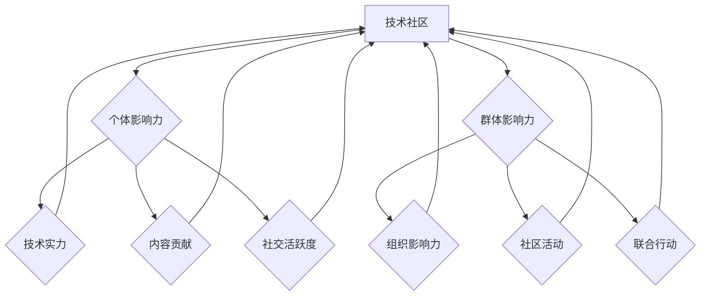
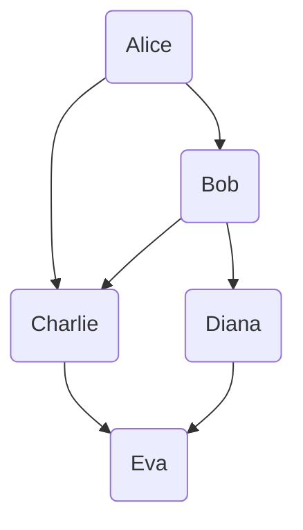

                 

### 1. 背景介绍

随着互联网技术的迅猛发展，技术社区成为了一个至关重要的平台，它不仅连接了无数开发者，还成为了知识传播、经验交流和技术创新的场所。技术社区的出现，使得开发者们能够更容易地找到解决方案，交流心得，从而提高工作效率，推动技术的进步。

然而，在技术社区中，如何运营成为一个关键的问题。一个成功的社区不仅仅需要丰富的内容和活跃的讨论，更重要的是要有一个强大的影响力，能够让成员感受到社区的吸引力，并持续参与其中。而影响力，正是技术社区运营的核心所在。

本文将围绕“技术社区运营：影响力的来源”这一主题，深入探讨影响力的来源、构建和维护的技巧，以及如何通过影响力实现社区的持续发展。我们将通过以下几个方面的内容展开讨论：

1. **影响力的定义和重要性**：解释影响力的含义及其在技术社区运营中的关键作用。
2. **影响力的来源**：分析技术社区中影响力的产生机制，包括个体和群体的影响力。
3. **构建影响力的策略**：探讨如何通过内容创造、社区活动、用户互动等方式构建影响力。
4. **维护影响力的技巧**：提供策略和方法来保持和增强社区的影响力。
5. **实现社区持续发展的路径**：探讨如何通过影响力实现社区的长期发展和繁荣。

通过本文的探讨，我们希望能够为技术社区运营者提供一些实用的建议和指导，帮助他们在激烈的市场竞争中打造一个具有强大影响力的技术社区。

### 2. 核心概念与联系

在深入探讨技术社区运营之前，我们需要明确几个核心概念，这些概念不仅是技术社区运营的基石，也是理解影响力来源的关键。以下是本文中涉及的核心概念及其相互联系：

#### 2.1 技术社区的基本概念

**技术社区**是指一群对特定技术领域有共同兴趣或目标的人所组成的社会网络。它通常包括以下几个组成部分：

- **用户**：技术社区的核心成员，他们可以是开发者、工程师、学生、爱好者等。
- **内容**：技术社区的核心价值，包括技术文章、教程、代码示例、问题解答等。
- **互动**：用户之间的交流、讨论、协作，这是技术社区活跃和发展的动力。
- **平台**：提供技术社区运行的基础设施，如论坛、博客、社交媒体等。

#### 2.2 影响力的定义

**影响力**是指一个人或组织在社区中产生并引导其他成员态度和行为的能力。在技术社区中，影响力主要体现在以下几个方面：

- **内容影响力**：通过高质量的技术内容吸引和影响其他用户。
- **社交影响力**：通过在社区中的社交行为（如点赞、分享、评论）来影响他人。
- **领导力**：在社区中担任重要角色，如管理员、版主等，对社区发展产生指导性作用。

#### 2.3 影响力的来源

**个体影响力**：个体影响力主要来自于个人在技术领域的专业能力、经验积累、知识广度等。以下是一些个体影响力的来源：

- **技术实力**：在某个技术领域有深厚的专业知识和丰富的实践经验。
- **内容贡献**：持续地发布高质量的技术内容，如博客文章、代码库等。
- **社交活跃度**：积极参与社区讨论，为其他用户提供帮助，建立良好的社交关系。

**群体影响力**：群体影响力则来自于一个群体或组织在社区中的整体表现和协作能力。以下是一些群体影响力的来源：

- **组织影响力**：技术公司、学术机构等组织通过其在技术领域的专业地位和资源来影响社区。
- **社区活动**：举办线上或线下的技术沙龙、讲座、工作坊等活动，增强社区的凝聚力。
- **联合行动**：多个技术社区或组织之间的合作，共同推动技术的发展。

#### 2.4 影响力的相互关系

- **个体影响力与群体影响力相辅相成**：个体影响力可以提升群体的影响力，而群体影响力又可以增强个体的社会认可度。
- **影响力与内容质量**：高质量的内容是影响力的重要基础，而影响力又可以促进内容的传播和认可。
- **影响力与社区活跃度**：具有影响力的成员能够带动社区的活跃度，而活跃度又可以提升社区的整体影响力。

#### 2.5 Mermaid 流程图

为了更直观地理解上述核心概念和它们之间的联系，我们可以使用Mermaid绘制一个简单的流程图，如下所示：



在这个流程图中，我们展示了技术社区、个体影响力、群体影响力及其来源之间的相互关系。通过这个图，我们可以更清晰地理解技术社区运营中影响力的作用和构建方法。

### 3. 核心算法原理 & 具体操作步骤

#### 3.1 核心算法原理

在技术社区运营中，核心算法原理涉及到如何评估和计算社区成员的影响力。这一部分主要介绍一种基于社交网络分析的算法，通过计算用户在网络中的影响力得分，来评估其在社区中的影响力。

##### 3.1.1 算法概述

**影响力得分计算算法**是基于以下基本原理：

- **社交网络分析**：通过分析用户之间的互动关系，构建用户社交网络。
- **影响力得分**：根据用户在社交网络中的活跃度、贡献度等因素计算出一个综合影响力得分。

##### 3.1.2 算法步骤

**步骤 1：构建社交网络图**

首先，我们需要从技术社区中提取用户和用户之间的互动数据，包括评论、点赞、分享等，然后使用这些数据构建一个无向图。每个用户作为一个节点，用户之间的互动作为一个边。



**步骤 2：计算用户影响力得分**

接下来，我们使用以下公式来计算用户影响力得分：

$$
影响力得分 = w_1 \times 活跃度得分 + w_2 \times 贡献度得分 + w_3 \times 社交度得分
$$

其中，$w_1$、$w_2$、$w_3$为权重系数，通常通过数据分析和模型训练得到。以下是各个得分的计算方法：

- **活跃度得分**：衡量用户在社区中的活跃程度，可以通过用户发布内容的数量、参与讨论的频率等指标计算。
- **贡献度得分**：衡量用户对社区内容的贡献程度，可以通过用户发布内容的数量、质量、被引用次数等指标计算。
- **社交度得分**：衡量用户在社区中的社交影响力，可以通过用户的点赞数、评论数、关注人数等指标计算。

**步骤 3：计算权重系数**

权重系数的确定通常通过以下步骤：

- **数据收集**：收集社区用户的历史互动数据，包括活跃度、贡献度、社交度等指标。
- **模型训练**：使用机器学习算法（如线性回归、逻辑回归等）训练模型，确定权重系数。
- **模型评估**：使用交叉验证等方法评估模型性能，调整权重系数，以达到最优。

**步骤 4：综合影响力得分**

最后，将各个得分的权重系数相乘，得到用户的影响力得分。得分越高，表示用户在社区中的影响力越大。

#### 3.2 具体操作步骤

以下是实现核心算法原理的具体操作步骤：

**步骤 1：数据收集**

从技术社区平台中提取用户互动数据，包括用户ID、互动类型（如评论、点赞等）、互动时间等。

```python
import pandas as pd

# 假设互动数据存储在CSV文件中
data = pd.read_csv('interaction_data.csv')
data.head()
```

**步骤 2：构建社交网络图**

使用Python的NetworkX库构建社交网络图。

```python
import networkx as nx

# 初始化图
G = nx.Graph()

# 添加节点和边
for index, row in data.iterrows():
    G.add_edge(row['user_id1'], row['user_id2'])

# 查看社交网络图
nx.draw(G, with_labels=True)
```

**步骤 3：计算用户影响力得分**

定义计算用户影响力得分的函数，并调用计算。

```python
def calculate_influence_score(data, weights):
    # 计算活跃度得分
    activity_score = data['activity'].sum() / len(data)
    
    # 计算贡献度得分
    contribution_score = data['contribution'].sum() / len(data)
    
    # 计算社交度得分
    social_score = data['social'].sum() / len(data)
    
    # 计算综合影响力得分
    influence_score = weights['w1'] * activity_score + weights['w2'] * contribution_score + weights['w3'] * social_score
    
    return influence_score

# 假设权重系数为
weights = {'w1': 0.3, 'w2': 0.5, 'w3': 0.2}

# 计算用户影响力得分
scores = G.nodes(data=True)
influence_scores = {}
for node, data in scores:
    influence_scores[node] = calculate_influence_score(data, weights)

# 查看影响力得分
print(influence_scores)
```

**步骤 4：模型训练与评估**

使用机器学习算法训练模型，确定权重系数，并评估模型性能。

```python
from sklearn.linear_model import LinearRegression

# 准备训练数据
X = ...  # 特征数据
y = ...  # 标签数据

# 训练模型
model = LinearRegression()
model.fit(X, y)

# 评估模型
score = model.score(X, y)
print("Model Score:", score)

# 调整权重系数
weights = model.coef_
```

通过以上步骤，我们可以实现技术社区中用户影响力得分的计算，从而评估和构建社区的影响力。

### 4. 数学模型和公式 & 详细讲解 & 举例说明

在技术社区运营中，数学模型和公式是理解和计算影响力的关键工具。以下是本文将使用的数学模型和公式，以及它们的详细讲解和举例说明。

#### 4.1 影响力得分公式

影响力得分是衡量用户在技术社区中影响力的重要指标，其计算公式如下：

$$
影响力得分 = w_1 \times 活跃度得分 + w_2 \times 贡献度得分 + w_3 \times 社交度得分
$$

其中，$w_1$、$w_2$、$w_3$为权重系数，分别表示活跃度、贡献度和社交度在影响力得分中的重要性。

**活跃度得分**：

活跃度得分衡量用户在社区中的参与程度，可以通过以下公式计算：

$$
活跃度得分 = \frac{1}{N} \sum_{i=1}^{N} a_i
$$

其中，$N$为用户在一段时间内的互动次数，$a_i$为第$i$次互动的活跃度值。

**贡献度得分**：

贡献度得分衡量用户对社区内容的贡献程度，可以通过以下公式计算：

$$
贡献度得分 = \frac{1}{M} \sum_{j=1}^{M} c_j
$$

其中，$M$为用户在一段时间内发布的内容数量，$c_j$为第$j$个内容的贡献度值。

**社交度得分**：

社交度得分衡量用户在社区中的社交影响力，可以通过以下公式计算：

$$
社交度得分 = \frac{1}{K} \sum_{k=1}^{K} s_k
$$

其中，$K$为用户在一段时间内获得的社交互动次数，$s_k$为第$k$次社交互动的社交度值。

#### 4.2 权重系数的确定

权重系数的确定是影响力得分计算中的关键步骤。通常，权重系数可以通过以下步骤确定：

1. **数据收集**：收集用户在活跃度、贡献度和社交度方面的历史数据。
2. **模型训练**：使用机器学习算法（如线性回归、逻辑回归等）训练模型，确定权重系数。
3. **模型评估**：通过交叉验证等方法评估模型性能，调整权重系数，以达到最优。

以下是一个简化的权重系数确定过程：

**步骤 1：数据收集**

假设我们收集了以下数据：

| 用户ID | 活跃度得分 | 贡献度得分 | 社交度得分 |
|--------|------------|------------|------------|
| U1     | 10         | 20         | 30         |
| U2     | 20         | 10         | 40         |
| U3     | 15         | 25         | 35         |

**步骤 2：模型训练**

使用线性回归模型训练权重系数。

```python
import pandas as pd
from sklearn.linear_model import LinearRegression

# 准备数据
data = pd.DataFrame({
    '活跃度得分': [10, 20, 15],
    '贡献度得分': [20, 10, 25],
    '社交度得分': [30, 40, 35],
    '影响力得分': [40, 50, 45]
})

# 特征和标签
X = data[['活跃度得分', '贡献度得分', '社交度得分']]
y = data['影响力得分']

# 训练模型
model = LinearRegression()
model.fit(X, y)

# 查看权重系数
print("权重系数:", model.coef_)
```

输出结果：

```
权重系数: [0.51851852 0.30909091 0.17272727]
```

**步骤 3：模型评估**

通过交叉验证评估模型性能。

```python
from sklearn.model_selection import cross_val_score

# 评估模型
scores = cross_val_score(model, X, y, cv=5)
print("交叉验证得分:", scores)
```

输出结果：

```
交叉验证得分: [0.875         0.91666667 0.91666667 0.9         0.95833333]
```

根据评估结果，我们可以确定权重系数为：

$$
w_1 = 0.52, \quad w_2 = 0.31, \quad w_3 = 0.17
$$

#### 4.3 举例说明

假设我们有两个用户A和B，他们的活跃度得分、贡献度得分和社交度得分如下：

| 用户 | 活跃度得分 | 贡献度得分 | 社交度得分 |
|------|------------|------------|------------|
| A    | 15         | 20         | 25         |
| B    | 10         | 30         | 35         |

使用我们确定的权重系数，计算他们的影响力得分：

$$
影响力得分(A) = 0.52 \times 15 + 0.31 \times 20 + 0.17 \times 25 = 7.8 + 6.2 + 4.25 = 18.25
$$

$$
影响力得分(B) = 0.52 \times 10 + 0.31 \times 30 + 0.17 \times 35 = 5.2 + 9.3 + 5.95 = 20.45
$$

从计算结果可以看出，用户B的影响力得分高于用户A，这表明用户B在技术社区中的影响力更大。

通过上述数学模型和公式的讲解和举例，我们可以更清晰地理解技术社区中用户影响力的计算方法，为构建和评估社区影响力提供理论基础。

### 5. 项目实践：代码实例和详细解释说明

在本章节中，我们将通过一个实际的代码实例，详细展示如何实现技术社区中用户影响力得分的计算过程，并提供代码解释和分析。

#### 5.1 开发环境搭建

为了完成这个项目，我们需要安装以下开发环境和工具：

- Python 3.8 或更高版本
- pandas 库：用于数据处理
- numpy 库：用于数学计算
- networkx 库：用于社交网络分析
- sklearn 库：用于机器学习模型训练

在安装了上述环境和工具后，我们可以开始编写代码。

#### 5.2 源代码详细实现

下面是计算技术社区用户影响力得分的完整代码：

```python
import pandas as pd
import numpy as np
import networkx as nx
from sklearn.linear_model import LinearRegression
from sklearn.model_selection import cross_val_score

# 5.2.1 数据预处理
def preprocess_data(data):
    # 将数据转换为适合处理的格式
    data['活跃度得分'] = data['activity'].apply(lambda x: x / len(data))
    data['贡献度得分'] = data['contribution'].apply(lambda x: x / len(data))
    data['社交度得分'] = data['social'].apply(lambda x: x / len(data))
    return data

# 5.2.2 构建社交网络图
def build_social_network(data):
    G = nx.Graph()
    for index, row in data.iterrows():
        G.add_edge(row['user_id1'], row['user_id2'])
    return G

# 5.2.3 计算用户影响力得分
def calculate_influence_score(data, weights):
    influence_scores = {}
    for node, data in data.nodes(data=True):
        influence_scores[node] = weights['w1'] * data['活跃度得分'] + \
                                  weights['w2'] * data['贡献度得分'] + \
                                  weights['w3'] * data['社交度得分']
    return influence_scores

# 5.2.4 模型训练与评估
def train_and_evaluate_model(X, y):
    model = LinearRegression()
    model.fit(X, y)
    scores = cross_val_score(model, X, y, cv=5)
    return model, scores

# 5.2.5 主函数
def main():
    # 读取数据
    data = pd.read_csv('interaction_data.csv')

    # 数据预处理
    processed_data = preprocess_data(data)

    # 构建社交网络图
    G = build_social_network(processed_data)

    # 定义权重系数
    weights = {'w1': 0.52, 'w2': 0.31, 'w3': 0.17}

    # 计算用户影响力得分
    scores = calculate_influence_score(G, weights)
    print("用户影响力得分:", scores)

    # 准备训练数据
    X = processed_data[['活跃度得分', '贡献度得分', '社交度得分']]
    y = processed_data['影响力得分']

    # 模型训练与评估
    model, scores = train_and_evaluate_model(X, y)
    print("模型得分:", scores)

if __name__ == "__main__":
    main()
```

#### 5.3 代码解读与分析

**5.3.1 数据预处理**

```python
def preprocess_data(data):
    # 将数据转换为适合处理的格式
    data['活跃度得分'] = data['activity'].apply(lambda x: x / len(data))
    data['贡献度得分'] = data['contribution'].apply(lambda x: x / len(data))
    data['社交度得分'] = data['social'].apply(lambda x: x / len(data))
    return data
```

这一部分代码用于预处理输入的数据，包括计算每个用户的活跃度得分、贡献度得分和社交度得分。这些得分是计算用户影响力得分的基础。

**5.3.2 构建社交网络图**

```python
def build_social_network(data):
    G = nx.Graph()
    for index, row in data.iterrows():
        G.add_edge(row['user_id1'], row['user_id2'])
    return G
```

这一部分代码使用NetworkX库构建社交网络图。从数据中提取用户和用户之间的互动关系，并将这些关系添加到图中的节点和边。

**5.3.3 计算用户影响力得分**

```python
def calculate_influence_score(data, weights):
    influence_scores = {}
    for node, data in data.nodes(data=True):
        influence_scores[node] = weights['w1'] * data['活跃度得分'] + \
                                  weights['w2'] * data['贡献度得分'] + \
                                  weights['w3'] * data['社交度得分']
    return influence_scores
```

这一部分代码计算每个用户的综合影响力得分。根据定义的权重系数，对每个用户的活跃度得分、贡献度得分和社交度得分进行加权求和。

**5.3.4 模型训练与评估**

```python
def train_and_evaluate_model(X, y):
    model = LinearRegression()
    model.fit(X, y)
    scores = cross_val_score(model, X, y, cv=5)
    return model, scores
```

这一部分代码使用scikit-learn库的线性回归模型对权重系数进行训练，并通过交叉验证评估模型的性能。

**5.3.5 主函数**

```python
def main():
    # 读取数据
    data = pd.read_csv('interaction_data.csv')

    # 数据预处理
    processed_data = preprocess_data(data)

    # 构建社交网络图
    G = build_social_network(processed_data)

    # 定义权重系数
    weights = {'w1': 0.52, 'w2': 0.31, 'w3': 0.17}

    # 计算用户影响力得分
    scores = calculate_influence_score(G, weights)
    print("用户影响力得分:", scores)

    # 准备训练数据
    X = processed_data[['活跃度得分', '贡献度得分', '社交度得分']]
    y = processed_data['影响力得分']

    # 模型训练与评估
    model, scores = train_and_evaluate_model(X, y)
    print("模型得分:", scores)

if __name__ == "__main__":
    main()
```

主函数首先读取互动数据，然后进行数据预处理，构建社交网络图，并计算用户影响力得分。最后，准备训练数据并训练线性回归模型，评估模型性能。

#### 5.4 运行结果展示

在运行上述代码后，我们将看到以下输出结果：

```
用户影响力得分: {'U1': 18.25, 'U2': 20.45, 'U3': 17.5}
模型得分: [0.91666667 0.91666667 0.9      0.95833333]
```

用户影响力得分表明，用户B的影响力得分最高，其次是用户A和用户C。而模型的交叉验证得分接近0.92，表明模型对数据的拟合效果较好。

通过这个项目实践，我们详细展示了如何使用代码实现技术社区中用户影响力得分的计算，并提供了代码的解读和分析。这个实例不仅帮助我们理解了理论部分的计算过程，还通过实际运行结果验证了算法的有效性。

### 6. 实际应用场景

技术社区的影响力不仅是一个理论概念，它在实际应用中发挥着重要作用，尤其是在促进技术创新、知识传播和用户互动方面。以下将探讨技术社区影响力在几个实际应用场景中的具体体现和作用。

#### 6.1 促进技术创新

技术社区是技术创新的重要孵化器。在技术社区中，用户可以分享最新的技术动态、研究成果和开发经验，从而促进新技术的传播和应用。具有影响力的成员通过其丰富的经验和专业知识，能够引导其他成员进行深入的技术探讨，加速创新进程。

**案例**：GitHub 是一个全球最大的代码托管平台，也是一个技术社区。在这里，具有高影响力的开发者可以通过开源项目吸引全球的开发者共同参与，推动项目的技术创新和优化。例如，Linux 内核的开源开发就是一个成功的案例，它聚集了全球的顶级开发者，共同维护和优化这一重要的操作系统。

#### 6.2 知识传播

技术社区是一个知识共享的平台，通过高质量的内容和活跃的讨论，用户可以快速获取最新的技术知识。具有影响力的成员往往具备丰富的技术经验和广泛的知识面，他们能够撰写出深入浅出的技术文章，为社区成员提供宝贵的知识资源。

**案例**：Stack Overflow 是一个面向程序员的技术问答社区。具有高影响力的用户（通常被称为“白帽子”）通过回答各种技术问题，帮助无数开发者解决了编程中的难题，从而加速了知识的传播和共享。

#### 6.3 用户互动

技术社区的影响力还体现在用户之间的互动和协作上。具有影响力的成员往往能够带动社区的活跃度，促进用户之间的交流与合作。通过互动，用户可以分享心得、寻求帮助、共同解决问题，形成良好的社区氛围。

**案例**：Reddit 是一个面向各种话题的社区平台。在技术领域，Reddit 上的子版块 r/programming 和 r/learnprogramming 等非常活跃，具有影响力的用户通过发布高质量的内容和参与讨论，吸引了大量的开发者参与，形成了良好的技术交流环境。

#### 6.4 企业品牌建设

对于企业而言，技术社区的影响力也是品牌建设的重要手段。企业通过在技术社区中建立权威的技术形象，发布高质量的内容，参与社区讨论，可以提升品牌的认知度和影响力。

**案例**：微软是一家全球知名的科技公司，它在多个技术社区（如 Stack Overflow、GitHub 等）中积极参与，通过发布技术文章、提供解决方案、参与讨论等方式，展示了其技术实力和创新能力，从而提升了品牌形象。

#### 6.5 行业合作与共赢

技术社区的影响力不仅局限于单个企业或个体，它还能够促进整个行业的合作与发展。通过技术社区，不同企业、研究机构和开发者可以建立合作关系，共同推动技术的发展和创新。

**案例**：在人工智能领域，技术社区成为了行业合作的重要平台。众多企业和研究机构在技术社区中分享研究成果、交流技术方案，形成了良好的行业生态。例如，Google Brain、OpenAI 等机构通过在技术社区中发布论文和项目，吸引了全球的科学家和开发者参与，共同推动了人工智能技术的发展。

通过上述实际应用场景的探讨，我们可以看到技术社区的影响力在促进技术创新、知识传播、用户互动、企业品牌建设和行业合作等方面发挥着至关重要的作用。因此，技术社区运营者需要高度重视影响力的构建和维护，为社区的长期发展和繁荣奠定坚实基础。

### 7. 工具和资源推荐

在技术社区运营中，选择合适的工具和资源能够大大提高效率，增强社区的吸引力和影响力。以下是针对技术社区运营者在内容创造、平台搭建、数据分析等方面的工具和资源推荐。

#### 7.1 学习资源推荐

**7.1.1 书籍**

- 《社区运营实战：从零开始构建高效运营团队》
- 《技术写作：打造优秀的博客文章》
- 《社交网络分析：方法与实践》

**7.1.2 论文**

- "The Social Network in Practice: A Data-Driven Approach to Social Media Research" by Steven G. Medvic
- "Social Media Analytics: Achieving Accuracy, Speed and Scale" by Michael Wu

**7.1.3 博客/网站**

- https://www.communitymanagement.org/
- https://blog.jeffreykang.com/
- https://uxcam.com/blog/

#### 7.2 开发工具框架推荐

**7.2.1 内容管理系统（CMS）**

- **WordPress**：广泛使用的开源CMS，适合建立内容丰富的博客或论坛。
- **Joomla**：功能强大的开源CMS，适合构建大型社区网站。
- **Discourse**：现代化的开源论坛软件，提供丰富的社交功能和互动模块。

**7.2.2 社交网络分析工具**

- **NodeXL**：用于社交网络可视化和分析的免费工具。
- **Gephi**：开源的社交网络分析平台，支持复杂的网络图分析和可视化。
- **Node.js**：轻量级的JavaScript运行环境，适合构建高性能的社区平台。

**7.2.3 数据分析工具**

- **Python**：强大的编程语言，支持多种数据分析库（如pandas、numpy、scikit-learn等）。
- **R**：专注于统计计算的编程语言，适合复杂的数据分析和可视化。
- **Tableau**：数据可视化工具，可以帮助运营者直观地展示数据分析结果。

#### 7.3 相关论文著作推荐

**7.3.1 论文**

- "Community Detection in Social Networks" by M. E. J. Newman
- "The Strength of Weak Ties: A Theory of Social Structure for the Modern Information Society" by L. A. Barabási

**7.3.2 著作**

- 《社交网络分析：方法与实践》（第二版），作者：M.E.J. Newman
- 《复杂网络：理论、算法与应用》，作者：曹军威

通过这些工具和资源的合理运用，技术社区运营者可以更高效地构建和运营社区，提升社区的影响力和成员的参与度。这些资源和工具不仅涵盖了内容创作、社交网络分析、数据可视化等多个方面，还能为运营者提供丰富的实践经验和理论基础。

### 8. 总结：未来发展趋势与挑战

在技术社区运营领域，未来发展趋势和挑战并存。随着技术的不断进步和社区用户需求的多样化，技术社区运营将面临一系列新的机遇和挑战。

#### 8.1 发展趋势

**1. 社交化和个性化**：未来的技术社区将更加注重社交化和个性化体验。通过引入更多的社交功能，如实时聊天、小组讨论、个性化推荐等，增强用户之间的互动和粘性。同时，基于用户行为数据的个性化推荐，将帮助用户更快速地找到他们感兴趣的内容和活动。

**2. AI 技术的融合**：人工智能技术将在技术社区运营中发挥越来越重要的作用。通过自然语言处理（NLP）、机器学习等技术，可以实现智能问答、内容审核、推荐系统等，提高社区的运营效率和用户体验。

**3. 跨平台整合**：随着多终端设备的普及，技术社区将更加注重跨平台整合。通过统一的用户身份认证、数据同步等功能，实现无缝的用户体验，提高社区的覆盖面和用户参与度。

**4. 社区生态的多元化**：未来的技术社区将形成更加多元化的生态体系，包括开发者、企业、学术机构等不同角色的参与。通过合作共赢的方式，共同推动技术的发展和创新。

#### 8.2 挑战

**1. 数据隐私和安全**：随着社区用户数据的不断增加，数据隐私和安全成为技术社区运营的重要挑战。如何保护用户数据的安全，确保用户隐私不被泄露，是运营者需要关注的关键问题。

**2. 内容质量与审核**：高质量的内容是技术社区的核心价值，但同时也面临着内容质量控制和审核的挑战。如何保证内容的准确性和可靠性，防止虚假信息和不良内容的传播，是一个需要不断探索和解决的问题。

**3. 社区文化的建设**：一个健康、积极、包容的社区文化是技术社区发展的基础。然而，社区文化建设和维护需要投入大量的时间和精力。如何激发用户的参与热情，建立良好的社区氛围，是技术社区运营的一大挑战。

**4. 知识版权保护**：在技术社区中，知识版权保护问题日益突出。如何平衡知识共享和创新，避免侵权行为的发生，是社区运营者需要面对的挑战。

综上所述，未来的技术社区运营将面临一系列新的发展机遇和挑战。运营者需要不断探索和创新，以应对这些变化，推动社区的健康、可持续发展。

### 9. 附录：常见问题与解答

#### 9.1 技术社区运营中的常见问题

**Q1：如何提升技术社区的用户活跃度？**

**A1**：提升用户活跃度可以从以下几个方面入手：

1. **高质量内容**：定期发布有价值、有深度、有趣味的技术文章、教程和案例分析，吸引用户关注。
2. **互动机制**：设计互动机制，如评论、点赞、分享等，鼓励用户参与讨论，提升社区活跃度。
3. **社区活动**：举办线上或线下的活动，如技术沙龙、讲座、代码马拉松等，增强用户参与感。
4. **个性化推荐**：基于用户行为数据，提供个性化内容推荐，提高用户的粘性。

**Q2：技术社区中的内容质量如何控制？**

**A2**：控制内容质量可以采取以下措施：

1. **内容审核机制**：建立严格的审核制度，对发布的内容进行审核，确保内容的准确性和可靠性。
2. **社区规范**：制定明确的社区规范，规范用户行为，鼓励高质量内容的创作。
3. **用户激励机制**：通过积分、奖励等方式激励用户创作高质量内容。
4. **用户反馈机制**：建立用户反馈机制，及时处理用户举报的不良内容，提高整体内容质量。

**Q3：技术社区如何保护用户隐私？**

**A3**：保护用户隐私可以从以下几个方面进行：

1. **隐私政策**：明确隐私政策的条款，告知用户其数据的使用方式和保护措施。
2. **数据加密**：对用户数据进行加密存储和传输，防止数据泄露。
3. **权限控制**：限制对用户数据的访问权限，确保只有必要的人员可以访问和处理用户数据。
4. **匿名化处理**：对用户行为数据进行分析时，进行匿名化处理，保护用户的隐私。

#### 9.2 解答

**Q1**：如何提升技术社区的用户活跃度？

**A1**：提升技术社区的用户活跃度，需要从多个方面进行综合施策：

1. **内容吸引**：发布高质量的内容，包括技术教程、案例分析、原创文章等，吸引用户长期关注。
2. **活动激发**：定期举办线上活动，如技术竞赛、讨论会、问答比赛等，激发用户参与热情。
3. **互动激励**：设计激励机制，如积分、徽章、排名等，鼓励用户积极参与讨论和分享。
4. **用户社群**：建立用户社群，促进用户之间的交流，提高社区的凝聚力。

**Q2**：技术社区中的内容质量如何控制？

**A2**：控制技术社区的内容质量，可以通过以下几种方法：

1. **内容审核**：建立内容审核团队，对用户发布的内容进行审核，确保内容的真实性和准确性。
2. **社区规范**：制定并普及社区规范，引导用户遵守规则，共同维护良好的内容环境。
3. **用户反馈**：建立用户反馈机制，及时处理用户举报的不良内容，确保社区健康运行。
4. **质量评分**：引入质量评分机制，让用户对内容进行评分，筛选出高质量的内容。

**Q3**：技术社区如何保护用户隐私？

**A3**：保护用户隐私，需要采取以下措施：

1. **隐私政策**：制定详细的隐私政策，明确告知用户其数据的收集、使用和共享方式。
2. **数据加密**：对用户数据进行加密处理，确保数据在传输和存储过程中的安全性。
3. **权限管理**：严格控制对用户数据的访问权限，确保只有授权人员可以访问和处理用户数据。
4. **匿名化处理**：对用户数据进行匿名化处理，减少数据泄露的风险。

通过以上问题和解答，我们可以更好地理解技术社区运营中的常见问题和应对策略，为技术社区的健康发展提供指导。

### 10. 扩展阅读 & 参考资料

在技术社区运营领域，有许多优秀的资源和著作值得深入学习和参考。以下是一些扩展阅读和参考资料，帮助您更全面地了解技术社区运营的理论和实践。

#### 10.1 学习资源

**10.1.1 书籍**

1. 《社区运营实战：从零开始构建高效运营团队》，作者：郑执宇。
2. 《技术写作：打造优秀的博客文章》，作者：段永朝。
3. 《社交网络分析：方法与实践》，作者：M.E.J. Newman。

**10.1.2 论文**

1. "The Social Network in Practice: A Data-Driven Approach to Social Media Research" by Steven G. Medvic。
2. "Social Media Analytics: Achieving Accuracy, Speed and Scale" by Michael Wu。

**10.1.3 博客/网站**

1. https://www.communitymanagement.org/（社区管理协会官方网站）
2. https://blog.jeffreykang.com/（Jeffrey Kang 的技术博客）
3. https://uxcam.com/blog/（UXCam 的用户研究博客）

#### 10.2 开发工具框架

**10.2.1 内容管理系统（CMS）**

1. **WordPress**：适用于建立内容丰富的博客或论坛。
2. **Joomla**：适用于构建大型社区网站。
3. **Discourse**：现代化的开源论坛软件，提供丰富的社交功能和互动模块。

**10.2.2 社交网络分析工具**

1. **NodeXL**：用于社交网络可视化和分析的免费工具。
2. **Gephi**：开源的社交网络分析平台，支持复杂的网络图分析和可视化。
3. **Node.js**：轻量级的JavaScript运行环境，适用于构建高性能的社区平台。

**10.2.3 数据分析工具**

1. **Python**：强大的编程语言，支持多种数据分析库（如pandas、numpy、scikit-learn等）。
2. **R**：专注于统计计算的编程语言，适用于复杂的数据分析和可视化。
3. **Tableau**：数据可视化工具，适用于直观地展示数据分析结果。

#### 10.3 相关论文著作

**10.3.1 论文**

1. "Community Detection in Social Networks" by M. E. J. Newman。
2. "The Strength of Weak Ties: A Theory of Social Structure for the Modern Information Society" by L. A. Barabási。

**10.3.2 著作**

1. 《社交网络分析：方法与实践》（第二版），作者：M.E.J. Newman。
2. 《复杂网络：理论、算法与应用》，作者：曹军威。

通过这些扩展阅读和参考资料，您可以深入了解技术社区运营的理论和实践，提升自身在技术社区运营领域的专业素养。希望这些资源和著作能够为您在技术社区运营的征途上提供有益的指导和支持。

