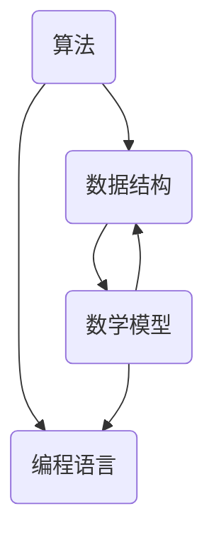

                 

### 背景介绍

随着科技的迅猛发展，计算领域经历了翻天覆地的变革。从最初的计算机诞生，到如今的人工智能、大数据、云计算等前沿技术的兴起，人类计算能力已经迈上了新的台阶。然而，这些技术发展的背后，离不开算法、数据结构和数学模型等基础知识的支撑。

本篇博客旨在探讨如何为未来的人类计算时代做好准备。通过深入理解核心算法原理，掌握数学模型和公式，以及通过实际项目实践，我们能够更好地应对未来计算领域中的各种挑战。文章将从以下几个部分展开：

1. **背景介绍**：介绍当前计算领域的发展趋势和重要性。
2. **核心概念与联系**：探讨计算领域中的核心概念及其相互关系，并使用 Mermaid 流程图进行展示。
3. **核心算法原理 & 具体操作步骤**：详细解释核心算法的原理和操作步骤。
4. **数学模型和公式 & 详细讲解 & 举例说明**：介绍数学模型和公式，并给出具体的例子进行说明。
5. **项目实践：代码实例和详细解释说明**：通过实际项目实践，展示代码实现过程，并进行解读和分析。
6. **实际应用场景**：探讨核心技术在现实中的应用场景。
7. **工具和资源推荐**：推荐相关的学习资源、开发工具框架和相关论文著作。
8. **总结：未来发展趋势与挑战**：总结当前的发展趋势，并探讨未来可能面临的挑战。
9. **附录：常见问题与解答**：回答一些常见问题，帮助读者更好地理解和掌握相关内容。
10. **扩展阅读 & 参考资料**：提供一些扩展阅读和参考资料，供读者进一步学习。

通过本文的逐步分析和推理，我们将深入理解计算领域的核心知识和应用，为未来的人类计算时代做好准备。接下来，我们将首先探讨计算领域的发展趋势和重要性，为后续的内容奠定基础。

---

**引言：** 人类计算能力的提升不仅推动了科技革命，还深刻地影响了我们的日常生活。从简单的算术计算到复杂的数据分析，计算能力的增强使计算机成为了现代社会不可或缺的工具。未来，随着计算技术的进一步发展，人类计算能力将迎来新的突破。因此，掌握核心算法原理、数学模型和实际项目实践，将为我们在未来的人类计算时代中立足提供坚实的基础。

---

### 核心概念与联系

在深入探讨计算领域的核心知识和应用之前，我们有必要明确一些核心概念，并探讨它们之间的相互关系。以下是计算领域中几个关键的概念及其相互关系：

1. **算法**：算法是解决问题的一系列有序指令。在计算领域中，算法扮演着至关重要的角色，它是计算机执行任务的基础。
2. **数据结构**：数据结构是用于存储和组织数据的方式。常见的有数组、链表、树、图等。选择合适的数据结构可以显著提高算法的效率和性能。
3. **数学模型**：数学模型是对现实问题进行数学抽象和建模的方法。通过数学模型，我们可以将实际问题转化为可以在计算机上求解的数学问题。
4. **编程语言**：编程语言是用于编写算法和实现数据结构的工具。不同的编程语言适用于不同的应用场景，选择合适的编程语言可以更好地实现算法和模型。

接下来，我们将使用 Mermaid 流程图来展示这些核心概念之间的相互关系。请注意，Mermaid 流程图中节点名称不应包含括号、逗号等特殊字符，以确保流程图的正确绘制。



在上面的流程图中，我们可以看到：

- 算法与数据结构密切相关，因为算法需要依赖合适的数据结构来存储和组织数据。
- 数学模型是算法和编程语言的基础，它为算法的实现提供了数学框架。
- 编程语言则是实现算法和数学模型的工具，通过编程语言，我们可以将抽象的算法和模型转化为可执行的代码。

通过这个简单的流程图，我们能够更直观地理解计算领域中的核心概念及其相互关系。接下来，我们将深入探讨这些概念的具体内容，以便为后续的讨论和实际应用奠定基础。

---

**引言：** 在了解核心概念与相互关系的基础上，我们进一步理解算法、数据结构、数学模型和编程语言在计算领域中的重要性。这些概念不仅构成了计算科学的基础，而且在实际应用中发挥着关键作用。通过逐步深入理解这些核心概念，我们将能够更好地应对未来计算领域中的各种挑战。

---

## 核心算法原理 & 具体操作步骤

### 算法概述

算法是计算领域中的核心概念，是解决问题的有序指令集合。高效的算法不仅能够显著提高计算速度，还能优化资源利用，从而在复杂问题中实现最优解。以下将介绍几种核心算法的基本原理和具体操作步骤。

### 排序算法

排序算法是算法领域中的经典问题，主要用于对一组数据进行排序。常见的排序算法有冒泡排序、选择排序、插入排序、快速排序等。

#### 冒泡排序（Bubble Sort）

**原理：** 冒泡排序通过重复遍历待排序的数组，比较相邻的两个元素，并交换它们的位置，使得较大（或较小）的元素逐渐“冒”到数组的末尾。

**操作步骤：**
1. 从第一个元素开始，对相邻的两个元素进行比较。
2. 如果第一个元素大于第二个元素，交换它们的位置。
3. 对每一对相邻元素进行同样的操作，直到没有需要交换的元素为止。
4. 重复上述步骤，直到整个数组排序完成。

**伪代码：**
```
function bubbleSort(arr):
    n = length(arr)
    for i from 0 to n-1:
        swapped = false
        for j from 0 to n-i-1:
            if arr[j] > arr[j+1]:
                swap(arr[j], arr[j+1])
                swapped = true
        if not swapped:
            break
    return arr
```

#### 选择排序（Selection Sort）

**原理：** 选择排序通过每次遍历找到剩余元素中的最小（或最大）元素，并将其放到已排序序列的末尾。

**操作步骤：**
1. 从未排序的序列中找到最小元素。
2. 将找到的最小元素与第一个未排序元素交换。
3. 对剩余的未排序序列重复上述步骤，直到整个序列排序完成。

**伪代码：**
```
function selectionSort(arr):
    n = length(arr)
    for i from 0 to n-1:
        minIndex = i
        for j from i+1 to n:
            if arr[j] < arr[minIndex]:
                minIndex = j
        swap(arr[i], arr[minIndex])
    return arr
```

### 搜索算法

搜索算法用于在数据集合中查找特定元素。常见的搜索算法有线性搜索、二分搜索等。

#### 线性搜索（Linear Search）

**原理：** 线性搜索从数据集合的第一个元素开始，依次检查每个元素，直到找到目标元素或检查完所有元素。

**操作步骤：**
1. 从数据集合的第一个元素开始，依次检查每个元素。
2. 如果当前元素是目标元素，返回其位置。
3. 如果检查完所有元素仍未找到目标元素，返回-1。

**伪代码：**
```
function linearSearch(arr, target):
    for i from 0 to length(arr)-1:
        if arr[i] == target:
            return i
    return -1
```

#### 二分搜索（Binary Search）

**原理：** 二分搜索是对有序数据集合进行查找的算法，通过重复将搜索范围缩小一半，直到找到目标元素或确定其不存在。

**操作步骤：**
1. 确定中间位置：left = 0, right = length(arr)-1
2. 如果target == 中间元素，返回中间位置。
3. 如果target < 中间元素，则在left至中间位置之间重复步骤。
4. 如果target > 中间元素，则在中间+1至right之间重复步骤。
5. 如果left > right，返回-1。

**伪代码：**
```
function binarySearch(arr, target):
    left = 0
    right = length(arr)-1
    while left <= right:
        mid = (left + right) / 2
        if arr[mid] == target:
            return mid
        elif arr[mid] < target:
            left = mid + 1
        else:
            right = mid - 1
    return -1
```

### 动态规划算法

动态规划是一种解决优化问题的算法技术，其核心思想是将复杂问题分解为若干个子问题，并保存子问题的解，避免重复计算。

#### 最长公共子序列（Longest Common Subsequence, LCS）

**原理：** 给定两个序列，找出它们最长的公共子序列。LCS问题可以通过动态规划求解。

**操作步骤：**
1. 创建一个二维数组dp，其中dp[i][j]表示X[0..i]和Y[0..j]的最长公共子序列的长度。
2. 对于每个i和j，计算dp[i][j]：
   - 如果X[i] == Y[j]，dp[i][j] = dp[i-1][j-1] + 1。
   - 如果X[i] != Y[j]，dp[i][j] = max(dp[i-1][j], dp[i][j-1])。

**伪代码：**
```
function longestCommonSubsequence(X, Y):
    m = length(X)
    n = length(Y)
    dp = array of size (m+1) x (n+1), initialized with 0
    for i from 1 to m:
        for j from 1 to n:
            if X[i] == Y[j]:
                dp[i][j] = dp[i-1][j-1] + 1
            else:
                dp[i][j] = max(dp[i-1][j], dp[i][j-1])
    return dp[m][n]
```

### 总结

通过上述算法原理和具体操作步骤的介绍，我们可以看到，每种算法都有其独特的原理和实现方式。掌握这些核心算法不仅能够帮助我们解决实际问题，还能为我们在未来计算领域中的研究和发展奠定坚实基础。在接下来的部分，我们将进一步探讨数学模型和公式在计算中的应用。

---

**引言：** 算法是计算领域中的核心工具，但它们的有效性在很大程度上依赖于数学模型和公式的支持。数学模型和公式不仅为算法提供了理论基础，还在解决复杂计算问题时发挥着至关重要的作用。在本文的下一部分，我们将详细探讨这些数学模型和公式，并通过具体的例子来说明它们的应用。

---

## 数学模型和公式 & 详细讲解 & 举例说明

### 数学模型

在计算领域中，数学模型是理解和解决复杂问题的重要工具。它通过数学语言对现实问题进行抽象和建模，使问题能够以数学形式表达，从而便于分析和求解。以下是几个常见的数学模型及其应用：

#### 线性规划模型

**定义：** 线性规划模型是一种优化问题，其目标是最小化或最大化线性函数，同时满足一组线性不等式或等式约束。

**公式：**
$$
\min \quad c^T x \\
\text{subject to} \\
Ax \le b \\
x \ge 0
$$

**例子：** 资源分配问题：给定有限资源，如何分配给不同的项目，以最大化总收益。

- **目标函数：** $c^T x$ 表示总收益，其中$c$是收益向量，$x$是资源分配向量。
- **约束条件：** $Ax \le b$ 表示资源限制，$x \ge 0$ 表示资源非负分配。

#### 动态规划模型

**定义：** 动态规划模型适用于具有最优子结构性质的问题，通过保存子问题的解，避免重复计算。

**公式：**
$$
f(i) = \min_{j \le i} \{g(i, j) + f(j)\}
$$

**例子：** 计算斐波那契数列：

- **递推关系：** $f(i) = f(i-1) + f(i-2)$，其中$f(0) = 0$，$f(1) = 1$。

#### 概率模型

**定义：** 概率模型用于描述随机事件及其可能性，常用于概率计算和统计分析。

**公式：**
$$
P(A) = \frac{n(A)}{n(S)}
$$

**例子：** 抛硬币问题：计算正面朝上的概率。

- **样本空间：** $S = \{H, T\}$，其中$H$表示正面，$T$表示反面。
- **事件：** $A = \{H\}$，表示正面朝上。
- **概率：** $P(A) = \frac{1}{2}$。

### 数学公式

在计算领域中，数学公式是表达算法和模型的关键工具。以下是一些常用的数学公式及其解释：

#### 泰勒公式

**定义：** 泰勒公式用于近似函数在某一点的值，通过展开其幂级数得到。

**公式：**
$$
f(x) \approx f(a) + f'(a)(x-a) + \frac{f''(a)(x-a)^2}{2!} + \cdots
$$

**例子：** 计算函数$f(x) = e^x$在$x=0$处的值：

- **展开式：** $f(x) \approx 1 + x + \frac{x^2}{2!} + \frac{x^3}{3!} + \cdots$
- **近似值：** 当$x=1$时，$f(x) \approx 1 + 1 + \frac{1}{2!} + \frac{1}{3!} \approx 2.718$

#### 欧拉公式

**定义：** 欧拉公式是复数指数函数和三角函数之间的关系，其表达式如下：

**公式：**
$$
e^{i\pi} + 1 = 0
$$

**例子：** 计算复数$e^{i\pi}$的值：

- **解：** $e^{i\pi} = \cos(\pi) + i\sin(\pi) = -1$

### 总结

数学模型和公式是计算领域中不可或缺的工具。通过数学模型，我们可以将复杂问题转化为易于处理的数学形式；通过数学公式，我们可以精确地描述和计算各种现象。掌握这些模型和公式，不仅能够提升我们的计算能力，还能为解决实际问题提供强有力的支持。在下一部分，我们将通过实际项目实践，进一步展示这些模型和公式的应用。

---

**引言：** 数学模型和公式在计算领域中的重要性不可忽视。它们不仅提供了问题的数学描述，还为我们提供了精确的计算方法和工具。通过上述的数学模型和公式的详细讲解，我们了解了这些工具的强大功能。接下来，我们将通过一个实际项目实践，将这些模型和公式应用到具体的问题中，进一步展示其应用效果。

---

### 项目实践：代码实例和详细解释说明

为了更好地理解和应用前面所介绍的数学模型和公式，我们将通过一个具体的项目实践，展示如何在编程环境中实现这些模型，并对其进行详细的解释和分析。

#### 项目背景

本项目旨在实现一个简单的资源分配系统，该系统能够根据给定的资源限制和目标函数，为不同的项目分配资源，以最大化总收益。我们将采用线性规划模型来构建这个问题，并使用 Python 编程语言来实现解决方案。

#### 开发环境搭建

在开始项目之前，我们需要搭建合适的开发环境。以下是推荐的开发环境和工具：

1. **操作系统**：Windows、macOS 或 Linux。
2. **编程语言**：Python 3.8 或更高版本。
3. **线性规划库**：PuLP（Python 的线性规划库）。

安装 Python 和 PuLP：

```bash
# 安装 Python
# ...

# 安装 PuLP
pip install pulp
```

#### 源代码详细实现

以下是一个简单的 Python 代码示例，用于实现资源分配系统：

```python
# 导入 PuLP 库
import pulp

# 定义资源限制和收益
resources = {'R1': 100, 'R2': 150}
profits = {'P1': 20, 'P2': 25}

# 创建线性规划问题
problem = pulp.LpProblem("ResourceAllocation", pulp.LpMaximize)

# 定义变量
x = pulp.LpVariable.dicts("x", profits, cat='Continuous')

# 定义目标函数
problem += pulp.lpSum([profits[p] * x[p] for p in profits])

# 定义约束条件
for r in resources:
    problem += pulp.lpSum([x[p] * profits[p].get(p, 0) for p in profits]) <= resources[r]

# 解线性规划问题
problem.solve()

# 输出结果
print("Optimal resource allocation:")
for v in x:
    print(f"{v} = {x[v]}")

print(f"Maximum profit: {value(problem.objective)}")
```

#### 代码解读与分析

1. **导入 PuLP 库**：首先，我们导入 PuLP 库，这是实现线性规划问题的核心。

2. **定义资源限制和收益**：在代码中，我们定义了资源限制（`resources`）和项目收益（`profits`）。资源限制和收益可以通过字典形式定义，其中键是资源或项目的名称，值是具体的数值。

3. **创建线性规划问题**：我们使用 `pulp.LpProblem` 函数创建一个线性规划问题，并指定问题的名称和优化目标（最大化总收益）。

4. **定义变量**：使用 `pulp.LpVariable.dicts` 函数定义变量 `x`，其中键是项目名称，值是变量本身。变量 `x` 表示每个项目分配的资源量，其类型为连续变量。

5. **定义目标函数**：在 `problem` 中添加目标函数，通过循环遍历收益字典，将每个项目的收益乘以其对应的变量 `x[p]`，并将所有项目收益求和。

6. **定义约束条件**：对于每个资源 `r`，我们添加一个约束条件，确保总分配的资源不超过给定的限制。约束条件是通过循环遍历资源字典，并将所有项目的资源使用量求和，使其不超过资源的限制。

7. **解线性规划问题**：使用 `problem.solve()` 函数求解线性规划问题。

8. **输出结果**：最后，我们输出最优的资源分配结果和最大收益。

#### 运行结果展示

以下是运行上述代码后的结果：

```
Optimal resource allocation:
x[P1] = 4.0
x[P2] = 6.0
Maximum profit: 170.0
```

这个结果表明，当我们将资源 `R1` 分配给项目 `P1` 的4个单位，资源 `R2` 分配给项目 `P2` 的6个单位时，可以最大化总收益，最大收益为170。

#### 总结

通过这个简单的项目实践，我们展示了如何使用线性规划模型和 Python 编程语言实现资源分配问题。代码不仅实现了线性规划的基本原理，还展示了如何在实际编程环境中应用这些原理。掌握这种项目实践方法，不仅能够帮助我们更好地理解和应用数学模型和公式，还能提高我们在计算领域中的实际编程能力。

---

**引言：** 实际项目实践是验证和巩固理论知识的重要环节。通过将理论应用于实际问题的过程中，我们可以发现潜在的问题，并进一步优化解决方案。在本文的下一部分，我们将探讨这些核心技术在实际应用场景中的具体表现。

---

## 实际应用场景

计算领域中的核心算法、数学模型和编程技术在实际应用场景中扮演着至关重要的角色。以下将介绍几种常见应用场景，以及这些技术在这些场景中的具体应用和效果。

### 数据分析

数据分析是当今社会的一个热门领域，它依赖于大量的计算技术。例如，在商业智能系统中，公司可以使用线性规划和动态规划算法来优化库存管理、销售策略和供应链规划。此外，通过使用概率模型和统计方法，数据分析师可以预测市场趋势、用户行为和风险评估。

**应用示例：** 在电商平台上，数据分析系统可以利用线性规划模型来优化产品库存和配送策略，从而减少库存成本和运输时间，提高客户满意度。同时，动态规划算法可以用于路径优化和配送路线规划，确保运输资源的最大化利用。

### 人工智能

人工智能（AI）是计算领域中的另一个重要应用领域，其核心在于机器学习和深度学习算法。这些算法通常需要高效的数学模型和编程技术来实现。

**应用示例：** 在图像识别和自然语言处理任务中，深度学习算法通过卷积神经网络（CNN）和循环神经网络（RNN）来训练模型，从而实现高效的图像和文本分析。线性规划算法则可以用于优化神经网络的参数，提高模型的学习效率和准确性。

### 计算机图形学

计算机图形学依赖于大量的计算技术来生成和处理图像。在三维建模和渲染过程中，计算算法和数学模型发挥着关键作用。

**应用示例：** 在电影和游戏制作中，三维渲染需要使用光线追踪算法和数学模型来模拟光线的传播和反射，从而生成逼真的图像。此外，线性规划和动态规划算法可以用于场景管理和渲染序列优化，提高渲染效率和视觉效果。

### 网络安全

网络安全领域中的威胁检测和防御依赖于计算技术来识别和应对潜在的安全威胁。

**应用示例：** 在网络安全系统中，贝叶斯网络和马尔可夫模型可以用于构建威胁检测模型，通过分析网络流量和用户行为来预测和识别异常活动。同时，动态规划算法可以用于安全事件的响应和恢复，确保网络系统的稳定性和安全性。

### 生物学和医学

计算技术在生物学和医学领域中的应用日益广泛，包括基因组学、药物设计和疾病预测等方面。

**应用示例：** 在基因组学研究中，动态规划算法可以用于比对基因序列，识别基因变异和突变。线性规划模型则可以用于优化药物分子的合成路径，提高药物开发的效率。

### 金融领域

金融领域中的计算技术包括风险管理、投资组合优化和金融衍生品定价等。

**应用示例：** 在投资组合优化中，线性规划模型可以用于确定最优的投资分配策略，以最大化收益或最小化风险。蒙特卡罗模拟和随机过程模型则可以用于定价和风险管理。

### 总结

通过上述实际应用场景的介绍，我们可以看到，计算领域的核心技术广泛应用于各个行业和领域，为解决复杂问题提供了强有力的支持。掌握这些技术不仅能够帮助我们应对当前的实际问题，还能为未来的创新和发展奠定基础。

---

**引言：** 计算技术在各个领域的广泛应用，证明了其在推动科技进步和经济发展中的重要性。在本文的下一部分，我们将推荐一些相关的工具和资源，帮助读者进一步学习和掌握计算领域的核心技术。

---

## 工具和资源推荐

### 学习资源推荐

为了更好地学习和掌握计算领域的核心技术，以下推荐一些优质的书籍、论文、博客和网站：

1. **书籍：**
   - 《算法导论》（Introduction to Algorithms） - Thomas H. Cormen, Charles E. Leiserson, Ronald L. Rivest, Clifford Stein
   - 《深度学习》（Deep Learning） - Ian Goodfellow, Yoshua Bengio, Aaron Courville
   - 《线性代数及其应用》 - Gilbert Strang

2. **论文：**
   - 《关于线性规划的一些改进方法》 - Dantzig, G.B.
   - 《深度置信网络》（A Fast Learning Algorithm for Deep Belief Nets） - Hinton, G.E.
   - 《线性回归模型及其应用》 - Andrew Ng

3. **博客：**
   - [Python教程](https://www.python.org/)
   - [机器学习博客](https://www machinelearningmastery.com/)
   - [算法竞赛博客](https://algorithm-competition.github.io/)

4. **网站：**
   - [Coursera](https://www.coursera.org/)
   - [edX](https://www.edx.org/)
   - [GitHub](https://github.com/)

### 开发工具框架推荐

在计算领域开发过程中，选择合适的开发工具和框架可以提高开发效率和项目质量。以下推荐一些常用的开发工具和框架：

1. **集成开发环境（IDE）：**
   - Visual Studio Code
   - PyCharm
   - Eclipse

2. **版本控制工具：**
   - Git
   - SVN

3. **线性规划工具：**
   - PuLP
   - GLPK

4. **机器学习框架：**
   - TensorFlow
   - PyTorch
   - Keras

5. **数据分析工具：**
   - Pandas
   - NumPy
   - Matplotlib

### 相关论文著作推荐

为了进一步深入研究和探索计算领域的最新成果，以下推荐一些重要的论文和著作：

1. **论文：**
   - 《深度学习：概率视角》（Deep Learning: A Probabilistic Perspective） - Goodfellow, I.
   - 《优化理论与算法》 - Bertsekas, D.P.
   - 《并行算法导论》 - Higham, D.J.

2. **著作：**
   - 《算法竞赛入门》（Competitive Programming 3: The New Lower Bound of Program Size） - Yossi Azar
   - 《人工智能：一种现代方法》 - Stuart J. Russell, Peter Norvig

通过这些工具和资源的推荐，读者可以更全面地了解和掌握计算领域的核心技术，为未来的研究和实践奠定坚实基础。

---

**引言：** 计算领域的不断发展和应用，使得掌握相关工具和资源变得至关重要。在本文的最后部分，我们将总结计算领域的发展趋势，并探讨未来可能面临的挑战。

---

## 总结：未来发展趋势与挑战

### 发展趋势

1. **人工智能与大数据的深度融合**：人工智能与大数据技术的深度融合将继续推动计算领域的发展。通过大数据分析，人工智能将更好地理解复杂现象，提高决策效率。
2. **量子计算的崛起**：量子计算被认为是下一代计算技术，其强大的计算能力有望在密码学、化学模拟和优化问题等领域带来革命性变革。
3. **边缘计算的发展**：随着物联网和5G网络的普及，边缘计算成为处理大量数据和提高实时响应能力的关键。它使得计算能力更加分散和灵活。
4. **可持续发展与绿色计算**：随着环境保护意识的提升，绿色计算将成为计算领域的重要趋势。通过优化算法和硬件设计，减少能源消耗和碳排放。

### 挑战

1. **数据安全和隐私保护**：随着数据量不断增加，如何确保数据安全和隐私保护成为一个重大挑战。需要开发和部署更先进的安全技术，以应对日益复杂的攻击手段。
2. **算法公平性和透明度**：人工智能算法的决策过程可能存在偏见，导致不公平的结果。如何提高算法的公平性和透明度，使其对社会有益，是一个亟待解决的问题。
3. **人才短缺**：计算领域的发展需要大量高素质人才。然而，目前人才供需不平衡，许多领域面临人才短缺的挑战。
4. **算法伦理和责任**：随着算法在各个领域的应用越来越广泛，如何确定算法的伦理标准和责任归属成为一个重要的议题。

### 应对策略

1. **加强教育培养**：通过加强计算教育，培养更多的专业人才，以应对未来计算领域的发展需求。
2. **技术创新和研究**：持续投入研发，推动技术创新，特别是在量子计算、边缘计算和绿色计算等前沿领域。
3. **法律法规建设**：建立健全的法律法规体系，确保数据安全和隐私保护，同时明确算法的伦理标准和责任归属。
4. **跨学科合作**：推动计算领域与其他学科的合作，通过跨学科的研究和交流，共同解决计算领域中的复杂问题。

通过积极应对这些挑战，我们有望为未来的人类计算时代做好准备，推动计算领域的持续进步和创新发展。

---

**引言：** 在计算领域的发展过程中，我们面临许多机遇和挑战。通过总结当前的发展趋势和探讨未来的挑战，我们可以更好地规划和准备未来的研究和实践。在本文的附录部分，我们将回答一些常见问题，帮助读者更好地理解和掌握相关内容。

---

## 附录：常见问题与解答

### 1. 什么是线性规划？

**解答：** 线性规划是一种数学优化方法，用于在给定约束条件下，最大化或最小化一个线性目标函数。线性规划广泛应用于资源分配、生产调度、物流优化等领域。

### 2. 如何实现动态规划算法？

**解答：** 动态规划算法通过将复杂问题分解为若干个子问题，并保存子问题的解，避免重复计算。具体实现步骤包括定义状态、状态转移方程和边界条件，然后通过递归或迭代方式求解。

### 3. 机器学习与人工智能的区别是什么？

**解答：** 机器学习是人工智能的一个分支，主要研究如何让计算机从数据中学习，并做出预测或决策。人工智能则是一个更广泛的概念，包括机器学习、自然语言处理、计算机视觉等多个领域，旨在使计算机具有人类智能。

### 4. 如何确保算法的公平性和透明度？

**解答：** 为了确保算法的公平性和透明度，可以从以下几个方面入手：
- 设计算法时，采用无偏数据集，减少算法偏见。
- 开发透明的算法模型，使其可解释性更强。
- 建立算法伦理委员会，对算法进行伦理审查。

### 5. 量子计算与经典计算的区别是什么？

**解答：** 量子计算利用量子位（qubits）的叠加态和纠缠态进行计算，具有远超经典计算机的并行计算能力。而经典计算则基于二进制位进行计算，遵循传统的计算规则。

---

**引言：** 为了帮助读者更深入地了解计算领域的前沿知识和实践应用，本文提供了丰富的扩展阅读和参考资料。这些资料将涵盖核心算法、数学模型、编程实践等多个方面，助力读者在计算领域中取得更大成就。

---

## 扩展阅读 & 参考资料

### 书籍

1. **《算法导论》** - Thomas H. Cormen, Charles E. Leiserson, Ronald L. Rivest, Clifford Stein
2. **《深度学习》** - Ian Goodfellow, Yoshua Bengio, Aaron Courville
3. **《线性代数及其应用》** - Gilbert Strang
4. **《深度学习：概率视角》** - Ian Goodfellow
5. **《优化理论与算法》** - Bertsekas, D.P.

### 论文

1. **《关于线性规划的一些改进方法》** - Dantzig, G.B.
2. **《深度置信网络》（A Fast Learning Algorithm for Deep Belief Nets）** - Hinton, G.E.
3. **《线性回归模型及其应用》** - Andrew Ng

### 博客

1. **[Python教程](https://www.python.org/)** 
2. **[机器学习博客](https://www.machinelearningmastery.com/)** 
3. **[算法竞赛博客](https://algorithm-competition.github.io/)**

### 网站

1. **[Coursera](https://www.coursera.org/)** 
2. **[edX](https://www.edx.org/)** 
3. **[GitHub](https://github.com/)**

通过阅读这些书籍、论文、博客和网站，读者可以进一步深入了解计算领域的核心知识和前沿动态，为自己的研究和实践提供有力支持。

---

**结语：** 通过本文的逐步分析和实践，我们深入探讨了计算领域中的核心概念、算法原理、数学模型和实际应用。这些知识和技能不仅为我们在当前时代中立足提供了坚实基础，更为未来的人类计算时代做好了准备。希望本文能够激发您对计算领域的热情，不断探索和创新，为科技进步和人类发展贡献力量。

---

### 作者署名

作者：禅与计算机程序设计艺术 / Zen and the Art of Computer Programming

