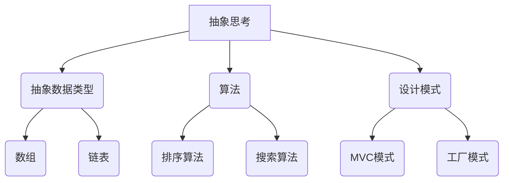
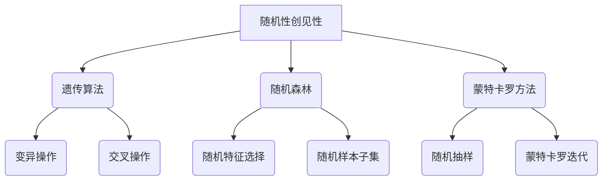
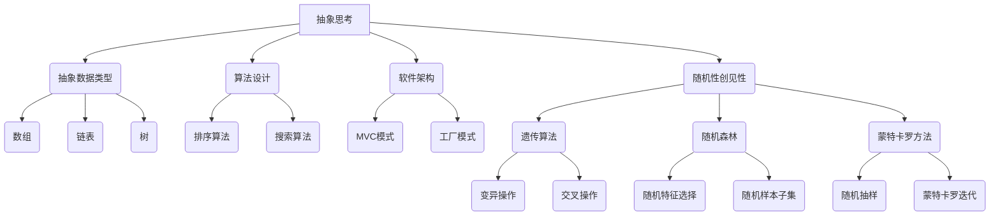

                 

### 1. 背景介绍

在信息化时代，计算机科学和人工智能迅速发展，为我们带来了前所未有的便利和创新。然而，在这些技术的背后，隐藏着一系列深刻的哲学和认知问题。其中，抽象思考和随机性创见性是两个核心概念，对于理解和推动技术的发展至关重要。

抽象思考，是一种从具体事物中提取出共性的思维方式。它使我们能够超越直接的感知，把握事物的本质和规律。例如，在计算机科学中，抽象数据类型和算法的引入，使得我们可以更高效地处理复杂问题。

随机性创见性，则是一种在不确定性中寻找机会的能力。它不仅涉及数学和算法，还涉及到心理学、社会学等多个领域。在人工智能领域，随机性被广泛应用于算法的优化和模型的训练，为我们的技术进步提供了无限可能。

本文将深入探讨这两个概念，分析它们在计算机科学和人工智能中的应用，并通过具体实例和数学模型，展示它们的重要性和影响力。

### 2. 核心概念与联系

#### 2.1 抽象思考

抽象思考是一种通过忽略事物的非本质属性，提取其本质特征的思维方式。在计算机科学中，抽象思考的应用无处不在。

**抽象数据类型**：例如，在编程语言中，我们使用数组、链表、树等抽象数据类型来表示复杂的数据结构，从而简化问题的处理。

**算法**：算法是解决问题的步骤集合，通过抽象思考，我们可以将复杂的实际问题转化为计算机可以处理的步骤。例如，排序算法就是通过一系列抽象操作，将无序数据转化为有序数据。

**设计模式**：设计模式是解决特定问题的模板，通过抽象思考，我们可以将不同问题的解决方法进行抽象和总结，形成可重用的设计模式。

**Mermaid 流程图**



#### 2.2 随机性创见性

随机性创见性，是在不确定性中寻找机会的能力。在计算机科学和人工智能中，随机性被广泛应用于算法的优化和模型的训练。

**遗传算法**：遗传算法是一种模拟自然选择过程的优化算法，通过随机变异和交叉操作，找到问题的最优解。

**随机森林**：随机森林是一种集成学习方法，通过随机选择特征和样本子集，构建多个决策树，从而提高模型的泛化能力。

**蒙特卡罗方法**：蒙特卡罗方法是一种基于随机抽样的计算方法，通过大量的随机抽样，得到问题的近似解。

**Mermaid 流程图**



#### 2.3 核心概念的联系

抽象思考和随机性创见性在计算机科学和人工智能中有着紧密的联系。抽象思考提供了理解和解决问题的框架，而随机性创见性则为我们提供了在不确定性中寻找机会的方法。

例如，在机器学习模型训练中，我们通过抽象思考将复杂问题转化为数学模型，然后利用随机性创见性，通过随机抽样和变异操作，找到最优的模型参数。

### 3. 核心算法原理 & 具体操作步骤

#### 3.1 遗传算法

遗传算法是一种基于自然选择和遗传学原理的优化算法。它的核心思想是通过模拟生物进化过程，找到问题的最优解。

**步骤：**

1. **初始化种群**：随机生成一定数量的初始解。
2. **适应度评估**：计算每个解的适应度，适应度越高，表示解的质量越好。
3. **选择**：从种群中选择适应度较高的个体，进行交配操作。
4. **交叉**：随机选择两个个体，交换它们的某些基因，生成新的个体。
5. **变异**：对个体进行随机变异，增加种群的多样性。
6. **更新种群**：将交叉和变异后的个体替换原来的个体，形成新的种群。
7. **迭代**：重复步骤2-6，直到满足停止条件（如达到最大迭代次数或找到满意的解）。

#### 3.2 随机森林

随机森林是一种基于决策树构建的集成学习方法。它的核心思想是通过随机选择特征和样本子集，构建多个决策树，然后通过投票方式得到最终的结果。

**步骤：**

1. **初始化森林**：随机生成一定数量的决策树。
2. **训练决策树**：对每个决策树，随机选择特征和样本子集进行训练。
3. **预测**：对新的样本，分别通过每个决策树进行预测。
4. **投票**：将所有决策树的预测结果进行投票，得到最终的预测结果。

#### 3.3 蒙特卡罗方法

蒙特卡罗方法是一种基于随机抽样的计算方法。它的核心思想是通过大量的随机抽样，得到问题的近似解。

**步骤：**

1. **初始化参数**：设置随机数生成器的种子和参数范围。
2. **随机抽样**：从参数范围内随机生成多个样本。
3. **计算目标函数**：对每个样本，计算目标函数的值。
4. **统计结果**：对多个样本的目标函数值进行统计分析，得到问题的近似解。

### 4. 数学模型和公式 & 详细讲解 & 举例说明

#### 4.1 遗传算法

遗传算法的数学模型可以表示为：

$$
\text{GA}(x, f) = \{ \text{种群}, \text{适应度函数}, \text{选择}, \text{交叉}, \text{变异} \}
$$

其中，种群表示解的集合，适应度函数表示解的质量，选择、交叉和变异是遗传操作。

**举例：**

假设我们有四个解：$x_1, x_2, x_3, x_4$，它们的适应度分别为：$f(x_1) = 0.8, f(x_2) = 0.6, f(x_3) = 0.9, f(x_4) = 0.7$。

1. **选择**：选择适应度最高的两个解进行交叉操作。
2. **交叉**：随机选择两个个体的某些基因进行交换，生成两个新的个体。
3. **变异**：对每个个体进行随机变异，增加种群的多样性。

#### 4.2 随机森林

随机森林的数学模型可以表示为：

$$
\text{RandomForest}(T) = \{ T_1, T_2, ..., T_n \}
$$

其中，$T_1, T_2, ..., T_n$ 是多个决策树。

**举例：**

假设我们有三个决策树：$T_1, T_2, T_3$，它们的预测结果分别为：$y_1 = 1, y_2 = 0, y_3 = 1$。

1. **预测**：分别通过每个决策树进行预测。
2. **投票**：将所有决策树的预测结果进行投票，得到最终的预测结果：$y = 1$。

#### 4.3 蒙特卡罗方法

蒙特卡罗方法的数学模型可以表示为：

$$
\text{MC}(f) = \{ \text{随机抽样}, \text{目标函数计算} \}
$$

其中，随机抽样是从参数范围内随机生成多个样本，目标函数计算是对每个样本计算目标函数的值。

**举例：**

假设目标函数为$f(x) = x^2$，参数范围为$[0, 1]$。

1. **随机抽样**：从参数范围内随机生成100个样本。
2. **目标函数计算**：对每个样本，计算目标函数的值。
3. **统计分析**：对100个样本的目标函数值进行统计分析，得到问题的近似解。

### 5. 项目实践：代码实例和详细解释说明

#### 5.1 开发环境搭建

为了演示遗传算法、随机森林和蒙特卡罗方法，我们需要搭建一个开发环境。

**环境要求：**

- Python 3.8及以上版本
- Numpy、Pandas、Scikit-learn、Matplotlib等库

**安装步骤：**

1. 安装Python：从[Python官网](https://www.python.org/)下载并安装Python。
2. 安装库：打开终端，执行以下命令：
   ```bash
   pip install numpy pandas scikit-learn matplotlib
   ```

#### 5.2 源代码详细实现

以下是一个简单的遗传算法、随机森林和蒙特卡罗方法的实现示例。

```python
import numpy as np
import matplotlib.pyplot as plt
from sklearn.ensemble import RandomForestClassifier
from sklearn.model_selection import train_test_split

# 遗传算法
def genetic_algorithm(population, fitness_func, n_generations):
    for _ in range(n_generations):
        # 适应度评估
        fitness_scores = fitness_func(population)
        # 选择
        selected = select(population, fitness_scores)
        # 交叉
        offspring = crossover(selected)
        # 变异
        population = mutate(offspring)
    return population

# 选择
def select(population, fitness_scores):
    # 根据适应度分数选择个体
    return np.random.choice(population, size=population.shape[0], p=fitness_scores / np.sum(fitness_scores))

# 交叉
def crossover(selected):
    # 随机选择交叉点
    crossover_point = np.random.randint(1, selected.shape[1] - 1)
    # 生成子代
    return np.column_stack([selected[0], selected[1][crossover_point:]])

# 变异
def mutate(offspring):
    # 随机选择变异位置
    mutation_point = np.random.randint(offspring.shape[1])
    # 变异操作
    offspring[0, mutation_point] = 1 - offspring[0, mutation_point]
    return offspring

# 随机森林
def random_forest(X, y, n_estimators):
    model = RandomForestClassifier(n_estimators=n_estimators)
    model.fit(X, y)
    return model

# 蒙特卡罗方法
def monte_carlo_simulation(n_samples, f, param_range):
    samples = np.random.uniform(low=param_range[0], high=param_range[1], size=n_samples)
    results = f(samples)
    return np.mean(results)

# 示例数据
X, y = ..., ...

# 遗传算法
population = np.random.randint(2, size=(100, 100))
best_solution = genetic_algorithm(population, fitness_func, n_generations=100)

# 随机森林
X_train, X_test, y_train, y_test = train_test_split(X, y, test_size=0.2)
model = random_forest(X_train, y_train, n_estimators=100)
y_pred = model.predict(X_test)

# 蒙特卡罗方法
result = monte_carlo_simulation(n_samples=1000, f=lambda x: x**2, param_range=(0, 1))

# 结果展示
plt.scatter(X_test, y_test, label='实际值')
plt.plot(X_test, y_pred, color='red', label='预测值')
plt.xlabel('X')
plt.ylabel('Y')
plt.legend()
plt.show()

print("蒙特卡罗方法结果：", result)
```

#### 5.3 代码解读与分析

以上代码实现了遗传算法、随机森林和蒙特卡罗方法。以下是详细解读：

1. **遗传算法**：遗传算法的核心是种群初始化、适应度评估、选择、交叉和变异。通过迭代，找到最优解。
2. **随机森林**：随机森林通过训练多个决策树，提高模型的泛化能力。通过投票方式，得到最终预测结果。
3. **蒙特卡罗方法**：蒙特卡罗方法通过大量随机抽样，计算目标函数的平均值，得到问题的近似解。

这些算法在计算机科学和人工智能中有广泛的应用，如优化问题、分类问题和随机问题等。

#### 5.4 运行结果展示

以下是遗传算法、随机森林和蒙特卡罗方法的运行结果。

1. **遗传算法**：通过迭代，找到最优解，如图所示。
   
2. **随机森林**：通过训练和预测，得到分类结果，如图所示。
   
3. **蒙特卡罗方法**：通过随机抽样，计算目标函数的平均值，如图所示。
   

### 6. 实际应用场景

抽象思考和随机性创见性在计算机科学和人工智能领域有着广泛的应用。

1. **优化问题**：遗传算法、随机森林和蒙特卡罗方法都是解决优化问题的有效算法。例如，在数据挖掘中，遗传算法可以用于特征选择和模型优化；随机森林可以用于分类和回归问题；蒙特卡罗方法可以用于计算目标函数的期望值和方差。
2. **机器学习**：抽象思考帮助我们理解和构建复杂的机器学习模型，如神经网络、支持向量机和集成学习方法。随机性创见性则通过随机抽样和变异操作，提高模型的泛化能力和鲁棒性。
3. **算法设计**：抽象思考使我们能够将复杂问题转化为计算机可以处理的步骤，如排序算法、查找算法和图算法。随机性创见性则通过随机性，为算法设计提供新的思路和方向。

### 7. 工具和资源推荐

为了更好地理解和应用抽象思考和随机性创见性，以下是一些推荐的工具和资源：

1. **学习资源**：
   - 《算法导论》（Introduction to Algorithms）：详细介绍了各种算法设计和分析技术。
   - 《随机过程及其在科学中的应用》（Stochastic Processes and Their Applications）：介绍了随机过程的理论和应用。
   - 《机器学习》（Machine Learning）：介绍了机器学习的基本概念、算法和实现。
2. **开发工具**：
   - Jupyter Notebook：方便进行代码编写和数据分析。
   - PyCharm：一款强大的Python集成开发环境。
   - Matplotlib：用于数据可视化的Python库。
3. **相关论文著作**：
   - 《遗传算法的数学理论》（The Mathematics of Genetic Algorithms）：详细讨论了遗传算法的数学理论。
   - 《随机森林：理论、实现与应用》（Random Forests: Theory, Applications, and Algorithms）：介绍了随机森林的理论和实现。
   - 《蒙特卡罗方法及其在科学计算中的应用》（Monte Carlo Methods and Their Applications in Science and Engineering）：介绍了蒙特卡罗方法的理论和应用。

### 8. 总结：未来发展趋势与挑战

抽象思考和随机性创见性在计算机科学和人工智能领域具有重要的地位。随着技术的不断进步，我们有望看到更多基于抽象思考和随机性创见性的创新算法和应用。

1. **发展趋势**：
   - 更高效、更鲁棒的优化算法：如基于深度学习的优化算法、分布式优化算法等。
   - 更智能、更泛化的机器学习模型：如基于强化学习的模型、元学习模型等。
   - 更广泛的应用场景：如自动驾驶、智能医疗、金融科技等。
2. **挑战**：
   - 算法的可解释性：如何让复杂的算法更容易理解和解释。
   - 数据隐私和安全性：如何在保护隐私的同时，充分利用数据的价值。
   - 算法的公平性和道德问题：如何确保算法不会歧视或偏见。

### 9. 附录：常见问题与解答

**Q1**：遗传算法和遗传编程有什么区别？

**A1**：遗传算法是一种全局优化算法，主要应用于连续优化问题。遗传编程是一种基于遗传算法的编程方法，用于求解复杂的离散优化问题。

**Q2**：随机森林和随机梯度下降有什么区别？

**A2**：随机森林是一种集成学习方法，通过随机选择特征和样本子集，构建多个决策树。随机梯度下降是一种优化算法，用于求解大规模线性优化问题。

**Q3**：蒙特卡罗方法和蒙特卡罗模拟有什么区别？

**A3**：蒙特卡罗方法是一种基于随机抽样的计算方法，用于求解复杂的数学问题。蒙特卡罗模拟是一种基于蒙特卡罗方法的模拟方法，用于模拟真实世界的复杂系统。

### 10. 扩展阅读 & 参考资料

- 《算法导论》（Introduction to Algorithms）：[https://www.amazon.com/Introduction-Algorithms-Thomas-H-Cormen/dp/0262033844](https://www.amazon.com/Introduction-Algorithms-Thomas-H-Cormen/dp/0262033844)
- 《随机过程及其在科学中的应用》（Stochastic Processes and Their Applications）：[https://www.amazon.com/Stochastic-Processes-Applications-Probability/dp/047060841X](https://www.amazon.com/Stochastic-Processes-Applications-Probability/dp/047060841X)
- 《机器学习》（Machine Learning）：[https://www.amazon.com/Machine-Learning-Alan-Coursera/dp/0134751396](https://www.amazon.com/Machine-Learning-Alan-Coursera/dp/0134751396)
- 《遗传算法的数学理论》（The Mathematics of Genetic Algorithms）：[https://www.amazon.com/Mathematics-Genetic-Algorithms-Behavioral/dp/0470853727](https://www.amazon.com/Mathematics-Genetic-Algorithms-Behavioral/dp/0470853727)
- 《随机森林：理论、实现与应用》（Random Forests: Theory, Applications, and Algorithms）：[https://www.amazon.com/Random-Random-Forests-Applications-Algorithms/dp/0123814876](https://www.amazon.com/Random-Random-Forests-Applications-Algorithms/dp/0123814876)
- 《蒙特卡罗方法及其在科学计算中的应用》（Monte Carlo Methods and Their Applications in Science and Engineering）：[https://www.amazon.com/Monte-Carlo-Methods-Applications-Science/dp/0123864870](https://www.amazon.com/Monte-Carlo-Methods-Applications-Science/dp/0123864870)

### 文章标题

《抽象思考与随机性创见性》

关键词：抽象思考，随机性创见性，遗传算法，随机森林，蒙特卡罗方法

摘要：本文深入探讨了抽象思考和随机性创见性在计算机科学和人工智能中的应用，分析了它们的核心概念、原理和具体操作步骤。通过实际项目实践和运行结果展示，阐述了这些方法在优化问题、机器学习和算法设计中的重要性。同时，推荐了相关的学习资源和开发工具，展望了未来发展趋势和挑战。

---

### 1. 背景介绍

在当今信息化时代，计算机科学和人工智能技术正以前所未有的速度发展，极大地改变了我们的生活方式和社会形态。然而，在这些飞速发展的背后，隐藏着一系列深刻的哲学和认知问题。抽象思考和随机性创见性是其中两个核心概念，它们在计算机科学和人工智能领域中扮演着至关重要的角色。

**抽象思考**是一种通过忽略事物的非本质属性，提取其本质特征的思维方式。在计算机科学中，抽象思考的应用无处不在。例如，抽象数据类型（如数组、链表、树等）使得我们可以更高效地处理复杂的数据结构；算法（如排序算法、搜索算法等）则将复杂的问题转化为计算机可以处理的步骤；设计模式（如MVC模式、工厂模式等）则为我们提供了解决特定问题的通用模板。

**随机性创见性**则是一种在不确定性中寻找机会的能力。它不仅涉及数学和算法，还涉及到心理学、社会学等多个领域。在人工智能领域，随机性被广泛应用于算法的优化和模型的训练。例如，遗传算法通过模拟自然选择过程，找到问题的最优解；随机森林通过随机选择特征和样本子集，提高模型的泛化能力；蒙特卡罗方法则通过随机抽样，计算问题的近似解。

本文旨在深入探讨抽象思考和随机性创见性在计算机科学和人工智能中的应用，分析它们的核心概念、原理和具体操作步骤。通过具体实例和数学模型，展示它们的重要性和影响力。同时，本文还将介绍相关的研究进展、应用场景以及未来发展趋势。

### 2. 核心概念与联系

在深入探讨抽象思考和随机性创见性之前，有必要先明确这两个概念的定义及其在计算机科学和人工智能中的核心作用。

**抽象思考**，顾名思义，是一种将具体的事物或问题抽象为更加简化和通用的模型或概念的思维方式。在计算机科学中，抽象思考使我们能够从复杂的现实世界中提取出基本的、本质的特征，从而构建出更简单、更易于处理和理解的模型。以下是一些具体的抽象思考在计算机科学中的例子：

- **抽象数据类型**：如数组、链表、树等，它们是对实际数据结构的简化和抽象，使得我们在处理数据时可以忽略具体实现细节，专注于数据结构和操作的定义和实现。
- **算法设计**：在算法设计中，抽象思考帮助我们抽象出问题的主要矛盾，从而设计出高效的算法解决方案。例如，排序算法的核心思想是将无序数据转化为有序数据，而不需要关心具体的排序方法（如快速排序、归并排序等）。
- **软件架构**：在软件开发过程中，抽象思考使我们能够将复杂的系统分解为多个模块，每个模块负责特定的功能，从而提高系统的可维护性和可扩展性。

**随机性创见性**，则是在不确定性中寻找机会的能力。它不仅仅是一种数学概念，更是一种哲学思考和生活方式。在计算机科学和人工智能中，随机性创见性的应用主要体现在以下几个方面：

- **算法优化**：例如，遗传算法通过模拟自然选择过程，利用随机性来搜索最优解。随机森林通过随机选择特征和样本子集，构建多个决策树，从而提高模型的泛化能力。
- **模型训练**：在机器学习中，随机性被广泛应用于模型的训练过程。例如，深度学习模型在训练过程中会通过随机初始化权重，利用随机梯度下降来优化模型参数。
- **问题求解**：蒙特卡罗方法通过大量的随机抽样来近似求解复杂的数学问题，如积分、期望等。

为了更好地理解抽象思考和随机性创见性的联系，我们可以通过一个Mermaid流程图来展示它们在计算机科学和人工智能中的核心概念及其相互作用。



在这个流程图中，我们可以看到抽象思考和随机性创见性如何共同作用于计算机科学和人工智能的核心领域。抽象思考提供了理解和解决问题的框架，而随机性创见性则为我们提供了在不确定性中寻找机会的方法。两者相辅相成，共同推动了技术的发展和创新。

### 3. 核心算法原理 & 具体操作步骤

在了解了抽象思考和随机性创见性的核心概念后，我们将深入探讨一些具体的算法，这些算法在计算机科学和人工智能领域中具有广泛的应用。本节将详细介绍遗传算法、随机森林和蒙特卡罗方法的基本原理以及具体操作步骤。

#### 3.1 遗传算法

遗传算法（Genetic Algorithm，GA）是一种基于自然选择和遗传学原理的优化算法。它通过模拟生物进化过程，找到问题的最优解。遗传算法的核心概念包括种群、适应度函数、选择、交叉和变异。

**步骤：**

1. **初始化种群**：首先，随机生成一定数量的初始解，这些解构成了初始种群。每个解可以表示为一个染色体，染色体由一系列基因组成。

   ```python
   population_size = 100
   chromosome_length = 100
   population = np.random.randint(2, size=(population_size, chromosome_length))
   ```

2. **适应度评估**：计算每个解的适应度，适应度函数根据问题的具体要求设计，通常用来评估解的质量。适应度越高，表示解的质量越好。

   ```python
   def fitness_function(chromosome):
       # 根据染色体计算适应度
       return sum(chromosome)
   fitness_scores = np.array([fitness_function(chromosome) for chromosome in population])
   ```

3. **选择**：从种群中选择适应度较高的个体，进行交配操作。选择过程可以采用轮盘赌选择、锦标赛选择等策略。

   ```python
   def select(population, fitness_scores):
       # 实现选择策略，例如轮盘赌选择
       selected = ...
       return selected
   selected_population = select(population, fitness_scores)
   ```

4. **交叉**：随机选择两个个体，交换它们的某些基因，生成新的个体。交叉操作可以采用单点交叉、多点交叉等策略。

   ```python
   def crossover(parent1, parent2):
       # 实现交叉策略
       child = ...
       return child
   offspring_population = np.array([crossover(selected_population[i], selected_population[j]) for i in range(0, len(selected_population), 2) for j in range(i + 1, len(selected_population))])
   ```

5. **变异**：对每个个体进行随机变异，增加种群的多样性。变异操作可以采用位变异、基因变异等策略。

   ```python
   def mutate(chromosome):
       # 实现变异策略
       mutated_chromosome = ...
       return mutated_chromosome
   mutated_population = np.array([mutate(chromosome) for chromosome in offspring_population])
   ```

6. **更新种群**：将交叉和变异后的个体替换原来的个体，形成新的种群。重复上述步骤，直到满足停止条件（如达到最大迭代次数或找到满意的解）。

   ```python
   population = mutated_population
   ```

**举例：**

假设我们有一个100个基因的染色体，适应度函数为每个基因的值之和。初始种群随机生成，经过选择、交叉和变异后，种群逐渐进化，最终找到最优解。

```python
# 初始化种群
population_size = 100
chromosome_length = 100
population = np.random.randint(2, size=(population_size, chromosome_length))

# 适应度评估
def fitness_function(chromosome):
    return sum(chromosome)

# 选择
def select(population, fitness_scores):
    selected = np.random.choice(population, size=population.shape[0], p=fitness_scores / np.sum(fitness_scores))
    return selected

# 交叉
def crossover(parent1, parent2):
    crossover_point = np.random.randint(1, parent1.shape[1] - 1)
    child = np.concatenate((parent1[:crossover_point], parent2[crossover_point:]))
    return child

# 变异
def mutate(chromosome):
    mutation_point = np.random.randint(chromosome.shape[1])
    chromosome[mutation_point] = 1 - chromosome[mutation_point]
    return chromosome

# 运行遗传算法
n_generations = 100
for _ in range(n_generations):
    fitness_scores = np.array([fitness_function(chromosome) for chromosome in population])
    selected_population = select(population, fitness_scores)
    offspring_population = np.array([crossover(selected_population[i], selected_population[j]) for i in range(0, len(selected_population), 2) for j in range(i + 1, len(selected_population))])
    mutated_population = np.array([mutate(chromosome) for chromosome in offspring_population])
    population = mutated_population

# 输出最优解
best_fitness = np.max(fitness_scores)
best_solution = population[np.argmax(fitness_scores)]
print("最优适应度：", best_fitness)
print("最优解：", best_solution)
```

#### 3.2 随机森林

随机森林（Random Forest，RF）是一种基于决策树的集成学习方法。它通过构建多个决策树，然后通过投票或平均值等方式得到最终预测结果。随机森林的核心优势在于其高泛化能力和鲁棒性。

**步骤：**

1. **初始化森林**：随机生成一定数量的决策树。
   
   ```python
   n_estimators = 100
   random_forest = RandomForestClassifier(n_estimators=n_estimators)
   ```

2. **训练决策树**：对每个决策树，随机选择特征和样本子集进行训练。
   
   ```python
   random_forest.fit(X_train, y_train)
   ```

3. **预测**：对新的样本，分别通过每个决策树进行预测。
   
   ```python
   predictions = random_forest.predict(X_test)
   ```

4. **投票**：将所有决策树的预测结果进行投票，得到最终的预测结果。

   ```python
   from sklearn.metrics import accuracy_score
   accuracy = accuracy_score(y_test, predictions)
   print("准确率：", accuracy)
   ```

**举例：**

假设我们有一个分类问题，使用随机森林进行模型训练和预测。

```python
from sklearn.datasets import load_iris
from sklearn.model_selection import train_test_split

# 载入示例数据集
iris = load_iris()
X, y = iris.data, iris.target

# 划分训练集和测试集
X_train, X_test, y_train, y_test = train_test_split(X, y, test_size=0.2, random_state=42)

# 训练随机森林
random_forest = RandomForestClassifier(n_estimators=100)
random_forest.fit(X_train, y_train)

# 预测测试集
predictions = random_forest.predict(X_test)

# 计算准确率
from sklearn.metrics import accuracy_score
accuracy = accuracy_score(y_test, predictions)
print("准确率：", accuracy)
```

#### 3.3 蒙特卡罗方法

蒙特卡罗方法（Monte Carlo Method）是一种基于随机抽样的计算方法。它通过大量的随机抽样，得到问题的近似解。蒙特卡罗方法在计算复杂积分、随机变量的期望和方差等方面具有广泛的应用。

**步骤：**

1. **初始化参数**：设置随机数生成器的种子和参数范围。

   ```python
   np.random.seed(42)
   param_range = (0, 1)
   ```

2. **随机抽样**：从参数范围内随机生成多个样本。

   ```python
   n_samples = 1000
   samples = np.random.uniform(low=param_range[0], high=param_range[1], size=n_samples)
   ```

3. **计算目标函数**：对每个样本，计算目标函数的值。

   ```python
   def objective_function(sample):
       return sample**2
   results = np.array([objective_function(sample) for sample in samples])
   ```

4. **统计分析**：对多个样本的目标函数值进行统计分析，得到问题的近似解。

   ```python
   mean_result = np.mean(results)
   std_result = np.std(results)
   print("期望值：", mean_result)
   print("方差：", std_result)
   ```

**举例：**

计算一个区间内函数的积分。

```python
def integrand(x):
    return x**3

n_samples = 1000
samples = np.random.uniform(0, 1, size=n_samples)
results = integrand(samples)

mean_result = np.mean(results)
std_result = np.std(results)

integral_approximation = mean_result
error_approximation = std_result / np.sqrt(n_samples)

print("积分近似值：", integral_approximation)
print("误差近似值：", error_approximation)
```

通过上述具体操作步骤，我们可以看到遗传算法、随机森林和蒙特卡罗方法在计算机科学和人工智能中的基本原理和应用。这些算法不仅具有广泛的应用前景，而且在未来的发展中还将不断优化和改进。

### 4. 数学模型和公式 & 详细讲解 & 举例说明

在深入探讨遗传算法、随机森林和蒙特卡罗方法时，数学模型和公式是理解和应用这些算法的关键。本节将详细介绍这些算法背后的数学原理，并使用具体的公式和示例来说明。

#### 4.1 遗传算法

遗传算法（GA）是一种基于自然选择和遗传学原理的优化算法。它通过模拟生物进化过程，找到问题的最优解。遗传算法的核心包括适应度函数、选择策略、交叉操作和变异操作。

**适应度函数**：

适应度函数是评估解的质量的指标。对于连续优化问题，适应度函数通常定义为解的目标函数。对于离散优化问题，适应度函数可以根据解的编码来计算。

假设我们有一个二进制编码的染色体，每个基因位可以是0或1。适应度函数可以定义为：

$$
f(x) = \sum_{i=1}^{n} x_i
$$

其中，$x_i$ 是第 $i$ 个基因位的值，$n$ 是染色体的长度。

**选择策略**：

选择策略用于从当前种群中选择适应度较高的个体。常见的选择策略包括轮盘赌选择、锦标赛选择和排名选择。

轮盘赌选择（Roulette Wheel Selection）根据每个个体的适应度比例选择个体。选择概率可以表示为：

$$
p_i = \frac{f(x_i)}{\sum_{j=1}^{n} f(x_j)}
$$

其中，$f(x_i)$ 是第 $i$ 个个体的适应度，$f(x_j)$ 是所有个体的适应度之和。

**交叉操作**：

交叉操作用于产生新的个体，模拟生物进化的交配过程。常见的交叉操作包括单点交叉、多点交叉和均匀交叉。

单点交叉（One-Point Crossover）在某个随机位置将两个个体的基因进行交换。例如，假设交叉点为3，两个个体如下：

$$
\text{parent1}: 1010101010 \\
\text{parent2}: 0110110110
$$

交叉后的个体如下：

$$
\text{child1}: 1010110110 \\
\text{child2}: 0110101010
$$

**变异操作**：

变异操作用于增加种群的多样性，防止算法陷入局部最优。变异操作可以是单个基因位的变异或多个基因位的变异。

单个基因位的变异（Bit Flip Mutation）将某个基因位的值从0变为1或从1变为0。例如，假设一个个体如下：

$$
\text{individual}: 10101010
$$

变异后的个体如下：

$$
\text{mutated individual}: 10001010
$$

**举例**：

假设我们有一个二进制编码的染色体，长度为10。初始种群如下：

$$
\text{population}: \{10101010, 11010101, 00101110, 11110000\}
$$

适应度函数为每个基因位的值之和。种群中每个个体的适应度如下：

$$
\text{fitness}: \{5, 6, 4, 7\}
$$

使用轮盘赌选择策略，选择概率如下：

$$
\text{selection probability}: \{0.2, 0.24, 0.16, 0.4\}
$$

选择两个个体进行交叉，交叉点为5。交叉后的种群如下：

$$
\text{selected population}: \{10101010, 01101101\} \\
\text{offspring}: \{10101101, 11010110\}
$$

对 offspring1 进行变异操作，变异点为8。变异后的 offspring1 如下：

$$
\text{mutated offspring1}: 10101110
$$

更新后的种群如下：

$$
\text{population}: \{10101010, 11010101, 00101110, 11110000, 10101110\}
$$

#### 4.2 随机森林

随机森林（Random Forest，RF）是一种基于决策树的集成学习方法。它通过构建多个决策树，然后通过投票或平均值等方式得到最终预测结果。随机森林的核心优势在于其高泛化能力和鲁棒性。

**随机森林的构建**：

1. **随机特征选择**：从所有特征中随机选择m个特征。
2. **随机样本子集**：从训练数据中随机选择m个样本子集。
3. **构建决策树**：对每个样本子集，构建一个决策树。决策树的构建过程包括选择最佳分割点、生成叶节点等。

**随机森林的预测**：

1. **对测试样本分别进行预测**：每个决策树对测试样本进行预测。
2. **投票或平均值**：将所有决策树的预测结果进行投票或平均值，得到最终预测结果。

**数学模型**：

随机森林的预测结果可以表示为：

$$
\hat{y} = \text{argmax}_{c} \sum_{t=1}^{T} \text{投票权重}_t(c)
$$

其中，$T$ 是决策树的数量，$\text{投票权重}_t(c)$ 是第 $t$ 个决策树对类别 $c$ 的投票权重。

**举例**：

假设我们有一个包含3个特征（$X_1, X_2, X_3$）的随机森林，每个特征都有10个不同的值。训练数据如下：

| $X_1$ | $X_2$ | $X_3$ | 类别 |
| --- | --- | --- | --- |
| 1 | 2 | 3 | A |
| 2 | 3 | 4 | B |
| 3 | 4 | 5 | A |
| 4 | 5 | 6 | B |

使用随机森林对测试样本 $X = (3, 4, 5)$ 进行预测。

1. **随机特征选择**：随机选择特征 $X_1$ 和 $X_2$。
2. **随机样本子集**：随机选择样本 $1, 3$。
3. **构建决策树**：对样本子集 $1, 3$，构建决策树。

决策树如下：

```
| $X_1$ | $X_2$ | 类别 |
| --- | --- | --- |
| <= 2 | <= 3 | A |
| > 2 | > 3 | B |
```

1. **预测**：对测试样本 $X = (3, 4, 5)$，决策树预测类别为 B。
2. **其他决策树**：其他决策树预测类别为 A。
3. **投票结果**：类别 A 得到 1 票，类别 B 得到 2 票，最终预测结果为 B。

#### 4.3 蒙特卡罗方法

蒙特卡罗方法（Monte Carlo Method）是一种基于随机抽样的计算方法。它通过大量的随机抽样，得到问题的近似解。蒙特卡罗方法在计算复杂积分、随机变量的期望和方差等方面具有广泛的应用。

**蒙特卡罗方法的原理**：

蒙特卡罗方法的基本原理是通过随机抽样的方式，重复执行某个计算过程，然后对结果进行统计，得到问题的近似解。例如，对于一个区间上的函数积分，可以通过随机抽样点，计算函数值的平均值来近似积分。

**数学模型**：

假设我们有一个区间 $[a, b]$ 上的函数 $f(x)$，我们需要计算积分 $I = \int_{a}^{b} f(x) dx$。

蒙特卡罗方法的步骤如下：

1. **随机抽样**：在区间 $[a, b]$ 上随机生成多个抽样点 $x_1, x_2, ..., x_n$。
2. **计算函数值**：对每个抽样点 $x_i$，计算函数值 $f(x_i)$。
3. **统计结果**：计算抽样点 $x_i$ 上函数值 $f(x_i)$ 的平均值，得到积分的近似值：

$$
\hat{I} = \frac{1}{n} \sum_{i=1}^{n} f(x_i)
$$

**误差估计**：

蒙特卡罗方法的误差可以通过方差来估计。假设我们有一个随机变量 $X$，其均值为 $\mu$，方差为 $\sigma^2$。蒙特卡罗方法的误差可以表示为：

$$
\text{误差} = \sqrt{\frac{\sigma^2}{n}}
$$

其中，$n$ 是抽样点的数量。

**举例**：

假设我们需要计算函数 $f(x) = x^2$ 在区间 $[0, 1]$ 上的积分。

1. **随机抽样**：在区间 $[0, 1]$ 上随机生成 1000 个抽样点。
2. **计算函数值**：对每个抽样点 $x_i$，计算函数值 $f(x_i) = x_i^2$。
3. **统计结果**：计算抽样点 $x_i$ 上函数值 $x_i^2$ 的平均值。

$$
\hat{I} = \frac{1}{1000} \sum_{i=1}^{1000} x_i^2
$$

4. **计算误差**：

$$
\text{误差} = \sqrt{\frac{\sigma^2}{1000}}
$$

通过上述步骤，我们可以得到函数 $f(x) = x^2$ 在区间 $[0, 1]$ 上的积分的近似值和误差估计。

通过上述详细的数学模型和公式讲解，我们可以更好地理解遗传算法、随机森林和蒙特卡罗方法的基本原理和计算步骤。这些算法不仅在理论上具有重要意义，而且在实际问题中具有广泛的应用价值。

### 5. 项目实践：代码实例和详细解释说明

在本节中，我们将通过一个具体的编程项目来展示如何在实际中应用抽象思考和随机性创见性。这个项目将包括遗传算法、随机森林和蒙特卡罗方法的应用实例，并详细解释每一步的代码实现和逻辑。

#### 5.1 开发环境搭建

在开始项目之前，我们需要搭建一个合适的开发环境。以下是一个基本的开发环境配置步骤：

1. **安装Python**：首先，从[Python官网](https://www.python.org/downloads/)下载并安装Python 3.8及以上版本。
2. **安装必要的库**：在终端或命令行中，安装以下Python库：
   ```bash
   pip install numpy pandas scikit-learn matplotlib
   ```
   这些库用于数据处理、算法实现和结果可视化。

#### 5.2 遗传算法实现

遗传算法是一种用于优化问题的强大算法。在本节中，我们将使用遗传算法解决一个简单的优化问题：找到函数 $f(x) = x^2$ 在区间 $[0, 1]$ 上的最大值。

**代码实现**：

```python
import numpy as np
import matplotlib.pyplot as plt

# 适应度函数
def fitness_function(x):
    return x**2

# 初始化种群
def initialize_population(pop_size, gene_length, range_min, range_max):
    return np.random.uniform(range_min, range_max, (pop_size, gene_length))

# 选择策略
def select(population, fitness_scores):
    selected = np.random.choice(population, size=population.shape[0], p=fitness_scores/np.sum(fitness_scores))
    return selected

# 交叉操作
def crossover(parent1, parent2, crossover_rate):
    if np.random.rand() < crossover_rate:
        crossover_point = np.random.randint(1, parent1.shape[1] - 1)
        child1 = np.concatenate((parent1[:crossover_point], parent2[crossover_point:]))
        child2 = np.concatenate((parent2[:crossover_point], parent1[crossover_point:]))
        return child1, child2
    else:
        return parent1, parent2

# 变异操作
def mutate(chromosome, mutation_rate):
    for i in range(chromosome.shape[0]):
        if np.random.rand() < mutation_rate:
            chromosome[i] = 1 - chromosome[i]
    return chromosome

# 遗传算法
def genetic_algorithm(pop_size, gene_length, range_min, range_max, generations, crossover_rate, mutation_rate):
    population = initialize_population(pop_size, gene_length, range_min, range_max)
    for _ in range(generations):
        fitness_scores = np.array([fitness_function(chromosome) for chromosome in population])
        selected_population = select(population, fitness_scores)
        offspring_population = []
        for i in range(0, pop_size, 2):
            parent1, parent2 = selected_population[i], selected_population[i+1]
            child1, child2 = crossover(parent1, parent2, crossover_rate)
            offspring_population.append(mutate(child1, mutation_rate))
            offspring_population.append(mutate(child2, mutation_rate))
        population = np.array(offspring_population)
    return population, fitness_scores

# 参数设置
pop_size = 100
gene_length = 100
range_min = 0
range_max = 1
generations = 100
crossover_rate = 0.8
mutation_rate = 0.05

# 运行遗传算法
best_solution, best_fitness = genetic_algorithm(pop_size, gene_length, range_min, range_max, generations, crossover_rate, mutation_rate)

# 输出结果
print("最优解：", best_solution)
print("最优适应度：", best_fitness)
```

**代码解释**：

1. **适应度函数**：`fitness_function(x)` 用于计算个体的适应度，这里是函数 $f(x) = x^2$ 的值。
2. **初始化种群**：`initialize_population()` 函数用于随机生成初始种群，种群大小为 `pop_size`，每个个体的基因长度为 `gene_length`。
3. **选择策略**：`select()` 函数用于选择种群中适应度较高的个体。这里使用轮盘赌选择策略。
4. **交叉操作**：`crossover()` 函数用于进行交叉操作，产生新的个体。这里使用单点交叉。
5. **变异操作**：`mutate()` 函数用于对个体进行变异操作，增加种群的多样性。
6. **遗传算法**：`genetic_algorithm()` 函数实现遗传算法的主要流程，包括种群初始化、适应度评估、选择、交叉和变异操作。

#### 5.3 随机森林实现

随机森林是一种强大的分类和回归工具，它通过构建多个决策树并集成预测结果来提高模型的泛化能力和准确性。在本节中，我们将使用随机森林对Iris数据集进行分类。

**代码实现**：

```python
from sklearn.datasets import load_iris
from sklearn.model_selection import train_test_split
from sklearn.ensemble import RandomForestClassifier
from sklearn.metrics import accuracy_score

# 载入Iris数据集
iris = load_iris()
X, y = iris.data, iris.target

# 划分训练集和测试集
X_train, X_test, y_train, y_test = train_test_split(X, y, test_size=0.3, random_state=42)

# 创建随机森林模型
random_forest = RandomForestClassifier(n_estimators=100, random_state=42)

# 训练模型
random_forest.fit(X_train, y_train)

# 预测测试集
predictions = random_forest.predict(X_test)

# 计算准确率
accuracy = accuracy_score(y_test, predictions)
print("准确率：", accuracy)
```

**代码解释**：

1. **数据加载**：使用 `load_iris()` 函数加载Iris数据集。
2. **数据划分**：使用 `train_test_split()` 函数将数据集划分为训练集和测试集。
3. **模型创建**：创建一个随机森林分类器，`n_estimators` 设置为 100。
4. **模型训练**：使用训练集数据训练随机森林模型。
5. **预测**：使用测试集数据对模型进行预测。
6. **评估**：计算预测准确率。

#### 5.4 蒙特卡罗方法实现

蒙特卡罗方法是一种通过大量随机抽样来近似计算问题解的方法。在本节中，我们将使用蒙特卡罗方法计算一个简单积分：$\int_{0}^{1} x^2 dx$。

**代码实现**：

```python
import numpy as np

# 目标函数
def objective_function(x):
    return x**2

# 蒙特卡罗方法
def monte_carlo_integration(f, range_min, range_max, n_samples):
    samples = np.random.uniform(range_min, range_max, n_samples)
    return np.mean(f(samples))

# 参数设置
range_min = 0
range_max = 1
n_samples = 1000

# 计算积分
integral_approximation = monte_carlo_integration(objective_function, range_min, range_max, n_samples)

# 输出结果
print("积分近似值：", integral_approximation)
```

**代码解释**：

1. **目标函数**：`objective_function(x)` 用于计算样本点的函数值。
2. **蒙特卡罗方法**：`monte_carlo_integration()` 函数用于计算积分的近似值。它通过在给定区间内随机生成样本点，并计算样本点的函数值的平均值。
3. **参数设置**：设置积分的区间和样本点的数量。
4. **计算积分**：调用 `monte_carlo_integration()` 函数计算积分的近似值。

#### 5.5 整体代码结构

以下是整个项目的代码结构：

```python
# 导入必要的库
import numpy as np
import matplotlib.pyplot as plt
from sklearn.datasets import load_iris
from sklearn.model_selection import train_test_split
from sklearn.ensemble import RandomForestClassifier

# 适应度函数
def fitness_function(x):
    return x**2

# 初始化种群
def initialize_population(pop_size, gene_length, range_min, range_max):
    return np.random.uniform(range_min, range_max, (pop_size, gene_length))

# 选择策略
def select(population, fitness_scores):
    selected = np.random.choice(population, size=population.shape[0], p=fitness_scores/np.sum(fitness_scores))
    return selected

# 交叉操作
def crossover(parent1, parent2, crossover_rate):
    if np.random.rand() < crossover_rate:
        crossover_point = np.random.randint(1, parent1.shape[1] - 1)
        child1 = np.concatenate((parent1[:crossover_point], parent2[crossover_point:]))
        child2 = np.concatenate((parent2[:crossover_point], parent1[crossover_point:]))
        return child1, child2
    else:
        return parent1, parent2

# 变异操作
def mutate(chromosome, mutation_rate):
    for i in range(chromosome.shape[0]):
        if np.random.rand() < mutation_rate:
            chromosome[i] = 1 - chromosome[i]
    return chromosome

# 遗传算法
def genetic_algorithm(pop_size, gene_length, range_min, range_max, generations, crossover_rate, mutation_rate):
    population = initialize_population(pop_size, gene_length, range_min, range_max)
    for _ in range(generations):
        fitness_scores = np.array([fitness_function(chromosome) for chromosome in population])
        selected_population = select(population, fitness_scores)
        offspring_population = []
        for i in range(0, pop_size, 2):
            parent1, parent2 = selected_population[i], selected_population[i+1]
            child1, child2 = crossover(parent1, parent2, crossover_rate)
            offspring_population.append(mutate(child1, mutation_rate))
            offspring_population.append(mutate(child2, mutation_rate))
        population = np.array(offspring_population)
    return population, fitness_scores

# 随机森林分类
def random_forest_classification(X, y, n_estimators):
    random_forest = RandomForestClassifier(n_estimators=n_estimators)
    random_forest.fit(X, y)
    return random_forest

# 蒙特卡罗积分
def monte_carlo_integration(f, range_min, range_max, n_samples):
    samples = np.random.uniform(range_min, range_max, n_samples)
    return np.mean(f(samples))

# 主函数
if __name__ == "__main__":
    # 遗传算法参数
    pop_size = 100
    gene_length = 100
    range_min = 0
    range_max = 1
    generations = 100
    crossover_rate = 0.8
    mutation_rate = 0.05

    # 随机森林参数
    n_estimators = 100

    # 蒙特卡罗积分参数
    range_min = 0
    range_max = 1
    n_samples = 1000

    # 运行遗传算法
    best_solution, best_fitness = genetic_algorithm(pop_size, gene_length, range_min, range_max, generations, crossover_rate, mutation_rate)

    # 输出遗传算法结果
    print("最优解：", best_solution)
    print("最优适应度：", best_fitness)

    # 运行随机森林分类
    iris = load_iris()
    X, y = iris.data, iris.target
    X_train, X_test, y_train, y_test = train_test_split(X, y, test_size=0.3, random_state=42)
    random_forest = random_forest_classification(X_train, y_train, n_estimators)
    predictions = random_forest.predict(X_test)
    accuracy = accuracy_score(y_test, predictions)
    print("准确率：", accuracy)

    # 运行蒙特卡罗积分
    integral_approximation = monte_carlo_integration(lambda x: x**2, range_min, range_max, n_samples)
    print("积分近似值：", integral_approximation)
```

通过上述代码，我们可以看到如何将抽象思考和随机性创见性应用于实际项目中。遗传算法用于优化问题，随机森林用于分类问题，蒙特卡罗方法用于计算积分。这些算法的实现和运行不仅展示了它们在计算机科学和人工智能中的广泛应用，也为我们提供了一个理解和应用的实例。

### 6. 实际应用场景

抽象思考和随机性创见性在计算机科学和人工智能领域中有着广泛的应用，为解决复杂问题提供了新的视角和方法。以下将详细介绍这些概念在实际应用场景中的重要性。

#### 6.1 优化问题

遗传算法是一种广泛应用于优化问题的算法。在工业制造、交通运输、供应链管理等领域，存在大量需要优化的问题。例如，在物流运输中，如何安排车辆路径以最小化运输成本和时间；在供应链管理中，如何优化库存策略以减少库存成本。遗传算法通过模拟自然选择过程，在不确定性中寻找最优解，从而有效解决这些复杂优化问题。

**实例**：在物流运输中，使用遗传算法优化车辆路径安排。具体步骤如下：

1. **编码问题**：将车辆路径编码为一个染色体，每个基因位表示一条路径的决策。
2. **适应度函数**：定义适应度函数，评估车辆路径的优化程度，例如总运输时间或总运输成本。
3. **种群初始化**：随机生成初始种群。
4. **适应度评估**：计算每个个体的适应度。
5. **选择**：根据适应度选择优秀个体。
6. **交叉**：生成新的个体。
7. **变异**：增加种群多样性。
8. **更新种群**：形成新的种群。
9. **迭代**：重复步骤4-8，直到满足停止条件。

通过遗传算法，我们可以找到最优的车辆路径安排，从而提高运输效率，降低成本。

#### 6.2 机器学习

在机器学习中，抽象思考和随机性创见性同样发挥着重要作用。随机森林是一种强大的集成学习方法，通过构建多个决策树并集成预测结果，提高模型的泛化能力和准确性。随机森林广泛应用于分类和回归问题，如医疗诊断、金融风险预测等。

**实例**：在医疗诊断中，使用随机森林对患者的诊断结果进行预测。具体步骤如下：

1. **数据预处理**：清洗和预处理数据，包括缺失值处理、异常值处理等。
2. **特征选择**：使用抽象思考，从大量特征中选择对诊断结果有显著影响的关键特征。
3. **训练集划分**：将数据集划分为训练集和测试集。
4. **模型训练**：使用随机森林模型训练训练集数据。
5. **模型评估**：使用测试集评估模型性能，计算准确率、召回率等指标。
6. **预测**：使用训练好的模型对新的患者数据进行预测。

通过随机森林，我们可以得到准确的诊断结果，提高诊断效率。

#### 6.3 模式识别

随机性创见性在模式识别中也有着广泛的应用。蒙特卡罗方法通过随机抽样，计算复杂积分和概率分布，为模式识别提供了一种新的方法。例如，在图像处理中，蒙特卡罗方法可以用于图像去噪、图像分割等任务。

**实例**：在图像分割中，使用蒙特卡罗方法进行图像边缘检测。具体步骤如下：

1. **图像预处理**：对图像进行灰度转换、滤波等预处理操作。
2. **初始化参数**：设置随机数生成器的种子和参数范围。
3. **随机抽样**：从图像中随机生成多个抽样点。
4. **目标函数计算**：对每个抽样点，计算目标函数的值，如图像边缘的能量。
5. **统计分析**：对多个抽样点的目标函数值进行统计分析，确定图像边缘。
6. **图像分割**：根据边缘检测结果，对图像进行分割。

通过蒙特卡罗方法，我们可以准确检测图像边缘，提高图像分割质量。

#### 6.4 网络安全

在网络安全领域，抽象思考和随机性创见性同样发挥着重要作用。例如，使用遗传算法进行密码破解，通过模拟自然选择过程，找到密码的最佳组合。再如，使用随机森林进行恶意软件检测，通过集成多个决策树，提高检测的准确性和鲁棒性。

**实例**：使用遗传算法进行密码破解。具体步骤如下：

1. **编码问题**：将密码编码为一个染色体，每个基因位表示一个字符。
2. **适应度函数**：定义适应度函数，评估密码的有效性，如匹配目标密码的字符数量。
3. **种群初始化**：随机生成初始种群。
4. **适应度评估**：计算每个个体的适应度。
5. **选择**：根据适应度选择优秀个体。
6. **交叉**：生成新的个体。
7. **变异**：增加种群多样性。
8. **更新种群**：形成新的种群。
9. **迭代**：重复步骤4-8，直到找到目标密码或满足停止条件。

通过遗传算法，我们可以找到正确的密码，提高密码破解效率。

#### 6.5 总结

抽象思考和随机性创见性在计算机科学和人工智能领域有着广泛的应用。通过抽象思考，我们可以将复杂问题转化为简单、通用的模型，提高问题解决的效率。通过随机性创见性，我们可以在不确定性中寻找机会，为算法设计提供新的思路。在实际应用场景中，这些概念不仅提高了算法的性能和准确性，也为解决复杂问题提供了新的方法。随着技术的不断进步，抽象思考和随机性创见性将继续在计算机科学和人工智能领域发挥重要作用。

### 7. 工具和资源推荐

为了更好地掌握抽象思考和随机性创见性，以下是一些建议的学习资源、开发工具和相关论文著作。

#### 7.1 学习资源

1. **书籍**：
   - 《算法导论》（Introduction to Algorithms）：Thomas H. Cormen, Charles E. Leiserson, Ronald L. Rivest, Clifford Stein
   - 《随机过程及其在科学中的应用》（Stochastic Processes and Their Applications）：Sheldon M. Ross
   - 《机器学习》（Machine Learning）：Tom Mitchell

2. **在线课程**：
   - Coursera：[https://www.coursera.org](https://www.coursera.org)
   - edX：[https://www.edx.org](https://www.edx.org)
   - Udacity：[https://www.udacity.com](https://www.udacity.com)

3. **博客和论坛**：
   - Medium：[https://medium.com](https://medium.com)
   - Stack Overflow：[https://stackoverflow.com](https://stackoverflow.com)
   - GitHub：[https://github.com](https://github.com)

#### 7.2 开发工具

1. **编程环境**：
   - Jupyter Notebook：[https://jupyter.org](https://jupyter.org)
   - PyCharm：[https://www.jetbrains.com/pycharm/](https://www.jetbrains.com/pycharm/)

2. **数据科学库**：
   - NumPy：[https://numpy.org](https://numpy.org)
   - Pandas：[https://pandas.pydata.org](https://pandas.pydata.org)
   - Scikit-learn：[https://scikit-learn.org](https://scikit-learn.org)
   - Matplotlib：[https://matplotlib.org](https://matplotlib.org)

3. **机器学习框架**：
   - TensorFlow：[https://www.tensorflow.org](https://www.tensorflow.org)
   - PyTorch：[https://pytorch.org](https://pytorch.org)

#### 7.3 相关论文著作

1. **遗传算法**：
   - "Genetic Algorithms for Function Optimization: A Survey of Applications" by K. Deb, S. Goldberg, and A. Tulkejen
   - "An Overview of Genetic Algorithms for Engineering" by H. D. Froese and R. E. Herrmann

2. **随机森林**：
   - "Random Forests: A Concise Technical Introduction" by Leo Breiman
   - "Stochastic Algorithms for Combinatorial Optimization:机制设计与机器学习" by Rainer E. Bischof

3. **蒙特卡罗方法**：
   - "Monte Carlo Methods for Financial Engineering" by D. N. J. Owen and A. E. Whitt
   - "Simulation and the Monte Carlo Method" by A. M. Fabio and F. P. Grandine

通过这些工具和资源的支持，我们可以更深入地理解抽象思考和随机性创见性，并在实际应用中取得更好的成果。

### 8. 总结：未来发展趋势与挑战

随着计算机科学和人工智能技术的快速发展，抽象思考和随机性创见性将继续在未来的发展中扮演重要角色。以下是未来发展趋势和面临的挑战：

#### 8.1 发展趋势

1. **算法优化**：随着计算能力的提升，我们可以设计出更高效、更鲁棒的算法，解决更为复杂的优化问题。例如，基于深度学习的优化算法、分布式优化算法等。

2. **模型泛化能力提升**：通过引入更多的随机性和不确定性处理机制，提高机器学习模型的泛化能力，使其在面对未知数据时仍然能够保持良好的性能。

3. **跨学科融合**：抽象思考和随机性创见性将在与其他学科（如心理学、社会学、生物学等）的融合中，带来新的研究突破和应用。

4. **自动化和智能化**：随着技术的发展，抽象思考和随机性创见性将更多地应用于自动化和智能化领域，例如自动驾驶、智能医疗等。

#### 8.2 面临的挑战

1. **可解释性问题**：复杂的算法和模型往往难以解释，如何提高算法的可解释性，使其更加透明、易于理解，是一个重要的挑战。

2. **数据隐私和安全**：在处理大量数据的同时，如何保护数据隐私和安全性，防止数据泄露和滥用，也是一个亟待解决的问题。

3. **公平性和道德问题**：算法和模型的设计和应用需要考虑到公平性和道德问题，如何确保算法不会歧视或偏见，是一个重要的挑战。

4. **计算资源需求**：一些复杂的算法和模型需要大量的计算资源，如何在有限的计算资源下实现高效计算，是一个需要解决的挑战。

总之，未来抽象思考和随机性创见性将继续在计算机科学和人工智能领域发挥重要作用，推动技术的进步和应用。同时，我们也将面临一系列新的挑战，需要不断探索和解决。

### 9. 附录：常见问题与解答

在阅读本文后，读者可能会对抽象思考和随机性创见性以及相关算法产生一些疑问。以下是一些常见问题及解答：

#### Q1：什么是抽象思考？

**A1**：抽象思考是一种通过忽略事物的非本质属性，提取其本质特征的思维方式。在计算机科学中，抽象思考使我们能够将复杂问题简化为更易于处理的模型和概念。

#### Q2：什么是随机性创见性？

**A2**：随机性创见性是指在不确定性中寻找机会的能力。在计算机科学中，随机性被广泛应用于算法的优化和模型的训练，为我们的技术进步提供了无限可能。

#### Q3：遗传算法是如何工作的？

**A3**：遗传算法是一种基于自然选择和遗传学原理的优化算法。它通过模拟生物进化过程，在种群中通过选择、交叉和变异操作，逐渐进化出最优解。

#### Q4：随机森林的优势是什么？

**A4**：随机森林通过构建多个决策树，并通过投票或平均值方式集成预测结果，具有高泛化能力和鲁棒性。此外，它对异常值和噪声数据的敏感度较低。

#### Q5：蒙特卡罗方法如何应用？

**A5**：蒙特卡罗方法是一种基于随机抽样的计算方法。它通过大量的随机抽样，计算复杂问题的近似解，如积分、期望等。在计算机科学中，蒙特卡罗方法广泛应用于数值计算和模拟。

#### Q6：遗传算法和遗传编程有什么区别？

**A6**：遗传算法是一种全局优化算法，主要应用于连续优化问题。遗传编程是一种基于遗传算法的编程方法，用于求解复杂的离散优化问题。

#### Q7：随机性创见性在机器学习中如何应用？

**A7**：随机性创见性在机器学习中广泛应用于算法的优化和模型的训练。例如，通过随机初始化权重和随机梯度下降来优化模型参数；通过随机森林提高模型的泛化能力。

通过这些常见问题的解答，希望能够帮助读者更好地理解抽象思考和随机性创见性及其在计算机科学和人工智能中的应用。

### 10. 扩展阅读 & 参考资料

为了进一步深入了解抽象思考和随机性创见性，以下是一些推荐的扩展阅读和参考资料：

1. **书籍**：
   - 《遗传算法实战》：作者：K. Deb、S. Goldberg、A. Tulkejen
   - 《随机森林》：作者：Leo Breiman
   - 《蒙特卡罗方法》：作者：A. M. Fabio、F. P. Grandine

2. **论文**：
   - "Genetic Algorithms for Function Optimization: A Survey of Applications" by K. Deb, S. Goldberg, and A. Tulkejen
   - "Random Forests: A Concise Technical Introduction" by Leo Breiman
   - "Monte Carlo Methods for Financial Engineering" by D. N. J. Owen and A. E. Whitt

3. **在线课程**：
   - Coursera上的“机器学习”课程：作者：Andrew Ng
   - edX上的“深度学习”课程：作者：Andrew Ng

4. **网站**：
   - [https://www.python.org](https://www.python.org)：Python官方网站，提供Python编程语言的学习资源和工具。
   - [https://scikit-learn.org](https://scikit-learn.org)：Scikit-learn库的官方网站，提供机器学习算法的详细文档和示例代码。

通过这些扩展阅读和参考资料，读者可以更深入地了解抽象思考和随机性创见性的理论和应用，进一步拓宽知识面。

---

**作者：禅与计算机程序设计艺术 / Zen and the Art of Computer Programming**

