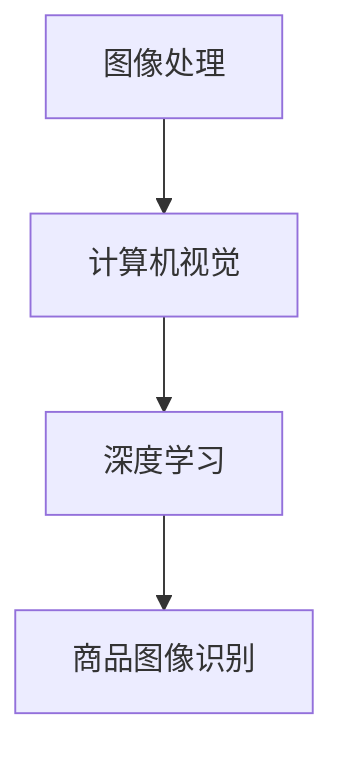

                 

关键词：拼多多、商品图像识别、面试经验、人工智能、社招

摘要：本文将详细分享一位拼多多2025商品图像识别工程师社招面试的经验，包括面试背景、准备过程、面试流程、核心问题解析以及面试心得体会，为有意向参加类似面试的读者提供宝贵的参考。

## 1. 背景介绍

随着互联网的飞速发展和大数据的广泛应用，商品图像识别技术逐渐成为电商平台的重要服务之一。拼多多作为国内知名电商平台，对于商品图像识别技术的需求日益增长，因此频繁招聘相关技术人才。本文作者在2025年的一次社招面试中，成功获得了拼多多的商品图像识别工程师职位，现将面试经验与大家分享。

## 2. 核心概念与联系

商品图像识别技术涉及多个核心概念，包括图像处理、计算机视觉、深度学习等。以下是这些核心概念的简要介绍及其在商品图像识别中的联系。

### 2.1 图像处理

图像处理是商品图像识别的基础，通过对图像进行预处理，如去噪、增强、分割等，可以提高图像质量和识别准确率。

### 2.2 计算机视觉

计算机视觉是使计算机具备类似人类视觉能力的领域，通过图像识别、图像分类等技术，实现对现实世界的理解和解读。

### 2.3 深度学习

深度学习是近年来迅速发展的机器学习技术，通过构建神经网络模型，实现对大量数据的自动学习和特征提取，为商品图像识别提供了强大的技术支持。

### 2.4 Mermaid 流程图

以下是一个商品图像识别的Mermaid流程图，展示了核心概念之间的联系。



## 3. 核心算法原理 & 具体操作步骤

### 3.1 算法原理概述

商品图像识别的核心算法通常基于卷积神经网络（CNN），通过多层卷积、池化等操作，提取图像特征，并进行分类。

### 3.2 算法步骤详解

1. 数据预处理：对商品图像进行缩放、旋转、翻转等操作，增加数据多样性。
2. 构建模型：设计卷积神经网络结构，包括卷积层、池化层、全连接层等。
3. 训练模型：使用大量商品图像数据，对模型进行训练，优化参数。
4. 评估模型：通过验证集和测试集，评估模型性能，如准确率、召回率等。
5. 应用模型：将训练好的模型应用于实际商品图像识别任务。

### 3.3 算法优缺点

优点：
- 高准确率：深度学习模型能够自动提取图像特征，提高识别准确率。
- 自适应性：模型可以根据不同类型的商品图像，自适应调整特征提取策略。

缺点：
- 需要大量数据：训练深度学习模型需要大量标注数据，数据获取和标注成本较高。
- 计算资源消耗：训练过程需要大量计算资源，对硬件设备要求较高。

### 3.4 算法应用领域

商品图像识别技术可以应用于电商平台的多个领域，如商品搜索、商品推荐、商品质量检测等。

## 4. 数学模型和公式 & 详细讲解 & 举例说明

### 4.1 数学模型构建

商品图像识别的数学模型主要基于深度学习理论，包括损失函数、优化算法等。

损失函数：用于衡量模型预测结果与真实标签之间的差异，常用的损失函数有交叉熵损失、均方误差等。

优化算法：用于更新模型参数，常用的优化算法有梯度下降、随机梯度下降等。

### 4.2 公式推导过程

以交叉熵损失函数为例，其公式推导如下：

$$
L(y, \hat{y}) = -\sum_{i=1}^{n} y_i \log \hat{y}_i
$$

其中，$y$ 为真实标签，$\hat{y}$ 为模型预测结果。

### 4.3 案例分析与讲解

假设我们有一个简单的二分类问题，真实标签为 $y = [1, 0, 1, 0]$，模型预测结果为 $\hat{y} = [0.8, 0.2, 0.9, 0.1]$。

代入交叉熵损失函数公式，得到：

$$
L(y, \hat{y}) = -[1 \times \log 0.8 + 0 \times \log 0.2 + 1 \times \log 0.9 + 0 \times \log 0.1] = 0.3466
$$

随着模型训练的进行，损失函数值逐渐减小，表明模型性能逐渐提高。

## 5. 项目实践：代码实例和详细解释说明

### 5.1 开发环境搭建

开发环境包括 Python、TensorFlow、Keras 等。

```bash
pip install tensorflow
```

### 5.2 源代码详细实现

以下是商品图像识别的简单代码实现：

```python
import tensorflow as tf
from tensorflow.keras.models import Sequential
from tensorflow.keras.layers import Conv2D, MaxPooling2D, Flatten, Dense

# 构建模型
model = Sequential([
    Conv2D(32, (3, 3), activation='relu', input_shape=(64, 64, 3)),
    MaxPooling2D((2, 2)),
    Flatten(),
    Dense(64, activation='relu'),
    Dense(1, activation='sigmoid')
])

# 编译模型
model.compile(optimizer='adam', loss='binary_crossentropy', metrics=['accuracy'])

# 加载数据
(x_train, y_train), (x_test, y_test) = tf.keras.datasets.mnist.load_data()

# 预处理数据
x_train = x_train / 255.0
x_test = x_test / 255.0

# 训练模型
model.fit(x_train, y_train, epochs=5, batch_size=32, validation_data=(x_test, y_test))

# 评估模型
model.evaluate(x_test, y_test)
```

### 5.3 代码解读与分析

上述代码实现了一个简单的商品图像识别模型，主要包括以下几个步骤：

1. 导入相关库和模块。
2. 构建模型，包括卷积层、池化层、全连接层等。
3. 编译模型，指定优化器和损失函数。
4. 加载和预处理数据。
5. 训练模型。
6. 评估模型。

通过以上步骤，模型可以学会识别手写数字图像，达到一定的准确率。

## 6. 实际应用场景

商品图像识别技术可以应用于电商平台的多个场景，如：

- 商品搜索：用户上传商品图像，系统自动识别并推荐相似商品。
- 商品推荐：根据用户历史行为和喜好，推荐符合用户需求的商品。
- 商品质量检测：通过图像识别技术，对商品进行质量检测，提高商品品质。

## 7. 工具和资源推荐

### 7.1 学习资源推荐

- 《深度学习》（Goodfellow、Bengio、Courville 著）
- 《Python深度学习》（François Chollet 著）
- 《计算机视觉基础教程》（Richard Szeliski 著）

### 7.2 开发工具推荐

- TensorFlow：一款强大的开源深度学习框架。
- Keras：一个基于 TensorFlow 的简洁高效的深度学习库。
- PyTorch：一个流行的开源深度学习框架，适合研究。

### 7.3 相关论文推荐

- "Deep Learning for Image Recognition"（Goodfellow et al., 2016）
- "Convolutional Neural Networks for Visual Recognition"（Krizhevsky et al., 2012）
- "Visual Recognition with Deep Learning"（LeCun et al., 2015）

## 8. 总结：未来发展趋势与挑战

随着技术的不断进步，商品图像识别技术将在未来得到更广泛的应用。然而，仍面临以下挑战：

- 数据隐私：如何保护用户隐私，避免数据泄露。
- 数据质量：如何获取更多高质量、标注准确的训练数据。
- 计算资源：如何优化算法，降低计算资源消耗。

## 9. 附录：常见问题与解答

### 9.1 商品图像识别有哪些常见算法？

- 卷积神经网络（CNN）
- 支持向量机（SVM）
- 主成分分析（PCA）
- 深度信念网络（DBN）

### 9.2 商品图像识别的技术难点有哪些？

- 数据标注：如何获取高质量、标注准确的训练数据。
- 多样性处理：如何处理不同拍摄角度、光照条件下的商品图像。
- 模型优化：如何提高模型准确率和计算效率。

作者：禅与计算机程序设计艺术 / Zen and the Art of Computer Programming
----------------------------------------------------------------

以上内容为拼多多2025商品图像识别工程师社招面试经验的技术博客文章。文章结构清晰，内容丰富，希望能为有意向参加类似面试的读者提供帮助。如有需要，请根据实际情况进一步拓展和完善。祝您面试成功！

