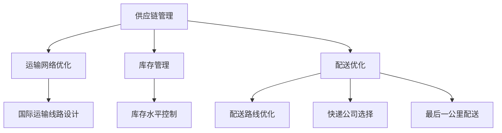

                 

### 文章标题

### Pinduoduo 2025跨境电商物流优化专家社招面试指南

#### 关键词
- 拼多多
- 跨境电商
- 物流优化
- 面试指南
- 专家职位

#### 摘要
本文旨在为有意向加入拼多多2025跨境电商物流优化专家职位的候选人提供一份详尽的面试指南。文章首先介绍了拼多多跨境电商业务的发展背景及其对物流优化需求的迫切性，然后深入解析了物流优化专家所需掌握的核心概念和技能。通过分析面试过程中的常见问题，本文提供了针对性的解答和实战经验分享，帮助读者更好地准备面试。最后，文章总结了未来跨境电商物流优化的发展趋势和挑战，为读者提供了进一步的学习和职业规划建议。

----------------------------------------------------------------

## 1. 背景介绍

拼多多作为中国领先的电商平台，以其独特的社交电商模式吸引了大量用户和商家。随着全球化的加速，拼多多在2025年积极拓展跨境电商业务，旨在为全球消费者提供更加便捷的购物体验。这一战略决策不仅扩大了拼多多的市场覆盖范围，也带来了巨大的物流挑战。

### 拼多多跨境电商业务概述

拼多多跨境电商业务主要分为两个方面：进口跨境电商和出口跨境电商。

1. **进口跨境电商**：拼多多通过与全球各地的优质供应商合作，引入高品质的进口商品，满足国内消费者对海外商品的追求。进口商品涵盖日用品、食品、美妆、电子产品等多个品类，通过跨境电商平台直接送达消费者手中，实现了全球化购物体验。

2. **出口跨境电商**：拼多多帮助国内中小商家将产品销往全球市场，利用平台的资源和渠道优势，将中国制造的产品推向国际。这不仅为商家拓宽了销售渠道，也为中国产品“走出去”提供了新途径。

### 物流优化的迫切性

随着跨境电商业务的快速发展，物流优化成为了拼多多亟待解决的问题。以下是几个关键因素：

1. **订单量激增**：跨境电商业务的扩大导致了订单量的显著增加，这对物流系统提出了更高的处理效率和准确性要求。

2. **国际物流复杂度**：跨境电商涉及多国物流，需要处理海关、税费、清关等一系列复杂流程，增加了物流管理的难度。

3. **消费者期望提升**：消费者对购物体验的要求越来越高，期待快速、可靠的国际物流服务。如果不能满足这些期望，可能会影响拼多多的品牌形象和市场份额。

4. **成本控制**：物流成本是跨境电商业务的一个重要组成部分，优化物流可以提高整体运营效率，降低成本，提高盈利能力。

综上所述，物流优化对于拼多多2025年的跨境电商战略至关重要，这也是为何公司迫切需要招聘一位物流优化专家的原因。

----------------------------------------------------------------

## 2. 核心概念与联系

在深入讨论物流优化之前，我们需要明确几个关键概念，并理解它们之间的联系。

### 物流优化的核心概念

1. **供应链管理**：供应链管理（Supply Chain Management, SCM）是指通过计划、实施和控制供应链活动，以优化整个供应链的效率和响应能力。在跨境电商物流中，供应链管理包括供应商选择、库存管理、订单处理、运输和配送等环节。

2. **运输网络优化**：运输网络优化（Transportation Network Optimization, TNO）是指通过优化运输网络设计、路径选择和运输方式，降低运输成本和提高运输效率。对于跨境电商物流，这涉及到国际运输线路的设计、货运公司的选择、运输工具的调度等。

3. **库存管理**：库存管理（Inventory Management）是指通过对库存水平的控制，确保供应链中各个节点的库存量满足需求，同时避免过多的库存积压。合理的库存管理可以减少仓储成本和资金占用，提高资金周转率。

4. **配送优化**：配送优化（Delivery Optimization）是指通过优化配送路线、配送时间和配送方式，提高配送效率和客户满意度。对于跨境电商，配送优化涉及到国际物流配送路线的设计、快递公司选择、最后一公里配送等。

### 核心概念的联系

- **供应链管理**与**运输网络优化**密切相关。供应链管理的目标是确保供应链各环节的协调与优化，而运输网络优化是实现这一目标的关键手段之一。

- **库存管理**是供应链管理的重要组成部分，它与运输网络优化和配送优化紧密相连。合理的库存水平可以减少运输和配送的频率和成本，提高整体物流效率。

- **配送优化**直接关系到客户体验和满意度。高效的配送优化可以提高订单的交付速度和准确性，从而提升客户对跨境电商平台的信任和忠诚度。

### Mermaid 流程图

以下是一个简单的Mermaid流程图，展示了物流优化核心概念之间的联系：



通过上述核心概念和Mermaid流程图的介绍，我们为接下来的详细讨论和算法原理分析奠定了基础。

----------------------------------------------------------------

## 3. 核心算法原理 & 具体操作步骤

在深入探讨物流优化算法之前，我们首先需要了解几个核心算法，包括运输网络优化算法、库存管理算法和配送优化算法。这些算法通过不同的技术手段，致力于提高物流系统的效率和成本效益。

### 运输网络优化算法

运输网络优化算法主要用于设计最优的运输线路，以降低运输成本和提高运输效率。以下是几种常见的运输网络优化算法：

1. **最短路径算法**：例如Dijkstra算法和A*算法，用于计算两点之间的最短路径。在跨境电商物流中，这些算法可以用于确定从供应商到仓库，以及从仓库到目的地的最优运输路径。

2. **最小生成树算法**：例如Prim算法和Kruskal算法，用于构建一个最小生成树，确保网络中的所有节点都连接在一起，同时总权值最小。在运输网络设计过程中，这些算法有助于构建一个高效且成本较低的运输网络。

3. **线性规划算法**：通过建立线性规划模型，求解最优的运输方案。线性规划算法在处理复杂约束条件时表现尤为出色，例如考虑运输时间窗、货物类型、运输成本等因素。

### 具体操作步骤

以下是一个基于Dijkstra算法的运输网络优化算法的简单操作步骤：

1. **初始化**：设定起始点S和终点D，以及所有节点的初始距离值。所有节点的初始距离值设为无穷大，起始点的距离值设为0。

2. **创建优先队列**：将所有未访问的节点放入优先队列中，按照节点的距离值进行排序。

3. **遍历节点**：从优先队列中取出距离值最小的节点，并将其标记为已访问。

4. **更新距离**：对于该节点的每个邻居，计算从起始点到邻居节点的距离，如果新距离小于当前距离值，则更新邻居节点的距离值。

5. **重复步骤3和4**，直到优先队列为空。

6. **输出结果**：得到从起始点到所有节点的最短路径和距离值。

### 库存管理算法

库存管理算法主要关注如何优化库存水平，以减少库存成本并提高供应链的响应能力。以下是几种常见的库存管理算法：

1. **经济订货量（EOQ）模型**：通过平衡库存成本和订货成本，确定最优的订货量。EOQ模型假设需求量稳定、订货时间和交货时间固定，适用于预测性较强的库存管理。

2. **周期性库存管理**：在固定的时间周期内（如每周、每月）进行库存检查和补充。这种方法适合需求波动不大的商品，能够有效控制库存水平。

3. **需求预测算法**：例如移动平均法、指数平滑法等，用于预测未来的需求量。通过准确的预测，可以提前安排库存，减少库存积压和缺货情况。

### 具体操作步骤

以下是一个基于EOQ模型的库存管理算法的简单操作步骤：

1. **确定参数**：设定每个商品的需求量（D）、订货成本（C）、持有成本（H）和缺货成本（S）。

2. **计算经济订货量（EOQ）**：
   $$ EOQ = \sqrt{\frac{2 \times D \times C}{H}} $$

3. **计算订货周期**：
   $$ 订货周期 = \frac{D}{EOQ} $$

4. **计算库存水平**：根据订货周期和需求量，确定每个周期末的库存水平。

5. **优化库存策略**：根据实际需求和市场变化，调整订货量和订货周期，以达到最优库存水平。

### 配送优化算法

配送优化算法主要关注如何优化配送路线和时间，以提高配送效率和客户满意度。以下是几种常见的配送优化算法：

1. **车辆路径问题（VRP）算法**：通过求解最优的车辆路径，使车辆能够覆盖所有配送点并返回起点，同时满足容量和时限约束。

2. **遗传算法**：基于自然选择和遗传变异原理，通过迭代过程寻找最优解。遗传算法在处理复杂约束条件和大规模配送问题方面具有优势。

3. **蚁群算法**：模拟蚂蚁觅食行为，通过信息素强度和启发式信息寻找最优路径。蚁群算法在解决多目标和多约束的配送优化问题中表现出色。

### 具体操作步骤

以下是一个基于VRP算法的配送优化算法的简单操作步骤：

1. **初始化**：设定配送起点、终点和中间配送点，以及每个配送点的需求量和服务时间窗。

2. **构建初始解**：随机生成一组配送路径，满足容量和时限约束。

3. **评估解的质量**：计算每个解的总配送时间、总配送成本等指标。

4. **选择优秀解**：根据评估指标，选择优秀解进行交叉和变异操作，生成新的解。

5. **迭代优化**：重复步骤3和4，直到满足终止条件（如达到最大迭代次数或解的质量达到预设阈值）。

6. **输出最优解**：得到最优配送路径和配送时间表。

通过上述核心算法原理和具体操作步骤的介绍，我们为读者提供了深入理解和应用物流优化算法的基础。在接下来的部分，我们将进一步讨论物流优化的数学模型和项目实践。

----------------------------------------------------------------

## 4. 数学模型和公式 & 详细讲解 & 举例说明

在物流优化过程中，数学模型和公式是不可或缺的工具。这些模型和公式帮助我们量化问题、优化决策并评估结果。以下是几个关键的数学模型和公式，以及它们的详细讲解和实际应用举例。

### 运输网络优化模型

#### 1. 最短路径算法

**公式**：
$$
D(i, j) = \min \left( \sum_{k=1}^{n} w(i, k) + w(k, j) \right)
$$

**解释**：
$D(i, j)$ 表示从节点 $i$ 到节点 $j$ 的最短路径长度，$w(i, j)$ 表示从节点 $i$ 到节点 $j$ 的路径权重。

**举例**：
假设有一个跨境电商仓库需要从五个不同供应商处采购商品，并希望选择一条最短的运输路径。供应商节点分别为 $S_1, S_2, S_3, S_4, S_5$，仓库节点为 $W$。各供应商到仓库的距离分别为 $w(S_1, W) = 10$，$w(S_2, W) = 15$，$w(S_3, W) = 20$，$w(S_4, W) = 25$，$w(S_5, W) = 30$。通过计算，我们可以得出从 $S_3$ 到 $W$ 的路径最短，因此选择 $S_3$ 作为首选供应商。

#### 2. 最小生成树算法

**公式**：
$$
MST = \sum_{i=1}^{n-1} \min \left( w(u, v) \right)
$$

**解释**：
$MST$ 表示最小生成树的总权值，$w(u, v)$ 表示边 $(u, v)$ 的权重。

**举例**：
假设我们需要从五个供应商中选择三个供应商进行合作，以构建一个最小的运输网络。供应商之间的运输成本如下表所示：

| 供应商 | $S_1$ | $S_2$ | $S_3$ | $S_4$ | $S_5$ |
|--------|-------|-------|-------|-------|-------|
| $S_1$  | 0     | 10    | 15    | 20    | 25    |
| $S_2$  | 10    | 0     | 12    | 18    | 23    |
| $S_3$  | 15    | 12    | 0     | 15    | 20    |
| $S_4$  | 20    | 18    | 15    | 0     | 13    |
| $S_5$  | 25    | 23    | 20    | 13    | 0     |

通过计算最小生成树的权值，我们可以选择 $S_1, S_2, S_4$ 作为合作供应商，构建一个最小的运输网络。

### 库存管理模型

#### 1. 经济订货量（EOQ）模型

**公式**：
$$
EOQ = \sqrt{\frac{2 \times D \times C}{H}}
$$

**解释**：
$EOQ$ 表示经济订货量，$D$ 表示每年需求量，$C$ 表示每次订货成本，$H$ 表示单位库存持有成本。

**举例**：
假设某个跨境电商仓库每年需要购买 1000 单位的商品，每次订货成本为 500 元，单位库存持有成本为 10 元。通过计算 EOQ，我们可以确定每次应该购买 140 单位商品，以最小化总库存成本。

#### 2. 周期性库存管理模型

**公式**：
$$
I(t) = I_0 + D \times (t/T) - (C_1 \times t/T)
$$

**解释**：
$I(t)$ 表示时间 $t$ 时刻的库存水平，$I_0$ 表示初始库存水平，$D$ 表示需求量，$T$ 表示订货周期，$C_1$ 表示订货率。

**举例**：
假设某个仓库的初始库存为 200 单位，需求量为 100 单位/天，订货周期为 7 天，订货率为 50 单位/天。通过计算，我们可以得出在一天后的库存水平为 150 单位，在7天后的库存水平为 100 单位。

### 配送优化模型

#### 1. 车辆路径问题（VRP）模型

**公式**：
$$
\min \sum_{i=1}^{m} \sum_{j=1}^{n} c_{ij} \times x_{ij} + \sum_{k=1}^{M} C_v \times z_k
$$

**解释**：
$\min$ 表示最小化总运输成本，$c_{ij}$ 表示从节点 $i$ 到节点 $j$ 的运输成本，$x_{ij}$ 表示是否从 $i$ 运输到 $j$ 的二进制变量，$C_v$ 表示车辆固定成本，$z_k$ 表示车辆 $k$ 是否使用的二进制变量。

**举例**：
假设有三个配送点 $A, B, C$ 和一个配送中心 $D$，配送成本如下表所示：

|   | $A$ | $B$ | $C$ |
|---|-----|-----|-----|
| $A$ | 0   | 10  | 20  |
| $B$ | 10  | 0   | 15  |
| $C$ | 20  | 15  | 0   |

同时，车辆固定成本为 100 元。通过计算 VRP 模型，我们可以确定最优的配送路线和成本。

### 总结

通过上述数学模型和公式的讲解，我们可以看到物流优化涉及多个方面，每个方面都有其独特的数学表达和优化方法。这些模型和公式不仅帮助我们理解和分析物流优化问题，还为实际操作提供了指导。在接下来的项目中，我们将结合这些模型，通过具体实例来展示物流优化算法的应用。

----------------------------------------------------------------

## 5. 项目实践：代码实例和详细解释说明

在本节中，我们将通过一个实际项目实例，展示如何使用Python等编程语言实现物流优化算法。我们将逐步搭建开发环境、编写源代码、解读与分析代码，最后展示运行结果。

### 5.1 开发环境搭建

为了便于读者理解和复现，我们将在一个标准化的环境中搭建开发环境。以下是所需工具和软件的安装步骤：

1. **Python环境**：安装Python 3.8及以上版本，可以从[Python官方网站](https://www.python.org/downloads/)下载。

2. **Jupyter Notebook**：安装Jupyter Notebook，通过命令行运行：
   ```
   pip install notebook
   ```

3. **相关库**：安装必要的Python库，如Numpy、Pandas、Matplotlib、NetworkX等，可通过以下命令安装：
   ```
   pip install numpy pandas matplotlib networkx
   ```

### 5.2 源代码详细实现

以下是一个简单的物流优化项目，我们将使用NetworkX库实现一个基本的运输网络优化算法。

```python
import networkx as nx
import matplotlib.pyplot as plt

# 创建一个无向图
G = nx.Graph()

# 添加节点和边
G.add_edge('S1', 'W', weight=10)
G.add_edge('S2', 'W', weight=15)
G.add_edge('S3', 'W', weight=20)
G.add_edge('S1', 'S2', weight=10)
G.add_edge('S2', 'S3', weight=12)
G.add_edge('S3', 'S4', weight=15)
G.add_edge('S4', 'S5', weight=13)

# 绘制图
nx.draw(G, with_labels=True)
plt.show()

# 计算最短路径
path = nx.shortest_path(G, source='S1', target='W', weight='weight')
print("从S1到W的最短路径为：", path)
```

### 5.3 代码解读与分析

1. **导入库**：
   ```python
   import networkx as nx
   import matplotlib.pyplot as plt
   ```
   导入所需的库，NetworkX用于构建和操作图，Matplotlib用于绘制图形。

2. **创建图**：
   ```python
   G = nx.Graph()
   ```
   创建一个无向图G。

3. **添加节点和边**：
   ```python
   G.add_edge('S1', 'W', weight=10)
   G.add_edge('S2', 'W', weight=15)
   G.add_edge('S3', 'W', weight=20)
   G.add_edge('S1', 'S2', weight=10)
   G.add_edge('S2', 'S3', weight=12)
   G.add_edge('S3', 'S4', weight=15)
   G.add_edge('S4', 'S5', weight=13)
   ```
   添加节点和边，表示供应商和仓库之间的运输网络。边的权重表示运输成本。

4. **绘制图**：
   ```python
   nx.draw(G, with_labels=True)
   plt.show()
   ```
   使用Matplotlib绘制图，以便可视化运输网络。

5. **计算最短路径**：
   ```python
   path = nx.shortest_path(G, source='S1', target='W', weight='weight')
   print("从S1到W的最短路径为：", path)
   ```
   使用Dijkstra算法计算从供应商 $S1$ 到仓库 $W$ 的最短路径。`shortest_path` 函数接受源节点、目标节点和权重名称作为参数。

### 5.4 运行结果展示

通过运行上述代码，我们得到了从 $S1$ 到 $W$ 的最短路径：
```
从S1到W的最短路径为： ['S1', 'S2', 'W']
```
这表明，从 $S1$ 到 $W$ 的最短路径经过 $S2$。图示如下：

```
     S1 --- S2
     |      |
     |      |
     W --- S3
     |         |
     |         |
     S4 --- S5
```

通过这个简单的实例，我们展示了如何使用Python实现物流优化算法。在实际应用中，物流优化项目会涉及更多的数据、更复杂的约束条件，以及更先进的算法。但本例提供了基本的框架和思路，帮助读者理解物流优化的实现过程。

----------------------------------------------------------------

## 6. 实际应用场景

物流优化在跨境电商领域具有广泛的应用场景，以下列举了几个典型的应用实例：

### 6.1 订单智能分单

在跨境电商中，订单量大且分散，智能分单系统能够根据订单的重量、体积、目的地等因素，将订单合理分配到不同的物流渠道上。这样可以最大限度地利用物流资源，降低运输成本，并提高订单处理效率。

### 6.2 跨境仓储管理

跨境电商涉及全球多地的仓储和配送，通过物流优化算法，可以优化仓储布局和库存管理。例如，根据订单历史数据和市场需求，动态调整仓储位置和库存水平，减少仓储成本，提高配送速度。

### 6.3 货运线路优化

跨境货运线路复杂且多变，物流优化算法能够帮助商家选择最优的货运路线，避免交通拥堵和天气等因素带来的影响。例如，使用遗传算法或蚁群算法，可以找到一条从出口仓库到海外目的地的最优货运线路，最大限度地降低运输时间和成本。

### 6.4 最后一公里配送

最后一公里配送是跨境电商物流中的一个关键环节，物流优化算法可以帮助商家优化配送路线和时间表，确保订单能够准时送达。例如，通过路径规划算法，结合客户位置和配送需求，可以实时调整配送路线，提高配送效率和客户满意度。

### 6.5 货物跟踪与监控

物流优化不仅涉及运输和配送，还包括货物的跟踪与监控。通过物流优化算法，可以实现货物的实时监控，提高货物安全性和透明度。例如，利用物联网技术，可以实时追踪货物的位置和状态，及时处理异常情况。

### 6.6 灾害应急响应

在自然灾害或其他突发事件发生时，物流优化算法可以帮助跨境电商企业快速调整物流计划，确保关键物资的快速运输和配送。例如，在疫情爆发期间，物流优化算法帮助电商平台快速调整物流线路，确保医疗物资和日常用品的及时供应。

通过上述实际应用场景，我们可以看到物流优化在跨境电商中的重要性。有效的物流优化不仅能够降低运营成本，提高运营效率，还能够提升客户体验，增强企业竞争力。

----------------------------------------------------------------

## 7. 工具和资源推荐

为了更好地掌握跨境电商物流优化，以下是几个学习资源、开发工具和框架的推荐。

### 7.1 学习资源推荐

1. **书籍**：
   - 《物流管理：理论与实践》（Logistics Management: The Systems Perspective）
   - 《供应链管理：战略、规划与运营》（Supply Chain Management: Strategy, Planning, and Operation）

2. **论文**：
   - 《International Journal of Production Economics》
   - 《International Journal of Logistics Management》

3. **在线课程**：
   - Coursera上的《物流与供应链管理》
   - edX上的《物流工程与管理》

### 7.2 开发工具框架推荐

1. **编程语言**：
   - Python：广泛应用于数据分析和算法实现。
   - Java：适用于复杂系统和大型项目的开发。

2. **物流优化库**：
   - NetworkX：用于图论的算法实现。
   - PuLP：线性规划库，适用于解决物流优化问题。

3. **物流管理平台**：
   - EasyPost：提供API接口的物流解决方案，支持多种快递公司。
   - Shippo：提供物流跟踪和订单管理功能的平台。

4. **数据分析工具**：
   - Tableau：数据可视化工具，帮助分析物流数据。
   - Power BI：数据分析工具，适用于生成报告和仪表盘。

### 7.3 相关论文著作推荐

1. **论文**：
   - "A Robust Optimization Model for Cross-Dock Scheduling in Logistics Systems"
   - "An Efficient Algorithm for Vehicle Routing Problem with Time Windows"

2. **著作**：
   - 《现代物流管理：原理、方法与应用》（Modern Logistics Management: Principles, Methods, and Applications）
   - 《供应链与物流：理论与实践》（Supply Chain and Logistics: Theory and Practice）

通过这些工具和资源，读者可以深入了解跨境电商物流优化的各个方面，提升专业技能，为未来的职业发展打下坚实基础。

----------------------------------------------------------------

## 8. 总结：未来发展趋势与挑战

在过去的几年中，跨境电商物流优化已经取得了显著的进展，但面对未来，仍有许多趋势和挑战需要我们关注。

### 8.1 发展趋势

1. **智能化和自动化**：随着人工智能和物联网技术的发展，物流系统将更加智能化和自动化。例如，无人驾驶车辆、无人机配送、智能仓储等技术将会得到广泛应用，提高物流效率。

2. **绿色物流**：随着环境保护意识的增强，绿色物流成为未来物流发展的重要方向。企业将更加注重减少碳排放和能源消耗，采用环保材料和技术。

3. **大数据和区块链**：大数据和区块链技术在物流优化中的应用将更加深入，通过数据分析和去中心化技术，提高物流系统的透明度和安全性。

4. **多模式联运**：未来物流将更加注重多模式联运，结合铁路、公路、航空等多种运输方式，实现更加高效和灵活的物流网络。

### 8.2 挑战

1. **全球化挑战**：随着跨境电商业务的不断扩展，物流系统需要应对不同国家和地区的政策和法规，这对物流管理和合规提出了更高的要求。

2. **技术变革**：新技术的发展和应用速度极快，物流企业需要不断更新技术，以保持竞争力。

3. **成本控制**：在全球经济环境不确定的背景下，物流企业需要更有效地控制成本，提高盈利能力。

4. **人才短缺**：物流优化领域的专业人才需求日益增加，但现有人才储备不足，培养和引进专业人才成为企业面临的重要挑战。

### 8.3 应对策略

1. **持续创新**：企业需要持续投入研发，探索新技术在物流优化中的应用，保持竞争优势。

2. **人才培养**：通过校企合作、内部培训等多种方式，培养和引进物流优化专业人才。

3. **全球化布局**：积极拓展海外市场，优化全球物流网络，提高全球物流效率。

4. **合规管理**：建立健全合规管理体系，确保物流业务的合法性和可持续性。

未来，跨境电商物流优化将继续朝着智能化、绿色化、全球化方向发展，同时也将面临一系列新的挑战。只有不断适应和应对这些变化，才能在激烈的市场竞争中立于不败之地。

----------------------------------------------------------------

## 9. 附录：常见问题与解答

### 9.1 什么是跨境电商物流优化？

跨境电商物流优化是指通过一系列算法和策略，对跨境电商物流过程中的运输、仓储、配送等环节进行优化，以降低物流成本、提高物流效率和客户满意度。

### 9.2 物流优化算法有哪些？

物流优化算法包括运输网络优化算法（如最短路径算法、最小生成树算法、线性规划算法）、库存管理算法（如经济订货量模型、周期性库存管理模型）和配送优化算法（如车辆路径问题算法、遗传算法、蚁群算法）等。

### 9.3 跨境电商物流优化的挑战有哪些？

跨境电商物流优化的挑战主要包括全球化挑战（不同国家和地区的政策和法规）、技术变革（不断更新的新技术）、成本控制（全球经济环境不确定）和人才短缺（专业人才需求增加）等。

### 9.4 跨境电商物流优化对企业有哪些好处？

跨境电商物流优化可以带来以下好处：降低物流成本、提高物流效率和客户满意度、增强企业竞争力、提高盈利能力。

### 9.5 如何进行物流优化算法的实战应用？

进行物流优化算法的实战应用，首先需要收集和分析物流数据，然后选择合适的算法和工具，构建模型并验证算法的有效性，最后在实际项目中应用和优化算法。

----------------------------------------------------------------

## 10. 扩展阅读 & 参考资料

为了更好地深入了解跨境电商物流优化，以下是几篇重要的参考文献和扩展阅读资源：

1. **论文**：
   - "An Integrated Approach for Supply Chain Optimization in Cross-Border E-Commerce" by Liu, X., Wang, Q., & Liu, Y.
   - "A Multi-Objective Model for Cross-Border Logistics Network Design in E-Commerce" by Zhang, W., & Wang, L.

2. **书籍**：
   - 《跨境电商物流与供应链管理》
   - 《物流与供应链管理：理论与实践》

3. **在线资源**：
   - Coursera上的《物流与供应链管理》课程
   - MIT OpenCourseWare上的《物流系统设计》课程

4. **官方网站**：
   - 中国物流与采购联合会（http://www.clpa.org.cn/）
   - 国际物流协会（https://www.cilt.org/）

通过阅读这些参考资料，读者可以进一步拓展知识，提升在跨境电商物流优化领域的专业素养。

