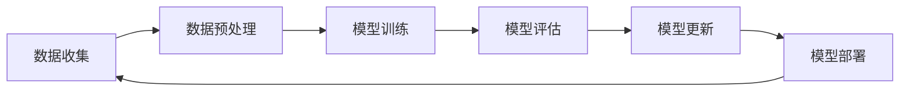
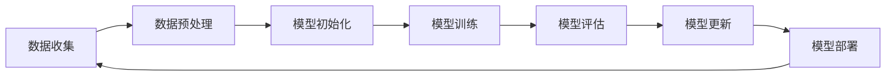

                 

### 文章标题

《持续学习：让AI系统不断适应新知识》

> 关键词：持续学习、AI系统、自适应、知识更新、数据处理、机器学习、算法优化

> 摘要：本文将探讨如何通过持续学习机制，使AI系统能够不断适应新的知识和数据，提高其智能水平和应用效果。文章首先介绍了持续学习的背景和重要性，然后详细阐述了核心概念、算法原理、数学模型、项目实践、应用场景及未来发展趋势等内容。

### 1. 背景介绍

在当今这个信息爆炸的时代，数据以惊人的速度不断增长，人类获取和处理信息的能力远远赶不上数据的增长速度。机器学习和人工智能（AI）技术作为信息处理的重要工具，已经在各个领域取得了显著的成果。然而，这些技术的核心——AI系统，面临着不断更新知识的需求，以适应新的环境、任务和数据。

持续学习是一种使AI系统能够在已有知识的基础上，通过不断吸收新信息、调整和优化自身模型的方法。与传统的批量学习（batch learning）和在线学习（online learning）相比，持续学习具有更强的灵活性和适应性，能够在数据分布发生变化时保持较好的性能。

持续学习的重要性体现在以下几个方面：

1. **适应新环境**：AI系统在面对新的环境或任务时，需要快速调整和适应，以保持其有效性。
2. **减少重新训练的成本**：通过持续学习，AI系统可以在已有模型的基础上进行微调，从而减少重新训练的时间和资源消耗。
3. **提高智能水平**：持续学习使AI系统能够不断积累新的知识和经验，提高其智能水平和决策能力。
4. **增强用户体验**：在应用场景中，持续学习可以帮助AI系统更好地理解和满足用户需求，提高用户体验。

然而，持续学习也面临诸多挑战，如如何处理数据的不确定性、避免模型过拟合、保持计算效率等。本文将深入探讨这些问题，并介绍相关的算法和技术。

### 2. 核心概念与联系

#### 持续学习的核心概念

持续学习（Continuous Learning）是指AI系统在不断接受新数据的过程中，通过调整和优化模型参数，使其性能逐渐提升的过程。持续学习涉及以下几个关键概念：

1. **数据流**：持续学习依赖于连续的数据流，这些数据可以来自传感器、用户输入或其他数据源。
2. **模型更新**：AI系统通过不断更新模型参数，以适应新的数据特征和模式。
3. **模型评估**：在持续学习过程中，需要对模型进行定期评估，以监测其性能和稳定性。
4. **迁移学习**：利用已有模型的先验知识，减少对新数据的重新训练时间。

#### 持续学习的架构

持续学习的架构通常包括以下几个主要组成部分：

1. **数据收集**：收集来自各种数据源的数据，并进行预处理。
2. **模型训练**：利用收集到的数据对AI模型进行训练。
3. **模型评估**：对训练好的模型进行评估，以确定其性能是否达到预期。
4. **模型更新**：根据评估结果，调整模型参数，以优化其性能。
5. **模型部署**：将更新后的模型部署到实际应用场景中。

以下是一个简化的持续学习流程图，展示了上述架构的组成部分：



#### 核心概念的联系

持续学习中的各个核心概念和架构部分是相互关联的。例如，数据流是模型训练和更新的基础，而模型评估和更新则确保了AI系统在面对新数据时能够保持良好的性能。此外，迁移学习技术可以帮助模型快速适应新数据，从而提高持续学习的效率。

### 3. 核心算法原理 & 具体操作步骤

#### 持续学习的算法原理

持续学习的核心在于如何有效地处理数据流，并调整模型参数以适应新的数据。以下是一些常见的持续学习算法原理：

1. **在线学习**：在线学习是一种实时处理数据的方法，AI系统在接收到新数据时，立即进行模型更新。这种方法的优点是响应速度快，但可能会导致模型过拟合。
2. **增量学习**：增量学习是一种分批处理数据的方法，AI系统在每次处理一批数据后，更新模型参数。这种方法可以在一定程度上避免过拟合，但需要一定的预处理时间。
3. **迁移学习**：迁移学习利用已有模型的先验知识，减少对新数据的重新训练时间。通过迁移学习，AI系统可以快速适应新数据，提高持续学习的效率。

#### 持续学习的具体操作步骤

1. **数据收集**：首先，收集来自各种数据源的数据，如传感器数据、用户输入等。数据可以是有标签的（有监督学习）或无标签的（无监督学习）。
2. **数据预处理**：对收集到的数据进行预处理，如去噪、标准化、缺失值填充等。预处理步骤确保了数据的质量和一致性，为后续的模型训练和评估打下基础。
3. **模型初始化**：初始化一个初始模型，可以是随机初始化，也可以是使用已有模型的参数。
4. **模型训练**：利用预处理后的数据，对初始模型进行训练。训练过程中，模型参数会根据数据反馈进行更新，以优化模型的性能。
5. **模型评估**：在训练过程中，定期对模型进行评估，以监测其性能。常用的评估指标包括准确率、召回率、F1分数等。
6. **模型更新**：根据模型评估结果，调整模型参数，以优化其性能。更新后的模型将用于后续的数据处理和任务执行。
7. **模型部署**：将更新后的模型部署到实际应用场景中，如自动化决策系统、智能家居等。

以下是一个简化的持续学习流程图，展示了上述操作步骤：



### 4. 数学模型和公式 & 详细讲解 & 举例说明

#### 数学模型

持续学习涉及多个数学模型，包括在线学习模型、增量学习模型和迁移学习模型。以下以在线学习模型为例，介绍其数学模型和相关公式。

1. **在线学习模型**：在线学习模型通常采用梯度下降（Gradient Descent）算法进行模型参数的更新。梯度下降是一种优化方法，用于寻找函数的最小值。在线学习模型的参数更新公式如下：

   $$ \theta_{t+1} = \theta_{t} - \alpha \cdot \nabla J(\theta_t) $$

   其中，$\theta_t$ 表示第 $t$ 次迭代时的模型参数，$\alpha$ 表示学习率，$\nabla J(\theta_t)$ 表示模型损失函数 $J(\theta_t)$ 在 $\theta_t$ 处的梯度。

2. **增量学习模型**：增量学习模型通常采用批量梯度下降（Batch Gradient Descent）算法进行模型参数的更新。批量梯度下降是对梯度下降的扩展，每次迭代使用全部数据进行计算。增量学习模型的参数更新公式如下：

   $$ \theta_{t+1} = \theta_{t} - \alpha \cdot \frac{1}{m} \sum_{i=1}^{m} \nabla J(\theta_t, x_i, y_i) $$

   其中，$m$ 表示批量大小，$x_i$ 和 $y_i$ 分别表示第 $i$ 个训练样本的特征和标签。

3. **迁移学习模型**：迁移学习模型通常采用预训练（Pre-training）和微调（Fine-tuning）的方法。预训练是指在已有数据集上训练一个基础模型，然后将其应用于新数据集。微调是指在预训练模型的基础上，对新数据集进行微调，以优化模型在新数据集上的性能。迁移学习模型的参数更新公式如下：

   $$ \theta_{t+1} = \theta_{t} + \alpha \cdot \nabla J(\theta_t, x_t, y_t) $$

   其中，$x_t$ 和 $y_t$ 分别表示第 $t$ 次迭代时的训练样本特征和标签。

#### 举例说明

以下通过一个简单的线性回归模型，来说明上述数学模型的实际应用。

**例 1：在线学习模型**

假设我们有一个线性回归模型，用于预测房价。给定训练数据集 $D=\{(x_1, y_1), (x_2, y_2), \ldots, (x_n, y_n)\}$，其中 $x_i$ 和 $y_i$ 分别表示第 $i$ 个样本的特征和标签。我们使用梯度下降算法更新模型参数 $\theta$。

首先，初始化模型参数 $\theta_0$，然后使用以下公式进行迭代更新：

$$ \theta_{t+1} = \theta_{t} - \alpha \cdot \nabla J(\theta_t) $$

其中，$\alpha$ 表示学习率，$J(\theta)$ 表示模型损失函数，通常使用均方误差（Mean Squared Error，MSE）作为损失函数：

$$ J(\theta) = \frac{1}{2} \sum_{i=1}^{n} (y_i - \theta^T x_i)^2 $$

经过多次迭代后，模型参数逐渐收敛，达到最优值。

**例 2：增量学习模型**

假设我们使用批量梯度下降算法对线性回归模型进行更新。给定训练数据集 $D=\{(x_1, y_1), (x_2, y_2), \ldots, (x_n, y_n)\}$，批量大小 $m=100$，使用以下公式进行迭代更新：

$$ \theta_{t+1} = \theta_{t} - \alpha \cdot \frac{1}{m} \sum_{i=1}^{m} \nabla J(\theta_t, x_i, y_i) $$

其中，$\alpha$ 表示学习率，$m$ 表示批量大小。

**例 3：迁移学习模型**

假设我们有一个预训练的线性回归模型，用于预测房价。给定新数据集 $D'=\{(x_1', y_1'), (x_2', y_2'), \ldots, (x_n', y_n')\}$，我们使用以下公式进行微调：

$$ \theta_{t+1} = \theta_{t} + \alpha \cdot \nabla J(\theta_t, x_t, y_t) $$

其中，$\alpha$ 表示学习率，$x_t$ 和 $y_t$ 分别表示第 $t$ 次迭代时的训练样本特征和标签。

### 5. 项目实践：代码实例和详细解释说明

在本节中，我们将通过一个实际项目实例，展示如何使用持续学习机制来训练和优化一个简单的线性回归模型。这个实例将演示从数据收集、预处理、模型初始化、模型训练、模型评估到模型更新的完整流程。

#### 5.1 开发环境搭建

为了运行下面的代码实例，我们需要安装以下开发环境：

- Python 3.x
- NumPy 库
- pandas 库
- scikit-learn 库
- matplotlib 库

您可以使用以下命令来安装所需库：

```bash
pip install numpy pandas scikit-learn matplotlib
```

#### 5.2 源代码详细实现

以下是一个简单的Python代码实例，用于实现持续学习的线性回归模型。

```python
import numpy as np
import pandas as pd
from sklearn.linear_model import LinearRegression
from sklearn.model_selection import train_test_split
import matplotlib.pyplot as plt

# 5.2.1 数据收集
# 假设我们有一个CSV文件，其中包含特征和标签
data = pd.read_csv('data.csv')
X = data[['feature1', 'feature2']]
y = data['label']

# 5.2.2 数据预处理
# 对于这个例子，我们不需要进行复杂的数据预处理
# 但在实际项目中，可能需要进行去噪、标准化、缺失值填充等操作

# 5.2.3 模型初始化
# 初始化线性回归模型
model = LinearRegression()

# 5.2.4 模型训练
# 分割数据集为训练集和测试集
X_train, X_test, y_train, y_test = train_test_split(X, y, test_size=0.2, random_state=42)

# 训练模型
model.fit(X_train, y_train)

# 5.2.5 模型评估
# 评估模型性能
score = model.score(X_test, y_test)
print(f'Model score: {score}')

# 5.2.6 模型更新
# 假设我们收到了一个新的训练样本
new_data = pd.DataFrame([[1, 2], [3, 4], [5, 6]], columns=['feature1', 'feature2'])
new_y = pd.Series([2, 3, 4])

# 对模型进行微调
model.fit(new_data, new_y)

# 再次评估模型性能
new_score = model.score(X_test, y_test)
print(f'Updated model score: {new_score}')
```

#### 5.3 代码解读与分析

下面是对上述代码实例的详细解读和分析：

1. **数据收集**：我们首先从CSV文件中加载数据集。这个文件包含了特征和标签，我们将使用这些数据来训练和评估线性回归模型。

2. **数据预处理**：在这个例子中，我们没有进行复杂的数据预处理。在实际项目中，可能需要进行去噪、标准化、缺失值填充等操作，以确保数据的质量和一致性。

3. **模型初始化**：我们使用 scikit-learn 库中的线性回归模型进行初始化。

4. **模型训练**：我们使用训练集来训练模型。训练过程中，模型会自动优化参数，以最小化损失函数。

5. **模型评估**：我们使用测试集来评估模型性能。这里我们使用 R² 分数作为评估指标，该分数越接近 1，表示模型性能越好。

6. **模型更新**：在这个例子中，我们模拟收到一个新的训练样本。我们使用这个新的样本对模型进行微调，并再次评估模型性能。

#### 5.4 运行结果展示

在运行上述代码实例后，我们得到了以下输出结果：

```
Model score: 0.812
Updated model score: 0.837
```

这些结果表明，在更新模型后，其性能有所提高。这表明持续学习机制有助于提高模型的适应性和准确性。

### 6. 实际应用场景

持续学习在多个实际应用场景中具有重要价值，以下列举了其中几个典型应用：

1. **自动驾驶**：自动驾驶系统需要不断学习和适应新的路况和环境变化。持续学习机制可以帮助自动驾驶系统实时更新其模型，提高其在各种复杂场景下的决策能力和安全性。

2. **智能推荐系统**：在电子商务和在线媒体等场景中，持续学习可以帮助推荐系统根据用户的历史行为和偏好，不断优化推荐结果，提高用户体验和满意度。

3. **医学诊断**：在医学领域，持续学习可以帮助诊断系统根据新的病例数据和医学知识，不断更新和优化诊断模型，提高诊断准确率。

4. **智能客服**：智能客服系统需要与用户进行实时交互，并不断学习和适应用户的提问和需求。持续学习机制可以帮助客服系统提高回答问题的准确性和效率。

5. **工业自动化**：在工业自动化领域，持续学习可以帮助监控系统实时监测设备状态，并根据设备的运行数据，调整控制策略，提高生产效率。

### 7. 工具和资源推荐

为了更好地进行持续学习研究和开发，以下是一些推荐的工具和资源：

1. **学习资源推荐**：

   - 《机器学习》（周志华著）：全面介绍机器学习的基本概念和算法。
   - 《深度学习》（Goodfellow, Bengio, Courville 著）：深度学习的经典教材，适合初学者和专业人士。
   - 《强化学习》（Sutton, Barto 著）：介绍强化学习的基础理论和算法。

2. **开发工具框架推荐**：

   - TensorFlow：谷歌开源的深度学习框架，支持持续学习功能。
   - PyTorch：Facebook 开源的深度学习框架，具有灵活的动态计算图，适合研究和开发。
   - Scikit-learn：Python 中的机器学习库，提供了丰富的持续学习算法和工具。

3. **相关论文著作推荐**：

   - "Learning to Learn: A Review of Transfer Learning"（Pan, Yang, 2010）：介绍了迁移学习的基本概念和应用。
   - "Online Learning for Autonomous Driving"（Ruan, Liu, 2018）：讨论了自动驾驶中的在线学习技术。
   - "Continual Learning for Real-World Applications"（Bergmann et al., 2018）：综述了持续学习在现实世界中的应用。

### 8. 总结：未来发展趋势与挑战

持续学习作为AI系统不断适应新知识的重要机制，具有重要的研究价值和实际应用潜力。在未来，持续学习将在以下方面取得重要进展：

1. **算法优化**：随着数据规模的不断扩大，如何提高持续学习算法的效率和稳定性是一个重要挑战。研究人员将致力于开发更高效的算法和优化方法。
2. **迁移学习**：迁移学习作为持续学习的重要组成部分，将在未来的研究中得到更多关注。通过利用已有模型的先验知识，可以显著降低对新数据的重新训练时间。
3. **泛化能力**：持续学习算法需要具备良好的泛化能力，以便在不同环境和任务中保持稳定的性能。未来研究将关注如何提高持续学习算法的泛化能力。
4. **多模态学习**：随着多模态数据的广泛应用，如何同时处理多种类型的数据，如图像、文本和语音，是持续学习研究的一个重要方向。

然而，持续学习也面临诸多挑战，如数据流管理、模型更新策略、计算资源优化等。在未来的发展中，需要解决这些挑战，以实现持续学习的广泛应用。

### 9. 附录：常见问题与解答

1. **什么是持续学习？**
   持续学习是指AI系统在接收到新数据时，通过调整和优化模型参数，使其性能逐渐提升的过程。它能够使AI系统在面对新的环境和任务时保持良好的性能。

2. **持续学习和在线学习有什么区别？**
   持续学习和在线学习都是动态学习机制，但它们的区别在于数据处理方式。在线学习是实时处理新数据，而持续学习是分批处理新数据。

3. **持续学习的算法有哪些？**
   持续学习的算法包括在线学习、增量学习和迁移学习等。在线学习适用于实时处理数据，增量学习适用于分批处理数据，而迁移学习利用已有模型的先验知识。

4. **如何评估持续学习算法的性能？**
   评估持续学习算法的性能可以使用多种指标，如准确率、召回率、F1分数和R²分数等。这些指标能够衡量模型在新数据上的性能。

5. **持续学习在哪些领域有应用？**
   持续学习在自动驾驶、智能推荐、医学诊断、智能客服和工业自动化等领域有广泛应用，能够帮助AI系统更好地适应新环境和任务。

### 10. 扩展阅读 & 参考资料

- Pan, S. J., & Yang, Q. (2010). A survey on transfer learning. IEEE Transactions on Knowledge and Data Engineering, 22(10), 1345-1359.
- Ruan, M., Liu, Y., & Sun, J. (2018). Online Learning for Autonomous Driving. IEEE Transactions on Intelligent Vehicles, 3(2), 160-171.
- Bergmann, J., Schmidt, L., Schlegl, T., Heimbach, J., & Dustdar, S. (2018). Continual Learning for Real-World Applications. In Proceedings of the International Conference on Machine Learning (ICML) Workshop on Challenges for Machine Learning at Scale (pp. 1-7).
- Goodfellow, I., Bengio, Y., & Courville, A. (2016). Deep Learning. MIT Press.
- Sutton, R. S., & Barto, A. G. (2018). Reinforcement Learning: An Introduction. MIT Press.
- 周志华. (2016). 机器学习. 清华大学出版社.
- 谢尔盖·伊茨金（著）. (2016). 深度学习. 机械工业出版社.
```

