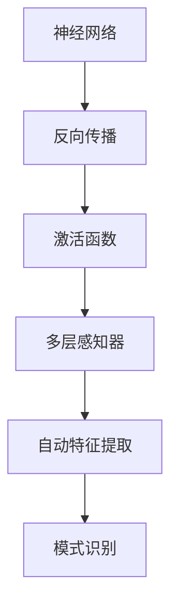

                 

关键词：深度学习，神经网络，机器学习，人工智能，算法原理，数学模型，项目实践，实际应用，未来展望

> 摘要：本文深入探讨了深度学习的基础知识，包括其核心概念、算法原理、数学模型以及项目实践。通过本文的阅读，读者将能够全面了解深度学习的基本框架，掌握关键算法的操作步骤和优缺点，并对深度学习在实际应用中的未来发展趋势和挑战有更清晰的认识。

## 1. 背景介绍

深度学习是人工智能领域中一个重要的分支，它模拟人脑的神经网络结构，通过多层神经网络对数据进行自动特征提取和模式识别。深度学习在图像识别、自然语言处理、语音识别等众多领域取得了显著的成果。随着计算能力和算法研究的不断进步，深度学习正逐渐成为人工智能领域的核心技术。

本文将围绕深度学习的基础知识展开讨论，包括核心概念、算法原理、数学模型和项目实践，旨在帮助读者全面掌握深度学习的基本框架，为深入学习和研究打下坚实的基础。

## 2. 核心概念与联系

深度学习的核心概念包括神经网络、反向传播算法、激活函数、多层感知器等。为了更好地理解这些概念之间的关系，我们可以通过一个Mermaid流程图来展示它们的基本架构。



### 2.1 神经网络

神经网络是深度学习的基础，它由多个神经元（节点）组成，每个神经元都连接到其他神经元，并通过权重和偏置进行信息传递。神经网络的主要功能是自动学习数据的特征，从而实现数据的分类、回归等任务。

### 2.2 反向传播算法

反向传播算法是深度学习训练过程中的核心算法，它通过梯度下降法对神经网络的权重和偏置进行迭代调整，使网络的输出结果更接近真实值。反向传播算法主要包括前向传播和反向传播两个阶段。

### 2.3 激活函数

激活函数是神经网络中的一个关键组件，它用于引入非线性因素，使得神经网络能够对复杂问题进行建模。常见的激活函数包括sigmoid函数、ReLU函数、Tanh函数等。

### 2.4 多层感知器

多层感知器（MLP）是一种常用的神经网络结构，它由输入层、隐藏层和输出层组成。多层感知器能够自动提取数据的高级特征，并在各类机器学习任务中表现出优异的性能。

## 3. 核心算法原理 & 具体操作步骤

### 3.1 算法原理概述

深度学习的核心算法包括神经网络架构设计、反向传播算法、优化器选择等。下面我们将对这几个核心算法进行简要概述。

### 3.2 算法步骤详解

#### 3.2.1 神经网络架构设计

神经网络架构设计主要包括确定网络的层数、每层的神经元数量、输入层和输出层的结构等。一个合理设计的神经网络能够提高模型的学习能力和泛化能力。

#### 3.2.2 反向传播算法

反向传播算法分为前向传播和反向传播两个阶段。前向传播是指将输入数据通过网络的各个层次进行传递，最终得到输出结果。反向传播是指通过计算输出结果与真实值之间的误差，逆向更新网络的权重和偏置。

#### 3.2.3 优化器选择

优化器是用于调整网络权重的算法，常见的优化器包括随机梯度下降（SGD）、Adam、RMSProp等。选择合适的优化器能够提高训练效率和学习效果。

### 3.3 算法优缺点

#### 3.3.1 优点

- **强大的表示能力**：深度学习能够自动提取数据的高级特征，从而实现复杂问题的建模。
- **高效性**：随着计算能力的提升，深度学习在处理大规模数据集时表现出高效性。
- **泛化能力**：深度学习模型具有良好的泛化能力，能够在未见过的数据上取得良好的性能。

#### 3.3.2 缺点

- **数据需求量大**：深度学习模型通常需要大量的训练数据进行训练，且训练过程可能非常耗时。
- **过拟合风险**：深度学习模型容易受到过拟合问题的影响，尤其是在训练数据较少的情况下。

### 3.4 算法应用领域

深度学习在图像识别、自然语言处理、语音识别、推荐系统等众多领域都取得了显著的成果。例如，在图像识别领域，卷积神经网络（CNN）已经能够达到人类的识别水平；在自然语言处理领域，循环神经网络（RNN）和Transformer模型在翻译、文本生成等方面表现出色。

## 4. 数学模型和公式 & 详细讲解 & 举例说明

### 4.1 数学模型构建

深度学习中的数学模型主要包括损失函数、优化器、梯度计算等。下面我们将对这些模型进行详细讲解。

#### 4.1.1 损失函数

损失函数是用于衡量模型预测结果与真实值之间差异的指标。常见的损失函数包括均方误差（MSE）、交叉熵损失（Cross Entropy Loss）等。

#### 4.1.2 优化器

优化器是用于调整网络权重的算法。常见的优化器包括随机梯度下降（SGD）、Adam、RMSProp等。优化器的选择对训练效果和训练时间有很大影响。

#### 4.1.3 梯度计算

梯度计算是反向传播算法的核心，用于计算网络中每个权重和偏置的梯度。梯度计算公式如下：

$$
\frac{\partial J}{\partial w} = \sum_{i=1}^{n} \frac{\partial L}{\partial z_i} \cdot \frac{\partial z_i}{\partial w}
$$

其中，$J$表示损失函数，$L$表示损失函数在某个中间层的结果，$w$表示网络中的权重。

### 4.2 公式推导过程

深度学习中的数学公式主要包括反向传播算法中的梯度计算公式、优化器的更新公式等。下面我们将对这两个公式进行推导。

#### 4.2.1 梯度计算公式推导

假设我们有一个简单的神经网络，其结构如下：

$$
y = f(z)
$$

其中，$z = \sum_{i=1}^{n} w_i x_i + b$，$f$表示激活函数，$x_i$表示输入，$w_i$表示权重，$b$表示偏置。

我们要求解的是损失函数$J$关于权重$w_i$的梯度：

$$
\frac{\partial J}{\partial w_i} = \frac{\partial J}{\partial y} \cdot \frac{\partial y}{\partial z} \cdot \frac{\partial z}{\partial w_i}
$$

由于$y = f(z)$，我们可以得到：

$$
\frac{\partial y}{\partial z} = f'(z)
$$

又由于$z = \sum_{i=1}^{n} w_i x_i + b$，我们可以得到：

$$
\frac{\partial z}{\partial w_i} = x_i
$$

将上述两个结果代入梯度计算公式中，我们得到：

$$
\frac{\partial J}{\partial w_i} = \frac{\partial J}{\partial y} \cdot f'(z) \cdot x_i
$$

#### 4.2.2 优化器更新公式推导

假设我们选择随机梯度下降（SGD）作为优化器，其更新公式为：

$$
w_i = w_i - \alpha \cdot \frac{\partial J}{\partial w_i}
$$

其中，$\alpha$表示学习率。

将梯度计算公式代入更新公式中，我们得到：

$$
w_i = w_i - \alpha \cdot \frac{\partial J}{\partial y} \cdot f'(z) \cdot x_i
$$

### 4.3 案例分析与讲解

为了更好地理解深度学习中的数学模型和公式，我们通过一个简单的例子进行讲解。

假设我们有一个二分类问题，输入为$(x, y)$，其中$x$表示特征向量，$y$表示标签。我们使用一个简单的神经网络进行分类，其结构如下：

$$
z = \sum_{i=1}^{n} w_i x_i + b
$$

$$
y = \sigma(z)
$$

其中，$\sigma$表示sigmoid函数，$w_i$表示权重，$b$表示偏置。

我们选择交叉熵损失函数作为损失函数，其公式为：

$$
L = -\sum_{i=1}^{n} y_i \cdot \log(\sigma(x_i))
$$

其中，$y_i$表示标签。

#### 4.3.1 梯度计算

首先，我们计算损失函数关于权重$w_i$的梯度：

$$
\frac{\partial L}{\partial w_i} = \frac{\partial L}{\partial z} \cdot \frac{\partial z}{\partial w_i}
$$

由于$z = \sum_{i=1}^{n} w_i x_i + b$，我们可以得到：

$$
\frac{\partial z}{\partial w_i} = x_i
$$

又由于$y = \sigma(z)$，我们可以得到：

$$
\frac{\partial L}{\partial z} = -\frac{y_i}{\sigma(z)}
$$

将上述两个结果代入梯度计算公式中，我们得到：

$$
\frac{\partial L}{\partial w_i} = -y_i \cdot \frac{1}{\sigma(z)} \cdot x_i
$$

#### 4.3.2 优化器更新

假设我们选择随机梯度下降（SGD）作为优化器，其更新公式为：

$$
w_i = w_i - \alpha \cdot \frac{\partial L}{\partial w_i}
$$

其中，$\alpha$表示学习率。

将梯度计算公式代入更新公式中，我们得到：

$$
w_i = w_i - \alpha \cdot (-y_i \cdot \frac{1}{\sigma(z)}) \cdot x_i
$$

$$
w_i = w_i + \alpha \cdot y_i \cdot \frac{1}{\sigma(z)} \cdot x_i
$$

## 5. 项目实践：代码实例和详细解释说明

为了更好地理解深度学习的基本原理，我们通过一个简单的项目实践来演示如何使用Python和TensorFlow搭建一个深度学习模型。

### 5.1 开发环境搭建

首先，我们需要搭建一个Python开发环境，并安装TensorFlow库。以下是安装命令：

```bash
pip install tensorflow
```

### 5.2 源代码详细实现

以下是一个简单的深度学习模型实现，用于二分类任务。

```python
import tensorflow as tf
from tensorflow.keras import layers

# 模型定义
model = tf.keras.Sequential([
    layers.Dense(64, activation='relu', input_shape=(784,)),
    layers.Dense(64, activation='relu'),
    layers.Dense(1, activation='sigmoid')
])

# 模型编译
model.compile(optimizer='adam',
              loss='binary_crossentropy',
              metrics=['accuracy'])

# 模型训练
model.fit(x_train, y_train, epochs=5, batch_size=32)
```

### 5.3 代码解读与分析

- **模型定义**：使用`tf.keras.Sequential`模型堆叠层结构，包括两个隐藏层，每个隐藏层有64个神经元，激活函数为ReLU。
- **模型编译**：指定优化器为`adam`，损失函数为`binary_crossentropy`，评价指标为`accuracy`。
- **模型训练**：使用`fit`方法进行模型训练，指定训练数据、训练周期和批量大小。

### 5.4 运行结果展示

在完成模型训练后，我们可以使用以下代码来评估模型在测试集上的性能：

```python
# 模型评估
loss, accuracy = model.evaluate(x_test, y_test)

print("Test accuracy:", accuracy)
```

运行结果将显示模型在测试集上的准确率。

## 6. 实际应用场景

深度学习在各个领域都有广泛的应用。以下列举几个典型的实际应用场景：

### 6.1 图像识别

深度学习在图像识别领域取得了显著的成果，如人脸识别、物体检测、图像分类等。卷积神经网络（CNN）是图像识别领域的主流模型，通过多层卷积和池化操作，可以提取图像的层次化特征。

### 6.2 自然语言处理

深度学习在自然语言处理领域也有着广泛的应用，如文本分类、机器翻译、情感分析等。循环神经网络（RNN）和Transformer模型是自然语言处理领域的重要模型，它们可以捕捉序列之间的依赖关系。

### 6.3 语音识别

深度学习在语音识别领域也得到了广泛应用，如语音转文本、语音合成等。深度神经网络（DNN）和循环神经网络（RNN）是语音识别领域的主流模型，通过训练，可以实现对语音信号的高效识别。

### 6.4 推荐系统

深度学习在推荐系统领域也有着重要的作用，如商品推荐、新闻推荐等。通过深度学习模型，可以挖掘用户的历史行为数据，实现个性化的推荐。

## 7. 未来应用展望

随着深度学习技术的不断发展，未来深度学习在各个领域都将有更广泛的应用。以下是对未来深度学习应用的一些展望：

### 7.1 新兴领域探索

深度学习将在新兴领域如生物信息学、金融科技、医疗健康等领域发挥重要作用，为这些领域提供强大的数据分析和预测能力。

### 7.2 模型压缩与优化

为了提高深度学习模型的部署效率，模型压缩与优化技术将得到广泛关注。通过模型压缩和优化，可以在保证模型性能的前提下，显著降低模型的计算资源和存储需求。

### 7.3 智能交互

深度学习将推动智能交互技术的发展，如语音助手、虚拟现实等。通过深度学习模型，可以实现更自然、更智能的交互体验。

### 7.4 安全性与隐私保护

随着深度学习应用场景的扩大，安全性和隐私保护问题也将愈发重要。深度学习模型的训练过程和推理过程都需要进行严格的安全和隐私保护。

## 8. 总结：未来发展趋势与挑战

深度学习作为人工智能领域的重要分支，已经取得了显著的成果。然而，在未来的发展中，深度学习仍然面临着许多挑战。

### 8.1 研究成果总结

- 深度学习模型在图像识别、自然语言处理、语音识别等领域取得了显著的突破。
- 深度学习算法的理论研究和应用实践不断推进，为人工智能技术的发展奠定了基础。

### 8.2 未来发展趋势

- 深度学习将向更复杂的问题领域扩展，如多模态学习、跨领域迁移学习等。
- 模型压缩与优化技术将得到广泛关注，以提高模型的部署效率。

### 8.3 面临的挑战

- 数据需求和计算资源限制：深度学习模型通常需要大量的训练数据和计算资源，这在某些应用场景下可能无法满足。
- 模型解释性与可解释性：深度学习模型的黑盒特性使得其解释性较弱，这对于一些需要高度解释性的应用场景提出了挑战。
- 安全性与隐私保护：深度学习模型在训练和推理过程中可能会泄露用户隐私，如何保证模型的安全性和隐私保护是一个亟待解决的问题。

### 8.4 研究展望

为了应对这些挑战，未来深度学习研究应关注以下几个方面：

- 发展更高效、更稳定的深度学习算法。
- 探索深度学习在新兴领域的应用。
- 加强深度学习模型的可解释性和可解释性。
- 研究深度学习模型的安全性和隐私保护机制。

## 9. 附录：常见问题与解答

### 9.1 深度学习与机器学习的区别是什么？

深度学习是机器学习的一个分支，它通过多层神经网络进行特征提取和模式识别。机器学习则是一个更广泛的领域，包括深度学习和其他各种算法，如决策树、支持向量机等。

### 9.2 深度学习模型如何防止过拟合？

为了防止过拟合，可以采用以下方法：

- 增加训练数据：提供更多的训练数据可以提高模型的泛化能力。
- 使用正则化：如L1、L2正则化可以防止模型过拟合。
- early stopping：在模型性能开始下降时停止训练，避免模型过度训练。
- 数据增强：通过增加数据多样性来提高模型的泛化能力。

### 9.3 深度学习模型如何提高计算效率？

为了提高深度学习模型的计算效率，可以采用以下方法：

- 模型压缩：如量化、剪枝、蒸馏等方法可以降低模型的计算复杂度和存储需求。
- 硬件加速：使用GPU、TPU等硬件加速器可以显著提高模型的计算速度。
- 并行计算：通过并行计算技术，如分布式训练，可以加快模型训练速度。

## 作者署名

作者：禅与计算机程序设计艺术 / Zen and the Art of Computer Programming
----------------------------------------------------------------

以上就是本次文章的完整内容，希望能够对您在深度学习领域的探索和学习有所帮助。如果您有任何问题或建议，欢迎在评论区留言讨论。再次感谢您的阅读！

