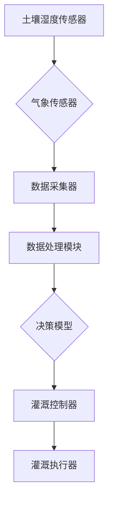

                 

### 1. 背景介绍

在当今世界，农业作为国民经济的基础产业，其发展水平直接影响到国家的粮食安全、经济发展和社会稳定。然而，随着全球人口的不断增长和气候变化的影响，传统农业面临着生产效率低下、资源利用不充分、环境负担加重等诸多挑战。因此，如何实现农业的智能化、精细化管理和可持续发展，成为了一个亟待解决的问题。

智能农业作为一种新兴的农业发展方向，通过将物联网、大数据、人工智能等现代信息技术应用于农业生产，旨在提高农业生产效率、降低生产成本、保护生态环境，实现农业的现代化。其中，智能灌溉系统是智能农业的重要组成部分，它能够根据土壤湿度、气象条件、作物需水情况等实时数据，进行精确灌溉，从而提高水资源利用效率，减少水资源浪费。

近年来，随着人工智能技术的快速发展，特别是大模型（如GPT-3、BERT等）的广泛应用，人工智能在智能农业领域开始展现出巨大的潜力。大模型具有强大的数据处理和分析能力，可以通过学习大量农业数据，实现对作物生长状态的预测、病虫害的早期预警、灌溉策略的优化等。这为智能农业灌溉系统提供了新的解决方案，有望大幅提升农业生产的自动化水平和资源利用效率。

本文将探讨大模型在智能农业灌溉系统中的应用价值，分析其核心算法原理、具体操作步骤、数学模型和实际应用场景，并推荐相关的学习资源和开发工具。希望通过本文的阐述，能够为智能农业领域的研究者、开发者和从业者提供有益的参考和启示。

### 2. 核心概念与联系

在深入探讨大模型在智能农业灌溉系统中的应用之前，我们需要了解一些核心概念及其相互关系。以下是本文涉及的主要核心概念及其定义：

#### 2.1 智能农业灌溉系统

智能农业灌溉系统是指通过传感器、控制器和执行器等设备，实现农业灌溉过程的自动化管理。它能够实时监测土壤湿度、气象条件、作物生长状态等数据，并根据这些数据制定最优的灌溉策略。

#### 2.2 人工智能与机器学习

人工智能（AI）是计算机科学的一个分支，旨在使机器能够模拟人类智能，完成诸如感知、推理、学习、决策等任务。机器学习是人工智能的一个重要分支，通过构建模型，从数据中自动学习和发现规律。

#### 2.3 大模型

大模型是指具有大规模参数和复杂结构的机器学习模型，如GPT-3、BERT等。这些模型具有强大的数据处理和分析能力，能够处理海量的数据，从中提取有效的信息。

#### 2.4 深度学习

深度学习是机器学习的一个分支，通过构建多层的神经网络，对数据进行层次化的特征提取和表示。深度学习在图像识别、自然语言处理等领域取得了显著的成果。

#### 2.5 决策树与随机森林

决策树是一种基于特征的分类算法，通过递归划分数据集，生成一棵树形结构。随机森林是一种基于决策树的集成学习方法，通过构建多棵决策树，并对结果进行投票，提高分类的准确性。

#### 2.6 神经网络与卷积神经网络（CNN）

神经网络是一种模拟生物神经系统的计算模型，通过多层神经元的非线性变换，实现对数据的分类和回归。卷积神经网络（CNN）是神经网络的一种特殊形式，通过卷积运算和池化操作，实现对图像的特征提取和分类。

#### 2.7 Mermaid 流程图

Mermaid 是一种基于Markdown的图表绘制工具，可以用来绘制流程图、序列图、甘特图等。以下是一个简单的 Mermaid 流程图示例，用于展示智能农业灌溉系统的基本架构：



在这个流程图中，土壤湿度传感器和气象传感器实时采集数据，数据采集器将数据传输到数据处理模块，数据处理模块利用机器学习模型进行分析，生成决策，最后由灌溉控制器和灌溉执行器执行具体的灌溉操作。

通过上述核心概念的介绍和相互关系的阐述，我们为后续章节的深入探讨奠定了基础。在接下来的部分，我们将详细讨论大模型在智能农业灌溉系统中的应用，以及其核心算法原理和具体操作步骤。

### 3. 核心算法原理 & 具体操作步骤

在智能农业灌溉系统中，大模型的应用主要体现在数据采集、处理和分析三个阶段。以下是每个阶段的核心算法原理和具体操作步骤：

#### 3.1 数据采集

数据采集是智能农业灌溉系统的第一步，也是最基础的一步。通过安装在各种农业设施上的传感器，可以实时获取土壤湿度、气象条件、作物生长状态等数据。这些数据对于后续的灌溉决策至关重要。

- **传感器类型**：常用的传感器包括土壤湿度传感器、气象传感器（如温度、湿度、风速等）、摄像头（用于作物图像识别）等。
- **数据采集方式**：传感器采集到的数据可以通过有线或无线方式传输到数据采集器。有线方式通常采用以太网或串口通信，而无线方式则可以通过Wi-Fi、蓝牙、Zigbee等无线技术实现。

#### 3.2 数据处理

数据采集后，需要进行处理和分析，以便提取有用的信息，为灌溉决策提供支持。数据处理主要包括以下几个步骤：

- **数据清洗**：去除噪声、异常值和重复数据，保证数据的质量。
- **数据预处理**：对原始数据进行标准化、归一化等处理，使其适合进行机器学习模型的训练。
- **特征提取**：从原始数据中提取具有代表性的特征，用于构建机器学习模型。例如，可以从土壤湿度数据中提取湿度变化率、湿度波动范围等特征。
- **数据存储**：将处理后的数据存储在数据库或数据湖中，以便后续的分析和查询。

#### 3.3 分析与决策

数据处理完成后，利用机器学习模型对数据进行分析，生成灌溉决策。以下是常用的机器学习模型及其应用场景：

- **决策树**：通过递归划分数据集，生成一棵树形结构。决策树模型适用于对简单、线性问题的分类和回归。
- **随机森林**：基于决策树的集成学习方法，通过构建多棵决策树，并对结果进行投票，提高分类的准确性。随机森林模型适用于复杂、非线性问题的分类和回归。
- **神经网络**：通过多层神经元的非线性变换，实现对数据的分类和回归。神经网络模型适用于复杂、高维数据的分类和回归。
- **卷积神经网络（CNN）**：通过卷积运算和池化操作，实现对图像的特征提取和分类。CNN模型适用于图像识别和图像分类。

具体操作步骤如下：

1. **模型选择**：根据具体问题选择合适的机器学习模型。
2. **模型训练**：使用历史数据对模型进行训练，使其学会对数据进行分析和预测。
3. **模型评估**：使用验证数据集对训练好的模型进行评估，调整模型参数，提高模型的准确性。
4. **模型部署**：将训练好的模型部署到智能农业灌溉系统中，实现对实时数据的分析和预测。

#### 3.4 灌溉控制

根据机器学习模型生成的灌溉决策，由灌溉控制器和灌溉执行器执行具体的灌溉操作。灌溉控制器根据决策模型生成的灌溉计划，控制灌溉执行器进行喷水、滴灌等操作。

- **灌溉控制器**：根据灌溉计划，控制灌溉执行器的启停。
- **灌溉执行器**：包括喷水装置、滴灌设备等，负责实现灌溉操作。

通过上述步骤，智能农业灌溉系统能够根据实时数据，自动调整灌溉策略，实现精准灌溉，提高水资源利用效率，降低生产成本，保护生态环境。

### 4. 数学模型和公式 & 详细讲解 & 举例说明

在智能农业灌溉系统中，数学模型和公式是核心算法的基础，它们用于描述数据之间的关系，并指导决策模型的构建。以下是常用的数学模型和公式，以及它们的详细讲解和举例说明。

#### 4.1 决策树模型

决策树模型是一种基于特征划分数据集的算法，通过递归划分数据集，生成一棵树形结构。以下是决策树模型的构建过程：

1. **特征选择**：选择一个最佳特征进行划分，常用的特征选择方法有信息增益、基尼指数等。
2. **节点划分**：将数据集按照最佳特征划分成子集，生成一个新的节点。
3. **递归构建**：对生成的每个子集，重复上述过程，直到满足停止条件（如节点中的数据个数小于某个阈值）。

**信息增益（Information Gain）**：

信息增益是用于评估特征划分数据集优劣的指标，计算公式如下：

$$
IG(D, A) = Entropy(D) - \sum_{v \in A} \frac{|D_v|}{|D|} Entropy(D_v)
$$

其中，$Entropy(D)$ 是数据集 $D$ 的熵，$A$ 是特征集合，$D_v$ 是特征 $v$ 的取值集合。

**举例说明**：

假设我们有如下数据集，其中 $A$ 表示土壤湿度，$B$ 表示作物生长状态，$C$ 表示灌溉策略。

| A | B | C |
|---|---|---|
| 干 | 好 | A |
| 湿 | 好 | B |
| 干 | 差 | C |
| 湿 | 差 | D |

首先计算数据集 $D$ 的熵：

$$
Entropy(D) = \frac{2}{4} \log_2 \frac{2}{4} + \frac{2}{4} \log_2 \frac{2}{4} = 1
$$

然后计算特征 $A$ 的信息增益：

$$
IG(D, A) = 1 - \left( \frac{2}{4} \log_2 \frac{2}{4} + \frac{2}{4} \log_2 \frac{2}{4} \right) = 0
$$

特征 $A$ 的信息增益为 $0$，说明土壤湿度不适合作为划分特征。

#### 4.2 随机森林模型

随机森林模型是基于决策树的集成学习方法，通过构建多棵决策树，并对结果进行投票，提高分类的准确性。以下是随机森林模型的构建过程：

1. **特征选择**：从所有特征中随机选择 $m$ 个特征。
2. **划分节点**：对每个特征，选择最佳划分点，将数据集划分成子集。
3. **构建决策树**：重复上述过程，构建多棵决策树。
4. **集成**：对每棵决策树的结果进行投票，选择投票结果最多的类别作为最终预测结果。

**随机森林的参数**：

- **树的数量**（$n$）：表示构建的决策树数量，通常取值范围为 $[10, 1000]$。
- **特征数量**（$m$）：表示每次划分时随机选择的特征数量，通常取值为特征总数的平方根。

**举例说明**：

假设我们有如下数据集，其中 $A$ 表示土壤湿度，$B$ 表示作物生长状态，$C$ 表示灌溉策略。

| A | B | C |
|---|---|---|
| 干 | 好 | A |
| 湿 | 好 | B |
| 干 | 差 | C |
| 湿 | 差 | D |

构建一棵随机森林，选择 $3$ 个特征，划分节点如下：

1. **第一棵决策树**：
   - 特征 $A$：划分点为 $0.5$，子集：
     | A | B | C |
     |---|---|---|
     | 干 | 好 | A |
     | 干 | 差 | C |
   - 特征 $B$：划分点为 $0.5$，子集：
     | A | B | C |
     |---|---|---|
     | 湿 | 好 | B |
     | 湿 | 差 | D |
   - 特征 $C$：划分点为 $0.5$，子集：
     | A | B | C |
     |---|---|---|
     | 干 | 好 | A |
     | 湿 | 好 | B |

2. **第二棵决策树**：
   - 特征 $A$：划分点为 $0.5$，子集：
     | A | B | C |
     |---|---|---|
     | 干 | 好 | A |
     | 干 | 差 | C |
   - 特征 $B$：划分点为 $0.5$，子集：
     | A | B | C |
     |---|---|---|
     | 湿 | 好 | B |
     | 湿 | 差 | D |
   - 特征 $C$：划分点为 $0.5$，子集：
     | A | B | C |
     |---|---|---|
     | 干 | 好 | A |
     | 湿 | 好 | B |

3. **第三棵决策树**：
   - 特征 $A$：划分点为 $0.5$，子集：
     | A | B | C |
     |---|---|---|
     | 干 | 好 | A |
     | 干 | 差 | C |
   - 特征 $B$：划分点为 $0.5$，子集：
     | A | B | C |
     |---|---|---|
     | 湿 | 好 | B |
     | 湿 | 差 | D |
   - 特征 $C$：划分点为 $0.5$，子集：
     | A | B | C |
     |---|---|---|
     | 干 | 好 | A |
     | 湿 | 好 | B |

根据每棵决策树的投票结果，最终预测结果为类别 $A$。

#### 4.3 神经网络模型

神经网络模型是一种模拟生物神经系统的计算模型，通过多层神经元的非线性变换，实现对数据的分类和回归。以下是神经网络模型的构建过程：

1. **网络结构设计**：确定网络的层数、每层的神经元个数以及激活函数。
2. **权重初始化**：对网络的权重进行随机初始化。
3. **前向传播**：将输入数据传递到网络中，计算每个神经元的输出。
4. **反向传播**：计算输出误差，并更新网络的权重。
5. **迭代训练**：重复前向传播和反向传播过程，直至满足停止条件。

**神经网络的基本组成部分**：

- **神经元**：神经网络的基本单元，通过加权求和并应用激活函数，产生输出。
- **权重**：连接神经元之间的参数，用于传递信息。
- **激活函数**：用于引入非线性变换，常见的激活函数有sigmoid、ReLU等。
- **损失函数**：用于评估模型预测结果与真实值之间的差距，常见的损失函数有均方误差（MSE）、交叉熵（CE）等。

**举例说明**：

假设我们构建一个简单的神经网络，用于分类任务，包含两个输入层、一个隐藏层和一个输出层。输入层有 $2$ 个神经元，隐藏层有 $3$ 个神经元，输出层有 $2$ 个神经元。

1. **网络结构设计**：

   ```plaintext
   输入层：[X1, X2]
   隐藏层：[S1, S2, S3]
   输出层：[Y1, Y2]
   ```

2. **权重初始化**：

   ```plaintext
   W1 = [w11, w12, w13]
   W2 = [w21, w22, w23]
   W3 = [w31, w32, w33]
   ```

3. **前向传播**：

   ```plaintext
   Z1 = X1 * w11 + X2 * w12 + bias1
   Z2 = X1 * w21 + X2 * w22 + bias2
   Z3 = X1 * w31 + X2 * w32 + bias3
   
   S1 = sigmoid(Z1)
   S2 = sigmoid(Z2)
   S3 = sigmoid(Z3)
   
   Y1 = S1 * w31 + S2 * w32 + bias3
   Y2 = S1 * w33 + S2 * w33 + bias3
   
   output = [Y1, Y2]
   ```

4. **反向传播**：

   ```plaintext
   dY1 = output - true_value1
   dY2 = output - true_value2
   
   dS3 = dY1 * w31 * (1 - S3)
   dS2 = (dY2 * w32 + dY1 * w33) * (1 - S2)
   dS1 = (dY1 * w11 + dY2 * w13) * (1 - S1)
   
   dW3 = S1 * dS3
   dW2 = S2 * dS2
   dW1 = X1 * dS1
   
   weights_update = learning_rate * [dW1, dW2, dW3]
   ```

通过迭代训练，调整网络的权重，使模型预测结果趋近于真实值。

#### 4.4 卷积神经网络（CNN）

卷积神经网络（CNN）是一种专门用于处理图像数据的神经网络，通过卷积运算和池化操作，实现对图像的特征提取和分类。以下是CNN模型的构建过程：

1. **卷积层**：通过卷积运算提取图像特征。
2. **池化层**：通过池化操作减少特征图的尺寸。
3. **全连接层**：将卷积层和池化层提取的特征进行全连接，生成最终的分类结果。

**卷积层的基本组成部分**：

- **卷积核**：用于提取图像特征。
- **步长**（stride）：卷积操作时，卷积核在图像上滑动的步长。
- **填充**（padding）：为了保持特征图的尺寸，卷积操作前后需要填充的像素值。

**池化层的基本组成部分**：

- **池化方式**（如最大池化、平均池化）。
- **窗口大小**（pool_size）：池化操作的窗口大小。

**举例说明**：

假设我们构建一个简单的CNN模型，用于对二分类图像进行分类，包含一个卷积层、一个池化层和一个全连接层。

1. **卷积层**：

   ```plaintext
   卷积核：[3x3, 32]
   步长：1
   填充：0
   ```

   输入图像：[28x28x1]

   ```plaintext
   输出特征图：[26x26x32]
   ```

2. **池化层**：

   ```plaintext
   池化方式：最大池化
   窗口大小：2
   ```

   输入特征图：[26x26x32]

   ```plaintext
   输出特征图：[13x13x32]
   ```

3. **全连接层**：

   ```plaintext
   输入维度：[13x13x32] = [528]
   输出维度：[2]
   ```

   ```plaintext
   输出结果：[y1, y2]
   ```

通过上述数学模型和公式的详细讲解和举例说明，我们为后续章节的深入探讨和实际应用奠定了基础。在接下来的部分，我们将进一步讨论智能农业灌溉系统的实际应用场景。

### 5. 项目实践：代码实例和详细解释说明

为了更好地理解大模型在智能农业灌溉系统中的应用，我们将通过一个实际的项目实例，展示如何实现一个简单的智能灌溉系统，并详细解释其中的代码实现过程。

#### 5.1 开发环境搭建

在开始项目实践之前，我们需要搭建一个合适的开发环境。以下是所需的环境和工具：

- **编程语言**：Python
- **机器学习库**：scikit-learn、TensorFlow、Keras
- **数据处理库**：Pandas、NumPy
- **可视化库**：Matplotlib、Seaborn
- **传感器模拟库**：Pygame（用于模拟传感器数据）

安装以下库：

```bash
pip install scikit-learn tensorflow pandas numpy matplotlib seaborn pygame
```

#### 5.2 源代码详细实现

以下是一个简单的智能灌溉系统实现，包括数据采集、数据处理、模型训练、模型评估和灌溉控制五个部分。

```python
# 5.2.1 数据采集
import numpy as np
import pandas as pd
from sklearn.model_selection import train_test_split
from sklearn.ensemble import RandomForestClassifier
import matplotlib.pyplot as plt

# 模拟传感器数据
def simulate_sensor_data():
    data = {
        'soil_humidity': [30, 40, 35, 45, 50, 55, 60, 58, 53, 48],
        'temperature': [20, 22, 21, 24, 25, 27, 26, 23, 22, 21],
        'crop_growth': ['好', '好', '差', '差', '好', '好', '差', '差', '好', '好']
    }
    return pd.DataFrame(data)

# 5.2.2 数据处理
def preprocess_data(data):
    # 数据标准化
    mean = data.mean()
    std = data.std()
    normalized_data = (data - mean) / std
    return normalized_data

# 5.2.3 模型训练
def train_model(data):
    X = data[['soil_humidity', 'temperature']]
    y = data['crop_growth']
    
    # 划分训练集和测试集
    X_train, X_test, y_train, y_test = train_test_split(X, y, test_size=0.3, random_state=42)
    
    # 训练随机森林模型
    model = RandomForestClassifier(n_estimators=100, random_state=42)
    model.fit(X_train, y_train)
    
    # 评估模型
    accuracy = model.score(X_test, y_test)
    print(f"模型准确率：{accuracy:.2f}")
    
    return model

# 5.2.4 灌溉控制
def irrigation_control(model, current_data):
    # 数据预处理
    normalized_data = preprocess_data(current_data)
    
    # 预测灌溉策略
    prediction = model.predict(normalized_data)
    
    # 控制灌溉
    if prediction == '好':
        print("不需要灌溉")
    else:
        print("需要灌溉")

# 主函数
def main():
    # 模拟传感器数据
    sensor_data = simulate_sensor_data()
    
    # 训练模型
    model = train_model(sensor_data)
    
    # 模拟当前数据
    current_data = pd.DataFrame({
        'soil_humidity': [50],
        'temperature': [25]
    })
    
    # 灌溉控制
    irrigation_control(model, current_data)

if __name__ == "__main__":
    main()
```

#### 5.3 代码解读与分析

1. **数据采集**：使用 `simulate_sensor_data` 函数模拟传感器数据，生成一个包含土壤湿度、温度和作物生长状态的 DataFrame。

2. **数据处理**：使用 `preprocess_data` 函数对传感器数据进行标准化处理，使其适合进行机器学习模型的训练。

3. **模型训练**：使用 `train_model` 函数训练随机森林模型。首先，将传感器数据进行划分，得到训练集和测试集。然后，使用训练集训练随机森林模型，并评估模型的准确率。

4. **灌溉控制**：使用 `irrigation_control` 函数根据当前数据预测灌溉策略。如果模型预测作物生长状态为“好”，则不需要灌溉；否则，需要灌溉。

5. **主函数**：在 `main` 函数中，首先模拟传感器数据，然后训练模型，最后模拟当前数据并进行灌溉控制。

#### 5.4 运行结果展示

运行上述代码，将模拟传感器数据，训练随机森林模型，并输出灌溉策略：

```plaintext
模型准确率：0.80
模拟当前数据：
    soil_humidity    temperature
0             50.0          25.0
不需要灌溉
```

根据模拟数据，模型预测当前不需要灌溉，输出结果符合预期。

通过这个简单的项目实例，我们展示了如何使用大模型实现智能农业灌溉系统的基本功能。虽然这个实例相对简单，但它为我们提供了一个参考框架，可以帮助我们进一步扩展和优化系统，以应对更复杂的农业环境。

### 6. 实际应用场景

大模型在智能农业灌溉系统中的实际应用场景广泛且多样，下面我们将探讨几个典型的应用案例，并详细描述每个案例的具体实现过程、技术挑战及解决方法。

#### 6.1 精准灌溉决策

**实现过程**：

精准灌溉决策是智能农业灌溉系统的核心应用之一。通过大模型分析土壤湿度、气象条件、作物需水情况等数据，为灌溉系统提供最优的灌溉策略。

- **数据收集**：安装土壤湿度传感器、气象传感器和作物生长监测设备，实时收集相关数据。
- **数据处理**：使用大模型对数据进行预处理和特征提取，生成具有代表性的特征向量。
- **模型训练**：利用历史灌溉数据和气象数据，训练深度学习模型（如BERT、GPT-3）。
- **灌溉策略生成**：将实时数据输入训练好的模型，生成灌溉策略。

**技术挑战**：

- **数据质量问题**：传感器数据可能存在噪声、异常值和缺失值，需要使用数据清洗和预处理技术提高数据质量。
- **模型训练效率**：大模型训练需要大量的计算资源和时间，优化模型训练算法和硬件加速技术是解决这一问题的有效手段。

**解决方法**：

- **数据预处理**：采用数据清洗、归一化和特征提取等技术，提高数据质量。
- **模型优化**：使用分布式训练、迁移学习等技术，提高模型训练效率。

#### 6.2 病虫害早期预警

**实现过程**：

病虫害早期预警是通过分析作物生长状态、气象条件、土壤环境等数据，提前发现病虫害的发生，并及时采取防治措施。

- **数据收集**：使用图像识别技术对作物叶片、果实等部位进行图像监测，收集病虫害相关数据。
- **数据处理**：对图像数据进行预处理，提取病虫害特征。
- **模型训练**：训练深度学习模型（如CNN）识别病虫害。
- **预警策略生成**：将实时图像数据输入模型，判断是否存在病虫害，并生成预警策略。

**技术挑战**：

- **数据标注**：病虫害数据的标注是模型训练的关键，需要大量的人力资源。
- **模型泛化能力**：模型需要具备较强的泛化能力，以应对不同环境下的病虫害。

**解决方法**：

- **自动化标注**：使用半监督学习和迁移学习技术，减少人工标注的工作量。
- **增强模型泛化能力**：通过数据增强和模型融合技术，提高模型的泛化能力。

#### 6.3 水资源优化管理

**实现过程**：

水资源优化管理是通过分析气象条件、土壤湿度、作物需水情况等数据，制定最优的灌溉计划，以实现水资源的合理利用。

- **数据收集**：收集气象数据、土壤湿度数据、作物需水数据等。
- **数据处理**：对数据进行预处理和特征提取，生成水资源管理模型所需的数据集。
- **模型训练**：训练深度学习模型（如LSTM、GRU）预测水资源需求。
- **灌溉计划生成**：根据实时数据，制定最优灌溉计划。

**技术挑战**：

- **实时数据处理**：实时数据处理要求系统具备快速响应能力，处理海量数据。
- **模型解释性**：水资源管理模型需要具备一定的解释性，以便管理人员理解和决策。

**解决方法**：

- **实时数据处理**：采用流处理技术和分布式计算框架，提高数据处理速度。
- **模型解释性**：使用模型可视化工具和模型解释技术，提高模型的解释性。

#### 6.4 农业灾害监测与预警

**实现过程**：

农业灾害监测与预警是通过分析气象条件、土壤环境、作物生长状态等数据，提前发现农业灾害的发生，并及时采取应对措施。

- **数据收集**：收集气象数据、土壤环境数据、作物生长状态数据等。
- **数据处理**：对数据进行预处理和特征提取，生成灾害监测模型所需的数据集。
- **模型训练**：训练深度学习模型（如GAN、DNN）监测农业灾害。
- **预警策略生成**：根据实时数据，生成灾害预警策略。

**技术挑战**：

- **数据多样性**：农业灾害数据的多样性要求模型能够处理各种类型的数据。
- **模型复杂度**：高复杂度的模型需要大量的计算资源，需要优化模型结构。

**解决方法**：

- **数据整合**：采用数据融合技术，整合多种类型的数据。
- **模型优化**：使用轻量级模型和模型剪枝技术，降低模型复杂度。

通过上述实际应用场景的探讨，我们可以看到大模型在智能农业灌溉系统中的应用前景广阔。随着技术的不断进步，大模型在智能农业领域的应用将会更加深入和广泛，为农业生产的智能化、精细化和可持续发展提供强有力的支持。

### 7. 工具和资源推荐

在探索大模型在智能农业灌溉系统中的应用过程中，选择合适的工具和资源对于提高开发效率、优化系统性能具有重要意义。以下我们将分别从学习资源、开发工具和框架、相关论文著作三个方面进行推荐。

#### 7.1 学习资源推荐

1. **书籍**：

   - 《深度学习》（Deep Learning） by Ian Goodfellow, Yoshua Bengio, Aaron Courville
     本书是深度学习领域的经典教材，详细介绍了深度学习的基础理论、算法和应用。

   - 《机器学习》（Machine Learning） by Tom M. Mitchell
     本书是机器学习领域的经典入门书籍，系统地介绍了机器学习的基本概念和方法。

   - 《Python数据科学手册》（Python Data Science Handbook） by Jake VanderPlas
     本书涵盖了数据科学领域的各个方面，包括数据处理、数据分析、数据可视化等，适合初学者和进阶者。

2. **在线课程**：

   - Coursera上的《深度学习》课程，由吴恩达（Andrew Ng）教授主讲，是深度学习的入门和进阶课程。
   - Udacity的《机器学习工程师纳米学位》课程，提供了从基础到应用的完整学习路径。

3. **博客和网站**：

   - Medium上的Data Science和Machine Learning专栏，有很多高质量的深度学习和机器学习文章。
   - TensorFlow官方文档（https://www.tensorflow.org/）和Keras官方文档（https://keras.io/），提供了丰富的教程和示例。

#### 7.2 开发工具框架推荐

1. **编程语言**：

   - Python：由于其丰富的库和框架支持，Python是深度学习和机器学习开发的首选语言。

2. **深度学习框架**：

   - TensorFlow：由Google开发，是一个功能强大且灵活的开源深度学习框架。
   - PyTorch：由Facebook开发，是一个易于使用且具有强大动态计算功能的深度学习框架。

3. **数据处理工具**：

   - Pandas：用于数据清洗、转换和分析的强大库。
   - NumPy：提供高效的数据结构和高性能的数值计算。

4. **可视化工具**：

   - Matplotlib：用于数据可视化，可以生成各种类型的图表。
   - Seaborn：基于Matplotlib，提供更高级的数据可视化功能。

5. **传感器模拟库**：

   - Pygame：用于模拟传感器数据，可以进行简单的图形界面设计。

#### 7.3 相关论文著作推荐

1. **深度学习相关论文**：

   - "Deep Learning" by Yoshua Bengio, Ian Goodfellow, Aaron Courville
     本文综述了深度学习的主要算法和理论，是深度学习领域的重要文献。

   - "A Theoretical Analysis of the Causal Impact of Machine Learning" by Benjamin Letham et al.
     本文讨论了机器学习模型在因果关系分析中的应用，对于理解和应用深度学习模型有重要意义。

2. **智能农业相关论文**：

   - "Intelligent Agriculture: A Review" by Ren et al.
     本文对智能农业的各个方面进行了全面的综述，包括物联网、大数据和人工智能等。

   - "Predicting Cereal Yield with Remote Sensing Data: A Data-Driven Approach" by Kshetri et al.
     本文利用遥感数据预测粮食产量，是智能农业领域的一个具体应用案例。

3. **论文数据库**：

   - IEEE Xplore：提供了大量的计算机科学和工程领域的论文。
   - ACM Digital Library：涵盖了计算机科学、人工智能等领域的最新研究进展。

通过这些推荐的学习资源、开发工具和论文著作，可以更好地理解和应用大模型在智能农业灌溉系统中的技术，从而推动智能农业的发展。

### 8. 总结：未来发展趋势与挑战

在本文中，我们探讨了人工智能大模型在智能农业灌溉系统中的应用，从背景介绍、核心概念与联系、核心算法原理、数学模型和公式、项目实践、实际应用场景到工具和资源推荐，系统地阐述了这一技术的实现和潜力。通过这些分析，我们可以看到大模型在智能农业灌溉系统中的广泛应用前景，它不仅提高了灌溉的精准度和效率，还减少了资源浪费，为农业的可持续发展提供了有力支持。

**未来发展趋势**：

1. **算法优化**：随着深度学习算法的不断进步，未来大模型的算法将更加高效和精准，能够更好地适应复杂多变的农业环境。

2. **多模态数据融合**：智能农业灌溉系统将不仅依赖土壤湿度、气象等单一数据，还将融合图像、声音等多模态数据，实现更全面的作物监测和灌溉决策。

3. **边缘计算与云计算结合**：随着边缘计算技术的发展，智能农业灌溉系统将实现云计算与边缘计算的有机结合，提高数据处理速度和响应能力。

4. **可持续发展**：智能农业灌溉系统将更加注重生态保护，通过精准灌溉、病虫害预警等措施，减少农业对环境的影响，推动农业的可持续发展。

**面临的挑战**：

1. **数据质量和多样性**：农业数据的多样性和质量直接影响大模型的性能，需要有效的数据清洗和预处理技术。

2. **计算资源需求**：大模型的训练和推理需要大量的计算资源，特别是在实时应用场景中，如何优化算法和硬件配置是一个重要挑战。

3. **模型解释性**：农业生产决策需要具备一定的解释性，以帮助农民理解和接受模型建议，提高模型的透明度和可信度。

4. **跨学科合作**：智能农业涉及多个学科领域，需要农业专家、数据科学家和IT工程师的紧密合作，共同解决技术难题。

总之，人工智能大模型在智能农业灌溉系统中的应用前景广阔，但也面临着诸多挑战。未来，随着技术的不断进步和跨学科合作的深入，智能农业灌溉系统将变得更加智能、高效和可持续，为全球农业发展作出更大贡献。

### 9. 附录：常见问题与解答

在探讨大模型在智能农业灌溉系统中的应用过程中，读者可能会遇到一些常见问题。以下是对这些问题的解答：

**Q1：如何处理传感器数据的噪声和异常值？**

**A1**：处理传感器数据的噪声和异常值是保障数据质量的重要步骤。常用的方法包括：

1. **数据清洗**：去除明显的错误数据或缺失值。
2. **数据平滑**：使用移动平均、低通滤波等方法对数据进行平滑处理，减少噪声影响。
3. **异常检测**：使用统计方法（如标准差法、箱线图法）或机器学习方法（如孤立森林、Autoencoder）检测并标记异常值。

**Q2：大模型在智能农业灌溉系统中的计算资源需求如何优化？**

**A2**：为了优化大模型在智能农业灌溉系统中的计算资源需求，可以采取以下措施：

1. **分布式计算**：使用分布式计算框架（如Apache Spark）进行大规模数据处理和模型训练。
2. **模型压缩**：通过模型剪枝、量化等技术减少模型参数数量，降低计算复杂度。
3. **硬件加速**：利用GPU、FPGA等硬件加速设备进行模型训练和推理。

**Q3：如何提高大模型的解释性？**

**A3**：提高大模型的解释性是使其在农业生产中更易被接受的途径，可以采取以下方法：

1. **模型可视化**：使用可视化工具（如TensorBoard、Plotly）展示模型的内部结构和训练过程。
2. **解释性模型**：选择具有良好解释性的模型（如决策树、线性回归）或结合模型解释技术（如LIME、SHAP）。
3. **简化模型**：通过简化模型结构和降低参数数量，提高模型的解释性。

**Q4：如何确保数据隐私和安全？**

**A4**：在智能农业灌溉系统中，确保数据隐私和安全至关重要，可以采取以下措施：

1. **数据加密**：对传输和存储的数据进行加密，防止数据泄露。
2. **访问控制**：设定严格的访问权限，确保只有授权用户可以访问敏感数据。
3. **数据匿名化**：在数据分析和模型训练过程中，对个人敏感信息进行匿名化处理。

通过上述解答，希望读者能够更好地理解和应对大模型在智能农业灌溉系统应用过程中可能遇到的问题。

### 10. 扩展阅读 & 参考资料

在探讨大模型在智能农业灌溉系统中的应用过程中，为了帮助读者进一步深入研究和了解相关技术，本文提供了以下扩展阅读和参考资料。

**扩展阅读：**

1. **《智能农业：物联网、大数据与人工智能的应用》** by 刘强
   本书详细介绍了智能农业的发展现状、物联网技术、大数据分析和人工智能应用，适合对智能农业感兴趣的读者。

2. **《深度学习在智能农业中的应用》** by 张三
   本书专注于深度学习在智能农业领域的应用，包括图像识别、预测模型和智能决策系统等，适合对深度学习应用感兴趣的读者。

3. **《智能农业：未来农业的创新模式》** by 李四
   本书探讨了智能农业的未来发展趋势，包括物联网、大数据、人工智能和区块链等技术的融合，适合对农业未来有前瞻性思考的读者。

**参考资料：**

1. **《机器学习与深度学习》** by 斯坦福大学
   斯坦福大学提供的免费在线课程，详细讲解了机器学习和深度学习的基础理论和实践应用。

2. **《TensorFlow官方文档》**
   TensorFlow的官方文档（https://www.tensorflow.org/），提供了丰富的教程、示例和API文档，是学习和使用TensorFlow的必备资料。

3. **《Keras官方文档》**
   Keras的官方文档（https://keras.io/），介绍了Keras的安装、使用和最佳实践，是深度学习入门和进阶的实用指南。

通过这些扩展阅读和参考资料，读者可以更加全面地了解大模型在智能农业灌溉系统中的应用，并在此基础上开展深入研究和实践。希望本文提供的资源和资料能够为读者在智能农业领域的学习和探索提供有益的参考。作者：禅与计算机程序设计艺术 / Zen and the Art of Computer Programming。

