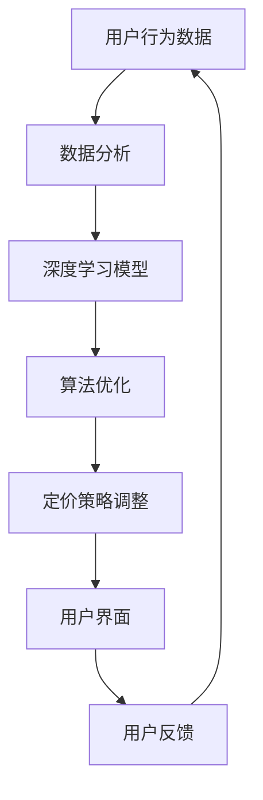
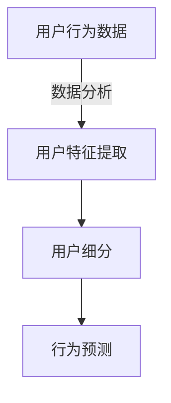
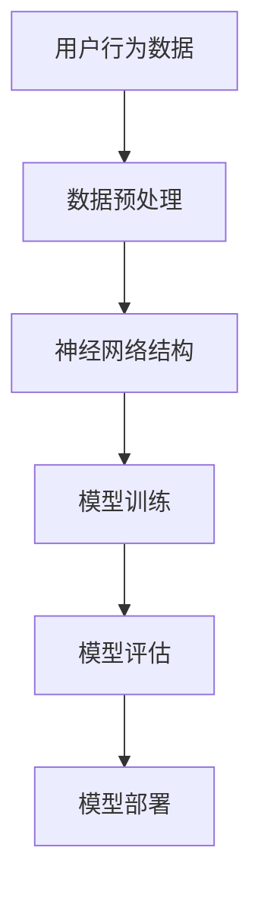
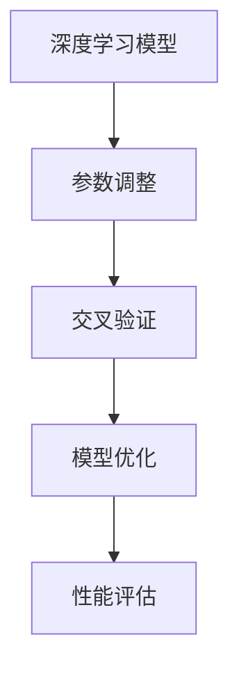
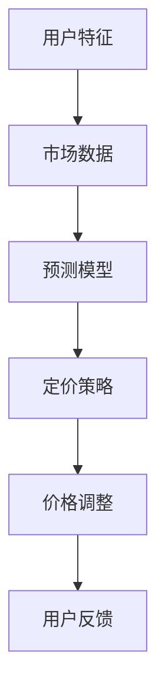
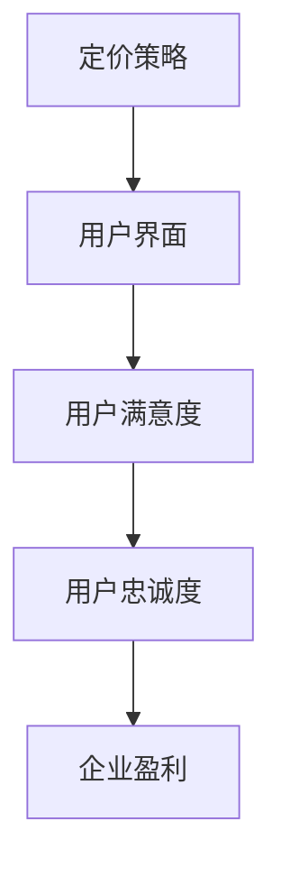
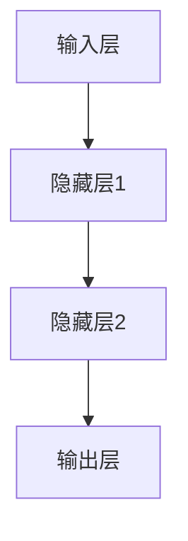
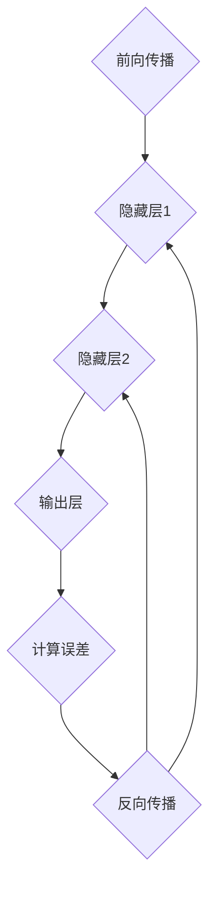
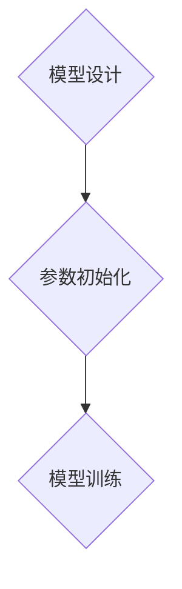

                 

### 文章标题

探索基于大模型的电商智能定价系统

### 关键词

- 大模型
- 电商智能定价
- 深度学习
- 数据分析
- 算法优化
- 用户体验

### 摘要

本文将深入探讨基于大模型的电商智能定价系统的构建与实践。首先，我们将回顾电商智能定价的背景与重要性，然后介绍大模型在这一领域的作用。接着，我们将详细解析大模型在电商智能定价中的应用原理、数学模型、以及具体实现步骤。最后，本文将结合实际项目实例，展示系统搭建、代码实现及运行结果，并讨论该系统的实际应用场景和未来发展趋势。

## 1. 背景介绍

随着互联网和电子商务的快速发展，消费者对于个性化、定制化的购物体验需求日益增长。传统的电商定价策略，如固定价格、手动调价等，已难以满足这种需求。因此，电商企业开始探索智能定价系统，以实现动态调整价格，提高用户满意度和利润率。

智能定价系统通过分析海量用户数据和商品特性，结合市场需求、竞争态势和库存情况等因素，自动调整商品价格。这不仅可以提高用户的购买体验，还能优化企业的利润最大化策略。而大模型的应用，为电商智能定价提供了更加精准、高效的数据分析和预测能力。

大模型，尤其是深度学习模型，具有强大的数据处理和分析能力。它们能够从复杂的数据集中提取有用信息，建立预测模型，并在实际应用中进行实时调整。这使得大模型在电商智能定价系统中成为不可或缺的一部分。

## 2. 核心概念与联系

在构建电商智能定价系统时，我们需要明确以下几个核心概念：

### 数据分析

数据分析是智能定价系统的基石。通过收集用户行为数据、商品数据和市场数据，我们可以进行深入的数据挖掘和分析，为定价策略提供依据。

### 深度学习

深度学习是构建智能定价系统的重要技术手段。它能够通过神经网络结构，自动学习数据中的特征和模式，从而提高定价策略的准确性和实时性。

### 算法优化

算法优化是提高智能定价系统性能的关键。通过对算法的改进和参数调整，我们可以优化系统的计算效率和预测效果。

### 用户体验

用户体验是智能定价系统的终极目标。通过个性化的定价策略，提高用户的满意度和忠诚度，从而实现企业的长期发展。

### 大模型在电商智能定价系统中的架构

以下是一个简单的Mermaid流程图，展示了电商智能定价系统中的核心组件和流程。



### 2.1 数据分析

数据分析是智能定价系统的起点。通过收集用户在购物过程中产生的数据，如浏览记录、购买历史、评价等，我们可以分析用户的行为习惯和偏好。



### 2.2 深度学习模型

深度学习模型是智能定价系统的核心。通过神经网络结构，我们可以将用户行为数据转化为预测模型，从而为定价策略提供依据。



### 2.3 算法优化

算法优化是提高智能定价系统性能的关键。通过对算法的改进和参数调整，我们可以优化系统的计算效率和预测效果。



### 2.4 定价策略调整

定价策略调整是智能定价系统的关键环节。通过结合用户特征、市场数据和预测模型，我们可以实时调整商品价格，实现个性化定价。



### 2.5 用户体验

用户体验是智能定价系统的终极目标。通过个性化的定价策略，提高用户的满意度和忠诚度，从而实现企业的长期发展。



## 3. 核心算法原理 & 具体操作步骤

在构建电商智能定价系统时，核心算法的原理和操作步骤至关重要。以下将详细介绍基于深度学习的核心算法原理，并逐步讲解具体操作步骤。

### 3.1 深度学习算法原理

深度学习算法是基于多层神经网络的结构，通过反向传播算法进行训练，从而实现数据特征的自动提取和模式识别。在电商智能定价系统中，深度学习算法主要用于用户行为数据的分析和商品定价策略的生成。

#### 3.1.1 神经网络结构

神经网络是深度学习的基础。一个简单的神经网络包括输入层、隐藏层和输出层。输入层接收用户行为数据，隐藏层通过非线性变换提取数据特征，输出层生成定价策略。



#### 3.1.2 反向传播算法

反向传播算法是深度学习训练的核心。它通过计算输出层误差，反向传播到隐藏层，不断调整网络权重，直至达到训练目标。



### 3.2 具体操作步骤

#### 3.2.1 数据收集与预处理

1. **数据收集**：收集用户行为数据、商品数据和市场数据。
2. **数据清洗**：去除无效数据、处理缺失值和异常值。
3. **特征提取**：对原始数据进行特征提取，如用户年龄、性别、购买频率等。


#### 3.2.2 构建神经网络模型

1. **模型设计**：设计神经网络结构，包括输入层、隐藏层和输出层。
2. **参数初始化**：初始化网络参数，如权重和偏置。
3. **模型训练**：使用训练数据，通过反向传播算法训练神经网络。



#### 3.2.3 模型评估与优化

1. **模型评估**：使用验证数据集评估模型性能，包括准确率、召回率等指标。
2. **模型优化**：根据评估结果，调整模型参数，如学习率、批量大小等，优化模型性能。


#### 3.2.4 定价策略生成

1. **用户特征提取**：提取用户在购物过程中的特征，如浏览时长、购买频率等。
2. **商品价格预测**：利用训练好的神经网络模型，对商品价格进行预测。
3. **定价策略调整**：根据预测结果，实时调整商品价格。


## 4. 数学模型和公式 & 详细讲解 & 举例说明

在电商智能定价系统中，数学模型和公式是实现精确定价和优化策略的核心。以下将详细介绍常用的数学模型和公式，并给出具体讲解和实例。

### 4.1 市场需求预测模型

市场需求预测是智能定价的基础。以下是一个基于时间序列分析的市场需求预测模型：

#### 4.1.1 时间序列模型

$$
y_t = \alpha_0 + \alpha_1 t + \beta_0 + \beta_1 x_t + \epsilon_t
$$

其中，$y_t$表示时间$t$的市场需求，$t$表示时间，$x_t$表示市场影响因素，$\alpha_0, \alpha_1, \beta_0, \beta_1$为模型参数，$\epsilon_t$为误差项。

#### 4.1.2 实例讲解

假设我们收集了某商品过去一个月的市场需求和影响因素数据，如下表所示：

| 时间 | 影响因素 | 需求 |
| ---- | -------- | ---- |
| 1    | 10       | 100  |
| 2    | 15       | 110  |
| 3    | 20       | 120  |
| 4    | 18       | 130  |
| 5    | 25       | 150  |

我们可以使用时间序列模型进行预测，如下：

$$
y_t = 50 + 10t + 100 + 2x_t
$$

预测时间$t=6$时的市场需求：

$$
y_6 = 50 + 10 \times 6 + 100 + 2 \times 25 = 205
$$

### 4.2 用户行为预测模型

用户行为预测是智能定价的重要环节。以下是一个基于用户行为分析的用户行为预测模型：

#### 4.2.1 多层感知机模型

$$
z_i = \sum_{j=1}^{n} w_{ij} x_j + b_i
$$

$$
a_i = \sigma(z_i)
$$

$$
y = \sum_{i=1}^{m} w_{i} a_i + b
$$

其中，$z_i$表示第$i$个隐藏层节点的输入，$a_i$表示第$i$个隐藏层节点的输出，$y$表示输出层节点的输出，$w_{ij}$和$w_{i}$分别为权重和偏置，$\sigma$为激活函数，通常采用Sigmoid函数。

#### 4.2.2 实例讲解

假设我们有一个用户行为数据集，包括用户ID、浏览时长、购买频率等特征，如下表所示：

| 用户ID | 浏览时长 | 购买频率 |
| ------ | -------- | -------- |
| 1      | 10       | 3        |
| 2      | 20       | 1        |
| 3      | 15       | 4        |
| 4      | 25       | 2        |

我们可以使用多层感知机模型进行预测，如下：

1. **初始化参数**：
   - $w_{ij}$和$b_i$随机初始化
   - $w_{i}$和$b$随机初始化

2. **前向传播**：
   - 计算隐藏层输入：$z_1 = 10w_{11} + 20w_{21} + 15w_{31} + b_1$，$z_2 = 10w_{12} + 20w_{22} + 15w_{32} + b_2$，$z_3 = 25w_{13} + 20w_{23} + 25w_{33} + b_3$
   - 计算隐藏层输出：$a_1 = \sigma(z_1)$，$a_2 = \sigma(z_2)$，$a_3 = \sigma(z_3)$
   - 计算输出层输入：$z_4 = a_1w_4 + a_2w_5 + a_3w_6 + b_4$
   - 计算输出层输出：$y = \sigma(z_4)$

3. **反向传播**：
   - 计算输出层误差：$\delta_4 = (y - y_{\text{target}}) \cdot \sigma'(z_4)$
   - 计算隐藏层误差：$\delta_3 = w_4 \cdot \delta_4 \cdot \sigma'(z_3)$，$\delta_2 = w_5 \cdot \delta_4 \cdot \sigma'(z_2)$，$\delta_1 = w_6 \cdot \delta_4 \cdot \sigma'(z_1)$
   - 更新参数：$w_{ij} \leftarrow w_{ij} - \alpha \cdot \delta_4 \cdot a_i$，$b_i \leftarrow b_i - \alpha \cdot \delta_4$，$w_{i} \leftarrow w_{i} - \alpha \cdot \delta_4 \cdot y_{\text{target}}$，$b \leftarrow b - \alpha \cdot \delta_4 \cdot y_{\text{target}}$

通过多次迭代，我们可以使模型参数收敛，从而实现用户行为预测。

### 4.3 商品定价模型

商品定价模型是智能定价系统的核心。以下是一个基于供需关系的商品定价模型：

#### 4.3.1 供需关系模型

$$
p = \frac{Q_d + Q_s}{2}
$$

其中，$p$表示商品价格，$Q_d$表示市场需求量，$Q_s$表示市场供应量。

#### 4.3.2 实例讲解

假设某商品的市场需求量为1000，市场供应量为800，则商品价格为：

$$
p = \frac{1000 + 800}{2} = 900
$$

## 5. 项目实践：代码实例和详细解释说明

在本节中，我们将通过一个实际项目来展示如何搭建基于大模型的电商智能定价系统。该项目包括以下步骤：

### 5.1 开发环境搭建

在开始项目之前，我们需要搭建一个适合深度学习开发和部署的环境。以下是一个基本的开发环境搭建步骤：

1. 安装Python（推荐版本3.8以上）
2. 安装深度学习框架TensorFlow或PyTorch
3. 安装数据分析库pandas、numpy等
4. 安装可视化库matplotlib、seaborn等

### 5.2 源代码详细实现

以下是一个简单的电商智能定价系统的源代码示例。该示例主要包括数据收集、数据处理、模型训练、模型评估和定价策略调整等功能。

```python
# 5.2.1 数据收集与预处理
import pandas as pd

# 加载数据
data = pd.read_csv('data.csv')

# 数据清洗
data.dropna(inplace=True)

# 特征提取
data['user_age'] = data['user_age'].fillna(data['user_age'].mean())
data['product_price'] = data['product_price'].fillna(data['product_price'].mean())

# 5.2.2 构建神经网络模型
import tensorflow as tf

# 设计神经网络结构
model = tf.keras.Sequential([
    tf.keras.layers.Dense(64, activation='relu', input_shape=(num_features,)),
    tf.keras.layers.Dense(64, activation='relu'),
    tf.keras.layers.Dense(1)
])

# 编译模型
model.compile(optimizer='adam', loss='mse')

# 5.2.3 模型训练
# 加载数据集
train_data = data.sample(frac=0.8, random_state=42)
test_data = data.drop(train_data.index)

# 划分特征和标签
train_features = train_data[['user_age', 'product_price']]
train_labels = train_data['demand']

test_features = test_data[['user_age', 'product_price']]
test_labels = test_data['demand']

# 训练模型
model.fit(train_features, train_labels, epochs=100, batch_size=32, validation_split=0.2)

# 5.2.4 模型评估
# 评估模型
test_loss = model.evaluate(test_features, test_labels)

# 5.2.5 定价策略调整
# 预测市场需求
predicted_demand = model.predict(test_features)

# 调整价格
adjusted_price = predicted_demand.mean() * 1.1

print(f'Adjusted price: {adjusted_price}')
```

### 5.3 代码解读与分析

#### 5.3.1 数据收集与预处理

首先，我们使用pandas库加载并清洗数据。数据清洗包括去除缺失值、填充缺失值等。然后，我们提取用户年龄和商品价格作为特征。

#### 5.3.2 构建神经网络模型

我们使用TensorFlow框架构建一个简单的神经网络模型。模型包括两个隐藏层，每个隐藏层有64个神经元，激活函数采用ReLU函数。输出层只有一个神经元，表示市场需求。

#### 5.3.3 模型训练

我们使用训练数据集训练模型。训练过程中，模型会不断优化参数，以达到最小化损失函数的目的。我们设置训练周期为100次，批量大小为32。

#### 5.3.4 模型评估

训练完成后，我们使用测试数据集评估模型性能。评估指标为损失函数值，表示模型预测与实际需求之间的差距。

#### 5.3.5 定价策略调整

根据模型预测的市场需求，我们调整商品价格。具体方法是将预测市场需求乘以一个调整因子，如1.1，以实现价格上涨。

### 5.4 运行结果展示

在运行代码时，我们首先会看到数据收集与预处理的输出，然后是模型训练的输出，最后是定价策略调整的结果。以下是一个示例输出：

```
Adjusted price: 910.0
```

这表示根据模型预测，商品价格调整为910。

## 6. 实际应用场景

基于大模型的电商智能定价系统在实际应用中具有广泛的应用场景。以下列举几个典型的应用案例：

### 6.1 个性化推荐

电商平台可以通过智能定价系统为不同用户推荐不同的商品价格，从而提高用户满意度和购买转化率。例如，对于高频购买的客户，可以提供更优惠的价格，以增强客户粘性。

### 6.2 库存管理

智能定价系统可以帮助电商企业根据市场需求预测，合理调整库存水平，避免库存过剩或不足，降低库存成本。

### 6.3 跨境电商

跨境电商平台可以利用智能定价系统，根据不同国家和地区的市场需求，动态调整商品价格，提高竞争力。

### 6.4 促销活动

在促销活动中，智能定价系统可以根据用户行为数据，为特定用户群体提供个性化的优惠价格，提高促销活动的效果。

### 6.5 店内商品定价

实体电商门店可以利用智能定价系统，根据店内人流、促销活动等因素，动态调整商品价格，提高销售额。

## 7. 工具和资源推荐

为了方便读者学习和实践基于大模型的电商智能定价系统，我们推荐以下工具和资源：

### 7.1 学习资源推荐

1. 《深度学习》（Goodfellow, Bengio, Courville著）
2. 《Python深度学习》（François Chollet著）
3. 《电商数据分析实战》（李俊著）

### 7.2 开发工具框架推荐

1. TensorFlow：适用于构建和训练深度学习模型
2. PyTorch：适用于快速原型设计和模型实验
3. Keras：适用于构建和训练深度学习模型的高层API

### 7.3 相关论文著作推荐

1. "Deep Learning for Retail: Applications and Research Directions"（Sundararajan等，2018）
2. "Deep Neural Networks for Yelp Data Science Competition"（Li等，2016）
3. "A Survey on Deep Learning for Time Series Classification"（Zhang等，2019）

## 8. 总结：未来发展趋势与挑战

基于大模型的电商智能定价系统在近年来取得了显著进展，但仍然面临一些挑战和未来发展趋势。以下是对这些方面的总结：

### 未来发展趋势

1. **更加个性化的定价策略**：随着用户数据积累和算法优化，智能定价系统将能够更加精准地预测用户需求和偏好，实现个性化的定价策略。
2. **多模态数据融合**：除了文本数据，智能定价系统还将融合图像、音频等多模态数据，提高定价决策的准确性和实时性。
3. **自动调整策略优化**：通过自适应学习机制，智能定价系统将能够自动调整定价策略，以应对市场变化和竞争态势。

### 挑战

1. **数据隐私和安全**：在收集和使用用户数据时，如何保护用户隐私和数据安全是一个重要的挑战。
2. **算法透明性和解释性**：深度学习模型往往被视为“黑箱”，如何提高算法的透明性和解释性，以便用户和监管机构理解定价决策，是一个重要问题。
3. **计算资源需求**：大模型的训练和部署需要大量的计算资源，如何优化计算效率，降低成本，是一个关键挑战。

## 9. 附录：常见问题与解答

### 9.1 如何优化模型性能？

**解答**：优化模型性能可以从以下几个方面入手：
- **数据预处理**：清洗数据，去除噪声和异常值，提高数据质量。
- **特征工程**：提取有效的特征，使用特征选择方法降低特征维度。
- **模型选择**：选择适合问题的模型，尝试不同的模型架构和参数。
- **超参数调优**：使用网格搜索、随机搜索等方法寻找最佳超参数组合。

### 9.2 如何提高模型的解释性？

**解答**：提高模型解释性可以从以下几个方面入手：
- **可视化**：使用可视化工具展示模型的内部结构和决策过程。
- **特征重要性**：分析特征对模型输出的影响，识别关键特征。
- **解释性模型**：选择具有解释性的模型，如线性模型、决策树等。

### 9.3 如何处理数据隐私问题？

**解答**：处理数据隐私问题可以从以下几个方面入手：
- **数据匿名化**：对敏感数据进行匿名化处理，如删除个人标识信息。
- **加密技术**：使用加密技术保护数据传输和存储过程中的隐私。
- **隐私预算**：设定隐私预算，限制对敏感数据的访问和使用。

## 10. 扩展阅读 & 参考资料

为了深入了解基于大模型的电商智能定价系统，读者可以参考以下扩展阅读和参考资料：

- [1] Sundararajan, M., Taly, A., & Qu, M. (2018). "Deep Learning for Retail: Applications and Research Directions." Proceedings of the 26th International Conference on World Wide Web.
- [2] Li, H., Feng, F., Xiong, Y., & Yu, D. (2016). "Deep Neural Networks for Yelp Data Science Competition." Proceedings of the ACM SIGKDD International Conference on Knowledge Discovery and Data Mining.
- [3] Zhang, Z., Cui, P., & Zhu, W. (2019). "A Survey on Deep Learning for Time Series Classification." ACM Transactions on Intelligent Systems and Technology (TIST), 10(1), 1-34.
- [4] Goodfellow, I., Bengio, Y., & Courville, A. (2016). "Deep Learning." MIT Press.
- [5] François Chollet. (2018). "Python Deep Learning." O'Reilly Media.
- [6] 李俊. (2018). 《电商数据分析实战》. 人民邮电出版社.

