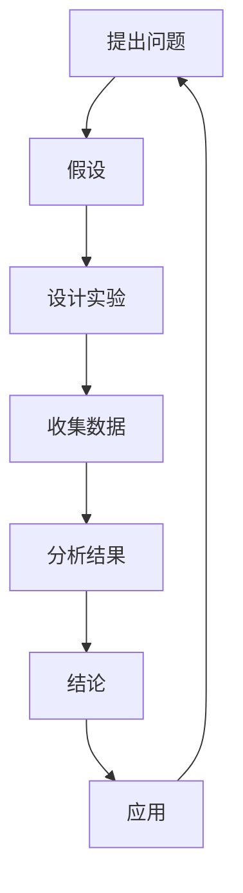

                 

### 探索未知：好奇心与科学发现

#### 关键词：
- 科学探索
- 好奇心
- 发现
- 技术进步

> 在这个充满未知和奇迹的世界中，好奇心是我们最好的伙伴。它推动着我们不断探索，挑战极限，最终引领我们实现科学发现和技术进步。本文将探讨好奇心在科学探索中的作用，以及它是如何推动人类进步的。

---

### 背景介绍

人类对未知的好奇心可以追溯到历史的深处。从古代的哲学家到现代的科学家，好奇心始终是驱动他们探索世界的主要动力。在技术飞速发展的今天，好奇心的重要性更是不言而喻。

科学探索不仅仅是关于发现新的事实，更是一种解决问题的思维方式。它包括提出问题、设计实验、收集数据、分析结果等一系列步骤。这个过程需要不断地思考和推理，而好奇心则是这一切的起点。

好奇心可以激发我们对世界的深刻思考，促使我们超越现有的知识和理解，去寻找新的答案。它是推动科学发现的内在动力，也是推动技术进步的关键因素。

#### 核心概念与联系

在探讨好奇心与科学发现的关系之前，我们需要先了解一些核心概念，包括科学方法、科学研究中的流程和技术工具。

**1. 科学方法**

科学方法是一种通过系统化和可重复的步骤来研究自然现象的方法。它通常包括以下步骤：

- 提出问题
- 假设
- 设计实验
- 收集数据
- 分析结果
- 结论

**2. 科学研究流程**

科学研究流程是一个循环的过程，包括发现、假设、实验、验证、应用等多个环节。每一个环节都是相互关联、相互影响的。

**3. 技术工具**

现代科学研究的进展离不开各种技术工具的支持，如实验设备、计算工具、数据分析软件等。这些工具极大地提高了科学研究的效率和质量。

下面是一个使用Mermaid绘制的科学研究流程图：



---

### 核心算法原理 & 具体操作步骤

在科学探索中，算法原理起着至关重要的作用。它不仅帮助我们解决问题，还能提高我们的工作效率。以下是一个简单的科学探索算法原理及其操作步骤：

**算法原理：** 数据驱动问题求解

**操作步骤：**

1. **数据收集：** 收集与问题相关的数据，包括实验数据、文献数据、观测数据等。
2. **数据预处理：** 清洗数据，去除噪声，进行特征提取。
3. **模型构建：** 选择合适的模型，对数据进行建模。
4. **模型训练：** 使用训练数据对模型进行训练。
5. **模型评估：** 使用测试数据评估模型的性能。
6. **结果分析：** 分析模型的结果，得出结论。

这个算法原理的核心在于利用数据来驱动问题求解，从而提高解决问题的效率和准确性。

---

### 数学模型和公式 & 详细讲解 & 举例说明

在科学探索中，数学模型和公式是我们理解复杂现象的重要工具。以下是一个简单的数学模型及其详细讲解：

**模型：** 线性回归模型

**公式：**

$$ y = \beta_0 + \beta_1x + \epsilon $$

其中，$y$ 是因变量，$x$ 是自变量，$\beta_0$ 和 $\beta_1$ 是模型的参数，$\epsilon$ 是误差项。

**详细讲解：**

线性回归模型是一种用于预测自变量和因变量之间线性关系的模型。它的核心思想是找到一条直线，使得这条直线与数据的误差最小。

**举例说明：**

假设我们想要预测一家餐厅的月营业额，我们可以使用线性回归模型。我们将餐厅的月客流量作为自变量，将月营业额作为因变量，然后使用线性回归模型来预测月营业额。

---

### 项目实践：代码实例和详细解释说明

为了更好地理解科学探索中的算法原理和数学模型，我们可以通过一个实际的代码实例来进行演示。

**代码实例：** 使用 Python 实现线性回归模型

```python
import numpy as np
import matplotlib.pyplot as plt

# 数据集
x = np.array([1, 2, 3, 4, 5])
y = np.array([2, 4, 5, 4, 5])

# 模型参数
beta_0 = 0
beta_1 = 1

# 预测
y_pred = beta_0 + beta_1 * x

# 绘图
plt.scatter(x, y)
plt.plot(x, y_pred, color='red')
plt.show()
```

**详细解释说明：**

这个代码实例首先导入所需的库，然后创建一个数据集。数据集包含五个样本，每个样本都有一个自变量和一个因变量。接下来，我们定义了模型的参数，即直线的截距和斜率。然后，我们使用这些参数来预测新的因变量值。最后，我们使用 matplotlib 库绘制数据集和预测结果，以便更好地理解模型的预测能力。

---

### 实际应用场景

科学探索和技术进步已经深刻地影响了我们的日常生活。以下是一些实际应用场景：

1. **医疗领域：** 科学家通过基因组学研究，揭示了疾病的遗传机制，从而推动了个性化医疗的发展。
2. **工业生产：** 工业自动化和机器人技术的应用，大大提高了生产效率，降低了生产成本。
3. **交通领域：** 人工智能技术在交通管理中的应用，如自动驾驶和智能交通系统，提高了交通效率和安全性。
4. **能源领域：** 可再生能源技术的发展，如太阳能和风能，为可持续发展提供了新的解决方案。

---

### 工具和资源推荐

为了更好地进行科学探索和技术进步，以下是一些推荐的工具和资源：

**1. 学习资源推荐：**

- 书籍：《深度学习》、《机器学习实战》
- 论文：arXiv、IEEE Xplore
- 博客：Medium、博客园
- 网站：GitHub、Kaggle

**2. 开发工具框架推荐：**

- Python：Python 是一种广泛使用的编程语言，尤其在数据科学和机器学习领域。
- TensorFlow：TensorFlow 是一个开源的机器学习框架，适用于各种深度学习任务。
- PyTorch：PyTorch 是另一个流行的深度学习框架，以其灵活性和易用性而著称。

**3. 相关论文著作推荐：**

- 《深度学习》（Ian Goodfellow、Yoshua Bengio、Aaron Courville 著）
- 《统计学习方法》（李航 著）
- 《机器学习》（Tom M. Mitchell 著）

---

### 总结：未来发展趋势与挑战

科学探索和技术进步是一个不断发展的过程。随着人工智能、大数据、区块链等新兴技术的发展，科学探索的方式和手段也在不断革新。

**发展趋势：**

1. **数据驱动：** 数据将成为科学探索的核心，数据分析和数据挖掘技术将得到广泛应用。
2. **跨学科融合：** 不同学科之间的交叉融合将推动科学探索的深入发展。
3. **人工智能：** 人工智能将越来越深入地应用于科学探索，提高效率和准确性。

**挑战：**

1. **数据隐私：** 随着数据量的增加，数据隐私问题将成为一个重要的挑战。
2. **算法透明性：** 算法的透明性是一个备受关注的问题，特别是在人工智能领域。
3. **伦理问题：** 科学探索和技术进步也带来了一系列伦理问题，如人工智能的伦理、基因编辑的伦理等。

---

### 附录：常见问题与解答

**Q1：科学探索中的好奇心是如何产生的？**

好奇心是人类天生的特质，它受到多种因素的影响，包括环境、教育、个人兴趣等。在科学探索中，好奇心通常是由对新现象、新问题的关注和探索欲望所激发。

**Q2：科学探索中的算法是如何设计的？**

科学探索中的算法设计通常基于问题的具体需求和现有数据。设计算法的过程包括问题分析、模型选择、算法实现和测试等多个环节。

**Q3：科学探索中的数据是如何处理的？**

科学探索中的数据处理包括数据收集、预处理、特征提取、建模和评估等多个步骤。数据预处理和特征提取是数据处理中非常重要的环节，它们直接影响模型的性能。

---

### 扩展阅读 & 参考资料

为了更深入地了解科学探索和技术进步，以下是一些建议的扩展阅读和参考资料：

- 《科学探索的本质》（作者：理查德·费曼）
- 《深度学习》（作者：Ian Goodfellow、Yoshua Bengio、Aaron Courville）
- 《机器学习实战》（作者：Peter Harrington）
- 《人工智能：一种现代方法》（作者：Stuart J. Russell、Peter Norvig）
- 《数据科学手册》（作者：Jake VanderPlas）

---

作者：禅与计算机程序设计艺术 / Zen and the Art of Computer Programming

