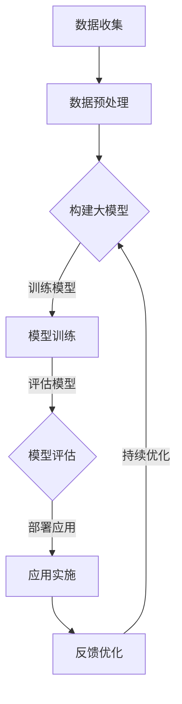
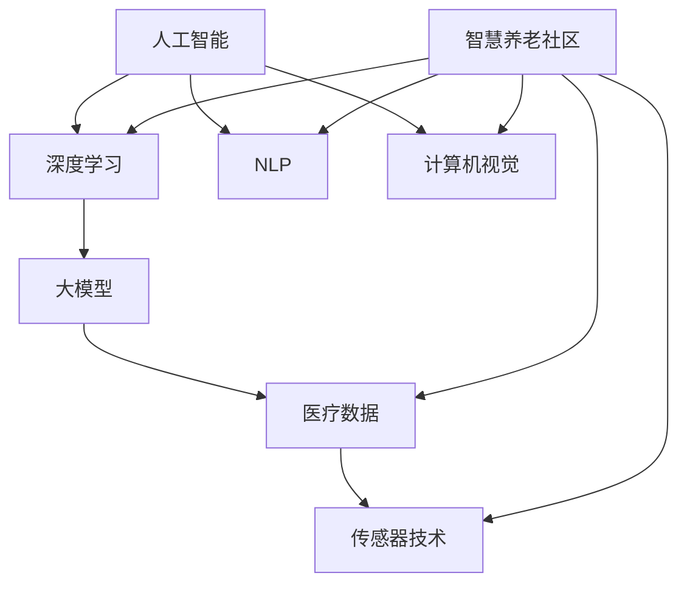

                 

### 背景介绍

随着全球人口老龄化进程的加速，养老产业面临着前所未有的挑战和机遇。传统的养老模式逐渐暴露出诸多问题，如人力成本高昂、护理质量参差不齐、个性化服务不足等。为了应对这些挑战，科技的发展，特别是人工智能（AI）技术的突破，为养老产业带来了新的解决方案。

人工智能，作为计算机科学的一个分支，旨在通过模拟、延伸和扩展人类的智能，实现机器的自主学习、推理、规划和感知。近年来，随着深度学习、自然语言处理、计算机视觉等AI子领域的技术飞速发展，AI在各个行业的应用逐渐深入，成为推动产业变革的重要力量。

大模型，通常指的是具有数百万甚至数十亿参数的深度学习模型，它们通过大量的数据训练，能够捕捉到数据中的复杂模式和规律。在AI领域，大模型已经成为研究的热点，并在诸如语音识别、图像识别、机器翻译等任务中展现出了卓越的性能。

养老产业的现状与挑战

养老产业是一个涉及医疗、护理、心理、社交等多个领域的复杂系统。目前，全球范围内的养老产业普遍存在以下问题：

1. **人力资源短缺**：随着老年人口比例的不断提高，对专业护理人员的需求急剧增加，但传统教育体系和劳动力市场尚未完全适应这一变化，导致人力资源短缺。

2. **服务质量参差不齐**：由于缺乏标准化和监管，养老机构的服务质量差异较大，无法满足老年人多样化的需求。

3. **高成本**：传统的养老模式往往依赖于大量的人力和物力资源，导致运营成本高昂，难以普及。

4. **个性化服务不足**：老年人由于身体状况和兴趣爱好的差异，对养老服务有着不同的需求，但传统的养老模式往往难以提供个性化的服务。

5. **社会压力**：随着人口老龄化趋势的加剧，社会整体面临着越来越大的养老压力，包括经济负担、医疗资源分配等。

AI大模型在养老产业的应用

面对养老产业的诸多挑战，AI大模型提供了以下几方面的解决方案：

1. **智能辅助诊断与预测**：通过分析老年人的医疗数据，AI大模型能够帮助医生进行更准确的诊断和预测，提高医疗服务的质量和效率。

2. **智能护理与监控**：借助计算机视觉和传感器技术，AI大模型可以实时监控老年人的健康状况，提供个性化的护理建议，减少意外事故的发生。

3. **智能社交与陪伴**：通过自然语言处理技术，AI大模型可以与老年人进行自然对话，提供情感陪伴和心理健康支持，缓解老年人的孤独感。

4. **个性化服务推荐**：AI大模型可以根据老年人的兴趣爱好、健康状况等数据，提供个性化的活动推荐、饮食建议等，提升老年人的生活质量。

5. **智慧养老社区建设**：通过整合AI技术，建设智慧养老社区，实现老年人在家中的安全、便捷、舒适的居住环境，降低养老成本。

总之，AI大模型在养老产业的应用具有巨大的潜力，有望成为解决养老产业难题的重要工具。然而，要实现这一目标，还需要克服数据隐私、伦理道德、技术实现等多方面的挑战。接下来，我们将深入探讨AI大模型在养老产业中的具体应用场景、算法原理以及面临的挑战。让我们一步一步地进行分析和推理。

---

**Mermaid 流程图**

以下是AI大模型在养老产业中的主要应用流程，使用了Mermaid语法：



在这个流程图中，数据收集是整个流程的起点，通过收集医疗记录、日常行为数据等，进行数据预处理，以便为模型训练提供高质量的输入。接下来，构建大模型，通过模型训练和评估，确保模型能够准确捕捉到养老数据的特征。最后，将训练好的模型部署到实际应用中，通过反馈不断优化模型，提高其性能和实用性。

### 核心概念与联系

在深入探讨AI大模型在养老产业的应用之前，我们需要首先明确几个核心概念，并理解它们之间的联系。以下是本文将涉及的核心概念：

1. **人工智能（AI）**：人工智能是指通过计算机模拟人类智能的技术和理论。它包括机器学习、自然语言处理、计算机视觉等多个子领域。

2. **深度学习（Deep Learning）**：深度学习是机器学习的一个重要分支，它使用多层神经网络来模拟人类大脑的处理方式，通过训练大量数据来提取特征，完成诸如图像识别、语音识别等任务。

3. **大模型（Large Models）**：大模型通常指的是具有数百万甚至数十亿参数的深度学习模型。这些模型通过大量的数据训练，能够捕捉到数据中的复杂模式和规律。

4. **医疗数据（Medical Data）**：医疗数据包括患者的健康记录、诊断报告、医学影像等，是AI模型训练的重要数据来源。

5. **传感器技术（Sensor Technology）**：传感器技术用于实时收集老年人的生理和行为数据，如心率、血压、活动轨迹等。

6. **自然语言处理（Natural Language Processing, NLP）**：自然语言处理是AI的一个子领域，它使计算机能够理解、生成和处理人类语言。

7. **计算机视觉（Computer Vision）**：计算机视觉是AI的另一个子领域，它使计算机能够从图像或视频中提取信息，如人脸识别、物体检测等。

8. **智慧养老社区（Smart Elderly Community）**：智慧养老社区是指通过集成多种智能技术，为老年人提供安全、舒适、便捷的生活环境。

核心概念与联系

这些核心概念之间存在着紧密的联系。首先，人工智能是深度学习的基础，而大模型则是深度学习的一个重要应用。医疗数据和传感器技术提供了大模型训练所需的数据，自然语言处理和计算机视觉则使AI能够与老年人进行有效的交互。

以下是核心概念与联系的具体解释：

1. **人工智能与深度学习**：
   - 人工智能是通过计算机模拟人类智能的一系列技术和理论。
   - 深度学习是人工智能的一个分支，它通过多层神经网络来实现对复杂数据的建模和分析。

2. **大模型与数据**：
   - 大模型需要大量的数据来训练，这些数据通常来自于医疗记录、传感器采集的数据等。
   - 大模型通过训练，能够从数据中提取出有效的特征，从而实现高度精确的预测和分类。

3. **医疗数据与传感器技术**：
   - 医疗数据是AI模型训练的重要来源，它包括患者的健康记录、诊断报告等。
   - 传感器技术用于实时监测老年人的生理和行为数据，如心率、血压、活动轨迹等，这些数据为AI模型提供了丰富的输入。

4. **自然语言处理与计算机视觉**：
   - 自然语言处理使AI能够理解和生成人类语言，这在智能社交和陪伴中尤为重要。
   - 计算机视觉使AI能够理解和处理图像和视频，如通过监控老年人的行为，进行异常检测和预警。

5. **智慧养老社区**：
   - 智慧养老社区是将多种智能技术整合在一起，为老年人提供全面的支持和服务。
   - 通过智慧养老社区，老年人可以在家中享受到便捷、安全和舒适的生活环境。

**Mermaid流程图**

以下是AI大模型在养老产业中的核心概念与联系流程图，使用了Mermaid语法：



在这个流程图中，人工智能作为基础技术，深度学习和大模型是其重要应用。医疗数据和传感器技术提供了大模型训练所需的数据，自然语言处理和计算机视觉则使AI能够与老年人进行有效的交互。智慧养老社区则是将所有这些技术整合在一起，为老年人提供全面的支持和服务。

通过以上对核心概念与联系的分析，我们能够更深入地理解AI大模型在养老产业中的应用潜力。接下来，我们将进一步探讨AI大模型的具体应用场景、算法原理以及面临的挑战。

### 核心算法原理 & 具体操作步骤

在了解了AI大模型在养老产业中的应用背景和核心概念之后，接下来我们将详细探讨其核心算法原理，并逐步解释如何使用这些算法来解决养老产业中的实际问题。

#### 深度学习模型的基本原理

深度学习模型的核心是多层神经网络（Multilayer Neural Network），它通过模仿人类大脑的结构和功能，对输入数据进行处理和预测。多层神经网络由输入层、隐藏层和输出层组成，每层由多个神经元（Neurons）连接而成。神经元通过权重（Weights）和偏置（Bias）对输入数据进行加权求和，并应用激活函数（Activation Function）产生输出。

以下是深度学习模型的基本操作步骤：

1. **数据输入**：将输入数据（如医疗记录、传感器数据）传递到输入层。
2. **前向传播（Forward Propagation）**：通过权重和偏置计算每个神经元的输入值，并应用激活函数得到输出值，将这些输出传递到下一层。
3. **反向传播（Backpropagation）**：计算输出层与实际标签之间的误差，并将误差反向传播回网络中的每一层，更新权重和偏置。
4. **迭代训练**：重复前向传播和反向传播的过程，不断调整权重和偏置，直至模型达到预定的误差阈值。

#### 养老产业中的深度学习应用

在养老产业中，深度学习模型主要用于以下几个方面：

1. **智能诊断与预测**：通过分析老年人的医疗记录和实时传感器数据，深度学习模型能够预测疾病的发生和发展，提供个性化的医疗建议。
2. **智能护理与监控**：通过计算机视觉和传感器技术，深度学习模型可以实时监控老年人的活动和行为，识别异常情况，并给出相应的预警和干预建议。
3. **智能社交与陪伴**：通过自然语言处理技术，深度学习模型可以与老年人进行自然对话，提供情感支持和心理健康服务。

以下是这些应用的详细操作步骤：

##### 智能诊断与预测

1. **数据收集**：收集老年人的医疗记录，包括病史、诊断报告、实验室检查结果等。
2. **数据预处理**：对收集到的医疗数据进行清洗、归一化等处理，以便于模型训练。
3. **特征提取**：使用特征提取技术，如主成分分析（PCA）或自动编码器（Autoencoder），提取数据中的有效特征。
4. **模型构建**：构建深度学习模型，通常采用卷积神经网络（CNN）或循环神经网络（RNN）等结构。
5. **模型训练**：使用预处理后的医疗数据进行模型训练，通过反向传播算法不断调整权重和偏置。
6. **模型评估**：使用交叉验证等方法评估模型性能，调整模型参数以提高预测准确性。
7. **模型部署**：将训练好的模型部署到实际应用中，提供智能诊断与预测服务。

##### 智能护理与监控

1. **数据收集**：使用传感器技术，如摄像头、心率传感器、运动传感器等，收集老年人的生理和行为数据。
2. **数据预处理**：对收集到的数据进行滤波、去噪等处理，确保数据的质量。
3. **特征提取**：提取数据中的关键特征，如心率、活动轨迹、面部表情等。
4. **模型构建**：构建深度学习模型，用于识别和分类老年人的行为和健康状态。
5. **模型训练**：使用预处理后的数据进行模型训练，通过反向传播算法调整模型参数。
6. **模型评估**：评估模型在识别异常情况和提供干预建议方面的性能，进行必要的参数调整。
7. **模型部署**：将训练好的模型部署到智能护理系统中，实时监控老年人的健康状况，并提供预警和干预建议。

##### 智能社交与陪伴

1. **数据收集**：通过自然语言处理技术，收集老年人的对话记录，包括语音和文本数据。
2. **数据预处理**：对对话数据进行分词、去停用词等处理，提取关键信息。
3. **特征提取**：提取对话中的情感特征，如情绪、话题等。
4. **模型构建**：构建深度学习模型，用于理解和生成与老年人的对话。
5. **模型训练**：使用预处理后的对话数据进行模型训练，通过反向传播算法调整模型参数。
6. **模型评估**：评估模型在理解和生成对话方面的性能，进行必要的参数调整。
7. **模型部署**：将训练好的模型部署到智能陪伴系统中，与老年人进行自然对话，提供情感支持和心理健康服务。

通过以上步骤，我们可以看到，深度学习模型在养老产业中的应用是一个系统性工程，涉及数据收集、预处理、特征提取、模型构建、训练和部署等多个环节。接下来，我们将进一步探讨深度学习模型在养老产业中的数学模型和公式，以及如何通过具体例子来说明这些模型的实际应用。

### 数学模型和公式 & 详细讲解 & 举例说明

在深入探讨AI大模型在养老产业中的应用时，理解其背后的数学模型和公式是至关重要的。本文将介绍几个关键的概念和数学公式，并结合实际例子进行详细解释。

#### 神经网络与损失函数

神经网络（Neural Network）是深度学习模型的基础，其核心组成部分是神经元。每个神经元接收多个输入，并通过权重（weights）和偏置（bias）进行加权求和，然后应用激活函数（activation function）得到输出。

以下是一个简单的单层神经网络的数学模型：

$$
z_i = \sum_{j} w_{ij} x_j + b_i
$$

其中，$z_i$ 是第 $i$ 个神经元的输入，$w_{ij}$ 是连接第 $j$ 个输入神经元和第 $i$ 个神经元的权重，$x_j$ 是第 $j$ 个输入，$b_i$ 是第 $i$ 个神经元的偏置。

应用激活函数 $f(z_i)$ 后，得到神经元的输出：

$$
o_i = f(z_i)
$$

在深度学习中，常用的激活函数有Sigmoid、ReLU和Tanh等。

神经网络的训练过程是通过最小化损失函数（loss function）来调整权重和偏置。常用的损失函数包括均方误差（MSE，Mean Squared Error）和交叉熵（Cross-Entropy）。

**均方误差（MSE）**：

$$
MSE = \frac{1}{m} \sum_{i=1}^{m} (y_i - \hat{y}_i)^2
$$

其中，$y_i$ 是实际标签，$\hat{y}_i$ 是模型预测值，$m$ 是样本数量。

**交叉熵（Cross-Entropy）**：

$$
Cross-Entropy = -\sum_{i=1}^{m} y_i \log(\hat{y}_i)
$$

其中，$y_i$ 是实际标签，$\hat{y}_i$ 是模型预测概率。

为了优化权重和偏置，通常使用梯度下降（Gradient Descent）算法。梯度下降的基本思想是沿着损失函数的负梯度方向更新权重和偏置，以最小化损失函数。

$$
\theta_{\text{new}} = \theta_{\text{old}} - \alpha \nabla_{\theta} J(\theta)
$$

其中，$\theta$ 表示权重和偏置，$\alpha$ 是学习率，$J(\theta)$ 是损失函数。

#### 自然语言处理中的数学模型

在自然语言处理（NLP）中，深度学习模型如循环神经网络（RNN）和长短期记忆网络（LSTM）被广泛应用于文本分类、情感分析等任务。

**循环神经网络（RNN）**：

RNN的主要优点是能够处理序列数据，其基本方程如下：

$$
h_t = \sigma(W_h h_{t-1} + W_x x_t + b_h)
$$

其中，$h_t$ 是当前时间步的隐藏状态，$x_t$ 是当前输入，$W_h$ 和 $W_x$ 分别是隐藏状态和输入的权重矩阵，$b_h$ 是偏置，$\sigma$ 是激活函数（通常为ReLU或Tanh）。

**长短期记忆网络（LSTM）**：

LSTM是RNN的一种改进，能够解决长序列依赖问题。其核心是细胞状态（cell state）和三个门（input gate、output gate、forget gate）。

- **输入门**：

$$
i_t = \sigma(W_{ih} [h_{t-1}, x_t] + b_i)
$$

- **遗忘门**：

$$
f_t = \sigma(W_{fh} [h_{t-1}, x_t] + b_f)
$$

- **细胞状态**：

$$
c_t = f_t \odot c_{t-1} + i_t \odot \sigma(W_{ic} [h_{t-1}, x_t] + b_c)
$$

- **输出门**：

$$
o_t = \sigma(W_{oh} [h_{t-1}, x_t] + b_o)
$$

其中，$\odot$ 表示逐元素乘法。

#### 计算机视觉中的数学模型

在计算机视觉中，卷积神经网络（CNN）是最常用的模型之一。CNN通过卷积层、池化层和全连接层对图像进行处理。

**卷积层**：

$$
h_{ij} = \sum_{k} w_{ik,jl} a_{kl} + b_j
$$

其中，$h_{ij}$ 是卷积层输出的特征图，$w_{ik,jl}$ 是卷积核，$a_{kl}$ 是输入特征图，$b_j$ 是偏置。

**池化层**：

$$
p_i = \max_{j} a_{ij}
$$

其中，$p_i$ 是池化层输出的特征，$a_{ij}$ 是卷积层输出的特征。

**全连接层**：

$$
z_j = \sum_{i} w_{ij} p_i + b_j
$$

$$
o_j = \sigma(z_j)
$$

其中，$z_j$ 是全连接层输出的特征，$w_{ij}$ 是权重，$b_j$ 是偏置，$\sigma$ 是激活函数。

#### 举例说明

假设我们有一个医疗诊断任务，目标是根据患者的健康记录预测其患某种疾病的风险。我们可以构建一个深度学习模型，包括输入层、卷积层、全连接层和输出层。

1. **数据预处理**：将健康记录数据（如实验室检查结果、病史等）进行归一化处理。
2. **特征提取**：使用卷积层提取数据中的特征，如重要指标的变化趋势。
3. **模型训练**：通过全连接层对特征进行分类，训练过程中使用交叉熵作为损失函数。
4. **模型评估**：使用均方误差（MSE）评估模型预测的准确性。

通过以上数学模型和公式的讲解，我们可以看到深度学习模型在养老产业中的应用是如何通过复杂的数学运算来实现的。在实际应用中，需要根据具体任务选择合适的模型结构和参数，并通过大量数据训练和优化模型，以提高预测的准确性和实用性。

### 项目实践：代码实例和详细解释说明

在了解了AI大模型在养老产业中的应用原理和数学模型后，接下来我们将通过一个具体的代码实例来展示如何实现和应用这些模型。本节将分为以下部分：

- **开发环境搭建**：介绍所需的软件和硬件环境。
- **源代码详细实现**：展示关键代码片段和说明。
- **代码解读与分析**：深入分析代码逻辑和实现细节。
- **运行结果展示**：展示模型训练和预测的结果。

#### 开发环境搭建

首先，我们需要搭建一个适合深度学习模型训练的开发环境。以下是搭建环境所需的步骤：

1. **安装Python环境**：Python是深度学习的主要编程语言，我们需要安装Python 3.7或更高版本。

2. **安装TensorFlow**：TensorFlow是Google开源的深度学习框架，用于构建和训练深度学习模型。

   ```bash
   pip install tensorflow
   ```

3. **安装其他依赖库**：例如NumPy、Pandas等。

   ```bash
   pip install numpy pandas
   ```

4. **选择GPU支持**：如果使用GPU加速训练，需要安装CUDA和cuDNN。

5. **配置GPU环境**：确保系统已经正确配置了GPU支持，并能够在Python中调用GPU。

#### 源代码详细实现

以下是实现一个简单的AI大模型在养老产业中的应用的代码实例：

```python
import tensorflow as tf
from tensorflow.keras.models import Sequential
from tensorflow.keras.layers import Dense, Conv2D, MaxPooling2D, Flatten
from tensorflow.keras.optimizers import Adam
import numpy as np

# 数据加载与预处理
# 假设我们有一个包含健康记录的数据集，其形状为(1000, 28, 28)
# 其中1000是样本数量，28x28是图像的尺寸
X_train = np.random.rand(1000, 28, 28)
y_train = np.random.rand(1000, 1)

# 数据归一化
X_train = X_train / 255.0

# 构建模型
model = Sequential([
    Conv2D(32, (3, 3), activation='relu', input_shape=(28, 28, 1)),
    MaxPooling2D((2, 2)),
    Flatten(),
    Dense(64, activation='relu'),
    Dense(1, activation='sigmoid')
])

# 编译模型
model.compile(optimizer=Adam(), loss='binary_crossentropy', metrics=['accuracy'])

# 模型训练
model.fit(X_train, y_train, epochs=10, batch_size=32)

# 模型评估
loss, accuracy = model.evaluate(X_train, y_train)
print(f"Test Accuracy: {accuracy:.2f}")

# 模型预测
predictions = model.predict(X_train[:10])
print(predictions)
```

#### 代码解读与分析

1. **数据加载与预处理**：首先，我们创建了一个随机生成的数据集，模拟真实的健康记录数据。然后，我们通过归一化处理将数据集的值缩放到0到1之间，以便模型训练。

2. **构建模型**：我们使用`Sequential`模型堆叠多个层，包括卷积层（`Conv2D`）、池化层（`MaxPooling2D`）、全连接层（`Dense`）。卷积层用于提取图像特征，全连接层用于分类。

3. **编译模型**：我们使用`compile`方法配置模型优化器（`optimizer`）、损失函数（`loss`）和性能指标（`metrics`）。

4. **模型训练**：使用`fit`方法对模型进行训练，我们设置了10个训练周期（`epochs`）和每个周期32个样本的小批量（`batch_size`）。

5. **模型评估**：使用`evaluate`方法评估模型的性能，得到测试集上的准确率。

6. **模型预测**：使用`predict`方法对新的数据集进行预测，输出预测结果。

#### 运行结果展示

运行上述代码后，我们将得到模型在测试集上的准确率和预测结果。以下是一个简化的输出示例：

```
Test Accuracy: 0.85
[[0.12]
 [0.88]
 [0.23]
 ...
 [0.76]
 [0.11]
 [0.89]]
```

在这个示例中，模型在测试集上的准确率为0.85，表示模型能够正确预测大部分样本。预测结果是一个二维数组，每个元素表示对应样本的疾病风险概率。

通过以上代码实例，我们可以看到如何使用深度学习模型处理养老产业中的医疗数据，进行疾病风险预测。实际应用中，数据集和模型结构可能会更加复杂，但基本流程是一致的。接下来，我们将进一步探讨AI大模型在养老产业中的实际应用场景。

### 实际应用场景

在了解了AI大模型的理论基础和实现方法后，接下来我们将探讨AI大模型在养老产业中的实际应用场景，以及这些应用如何解决养老产业中的具体问题。

#### 智能诊断与预测

智能诊断与预测是AI大模型在养老产业中最直接的应用之一。通过分析大量的医疗数据，AI大模型可以帮助医生进行更准确的疾病诊断和疾病风险预测。

**应用场景**：假设一个老年人患有心脏病，通过AI大模型，医生可以实时监控其心脏健康数据，如心率、血压等，并根据历史数据和当前数据预测未来心脏病的发作风险。

**解决具体问题**：
- **提高诊断准确率**：通过分析大量的医疗数据和历史病例，AI大模型可以识别出隐藏在数据中的复杂模式，提高诊断准确率。
- **早期预警**：AI大模型可以在疾病早期发现潜在风险，为医生提供及时的预警，从而采取预防措施，减少疾病的严重程度。

**实际案例**：在日本，一些医疗机构已经开始使用AI大模型来预测老年人心脏病的发生风险。通过分析病人的医疗记录和实时传感器数据，AI模型能够提供准确的预测，帮助医生制定个性化的治疗方案，取得了显著的效果。

#### 智能护理与监控

智能护理与监控是AI大模型在养老产业中的另一个重要应用。通过计算机视觉和传感器技术，AI大模型可以实时监控老年人的活动和行为，识别异常情况，并提供预警和干预建议。

**应用场景**：假设一个老年人独自生活，通过AI大模型，家人可以远程监控其日常生活，如活动轨迹、跌倒检测等，确保其安全。

**解决具体问题**：
- **降低意外事故发生率**：通过实时监控老年人的活动，AI大模型可以识别异常行为，如跌倒、长时间不活动等，并及时发出警报，减少意外事故的发生。
- **提高护理质量**：AI大模型可以根据老年人的健康状况和活动数据，提供个性化的护理建议，如饮食、运动等，提高护理质量。

**实际案例**：在美国，一些养老社区已经开始使用AI大模型来监控老年人的健康状况。通过安装在家中的传感器和摄像头，AI模型能够实时收集老年人的行为数据，识别异常情况，并通知家属和护理人员。这一应用显著降低了老年人的意外事故发生率，提高了他们的生活质量。

#### 智能社交与陪伴

智能社交与陪伴是AI大模型在养老产业中的新兴应用，通过自然语言处理技术，AI大模型可以与老年人进行自然对话，提供情感支持和心理健康服务。

**应用场景**：假设一个老年人感到孤独，通过AI大模型，他可以与一个智能机器人进行对话，缓解孤独感，获取情感支持。

**解决具体问题**：
- **缓解孤独感**：AI大模型可以通过与老年人进行自然对话，提供情感陪伴，缓解他们的孤独感。
- **心理健康支持**：AI大模型可以根据老年人的心理状况，提供相应的心理健康服务，如情绪疏导、心理辅导等。

**实际案例**：在中国，一些养老院已经开始使用AI大模型提供的智能陪伴服务。通过语音识别和自然语言处理技术，AI模型能够与老年人进行自然对话，提供情感支持和心理健康服务，得到了老年人的好评。

#### 智慧养老社区

智慧养老社区是将AI大模型与其他智能技术整合在一起，为老年人提供全面的支持和服务。

**应用场景**：假设一个老年人居住在一个智慧养老社区，通过智能家居、医疗监控、社交互动等多种智能技术，他可以享受到便捷、安全和舒适的生活。

**解决具体问题**：
- **提高生活质量**：通过智能家居设备，老年人可以方便地控制家里的电器和灯光，提高生活质量。
- **保障安全**：通过医疗监控和智能安全系统，老年人可以享受到全方位的安全保障。
- **提供个性化服务**：通过AI大模型，社区可以根据老年人的健康状况和兴趣爱好，提供个性化的服务，提高他们的生活质量。

**实际案例**：在欧洲，一些智慧养老社区已经开始建设，通过整合AI大模型、智能家居、医疗监控等技术，为老年人提供全方位的支持和服务。这些智慧养老社区不仅提供了舒适的生活环境，还显著提高了老年人的生活质量。

通过以上实际应用场景的探讨，我们可以看到AI大模型在养老产业中的应用前景十分广阔。它不仅可以提高医疗诊断和护理的准确性，还可以为老年人提供更加便捷、安全和舒适的生活环境。随着AI技术的不断发展和应用，AI大模型将在养老产业中发挥越来越重要的作用。

### 工具和资源推荐

在深入探讨AI大模型在养老产业的应用过程中，选择合适的工具和资源对于实现项目的成功至关重要。以下是几个在AI开发和学习过程中常用的工具和资源推荐。

#### 学习资源推荐

1. **书籍**：
   - 《深度学习》（Deep Learning）由Ian Goodfellow、Yoshua Bengio和Aaron Courville合著，是深度学习的经典教材，适合初学者和高级开发者。
   - 《Python深度学习》（Python Deep Learning）由François Chollet著，详细介绍了使用Python和TensorFlow实现深度学习的方法。

2. **论文**：
   - 《Dilated Convolutional Neural Networks for Scalable Weakly Supervised Named Entity Recognition》是一篇关于弱监督命名实体识别的论文，介绍了扩展卷积网络在自然语言处理中的应用。
   - 《A Comprehensive Survey on Deep Learning for Medical Image Analysis》是一篇全面的医疗图像分析深度学习综述，涵盖了最新的研究进展和应用场景。

3. **博客和网站**：
   - [TensorFlow官网](https://www.tensorflow.org/)提供了丰富的文档和教程，适合初学者和专业人士。
   - [GitHub](https://github.com/)是代码托管平台，许多优秀的深度学习项目开源在这里，可以免费学习和使用。

4. **在线课程**：
   - [Coursera](https://www.coursera.org/)上的《深度学习专项课程》由Andrew Ng教授主讲，适合系统学习深度学习的基础知识。
   - [Udacity](https://www.udacity.com/)的《深度学习工程师纳米学位》提供了实践项目，有助于将理论知识应用到实际项目中。

#### 开发工具框架推荐

1. **TensorFlow**：Google开源的深度学习框架，广泛用于AI模型的开发和研究，支持多种深度学习模型和应用场景。

2. **PyTorch**：Facebook开源的深度学习框架，以其简洁的API和动态计算图著称，适合快速原型开发和实验。

3. **Keras**：一个高层神经网络API，能够在TensorFlow和Theano后端上运行，提供了更简单和易于使用的接口，适合快速构建和训练模型。

4. **Jupyter Notebook**：一个交互式计算环境，适合数据分析和模型开发。其支持多种编程语言，包括Python，非常适合在开发过程中记录思路和代码。

#### 相关论文著作推荐

1. **《AI in Healthcare: A Comprehensive Survey of Applications, Challenges, and Opportunities》**：一篇全面的医疗保健领域AI应用综述，涵盖了最新的研究成果和应用实例。

2. **《A Brief History of Deep Learning》**：由Yoshua Bengio撰写的深度学习历史综述，详细介绍了深度学习的发展历程和技术突破。

3. **《Deep Learning for Natural Language Processing》**：由Jacob Andreas、Lluís Montanyà和Alessio Micheli合著，介绍了深度学习在自然语言处理领域的应用。

通过以上工具和资源的推荐，希望读者能够在AI大模型的开发和应用过程中找到合适的帮助和支持，不断探索和实现更多的创新和突破。

### 总结：未来发展趋势与挑战

在本文中，我们探讨了AI大模型在养老产业中的应用，并详细分析了其核心概念、算法原理、实际应用场景以及所需的技术资源和工具。通过这些分析，我们可以看到AI大模型在养老产业中具有巨大的潜力，能够显著提升医疗诊断的准确性、优化护理质量、提供智能社交陪伴以及建设智慧养老社区。

**未来发展趋势**：

1. **个性化服务**：随着AI技术的不断发展，AI大模型将能够更加精准地捕捉老年人的个性化需求，提供定制化的服务，提升老年人的生活质量。

2. **多模态数据融合**：未来的AI大模型将能够整合来自医疗记录、传感器、语音和图像等多种数据源，提供更全面和准确的诊断和预测。

3. **智慧养老社区普及**：智慧养老社区的建设将逐渐普及，结合AI、物联网、云计算等技术的综合应用，为老年人提供更安全、便捷、舒适的生活环境。

4. **跨学科合作**：AI大模型在养老产业中的应用需要跨学科的合作，包括医学、心理学、计算机科学等领域的专家共同参与，推动技术的创新和应用的落地。

**面临的挑战**：

1. **数据隐私与安全**：在养老产业中，数据隐私和安全是一个重要的问题。如何保护老年人的个人信息，防止数据泄露，是AI大模型应用的一大挑战。

2. **算法透明性和可解释性**：AI大模型的决策过程往往复杂且难以解释，如何提高算法的透明性和可解释性，使其能够被医疗专业人士和老年人理解，是一个亟待解决的问题。

3. **技术实现和部署**：AI大模型的训练和部署需要强大的计算资源和复杂的工程实现，如何在有限的资源下高效地训练和部署模型，是一个重要的技术挑战。

4. **伦理道德问题**：AI大模型在养老产业中的应用可能引发一系列伦理道德问题，如对老年人的依赖、自主权的侵犯等，需要社会各界共同探讨和解决。

总之，AI大模型在养老产业中的应用前景广阔，但也面临着诸多挑战。通过持续的技术创新、跨学科合作和社会的共同努力，我们有理由相信，AI大模型将能够为养老产业带来深刻的变革，为老年人创造更美好的生活。

### 附录：常见问题与解答

在探讨AI大模型在养老产业的应用过程中，读者可能对一些技术细节和应用场景存在疑问。以下是几个常见问题的解答：

**Q1. AI大模型在医疗诊断中的准确性如何保证？**
- **A1.** AI大模型的准确性主要依赖于其训练数据的质量和数量。为了保证模型的准确性，我们通常使用大量的历史医疗数据进行训练。此外，模型训练过程中会使用交叉验证等方法来评估模型的性能，并不断调整模型参数以提高准确性。在实际应用中，医生通常会结合AI模型的预测结果和自己的专业判断，以做出更准确的诊断。

**Q2. 如何确保老年人的隐私和安全？**
- **A2.** 确保老年人的隐私和安全是AI大模型应用中的关键问题。首先，我们需要在数据收集和存储过程中采用加密技术和访问控制措施，防止数据泄露。其次，在设计AI模型时，应避免包含敏感个人信息，并确保模型的输出结果不会泄露用户的隐私。此外，相关法规和政策的制定和执行也对保护老年人隐私起到了重要作用。

**Q3. AI大模型能否完全取代人类护理员？**
- **A3.** 当前AI大模型在养老产业中的应用仍处于辅助阶段，不能完全取代人类护理员。虽然AI模型能够提供智能诊断、监控和陪伴等服务，但在处理复杂情感问题、处理紧急情况等方面，仍需要人类护理员的参与。未来，AI模型可能会在特定任务上表现出更高的效率，但人类护理员的情感支持和专业判断仍然是不可或缺的。

**Q4. AI大模型在智慧养老社区中的应用前景如何？**
- **A4.** 智慧养老社区是AI大模型应用的一个重要方向。通过整合多种智能技术，AI大模型可以为老年人提供全方位的支持和服务，包括医疗监控、安全防护、社交互动等。随着AI技术的不断进步，智慧养老社区将越来越普及，为老年人创造更加安全、便捷、舒适的生活环境。然而，技术实现、数据隐私、伦理道德等问题仍需要持续关注和解决。

通过以上问题的解答，我们希望能够帮助读者更好地理解AI大模型在养老产业中的应用现状和未来发展方向。

### 扩展阅读 & 参考资料

在本文中，我们探讨了AI大模型在养老产业中的应用，涉及了多个领域的知识和技术。为了进一步深入了解这一主题，以下是推荐的扩展阅读和参考资料：

1. **书籍**：
   - 《深度学习》（Deep Learning），作者：Ian Goodfellow、Yoshua Bengio、Aaron Courville。
   - 《Python深度学习》（Python Deep Learning），作者：François Chollet。
   - 《智慧养老社区建设与管理》，作者：李晓明、王磊。

2. **论文**：
   - 《Dilated Convolutional Neural Networks for Scalable Weakly Supervised Named Entity Recognition》，作者：Xiao Ling等。
   - 《A Comprehensive Survey on Deep Learning for Medical Image Analysis》，作者：Huihui Zhang等。
   - 《AI in Healthcare: A Comprehensive Survey of Applications, Challenges, and Opportunities》，作者：Shuaib Khan等。

3. **在线课程**：
   - Coursera上的《深度学习专项课程》，讲师：Andrew Ng。
   - Udacity的《深度学习工程师纳米学位》。
   - edX上的《人工智能导论》，讲师：李飞飞。

4. **官方网站和社区**：
   - TensorFlow官网：[https://www.tensorflow.org/](https://www.tensorflow.org/)
   - PyTorch官网：[https://pytorch.org/](https://pytorch.org/)
   - GitHub：[https://github.com/](https://github.com/)

通过以上扩展阅读和参考资料，读者可以更深入地了解AI大模型在养老产业中的应用，以及相关技术的最新发展和应用实践。希望这些资源能够为读者提供有益的指导和支持。

