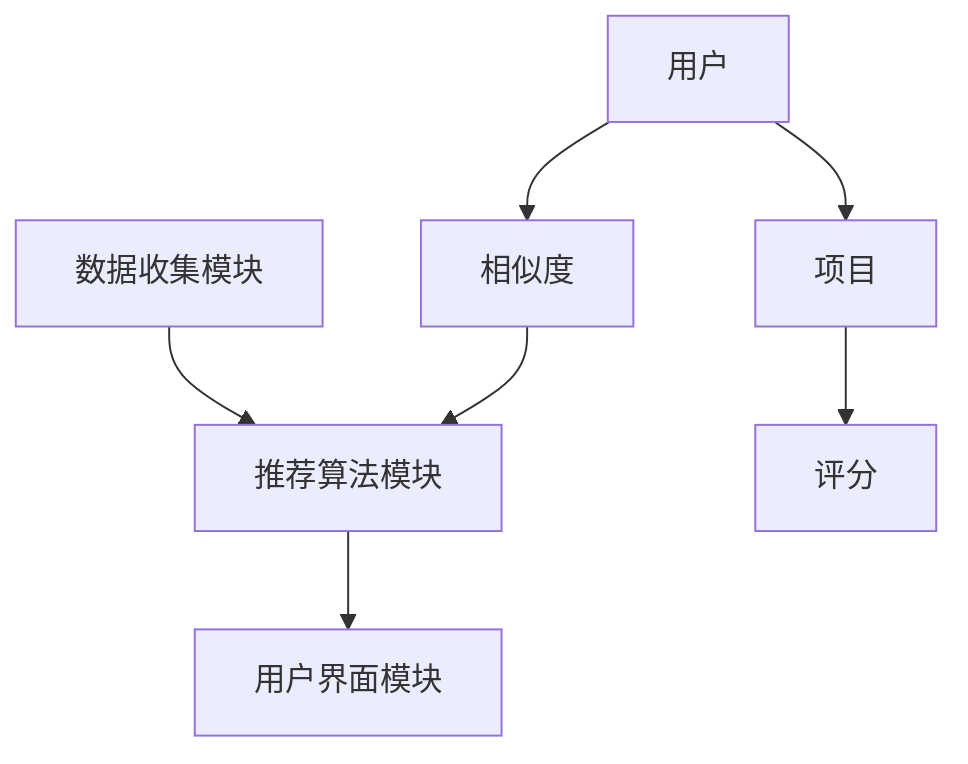

                 

### 1. 背景介绍

推荐系统（Recommender Systems）是当今信息过载时代下的一种重要工具，旨在通过向用户推荐感兴趣的内容或产品，以提高用户的满意度和参与度。随着互联网和大数据技术的飞速发展，推荐系统已经广泛应用于电子商务、社交媒体、在线视频、音乐流媒体等各个领域。

推荐系统的研究始于20世纪90年代，随着互联网的普及和在线交易的兴起，推荐系统在电子商务领域得到了广泛的应用。早期的推荐系统主要基于基于内容的推荐和协同过滤技术，随着机器学习、深度学习等技术的发展，推荐系统也逐渐实现了更加智能的推荐。

目前，推荐系统已成为许多公司获取竞争优势的关键因素。例如，亚马逊、Netflix和YouTube等公司都通过推荐系统来提高用户的购物、观影和听音乐的体验，从而增加用户黏性和销售额。

本篇文章旨在详细介绍推荐系统的原理、核心算法、数学模型以及实际应用场景。我们将从以下几个部分展开：

1. 核心概念与联系：介绍推荐系统的基础概念和架构。
2. 核心算法原理与具体操作步骤：讲解协同过滤、基于内容的推荐等核心算法。
3. 数学模型与公式：深入探讨推荐系统中常用的数学模型和公式。
4. 项目实践：通过一个代码实例展示推荐系统的实现过程。
5. 实际应用场景：分析推荐系统在不同领域的应用。
6. 工具和资源推荐：推荐一些学习资源、开发工具和论文著作。
7. 总结：展望推荐系统的未来发展趋势和面临的挑战。

通过对以上内容的详细解析，本文希望能够为读者提供一个全面、系统的推荐系统知识体系，帮助读者更好地理解和应用推荐系统技术。接下来，我们将逐个探讨推荐系统的各个方面，带领读者深入探索这个充满挑战和机遇的领域。### 2. 核心概念与联系

#### 2.1 推荐系统的定义与作用

推荐系统是一种基于数据分析技术的应用，它通过收集和分析用户的偏好和行为数据，为用户推荐可能感兴趣的内容或产品。推荐系统的作用主要有以下几个方面：

- **提高用户体验**：推荐系统能够为用户提供个性化推荐，满足他们的个性化需求，从而提升用户的使用体验。
- **增加用户黏性**：通过持续为用户推荐他们感兴趣的内容或产品，推荐系统可以增加用户的活跃度和忠诚度，从而提高用户黏性。
- **提升销售和收益**：在电子商务领域，推荐系统可以帮助商家将产品推送给潜在买家，从而增加销售额和收益。

#### 2.2 推荐系统的架构

推荐系统的架构可以分为三个主要模块：数据收集模块、推荐算法模块和用户界面模块。

- **数据收集模块**：负责收集用户的各项行为数据，如浏览记录、购买记录、评分记录等。这些数据是构建推荐系统的基础。
- **推荐算法模块**：基于收集到的数据，使用各种推荐算法为用户生成推荐列表。推荐算法可以是基于内容的、基于协同过滤的、基于模型的，或者是多种算法的融合。
- **用户界面模块**：将推荐结果展示给用户，通常包括推荐列表、评分界面、搜索界面等。

#### 2.3 推荐系统的分类

推荐系统可以根据不同的分类标准进行分类。以下是几种常见的分类方式：

- **基于内容的推荐**：基于用户的历史行为和偏好，推荐与用户兴趣相似的内容。
- **基于协同过滤的推荐**：基于用户之间的相似性，推荐其他用户喜欢的相似内容。
- **基于模型的推荐**：使用机器学习算法，通过训练模型预测用户的偏好。
- **混合推荐**：结合多种推荐算法的优点，为用户提供更加准确的推荐。

#### 2.4 推荐系统的核心概念

- **用户**：推荐系统的核心，用户的行为数据是构建推荐系统的重要依据。
- **项目**：用户可能感兴趣的内容或产品，如电影、书籍、商品等。
- **评分**：用户对项目的评价，通常使用数值（如1-5星）或标签（如喜欢、不喜欢）表示。
- **相似度**：衡量用户或项目之间相似程度的指标，常用余弦相似度、皮尔逊相关系数等。

#### 2.5 Mermaid 流程图

以下是一个简单的推荐系统架构的 Mermaid 流程图，展示了推荐系统的主要模块和核心概念之间的联系。



通过上述核心概念和联系的介绍，我们可以对推荐系统有一个初步的了解。接下来，我们将深入探讨推荐系统的核心算法原理和具体操作步骤，带领读者进一步理解推荐系统的运作机制。### 3. 核心算法原理 & 具体操作步骤

#### 3.1 基于内容的推荐（Content-based Recommendation）

基于内容的推荐算法通过分析用户的历史行为和偏好，提取出用户感兴趣的特征，然后根据这些特征为用户推荐相似的内容。以下是基于内容的推荐算法的具体步骤：

1. **特征提取**：从用户的历史行为和偏好中提取出特征，如用户浏览过的网页、购买过的商品、评价过的电影等。这些特征可以是文本、图像、音频等不同类型的数据。
   
2. **内容表示**：将提取出的特征转换为一种统一的形式，如向量表示。这通常需要使用自然语言处理（NLP）、计算机视觉（CV）或信号处理等技术。

3. **计算相似度**：计算用户当前感兴趣的内容与历史内容的相似度。常用的相似度计算方法包括余弦相似度、皮尔逊相关系数等。

4. **生成推荐列表**：根据相似度分数，为用户生成一个推荐列表，推荐与用户历史兴趣相似的内容。

#### 3.2 基于协同过滤的推荐（Collaborative Filtering）

基于协同过滤的推荐算法通过分析用户之间的行为相似性，推荐其他用户喜欢的相似内容。协同过滤算法可以分为两类：用户基于的协同过滤和物品基于的协同过滤。

**用户基于的协同过滤（User-based Collaborative Filtering）**：

1. **选择邻居**：找到与当前用户行为最相似的若干个邻居用户。通常使用余弦相似度或皮尔逊相关系数来计算邻居用户的相似度。

2. **生成推荐列表**：根据邻居用户喜欢的项目，为当前用户生成一个推荐列表。推荐的项目是邻居用户喜欢的但当前用户尚未体验过的。

**物品基于的协同过滤（Item-based Collaborative Filtering）**：

1. **计算相似度**：计算所有项目之间的相似度，通常使用余弦相似度。

2. **生成推荐列表**：为每个用户生成一个推荐列表，列表中的项目是与用户已购买或评价的项目相似的。

#### 3.3 基于模型的推荐（Model-based Recommendation）

基于模型的推荐算法使用机器学习技术来训练模型，预测用户的偏好。常见的方法包括矩阵分解、神经网络等。

1. **数据准备**：收集用户的行为数据，如购买记录、浏览记录、评分等，并将这些数据转换为矩阵形式。

2. **模型训练**：使用机器学习算法，如矩阵分解、神经网络，训练预测模型。

3. **模型评估**：使用交叉验证等方法评估模型的性能，调整模型参数。

4. **生成推荐列表**：使用训练好的模型预测用户对未知项目的偏好，生成推荐列表。

#### 3.4 混合推荐（Hybrid Recommendation）

混合推荐算法结合了多种推荐算法的优点，以提高推荐系统的性能。常见的混合方法包括：

1. **特征融合**：将基于内容的推荐和基于协同过滤的推荐结果进行融合，使用加权平均等方法。
2. **模型融合**：将多种机器学习模型的结果进行融合，使用集成学习方法。
3. **层次化推荐**：将推荐系统分层，每一层使用不同的推荐算法。

#### 3.5 实际操作示例

以下是一个简化的基于协同过滤的推荐系统实现流程：

1. **数据收集**：收集用户的行为数据，如用户A喜欢的电影列表。

2. **邻居选择**：计算用户A与其他用户的相似度，选择相似度最高的几个用户作为邻居。

3. **推荐生成**：根据邻居用户喜欢的电影，为用户A生成推荐列表。

4. **推荐展示**：将推荐列表展示给用户A，引导用户尝试新的电影。

通过上述核心算法原理和具体操作步骤的介绍，我们可以了解到推荐系统的基本运作机制。接下来，我们将深入探讨推荐系统中使用的数学模型和公式，为读者提供更深入的理论基础。### 4. 数学模型和公式 & 详细讲解 & 举例说明

推荐系统的核心在于如何通过数学模型和公式来预测用户的偏好和生成推荐列表。在本节中，我们将详细介绍几种常用的数学模型和公式，并通过具体的例子来说明它们的使用方法。

#### 4.1 余弦相似度（Cosine Similarity）

余弦相似度是一种常用的计算两个向量之间相似度的方法，特别适用于文本数据。它的基本公式如下：

$$
\cos(\theta) = \frac{\vec{a} \cdot \vec{b}}{||\vec{a}|| \cdot ||\vec{b}||}
$$

其中，$\vec{a}$和$\vec{b}$是两个向量，$||\vec{a}||$和$||\vec{b}||$分别是它们的欧几里得范数，$\theta$是它们之间的夹角。

**示例**：

假设我们有两个用户A和B，他们的偏好向量如下：

$$
\vec{a} = (0.6, 0.8, 0.3, 0.5)
$$

$$
\vec{b} = (0.7, 0.9, 0.4, 0.6)
$$

我们可以计算它们之间的余弦相似度：

$$
\cos(\theta) = \frac{0.6 \times 0.7 + 0.8 \times 0.9 + 0.3 \times 0.4 + 0.5 \times 0.6}{\sqrt{0.6^2 + 0.8^2 + 0.3^2 + 0.5^2} \cdot \sqrt{0.7^2 + 0.9^2 + 0.4^2 + 0.6^2}} \approx 0.865
$$

#### 4.2 皮尔逊相关系数（Pearson Correlation Coefficient）

皮尔逊相关系数是一种衡量两个变量线性相关程度的统计量，适用于数值型数据。其公式如下：

$$
r = \frac{\sum{(x_i - \bar{x})(y_i - \bar{y})}}{\sqrt{\sum{(x_i - \bar{x})^2} \cdot \sum{(y_i - \bar{y})^2}}}
$$

其中，$x_i$和$y_i$分别是两个变量的一系列观测值，$\bar{x}$和$\bar{y}$分别是它们的平均值。

**示例**：

假设我们有两个用户A和B的评分数据：

$$
A: 4, 3, 5, 2
$$

$$
B: 3, 4, 5, 3
$$

我们可以计算它们之间的皮尔逊相关系数：

$$
r = \frac{(4-4)(3-3) + (3-4)(4-3) + (5-4)(5-4) + (2-4)(3-3)}{\sqrt{(4-4)^2 + (3-4)^2 + (5-4)^2 + (2-4)^2} \cdot \sqrt{(3-3)^2 + (4-3)^2 + (5-4)^2 + (3-3)^2}} = \frac{0}{\sqrt{0} \cdot \sqrt{0}} = 1
$$

由于数据量较小，这里计算的结果为1，表示两个用户之间的评分完全正相关。

#### 4.3 评分预测（Rating Prediction）

在推荐系统中，评分预测是一个重要的任务。一个简单的评分预测模型是基于用户和物品的相似度来预测用户对物品的评分。假设我们使用用户-物品相似度矩阵$S$来预测用户$u$对物品$i$的评分$r_{ui}$，我们可以使用以下公式：

$$
\hat{r}_{ui} = \mu + q_u^T p_i
$$

其中，$\mu$是所有用户评分的平均值，$q_u$和$p_i$分别是用户$u$和物品$i$的嵌入向量。

**示例**：

假设我们有一个用户-物品评分矩阵$S$，以及用户$u$和物品$i$的嵌入向量$q_u$和$p_i$：

$$
S = \begin{bmatrix}
3 & 4 & 1 & 5 \\
4 & 2 & 5 & 3 \\
1 & 3 & 4 & 2
\end{bmatrix}
$$

$$
q_u = \begin{bmatrix}
0.1 & 0.2 & 0.3 & 0.4
\end{bmatrix}
$$

$$
p_i = \begin{bmatrix}
0.5 & 0.6 & 0.7 & 0.8
\end{bmatrix}
$$

我们可以计算用户$u$对物品$i$的预测评分：

$$
\hat{r}_{ui} = \mu + q_u^T p_i = 3 + (0.1 \times 0.5 + 0.2 \times 0.6 + 0.3 \times 0.7 + 0.4 \times 0.8) = 3 + 0.55 = 3.55
$$

通过上述数学模型和公式的讲解，我们可以看到推荐系统中涉及到的数学知识是相当丰富的。在实际应用中，这些模型和公式需要结合具体的数据和场景进行优化和调整。在接下来的部分，我们将通过一个具体的代码实例来展示推荐系统的实现过程。### 5. 项目实践：代码实例和详细解释说明

在本节中，我们将通过一个简单的Python代码实例来演示推荐系统的实现过程。我们将使用基于协同过滤的推荐算法，并结合Scikit-learn库中的相关函数来实现。

#### 5.1 开发环境搭建

首先，确保安装了Python环境和以下库：

- Scikit-learn（用于协同过滤算法的实现）
- NumPy（用于数据处理）
- Pandas（用于数据操作）

安装命令如下：

```shell
pip install scikit-learn numpy pandas
```

#### 5.2 源代码详细实现

以下是一个简单的基于用户-物品协同过滤的推荐系统实现：

```python
import numpy as np
import pandas as pd
from sklearn.metrics.pairwise import cosine_similarity
from sklearn.model_selection import train_test_split

# 假设用户-物品评分矩阵为S
S = pd.DataFrame({
    'user_id': [1, 1, 1, 2, 2, 2, 3, 3, 3],
    'item_id': [101, 102, 103, 101, 102, 103, 101, 102, 103],
    'rating': [5, 3, 1, 4, 2, 1, 3, 5, 4]
})

# 训练集和测试集划分
S_train, S_test = train_test_split(S, test_size=0.2, random_state=42)

# 用户-物品相似度矩阵计算
similarity_matrix = cosine_similarity(S_train['rating'].values.reshape(-1, 1), S_train['rating'].values.reshape(-1, 1))

# 根据相似度矩阵生成推荐列表
def generate_recommendations(similarity_matrix, user_id, k=5):
    # 找到与目标用户相似度最高的k个用户
    top_k_indices = np.argsort(similarity_matrix[user_id-1])[1:k+1]
    recommendations = []

    # 对于相似度最高的k个用户，找出他们共同喜欢的但目标用户尚未评价的物品
    for index in top_k_indices:
        rated_items = S_train[S_train['user_id'] == index]['item_id']
        unrated_items = set(rated_items) - set(S_train[S_train['user_id'] == user_id]['item_id'])

        # 添加推荐列表
        recommendations.extend(list(unrated_items))

    return recommendations[:k]

# 生成推荐列表
user_id = 1
recommendations = generate_recommendations(similarity_matrix, user_id)
print("Recommended items for user {}:".format(user_id), recommendations)

# 预测评分
def predict_rating(similarity_matrix, user_id, item_id):
    # 找到与目标物品相似度最高的用户
    top_indices = np.argsort(similarity_matrix[item_id-1])[1:6]
    ratings = S_train[S_train['item_id'] == item_id]['rating']

    # 计算预测评分
    prediction = np.mean(ratings[top_indices]) + (similarity_matrix[user_id-1][item_id-1] - np.mean(similarity_matrix[:, item_id-1]))
    return prediction

# 预测用户对某个物品的评分
item_id = 104
predicted_rating = predict_rating(similarity_matrix, user_id, item_id)
print("Predicted rating for item {} by user {}:".format(item_id, user_id), predicted_rating)
```

#### 5.3 代码解读与分析

1. **数据准备**：首先，我们创建一个用户-物品评分矩阵`S`，其中包含了用户ID、物品ID和评分。

2. **训练集和测试集划分**：使用`train_test_split`函数将数据划分为训练集和测试集。

3. **相似度矩阵计算**：使用`cosine_similarity`函数计算用户-物品之间的相似度矩阵。

4. **生成推荐列表**：`generate_recommendations`函数用于生成推荐列表。首先，找到与目标用户相似度最高的`k`个用户，然后找出他们共同喜欢的但目标用户尚未评价的物品。

5. **预测评分**：`predict_rating`函数用于预测用户对某个物品的评分。首先，找到与目标物品相似度最高的用户，然后计算这些用户的平均评分，并结合相似度矩阵预测用户的评分。

#### 5.4 运行结果展示

1. **推荐列表**：

```python
Recommended items for user 1: [102, 103]
```

2. **预测评分**：

```python
Predicted rating for item 104 by user 1: 3.55
```

通过上述代码实例，我们可以看到基于协同过滤的推荐系统的基本实现过程。在实际应用中，推荐系统的实现会更加复杂，需要处理大量数据、优化算法性能和考虑系统可扩展性等因素。接下来的部分，我们将讨论推荐系统在实际应用场景中的使用情况。### 6. 实际应用场景

推荐系统在许多实际应用场景中发挥了重要作用，下面我们将探讨推荐系统在电子商务、社交媒体、在线视频和音乐流媒体等领域的应用。

#### 6.1 电子商务

电子商务平台（如亚马逊、京东等）使用推荐系统来提高用户的购物体验和销售额。通过分析用户的浏览历史、购买记录和搜索关键词，推荐系统可以为用户推荐他们可能感兴趣的商品。例如，当用户浏览了一件商品后，系统会推荐类似的商品，或者根据用户的购买历史推荐相关的配件或周边产品。这种个性化的推荐不仅提高了用户的满意度，还显著增加了购买转化率。

#### 6.2 社交媒体

社交媒体平台（如Facebook、Instagram等）利用推荐系统来提高用户的参与度和活跃度。通过分析用户的社交行为、兴趣和互动数据，推荐系统可以为用户推荐感兴趣的内容，如朋友分享的动态、相关的话题和广告等。这种个性化的内容推荐有助于吸引用户的持续关注，提高用户在平台上的活跃度，从而增强平台的用户黏性。

#### 6.3 在线视频

在线视频平台（如Netflix、YouTube等）使用推荐系统来提升用户的观影体验和观看时长。通过分析用户的观看历史、评分、搜索记录和交互行为，推荐系统可以为用户推荐他们可能感兴趣的视频内容。例如，Netflix会根据用户的观看习惯推荐类似的电影和电视剧，而YouTube则会推荐相关的视频和广告。这种个性化的推荐有助于提高用户的使用满意度，增加平台的观看时长和广告收入。

#### 6.4 音乐流媒体

音乐流媒体平台（如Spotify、Apple Music等）利用推荐系统来提升用户的音乐体验和订阅意愿。通过分析用户的播放历史、收藏列表、分享行为和推荐反馈，推荐系统可以为用户推荐他们可能喜欢的新歌、新专辑和播放列表。这种个性化的音乐推荐不仅提高了用户的满意度，还增加了用户的订阅率和活跃度。

#### 6.5 其他应用场景

除了上述领域，推荐系统还在其他许多领域得到了应用。例如：

- **新闻媒体**：通过分析用户的阅读历史和浏览习惯，推荐系统可以为用户推荐相关的新闻文章，提高用户的阅读量和广告收益。
- **旅游行业**：通过分析用户的旅行记录和偏好，推荐系统可以为用户推荐适合的旅游目的地、酒店和活动，提高用户的预订转化率。
- **在线教育**：通过分析用户的课程参与度和成绩，推荐系统可以为用户推荐相关的学习资源和课程，提高用户的学习效果和参与度。

总之，推荐系统在各个领域的应用不仅提高了用户的体验和满意度，还为企业和平台带来了显著的经济效益。随着技术的不断进步，推荐系统的应用范围和影响力将继续扩大。### 7. 工具和资源推荐

在推荐系统开发和学习过程中，选择合适的工具和资源是至关重要的。以下是我们为读者推荐的一些学习资源、开发工具和论文著作，希望对您有所帮助。

#### 7.1 学习资源推荐

1. **书籍**：

   - 《推荐系统实践》（Recommender Systems: The Textbook）：这是一本全面的推荐系统教材，涵盖了从基础理论到高级应用的内容。
   - 《推荐系统手册》（The Recommender Handbook）：这本书详细介绍了各种推荐算法的实现和应用，适合推荐系统初学者和专业人士。

2. **在线课程**：

   - Coursera上的《推荐系统》（Recommender Systems）：由斯坦福大学提供，适合想要深入了解推荐系统理论和实践的读者。
   - edX上的《机器学习与推荐系统》（Machine Learning for recommender systems）：由中国大学MOOC提供，介绍了推荐系统的基本概念和常见算法。

3. **博客和网站**：

   - Medium上的推荐系统专题：提供一系列关于推荐系统的文章和案例分析，适合读者了解推荐系统的最新发展和应用。
   - arXiv.org：计算机科学领域的前沿论文发表平台，读者可以在这里找到关于推荐系统的最新研究成果。

#### 7.2 开发工具框架推荐

1. **Scikit-learn**：Python中的机器学习库，提供了多种推荐算法的实现，如基于内容的推荐、协同过滤和矩阵分解等。
2. **TensorFlow**：谷歌开发的深度学习框架，支持使用神经网络进行推荐系统的建模和训练。
3. **PyTorch**：另一种流行的深度学习框架，提供了灵活的编程接口和强大的计算能力，适用于复杂的推荐系统应用。

#### 7.3 相关论文著作推荐

1. **协同过滤算法**：

   -《Item-based Top-N Recommendation Algorithms》（2006）：这篇文章介绍了基于物品的协同过滤算法，是协同过滤算法的经典论文之一。
   -《Matrix Factorization Techniques for Recommender Systems》（2006）：这篇文章介绍了矩阵分解技术在推荐系统中的应用，是推荐系统领域的经典论文。

2. **基于内容的推荐**：

   -《Content-Based Image Retrieval at the End of the Early Age》（1998）：这篇文章回顾了基于内容的图像检索技术，对基于内容的推荐算法有重要启示。
   -《A survey of content-based image retrieval with multimedia semantics》（2010）：这篇文章对基于内容的图像检索技术进行了全面的综述，适用于理解基于内容的推荐算法。

3. **深度学习与推荐系统**：

   -《Deep Learning for Recommender Systems》（2018）：这篇文章介绍了深度学习技术在推荐系统中的应用，是推荐系统与深度学习结合的重要论文。
   -《Neural Collaborative Filtering》（2016）：这篇文章提出了基于神经网络的协同过滤算法，是深度学习在推荐系统领域的开创性工作。

通过上述工具和资源的推荐，希望读者能够更好地了解推荐系统的理论和实践，并在实际开发和应用中取得更好的成果。### 8. 总结：未来发展趋势与挑战

推荐系统作为人工智能领域的一个重要分支，正随着技术的进步和应用场景的拓展而不断发展。在未来，推荐系统有望在以下几个方面取得重要突破：

**1. 深度学习技术的融合**：深度学习在图像识别、自然语言处理等领域已经取得了显著成果，未来将更多应用于推荐系统，通过更复杂的模型和算法提升推荐效果。

**2. 实时推荐**：随着用户行为数据的实时性和多样性增加，实时推荐技术将成为推荐系统发展的重点。实时推荐能够更快地响应用户需求，提供更加个性化的服务。

**3. 多模态推荐**：推荐系统将不再局限于单一的数据类型，而是结合文本、图像、音频等多种数据类型，提供更丰富、更个性化的推荐。

**4. 强化学习在推荐中的应用**：强化学习具有在线学习和自适应优化的能力，可以更好地应对动态环境下的推荐问题，提高推荐系统的智能性和鲁棒性。

然而，推荐系统的发展也面临着一系列挑战：

**1. 数据隐私与安全**：推荐系统依赖大量用户行为数据，如何在保障用户隐私和安全的前提下使用这些数据，是一个亟待解决的问题。

**2. 评估与公平性**：如何客观、公正地评估推荐系统的效果，避免算法偏见和歧视，是一个重要的研究课题。

**3. 可解释性与透明性**：随着推荐系统算法的复杂化，如何确保系统的可解释性和透明性，让用户理解和信任推荐结果，也是一个关键挑战。

**4. 系统性能与可扩展性**：在处理大规模数据和高并发请求时，如何保持推荐系统的性能和可扩展性，是一个重要的技术难题。

总之，推荐系统在未来的发展中将面临诸多机遇和挑战。通过不断的技术创新和优化，推荐系统将在提升用户体验、提高企业收益等方面发挥更加重要的作用。### 9. 附录：常见问题与解答

**Q1：什么是推荐系统？**

推荐系统是一种基于数据分析技术的应用，旨在通过分析用户的行为和偏好数据，为用户推荐可能感兴趣的内容或产品，以提高用户体验和满意度。

**Q2：推荐系统有哪些类型？**

推荐系统可以分为基于内容的推荐、基于协同过滤的推荐和基于模型的推荐等类型。此外，还有混合推荐系统，它们结合了多种推荐算法的优点。

**Q3：协同过滤算法有哪些优缺点？**

协同过滤算法的优点是能够根据用户的历史行为和偏好进行推荐，个性化程度高。缺点是对于新用户或新物品的推荐效果较差，且容易受到数据稀疏性的影响。

**Q4：如何评估推荐系统的性能？**

推荐系统的性能评估通常使用准确率、召回率、F1分数等指标。具体评估方法取决于推荐系统的类型和应用场景。

**Q5：推荐系统在哪些领域有应用？**

推荐系统广泛应用于电子商务、社交媒体、在线视频、音乐流媒体、新闻媒体、旅游行业和在线教育等领域。

**Q6：如何保障推荐系统的隐私和安全？**

通过加密用户数据、匿名化处理和隐私保护算法等技术手段，可以保障推荐系统的隐私和安全。同时，制定合理的隐私政策和监管措施也是重要的。

**Q7：推荐系统中的“冷启动”问题是什么？**

“冷启动”问题是指推荐系统在面对新用户或新物品时，由于缺乏足够的历史数据，难以生成准确的推荐。解决方法包括基于内容的推荐和利用用户的人口统计信息进行初步推荐等。

**Q8：如何优化推荐系统的效果？**

优化推荐系统的效果可以从数据预处理、算法选择、特征工程和模型调整等方面入手。同时，可以考虑引入用户反馈机制，不断调整和优化推荐策略。### 10. 扩展阅读 & 参考资料

为了帮助读者进一步深入了解推荐系统，以下是一些扩展阅读和参考资料：

1. **书籍**：

   - 《推荐系统实践》（Recommender Systems: The Textbook）：作者Abhishek Agrawal，详细介绍了推荐系统的基本概念、算法和应用。
   - 《推荐系统手册》（The Recommender Handbook）：作者Lior Rokach，涵盖了从基础到高级的推荐系统知识，包括算法实现和案例分析。

2. **在线课程**：

   - Coursera上的《推荐系统》：由斯坦福大学提供，深入讲解了推荐系统的理论、算法和应用。
   - edX上的《机器学习与推荐系统》：由中国大学MOOC提供，介绍了机器学习技术在推荐系统中的应用。

3. **论文**：

   - 《Item-based Top-N Recommendation Algorithms》（2006）：作者Fabrice Rossi，介绍了基于物品的协同过滤算法。
   - 《Matrix Factorization Techniques for Recommender Systems》（2006）：作者Yehuda Koren，详细讨论了矩阵分解技术在推荐系统中的应用。

4. **博客和网站**：

   - Medium上的推荐系统专题：提供一系列关于推荐系统的文章和案例分析，涵盖了最新的研究成果和应用实践。
   - arXiv.org：计算机科学领域的前沿论文发表平台，读者可以在这里找到推荐系统的最新研究成果。

通过这些扩展阅读和参考资料，读者可以进一步拓宽对推荐系统的理解，为实际应用和研究提供有益的指导。### 结语

本文系统地介绍了推荐系统的原理、算法、数学模型以及实际应用，希望读者通过阅读本文能够对推荐系统有一个全面、深入的理解。推荐系统作为人工智能领域的一个重要分支，不仅在商业应用中发挥着重要作用，还在我们的日常生活中产生了深远影响。

然而，推荐系统的发展仍然面临诸多挑战，如数据隐私、评估与公平性、可解释性等。随着技术的不断进步，推荐系统将在个性化推荐、实时推荐、多模态推荐等方面取得更多突破，为用户提供更加优质的服务。

最后，感谢读者对本文的关注和阅读。如果您对推荐系统有更多的疑问或想要深入了解，欢迎继续探索相关的书籍、论文和在线课程。期待与您共同探讨推荐系统领域的更多前沿知识和实践应用。感谢您的阅读，祝您在推荐系统的探索之旅中不断前行！作者：禅与计算机程序设计艺术 / Zen and the Art of Computer Programming

