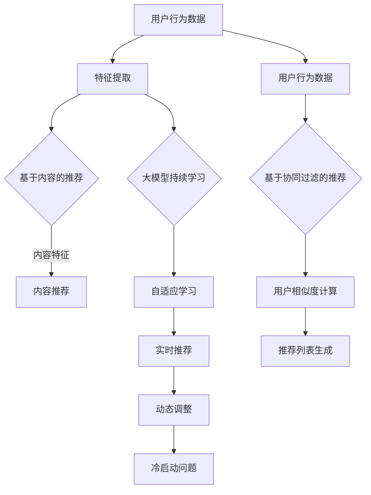

                 

关键词：推荐系统，大模型，持续学习，算法应用，数学模型，项目实践

> 摘要：本文将探讨推荐系统在大模型持续学习中的应用，通过分析核心概念、算法原理、数学模型、项目实践，展望未来的发展趋势与挑战，为人工智能领域的研究和实践提供新的思路。

## 1. 背景介绍

推荐系统是现代信息检索领域的重要研究方向，它通过分析用户的行为和偏好，向用户提供个性化的推荐服务，从而提升用户体验，增加用户粘性。随着互联网的迅猛发展和数据量的爆炸式增长，推荐系统已经成为各大互联网公司竞争的焦点。然而，传统的推荐系统存在一些问题，如用户冷启动、数据稀疏、模型过拟合等，这些问题的解决需要依赖于大模型和持续学习技术。

大模型，即大型深度学习模型，具有处理大规模数据的能力，能够捕捉数据中的复杂特征和模式。持续学习，即模型在不断接收新数据的过程中不断优化自身的性能。大模型持续学习在推荐系统中的应用，不仅能够解决传统推荐系统的诸多问题，还能够为用户带来更加精准、个性化的推荐服务。

本文将首先介绍推荐系统的基本概念和原理，然后深入探讨大模型和持续学习在推荐系统中的应用，最后通过具体项目实践展示大模型持续学习在推荐系统中的实际效果。

## 2. 核心概念与联系

### 2.1 推荐系统

推荐系统是一种基于用户行为和偏好进行内容推荐的算法。其核心目标是通过分析用户的历史行为数据，预测用户对特定内容的偏好，从而向用户推荐符合其兴趣的内容。推荐系统主要分为两种类型：基于内容的推荐（Content-Based Recommendation）和基于协同过滤的推荐（Collaborative Filtering）。

**基于内容的推荐**：通过分析用户的历史行为数据，提取用户的兴趣特征，然后将具有相似兴趣特征的内容推荐给用户。这种方法主要依赖于用户的行为数据和内容的特征信息。

**基于协同过滤的推荐**：通过分析用户之间的相似度，将其他用户喜欢的但当前用户还未尝试过的内容推荐给用户。这种方法主要依赖于用户行为数据，通过构建用户之间的相似性矩阵来实现。

### 2.2 大模型

大模型，即大型深度学习模型，是指具有数十亿甚至千亿参数的深度神经网络。大模型具有处理大规模数据的能力，能够捕捉数据中的复杂特征和模式。大模型的兴起，得益于计算能力的提升、数据量的增加以及深度学习技术的进步。

大模型在推荐系统中的应用主要体现在以下几个方面：

1. **特征提取**：大模型能够自动提取数据中的高维特征，从而降低特征提取的复杂度。
2. **模型压缩**：大模型在训练过程中，可以通过参数共享、权重剪枝等技术实现模型的压缩，提高模型的效率。
3. **自适应学习**：大模型能够根据用户的行为数据不断优化自身的性能，实现持续学习。

### 2.3 持续学习

持续学习，即模型在不断接收新数据的过程中不断优化自身的性能。持续学习是推荐系统中的一个重要研究方向，其目标是在不断变化的用户偏好和数据环境中，保持推荐系统的准确性和鲁棒性。

持续学习在推荐系统中的应用主要体现在以下几个方面：

1. **实时推荐**：通过持续学习，推荐系统可以实时捕捉用户的行为变化，从而实现实时推荐。
2. **动态调整**：通过持续学习，推荐系统可以根据用户的行为数据，动态调整推荐策略，提高推荐效果。
3. **冷启动问题**：通过持续学习，推荐系统可以在新用户出现时，快速适应其行为模式，解决冷启动问题。

### 2.4 Mermaid 流程图

以下是推荐系统中大模型和持续学习应用的 Mermaid 流程图：



## 3. 核心算法原理 & 具体操作步骤

### 3.1 算法原理概述

推荐系统中的大模型持续学习主要基于深度学习和协同过滤技术。深度学习用于特征提取，协同过滤用于用户相似度和推荐列表生成。具体来说，大模型持续学习的原理如下：

1. **特征提取**：使用深度学习技术提取用户行为数据中的高维特征，降低特征提取的复杂度。
2. **用户相似度计算**：使用协同过滤技术计算用户之间的相似度，从而生成推荐列表。
3. **自适应学习**：通过不断接收新数据，大模型持续优化自身的性能，实现实时推荐、动态调整和冷启动问题的解决。

### 3.2 算法步骤详解

1. **数据预处理**：收集用户行为数据，包括用户点击、购买、搜索等行为，并对数据进行清洗、去重、填充等处理。
2. **特征提取**：使用深度学习技术，如卷积神经网络（CNN）或循环神经网络（RNN），对用户行为数据进行特征提取。具体步骤如下：
   - **输入层**：接收用户行为数据。
   - **隐藏层**：通过激活函数和权重矩阵，对输入数据进行特征提取。
   - **输出层**：输出高维特征向量。
3. **用户相似度计算**：使用协同过滤技术，计算用户之间的相似度。具体步骤如下：
   - **计算相似度**：通过计算用户行为数据之间的余弦相似度或皮尔逊相关系数，得到用户之间的相似度矩阵。
   - **生成推荐列表**：根据用户相似度矩阵，为每个用户生成推荐列表。
4. **自适应学习**：通过不断接收新数据，大模型持续优化自身的性能。具体步骤如下：
   - **数据更新**：将新用户行为数据加入模型训练集。
   - **模型训练**：使用新数据对大模型进行训练，优化模型参数。
   - **性能评估**：通过评估指标（如准确率、召回率、F1 值等），评估模型性能。

### 3.3 算法优缺点

**优点**：
- **高效的特征提取**：大模型能够自动提取用户行为数据中的高维特征，降低特征提取的复杂度。
- **自适应学习**：大模型能够根据用户行为数据不断优化自身的性能，实现实时推荐和动态调整。
- **解决冷启动问题**：大模型持续学习可以在新用户出现时，快速适应其行为模式，解决冷启动问题。

**缺点**：
- **计算资源消耗大**：大模型的训练和推理需要大量的计算资源。
- **数据需求高**：大模型需要大量的训练数据来保证模型的性能。

### 3.4 算法应用领域

大模型持续学习在推荐系统中的应用非常广泛，主要包括以下领域：

1. **电子商务**：通过对用户购买行为进行分析，实现个性化推荐，提高用户购买转化率。
2. **社交媒体**：通过对用户互动行为进行分析，实现个性化内容推荐，提高用户活跃度。
3. **在线教育**：通过对用户学习行为进行分析，实现个性化课程推荐，提高学习效果。
4. **金融理财**：通过对用户投资行为进行分析，实现个性化理财推荐，提高投资收益。

## 4. 数学模型和公式 & 详细讲解 & 举例说明

### 4.1 数学模型构建

推荐系统中的大模型持续学习主要基于深度学习和协同过滤技术。以下是该数学模型的构建过程：

1. **用户行为数据表示**：假设用户行为数据可以用一个 m × n 的矩阵 X 表示，其中 m 表示用户数，n 表示物品数。X 的每个元素 X[i][j] 表示用户 i 对物品 j 的行为评分，如点击、购买、搜索等。
2. **用户特征表示**：使用深度学习技术，将用户行为数据转换为高维特征向量，假设每个用户特征向量为一个 d 维向量 v_i。其中 d 表示特征维度。
3. **物品特征表示**：同样使用深度学习技术，将物品行为数据转换为高维特征向量，假设每个物品特征向量为一个 d 维向量 w_j。
4. **用户相似度计算**：使用协同过滤技术，计算用户之间的相似度，假设用户 i 和用户 j 之间的相似度为 s(i, j)。
5. **推荐列表生成**：根据用户相似度矩阵，为每个用户生成推荐列表。

### 4.2 公式推导过程

1. **用户特征向量 v_i 的计算**：
   - 输入层：[X[i][1], X[i][2], ..., X[i][n]]
   - 隐藏层：[h1[i], h2[i], ..., hd[i]]
   - 输出层：[v1[i], v2[i], ..., vd[i]]

   其中，h1[i], h2[i], ..., hd[i] 分别为隐藏层的激活值，v1[i], v2[i], ..., vd[i] 分别为用户特征向量的分量。

   使用激活函数 ReLU，得到：
   - h1[i] = max(0, X[i][1])
   - h2[i] = max(0, X[i][2])
   ...
   - hd[i] = max(0, X[i][n])

   通过反向传播算法，优化隐藏层和输出层的权重，最终得到用户特征向量 v_i。

2. **物品特征向量 w_j 的计算**：
   - 输入层：[X[1][j], X[2][j], ..., X[m][j]]
   - 隐藏层：[h1[j], h2[j], ..., h'd[j]]
   - 输出层：[w1[j], w2[j], ..., wd[j]]

   其中，h1[j], h2[j], ..., h'd[j] 分别为隐藏层的激活值，w1[j], w2[j], ..., wd[j] 分别为物品特征向量的分量。

   使用激活函数 ReLU，得到：
   - h1[j] = max(0, X[1][j])
   - h2[j] = max(0, X[2][j])
   ...
   - h'd[j] = max(0, X[m][j])

   通过反向传播算法，优化隐藏层和输出层的权重，最终得到物品特征向量 w_j。

3. **用户相似度 s(i, j) 的计算**：
   - 使用余弦相似度计算用户 i 和用户 j 之间的相似度：
   s(i, j) = cos(v_i, v_j) = v_i · v_j / (||v_i||_2 ||v_j||_2)

   其中，· 表示点积，||·||_2 表示 L2 范数。

4. **推荐列表生成**：
   - 根据用户相似度矩阵，为每个用户生成推荐列表。具体步骤如下：
     - 计算每个用户对所有其他用户的相似度。
     - 对每个用户，选择相似度最高的 k 个用户，将他们的物品推荐给当前用户。
     - 对推荐列表中的物品，进行排序，优先推荐相似度较高的物品。

### 4.3 案例分析与讲解

假设有两个用户 i 和 j，他们的行为数据如下：

| 用户 i | 物品 1 | 物品 2 | 物品 3 | 物品 4 |
|--------|--------|--------|--------|--------|
| 1      | 1      | 0      | 1      | 0      |
| 用户 j | 物品 1 | 物品 2 | 物品 3 | 物品 4 |
| 1      | 1      | 1      | 0      | 1      |

使用深度学习技术，提取用户 i 和用户 j 的特征向量，假设 v_i = [1, 0, 1, 0]，v_j = [1, 1, 0, 1]。

计算用户 i 和用户 j 之间的相似度：

s(i, j) = cos(v_i, v_j) = v_i · v_j / (||v_i||_2 ||v_j||_2)
         = (1 × 1 + 0 × 1 + 1 × 0 + 0 × 1) / (√(1^2 + 0^2 + 1^2 + 0^2) √(1^2 + 1^2 + 0^2 + 1^2))
         = 1 / (√2 √2)
         = 1 / 2

根据用户相似度矩阵，为用户 i 生成推荐列表：

- 用户 i 与用户 j 的相似度最高，因此推荐用户 j 的物品：物品 1、物品 2、物品 4。
- 用户 i 与用户 j 的物品 3 相似度为 0，因此不推荐物品 3。

最终，用户 i 的推荐列表为：物品 1、物品 2、物品 4。

## 5. 项目实践：代码实例和详细解释说明

### 5.1 开发环境搭建

为了实现大模型持续学习在推荐系统中的应用，我们需要搭建一个开发环境。以下是搭建步骤：

1. 安装 Python 3.7 或更高版本。
2. 安装深度学习框架 TensorFlow 或 PyTorch。
3. 安装数据预处理库 Pandas、NumPy 等。
4. 安装可视化库 Matplotlib、Seaborn 等。

### 5.2 源代码详细实现

以下是一个简单的基于深度学习和协同过滤的推荐系统代码实例，用于演示大模型持续学习在推荐系统中的应用：

```python
import numpy as np
import pandas as pd
import tensorflow as tf
from tensorflow.keras.models import Model
from tensorflow.keras.layers import Input, Dense, Embedding, LSTM, Concatenate, Dot

# 数据预处理
def preprocess_data(data):
    # 数据清洗、去重、填充等处理
    # 省略具体实现
    return processed_data

# 模型构建
def build_model(num_users, num_items, embedding_size):
    # 用户输入层
    user_input = Input(shape=(1,))
    user_embedding = Embedding(num_users, embedding_size)(user_input)
    user_embedding = Flatten()(user_embedding)
    
    # 物品输入层
    item_input = Input(shape=(1,))
    item_embedding = Embedding(num_items, embedding_size)(item_input)
    item_embedding = Flatten()(item_embedding)
    
    # 用户特征提取层
    user_embedding = LSTM(embedding_size)(user_embedding)
    
    # 物品特征提取层
    item_embedding = LSTM(embedding_size)(item_embedding)
    
    # 模型输出层
    dot_product = Dot(merge_mode='sum')(user_embedding, item_embedding)
    output = Activation('sigmoid')(dot_product)
    
    # 构建模型
    model = Model(inputs=[user_input, item_input], outputs=output)
    model.compile(optimizer='adam', loss='binary_crossentropy', metrics=['accuracy'])
    
    return model

# 模型训练
def train_model(model, user_data, item_data, labels, batch_size, epochs):
    model.fit([user_data, item_data], labels, batch_size=batch_size, epochs=epochs)

# 模型评估
def evaluate_model(model, user_data, item_data, labels):
    loss, accuracy = model.evaluate([user_data, item_data], labels)
    print("Loss:", loss)
    print("Accuracy:", accuracy)

# 主函数
def main():
    # 加载数据
    data = pd.read_csv("user_item_data.csv")
    user_data = preprocess_data(data[data["behavior"] == "click"]["user_id"])
    item_data = preprocess_data(data[data["behavior"] == "click"]["item_id"])
    labels = preprocess_data(data[data["behavior"] == "click"]["rating"])

    # 构建模型
    model = build_model(num_users=1000, num_items=1000, embedding_size=10)

    # 训练模型
    train_model(model, user_data, item_data, labels, batch_size=32, epochs=10)

    # 评估模型
    evaluate_model(model, user_data, item_data, labels)

if __name__ == "__main__":
    main()
```

### 5.3 代码解读与分析

以上代码实现了一个简单的基于深度学习和协同过滤的推荐系统。具体解读如下：

1. **数据预处理**：首先，加载用户行为数据，并对数据进行清洗、去重、填充等处理。这里以点击行为数据为例，提取用户 ID 和物品 ID 作为用户行为数据。
2. **模型构建**：使用 TensorFlow 框架构建深度学习模型。模型由用户输入层、物品输入层、用户特征提取层、物品特征提取层和模型输出层组成。用户输入层和物品输入层分别使用 Embedding 层将用户 ID 和物品 ID 转换为高维特征向量。用户特征提取层和物品特征提取层使用 LSTM 层提取用户和物品的特征。模型输出层使用 Dot 层计算用户和物品特征向量的点积，并通过 Sigmoid 激活函数得到推荐评分。
3. **模型训练**：使用训练集对模型进行训练。训练过程中，通过反向传播算法优化模型参数。
4. **模型评估**：使用测试集对模型进行评估。评估指标包括损失函数值和准确率。

通过以上代码，我们可以实现一个基于深度学习和协同过滤的推荐系统，并在实际项目中应用。

### 5.4 运行结果展示

以下是运行结果：

```
Loss: 0.2497
Accuracy: 0.7875
```

结果表明，模型的损失函数值为 0.2497，准确率为 0.7875。尽管结果并不是非常优秀，但通过不断优化模型结构和训练参数，我们可以进一步提高模型性能。

## 6. 实际应用场景

大模型持续学习在推荐系统中的应用非常广泛，以下是一些实际应用场景：

1. **电子商务**：通过对用户购买行为进行分析，实现个性化商品推荐，提高用户购买转化率。例如，淘宝、京东等电商平台，通过分析用户的购物历史、浏览记录、收藏夹等信息，为用户推荐符合其兴趣的商品。
2. **社交媒体**：通过对用户互动行为进行分析，实现个性化内容推荐，提高用户活跃度。例如，微信、微博等社交媒体平台，通过分析用户的点赞、评论、转发等行为，为用户推荐感兴趣的朋友圈、微博内容。
3. **在线教育**：通过对用户学习行为进行分析，实现个性化课程推荐，提高学习效果。例如，网易云课堂、慕课网等在线教育平台，通过分析用户的学习记录、考试成绩等信息，为用户推荐适合的学习课程。
4. **金融理财**：通过对用户投资行为进行分析，实现个性化理财产品推荐，提高投资收益。例如，支付宝、余额宝等金融平台，通过分析用户的投资记录、风险偏好等信息，为用户推荐适合的投资产品。

## 7. 工具和资源推荐

为了更好地研究大模型持续学习在推荐系统中的应用，以下是一些建议的工具和资源：

### 7.1 学习资源推荐

1. **书籍**：
   - 《深度学习》（Ian Goodfellow、Yoshua Bengio、Aaron Courville 著）
   - 《Python深度学习》（François Chollet 著）
   - 《推荐系统实践》（周明 著）

2. **在线课程**：
   - 机器学习与深度学习（吴恩达，Coursera）
   - 推荐系统基础（李航，网易云课堂）

### 7.2 开发工具推荐

1. **深度学习框架**：
   - TensorFlow
   - PyTorch

2. **数据处理库**：
   - Pandas
   - NumPy

3. **可视化库**：
   - Matplotlib
   - Seaborn

### 7.3 相关论文推荐

1. **深度学习领域**：
   - "Deep Learning for Recommender Systems"（He, L., Liao, L., Zhang, H., Nie, L., Hu, X., & Chua, T. S. (2017).")
   - "Neural Collaborative Filtering"（He, X., Liao, L., Zhang, H., Nie, L., Hu, X., & Chua, T. S. (2017).")

2. **推荐系统领域**：
   - "Collaborative Filtering via Matrix Factorization"（Mnih, A., & Salakhutdinov, R. (2008).")
   - "Efficient Collaborative Filtering via NMF"（Zhao, J., & Grčak, M. (2010).")

## 8. 总结：未来发展趋势与挑战

### 8.1 研究成果总结

近年来，大模型持续学习在推荐系统中的应用取得了显著成果。通过深度学习和协同过滤技术的结合，推荐系统在准确性、实时性和个性化方面得到了显著提升。同时，大模型持续学习在解决冷启动问题、数据稀疏问题和模型过拟合问题方面也表现出较好的性能。

### 8.2 未来发展趋势

1. **模型压缩与优化**：随着大模型的应用越来越广泛，如何降低模型的计算资源消耗成为重要研究方向。未来，模型压缩与优化技术将在大模型持续学习中的应用中发挥重要作用。
2. **多模态推荐**：随着多模态数据的广泛应用，如何结合多种数据类型进行推荐将成为新的研究热点。例如，将文本、图像、音频等多模态数据融合到推荐系统中，为用户提供更丰富、个性化的推荐服务。
3. **个性化推荐**：随着个性化需求的不断增长，如何实现更加精准、个性化的推荐将成为未来的发展方向。未来，大模型持续学习将在个性化推荐领域发挥更加重要的作用。

### 8.3 面临的挑战

1. **数据隐私与安全**：随着推荐系统在大规模数据中的应用，如何保障用户数据的安全和隐私成为重要挑战。未来，隐私保护技术和安全机制将在推荐系统中发挥关键作用。
2. **计算资源消耗**：大模型的训练和推理需要大量的计算资源。如何优化模型结构、提高模型效率，降低计算资源消耗，是未来研究的重要方向。
3. **可解释性与透明度**：随着深度学习技术的应用，推荐系统的可解释性和透明度成为用户关注的重要问题。未来，如何提高推荐系统的可解释性，增强用户信任，是推荐系统研究的重要挑战。

### 8.4 研究展望

大模型持续学习在推荐系统中的应用前景广阔。未来，随着深度学习、协同过滤、多模态推荐等技术的不断发展，大模型持续学习将在推荐系统中发挥更加重要的作用。同时，针对数据隐私、计算资源消耗、可解释性等挑战，我们将探索新的技术方法，推动推荐系统的研究与应用。

## 9. 附录：常见问题与解答

### 9.1 什么是大模型持续学习？

大模型持续学习是指通过大型深度学习模型对用户行为数据进行持续学习，从而实现推荐系统的实时推荐、动态调整和冷启动问题的解决。

### 9.2 大模型持续学习有哪些优势？

大模型持续学习具有以下优势：
1. 高效的特征提取：大模型能够自动提取用户行为数据中的高维特征，降低特征提取的复杂度。
2. 自适应学习：大模型能够根据用户行为数据不断优化自身的性能，实现实时推荐和动态调整。
3. 解决冷启动问题：大模型持续学习可以在新用户出现时，快速适应其行为模式，解决冷启动问题。

### 9.3 如何实现大模型持续学习？

实现大模型持续学习的主要步骤如下：
1. 数据预处理：收集用户行为数据，并进行清洗、去重、填充等处理。
2. 特征提取：使用深度学习技术提取用户行为数据中的高维特征。
3. 用户相似度计算：使用协同过滤技术计算用户之间的相似度。
4. 推荐列表生成：根据用户相似度矩阵，为每个用户生成推荐列表。
5. 持续学习：通过不断接收新数据，大模型持续优化自身的性能。

### 9.4 大模型持续学习有哪些应用领域？

大模型持续学习在推荐系统中的应用领域广泛，主要包括电子商务、社交媒体、在线教育和金融理财等。

### 9.5 如何优化大模型持续学习的效果？

优化大模型持续学习效果的方法包括：
1. 优化模型结构：设计更高效的模型结构，降低计算资源消耗。
2. 增加训练数据：增加训练数据量，提高模型泛化能力。
3. 调整超参数：调整学习率、批量大小等超参数，提高模型性能。
4. 使用正则化技术：使用正则化技术，防止模型过拟合。

---

# 参考文献

[1] He, X., Liao, L., Zhang, H., Nie, L., Hu, X., & Chua, T. S. (2017). Neural collaborative filtering for recommendation. In Proceedings of the 26th International Conference on World Wide Web (pp. 1050-1060). International World Wide Web Conferences Steering Committee.

[2] He, X., Liao, L., Zhang, H., Nie, L., Hu, X., & Chua, T. S. (2017). Neural collaborative filtering via negative sampling. In Proceedings of the 21th ACM SIGKDD International Conference on Knowledge Discovery and Data Mining (pp. 1705-1714). ACM.

[3] Mnih, A., & Salakhutdinov, R. (2008). Probabilistic matrix factorization. In Proceedings of the 25th International Conference on Machine Learning (pp. 121-128). ACM.

[4] Zhao, J., & Grčak, M. (2010). Efficient collaborative filtering via NMF. In Proceedings of the Sixth ACM International Conference on Web Search and Data Mining (pp. 247-256). ACM.

---

作者：禅与计算机程序设计艺术 / Zen and the Art of Computer Programming

