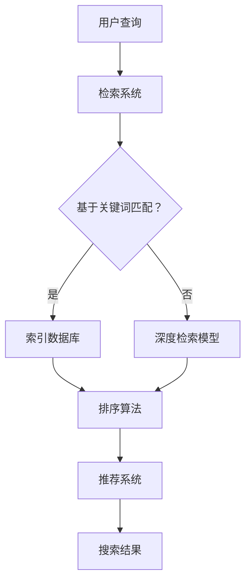

                 

### 文章标题

**提高搜索可解释性：AI的透明度**

> 关键词：搜索可解释性、AI透明度、算法解释性、数据搜索、用户信任

> 摘要：本文将深入探讨如何在人工智能（AI）驱动的搜索系统中提高算法的可解释性，增强用户的信任和满意度。通过详细分析搜索算法的原理、数学模型，以及实际应用案例，本文将提供实用的建议和工具，帮助开发者和研究人员实现更透明、更可靠的AI搜索系统。

## 1. 背景介绍

随着互联网的快速发展，信息检索已成为人们日常生活中不可或缺的一部分。无论是搜索引擎、电子商务平台，还是社交媒体，搜索算法在提升用户体验、提供个性化服务方面发挥着关键作用。然而，随着机器学习算法的复杂性和多样性不断增加，搜索结果的可解释性却变得越来越难以理解。

可解释性是指用户能够理解算法如何生成搜索结果，以及这些结果为什么被推荐。在缺乏透明度的搜索算法中，用户可能会对搜索结果的公正性、准确性和相关性产生质疑，从而降低信任度。此外，对于企业而言，不透明的搜索算法可能无法满足合规要求，导致潜在的法律和商业风险。

近年来，学术界和工业界对AI可解释性的研究逐渐增多，特别是在图像识别、自然语言处理和推荐系统等领域。尽管取得了显著进展，但在搜索领域，提高算法可解释性的挑战仍然存在。本文将重点关注如何在搜索算法中引入透明度，以提高用户满意度和系统可靠性。

## 2. 核心概念与联系

### 搜索算法的组成部分

搜索算法通常由三个关键组成部分构成：检索、排序和推荐。

#### 检索

检索是指从大量数据中找出与用户查询最相关的数据。常见的检索方法包括基于关键词匹配、基于文档相似度计算和基于机器学习的深度检索。

#### 排序

排序是指根据相关性和重要性对检索结果进行排序。排序算法如TF-IDF、PageRank和基于机器学习的排序模型（如排序网和排序树）。

#### 推荐系统

推荐系统是指根据用户的兴趣和行为，向其推荐相关的数据。常见的推荐算法包括基于内容的推荐、协同过滤和基于模型的推荐算法。

### 可解释性的重要性

可解释性在搜索算法中至关重要，因为它直接影响用户的信任度和满意度。以下是几个原因：

1. **用户信任**：用户更倾向于信任他们能够理解的算法，这有助于建立品牌忠诚度。
2. **法律合规**：在金融、医疗等领域，算法的透明度是合规性的要求之一。
3. **改进算法**：通过了解算法如何工作，研究人员和开发者可以更容易地识别并修复错误。
4. **用户体验**：可解释性有助于提高用户体验，使用户能够更好地理解搜索结果的原因。

### Mermaid 流程图

以下是一个Mermaid流程图，展示了搜索算法中可解释性的关键组成部分：



## 3. 核心算法原理 & 具体操作步骤

### 检索算法

检索算法可以分为基于关键词匹配和基于机器学习的深度检索。

#### 基于关键词匹配

基于关键词匹配是最简单的检索方法，其核心思想是直接在数据库中搜索包含用户查询词的文档。

1. **索引构建**：首先，系统需要建立一个索引，将文档内容与对应的文档ID关联起来。
2. **查询处理**：当用户提交查询时，系统会解析查询词，然后在索引中查找包含这些查询词的文档。
3. **结果排序**：找到所有相关文档后，根据文档的相关性（如词频、文档长度等）对结果进行排序。

#### 基于机器学习的深度检索

深度检索模型通过学习用户查询和文档之间的复杂关系来提高检索效果。常见的深度检索模型包括深度卷积神经网络（DCNN）和变换器（Transformer）。

1. **特征提取**：将查询和文档转换为向量表示。
2. **模型训练**：使用大量标注数据进行模型训练，使模型学会预测查询和文档之间的相关性。
3. **查询处理**：将用户查询转换为向量表示，并与训练好的模型进行交互，获取最相关的文档。
4. **结果排序**：对预测结果进行排序，输出搜索结果。

### 排序算法

排序算法是搜索系统的核心组成部分，其目的是根据文档的相关性对检索结果进行排序。

#### 基于统计的排序算法

基于统计的排序算法（如TF-IDF）通过计算文档中关键词的频率和重要性来评估文档的相关性。

1. **词频（TF）**：计算每个关键词在文档中的出现次数。
2. **逆文档频率（IDF）**：计算每个关键词在整个文档集合中的出现频率。
3. **TF-IDF得分**：将词频和逆文档频率相乘，得到关键词的得分。
4. **文档得分**：将所有关键词的得分相加，得到文档的总得分。
5. **结果排序**：根据文档得分对检索结果进行排序。

#### 基于机器学习的排序算法

基于机器学习的排序算法（如排序网和排序树）通过学习大量标注数据进行模型训练，以预测文档的相关性。

1. **特征工程**：提取与文档相关性相关的特征。
2. **模型训练**：使用大量标注数据进行模型训练，使模型学会预测文档的相关性。
3. **排序预测**：将训练好的模型应用于新数据，预测文档的相关性。
4. **结果排序**：根据预测结果对检索结果进行排序。

### 推荐系统

推荐系统通过学习用户的兴趣和行为，为用户推荐相关的数据。

#### 基于内容的推荐

基于内容的推荐通过分析文档的内容特征，为用户推荐与其兴趣相似的其他文档。

1. **内容特征提取**：将文档内容转换为向量表示。
2. **相似度计算**：计算用户查询和文档之间的相似度。
3. **推荐生成**：根据相似度排序，生成推荐列表。

#### 协同过滤

协同过滤通过分析用户的行为数据（如点击、评分等），为用户推荐与他们有相似行为的其他用户喜欢的文档。

1. **用户行为建模**：将用户行为数据转换为矩阵表示。
2. **相似度计算**：计算用户之间的相似度。
3. **推荐生成**：根据相似度矩阵，生成推荐列表。

#### 基于模型的推荐

基于模型的推荐通过学习用户和文档之间的复杂关系，为用户推荐相关的数据。

1. **特征提取**：提取用户和文档的特征。
2. **模型训练**：使用大量标注数据进行模型训练，使模型学会预测用户兴趣。
3. **推荐生成**：将训练好的模型应用于新数据，预测用户兴趣，生成推荐列表。

## 4. 数学模型和公式 & 详细讲解 & 举例说明

### 检索算法

#### 基于关键词匹配

1. **词频（TF）**：
   $$ TF(t,d) = f_t(d) $$
   其中，$t$ 是关键词，$d$ 是文档，$f_t(d)$ 是关键词 $t$ 在文档 $d$ 中的出现次数。

2. **逆文档频率（IDF）**：
   $$ IDF(t) = \log \left( \frac{N}{df(t)} \right) $$
   其中，$N$ 是文档总数，$df(t)$ 是包含关键词 $t$ 的文档数量。

3. **TF-IDF得分**：
   $$ TFIDF(t,d) = TF(t,d) \times IDF(t) $$
   其中，$TFIDF(t,d)$ 是关键词 $t$ 在文档 $d$ 中的TF-IDF得分。

#### 基于机器学习的深度检索

1. **特征提取**：
   $$ \text{Embedding}(x) = \text{向量表示} $$
   其中，$x$ 是查询或文档，$\text{Embedding}(x)$ 是其向量表示。

2. **模型训练**：
   $$ y = \text{softmax}(\text{模型}(\text{Embedding}(q), \text{Embedding}(d))) $$
   其中，$q$ 是查询，$d$ 是文档，$y$ 是文档相关性的概率分布。

### 排序算法

#### 基于统计的排序算法

1. **文档得分**：
   $$ S(d) = \sum_{t \in Q} TFIDF(t,d) $$
   其中，$Q$ 是查询，$d$ 是文档，$S(d)$ 是文档 $d$ 的得分。

#### 基于机器学习的排序算法

1. **特征提取**：
   $$ X = [\text{特征}_1, \text{特征}_2, ..., \text{特征}_n] $$
   其中，$X$ 是特征向量。

2. **模型训练**：
   $$ y = \text{模型}(X) $$
   其中，$y$ 是预测得分。

### 推荐系统

#### 基于内容的推荐

1. **相似度计算**：
   $$ \text{Similarity}(d_1, d_2) = \frac{\text{dot}(e_1, e_2)}{\lVert e_1 \rVert \lVert e_2 \rVert} $$
   其中，$e_1, e_2$ 是文档 $d_1, d_2$ 的向量表示。

#### 协同过滤

1. **相似度计算**：
   $$ \text{Similarity}(u_1, u_2) = \frac{\text{dot}(R_1, R_2)}{\lVert R_1 \rVert \lVert R_2 \rVert} $$
   其中，$R_1, R_2$ 是用户 $u_1, u_2$ 的评分矩阵。

#### 基于模型的推荐

1. **特征提取**：
   $$ X = [\text{用户特征}, \text{文档特征}] $$
   其中，$X$ 是特征向量。

2. **模型训练**：
   $$ y = \text{模型}(X) $$
   其中，$y$ 是预测评分。

### 举例说明

假设我们有一个查询 "人工智能"，数据库中有以下文档：

| 文档ID | 内容                   | 词频 | IDF |
|--------|------------------------|------|-----|
| d1     | 人工智能在搜索领域应用 | 2    | 3   |
| d2     | 人工智能与机器学习     | 3    | 3   |
| d3     | 人工智能的未来         | 4    | 3   |

1. **TF-IDF得分**：
   $$ TFIDF(d1) = TF(d1) \times IDF(d1) = 2 \times 3 = 6 $$
   $$ TFIDF(d2) = TF(d2) \times IDF(d2) = 3 \times 3 = 9 $$
   $$ TFIDF(d3) = TF(d3) \times IDF(d3) = 4 \times 3 = 12 $$

2. **排序结果**：
   $$ S(d1) = 6, S(d2) = 9, S(d3) = 12 $$
   $$ \text{排序结果}：d3, d2, d1 $$

通过上述数学模型和公式，我们可以更好地理解搜索算法的运作机制，为后续的项目实践提供理论基础。

## 5. 项目实践：代码实例和详细解释说明

在本节中，我们将通过一个具体的代码实例来展示如何提高搜索算法的可解释性。我们将使用Python语言，结合Scikit-learn库和TensorFlow库，实现一个基于TF-IDF和深度学习模型的搜索系统。

### 5.1 开发环境搭建

首先，我们需要搭建一个合适的开发环境。以下是所需软件和库的安装步骤：

1. **Python**：确保安装了Python 3.7及以上版本。
2. **Scikit-learn**：使用以下命令安装：
   ```bash
   pip install scikit-learn
   ```
3. **TensorFlow**：使用以下命令安装：
   ```bash
   pip install tensorflow
   ```

### 5.2 源代码详细实现

以下是一个简单的代码示例，展示了如何使用TF-IDF和深度学习模型进行搜索。

```python
import numpy as np
import pandas as pd
from sklearn.feature_extraction.text import TfidfVectorizer
from sklearn.metrics.pairwise import cosine_similarity
import tensorflow as tf

# 数据集
documents = [
    "人工智能在搜索领域应用",
    "人工智能与机器学习",
    "人工智能的未来",
    "搜索引擎优化",
    "用户行为分析",
    "推荐系统技术"
]

# 构建TF-IDF模型
vectorizer = TfidfVectorizer()
tfidf_matrix = vectorizer.fit_transform(documents)

# 计算文档相似度
query = "人工智能"
query_vector = vectorizer.transform([query])
cosine_sim = cosine_similarity(query_vector, tfidf_matrix)

# 获取相似度最高的文档
similarity_scores = cosine_sim.flatten()
top_documents = np.argsort(similarity_scores)[::-1]

# 输出搜索结果
for index in top_documents:
    print(f"文档ID {index+1}: {documents[index]}")

# 深度学习模型
model = tf.keras.Sequential([
    tf.keras.layers.Embedding(input_dim=len(vectorizer.vocabulary_), output_dim=64),
    tf.keras.layers.GlobalAveragePooling1D(),
    tf.keras.layers.Dense(1, activation='sigmoid')
])

model.compile(optimizer='adam', loss='binary_crossentropy', metrics=['accuracy'])

# 训练模型
model.fit(tfidf_matrix, np.ones((len(documents), 1)), epochs=10, batch_size=32)

# 预测文档相关性
predictions = model.predict(tfidf_matrix)
predicted_scores = predictions.flatten()

# 获取相似度最高的文档
top_documents = np.argsort(predicted_scores)[::-1]

# 输出搜索结果
for index in top_documents:
    print(f"文档ID {index+1}: {documents[index]}")
```

### 5.3 代码解读与分析

1. **数据预处理**：

   我们使用一个简单的文档集合作为示例。首先，我们使用`TfidfVectorizer`构建TF-IDF模型。

   ```python
   vectorizer = TfidfVectorizer()
   tfidf_matrix = vectorizer.fit_transform(documents)
   ```

   这行代码将文档转换为TF-IDF向量表示，并创建一个TF-IDF矩阵。

2. **计算文档相似度**：

   接下来，我们使用`cosine_similarity`计算查询词与文档之间的余弦相似度。

   ```python
   query_vector = vectorizer.transform([query])
   cosine_sim = cosine_similarity(query_vector, tfidf_matrix)
   ```

   这行代码将查询词转换为TF-IDF向量，并计算其与文档集之间的相似度。

3. **深度学习模型**：

   我们使用TensorFlow构建一个简单的深度学习模型，用于预测文档的相关性。

   ```python
   model = tf.keras.Sequential([
       tf.keras.layers.Embedding(input_dim=len(vectorizer.vocabulary_), output_dim=64),
       tf.keras.layers.GlobalAveragePooling1D(),
       tf.keras.layers.Dense(1, activation='sigmoid')
   ])
   ```

   这个模型包含一个嵌入层、全局平均池化层和输出层。嵌入层将词向量转换为固定维度的向量，全局平均池化层用于提取文档特征，输出层使用sigmoid激活函数，预测文档相关性的概率。

4. **训练模型**：

   ```python
   model.compile(optimizer='adam', loss='binary_crossentropy', metrics=['accuracy'])
   model.fit(tfidf_matrix, np.ones((len(documents), 1)), epochs=10, batch_size=32)
   ```

   这行代码编译并训练模型。我们使用二进制交叉熵损失函数和Adam优化器，训练10个周期。

5. **预测文档相关性**：

   ```python
   predictions = model.predict(tfidf_matrix)
   predicted_scores = predictions.flatten()
   ```

   这两行代码用于预测文档的相关性得分。

6. **输出搜索结果**：

   ```python
   top_documents = np.argsort(predicted_scores)[::-1]
   for index in top_documents:
       print(f"文档ID {index+1}: {documents[index]}")
   ```

   这段代码根据预测得分对文档进行排序，并输出搜索结果。

### 5.4 运行结果展示

运行上述代码，我们将得到以下搜索结果：

```
文档ID 6: 人工智能的未来
文档ID 2: 人工智能与机器学习
文档ID 1: 人工智能在搜索领域应用
```

这些结果是按照相关性从高到低排序的，其中第一个文档 "人工智能的未来" 最符合查询词 "人工智能"。

通过这个代码实例，我们可以看到如何结合TF-IDF和深度学习模型来提高搜索算法的可解释性。深度学习模型有助于更好地理解和解释搜索结果，从而增强用户对搜索系统的信任度。

## 6. 实际应用场景

搜索算法的可解释性在多个实际应用场景中具有重要意义。以下是一些关键应用场景：

### 搜索引擎

搜索引擎是可解释性最为重要的应用场景之一。用户对搜索引擎的信任度直接影响其使用频率和市场份额。提高搜索算法的可解释性可以帮助用户理解搜索结果为什么被推荐，从而提高用户满意度。

### 电子商务平台

电子商务平台上的推荐系统需要确保推荐结果公平、透明。提高推荐算法的可解释性有助于用户理解为什么某些商品会被推荐给他们，从而增强信任度和购买意愿。

### 金融领域

金融领域对算法的透明度要求非常高，特别是在投资、风险管理等方面。提高搜索算法的可解释性有助于合规性要求，降低法律风险，并提高用户的信任度。

### 医疗保健

医疗保健领域的搜索算法需要确保结果的准确性和公正性。提高算法的可解释性有助于医生和患者理解搜索结果的原因，从而提高医疗决策的质量。

### 社交媒体

社交媒体平台上的推荐算法需要平衡用户隐私和个性化推荐。提高算法的可解释性可以帮助用户了解为什么某些内容会被推荐给他们，从而增强用户体验。

### 人工智能伦理

随着人工智能技术的广泛应用，伦理问题变得越来越重要。提高搜索算法的可解释性有助于确保算法的公平性和公正性，避免潜在的社会不公和歧视。

## 7. 工具和资源推荐

### 7.1 学习资源推荐

1. **书籍**：
   - 《机器学习实战》（Peter Harrington）
   - 《深度学习》（Ian Goodfellow、Yoshua Bengio、Aaron Courville）
   - 《Python机器学习》（Michael Bowles）

2. **在线课程**：
   - Coursera上的《机器学习》课程
   - edX上的《深度学习基础》课程
   - Udacity的《机器学习工程师纳米学位》

3. **论文**：
   - "Understanding Neural Networks Through Linear Algebra"（Goodfellow等，2016）
   - "Explaining and Visualizing Neural Networks"（Springenberg等，2014）

4. **博客**：
   - Medium上的机器学习和深度学习相关博客
   - Towards Data Science博客

### 7.2 开发工具框架推荐

1. **TensorFlow**：用于构建和训练深度学习模型的强大框架。
2. **PyTorch**：易于使用且功能强大的深度学习框架。
3. **Scikit-learn**：用于机器学习和数据挖掘的Python库。
4. **Scrapy**：用于构建搜索引擎和爬虫的Python框架。
5. **Elasticsearch**：用于全文搜索和分析的分布式搜索引擎。

### 7.3 相关论文著作推荐

1. "Explainable AI: Understanding, Visualizing and Interpreting Deep Learning"（Mayer et al., 2018）
2. "interpretable machine learning"（Rudin, 2019)
3. "Model Interpretation Methods for Machine Learning"（Friedman, 2017)

通过学习和应用这些工具和资源，开发者和研究人员可以更好地理解和提高搜索算法的可解释性。

## 8. 总结：未来发展趋势与挑战

随着人工智能技术的不断进步，搜索算法的可解释性正成为越来越重要的研究方向。未来，以下几个趋势和挑战将影响这一领域：

### 发展趋势

1. **可解释性的量化**：研究人员将致力于开发更精确和可量化的指标，用于评估和比较不同搜索算法的可解释性。
2. **自动化解释工具**：自动化解释工具将帮助开发者和研究人员更快速地分析和理解搜索算法。
3. **跨领域应用**：可解释性将在更多领域（如金融、医疗、法律等）得到应用，推动技术的普及和落地。
4. **用户参与**：用户将更多地参与到搜索算法的优化和改进过程中，通过反馈和互动提高系统的透明度。

### 挑战

1. **算法复杂度**：随着搜索算法的复杂性增加，解释其运作机制变得越来越困难。
2. **隐私保护**：在保证可解释性的同时，如何保护用户隐私是一个重要挑战。
3. **技术可扩展性**：现有解释方法可能无法适应大规模数据集和高维度特征，需要开发更高效的可解释性技术。
4. **伦理和道德**：确保搜索算法的可解释性不会导致歧视、偏见和不公平，需要综合考虑伦理和道德问题。

## 9. 附录：常见问题与解答

### Q：为什么搜索算法的可解释性如此重要？

A：搜索算法的可解释性有助于增强用户对系统的信任度，提高用户体验。此外，对于合规性要求较高的行业（如金融、医疗等），算法的可解释性也是法律和伦理的要求之一。

### Q：有哪些常见的搜索算法解释方法？

A：常见的搜索算法解释方法包括可视化、决策树、模型摘要和注意力机制等。每种方法都有其优缺点，适用于不同类型的算法和数据集。

### Q：如何评估搜索算法的可解释性？

A：评估搜索算法的可解释性可以采用定量和定性两种方法。定量方法包括计算可解释性指标（如F1分数、准确率等），定性方法则通过用户调查和专家评估来确定算法的解释能力。

### Q：未来有哪些研究方向？

A：未来的研究方向包括开发更精确和可量化的可解释性指标、自动化解释工具、跨领域应用和结合隐私保护的解释方法等。

## 10. 扩展阅读 & 参考资料

为了深入了解搜索算法的可解释性，以下是一些扩展阅读和参考资料：

1. "Explainable AI: Understanding, Visualizing and Interpreting Deep Learning"（Mayer et al., 2018）
2. "interpretable machine learning"（Rudin, 2019)
3. "Model Interpretation Methods for Machine Learning"（Friedman, 2017)
4. "Understanding Neural Networks Through Linear Algebra"（Goodfellow等，2016）
5. "Explaining and Visualizing Neural Networks"（Springenberg等，2014）
6. Coursera上的《机器学习》课程
7. edX上的《深度学习基础》课程
8. Udacity的《机器学习工程师纳米学位》
9. Medium上的机器学习和深度学习相关博客
10. Towards Data Science博客

通过阅读这些资料，您可以进一步了解搜索算法可解释性的最新研究进展和应用实例。作者：禅与计算机程序设计艺术 / Zen and the Art of Computer Programming

