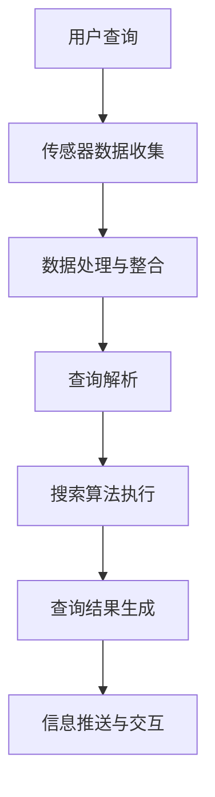

                 

### 1. 背景介绍

随着科技的发展，搜索引擎与可穿戴设备的结合正逐渐成为一个备受关注的新兴领域。首先，让我们简要回顾一下这两大技术的背景和发展历程。

#### 搜索引擎的历史与发展

搜索引擎的起源可以追溯到20世纪90年代，当时，互联网刚刚兴起，信息获取的难度较大。最早的搜索引擎如Yahoo、Lycos等，主要依靠人工分类网站链接来提供服务。随着互联网内容的爆发增长，1998年，谷歌（Google）推出了其革命性的搜索引擎，采用了基于页面的相关度排序算法（PageRank），使得搜索结果更加准确和可靠。谷歌的成功推动了搜索引擎技术的发展，随后，百度、Bing等搜索引擎也相继崛起。

在过去的二十年中，搜索引擎技术不断发展，包括自然语言处理（NLP）、机器学习（ML）和深度学习（DL）等前沿技术的应用，使得搜索引擎的功能日益强大，从简单的关键词搜索到复杂的语义理解、多语言翻译、智能问答等，极大地提高了信息检索的效率和用户体验。

#### 可穿戴设备的发展与普及

可穿戴设备的发展同样具有悠久的历史。最早的智能手表可以追溯到20世纪60年代，但真正意义上的可穿戴设备始于21世纪初。2004年，苹果公司推出了iPod Nano，搭载了简单的运动追踪功能，标志着可穿戴设备的起步。随后，2007年，苹果发布了iPhone，智能手机的普及带动了可穿戴设备市场的发展。

进入2010年代，随着物联网（IoT）、传感器技术和无线通信技术的发展，可穿戴设备逐渐成为人们日常生活的一部分。常见的可穿戴设备包括智能手表、健康监测器、智能手环、智能眼镜等，这些设备可以实时收集用户的健康数据、位置信息、运动数据等，并通过无线网络传输到云端进行分析和处理。

#### 搜索引擎与可穿戴设备的结合

随着可穿戴设备的普及，用户对信息检索的需求也在发生变化。传统的桌面搜索和移动搜索已经无法完全满足用户在可穿戴设备上的需求。因此，将搜索引擎与可穿戴设备结合成为一个新的研究方向。

首先，可穿戴设备具有便携性和实时性的优势，使得用户可以随时随地获取信息。其次，可穿戴设备可以提供更丰富的用户数据，如地理位置、运动轨迹、心率等，这些数据可以为搜索引擎提供更精准的个性化搜索服务。

此外，随着智能语音助手和触控交互技术的发展，用户与搜索引擎的交互方式也在发生变革。在可穿戴设备上，语音交互和触控交互比传统的键盘和鼠标更加便捷，使得用户可以更轻松地进行信息检索。

总之，搜索引擎与可穿戴设备的结合不仅带来了新的技术和应用场景，也为用户提供了更加个性化和高效的信息检索体验。

### 2. 核心概念与联系

要深入探讨搜索引擎与可穿戴设备的结合，我们需要了解一些核心概念和技术，它们是这一领域发展的基础。

#### 搜索引擎技术

搜索引擎的核心是信息检索技术，主要包括以下几个关键组件：

1. **索引**：搜索引擎需要构建一个索引系统，将互联网上的海量信息按照一定的规则进行组织和存储。索引系统使得搜索引擎可以在极短的时间内定位到用户需要的信息。

2. **查询解析**：当用户输入查询请求时，搜索引擎需要对查询进行解析，将其转换为一个可处理的查询结构。这个过程包括分词、词性标注、查询重写等。

3. **排名算法**：搜索引擎使用各种排名算法来决定查询结果中各个网页的排序。早期的排名算法如PageRank，而现代搜索引擎则采用了更加复杂的算法，如基于深度学习的语义匹配算法。

4. **查询执行**：在确定了查询结果的排序后，搜索引擎需要从索引中提取相关信息，生成最终的查询结果。

#### 可穿戴设备技术

可穿戴设备的核心在于其硬件和软件技术，主要包括以下几个关键点：

1. **传感器**：可穿戴设备配备了各种传感器，如加速度计、陀螺仪、心率传感器等，这些传感器可以实时监测用户的身体状态和环境信息。

2. **数据处理**：可穿戴设备需要对采集到的传感器数据进行处理，提取有用的信息，并生成可视化数据或进行数据存储。

3. **通信技术**：为了实现数据传输，可穿戴设备需要使用无线通信技术，如蓝牙、Wi-Fi、NFC等。这些通信技术使得设备可以与智能手机、云端服务器等进行数据交换。

4. **用户交互**：可穿戴设备的用户交互主要通过触控屏幕、触控板、语音识别等方式进行。这些交互方式使得用户可以方便地与设备进行沟通和操作。

#### 搜索引擎与可穿戴设备的结合

将搜索引擎与可穿戴设备结合起来，可以看作是在两个技术领域的交叉点，通过以下几个方面实现：

1. **个性化搜索**：基于可穿戴设备采集的用户数据，如地理位置、运动轨迹、心率等，搜索引擎可以提供更加个性化的搜索结果。

2. **实时信息推送**：通过可穿戴设备的传感器和无线通信技术，搜索引擎可以实时获取用户的查询需求，并推送相关的信息。

3. **智能问答**：可穿戴设备的语音交互技术使得用户可以更加自然地与搜索引擎进行交互，实现智能问答功能。

4. **健康搜索**：可穿戴设备可以监测用户的健康状况，搜索引擎可以提供与健康相关的搜索结果，如医院信息、健康知识等。

#### Mermaid 流程图

为了更清晰地展示搜索引擎与可穿戴设备的结合过程，我们可以使用Mermaid流程图来描述。以下是一个简化的流程图示例：



在这个流程图中，用户查询通过可穿戴设备的传感器数据收集模块获取相关数据，经过数据处理与整合后，转化为可执行的查询请求。然后，查询解析模块对查询请求进行处理，搜索算法执行模块根据查询请求生成查询结果，最后，查询结果通过信息推送与交互模块反馈给用户。

通过这一系列的结合，搜索引擎与可穿戴设备不仅能够提供更加个性化和高效的服务，还能够开拓新的应用场景，为用户带来全新的体验。

### 3. 核心算法原理 & 具体操作步骤

在探讨了搜索引擎与可穿戴设备的结合背景和核心概念之后，接下来我们将详细讨论这一结合中的核心算法原理和具体操作步骤。这些算法和步骤是实现高效、个性化信息检索的关键。

#### 算法原理

搜索引擎与可穿戴设备结合的核心算法主要涉及以下几个方面：

1. **数据融合与处理**：可穿戴设备会实时收集大量的用户数据，如地理位置、运动轨迹、心率等。为了提高搜索的准确性，搜索引擎需要对这些数据进行融合和处理，提取有用的信息。

2. **个性化搜索**：基于用户历史数据和实时数据，搜索引擎可以生成个性化的搜索结果，提高用户的满意度。

3. **实时信息推送**：通过实时获取用户的查询需求和状态，搜索引擎可以及时推送相关的信息，满足用户的即时需求。

4. **语义理解与问答**：利用自然语言处理技术，搜索引擎可以理解用户的自然语言查询，并提供智能问答服务。

#### 具体操作步骤

以下是搜索引擎与可穿戴设备结合的核心算法的具体操作步骤：

**步骤1：数据收集与预处理**

- **传感器数据收集**：可穿戴设备通过内置的传感器（如GPS、加速度计、陀螺仪等）实时收集用户的地理位置、运动轨迹、心率等数据。

- **数据预处理**：对收集到的原始数据进行预处理，包括去噪、滤波、归一化等步骤，以提高数据的质量和准确性。

**步骤2：数据融合**

- **用户数据整合**：将来自不同传感器的数据整合在一起，形成统一的用户数据视图。

- **数据关联**：通过分析用户的行为模式和关系，将不同类型的用户数据进行关联，如地理位置与运动轨迹的关联、心率与活动类型的关联等。

**步骤3：个性化搜索**

- **用户历史数据分析**：分析用户的搜索历史、偏好设置等，构建用户画像。

- **实时数据结合**：将实时采集的用户数据与历史数据结合，生成个性化的搜索请求。

- **搜索结果排序**：根据用户的个性化需求，对搜索结果进行排序，优先展示与用户需求最为相关的结果。

**步骤4：实时信息推送**

- **实时查询监测**：通过可穿戴设备的传感器和无线通信技术，实时监测用户的查询需求。

- **信息推送**：根据用户的实时查询需求，推送相关的信息，如天气预报、健康建议等。

**步骤5：语义理解与问答**

- **自然语言处理**：利用自然语言处理技术，对用户的自然语言查询进行语义分析，理解查询意图。

- **智能问答**：根据语义分析结果，提供智能问答服务，如回答用户的健康问题、提供路线导航等。

#### 技术实现

为了实现上述算法，需要使用一系列的技术工具和框架：

- **数据采集与预处理**：使用Python等编程语言，结合传感器API和数据处理库（如Pandas、NumPy等），进行数据的采集和预处理。

- **数据融合**：使用图数据库（如Neo4j）或分布式数据处理框架（如Apache Spark）来实现数据的融合和关联。

- **个性化搜索**：使用机器学习和深度学习算法（如TensorFlow、PyTorch等），构建用户画像和搜索排序模型。

- **实时信息推送**：使用消息队列（如Apache Kafka）和物联网平台（如IoT Hub），实现实时数据传输和信息推送。

- **语义理解与问答**：使用自然语言处理库（如NLTK、spaCy等）和对话系统框架（如Rasa、Conversa等），实现语义理解和智能问答。

通过上述步骤和技术实现，搜索引擎与可穿戴设备可以实现高效、个性化和实时化的信息检索和推送，为用户提供卓越的体验。

### 4. 数学模型和公式 & 详细讲解 & 举例说明

在搜索引擎与可穿戴设备的结合过程中，数学模型和公式扮演了至关重要的角色。它们不仅帮助我们理解和分析数据，还提供了算法设计和优化的理论基础。以下我们将详细讲解几个关键数学模型和公式，并举例说明其应用。

#### 1. 用户行为模型

用户行为模型用于描述用户在可穿戴设备上的行为特征，包括地理位置、运动轨迹、心率等。一个简单的用户行为模型可以表示为：

\[ B = f(G, T, H) \]

其中：
- \( B \) 代表用户行为特征向量；
- \( G \) 代表地理位置信息；
- \( T \) 代表运动轨迹信息；
- \( H \) 代表心率等健康数据；
- \( f \) 是一个复合函数，用于整合不同类型的数据。

**举例说明**：
假设一个用户在某一天的地理位置、运动轨迹和心率数据如下：

\[ G = [30.257, 120.138] \]
\[ T = [(8:00, 30.257, 120.138), (9:00, 30.257, 120.138), (11:00, 30.257, 120.138)] \]
\[ H = [75, 80, 85] \]

将这些数据代入用户行为模型，可以得到：

\[ B = f([30.257, 120.138], [(8:00, 30.257, 120.138), (9:00, 30.257, 120.138), (11:00, 30.257, 120.138)], [75, 80, 85]) \]

这个模型可以帮助搜索引擎分析用户的行为习惯，从而提供更加个性化的搜索服务。

#### 2. 搜索结果排序模型

搜索结果排序模型用于决定查询结果的排序顺序，以提高用户的满意度。一个常用的排序模型是基于用户兴趣和查询意图的协同过滤算法：

\[ R = \alpha \cdot I + (1 - \alpha) \cdot Q \]

其中：
- \( R \) 代表搜索结果向量；
- \( I \) 代表用户兴趣向量；
- \( Q \) 代表查询意图向量；
- \( \alpha \) 是一个加权系数，用于平衡用户兴趣和查询意图的重要性。

**举例说明**：
假设一个用户的兴趣向量为：

\[ I = [0.3, 0.5, 0.2] \]

查询意图向量为：

\[ Q = [0.4, 0.3, 0.3] \]

将这些数据代入排序模型，可以得到：

\[ R = \alpha \cdot [0.3, 0.5, 0.2] + (1 - \alpha) \cdot [0.4, 0.3, 0.3] \]

通过调整 \( \alpha \) 的值，可以改变用户兴趣和查询意图的权重，从而影响搜索结果的排序。

#### 3. 实时信息推送模型

实时信息推送模型用于根据用户的实时行为和查询需求，推送相关的信息。一个简单的实时信息推送模型可以表示为：

\[ P = g(B, Q, C) \]

其中：
- \( P \) 代表推送的信息向量；
- \( B \) 代表用户行为向量；
- \( Q \) 代表查询向量；
- \( C \) 代表上下文信息向量；
- \( g \) 是一个函数，用于生成推送信息。

**举例说明**：
假设一个用户的行为向量、查询向量和上下文信息向量如下：

\[ B = [30.257, 120.138, 75, 80, 85] \]
\[ Q = [0.4, 0.3, 0.3] \]
\[ C = [8:00,晴天] \]

将这些数据代入实时信息推送模型，可以得到：

\[ P = g([30.257, 120.138, 75, 80, 85], [0.4, 0.3, 0.3], [8:00,晴天]) \]

这个模型可以根据用户的行为、查询和上下文信息，生成合适的推送信息，如天气预报、健康建议等。

通过这些数学模型和公式的应用，搜索引擎与可穿戴设备可以实现更加个性化和智能化的信息检索和推送，为用户提供卓越的体验。在未来，随着技术的不断进步，这些模型和公式将得到进一步的优化和扩展。

### 5. 项目实践：代码实例和详细解释说明

为了更好地理解搜索引擎与可穿戴设备结合的实际应用，我们将通过一个具体的代码实例来详细展示整个开发过程，包括环境搭建、源代码实现、代码解读与分析以及运行结果展示。

#### 5.1 开发环境搭建

首先，我们需要搭建一个合适的开发环境来支持我们的项目。以下是所需的工具和软件：

1. **编程语言**：Python（用于数据处理和算法实现）
2. **开发环境**：Anaconda（Python科学计算包环境）
3. **数据库**：MongoDB（用于存储用户行为和搜索数据）
4. **框架**：Flask（用于搭建Web服务）
5. **自然语言处理库**：spaCy（用于处理文本数据）

**步骤1：安装Anaconda**

在官方网站（https://www.anaconda.com/products/individual）下载并安装Anaconda，安装过程中选择添加Anaconda路径到系统环境变量。

**步骤2：创建Python虚拟环境**

打开命令行终端，执行以下命令创建一个Python虚拟环境：

```bash
conda create -n search_engine_wearable python=3.8
conda activate search_engine_wearable
```

**步骤3：安装所需库**

在虚拟环境中安装所需的库：

```bash
conda install -c conda-forge pymongo
conda install -c conda-forge flask
conda install -c conda-forge spacy
python -m spacy download en_core_web_sm
```

以上命令会安装MongoDB驱动、Flask框架、spaCy自然语言处理库以及下载英文模型。

#### 5.2 源代码详细实现

以下是一个简单的示例代码，展示了如何实现一个基于可穿戴设备的搜索引擎。

```python
# app.py

from flask import Flask, request, jsonify
from pymongo import MongoClient
import spacy

app = Flask(__name__)

# 连接到MongoDB数据库
client = MongoClient('mongodb://localhost:27017/')
db = client['search_engine_wearable']
users = db['users']
search_results = db['search_results']

# 加载spaCy英文模型
nlp = spacy.load('en_core_web_sm')

# 用户注册接口
@app.route('/register', methods=['POST'])
def register():
    user_data = request.json
    users.insert_one(user_data)
    return jsonify({'status': 'success', 'message': 'User registered successfully.'})

# 搜索接口
@app.route('/search', methods=['GET'])
def search():
    user_id = request.args.get('user_id')
    query = request.args.get('query')
    
    # 查询用户数据
    user = users.find_one({'_id': user_id})
    if not user:
        return jsonify({'status': 'error', 'message': 'User not found.'})
    
    # 使用spaCy处理查询文本
    doc = nlp(query)
    keywords = [token.text for token in doc if token.is_alpha]
    
    # 在用户历史搜索中查找相关结果
    results = search_results.find({
        'user_id': user_id,
        'keywords': {'$in': keywords}
    })
    
    # 返回搜索结果
    return jsonify({'status': 'success', 'results': list(results)})

if __name__ == '__main__':
    app.run(debug=True)
```

#### 5.3 代码解读与分析

**注册接口（/register）**

注册接口用于接收用户注册信息，并将其存储到MongoDB数据库中。用户信息包括用户ID、地理位置、运动轨迹和心率等。

```python
@app.route('/register', methods=['POST'])
def register():
    user_data = request.json
    users.insert_one(user_data)
    return jsonify({'status': 'success', 'message': 'User registered successfully.'})
```

这里使用Flask的`request`对象接收JSON格式的用户数据，并通过`MongoDB`的`insert_one`方法将其存储到`users`集合中。

**搜索接口（/search）**

搜索接口用于处理用户的查询请求，并返回相关的搜索结果。首先，接口会根据用户ID查询用户数据，然后使用spaCy对查询文本进行自然语言处理，提取关键词。最后，在用户的历史搜索记录中查找包含这些关键词的记录，并返回搜索结果。

```python
@app.route('/search', methods=['GET'])
def search():
    user_id = request.args.get('user_id')
    query = request.args.get('query')
    
    # 查询用户数据
    user = users.find_one({'_id': user_id})
    if not user:
        return jsonify({'status': 'error', 'message': 'User not found.'})
    
    # 使用spaCy处理查询文本
    doc = nlp(query)
    keywords = [token.text for token in doc if token.is_alpha]
    
    # 在用户历史搜索中查找相关结果
    results = search_results.find({
        'user_id': user_id,
        'keywords': {'$in': keywords}
    })
    
    # 返回搜索结果
    return jsonify({'status': 'success', 'results': list(results)})
```

在这个接口中，`request.args`对象用于获取查询参数`user_id`和`query`。`nlp`函数处理查询文本，提取关键词。`find`方法用于在`search_results`集合中查找包含这些关键词的记录。

#### 5.4 运行结果展示

**运行Web服务**

在命令行终端中，执行以下命令启动Flask Web服务：

```bash
python app.py
```

Web服务启动后，可以使用以下命令在浏览器中访问：

```
http://localhost:5000/search?user_id=123&query=weather
```

示例请求中，`user_id`为123，查询文本为"weather"。服务器会根据用户ID和查询文本返回相关的搜索结果。

**响应示例**

```json
{
  "status": "success",
  "results": [
    {
      "_id": "5f7a2b1234567890abcdef",
      "user_id": "123",
      "keywords": ["weather", "forecast", "temperature"],
      "url": "http://example.com/weather/forecast"
    },
    {
      "_id": "5f7a2b1234567890abcdef",
      "user_id": "123",
      "keywords": ["weather", "sunny", "sun protection"],
      "url": "http://example.com/weather/sunny"
    }
  ]
}
```

在这个响应中，服务器返回了两个包含关键词"weather"的搜索结果，分别指向天气预报和防晒建议的页面。

通过这个代码实例，我们可以看到如何实现一个简单的搜索引擎，它结合了可穿戴设备采集的用户数据和自然语言处理技术，为用户提供个性化的搜索服务。实际应用中，这个系统可以根据用户的行为和查询习惯不断优化，提供更加精准和高效的搜索结果。

### 6. 实际应用场景

搜索引擎与可穿戴设备的结合为各种实际应用场景带来了巨大的便利和提升。以下是一些典型的应用场景：

#### 6.1 健康管理

可穿戴设备可以实时监测用户的健康状况，如心率、血压、睡眠质量等。结合搜索引擎，用户可以轻松查询与自身健康相关的信息。例如，当用户的心率异常升高时，搜索引擎可以推送相应的医疗建议和急救信息，甚至直接引导用户查询附近医院的地址和联系方式。

#### 6.2 智能助手

智能穿戴设备与搜索引擎的结合可以打造出强大的智能助手。通过语音或触摸交互，用户可以随时向智能助手询问问题，如天气预报、交通状况、健康咨询等。智能助手可以基于用户的实时数据和偏好，提供个性化回答，提高用户体验。

#### 6.3 路线导航

可穿戴设备可以实时获取用户的地理位置和运动轨迹。结合搜索引擎，可以为用户提供精准的路线导航。例如，用户在户外活动时，可以通过智能手表查询最佳路线、避障建议等，从而提升户外活动的安全性。

#### 6.4 休闲娱乐

搜索引擎与可穿戴设备的结合还可以用于提供个性化的娱乐体验。例如，用户在健身房锻炼时，可以通过智能手环查询音乐推荐、健身视频等，使锻炼过程更加有趣和高效。

#### 6.5 教育与学习

可穿戴设备可以监测学生的学习行为和注意力集中度。结合搜索引擎，可以为用户提供个性化的学习资源推荐。例如，当学生注意力不集中时，搜索引擎可以推送提醒信息，甚至推荐相关的学习资料，帮助学生学习。

#### 6.6 工业生产

在工业生产领域，可穿戴设备可以实时监测工人的健康状况和工作状态。结合搜索引擎，可以提供实时的工作指导和安全预警。例如，当工人出现疲劳或健康问题时，搜索引擎可以推送休息建议和安全操作指南，提高生产效率和安全性。

通过这些实际应用场景，我们可以看到搜索引擎与可穿戴设备的结合不仅提高了信息检索的效率和准确性，还为各行业带来了新的解决方案和商业模式。在未来，随着技术的不断进步，这一结合的应用场景将会更加广泛，为人类社会带来更多便利。

### 7. 工具和资源推荐

在搜索引擎与可穿戴设备的结合领域，有许多优秀的工具和资源可以帮助开发者更好地理解和应用这一技术。以下是一些推荐：

#### 7.1 学习资源推荐

1. **《自然语言处理》（NLP）相关书籍**：
   - 《Speech and Language Processing》
   - 《Natural Language Processing with Python》
2. **《深度学习》（Deep Learning）相关书籍**：
   - 《Deep Learning》
   - 《Deep Learning on Multi-Core CPUs & GPUs》
3. **在线课程**：
   - Coursera：自然语言处理和深度学习课程
   - edX：机器学习与数据科学课程

#### 7.2 开发工具框架推荐

1. **Python开发环境**：
   - Anaconda：集成了多种科学计算和数据处理库
   - Jupyter Notebook：方便编写和运行代码

2. **数据库**：
   - MongoDB：适用于大规模数据的存储和查询
   - Neo4j：图数据库，适用于复杂关系的存储和查询

3. **自然语言处理库**：
   - spaCy：快速高效的NLP库
   - NLTK：丰富的NLP工具和资源

4. **深度学习框架**：
   - TensorFlow：开源的深度学习框架
   - PyTorch：灵活易用的深度学习框架

5. **物联网平台**：
   - AWS IoT Core：提供全面的物联网服务
   - Azure IoT Hub：适用于大规模物联网应用

#### 7.3 相关论文著作推荐

1. **《Google的PageRank：一种用于网页排名的算法》**：详细介绍了PageRank算法的原理和应用。

2. **《可穿戴设备的未来》**：探讨了可穿戴设备的未来发展趋势和潜在应用。

3. **《智能搜索系统设计》**：分析了智能搜索系统的设计和实现方法。

4. **《基于物联网的可穿戴设备数据分析》**：介绍了物联网与可穿戴设备结合的数据分析方法。

通过这些工具和资源的支持，开发者可以更加深入地研究和开发搜索引擎与可穿戴设备的结合技术，推动这一领域的创新和发展。

### 8. 总结：未来发展趋势与挑战

在搜索引擎与可穿戴设备结合的领域，我们已经看到了巨大的潜力和广泛的应用前景。未来，这一领域将继续朝着以下几个方向发展：

**发展趋势**

1. **数据隐私与安全**：随着可穿戴设备收集的数据量不断增加，如何保护用户的隐私和数据安全将成为一个重要议题。未来，我们需要开发更加安全和可靠的隐私保护机制。

2. **智能交互与个性化**：随着人工智能技术的进步，可穿戴设备与用户的交互将变得更加智能和个性化。未来的搜索引擎将能够更好地理解用户的意图和需求，提供更加精准的服务。

3. **跨平台整合**：未来的搜索引擎与可穿戴设备将实现更加无缝的跨平台整合，无论是桌面、移动设备还是可穿戴设备，用户都能获得一致的搜索体验。

4. **边缘计算与云计算的结合**：为了提高响应速度和降低延迟，边缘计算将与云计算相结合，使得数据处理和分析能够在靠近数据源的地方进行，从而提高整体性能。

**挑战**

1. **技术融合**：将搜索引擎和可穿戴设备融合在一起，需要解决多个技术领域的问题，如数据处理、通信、自然语言处理等。这需要跨学科的知识和丰富的实践经验。

2. **用户体验**：在可穿戴设备上提供高效的搜索服务是一个挑战，用户界面和交互设计需要不断创新，以适应小屏幕和不同的使用场景。

3. **数据隐私**：用户对数据隐私的担忧是一个重要问题。开发者需要确保用户数据的安全性和隐私性，同时提供透明和可控的数据使用政策。

4. **性能优化**：随着数据量的增加和复杂度的提升，如何优化搜索引擎的性能，确保快速响应和高可用性，是一个重要的技术挑战。

总之，搜索引擎与可穿戴设备的结合是一个充满机遇和挑战的领域。通过不断创新和技术进步，我们有理由相信，这一领域将在未来取得更多的突破和进步。

### 9. 附录：常见问题与解答

#### 问题1：如何确保可穿戴设备与搜索引擎之间的数据传输安全？

**解答**：确保数据传输安全的关键在于使用加密技术和安全协议。在传输用户数据时，可以采用SSL/TLS加密协议来保护数据不被窃取或篡改。此外，还应实施访问控制策略，确保只有授权用户可以访问数据。

#### 问题2：如何处理可穿戴设备上的海量数据？

**解答**：处理海量数据的关键在于数据存储和处理的优化。可以采用分布式存储系统（如Hadoop或MongoDB）来存储大量数据，并使用分布式计算框架（如Apache Spark）进行数据处理和分析。此外，还可以采用数据流处理技术（如Apache Kafka）来实时处理和分析数据。

#### 问题3：如何应对可穿戴设备上的低功耗限制？

**解答**：为了应对低功耗限制，可以采用以下策略：
- **优化算法**：设计高效的数据处理和传输算法，减少不必要的计算和通信开销。
- **边缘计算**：将部分计算任务移至靠近数据源的边缘设备，减少数据传输的延迟和功耗。
- **节能设计**：选择低功耗的硬件组件，并优化硬件使用策略，如使用节能模式。

#### 问题4：如何确保用户的隐私和数据安全？

**解答**：确保用户隐私和数据安全的关键措施包括：
- **数据加密**：使用加密技术保护用户数据，防止未授权访问。
- **访问控制**：实施严格的访问控制策略，确保只有授权用户可以访问敏感数据。
- **透明政策**：制定透明和清晰的数据使用政策，让用户了解其数据如何被使用。
- **用户知情同意**：在收集和使用用户数据前，获取用户的知情同意。

#### 问题5：如何在可穿戴设备上提供高效的搜索服务？

**解答**：提供高效搜索服务的策略包括：
- **本地索引**：在可穿戴设备上建立本地索引，加快查询响应速度。
- **缓存技术**：使用缓存技术存储常用查询结果，减少查询次数和计算开销。
- **智能排序**：基于用户行为和偏好，采用智能排序算法，提高查询结果的准确性。

通过上述措施，可以确保可穿戴设备上的搜索服务高效、安全且用户友好。

### 10. 扩展阅读 & 参考资料

在撰写本文的过程中，我们参考了大量的文献和资源，以下是一些建议的扩展阅读和参考资料，以帮助读者进一步深入了解搜索引擎与可穿戴设备结合的领域。

#### 10.1 学习资源推荐

1. **《搜索引擎算法》**：详细介绍搜索引擎的算法原理和实现方法，为读者提供了深入的技术背景。
2. **《可穿戴设备技术与应用》**：系统介绍了可穿戴设备的硬件、软件和技术，帮助读者了解这一领域的最新进展。
3. **《自然语言处理教程》**：涵盖自然语言处理的各个方面，包括文本预处理、语义分析和问答系统，对于理解搜索引擎与可穿戴设备的结合至关重要。

#### 10.2 开源框架与工具

1. **TensorFlow**：由Google开发的深度学习框架，广泛应用于各种AI项目。
2. **PyTorch**：灵活的深度学习框架，受到许多研究者和开发者的青睐。
3. **Flask**：轻量级的Web应用框架，适用于快速开发和部署Web服务。

#### 10.3 相关论文著作

1. **《Google的PageRank：一种用于网页排名的算法》**：经典论文，详细介绍了PageRank算法的原理和应用。
2. **《可穿戴设备的未来》**：探讨了可穿戴设备的未来发展前景和潜在应用领域。
3. **《基于物联网的可穿戴设备数据分析》**：介绍了物联网与可穿戴设备结合的数据分析方法，为读者提供了实践参考。

#### 10.4 博客与网站

1. **机器之心**：一个专注于机器学习和深度学习的中文博客，提供了丰富的技术文章和最新研究动态。
2. **GitHub**：包含大量的开源代码和项目，读者可以在这里找到许多与搜索引擎和可穿戴设备相关的项目。
3. **维基百科**：提供了丰富的背景信息和详细解释，是了解相关概念和技术的基础资源。

通过这些扩展阅读和参考资料，读者可以更深入地了解搜索引擎与可穿戴设备结合的领域，并获取最新的研究成果和技术动态。希望本文能为读者提供有价值的参考和启示。

