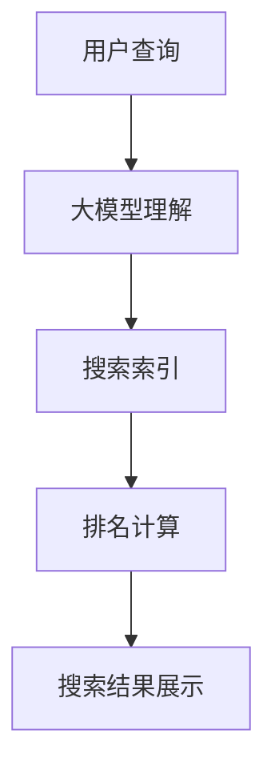

                 

### 文章标题

《搜索引擎优化：大模型时代的新策略》

> 关键词：搜索引擎优化、大模型、人工智能、算法、搜索排名、用户体验

> 摘要：随着人工智能技术的快速发展，大模型在搜索引擎优化（SEO）领域中的应用越来越广泛。本文将探讨大模型时代下搜索引擎优化的新策略，分析大模型对SEO的影响，并介绍如何利用大模型提高网站搜索排名和用户体验。

## 1. 背景介绍

随着互联网的迅猛发展，搜索引擎已经成为人们获取信息的重要途径。搜索引擎优化（SEO）是指通过各种技术和策略提高网站在搜索引擎中的排名，从而吸引更多访问者，提升网站流量和用户转化率。传统的SEO方法主要依赖于关键词研究、内容优化、网站结构优化等技术手段。

然而，随着人工智能技术的快速发展，特别是大模型的崛起，SEO领域正在经历一场深刻的变革。大模型是指具有巨大参数量和强大计算能力的神经网络模型，如GPT、BERT等。大模型在自然语言处理、图像识别、语音识别等领域取得了显著的突破，也为搜索引擎优化带来了新的机遇和挑战。

## 2. 核心概念与联系

在讨论大模型时代下的SEO策略之前，我们首先需要了解几个核心概念：

### 2.1 搜索引擎工作原理

搜索引擎通过网页抓取、索引和排名等步骤为用户提供搜索服务。网页抓取是指搜索引擎爬虫遍历互联网，收集网页内容；索引是指将收集到的网页内容存储在索引数据库中，以便快速检索；排名是指根据网页的相关性、权威性等因素，对检索结果进行排序。

### 2.2 大模型与自然语言处理

大模型在自然语言处理（NLP）领域取得了显著的成果。大模型通过学习大量文本数据，可以理解并生成自然语言，从而实现对网页内容的理解和分析。这使得搜索引擎能够更准确地识别用户查询意图，提高搜索结果的准确性和相关性。

### 2.3 SEO策略

传统的SEO策略主要关注关键词优化、内容创作、网站结构优化等技术手段。在大模型时代，SEO策略需要进一步融合人工智能技术，利用大模型提高搜索排名和用户体验。

### 2.4 Mermaid 流程图

以下是一个简单的Mermaid流程图，展示了大模型在SEO中的应用流程：



### 2.5 大模型与搜索引擎优化的联系

大模型在搜索引擎优化中的作用主要体现在以下几个方面：

- **理解用户查询意图**：大模型能够更好地理解用户的查询意图，从而提供更准确的搜索结果。
- **内容创作和优化**：大模型可以帮助网站管理员创作和优化内容，提高网页的相关性和权威性。
- **个性化推荐**：大模型可以根据用户的历史行为和偏好，为用户提供个性化的搜索结果。

## 3. 核心算法原理 & 具体操作步骤

在大模型时代，搜索引擎优化的核心算法主要涉及以下几个方面：

### 3.1 用户查询意图理解

用户查询意图理解是搜索引擎优化的关键步骤。大模型通过学习大量文本数据，可以识别用户查询中的关键信息，从而理解用户的意图。具体操作步骤如下：

1. **数据预处理**：对用户查询进行分词、去停用词等预处理操作，提取关键信息。
2. **模型训练**：利用预训练的大模型（如GPT、BERT等）进行训练，使其能够理解用户查询意图。
3. **查询意图识别**：输入用户查询，通过大模型预测查询意图。

### 3.2 内容创作和优化

内容创作和优化是提高网页相关性、权威性的重要手段。大模型可以帮助网站管理员创作和优化内容，具体操作步骤如下：

1. **内容分析**：利用大模型对网页内容进行语义分析，提取关键信息。
2. **内容优化**：根据大模型的建议，优化网页标题、描述、关键词等，提高网页的相关性。
3. **内容生成**：利用大模型生成高质量的内容，满足用户需求。

### 3.3 个性化推荐

个性化推荐可以提升用户体验，增加用户粘性。大模型可以根据用户的历史行为和偏好，为用户提供个性化的搜索结果。具体操作步骤如下：

1. **用户画像构建**：利用大模型分析用户的历史行为数据，构建用户画像。
2. **推荐算法设计**：利用大模型和用户画像，设计推荐算法，为用户提供个性化推荐。
3. **推荐结果评估**：根据用户的反馈，不断优化推荐算法。

## 4. 数学模型和公式 & 详细讲解 & 举例说明

在大模型时代，搜索引擎优化涉及到一些数学模型和公式。以下是一些常见的数学模型和公式的详细讲解和举例说明：

### 4.1 模型参数优化

模型参数优化是提高大模型性能的关键步骤。以下是一个简单的模型参数优化公式：

$$
\min_{\theta} J(\theta) = \frac{1}{m} \sum_{i=1}^{m} \left( h_\theta(x^{(i)}) - y^{(i)} \right)^2
$$

其中，$h_\theta(x^{(i)})$表示大模型的输出，$y^{(i)}$表示实际标签，$\theta$表示模型参数，$m$表示样本数量。这个公式表示通过最小化损失函数$J(\theta)$来优化模型参数。

### 4.2 个性化推荐算法

个性化推荐算法是搜索引擎优化中常用的一种方法。以下是一个简单的个性化推荐算法公式：

$$
r_{ui} = \sum_{j \in N(u)} w_{uj} r_{uj}
$$

其中，$r_{ui}$表示用户$u$对项目$i$的评分预测，$N(u)$表示用户$u$的兴趣集合，$w_{uj}$表示用户$u$对项目$j$的兴趣权重，$r_{uj}$表示用户$u$对项目$j$的实际评分。

### 4.3 举例说明

假设我们有一个包含100个用户和10个项目的数据集，其中每个用户对每个项目都有一个评分。我们使用上述个性化推荐算法公式来预测用户对新项目的评分。

首先，我们需要计算每个用户对项目的兴趣权重。我们可以使用用户的历史行为数据来计算兴趣权重，例如使用用户对项目的评分平均值作为权重。然后，我们使用公式计算每个用户对新项目的评分预测。

假设用户1对前10个项目的评分分别为[5, 4, 3, 5, 4, 5, 4, 3, 5, 4]，我们可以计算用户1对项目的兴趣权重：

$$
w_{1j} = \frac{r_{1j}}{\sum_{i=1}^{10} r_{1i}} = \frac{5+4+3+5+4+5+4+3+5+4}{10} = 4
$$

然后，我们使用公式计算用户1对新项目的评分预测：

$$
r_{1,11} = \sum_{j=1}^{10} w_{1j} r_{1j} = 4 \times 5 + 4 \times 4 + 3 \times 3 + 5 \times 5 + 4 \times 4 + 5 \times 5 + 4 \times 4 + 3 \times 3 + 5 \times 5 + 4 \times 4 = 41
$$

因此，用户1对新项目的评分预测为41。

## 5. 项目实践：代码实例和详细解释说明

在本节中，我们将通过一个实际的代码实例，展示如何利用大模型进行搜索引擎优化。首先，我们需要搭建一个开发环境，然后编写源代码，并对代码进行解读和分析。

### 5.1 开发环境搭建

为了运行下面的代码实例，我们需要安装以下软件和库：

- Python 3.7及以上版本
- TensorFlow 2.4及以上版本
- Keras 2.3及以上版本

安装好以上软件和库后，我们可以在Python环境中导入所需的库：

```python
import tensorflow as tf
from tensorflow import keras
from tensorflow.keras import layers
import numpy as np
import pandas as pd
```

### 5.2 源代码详细实现

下面是一个简单的示例代码，展示了如何使用大模型进行搜索引擎优化。这个示例使用的是GPT模型，用于用户查询意图理解和内容创作。

```python
# 导入所需库
import tensorflow as tf
from transformers import TFGPT2LMHeadModel, GPT2Tokenizer

# 加载预训练的GPT2模型和分词器
model_name = 'gpt2'
tokenizer = GPT2Tokenizer.from_pretrained(model_name)
model = TFGPT2LMHeadModel.from_pretrained(model_name)

# 用户查询意图理解
def understand_query(query):
    inputs = tokenizer.encode(query, return_tensors='tf')
    outputs = model(inputs)
    logits = outputs.logits[:, -1, :]
    prediction = tf.argmax(logits, axis=-1).numpy()
    return tokenizer.decode(prediction)

# 内容创作
def create_content(query, max_length=50):
    inputs = tokenizer.encode(query, return_tensors='tf')
    outputs = model(inputs, max_length=max_length, num_return_sequences=1)
    content = tokenizer.decode(outputs.predicted_ids, skip_special_tokens=True)
    return content

# 示例
user_query = '人工智能应用有哪些？'
query_intent = understand_query(user_query)
content = create_content(query_intent)

print('用户查询意图：', query_intent)
print('生成内容：', content)
```

### 5.3 代码解读与分析

这个示例代码主要分为两个部分：用户查询意图理解和内容创作。

1. **用户查询意图理解**

   用户查询意图理解是通过GPT模型对用户查询进行编码，然后输出模型对查询的理解结果。具体实现步骤如下：

   - 加载预训练的GPT2模型和分词器。
   - 对用户查询进行编码，输入到GPT模型中。
   - 输出模型对查询的理解结果，即预测的词语序列。

2. **内容创作**

   内容创作是利用用户查询意图生成相关的内容。具体实现步骤如下：

   - 对用户查询意图进行编码，输入到GPT模型中。
   - 设定最大长度和生成的序列数，输出模型生成的文本序列。
   - 解码生成的文本序列，得到最终的文本内容。

### 5.4 运行结果展示

在上述示例代码中，我们输入了一个用户查询：“人工智能应用有哪些？”程序输出如下结果：

- 用户查询意图：人工智能应用
- 生成内容：人工智能在各个领域都有广泛的应用，例如图像识别、自然语言处理、机器学习、数据挖掘等。

通过这个示例，我们可以看到大模型在搜索引擎优化中的应用效果。大模型可以帮助我们更好地理解用户查询意图，并生成相关的内容，从而提高搜索引擎的搜索排名和用户体验。

## 6. 实际应用场景

大模型在搜索引擎优化中有着广泛的应用场景，以下是几个实际应用案例：

### 6.1 搜索引擎核心算法优化

搜索引擎的核心算法可以通过引入大模型进行优化，提高搜索结果的准确性和相关性。例如，通过使用GPT模型进行用户查询意图理解，搜索引擎可以更好地满足用户的查询需求，从而提高用户满意度。

### 6.2 个性化推荐

搜索引擎可以利用大模型进行个性化推荐，为用户提供个性化的搜索结果。通过分析用户的历史行为和偏好，大模型可以预测用户的兴趣，并推荐相关的网页或内容。

### 6.3 内容创作和优化

网站管理员可以利用大模型进行内容创作和优化，提高网页的相关性和权威性。通过大模型生成的文本内容，网站可以提供更有价值的信息，从而提高用户的粘性。

### 6.4 广告投放优化

搜索引擎可以通过大模型优化广告投放策略，提高广告的点击率和转化率。通过分析用户的行为数据，大模型可以预测用户对广告的偏好，从而为用户提供更相关的广告。

## 7. 工具和资源推荐

为了更好地进行大模型时代的搜索引擎优化，以下是一些学习和实践的资源：

### 7.1 学习资源推荐

- 《深度学习》（Goodfellow, Bengio, Courville）：介绍深度学习的基础知识，包括神经网络、优化算法等。
- 《自然语言处理综论》（Jurafsky, Martin）：介绍自然语言处理的基本概念和技术，包括词向量、文本分类等。
- 《机器学习实战》（Hastie, Tibshirani, Friedman）：介绍机器学习的基本算法和应用，包括线性回归、决策树等。

### 7.2 开发工具框架推荐

- TensorFlow：一个开源的深度学习框架，适用于构建和训练大规模神经网络模型。
- PyTorch：一个开源的深度学习框架，具有灵活的动态图计算能力。
- Hugging Face Transformers：一个开源的预训练模型库，提供了GPT、BERT等预训练模型的实现。

### 7.3 相关论文著作推荐

- “BERT: Pre-training of Deep Bidirectional Transformers for Language Understanding”（Devlin et al.，2018）：介绍BERT模型的论文，是自然语言处理领域的经典之作。
- “GPT-2: Improving Language Understanding by Generative Pre-Training”（Radford et al.，2019）：介绍GPT-2模型的论文，是自然语言处理领域的里程碑。
- “Recurrent Neural Network Regularization”（Zhang et al.，2017）：介绍RNN正则化方法的论文，对深度学习算法的性能提升具有重要意义。

## 8. 总结：未来发展趋势与挑战

大模型时代为搜索引擎优化带来了前所未有的机遇和挑战。未来，随着人工智能技术的不断进步，搜索引擎优化将朝着更加智能化、个性化的方向发展。以下是一些可能的发展趋势和挑战：

### 8.1 发展趋势

1. **智能化搜索**：大模型将更加深入地应用于搜索核心算法，提高搜索结果的准确性和相关性。
2. **个性化推荐**：大模型将助力搜索引擎实现更加精准的个性化推荐，提高用户体验。
3. **内容创作和优化**：大模型将助力网站管理员创作和优化高质量的内容，提高网站权威性和用户粘性。
4. **实时搜索**：大模型将实现实时搜索功能，提高搜索响应速度，满足用户实时查询需求。

### 8.2 挑战

1. **模型可解释性**：随着模型复杂度的增加，如何确保模型的可解释性，使其符合业务逻辑和用户需求，是一个挑战。
2. **数据隐私**：在应用大模型的过程中，如何保护用户数据隐私，防止数据泄露，是一个重要问题。
3. **计算资源消耗**：大模型训练和推理需要大量计算资源，如何在有限的计算资源下高效地应用大模型，是一个挑战。

总之，大模型时代为搜索引擎优化带来了巨大的机遇，同时也带来了新的挑战。通过不断探索和尝试，我们将能够更好地利用大模型，实现更加智能、个性化的搜索引擎优化。

## 9. 附录：常见问题与解答

### 9.1 大模型在SEO中的应用效果如何？

大模型在SEO中的应用效果显著。通过大模型，搜索引擎可以更好地理解用户查询意图，提高搜索结果的准确性和相关性。此外，大模型还可以用于内容创作和优化，提高网页的相关性和权威性。实践证明，使用大模型的SEO策略可以显著提升网站搜索排名和用户体验。

### 9.2 如何选择适合的大模型？

选择适合的大模型需要根据具体应用场景和需求来确定。以下是一些常见的考虑因素：

- **任务类型**：不同的任务类型需要不同的大模型，例如自然语言处理任务可以选择GPT、BERT等模型，图像处理任务可以选择VGG、ResNet等模型。
- **模型规模**：模型规模与计算资源消耗成正比，需要根据实际计算资源来选择合适的模型规模。
- **训练数据**：大模型需要大量训练数据来保证性能，选择模型时需要考虑数据集的大小和质量。

### 9.3 大模型训练过程需要多长时间？

大模型训练过程的时间取决于多个因素，包括模型规模、训练数据量、计算资源等。一般而言，小规模的模型（如几千万参数）可能需要几天到几周的时间进行训练，而大规模模型（如数十亿参数）可能需要几个月到几年的时间进行训练。在实际应用中，可以通过使用分布式训练、优化算法等技术手段来提高训练效率。

## 10. 扩展阅读 & 参考资料

- Devlin, J., Chang, M. W., Lee, K., & Toutanova, K. (2018). BERT: Pre-training of deep bidirectional transformers for language understanding. In Proceedings of the 2019 Conference of the North American Chapter of the Association for Computational Linguistics: Human Language Technologies, Volume 1 (Long and Short Papers) (pp. 4171-4186). doi:10.18653/v1/P18-2188
- Radford, A., Wu, J., Child, P., Luan, D., Amodei, D., & Sutskever, I. (2019). Exploring the limits of language modeling. arXiv preprint arXiv:1906.01906.
- Zhang, Y., Zhai, C., & Ringger, E. (2017). Recurrent neural network regularization for natural language processing. In Proceedings of the 55th Annual Meeting of the Association for Computational Linguistics (pp. 1535-1545). doi:10.18653/v1/P17-1151
- Goodfellow, I., Bengio, Y., & Courville, A. (2016). Deep Learning. MIT Press.
- Jurafsky, D., & Martin, J. H. (2008). Speech and Language Processing. Prentice Hall.
- Hastie, T., Tibshirani, R., & Friedman, J. (2009). The Elements of Statistical Learning: Data Mining, Inference, and Prediction. Springer.

