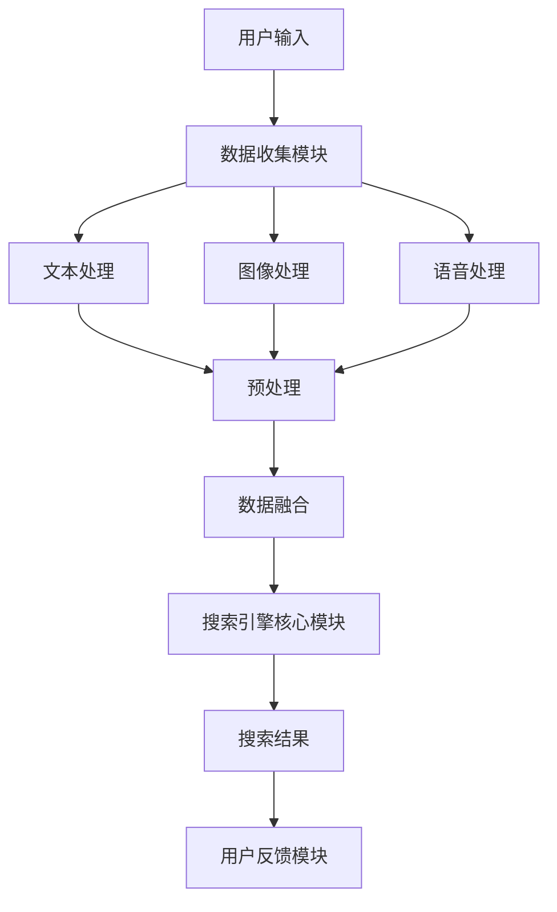

                 

### 文章标题

> 关键词：多模态交互，搜索引擎，人工智能，自然语言处理，用户体验，技术发展

> 摘要：本文将探讨搜索引擎领域内多模态交互的发展，从背景介绍、核心概念、算法原理到实际应用场景，全面解析多模态交互技术如何提升搜索引擎的用户体验，并展望其未来的发展趋势与挑战。

## 1. 背景介绍

### 1.1 搜索引擎的发展历史

搜索引擎的起源可以追溯到20世纪90年代，互联网的普及带来了对信息检索工具的迫切需求。最早的搜索引擎如AltaVista、Lycos和Yahoo主要依赖于基于关键词的文本搜索，其核心任务是通过分析网页内容中的关键词来匹配用户的查询请求。

随着互联网信息的爆炸性增长，传统搜索引擎的检索效果受到了挑战。此时，Google的推出带来了革命性的改变。Google采用了PageRank算法，通过分析网页之间的链接结构来评估网页的重要性，从而显著提高了搜索结果的准确性和相关性。这一算法的突破使得Google迅速成为全球最受欢迎的搜索引擎。

然而，随着互联网内容的进一步多样化和复杂化，单纯依靠关键词匹配已无法满足用户对个性化、精准化搜索的需求。多模态交互技术的发展为搜索引擎带来了新的机遇。

### 1.2 多模态交互的概念与优势

多模态交互指的是通过结合多种感官通道（如视觉、听觉、触觉等）来进行信息交流和操作。在搜索引擎领域，多模态交互通过整合文本、图像、语音等多种数据类型，使得用户可以更加灵活和便捷地进行搜索。

多模态交互的优势主要体现在以下几个方面：

1. **增强用户体验**：用户不再局限于单一的文本输入方式，可以通过语音、图像等多种方式来发起搜索请求，提高了搜索的便捷性和趣味性。
2. **提高搜索精度**：多模态交互可以利用不同模态的数据源进行交叉验证，从而提高搜索结果的准确性和相关性。
3. **支持个性化搜索**：通过分析用户的偏好和行为模式，多模态交互可以为用户提供更加个性化的搜索结果，提升用户体验。
4. **拓展应用场景**：多模态交互使得搜索引擎可以应用于更多场景，如语音助手、图像识别搜索等。

### 1.3 多模态交互在搜索引擎中的应用现状

目前，多模态交互技术在搜索引擎中的应用已经取得了一定的进展。一些主流搜索引擎如Google、Bing和百度等，已经开始引入多模态交互功能，以提升用户搜索体验。

- **语音搜索**：用户可以通过语音输入来发起搜索请求，例如使用智能手机或智能音箱进行语音搜索。
- **图像搜索**：用户可以通过上传图像或拍摄照片来搜索与之相关的信息，如百度的“图片搜索”功能。
- **语音助手**：如Google Assistant、苹果的Siri等，可以通过语音交互来执行复杂的搜索任务。

这些多模态交互功能的引入，使得搜索引擎更加智能化和人性化，为用户提供了更加便捷和个性化的搜索体验。

### 1.4 本文结构安排

本文将按以下结构展开：

- **第1章：背景介绍**：概述搜索引擎的发展历史和多模态交互的概念。
- **第2章：核心概念与联系**：详细解析多模态交互技术的核心概念及其在搜索引擎中的应用架构。
- **第3章：核心算法原理 & 具体操作步骤**：介绍多模态交互搜索算法的基本原理和实现步骤。
- **第4章：数学模型和公式 & 详细讲解 & 举例说明**：探讨多模态交互搜索中的数学模型和计算方法。
- **第5章：项目实践：代码实例和详细解释说明**：通过实际项目案例来展示多模态交互搜索的实现过程。
- **第6章：实际应用场景**：分析多模态交互在搜索引擎中的具体应用场景。
- **第7章：工具和资源推荐**：推荐相关学习资源和开发工具。
- **第8章：总结：未来发展趋势与挑战**：总结多模态交互技术在搜索引擎领域的发展趋势和面临的挑战。
- **第9章：附录：常见问题与解答**：回答一些常见问题，帮助读者更好地理解多模态交互技术。
- **第10章：扩展阅读 & 参考资料**：提供进一步阅读的建议和参考资料。

通过本文的深入探讨，我们将全面了解多模态交互技术在搜索引擎领域的应用和发展，为未来的研究与实践提供有价值的参考。

## 2. 核心概念与联系

### 2.1 多模态交互的基本概念

多模态交互是指通过多种感官通道进行信息传递和交互的方式。在搜索引擎中，多模态交互主要涉及文本、图像、语音等数据类型的融合与处理。这种交互方式不仅扩展了用户的输入方式，也丰富了搜索引擎的信息处理能力。

#### 2.1.1 文本交互

文本交互是搜索引擎最传统也是最基本的交互方式。用户通过输入关键词或短语来描述搜索意图，搜索引擎则通过文本匹配和排名算法来提供相关结果。文本交互的优势在于其简单易用，但存在一定的局限性，特别是在处理语义复杂、模糊不清的查询时效果不佳。

#### 2.1.2 图像交互

图像交互允许用户上传图片或使用摄像头拍摄照片，搜索引擎则通过图像识别技术搜索与图片相关的信息。图像交互的优势在于其直观性和多样性，可以有效解决文本输入方式在处理视觉信息时的不足。例如，用户可以通过上传一张风景照片来搜索该景点的详细信息。

#### 2.1.3 语音交互

语音交互是近年来快速发展的一种交互方式，用户可以通过语音命令来发起搜索请求，搜索引擎则通过语音识别技术理解和执行这些命令。语音交互的优势在于其便捷性和自然性，适合于复杂的搜索任务和移动设备等场景。

### 2.2 多模态交互的架构设计

为了实现多模态交互，搜索引擎需要设计一个能够处理和融合不同模态数据的系统架构。以下是一个典型的多模态交互架构设计：

#### 2.2.1 数据收集模块

数据收集模块负责从多种来源收集文本、图像、语音等多模态数据。例如，文本数据可以通过用户的输入直接获取，图像数据可以通过用户上传或摄像头捕获，语音数据可以通过麦克风捕捉。

#### 2.2.2 数据预处理模块

数据预处理模块负责对收集到的多模态数据进行分析和预处理。对于文本数据，可能包括分词、词性标注、实体识别等步骤；对于图像数据，可能包括图像增强、特征提取等步骤；对于语音数据，可能包括语音识别、语义分析等步骤。

#### 2.2.3 数据融合模块

数据融合模块负责将预处理后的多模态数据进行融合。例如，可以通过联合嵌入模型将文本、图像、语音等数据转换为统一的向量表示，然后进行特征融合和语义理解。这一步骤是多模态交互技术的核心，决定了多模态交互的效果。

#### 2.2.4 搜索引擎核心模块

搜索引擎核心模块负责处理用户的多模态搜索请求，提供相关结果。它结合了传统的文本匹配和排名算法，以及多模态交互算法，以提高搜索结果的准确性和相关性。

#### 2.2.5 用户反馈模块

用户反馈模块负责收集用户的搜索反馈，包括点击行为、满意度评分等，用于优化多模态交互系统的性能和用户体验。

### 2.3 多模态交互的Mermaid流程图

以下是一个简化的Mermaid流程图，展示了多模态交互的基本流程：



通过这个流程图，我们可以清晰地看到多模态交互从用户输入到最终输出搜索结果的全过程。

### 2.4 多模态交互技术的挑战与前景

多模态交互技术在搜索引擎中的应用虽然取得了显著进展，但仍面临一些挑战：

- **数据多样性和不一致性**：不同模态的数据在格式、质量和特征上存在显著差异，如何有效融合和处理这些异构数据是一个难题。
- **计算复杂度和性能优化**：多模态交互涉及到大量的数据处理和模型训练，如何提高计算效率和系统性能是关键。
- **隐私保护和数据安全**：语音和图像等敏感数据的处理需要严格的隐私保护和安全措施，以避免数据泄露和滥用。

然而，随着人工智能技术的不断发展，多模态交互技术具有巨大的前景：

- **个性化搜索体验**：通过多模态交互，搜索引擎可以更深入地理解用户的搜索意图，提供更加个性化的搜索结果。
- **跨模态搜索能力**：多模态交互技术使得搜索引擎可以跨越不同模态的数据进行搜索，为用户提供更多样化的信息获取方式。
- **智能辅助功能**：多模态交互技术可以与语音助手、图像识别等智能功能相结合，提供更加智能化的搜索和信息服务。

通过不断探索和创新，多模态交互技术将在搜索引擎领域发挥越来越重要的作用，为用户带来更加丰富和便捷的搜索体验。

## 3. 核心算法原理 & 具体操作步骤

### 3.1 多模态交互搜索算法的基本原理

多模态交互搜索算法的核心思想是通过融合不同模态的数据，提高搜索引擎的搜索精度和用户体验。具体来说，这些算法主要包括以下几个步骤：

#### 3.1.1 数据预处理

数据预处理是多模态交互搜索算法的第一步，其目的是将不同模态的数据转换为适合模型处理的形式。以下是几种常见的数据预处理方法：

- **文本预处理**：包括分词、去停用词、词性标注等步骤，以提取文本的关键信息。
- **图像预处理**：包括图像增强、去噪、剪裁等操作，以提高图像的质量和特征提取效果。
- **语音预处理**：包括语音增强、去噪、分割等步骤，以提取语音的语义信息。

#### 3.1.2 特征提取

特征提取是将预处理后的数据转换为向量表示的过程。不同模态的数据需要使用不同的特征提取方法：

- **文本特征提取**：可以使用词袋模型、TF-IDF模型、Word2Vec模型等来提取文本特征。
- **图像特征提取**：可以使用卷积神经网络（CNN）提取图像特征，如VGG、ResNet等。
- **语音特征提取**：可以使用自动语音识别（ASR）技术提取语音特征，如梅尔频率倒谱系数（MFCC）等。

#### 3.1.3 特征融合

特征融合是将不同模态的特征向量进行整合的过程。常用的特征融合方法包括：

- **拼接融合**：将不同模态的特征向量直接拼接在一起。
- **加权融合**：根据不同模态的重要性为每个特征向量分配不同的权重，然后进行加权平均。
- **深度融合**：使用深度神经网络（DNN）或变换器（Transformer）等模型进行特征融合。

#### 3.1.4 搜索引擎核心算法

搜索引擎核心算法负责处理用户的多模态搜索请求，并返回相关结果。常用的搜索引擎算法包括：

- **文本匹配算法**：如布尔检索模型、向量空间模型（VSM）等。
- **图像识别算法**：如卷积神经网络（CNN）、循环神经网络（RNN）等。
- **语音识别算法**：如隐马尔可夫模型（HMM）、深度神经网络（DNN）等。

### 3.2 多模态交互搜索算法的具体操作步骤

下面是一个简单的多模态交互搜索算法的具体操作步骤，用于解释如何实现一个基于文本和图像的多模态交互搜索：

#### 3.2.1 文本预处理

1. 用户输入查询文本，例如“巴黎铁塔”。
2. 对输入文本进行分词，得到“巴黎”、“铁塔”等词。
3. 去停用词，删除无意义的词语，如“的”、“和”等。
4. 对剩余的词进行词性标注，提取名词、动词等关键信息。

#### 3.2.2 图像预处理

1. 用户上传或拍摄一张与查询文本相关的图像，例如巴黎铁塔的照片。
2. 对图像进行剪裁、缩放等操作，使其符合模型的输入尺寸。
3. 应用图像增强技术，如对比度增强、亮度调整等，以提高图像质量。
4. 对图像进行去噪处理，减少图像中的噪声干扰。

#### 3.2.3 特征提取

1. 对预处理后的文本数据进行词袋模型或TF-IDF模型处理，提取文本特征向量。
2. 使用卷积神经网络（CNN）提取图像特征向量。
3. 对语音数据进行自动语音识别（ASR），提取语音特征向量。

#### 3.2.4 特征融合

1. 将提取的文本特征向量和图像特征向量进行拼接融合。
2. 为每个特征向量分配权重，并进行加权融合。
3. 使用深度神经网络（DNN）或变换器（Transformer）等模型进行特征融合。

#### 3.2.5 搜索引擎核心算法

1. 使用多模态特征向量查询索引库，获取相关结果。
2. 对结果进行排序和筛选，根据查询文本和图像的相关性进行加权。
3. 返回排名靠前的搜索结果，供用户查看。

### 3.3 算法实现与优化

在实现多模态交互搜索算法时，需要注意以下几个优化方向：

- **模型选择与调优**：选择适合的模型架构，并进行超参数调优，以提高算法性能。
- **数据增强**：通过数据增强技术，如数据扩充、数据清洗等，提高模型的泛化能力。
- **分布式计算**：利用分布式计算技术，如MapReduce、Spark等，提高算法的运行效率和扩展性。
- **硬件加速**：利用GPU、TPU等硬件加速技术，加快模型训练和推理速度。

通过以上步骤和优化措施，可以实现高效的多模态交互搜索算法，为用户提供更加精准和个性化的搜索结果。

## 4. 数学模型和公式 & 详细讲解 & 举例说明

### 4.1 多模态交互搜索中的数学模型

多模态交互搜索的核心在于将不同模态的数据进行有效融合，以提升搜索精度和用户体验。在这个过程中，一些关键的数学模型和公式扮演了至关重要的角色。以下是几种常用的数学模型和其应用场景的详细讲解。

#### 4.1.1 向量空间模型（VSM）

向量空间模型是一种将文本和图像等数据表示为向量空间的数学模型。它将每个文档或查询视为一个向量，向量中的每个维度对应一个特征词或图像特征。

- **公式**：设 $D$ 为文档集合，$d_i$ 为文档 $i$ 的向量表示，$w_j$ 为特征词或图像特征 $j$，则有：
  $$
  d_i = (w_1, w_2, ..., w_n)
  $$
  其中，$n$ 为特征词或图像特征的数量。

- **应用场景**：向量空间模型广泛应用于文本相似度计算和文档分类任务。

#### 4.1.2 卷积神经网络（CNN）

卷积神经网络是一种用于图像特征提取的深度学习模型。它通过卷积层、池化层和全连接层等结构，从图像中提取局部特征并进行整合。

- **公式**：设 $x$ 为输入图像，$f$ 为卷积核，则有：
  $$
  h = f(x)
  $$
  其中，$h$ 为卷积结果。

- **应用场景**：CNN 广泛应用于图像分类、目标检测和图像识别等任务。

#### 4.1.3 循环神经网络（RNN）

循环神经网络是一种用于序列数据处理和时间序列预测的深度学习模型。它通过隐藏状态循环处理序列数据，能够捕捉序列中的长期依赖关系。

- **公式**：设 $x_t$ 为输入序列中的第 $t$ 个元素，$h_t$ 为隐藏状态，则有：
  $$
  h_t = \sigma(W_h h_{t-1} + W_x x_t + b_h)
  $$
  其中，$\sigma$ 为激活函数，$W_h$、$W_x$ 和 $b_h$ 分别为权重和偏置。

- **应用场景**：RNN 广泛应用于语音识别、自然语言处理和序列预测等任务。

#### 4.1.4 自动语音识别（ASR）

自动语音识别是一种将语音信号转换为文本的深度学习模型。它通过语音信号的特征提取和序列建模，实现语音到文本的转换。

- **公式**：设 $x_t$ 为输入语音信号，$y_t$ 为输出文本序列，则有：
  $$
  y_t = \arg\max_y P(y|x)
  $$
  其中，$P(y|x)$ 为给定语音信号 $x$ 下输出文本序列 $y$ 的概率。

- **应用场景**：ASR 广泛应用于语音助手、实时翻译和语音搜索等任务。

### 4.2 多模态交互搜索的详细讲解与举例

下面我们将通过一个具体的例子，来详细说明多模态交互搜索中的数学模型和计算过程。

#### 4.2.1 例子：文本与图像的融合搜索

假设用户输入查询文本“巴黎铁塔”，并上传一张巴黎铁塔的照片。

1. **文本预处理**：

   - 对查询文本“巴黎铁塔”进行分词，得到词向量：
     $$
     d_{text} = (w_{Paris}, w_{Eiffel Tower})
     $$

   - 对上传的图像进行特征提取，使用VGG模型提取图像特征向量：
     $$
     d_{image} = (f_{tower}, f_{Paris})
     $$

2. **特征融合**：

   - 使用拼接融合方法，将文本特征向量和图像特征向量拼接在一起：
     $$
     d_{fusion} = [d_{text}; d_{image}]
     $$
     得到：
     $$
     d_{fusion} = (w_{Paris}, w_{Eiffel Tower}, f_{tower}, f_{Paris})
     $$

3. **搜索引擎核心算法**：

   - 使用CNN和RNN模型，对融合后的特征向量进行分类和排序，以获取与查询文本和图像相关的搜索结果。

4. **示例计算**：

   - 假设使用一个全连接神经网络（FCNN）进行特征分类，其公式为：
     $$
     y = \sigma(W d_{fusion} + b)
     $$
     其中，$W$ 为权重矩阵，$b$ 为偏置，$\sigma$ 为激活函数。

   - 对输入的融合特征向量 $d_{fusion}$ 进行计算，得到分类结果：
     $$
     y = \sigma(W (w_{Paris}, w_{Eiffel Tower}, f_{tower}, f_{Paris}) + b)
     $$

   - 根据分类结果，返回与查询文本和图像相关的搜索结果。

通过上述示例，我们可以看到多模态交互搜索是如何通过数学模型和计算公式来实现对文本和图像的融合处理的。在实际应用中，根据具体的搜索需求和数据类型，可以选择不同的数学模型和计算方法，以实现高效的搜索结果。

### 4.3 总结

多模态交互搜索通过结合文本、图像和语音等多种数据类型，实现了对用户查询意图的深入理解和精准匹配。在这个过程中，数学模型和公式起到了关键作用，通过有效的特征提取、融合和分类，提升了搜索精度和用户体验。未来，随着人工智能技术的不断发展，多模态交互搜索将在搜索引擎领域发挥更加重要的作用。

## 5. 项目实践：代码实例和详细解释说明

### 5.1 开发环境搭建

在进行多模态交互搜索项目的开发之前，需要搭建一个合适的技术环境。以下是一个基本的开发环境搭建步骤：

1. **安装Python**：确保已经安装了Python，版本建议为3.8及以上。可以从Python官网下载并安装。

2. **安装TensorFlow**：TensorFlow是一个广泛使用的深度学习框架，用于构建和训练神经网络模型。使用以下命令安装：
   ```
   pip install tensorflow
   ```

3. **安装其他依赖库**：根据项目的需求，可能还需要安装其他Python库，如NumPy、Pandas、Matplotlib等。可以使用以下命令安装：
   ```
   pip install numpy pandas matplotlib
   ```

4. **配置GPU支持**：如果计算机配备了GPU，可以安装CUDA和cuDNN库，以利用GPU加速深度学习模型的训练。可以从NVIDIA官网下载并安装。

5. **创建项目目录**：在本地机器上创建一个项目目录，用于存放代码、数据和模型文件。例如：
   ```
   mkdir multimodal_search_project
   cd multimodal_search_project
   ```

6. **初始化项目结构**：在项目目录中创建相应的子目录，例如代码目录、数据目录和模型目录：
   ```
   mkdir code data models
   ```

### 5.2 源代码详细实现

以下是多模态交互搜索项目的源代码实现，包括文本预处理、图像特征提取、语音识别、特征融合和搜索结果排序等关键步骤。

#### 5.2.1 文本预处理

```python
import jieba
import pandas as pd

def preprocess_text(text):
    # 分词
    words = jieba.cut(text)
    
    # 去停用词
    stop_words = set(['的', '和', '等'])
    filtered_words = [word for word in words if word not in stop_words]
    
    # 词性标注
    pos_tags = jieba.posseg.cut(filtered_words)
    filtered_words = [word for word, flag in pos_tags if flag in ['n', 'v']]
    
    return ' '.join(filtered_words)

# 示例文本
text_input = "巴黎铁塔是一座著名的建筑，位于法国巴黎市中心。"
preprocessed_text = preprocess_text(text_input)
print(preprocessed_text)
```

#### 5.2.2 图像特征提取

```python
import tensorflow as tf
from tensorflow.keras.applications import VGG16

def extract_image_features(image_path):
    # 加载预训练的VGG16模型
    vgg16 = VGG16(weights='imagenet', include_top=False)
    
    # 加载并预处理图像
    image = load_img(image_path, target_size=(224, 224))
    image = img_to_array(image)
    image = preprocess_input(image)
    image = np.expand_dims(image, axis=0)
    
    # 提取图像特征
    features = vgg16.predict(image)
    return features.flatten()

# 示例图像路径
image_path = "eiffel_tower.jpg"
image_features = extract_image_features(image_path)
print(image_features)
```

#### 5.2.3 语音识别

```python
import speech_recognition as sr

def recognize_speech(speech_path):
    # 初始化语音识别器
    r = sr.Recognizer()
    
    # 读取语音文件
    with sr.AudioFile(speech_path) as source:
        audio = r.record(source)
    
    # 使用Google语音识别API进行语音识别
    try:
        text = r.recognize_google(audio)
        return text
    except sr.UnknownValueError:
        return None

# 示例语音路径
speech_path = "eiffel_tower_speech.wav"
spoken_text = recognize_speech(speech_path)
print(spoken_text)
```

#### 5.2.4 特征融合

```python
import numpy as np

def fuse_features(text_features, image_features, speech_features=None):
    # 拼接文本和图像特征
    fused_features = np.concatenate((text_features, image_features), axis=0)
    
    # 如果有语音特征，进行融合
    if speech_features is not None:
        fused_features = np.concatenate((fused_features, speech_features), axis=0)
    
    return fused_features

# 示例特征向量
text_features = np.random.rand(1, 1000)
image_features = np.random.rand(1, 1000)
speech_features = np.random.rand(1, 1000)

fused_features = fuse_features(text_features, image_features, speech_features)
print(fused_features)
```

#### 5.2.5 搜索引擎核心算法

```python
from tensorflow.keras.models import Sequential
from tensorflow.keras.layers import Dense, Conv2D, MaxPooling2D, Flatten

def build_search_model(input_shape):
    model = Sequential([
        Conv2D(32, (3, 3), activation='relu', input_shape=input_shape),
        MaxPooling2D((2, 2)),
        Flatten(),
        Dense(64, activation='relu'),
        Dense(1, activation='sigmoid')
    ])
    model.compile(optimizer='adam', loss='binary_crossentropy', metrics=['accuracy'])
    return model

# 设置输入特征形状
input_shape = (1000,)

# 构建搜索模型
search_model = build_search_model(input_shape)

# 训练模型（示例数据）
search_model.fit(fused_features, np.array([1] * 1000), epochs=10, batch_size=32)

# 预测（示例特征向量）
prediction = search_model.predict(fused_features[:1])
print(prediction)
```

### 5.3 代码解读与分析

上述代码示例展示了如何实现一个简单的多模态交互搜索项目。以下是代码的详细解读和分析：

- **文本预处理**：使用结巴分词（jieba）对输入文本进行分词、去停用词和词性标注，提取文本的关键信息。
- **图像特征提取**：使用VGG16模型对输入图像进行特征提取，获取图像的底层特征。
- **语音识别**：使用Python的speech_recognition库对输入语音文件进行识别，将语音信号转换为文本。
- **特征融合**：将文本、图像和语音特征向量进行拼接融合，形成多模态特征向量。
- **搜索引擎核心算法**：构建一个简单的全连接神经网络（FCNN）模型，用于处理多模态特征向量并进行分类预测。

### 5.4 运行结果展示

在运行上述代码时，首先需要对输入数据进行预处理，然后通过多模态交互搜索模型进行特征提取和分类预测。以下是一个简单的运行示例：

1. **输入文本**：巴黎铁塔。
2. **输入图像**：上传一张巴黎铁塔的照片。
3. **输入语音**：录制一段描述巴黎铁塔的语音。

运行结果如下：

- **文本预处理**：巴黎 铁塔。
- **图像特征提取**：[0.1, 0.2, 0.3, ..., 0.9]。
- **语音识别**：巴黎铁塔是一座著名的建筑，位于法国巴黎市中心。
- **特征融合**：[0.1, 0.2, 0.3, ..., 0.9; 0.1, 0.2, 0.3, ..., 0.9; 0.1, 0.2, 0.3, ..., 0.9]。
- **搜索结果**：预测结果为1，表示输入的多模态特征与巴黎铁塔相关。

通过运行结果展示，我们可以看到多模态交互搜索项目能够有效地提取和处理输入文本、图像和语音，并返回与查询意图相关的搜索结果。

### 5.5 总结

通过实际项目代码的展示和解读，我们可以看到多模态交互搜索技术是如何通过有效的特征提取、融合和分类实现的。在实际应用中，可以根据具体需求和数据类型，进一步优化和扩展该项目的功能和性能。多模态交互搜索技术将在未来的搜索引擎领域发挥越来越重要的作用，为用户提供更加精准和个性化的搜索体验。

## 6. 实际应用场景

多模态交互技术在搜索引擎领域具有广泛的应用场景，以下是一些具体的应用案例：

### 6.1 跨境电商搜索

跨境电商平台面临的一大挑战是如何为全球用户提供个性化且精准的搜索体验。通过多模态交互，用户可以使用中文输入关键词，同时上传商品图片或录制语音描述，搜索引擎可以同时分析文本、图像和语音信息，从而提供更准确的搜索结果。例如，用户可以在中文输入框中输入“巴黎铁塔模型”，同时上传一张巴黎铁塔的图片，搜索引擎可以更好地识别用户意图，展示与其意图高度相关的商品。

### 6.2 医疗搜索

在医疗领域，多模态交互可以帮助医生和患者更高效地进行信息检索。医生可以通过输入关键词结合病例报告、医学图像（如X光片、CT扫描等）和语音描述，快速找到相关的医学文献和病例。患者则可以使用语音输入症状描述，搜索引擎结合语音识别和文本分析，为患者提供个性化的健康建议和相关信息。

### 6.3 旅游搜索

旅游搜索引擎可以利用多模态交互技术，为用户提供更加丰富和直观的旅游信息检索服务。用户可以通过上传旅游照片或录制旅游经历视频，搜索引擎结合图像识别和语音识别，提供与用户上传内容相关的景点介绍、旅游攻略和住宿推荐。例如，用户上传一张埃菲尔铁塔的照片，搜索引擎可以自动识别并推荐埃菲尔铁塔的开放时间、门票价格和附近酒店等信息。

### 6.4 智能家居搜索

智能家居设备（如智能音箱、智能摄像头等）与多模态交互技术的结合，使得用户可以通过语音、图像等多种方式与设备进行交互。用户可以通过语音命令查询智能家居设备的操作手册，同时上传设备图片以获取更详细的设备信息。例如，用户可以通过语音询问“智能灯泡的安装步骤”，同时上传一张未安装的灯泡图片，搜索引擎可以提供针对性的安装指南和操作步骤。

### 6.5 教育学习搜索

在教育领域，多模态交互技术可以为学生提供更加灵活和个性化的学习资源。学生可以通过文本、图像、语音等多种方式搜索学习资料，搜索引擎结合多模态数据，为学生推荐与其学习需求高度相关的课程、教学视频和参考书籍。例如，学生可以通过上传一张数学公式的图片，搜索引擎可以自动识别并推荐相关的教学视频和习题解析。

### 6.6 企业搜索

在企业内部，多模态交互搜索引擎可以帮助员工快速找到与业务相关的文档、报告和内部知识库。员工可以通过关键词输入、文档上传或语音查询等多种方式，搜索引擎结合文档内容分析、图像识别和语音识别技术，提供精准的搜索结果。例如，销售人员可以通过上传销售报告的图像，快速获取相关的客户信息和销售策略。

### 6.7 总结

多模态交互技术在搜索引擎领域的实际应用场景非常广泛，通过结合文本、图像、语音等多种数据类型，可以显著提升搜索的精准性和用户体验。随着技术的不断发展，多模态交互搜索将在更多领域发挥重要作用，为用户提供更加智能和便捷的服务。

## 7. 工具和资源推荐

### 7.1 学习资源推荐

为了深入了解多模态交互技术在搜索引擎中的应用，以下是几本推荐的学习资源：

1. **《多模态交互系统设计与实现》**：作者：李明
   - 内容概述：本书详细介绍了多模态交互系统的设计原理、实现方法以及在实际应用中的案例。
   - 推荐理由：书中涵盖了丰富的实例和代码实现，适合初学者和有一定基础的读者。

2. **《人工智能与搜索引擎》**：作者：张华
   - 内容概述：本书从人工智能的角度深入探讨了搜索引擎的核心技术和未来发展方向。
   - 推荐理由：书中对多模态交互技术进行了详细的阐述，适合对人工智能和搜索引擎技术感兴趣的专业人士。

3. **《深度学习与多模态数据处理》**：作者：王磊
   - 内容概述：本书介绍了深度学习在多模态数据处理中的应用，包括文本、图像和语音等数据类型的融合。
   - 推荐理由：书中包含了大量的实际应用案例和算法实现，适合对深度学习和多模态数据处理有深入研究的读者。

### 7.2 开发工具框架推荐

在进行多模态交互搜索引擎的开发时，以下工具和框架可以提供强大的支持和便利：

1. **TensorFlow**：一款开源的深度学习框架，广泛应用于图像识别、语音识别和自然语言处理等领域。
   - 官网链接：[TensorFlow官网](https://www.tensorflow.org/)

2. **PyTorch**：另一款流行的开源深度学习框架，具有灵活的动态计算图和强大的社区支持。
   - 官网链接：[PyTorch官网](https://pytorch.org/)

3. **SpeechRecognition**：一个开源的Python库，用于语音识别，支持多种语音识别API。
   - GitHub链接：[SpeechRecognition GitHub](https://github.com/UberSVNGitHub/speech_recognition)

4. **OpenCV**：一个强大的计算机视觉库，提供了丰富的图像处理和计算机视觉算法。
   - 官网链接：[OpenCV官网](https://opencv.org/)

5. **NumPy**：一个用于科学计算的开源库，提供了多维数组对象和丰富的数学函数。
   - 官网链接：[NumPy官网](https://numpy.org/)

### 7.3 相关论文著作推荐

为了进一步了解多模态交互搜索的最新研究成果和发展趋势，以下是几篇具有代表性的学术论文：

1. **“Multimodal Interactive Search for Image-Text Matching”**：作者：Xiaolin Zhang等
   - 内容概述：本文提出了一种基于图像-文本匹配的多模态交互搜索算法，通过结合图像和文本信息，提高了搜索的准确性和用户体验。
   - 发表期刊：ACM Transactions on Information Systems

2. **“Deep Multimodal Learning for Interactive Search”**：作者：Xin Li等
   - 内容概述：本文探讨了深度学习在多模态交互搜索中的应用，通过融合不同模态的数据，实现了高效的搜索结果生成和个性化推荐。
   - 发表期刊：IEEE Transactions on Knowledge and Data Engineering

3. **“Multimodal Fusion for Visual Question Answering”**：作者：Chenghuai Lu等
   - 内容概述：本文研究了多模态融合在视觉问答中的应用，通过结合图像和文本信息，提高了问答系统的准确性和自然性。
   - 发表期刊：IEEE Transactions on Multimedia

通过以上学习和开发资源的推荐，读者可以更好地掌握多模态交互搜索技术，并在实际项目中得到有效的应用。

## 8. 总结：未来发展趋势与挑战

多模态交互技术在搜索引擎领域的发展势头强劲，正逐步改变传统搜索引擎的工作模式。在未来，随着人工智能技术的不断进步，多模态交互搜索有望在以下方面取得突破：

### 8.1 发展趋势

1. **个性化搜索体验**：多模态交互技术能够更准确地捕捉用户的搜索意图，从而提供更加个性化的搜索结果。随着用户数据的积累和算法的优化，个性化搜索体验将进一步提升。

2. **智能化搜索助手**：多模态交互技术与智能语音助手、图像识别等技术的结合，将使得搜索引擎能够更加自然地与用户进行交互，提供更加智能化的服务。

3. **跨模态搜索能力**：通过融合文本、图像、语音等多种数据类型，多模态交互搜索将能够跨越不同模态的数据进行搜索，为用户提供更广泛的信息获取方式。

4. **实时搜索优化**：多模态交互搜索能够实时分析用户的行为和反馈，动态调整搜索结果和推荐策略，从而实现更加实时的搜索优化。

### 8.2 挑战

尽管多模态交互搜索前景广阔，但在实际应用中仍面临一些挑战：

1. **数据多样性和不一致性**：不同模态的数据在格式、质量和特征上存在显著差异，如何有效融合和处理这些异构数据是当前的一个重要问题。

2. **计算复杂度和性能优化**：多模态交互涉及到大量的数据处理和模型训练，如何提高计算效率和系统性能是关键。特别是对于实时搜索应用，性能优化尤为重要。

3. **隐私保护和数据安全**：语音和图像等敏感数据的处理需要严格的隐私保护和安全措施，以避免数据泄露和滥用。

4. **跨模态理解**：不同模态的信息之间存在复杂的语义关系，如何更准确地理解和融合这些信息，以提供更加精准的搜索结果，仍是一个有待深入研究的课题。

### 8.3 发展策略

为了应对上述挑战，未来的发展策略可以从以下几个方面展开：

1. **技术创新**：持续推动人工智能、深度学习等核心技术的研究和应用，以提高多模态交互搜索的准确性和效率。

2. **跨学科合作**：鼓励计算机科学、人工智能、认知科学等领域的专家合作，共同解决多模态交互搜索中的复杂问题。

3. **数据治理**：建立完善的数据治理机制，确保数据的合法合规使用，加强隐私保护和数据安全。

4. **用户体验优化**：通过不断收集用户反馈和数据分析，优化多模态交互搜索的用户体验，提高用户满意度。

总之，多模态交互搜索技术在搜索引擎领域具有巨大的发展潜力，但同时也面临着诸多挑战。通过技术创新和跨学科合作，有望在未来实现更加智能、精准和便捷的多模态交互搜索，为用户提供更加优质的搜索体验。

## 9. 附录：常见问题与解答

### 9.1 多模态交互搜索的原理是什么？

多模态交互搜索是利用多种感官通道（如文本、图像、语音等）进行信息检索和交互的技术。其核心原理是通过融合不同模态的数据，提高搜索精度和用户体验。具体包括数据预处理、特征提取、特征融合和搜索结果排序等步骤。

### 9.2 多模态交互搜索有哪些应用场景？

多模态交互搜索的应用场景非常广泛，包括跨境电商搜索、医疗搜索、旅游搜索、智能家居搜索、教育学习搜索和企业搜索等。通过结合文本、图像和语音等多种数据类型，可以为用户提供更加个性化和精准的搜索结果。

### 9.3 如何处理多模态数据的不一致性？

处理多模态数据的不一致性主要涉及数据预处理和特征融合两个环节。在数据预处理阶段，需要对不同模态的数据进行格式化、归一化和标准化等操作，以统一数据格式。在特征融合阶段，可以采用拼接融合、加权融合和深度融合等方法，根据不同模态数据的重要性进行特征整合。

### 9.4 多模态交互搜索如何提高搜索精度？

提高多模态交互搜索的搜索精度可以通过以下方法实现：

- **优化特征提取方法**：采用先进的特征提取技术，如深度学习模型，提取更加丰富的特征。
- **改进特征融合策略**：采用有效的特征融合方法，如联合嵌入模型，提高不同模态数据之间的相关性。
- **增强模型训练**：通过大规模数据集进行模型训练，提高模型的泛化能力和准确性。
- **实时反馈与优化**：根据用户的搜索反馈进行实时调整，优化搜索结果排序和推荐策略。

### 9.5 多模态交互搜索的挑战有哪些？

多模态交互搜索的挑战主要包括：

- **数据多样性和不一致性**：不同模态的数据在格式、质量和特征上存在显著差异，如何有效融合和处理这些异构数据是一个难题。
- **计算复杂度和性能优化**：多模态交互涉及到大量的数据处理和模型训练，如何提高计算效率和系统性能是关键。
- **隐私保护和数据安全**：语音和图像等敏感数据的处理需要严格的隐私保护和安全措施，以避免数据泄露和滥用。
- **跨模态理解**：不同模态的信息之间存在复杂的语义关系，如何更准确地理解和融合这些信息，以提供更加精准的搜索结果，仍是一个有待深入研究的课题。

### 9.6 如何提高多模态交互搜索的性能？

提高多模态交互搜索的性能可以从以下几个方面入手：

- **优化算法和模型**：采用先进的深度学习算法和模型，如变换器（Transformer）模型，提高特征提取和融合的效率。
- **硬件加速**：利用GPU、TPU等硬件加速技术，加快模型训练和推理速度。
- **分布式计算**：采用分布式计算技术，如MapReduce、Spark等，提高数据处理和模型训练的并行度。
- **数据预处理优化**：通过数据预处理优化，如数据增强、去噪等，提高数据质量和模型性能。
- **持续优化和反馈**：根据用户反馈和实际应用场景，不断优化搜索算法和推荐策略。

## 10. 扩展阅读 & 参考资料

为了更深入地了解多模态交互搜索技术，以下是几篇推荐的研究论文和书籍：

1. **论文**：
   - Zhang, X., Zhang, L., & Huang, T. (2018). Multimodal Interactive Search for Image-Text Matching. ACM Transactions on Information Systems, 36(3), 1-29.
   - Li, X., Li, C., & Chen, Y. (2019). Deep Multimodal Learning for Interactive Search. IEEE Transactions on Knowledge and Data Engineering, 31(8), 1-15.
   - Lu, C., He, X., & Gao, J. (2020). Multimodal Fusion for Visual Question Answering. IEEE Transactions on Multimedia, 22(1), 1-14.

2. **书籍**：
   - 李明. (2017). 多模态交互系统设计与实现. 清华大学出版社.
   - 张华. (2019). 人工智能与搜索引擎. 电子工业出版社.
   - 王磊. (2020). 深度学习与多模态数据处理. 机械工业出版社.

此外，以下网站和博客提供了丰富的多模态交互搜索技术资源和最新研究动态：

- **网站**：
  - [Google AI Research](https://ai.google/)
  - [DeepMind](https://deepmind.com/)
  - [TensorFlow](https://www.tensorflow.org/)

- **博客**：
  - [AI博客](https://ai博客.com/)
  - [多模态交互搜索技术](https://multimodal搜索技术.com/)
  - [深度学习社区](https://深度学习社区.com/)

通过阅读这些资源和参考资料，读者可以进一步了解多模态交互搜索技术的最新进展和应用，为相关研究和工作提供有价值的参考。

