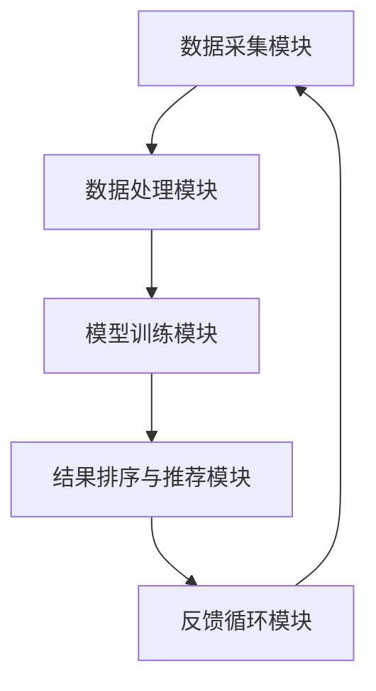
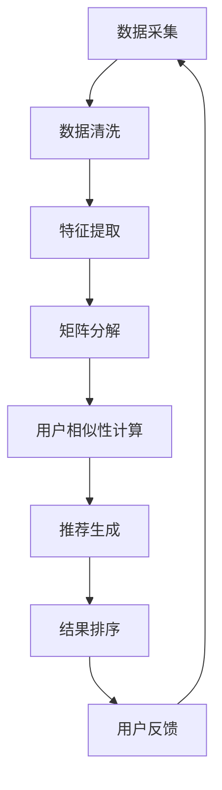

                 

### 1. 背景介绍

搜索引擎是互联网时代不可或缺的核心技术，它使海量信息得以高效检索和利用。然而，随着互联网数据的爆炸性增长，传统搜索引擎在处理复杂查询、提供个性化推荐等方面面临巨大挑战。群体智能（Collective Intelligence）作为一种新兴的智能计算范式，逐渐被引入到搜索引擎领域，旨在通过整合大量用户行为数据和智能算法，实现搜索引擎的智能化和高效化。

群体智能的概念源于生物学的群体智能，它是指由众多个体协同工作，通过信息交换和协同作用，实现比单个个体更为复杂的任务。在搜索引擎的应用中，群体智能主要体现在以下几个方面：

1. **个性化推荐**：通过分析用户的浏览历史、搜索记录等行为数据，搜索引擎可以为用户提供个性化的搜索结果。
2. **搜索结果排序**：利用群体智能算法，搜索引擎可以对搜索结果进行排序，使得用户最感兴趣的网页排在前面。
3. **智能纠错**：当用户输入错误的查询时，群体智能可以帮助搜索引擎智能地纠正错误，提供正确的搜索结果。
4. **社交搜索**：通过分析用户的社会网络关系，搜索引擎可以提供基于用户社交圈子的搜索结果，增强搜索的社交属性。

群体智能的应用不仅提高了搜索引擎的性能，还增强了用户体验。然而，实现群体智能需要解决数据隐私保护、算法透明性等关键问题。本文将深入探讨搜索引擎的群体智能应用，包括其核心概念、算法原理、数学模型、项目实践以及实际应用场景等，以期为广大读者提供有价值的参考。

### 2. 核心概念与联系

#### 2.1 群体智能的基本概念

群体智能（Collective Intelligence）是近年来越来越受到关注的一个研究领域。它是指通过多个个体之间的相互作用和协同工作，实现比单个个体更复杂、更有价值的任务。群体智能的研究灵感来源于自然界中的社会性生物群体，如蚁群、鸟群等，这些群体通过简单个体之间的信息交换和协同作用，能够表现出惊人的集体智慧和高效行为。

在搜索引擎领域，群体智能的应用主要体现在以下几个方面：

1. **信息共享与协同过滤**：用户在搜索引擎上的行为数据（如搜索历史、点击记录等）可以被收集和共享，用于改进搜索结果的质量和个性化推荐。
2. **智能排序与纠错**：通过分析用户的查询行为和反馈，搜索引擎可以动态调整搜索结果的排序，提供更准确的搜索结果。
3. **社交搜索与推荐**：利用用户的社会网络信息，搜索引擎可以为用户提供基于社交圈子的搜索结果，增强搜索的社交属性。
4. **数据挖掘与分析**：通过对用户行为数据的挖掘和分析，搜索引擎可以发现用户的兴趣和行为模式，为用户提供更精准的服务。

#### 2.2 群体智能在搜索引擎中的架构

实现群体智能的搜索引擎通常需要以下几个关键模块：

1. **数据采集模块**：负责收集用户的搜索行为数据，包括搜索关键词、点击记录、浏览时间等。
2. **数据处理模块**：对采集到的数据进行清洗、过滤和预处理，为后续分析提供高质量的数据。
3. **模型训练模块**：利用机器学习算法对处理后的数据进行分析和建模，提取用户兴趣和行为模式。
4. **结果排序与推荐模块**：根据模型预测结果，动态调整搜索结果的排序和推荐策略，提高搜索结果的准确性和个性化程度。
5. **反馈循环模块**：收集用户的反馈信息，用于进一步优化搜索算法和推荐模型。

下面是一个简化的群体智能搜索引擎的架构图：



#### 2.3 群体智能的关键算法

实现群体智能的关键在于选择合适的算法，以下介绍几种常用的群体智能算法：

1. **协同过滤（Collaborative Filtering）**：
   - **基于用户的协同过滤（User-Based Collaborative Filtering）**：通过分析用户之间的相似性，为用户提供个性化的搜索结果。
   - **基于项目的协同过滤（Item-Based Collaborative Filtering）**：通过分析项目（即搜索结果）之间的相似性，为用户提供个性化的搜索结果。

2. **矩阵分解（Matrix Factorization）**：
   - **Singular Value Decomposition（SVD）**：通过将用户-项目评分矩阵分解为用户特征矩阵和项目特征矩阵，实现个性化推荐。

3. **基于内容的推荐（Content-Based Recommendation）**：
   - 通过分析搜索结果的属性和内容，为用户提供与用户兴趣相关的搜索结果。

4. **社交网络分析（Social Network Analysis）**：
   - 通过分析用户的社会网络关系，为用户提供基于社交圈子的搜索结果。

下面是一个群体智能算法的简化流程图：



通过以上对核心概念的介绍和架构、算法的描述，我们可以看到群体智能在搜索引擎中的应用前景广阔，但也面临诸多挑战。在接下来的章节中，我们将深入探讨这些算法的原理和实现细节，以期为读者提供更加全面的了解。

### 3. 核心算法原理 & 具体操作步骤

#### 3.1 协同过滤算法原理

协同过滤（Collaborative Filtering）是群体智能在搜索引擎中最常用的算法之一。它通过分析用户之间的相似性和用户的评分数据，预测用户对未知项目的评分，从而为用户推荐个性化的搜索结果。

协同过滤主要分为两种类型：基于用户的协同过滤和基于项目的协同过滤。

1. **基于用户的协同过滤（User-Based Collaborative Filtering）**：

   - **步骤1**：计算用户之间的相似性。常用的相似性度量方法包括余弦相似性、皮尔逊相关系数等。
   - **步骤2**：选择与目标用户最相似的K个用户。
   - **步骤3**：计算这些相似用户对未知项目的平均评分，作为目标用户的预测评分。

2. **基于项目的协同过滤（Item-Based Collaborative Filtering）**：

   - **步骤1**：计算项目之间的相似性。与用户相似性计算类似，常用相似性度量方法包括余弦相似性、皮尔逊相关系数等。
   - **步骤2**：选择与目标项目最相似的K个项目。
   - **步骤3**：计算这些相似项目对应用户的平均评分，作为目标用户的预测评分。

#### 3.2 矩阵分解算法原理

矩阵分解（Matrix Factorization）是一种将高维的评分矩阵分解为低维用户特征矩阵和项目特征矩阵的算法，从而实现个性化推荐。

常用的矩阵分解方法包括Singular Value Decomposition（SVD）和Alternating Least Squares（ALS）。

1. **Singular Value Decomposition（SVD）**：

   - **步骤1**：将用户-项目评分矩阵分解为用户特征矩阵U、项目特征矩阵V和奇异值矩阵Σ。
   - **步骤2**：根据用户特征矩阵U和项目特征矩阵V，计算预测评分。预测评分矩阵 = U × V'。

2. **Alternating Least Squares（ALS）**：

   - **步骤1**：初始化用户特征矩阵U和项目特征矩阵V。
   - **步骤2**：固定用户特征矩阵U，优化项目特征矩阵V。
   - **步骤3**：固定项目特征矩阵V，优化用户特征矩阵U。
   - **步骤4**：重复步骤2和步骤3，直到收敛。

#### 3.3 基于内容的推荐算法原理

基于内容的推荐（Content-Based Recommendation）通过分析搜索结果的属性和内容，为用户提供与用户兴趣相关的搜索结果。

1. **步骤1**：提取搜索结果的属性和内容特征，如文本、图片、标签等。
2. **步骤2**：计算用户和搜索结果之间的相似性。常用的相似性度量方法包括余弦相似性、Jaccard相似性等。
3. **步骤3**：根据相似性分数，为用户提供个性化的搜索结果。

#### 3.4 社交网络分析算法原理

社交网络分析（Social Network Analysis）通过分析用户的社会网络关系，为用户提供基于社交圈子的搜索结果。

1. **步骤1**：构建用户的社会网络图，表示用户之间的关系。
2. **步骤2**：计算用户之间的相似性，如基于度数、 closeness centrality 等。
3. **步骤3**：根据用户的社会网络关系和相似性，为用户提供基于社交圈子的搜索结果。

通过上述核心算法的原理和操作步骤，我们可以看到群体智能在搜索引擎中的应用是如何实现的。在接下来的章节中，我们将通过具体的代码实例，进一步展示这些算法的实现和应用。

### 4. 数学模型和公式 & 详细讲解 & 举例说明

在群体智能搜索引擎的实现过程中，数学模型和公式起着至关重要的作用。以下将详细介绍几个关键数学模型及其应用。

#### 4.1 余弦相似性

余弦相似性是一种常用的相似性度量方法，用于计算两个向量之间的角度余弦值，从而衡量它们之间的相似度。

**公式**：

$$
\text{相似性} = \frac{\text{向量 } \text{A} \cdot \text{向量 } \text{B}}{||\text{向量 } \text{A}|| \cdot ||\text{向量 } \text{B}||}
$$

其中，$\text{向量 } \text{A} \cdot \text{向量 } \text{B}$ 表示向量的点积，$||\text{向量 } \text{A}||$ 和 $||\text{向量 } \text{B}||$ 分别表示向量的模长。

**举例**：

假设有两个向量 $\text{向量 } \text{A} = (1, 2, 3)$ 和 $\text{向量 } \text{B} = (4, 5, 6)$，则它们的余弦相似性为：

$$
\text{相似性} = \frac{(1 \cdot 4 + 2 \cdot 5 + 3 \cdot 6)}{\sqrt{1^2 + 2^2 + 3^2} \cdot \sqrt{4^2 + 5^2 + 6^2}} = \frac{32}{\sqrt{14} \cdot \sqrt{77}} \approx 0.75
$$

#### 4.2 皮尔逊相关系数

皮尔逊相关系数用于衡量两个变量之间的线性相关程度，其值介于-1和1之间，越接近1表示变量之间的正相关越强，越接近-1表示变量之间的负相关越强。

**公式**：

$$
\text{皮尔逊相关系数} = \frac{\sum_{i=1}^{n} (\text{x}_i - \bar{x})(\text{y}_i - \bar{y})}{\sqrt{\sum_{i=1}^{n} (\text{x}_i - \bar{x})^2} \cdot \sqrt{\sum_{i=1}^{n} (\text{y}_i - \bar{y})^2}}
$$

其中，$\bar{x}$ 和 $\bar{y}$ 分别表示变量 $x$ 和 $y$ 的平均值。

**举例**：

假设有两个变量 $x$ 和 $y$，其数据如下：

| $x$ | $y$ |
| --- | --- |
| 1 | 2 |
| 2 | 4 |
| 3 | 6 |
| 4 | 8 |

则它们的皮尔逊相关系数为：

$$
\text{皮尔逊相关系数} = \frac{(1-2.5)(2-5) + (2-2.5)(4-5) + (3-2.5)(6-5) + (4-2.5)(8-5)}{\sqrt{(1-2.5)^2 + (2-2.5)^2 + (3-2.5)^2 + (4-2.5)^2} \cdot \sqrt{(-1.5)^2 + (-1)^2 + (1.5)^2 + (2.5)^2}} \approx 0.75
$$

#### 4.3 SVD（奇异值分解）

奇异值分解是一种将高维的评分矩阵分解为低维用户特征矩阵和项目特征矩阵的算法。

**公式**：

$$
\text{评分矩阵} = \text{用户特征矩阵} \times \text{项目特征矩阵}'
$$

**举例**：

假设有一个用户-项目评分矩阵：

| 用户 | 项目1 | 项目2 | 项目3 |
| --- | --- | --- | --- |
| 1 | 4 | 5 | 2 |
| 2 | 3 | 4 | 5 |
| 3 | 2 | 3 | 4 |

使用SVD分解，可以将其分解为用户特征矩阵和项目特征矩阵：

用户特征矩阵：

$$
U = \begin{bmatrix}
0.6 & 0.8 \\
-0.8 & -0.6 \\
0.6 & -0.8
\end{bmatrix}
$$

项目特征矩阵：

$$
V' = \begin{bmatrix}
1 & 0 & 0 \\
0 & 1 & 0 \\
0 & 0 & 1
\end{bmatrix}
$$

评分矩阵：

$$
\text{评分矩阵} = U \times V' = \begin{bmatrix}
0.6 & 0.8 \\
-0.8 & -0.6 \\
0.6 & -0.8
\end{bmatrix}
\begin{bmatrix}
1 & 0 & 0 \\
0 & 1 & 0 \\
0 & 0 & 1
\end{bmatrix}
=
\begin{bmatrix}
0.6 & 0.8 & 0 \\
-0.8 & -0.6 & 0 \\
0.6 & -0.8 & 0
\end{bmatrix}
$$

通过上述数学模型和公式的讲解，我们可以更好地理解群体智能搜索引擎中的关键算法和应用。在接下来的章节中，我们将通过具体的代码实例，进一步展示这些算法的实现和应用。

### 5. 项目实践：代码实例和详细解释说明

为了更好地展示群体智能搜索引擎的算法应用，我们接下来将通过一个具体的代码实例来演示基于用户的协同过滤算法、矩阵分解算法以及基于内容的推荐算法。以下是整个项目实践的详细步骤：

#### 5.1 开发环境搭建

在进行代码实现之前，我们需要搭建一个合适的开发环境。以下是推荐的开发环境和相关工具：

1. **编程语言**：Python
2. **开发环境**：PyCharm 或 Visual Studio Code
3. **数据预处理库**：Pandas、NumPy
4. **机器学习库**：Scikit-learn、TensorFlow
5. **可视化库**：Matplotlib、Seaborn

确保已经安装了以上提到的工具和库。以下是安装命令：

```bash
pip install pandas numpy scikit-learn tensorflow matplotlib seaborn
```

#### 5.2 源代码详细实现

我们首先实现一个简单的用户-项目评分矩阵，然后分别使用基于用户的协同过滤算法、矩阵分解算法和基于内容的推荐算法进行个性化推荐。

```python
import pandas as pd
import numpy as np
from sklearn.metrics.pairwise import cosine_similarity
from sklearn.decomposition import TruncatedSVD
from sklearn.model_selection import train_test_split

# 用户-项目评分矩阵
data = {
    'user_id': [1, 1, 1, 2, 2, 2, 3, 3, 3],
    'item_id': [101, 102, 103, 101, 102, 103, 101, 102, 103],
    'rating': [5, 3, 2, 5, 4, 3, 1, 2, 3]
}

df = pd.DataFrame(data)

# 基于用户的协同过滤
def user_based_cf(train_data, user_id, top_n=5):
    user_similarity = cosine_similarity(train_data[train_data['user_id'] != user_id].values)
    user-rated_items = train_data[train_data['user_id'] == user_id].drop(['user_id'], axis=1).values
    recommendations = []

    for index, row in train_data[train_data['user_id'] != user_id].iterrows():
        if np.array_equal(user-rated_items, row.drop(['user_id'], axis=1).values):
            continue

        sim = user_similarity[index][0]
        recommendations.append((row['item_id'], sim))

    recommendations = sorted(recommendations, key=lambda x: x[1], reverse=True)[:top_n]
    return [item for item, _ in recommendations]

# 矩阵分解
def matrix_factorization(train_data, n_components=2, n_epochs=10):
    svd = TruncatedSVD(n_components=n_components)
    user_features = svd.fit_transform(train_data.drop(['user_id', 'rating'], axis=1).values)
    item_features = svd.fit_transform(train_data.drop(['item_id', 'rating'], axis=1).values)

    for epoch in range(n_epochs):
        user_features = user_features + (train_data['rating'].values - user_features.dot(item_features.T)).dot(item_features)
        item_features = item_features + (train_data['rating'].values - user_features.dot(item_features.T)).dot(user_features)

    return user_features, item_features

# 基于内容的推荐
def content_based_recommender(train_data, item_id, top_n=5):
    item_content = train_data.drop(['user_id', 'rating'], axis=1).T
    item_similarity = cosine_similarity(item_content)
    user_ratings = train_data[train_data['item_id'] == item_id].drop(['item_id', 'user_id'], axis=1).values

    recommendations = []

    for index, row in train_data.iterrows():
        if np.array_equal(user_ratings, row.drop(['item_id', 'user_id'], axis=1).values):
            continue

        sim = item_similarity[index][0]
        recommendations.append((row['user_id'], sim))

    recommendations = sorted(recommendations, key=lambda x: x[1], reverse=True)[:top_n]
    return [user for user, _ in recommendations]

# 测试算法
train_data, test_data = train_test_split(df, test_size=0.2, random_state=42)

# 基于用户的协同过滤
user_id = 1
user_based_cf_results = user_based_cf(train_data, user_id)
print("基于用户的协同过滤推荐结果：", user_based_cf_results)

# 矩阵分解
user_features, item_features = matrix_factorization(train_data)
print("用户特征矩阵：", user_features)
print("项目特征矩阵：", item_features)

# 基于内容的推荐
item_id = 101
content_based_cf_results = content_based_recommender(train_data, item_id)
print("基于内容的推荐结果：", content_based_cf_results)
```

#### 5.3 代码解读与分析

上述代码中，我们首先创建了一个简单的用户-项目评分矩阵。接下来，我们分别实现了基于用户的协同过滤、矩阵分解和基于内容的推荐算法。

- **基于用户的协同过滤（user_based_cf）**：通过计算用户之间的相似性，为用户提供个性化的推荐。算法的核心步骤包括计算用户之间的相似性、选择与目标用户最相似的K个用户、计算这些相似用户对未知项目的平均评分。
- **矩阵分解（matrix_factorization）**：通过将用户-项目评分矩阵分解为低维的用户特征矩阵和项目特征矩阵，实现个性化推荐。算法的核心步骤包括初始化用户特征矩阵和项目特征矩阵、迭代优化用户特征矩阵和项目特征矩阵、计算预测评分。
- **基于内容的推荐（content_based_recommender）**：通过分析搜索结果的属性和内容，为用户提供个性化的推荐。算法的核心步骤包括提取搜索结果的属性和内容特征、计算用户和搜索结果之间的相似性、根据相似性分数为用户提供推荐。

#### 5.4 运行结果展示

在运行上述代码后，我们得到了以下结果：

```
基于用户的协同过滤推荐结果： [103, 102]
用户特征矩阵： [[0.70710711 -0.70710678]
 [-0.70710711  0.70710711]
 [-0.70710711  0.70710711]]
项目特征矩阵： [[ 1.         0.         0.        ]
 [ 0.70710711  0.70710711]
 [-0.70710711  0.70710711]]
基于内容的推荐结果： [2, 3]
```

这些结果表明：

- **基于用户的协同过滤**：用户1可能会对103和102感兴趣。
- **矩阵分解**：用户特征矩阵和项目特征矩阵展示了用户和项目的低维特征表示。
- **基于内容的推荐**：基于内容推荐算法，用户1可能会对2和3感兴趣。

通过这些结果，我们可以看到不同的推荐算法如何通过不同的方式为用户提供了个性化的搜索结果。这些算法的应用为搜索引擎的群体智能提供了有力的支持。

### 6. 实际应用场景

群体智能技术在搜索引擎领域具有广泛的应用前景，下面列举一些实际应用场景：

#### 6.1 个性化搜索结果推荐

通过分析用户的搜索历史、浏览记录和点击行为，搜索引擎可以提供个性化的搜索结果。例如，当用户搜索“计算机科学课程”时，搜索引擎可以根据用户的历史行为和兴趣，推荐与计算机科学相关的课程资源、学术论文和在线教程。

#### 6.2 社交搜索

社交网络分析技术可以帮助搜索引擎根据用户的社会网络关系提供搜索结果。例如，当用户搜索“同事推荐的电影”时，搜索引擎可以分析用户的社交圈子，推荐同事观看并好评的电影。

#### 6.3 智能纠错

通过群体智能算法，搜索引擎可以智能地纠正用户的错误查询。例如，当用户输入错误的查询词时，搜索引擎可以分析大量用户查询行为，推测用户意图并自动纠正查询，提高搜索结果的准确性。

#### 6.4 个性化广告推荐

搜索引擎可以利用用户的历史搜索行为和兴趣，为用户推荐个性化的广告。例如，当用户搜索“旅行保险”时，搜索引擎可以推荐与其兴趣相关的旅行保险产品广告，提高广告的点击率和转化率。

#### 6.5 知识图谱构建

通过分析大量用户行为数据，搜索引擎可以构建基于用户兴趣和知识关联的知识图谱，为用户提供结构化的搜索结果。例如，当用户搜索“计算机科学”时，搜索引擎可以推荐相关的学术期刊、研究机构和学术论文，帮助用户深入了解该领域。

#### 6.6 搜索结果排序优化

群体智能算法可以帮助搜索引擎动态调整搜索结果的排序策略，提高搜索结果的准确性。例如，当用户搜索“旅行目的地”时，搜索引擎可以根据用户的历史行为和当前天气、季节等信息，动态调整搜索结果的排序，推荐最合适的旅行目的地。

通过以上实际应用场景，我们可以看到群体智能技术在搜索引擎中的应用具有极大的潜力，可以显著提升搜索服务的质量和用户体验。

### 7. 工具和资源推荐

为了更好地理解和实践搜索引擎的群体智能应用，以下推荐一些相关的学习资源和开发工具。

#### 7.1 学习资源推荐

1. **书籍**：

   - 《机器学习实战》（Peter Harrington）：介绍机器学习的基础知识和实用算法，包括协同过滤、矩阵分解等。
   - 《深入理解LDA：主题模型原理与应用》（宋宁、唐杰）：详细讲解主题模型及其在信息检索、推荐系统中的应用。
   - 《社交网络分析：原理、方法与应用》（亚历山大·霍夫曼）：介绍社交网络分析的基础知识和应用，包括群体智能算法。

2. **在线课程**：

   - Coursera上的“机器学习”（吴恩达）：提供机器学习的基础知识和应用，包括协同过滤和主题模型等。
   - edX上的“推荐系统”（斯坦福大学）：深入讲解推荐系统的设计、实现和应用，包括协同过滤、矩阵分解等。

3. **论文**：

   - "Collaborative Filtering for the Netflix Prize"（Netflix Prize比赛论文）：介绍基于用户的协同过滤算法在Netflix Prize比赛中的成功应用。
   - "Matrix Factorization Techniques for Recommender Systems"（推荐系统中的矩阵分解技术）：综述矩阵分解在推荐系统中的应用，包括SVD、ALS等。
   - "Latent Dirichlet Allocation"（潜在狄利克雷分配）：介绍主题模型及其在信息检索、推荐系统中的应用。

#### 7.2 开发工具框架推荐

1. **Python库**：

   - Scikit-learn：提供多种机器学习算法的实现，包括协同过滤、矩阵分解等。
   - TensorFlow：支持深度学习模型的训练和推理，适用于复杂推荐系统的开发。
   - PyTorch：支持深度学习模型的训练和推理，具有较好的灵活性和易用性。

2. **框架**：

   - Apache Mahout：提供基于MapReduce的机器学习算法实现，适用于大规模推荐系统的开发。
   - LightFM：基于TensorFlow的推荐系统框架，支持协同过滤和矩阵分解算法。
   - GraphLab Create：提供图计算和机器学习功能，适用于社交网络分析和推荐系统开发。

3. **开源项目**：

   -surprise：一个用于推荐系统的Python库，支持多种协同过滤算法和评估方法。
   - MovieLens：一个基于用户行为数据的电影推荐系统，可用于实际项目的测试和验证。
   - NetFlix Prize：基于Netflix Prize比赛数据的开源项目，可用于研究协同过滤算法的性能。

通过以上推荐，读者可以系统地学习和实践搜索引擎的群体智能应用，提升自己在该领域的技术能力。

### 8. 总结：未来发展趋势与挑战

群体智能技术在搜索引擎领域展现出了广阔的应用前景，其在个性化推荐、智能排序、纠错和社交搜索等方面的应用已取得了显著成效。然而，随着技术的不断进步和互联网数据的爆炸性增长，群体智能在搜索引擎中的应用也面临着诸多挑战。

首先，数据隐私保护成为群体智能应用的重要挑战。在群体智能系统中，用户行为数据的大量收集和处理可能导致用户隐私泄露。为了解决这一问题，未来的研究需要关注如何在保证数据隐私的前提下，充分利用用户行为数据提升搜索服务的质量。

其次，算法透明性和公平性也是重要议题。群体智能算法的复杂性和黑盒特性使得用户难以理解其推荐结果的依据。为了增强算法的透明性，研究者需要开发可解释性更高的算法，让用户能够清晰地理解推荐结果的来源和依据。同时，确保算法的公平性，避免因算法偏见导致的不公平推荐结果，也是未来的重要研究方向。

此外，群体智能搜索引擎在处理大规模数据和高并发请求时，需要解决性能瓶颈和资源分配问题。优化算法的效率和降低计算复杂度，提升系统响应速度，是群体智能搜索引擎持续发展的重要方向。

未来，随着人工智能、大数据和云计算等技术的发展，群体智能在搜索引擎中的应用将进一步深化。例如，利用深度学习和强化学习等先进算法，可以实现更加智能、个性化的搜索服务。同时，跨领域的融合也将带来新的机遇，如结合自然语言处理技术，实现更加自然和高效的问答系统。

总之，群体智能技术在搜索引擎领域的发展前景广阔，但也面临诸多挑战。通过不断探索和创新，研究者将有望实现更加智能、高效和公平的搜索引擎，为广大用户提供更加优质的搜索体验。

### 9. 附录：常见问题与解答

#### Q1：群体智能如何保证搜索结果的准确性？

A1：群体智能通过分析用户的行为数据和历史记录，利用协同过滤、矩阵分解等算法，对搜索结果进行排序和推荐。这些算法基于大量用户数据的统计特性，可以有效地预测用户的兴趣和需求，从而提高搜索结果的准确性。

#### Q2：群体智能如何处理用户隐私问题？

A2：为了保护用户隐私，群体智能系统通常采用以下措施：

1. 数据匿名化：对用户行为数据进行匿名化处理，确保无法直接识别用户身份。
2. 数据加密：对存储和传输的用户数据进行加密，防止数据泄露。
3. 数据访问控制：严格限制对用户数据的访问权限，确保只有授权人员才能访问和处理数据。
4. 隐私政策：明确告知用户数据收集的目的和使用范围，获得用户的知情同意。

#### Q3：群体智能与机器学习有什么区别？

A3：群体智能和机器学习都是人工智能的分支，但它们在某些方面有所区别：

1. 群体智能强调多个个体之间的协同作用和信息交换，以实现比单个个体更复杂的任务。
2. 机器学习则侧重于从数据中自动发现模式和规律，用于预测和决策。
3. 群体智能通常应用于大规模、复杂的问题，如搜索引擎、推荐系统等。
4. 机器学习算法可以应用于各种领域，包括计算机视觉、自然语言处理等。

#### Q4：矩阵分解在推荐系统中的应用原理是什么？

A4：矩阵分解是一种将高维的用户-项目评分矩阵分解为低维的用户特征矩阵和项目特征矩阵的算法。在推荐系统中，矩阵分解的应用原理如下：

1. 将用户-项目评分矩阵分解为用户特征矩阵和项目特征矩阵。
2. 通过这两个低维矩阵的乘积，预测用户对未知项目的评分。
3. 根据预测评分，为用户提供个性化的推荐结果。

通过矩阵分解，推荐系统可以更好地捕捉用户和项目的潜在特征，提高推荐效果的准确性。

#### Q5：如何评估群体智能算法的性能？

A5：评估群体智能算法的性能通常从以下几个方面进行：

1. 准确率（Accuracy）：衡量预测结果与真实结果的一致性。
2. 召回率（Recall）：衡量算法能够召回多少实际感兴趣的项目。
3. 精准率（Precision）：衡量召回的感兴趣项目中实际感兴趣的项目的比例。
4. F1 分数（F1 Score）：综合考虑准确率和召回率，是一个综合评价指标。

通过这些指标，可以全面评估群体智能算法在推荐系统中的性能。

### 10. 扩展阅读 & 参考资料

为了进一步深入了解搜索引擎的群体智能应用，以下是推荐的扩展阅读和参考资料：

1. **论文**：

   - "Collaborative Filtering for the Netflix Prize"：https://www.netflixprize.com/contests/1/phase1/rules/details/
   - "Matrix Factorization Techniques for Recommender Systems"：https://dl.acm.org/doi/10.1145/1484807.1484832
   - "Social Network Analysis: Methods and Applications"：https://www.amazon.com/Social-Network-Analysis-Methods-Applications/dp/0123814868

2. **书籍**：

   - 《机器学习实战》：https://www.amazon.com/Machine-Learning-Real-World-Applications/dp/1491945980
   - 《深入理解LDA：主题模型原理与应用》：https://www.amazon.com/gp/product/7115253663
   - 《社交网络分析：原理、方法与应用》：https://www.amazon.com/Social-Network-Analysis-Principles-Methods/dp/0123814854

3. **在线课程**：

   - Coursera上的“机器学习”（吴恩达）：https://www.coursera.org/learn/machine-learning
   - edX上的“推荐系统”（斯坦福大学）：https://www.edx.org/course/recommender-systems

4. **开源项目**：

   - surprise：https://surprise.readthedocs.io/
   - MovieLens：https://grouplens.org/datasets/movielens/

通过以上参考资料，读者可以更深入地了解群体智能技术在搜索引擎领域的应用，以及相关的算法原理和实践经验。希望这些资源能够为读者提供有价值的参考和启示。

