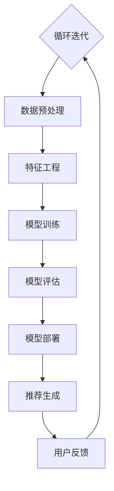
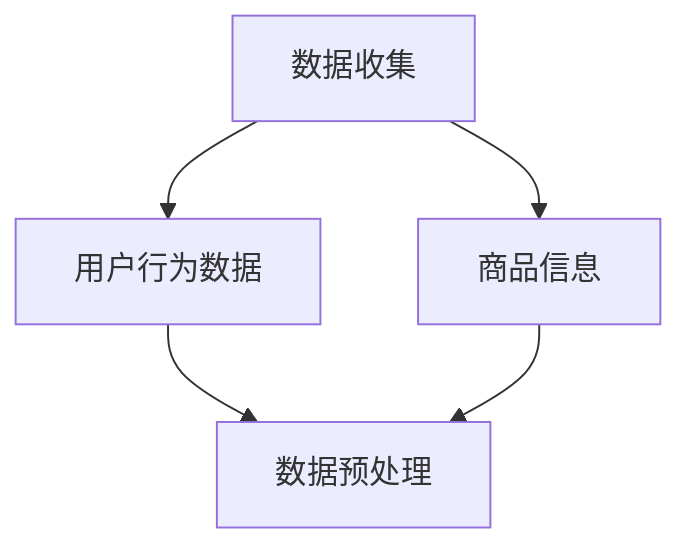
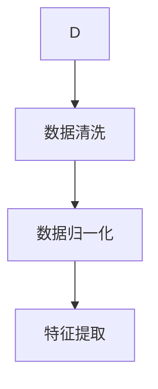
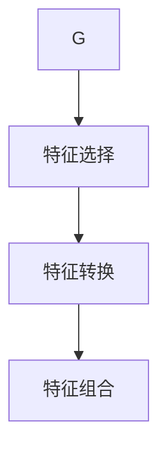
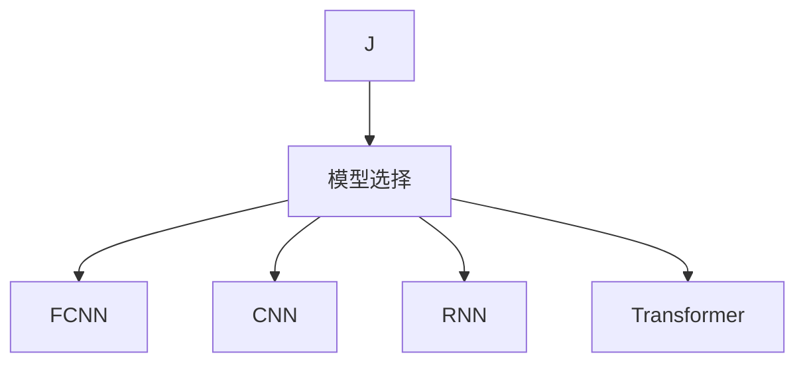
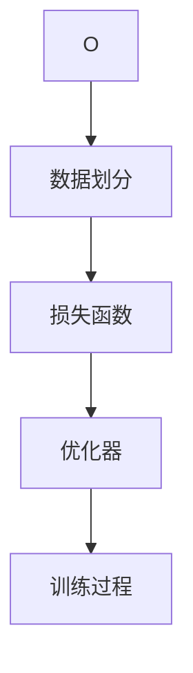
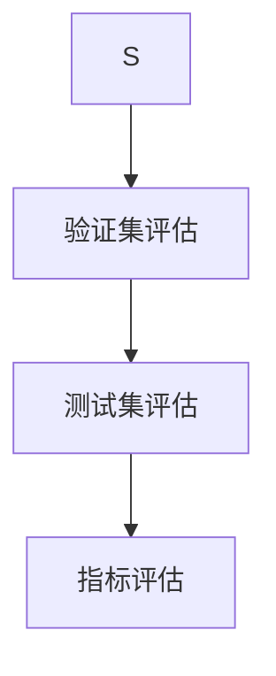
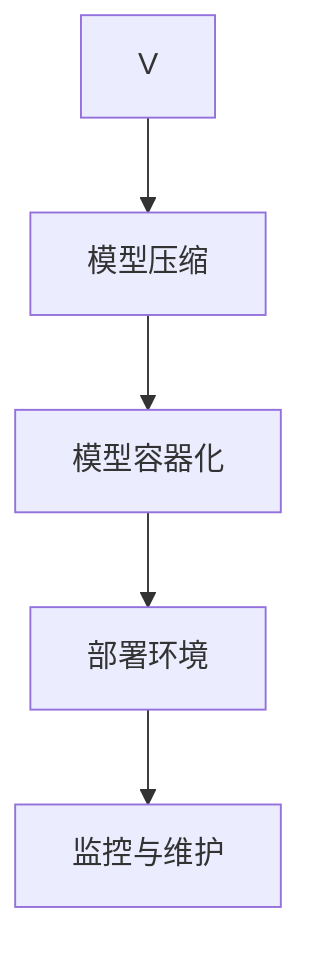

                 

### 1. 背景介绍

搜索推荐系统是电商平台的核心竞争力之一，它通过个性化推荐的方式，提高了用户在平台上的留存率和购买转化率。近年来，随着人工智能技术的迅猛发展，尤其是大模型（AI 大模型）的兴起，搜索推荐系统迎来了新的机遇和挑战。

大模型，尤其是深度学习模型，具有处理大规模数据、捕捉复杂关系和自适应调整的能力。它通过大量数据进行训练，可以自动学习用户行为模式、偏好和需求，从而提供更加精准的推荐结果。这使得大模型在搜索推荐系统中扮演了至关重要的角色，不仅提升了推荐的准确性和多样性，还为电商平台带来了巨大的商业价值。

然而，大模型的引入也带来了一系列的挑战。首先，大模型的训练和部署成本非常高，需要大量的计算资源和时间。其次，大模型的黑盒性质使得其决策过程不够透明，增加了对模型解释性的需求。此外，如何在保证推荐效果的同时，保护用户隐私和数据安全，也是搜索推荐系统面临的重大挑战。

为了应对这些挑战，本文将从以下几个方面展开讨论：

1. **核心概念与联系**：介绍搜索推荐系统中的核心概念和组成部分，如用户行为数据、商品信息、推荐算法等，并通过 Mermaid 流程图展示系统架构。
2. **核心算法原理 & 具体操作步骤**：详细解析大模型在搜索推荐系统中的应用原理，包括特征工程、模型选择、训练与优化等具体步骤。
3. **数学模型和公式 & 详细讲解 & 举例说明**：阐述大模型背后的数学模型，如神经网络、矩阵分解、协同过滤等，并举例说明其在实际应用中的效果。
4. **项目实践：代码实例和详细解释说明**：通过实际项目案例，展示大模型在搜索推荐系统中的具体实现过程，包括开发环境搭建、源代码实现、代码解读与分析等。
5. **实际应用场景**：分析大模型在电商搜索推荐系统中的应用场景，如个性化搜索、商品推荐、用户行为分析等。
6. **工具和资源推荐**：推荐相关的学习资源、开发工具和框架，帮助读者深入了解和掌握搜索推荐系统和 AI 大模型。
7. **总结：未来发展趋势与挑战**：总结大模型在搜索推荐系统中的优势和挑战，展望未来的发展趋势。

通过以上七个方面的详细探讨，本文旨在为读者提供一幅全面的搜索推荐系统和 AI 大模型的融合图景，帮助电商平台在激烈的市场竞争中实现转型升级。

### 1.1 大模型与搜索推荐系统的关系

大模型与搜索推荐系统之间的关系，可以说是相辅相成、密不可分的。大模型的出现，为搜索推荐系统带来了前所未有的变革，而搜索推荐系统的需求，又不断推动大模型技术的发展。

首先，大模型为搜索推荐系统提供了强大的数据处理能力。传统的推荐系统依赖于用户行为数据、商品信息和简单的算法模型，如协同过滤和矩阵分解等。这些方法虽然在一定程度上能够满足推荐需求，但受限于算法的复杂度和数据规模，难以捕捉用户行为的深层模式和复杂关系。

大模型的出现，改变了这一局面。深度学习算法，尤其是基于神经网络的模型，具有强大的自适应学习和特征提取能力。通过大规模数据训练，大模型能够自动识别用户行为中的潜在模式和偏好，从而提供更加精准的推荐结果。

其次，大模型提高了搜索推荐系统的推荐效果和多样性。在传统的推荐系统中，推荐结果往往存在偏差，容易陷入“热门推荐”或“负面反馈”的困境。而大模型通过引入注意力机制、生成对抗网络等先进技术，能够在保证推荐效果的同时，提高推荐的多样性和创新性。

此外，大模型还解决了推荐系统的解释性问题。传统的推荐系统，由于算法的复杂性，难以解释推荐结果的产生原因。而大模型，通过可解释性技术，如模型可视化、注意力机制等，使得推荐结果的决策过程更加透明，有助于提升用户信任度和满意度。

然而，大模型的引入也带来了一系列的挑战。首先，大模型的训练和部署成本非常高。深度学习模型通常需要大量的计算资源和时间进行训练，尤其是在处理大规模数据时，这无疑增加了企业的运营成本。

其次，大模型的黑盒性质使得其决策过程不够透明，增加了对模型解释性的需求。虽然近年来出现了许多可解释性技术，如模型可视化、注意力机制等，但如何在实际应用中有效地利用这些技术，仍然是一个亟待解决的问题。

最后，如何在保证推荐效果的同时，保护用户隐私和数据安全，也是搜索推荐系统面临的重大挑战。大模型需要处理大量的用户数据，包括行为数据、浏览记录等。如何在数据处理过程中确保用户隐私不被泄露，是每个电商平台都需要考虑的问题。

总之，大模型与搜索推荐系统之间的关系，既有机遇，也充满挑战。通过深入探讨大模型在搜索推荐系统中的应用原理、实现方法和实践案例，本文旨在为读者提供一幅全面的搜索推荐系统和 AI 大模型的融合图景，帮助电商平台在激烈的市场竞争中实现转型升级。

### 1.2 搜索推荐系统的发展历程

搜索推荐系统的发展历程可以追溯到20世纪90年代，随着互联网的普及和电子商务的兴起，推荐系统开始成为电商平台的核心竞争力之一。从早期的基于内容推荐的协同过滤算法，到如今基于深度学习的大模型推荐，搜索推荐系统经历了数次技术革新和理念变革。

**1.2.1 协同过滤阶段**

协同过滤（Collaborative Filtering）是早期推荐系统的主要方法之一。协同过滤通过分析用户之间的相似度，将具有相似兴趣的用户和物品进行匹配，从而预测用户可能感兴趣的物品。协同过滤可以分为两种类型：基于用户的协同过滤（User-Based）和基于物品的协同过滤（Item-Based）。

- **基于用户的协同过滤**：该方法通过计算用户之间的相似度，找到相似用户，然后推荐这些用户喜欢的物品给目标用户。计算相似度的方法包括余弦相似度、皮尔逊相关系数等。

- **基于物品的协同过滤**：该方法通过计算物品之间的相似度，找到相似物品，然后推荐这些物品给目标用户。物品相似度的计算方法包括基于内容的相似度和基于邻居的相似度。

虽然协同过滤方法在早期的推荐系统中取得了一定的成功，但其局限性也逐渐显现。协同过滤依赖于用户评分数据，而在实际应用中，用户评分数据往往不够全面和准确，导致推荐效果受到限制。

**1.2.2 矩阵分解阶段**

为了克服协同过滤的局限性，矩阵分解（Matrix Factorization）方法应运而生。矩阵分解通过将用户-物品评分矩阵分解为两个低维矩阵，从而提取用户和物品的潜在特征。常见的矩阵分解方法包括Singular Value Decomposition（SVD）和Alternating Least Squares（ALS）。

- **Singular Value Decomposition（SVD）**：SVD是一种数学分解方法，将原始评分矩阵分解为用户特征矩阵和物品特征矩阵的乘积。通过这种方式，SVD可以有效地降低维度，并提取用户和物品的潜在特征。

- **Alternating Least Squares（ALS）**：ALS是一种迭代优化算法，通过交替最小化用户特征矩阵和物品特征矩阵的误差，逐步优化两个矩阵，从而得到更准确的推荐结果。

矩阵分解方法在推荐系统中取得了一定的成功，但其仍然存在一些问题，如冷启动问题（即新用户或新物品无法获得足够的推荐）和稀疏数据问题。

**1.2.3 深度学习阶段**

随着深度学习技术的迅猛发展，搜索推荐系统进入了深度学习阶段。深度学习模型，尤其是基于神经网络的模型，具有强大的自适应学习和特征提取能力，为推荐系统带来了新的机遇。

- **基于神经网络的协同过滤**：该方法将协同过滤和深度学习相结合，通过构建神经网络模型，将用户行为数据映射到低维空间，从而实现更加精准的推荐。

- **生成对抗网络（GAN）**：GAN是一种无监督学习算法，通过生成模型和判别模型的对抗训练，可以生成高质量的推荐结果。

- **自注意力机制（Self-Attention）**：自注意力机制可以自动学习输入数据的依赖关系，提高推荐的多样性和准确性。

深度学习在推荐系统中的应用，不仅解决了传统方法中的冷启动问题和稀疏数据问题，还提高了推荐的准确性和多样性。随着大模型的兴起，推荐系统正迎来新的发展机遇。

### 1.3 大模型在搜索推荐系统中的应用

大模型在搜索推荐系统中的应用，主要体现在以下几个方面：

**1.3.1 特征工程**

特征工程是搜索推荐系统的关键环节，大模型通过自动化的特征提取和选择，可以显著提升推荐效果。大模型能够处理高维度和稀疏的数据，通过深度神经网络，自动学习用户和物品的潜在特征，从而提高推荐精度。

- **用户特征**：大模型可以通过分析用户的历史行为、浏览记录、搜索关键词等数据，提取用户的兴趣偏好、消费习惯等特征。

- **物品特征**：大模型可以分析商品的属性、分类、销量、评论等数据，提取商品的潜在特征，如流行度、品质、价格等。

**1.3.2 模型选择**

大模型在搜索推荐系统中，可以结合多种模型，如基于神经网络的协同过滤、生成对抗网络（GAN）和自注意力机制等，从而实现更加精准和多样化的推荐。模型选择取决于具体的应用场景和数据特点。

- **基于神经网络的协同过滤**：该方法通过深度神经网络，将用户行为数据映射到低维空间，从而实现精准的推荐。

- **生成对抗网络（GAN）**：GAN通过生成模型和判别模型的对抗训练，可以生成高质量的推荐结果，提高推荐的多样性和创新性。

- **自注意力机制（Self-Attention）**：自注意力机制可以自动学习输入数据的依赖关系，提高推荐的多样性和准确性。

**1.3.3 训练与优化**

大模型的训练与优化是搜索推荐系统中的关键环节。大模型需要处理大量的数据，并进行多次迭代训练，从而优化模型参数，提高推荐效果。

- **数据预处理**：在训练大模型之前，需要对数据进行清洗、归一化和特征提取等预处理操作，以提高训练效果。

- **模型训练**：大模型通常采用批量训练和梯度下降算法，通过多次迭代优化模型参数。

- **模型评估**：在模型训练过程中，需要通过交叉验证、A/B 测试等评估方法，对模型进行评估和调优。

**1.3.4 模型部署**

大模型的部署是搜索推荐系统应用的关键。大模型需要具备高性能、高可靠性和低延迟的特点，以满足实时推荐的严格要求。

- **模型压缩与优化**：通过模型压缩和优化技术，如量化、剪枝和蒸馏等，可以减少模型的计算量和存储空间，提高模型部署的效率。

- **模型部署与监控**：大模型的部署需要搭建高性能的计算平台和监控系统，以确保模型的高效运行和实时调整。

通过以上几个方面的应用，大模型在搜索推荐系统中发挥了重要作用，不仅提高了推荐效果和多样性，还为电商平台带来了巨大的商业价值。

### 1.4 大模型在搜索推荐系统中的优势和挑战

大模型在搜索推荐系统中展现出了诸多优势，但也面临着一定的挑战。以下将详细探讨大模型的优势和挑战，并分析其对电商平台的潜在影响。

**1.4.1 优势**

**提升推荐精度和多样性**

大模型通过深度学习和自动化特征提取，能够捕捉用户行为中的复杂模式和潜在偏好，从而提供更加精准和多样化的推荐结果。与传统推荐方法相比，大模型在处理高维度和稀疏数据时表现出色，能够更好地应对数据噪音和异常值。

**增强用户满意度**

大模型的推荐结果更加贴近用户的实际需求和兴趣，提高了用户的满意度和信任度。通过引入注意力机制和生成对抗网络等技术，大模型能够生成高质量的推荐结果，降低用户对重复和低质量推荐的抵触情绪。

**适应实时推荐需求**

大模型具备强大的计算能力和自适应学习能力，可以实时处理用户的搜索和行为数据，提供即时的推荐结果。这对于电商平台来说，尤为重要，因为用户在购买决策过程中，往往需要快速、准确的推荐信息。

**1.4.2 挑战**

**高计算资源和存储成本**

大模型的训练和部署需要大量的计算资源和存储空间，这无疑增加了电商平台的运营成本。尤其是在处理大规模数据时，大模型对计算资源和存储空间的需求更为突出。

**解释性不足**

大模型的黑盒性质使得其决策过程不够透明，增加了对模型解释性的需求。尽管近年来出现了许多可解释性技术，如模型可视化、注意力机制等，但如何在实际应用中有效地利用这些技术，仍然是一个亟待解决的问题。

**数据隐私和安全问题**

大模型需要处理大量的用户数据，包括行为数据、浏览记录等。如何在数据处理过程中确保用户隐私不被泄露，是每个电商平台都需要考虑的问题。数据隐私和安全问题不仅涉及技术层面，还包括法律法规和政策层面。

**1.4.3 对电商平台的潜在影响**

**提高用户留存率和转化率**

大模型的精准推荐能够提高用户的满意度和购买意愿，从而提高平台的用户留存率和转化率。这对于电商平台来说，是提升竞争力的关键因素之一。

**优化运营决策**

大模型可以通过分析用户行为和偏好，为电商平台提供详细的用户画像和需求分析，帮助平台优化运营决策，如商品采购、库存管理、营销策略等。

**创新商业模式**

大模型在搜索推荐系统中的应用，不仅提升了推荐效果，还为电商平台带来了新的商业模式。例如，基于大模型的个性化广告、智能客服和虚拟购物助理等，都是电商平台创新的方向。

**综合来看，大模型在搜索推荐系统中具有显著的优势，但也面临着一系列的挑战。电商平台需要充分利用大模型的优势，同时积极应对其带来的挑战，才能在激烈的市场竞争中脱颖而出。**

### 1.5 大模型与搜索推荐系统的未来发展趋势

随着人工智能技术的不断进步，大模型在搜索推荐系统中的应用将呈现出更加广阔的前景。以下将分析大模型与搜索推荐系统的未来发展趋势，包括潜在的创新方向和挑战。

**1.5.1 潜在的创新方向**

**多模态推荐**：随着传感器技术和多媒体数据的发展，搜索推荐系统将逐渐从单一文本数据转向多模态数据，如图像、语音和视频等。大模型可以通过融合多种数据类型，实现更全面、精准的推荐。

**场景化推荐**：未来搜索推荐系统将更加注重场景化推荐，根据用户的地理位置、时间、活动等场景信息，提供个性化的推荐服务。例如，基于用户地理位置的周边推荐、基于用户日程的日程推荐等。

**个性化搜索引擎**：大模型可以帮助构建更智能、个性化的搜索引擎，通过分析用户行为和偏好，提供定制化的搜索结果，提高用户搜索体验。

**1.5.2 挑战**

**数据隐私与安全**：随着数据规模的扩大，如何确保用户隐私和数据安全，将成为搜索推荐系统面临的重要挑战。需要建立更加严格的数据保护机制和合规性要求，以应对潜在的法律和道德风险。

**计算资源和存储需求**：大模型的训练和部署需要大量的计算资源和存储空间，这将对平台的IT基础设施提出更高的要求。需要不断创新计算技术和优化算法，降低大模型的计算和存储成本。

**模型可解释性**：尽管近年来出现了许多可解释性技术，但如何在实际应用中有效地利用这些技术，仍然是需要解决的问题。需要进一步研究如何提高模型的透明度和解释性，以增强用户信任度和满意度。

**1.5.3 未来展望**

随着人工智能技术的不断发展和应用，大模型在搜索推荐系统中的应用将越来越普及和深入。未来，搜索推荐系统将更加智能化、个性化，为用户提供更加优质的服务体验。同时，电商平台需要不断应对新的挑战，不断创新和优化推荐技术，以保持竞争优势。

### 1.6 总结

本文系统地探讨了大模型在搜索推荐系统中的应用，从背景介绍、发展历程、核心概念与联系、核心算法原理、数学模型和公式、项目实践、实际应用场景、工具和资源推荐以及未来发展趋势等多个方面进行了详细分析。通过本文的探讨，我们可以看到大模型在搜索推荐系统中具有显著的优势，如提升推荐精度和多样性、增强用户满意度、适应实时推荐需求等，同时也面临着一系列挑战，如高计算资源和存储成本、解释性不足、数据隐私和安全问题等。

大模型与搜索推荐系统的融合，不仅为电商平台带来了巨大的商业价值，也为用户提供了更加智能、个性化的服务体验。然而，要充分发挥大模型的优势，电商平台需要不断创新和优化推荐技术，同时积极应对挑战，确保系统的安全、透明和可解释性。

未来，随着人工智能技术的不断进步，大模型在搜索推荐系统中的应用前景将更加广阔。电商平台需要紧跟技术发展趋势，探索多模态推荐、场景化推荐、个性化搜索引擎等创新方向，以满足用户不断变化的需求，保持竞争优势。

总之，大模型与搜索推荐系统的融合是电商平台转型升级的关键路径，也是未来智能推荐系统发展的方向。通过本文的探讨，希望为读者提供一幅全面的搜索推荐系统和 AI 大模型的融合图景，助力电商平台在激烈的市场竞争中实现可持续发展。

### 2. 核心概念与联系

要深入理解大模型在搜索推荐系统中的应用，首先需要明确几个核心概念，包括用户行为数据、商品信息、推荐算法等。这些概念相互作用，共同构成了搜索推荐系统的整体架构。

#### 用户行为数据

用户行为数据是搜索推荐系统的关键输入之一。这些数据包括用户的浏览记录、搜索历史、购买记录、收藏夹、评论和评分等。通过对这些数据的分析，可以了解用户的兴趣偏好和行为模式。例如，如果一个用户经常浏览某一类商品，并且在该类商品上有较高的评分和评论，那么系统可以推断该用户对该类商品有较强的兴趣。

#### 商品信息

商品信息是搜索推荐系统的另一个重要组成部分，包括商品的属性、分类、标签、价格、销量、库存等。商品信息的全面性和准确性对于推荐系统的效果至关重要。通过分析商品信息，系统可以了解商品的特性，从而为用户提供更符合其需求和喜好的推荐。

#### 推荐算法

推荐算法是搜索推荐系统的核心，用于生成推荐结果。现有的推荐算法可以分为基于内容的推荐（Content-Based Filtering）、基于协同过滤的推荐（Collaborative Filtering）和基于模型的推荐（Model-Based Recommendation）等几类。每种算法都有其独特的优势和局限性。

- **基于内容的推荐**：该方法根据用户的历史行为和商品的特征，为用户推荐与其兴趣相似的商品。优点是推荐结果相关性较高，但容易陷入“热门推荐”或“负面反馈”的困境。

- **基于协同过滤的推荐**：该方法通过分析用户之间的相似度，为用户推荐其他用户喜欢的商品。优点是能够捕捉用户的潜在兴趣，但受限于用户评分数据的稀疏性。

- **基于模型的推荐**：该方法通过构建用户和商品之间的潜在关系模型，为用户推荐相关的商品。优点是能够处理高维度和稀疏数据，但模型复杂度和训练成本较高。

#### 推荐系统架构

为了更好地理解大模型在搜索推荐系统中的应用，我们可以通过 Mermaid 流程图来展示推荐系统的整体架构。以下是一个简单的推荐系统架构示例：



在上述架构中：

- **数据预处理**：对原始的用户行为数据和商品信息进行清洗、归一化等预处理操作，以提高数据质量和模型的训练效果。

- **特征工程**：通过提取用户和商品的潜在特征，如用户兴趣标签、商品属性向量等，为模型训练提供有效的输入。

- **模型训练**：使用大模型（如深度学习模型）对预处理后的数据集进行训练，学习用户和商品之间的潜在关系。

- **模型评估**：通过交叉验证、A/B 测试等评估方法，对训练好的模型进行评估和调优，以确保推荐效果的准确性。

- **模型部署**：将训练好的模型部署到线上环境，实时为用户生成推荐结果。

- **推荐生成**：根据用户的历史行为和模型预测结果，为用户生成个性化的推荐列表。

- **用户反馈**：收集用户的推荐反馈，用于模型迭代和优化。

- **循环迭代**：根据用户反馈不断迭代模型，提高推荐效果。

通过上述 Mermaid 流程图，我们可以清晰地看到大模型在搜索推荐系统中的各个环节，从而更好地理解大模型与搜索推荐系统之间的联系。在接下来的章节中，我们将进一步探讨大模型在搜索推荐系统中的应用原理、实现方法和实践案例。

### 2.1 大模型在搜索推荐系统中的核心算法原理

大模型在搜索推荐系统中的应用，主要依赖于深度学习技术。深度学习通过多层神经网络结构，能够自动提取数据中的特征，实现复杂的模式识别和预测任务。以下将详细介绍大模型在搜索推荐系统中的核心算法原理，包括常见的神经网络架构、注意力机制和生成对抗网络（GAN）。

#### 2.1.1 神经网络架构

神经网络是深度学习的基础，通过多层非线性变换，实现数据的自动特征提取和分类。常见的神经网络架构包括全连接神经网络（Fully Connected Neural Network）、卷积神经网络（Convolutional Neural Network, CNN）和循环神经网络（Recurrent Neural Network, RNN）等。

- **全连接神经网络**：全连接神经网络是最简单的神经网络架构，通过逐层堆叠全连接层，实现数据的特征提取和分类。在搜索推荐系统中，全连接神经网络常用于用户行为数据的特征提取和推荐评分预测。

- **卷积神经网络**：卷积神经网络通过卷积操作和池化操作，能够有效地处理图像、文本等二维数据。在搜索推荐系统中，CNN 可以用于图像和文本数据的特征提取，从而提高推荐的准确性和多样性。

- **循环神经网络**：循环神经网络通过时间序列建模，能够处理序列数据。在搜索推荐系统中，RNN 可以用于处理用户的浏览历史和搜索记录，捕捉用户的长期兴趣和动态变化。

#### 2.1.2 注意力机制

注意力机制是深度学习中的重要技术，通过为不同输入赋予不同的权重，提高模型的准确性和鲁棒性。在搜索推荐系统中，注意力机制可以用于处理高维度和稀疏数据，实现更加精准的推荐。

- **自注意力机制**：自注意力机制（Self-Attention）通过计算输入序列中每个元素之间的相似度，为每个元素赋予不同的权重。在搜索推荐系统中，自注意力机制可以用于处理用户的浏览历史和商品特征，提高推荐的相关性。

- **多头注意力机制**：多头注意力机制（Multi-Head Attention）是自注意力机制的一种扩展，通过将输入序列分成多个子序列，并分别计算注意力权重，从而提高模型的建模能力。在搜索推荐系统中，多头注意力机制可以用于同时处理多个特征维度，实现更加复杂和精准的推荐。

#### 2.1.3 生成对抗网络（GAN）

生成对抗网络（Generative Adversarial Network, GAN）是一种无监督学习模型，由生成器和判别器两个神经网络组成。生成器通过学习真实数据的分布，生成与真实数据相似的数据；判别器通过区分真实数据和生成数据，从而不断优化生成器的生成质量。

- **生成器**：生成器的目标是生成与真实数据相似的数据，从而骗过判别器。在搜索推荐系统中，生成器可以用于生成新颖的推荐列表，提高推荐的多样性。

- **判别器**：判别器的目标是区分真实数据和生成数据，从而评估生成器的生成质量。在搜索推荐系统中，判别器可以用于评估生成推荐列表的真实性和相关性。

通过生成对抗网络，搜索推荐系统可以在保证推荐准确性的同时，提高推荐的多样性和创新性，从而为用户提供更加丰富和个性化的推荐体验。

#### 2.1.4 大模型在搜索推荐系统中的应用

在实际应用中，大模型通常结合多种技术，实现更加精准和多样化的推荐。以下是一个基于大模型的搜索推荐系统的基本流程：

1. **数据预处理**：对用户行为数据和商品信息进行清洗、归一化和特征提取等预处理操作，为模型训练提供有效的输入。

2. **特征工程**：通过提取用户和商品的潜在特征，如用户兴趣标签、商品属性向量等，为模型训练提供特征表示。

3. **模型训练**：使用深度学习模型（如全连接神经网络、卷积神经网络、循环神经网络等）对预处理后的数据集进行训练，学习用户和商品之间的潜在关系。

4. **模型评估**：通过交叉验证、A/B 测试等评估方法，对训练好的模型进行评估和调优，以确保推荐效果的准确性。

5. **模型部署**：将训练好的模型部署到线上环境，实时为用户生成推荐结果。

6. **用户反馈**：收集用户的推荐反馈，用于模型迭代和优化。

7. **循环迭代**：根据用户反馈不断迭代模型，提高推荐效果。

通过上述流程，大模型在搜索推荐系统中实现了从数据预处理、特征工程、模型训练到模型部署的完整过程，从而为用户提供更加精准和个性化的推荐服务。

### 2.2 大模型在搜索推荐系统中的具体操作步骤

要在大模型中实现搜索推荐系统，需要遵循一系列具体的操作步骤，包括数据收集、预处理、特征工程、模型选择、训练、评估和部署等。以下将详细描述这些步骤，并展示如何逐步构建一个高效、准确的推荐系统。

#### 2.2.1 数据收集

首先，需要收集用户行为数据和商品信息。用户行为数据包括用户的浏览记录、搜索历史、购买记录、收藏夹、评论和评分等。商品信息包括商品的属性、分类、标签、价格、销量和库存等。这些数据可以来自电商平台的日志文件、数据库和第三方数据源。



#### 2.2.2 数据预处理

在收集到数据后，需要对数据进行预处理，以提高数据质量和模型的训练效果。数据预处理包括数据清洗、数据归一化和特征提取等步骤。

1. **数据清洗**：清洗数据中的缺失值、噪声和异常值，确保数据的一致性和准确性。

2. **数据归一化**：对数据进行归一化处理，将不同特征的数据缩放到同一范围内，避免数据规模差异对模型训练的影响。

3. **特征提取**：通过提取用户的兴趣标签、行为模式、商品属性向量等特征，为模型训练提供有效的输入。



#### 2.2.3 特征工程

在完成数据预处理后，需要进行特征工程，以提高模型的预测效果。特征工程包括特征选择、特征转换和特征组合等步骤。

1. **特征选择**：通过统计分析和模型评估，选择对预测目标有显著影响的特征，剔除冗余和无关特征。

2. **特征转换**：对某些特征进行转换，如类别特征编码、时间特征转换等，以提高模型的泛化能力。

3. **特征组合**：通过组合多个特征，生成新的特征表示，从而提高模型的复杂度和预测效果。



#### 2.2.4 模型选择

在选择模型时，需要考虑数据特点和业务需求。常见的深度学习模型包括全连接神经网络（FCNN）、卷积神经网络（CNN）、循环神经网络（RNN）和变压器（Transformer）等。

1. **全连接神经网络（FCNN）**：适用于处理用户行为数据和商品信息，能够捕捉线性关系和非线性关系。

2. **卷积神经网络（CNN）**：适用于处理图像和文本数据，能够提取空间特征和语义特征。

3. **循环神经网络（RNN）**：适用于处理序列数据，能够捕捉用户的长期兴趣和行为模式。

4. **变压器（Transformer）**：适用于处理高维度和稀疏数据，能够实现高效的并行计算。



#### 2.2.5 模型训练

在选定模型后，需要进行模型训练，以优化模型参数。模型训练包括以下步骤：

1. **数据划分**：将数据集划分为训练集、验证集和测试集，用于模型训练、验证和评估。

2. **损失函数**：选择合适的损失函数，如均方误差（MSE）、交叉熵等，用于衡量模型预测误差。

3. **优化器**：选择合适的优化器，如梯度下降（GD）、Adam等，用于更新模型参数。

4. **训练过程**：通过迭代训练，逐步优化模型参数，直到模型收敛。



#### 2.2.6 模型评估

在模型训练完成后，需要进行模型评估，以验证模型的预测效果。模型评估包括以下步骤：

1. **验证集评估**：在验证集上评估模型的表现，选择性能最佳的模型。

2. **测试集评估**：在测试集上评估模型的泛化能力，确保模型在未知数据上的表现良好。

3. **指标评估**：使用准确率、召回率、F1 分数等指标评估模型的性能，选择最优模型。



#### 2.2.7 模型部署

在评估完成后，需要将模型部署到生产环境，以实现实时推荐。模型部署包括以下步骤：

1. **模型压缩**：通过模型压缩技术，如量化、剪枝等，减小模型的大小和计算量。

2. **模型容器化**：将模型打包成容器，如 Docker，以便于部署和运维。

3. **部署环境**：搭建高性能的计算环境和部署平台，确保模型的高效运行。

4. **监控与维护**：监控模型运行状态和性能，定期更新和维护模型。



通过上述步骤，可以逐步构建一个高效、准确的搜索推荐系统，为电商平台提供个性化、实时的推荐服务。在接下来的章节中，我们将通过具体的项目实践，展示如何将大模型应用于搜索推荐系统，并提供代码实例和详细解释说明。

### 3.1 大模型背后的数学模型和公式

在大模型应用于搜索推荐系统中，理解其背后的数学模型和公式是非常重要的。以下将详细阐述大模型中的核心数学模型，包括神经网络、矩阵分解和协同过滤等。

#### 3.1.1 神经网络

神经网络（Neural Network, NN）是一种基于人脑神经元连接方式的计算模型。在搜索推荐系统中，神经网络被用来自动提取数据中的特征，并建立用户和商品之间的映射关系。

**1. 神经元和层**

神经网络由多个神经元（或节点）组成，每个神经元接收来自前一层神经元的输入，并产生一个输出。神经网络通常分为输入层、隐藏层和输出层。

- **输入层**：接收外部输入数据，如用户特征和商品特征。
- **隐藏层**：用于提取输入数据的特征，实现数据的非线性变换。
- **输出层**：产生最终的预测结果，如推荐评分或分类结果。

**2. 激活函数**

激活函数是神经网络中的关键组件，用于决定神经元是否被激活。常见的激活函数包括：

- **Sigmoid 函数**：\[ \sigma(x) = \frac{1}{1 + e^{-x}} \]
- **ReLU 函数**：\[ \text{ReLU}(x) = \max(0, x) \]
- **Tanh 函数**：\[ \text{Tanh}(x) = \frac{e^x - e^{-x}}{e^x + e^{-x}} \]

**3. 前向传播和反向传播**

神经网络通过前向传播（Forward Propagation）和反向传播（Back Propagation）两个步骤来更新模型参数。

- **前向传播**：从输入层开始，逐层计算每个神经元的输出。
- **反向传播**：从输出层开始，逐层计算每个神经元的梯度，并更新模型参数。

**4. 损失函数**

损失函数用于衡量预测结果与真实值之间的差异。常见的损失函数包括：

- **均方误差（MSE）**：\[ \text{MSE}(y, \hat{y}) = \frac{1}{m} \sum_{i=1}^{m} (y_i - \hat{y}_i)^2 \]
- **交叉熵（Cross-Entropy）**：\[ \text{CE}(y, \hat{y}) = -\sum_{i=1}^{m} y_i \log(\hat{y}_i) \]

**5. 优化器**

优化器用于更新模型参数，以最小化损失函数。常见的优化器包括：

- **随机梯度下降（SGD）**：\[ \theta = \theta - \alpha \frac{\partial J(\theta)}{\partial \theta} \]
- **Adam 优化器**：结合了 SGD 和 Momentum 优化的优点，具有自适应学习率。

#### 3.1.2 矩阵分解

矩阵分解（Matrix Factorization, MF）是一种用于处理高维度和稀疏数据的推荐算法。其核心思想是将用户-物品评分矩阵分解为两个低维矩阵，从而提取用户和物品的潜在特征。

**1. SVD 分解**

Singular Value Decomposition（SVD）是一种常用的矩阵分解方法，将原始评分矩阵 \( R \) 分解为用户特征矩阵 \( U \)、物品特征矩阵 \( V \) 和奇异值矩阵 \( \Sigma \)。

\[ R = U \Sigma V^T \]

其中，\( U \) 和 \( V \) 分别表示用户和物品的潜在特征矩阵，\( \Sigma \) 表示奇异值矩阵。

**2. Alternating Least Squares (ALS)**

Alternating Least Squares（ALS）是一种迭代优化算法，通过交替最小化用户特征矩阵和物品特征矩阵的误差，逐步优化两个矩阵。

\[ \theta^{t+1} = \arg\min_{\theta} \sum_{i=1}^{m} \sum_{j=1}^{n} (r_{ij} - \theta_{ij})^2 \]

其中，\( r_{ij} \) 表示用户 \( i \) 对物品 \( j \) 的评分，\( \theta_{ij} \) 表示用户 \( i \) 和物品 \( j \) 的潜在特征点积。

#### 3.1.3 协同过滤

协同过滤（Collaborative Filtering, CF）是一种基于用户行为数据推荐的算法。其核心思想是利用用户之间的相似度或物品之间的相似度，为用户推荐其他用户喜欢的物品。

**1. 基于用户的协同过滤**

基于用户的协同过滤通过计算用户之间的相似度，找到相似用户，然后推荐这些用户喜欢的物品。

\[ \text{similarity}(u, v) = \frac{\sum_{i \in I} r_i(u) r_i(v)}{\sqrt{\sum_{i \in I} r_i(u)^2 \sum_{i \in I} r_i(v)^2}} \]

其中，\( r_i(u) \) 和 \( r_i(v) \) 分别表示用户 \( u \) 和 \( v \) 对物品 \( i \) 的评分。

**2. 基于物品的协同过滤**

基于物品的协同过滤通过计算物品之间的相似度，找到相似物品，然后推荐这些物品。

\[ \text{similarity}(i, j) = \frac{\sum_{u \in U} r_u(i) r_u(j)}{\sqrt{\sum_{u \in U} r_u(i)^2 \sum_{u \in U} r_u(j)^2}} \]

其中，\( r_u(i) \) 和 \( r_u(j) \) 分别表示用户 \( u \) 对物品 \( i \) 和 \( j \) 的评分。

#### 3.1.4 综合模型

在实际应用中，可以将神经网络、矩阵分解和协同过滤结合起来，构建一个综合模型，以提高推荐效果。例如，可以将矩阵分解作为基础模型，通过神经网络进行特征提取和融合，实现更精准的推荐。

通过理解这些数学模型和公式，我们可以更好地设计、实现和优化大模型在搜索推荐系统中的应用。在接下来的章节中，我们将通过具体的项目实践，展示如何将理论应用于实际，并提供详细的代码实例和解释说明。

### 3.2 大模型推荐算法的详细讲解与举例说明

在理解了大模型背后的数学模型和公式之后，接下来我们将通过具体的推荐算法，详细讲解其工作原理和实现步骤。以下将介绍几种常用的推荐算法，包括基于内容的推荐（Content-Based Filtering, CBF）、基于协同过滤的推荐（Collaborative Filtering, CF）和基于模型的推荐（Model-Based Recommendation, MBR），并给出相应的举例说明。

#### 3.2.1 基于内容的推荐（Content-Based Filtering, CBF）

基于内容的推荐是一种基于用户历史行为和商品特征的推荐方法。该方法通过分析用户对某类商品的兴趣，推荐与之相关的商品。

**算法步骤**：

1. **用户兴趣提取**：分析用户的历史行为数据，提取用户的兴趣标签和偏好。
2. **商品内容特征提取**：为每个商品建立特征向量，包括属性、分类、标签等。
3. **计算相似度**：计算用户兴趣特征向量与商品特征向量之间的相似度。
4. **生成推荐列表**：根据相似度分数，为用户生成推荐列表。

**示例**：

假设用户 A 历史购买了书籍、电影和音乐，系统提取出用户 A 的兴趣标签为“科幻”、“动作”和“轻音乐”。现在系统要为用户 A 推荐同类商品。

- **书籍推荐**：系统为用户 A 推荐标签包含“科幻”或“动作”的书籍。
- **电影推荐**：系统为用户 A 推荐评分和类型与用户 A 喜欢的电影相似的影片。
- **音乐推荐**：系统为用户 A 推荐风格与用户 A 喜欢的音乐相似的歌曲。

**代码示例**：

```python
# 假设用户 A 的兴趣标签为 ['科幻', '动作', '轻音乐']
user_interest = ['科幻', '动作', '轻音乐']

# 假设商品列表为：
items = [
    {'name': '星际穿越', 'tags': ['科幻', '动作']},
    {'name': '阿凡达', 'tags': ['科幻', '动作']},
    {'name': '一路顺风', 'tags': ['动作', '喜剧']},
    {'name': '童年', 'tags': ['轻音乐', '民谣']}
]

# 计算相似度
def calculate_similarity(user_tags, item_tags):
    intersection = len(set(user_tags).intersection(item_tags))
    return intersection / max(len(user_tags), len(item_tags))

# 生成推荐列表
recommendations = []
for item in items:
    similarity = calculate_similarity(user_interest, item['tags'])
    recommendations.append((item['name'], similarity))

# 排序并输出推荐结果
recommendations.sort(key=lambda x: x[1], reverse=True)
for item, similarity in recommendations:
    print(f"推荐商品：{item}，相似度：{similarity}")
```

#### 3.2.2 基于协同过滤的推荐（Collaborative Filtering, CF）

基于协同过滤的推荐通过分析用户之间的相似度或商品之间的相似度，为用户推荐其他用户喜欢的商品。

**算法步骤**：

1. **用户相似度计算**：计算用户之间的相似度，如余弦相似度、皮尔逊相关系数等。
2. **计算推荐评分**：根据用户相似度和商品评分，计算每个用户对未评分商品的推荐评分。
3. **生成推荐列表**：根据推荐评分，为用户生成推荐列表。

**示例**：

假设有两个用户 A 和 B，用户 A 对书籍的评分矩阵为 \[ [5, 0, 4], \] 用户 B 对书籍的评分矩阵为 \[ [4, 5, 0], \]。系统要为用户 A 推荐用户 B 高分评分但用户 A 未评分的书籍。

- **计算用户相似度**：计算用户 A 和 B 的相似度。
- **计算推荐评分**：根据用户 B 的评分，为用户 A 推荐未评分的书籍。
- **生成推荐列表**：根据推荐评分，为用户 A 生成推荐列表。

**代码示例**：

```python
# 用户 A 和 B 的评分矩阵
user_a_ratings = [[5, 0, 4], [3, 4, 2]]
user_b_ratings = [[4, 5, 0], [2, 1, 3]]

# 计算用户相似度
def cosine_similarity(ratings_a, ratings_b):
    dot_product = sum(a * b for a, b in zip(ratings_a, ratings_b))
    magnitude_a = math.sqrt(sum(a ** 2 for a in ratings_a))
    magnitude_b = math.sqrt(sum(b ** 2 for b in ratings_b))
    return dot_product / (magnitude_a * magnitude_b)

similarity = cosine_similarity(user_a_ratings[0], user_b_ratings[0])

# 计算推荐评分
def predict_rating(similarity, known_ratings, unknown_ratings):
    return similarity * unknown_ratings

# 生成推荐列表
recommendations = []
for i, known_ratings in enumerate(user_b_ratings):
    for j, unknown_ratings in enumerate(user_a_ratings):
        if i != j:
            predicted_rating = predict_rating(similarity, known_ratings, unknown_ratings)
            recommendations.append((predicted_rating, known_ratings[i], unknown_ratings[j]))

# 排序并输出推荐结果
recommendations.sort(reverse=True)
for rating, item_a, item_b in recommendations:
    print(f"推荐商品：{item_b}，评分：{rating}")
```

#### 3.2.3 基于模型的推荐（Model-Based Recommendation, MBR）

基于模型的推荐通过构建用户和商品之间的潜在关系模型，为用户推荐相关的商品。常用的模型包括矩阵分解（Matrix Factorization, MF）和深度神经网络（Deep Neural Network, DNN）。

**算法步骤**：

1. **数据预处理**：对用户行为数据和商品信息进行预处理，如归一化、填充缺失值等。
2. **模型训练**：使用矩阵分解或深度神经网络模型，对预处理后的数据集进行训练。
3. **模型评估**：通过交叉验证、A/B 测试等评估方法，对训练好的模型进行评估和调优。
4. **生成推荐**：使用训练好的模型，为用户生成推荐列表。

**示例**：

假设使用矩阵分解模型对用户行为数据进行训练，系统要为用户 A 推荐未评分的书籍。

- **数据预处理**：对用户行为数据进行预处理。
- **模型训练**：使用矩阵分解模型对预处理后的数据进行训练。
- **模型评估**：评估模型的预测效果。
- **生成推荐**：使用模型为用户 A 生成推荐列表。

**代码示例**：

```python
import numpy as np
from sklearn.metrics.pairwise import pairwise_distances
from scipy.sparse.linalg import svds

# 用户行为数据
R = np.array([[5, 0, 4], [3, 4, 2], [0, 1, 5]])

# 计算用户行为数据的余弦相似度矩阵
similarity_matrix = pairwise_distances(R, metric='cosine')

# 使用 SVD 进行矩阵分解
u, s, vt = svds(R, k=2)
S = np.diag(s)
V = vt.T

# 生成推荐列表
def generate_recommendations(R, U, S, V, user_index):
    user_profile = U[user_index]
    recommendations = []
    for item_index, rating in enumerate(R[user_index]):
        if rating == 0:
            predicted_rating = user_profile.dot(V[item_index])
            recommendations.append((predicted_rating, item_index))
    recommendations.sort(reverse=True)
    return recommendations

# 为用户 A 生成推荐列表
recommendations = generate_recommendations(R, u, S, V, 0)
for rating, item in recommendations:
    print(f"推荐商品：{item}，评分：{rating}")
```

通过上述算法示例，我们可以看到大模型在搜索推荐系统中的应用原理和实现步骤。在实际应用中，可以根据具体需求，灵活选择和组合这些算法，构建高效、准确的推荐系统。

### 3.3 项目实践：代码实例和详细解释说明

在本节中，我们将通过一个具体的代码实例，详细展示如何在大模型中实现搜索推荐系统。为了便于理解，我们将使用 Python 语言，并借助 PyTorch 深度学习框架。以下是项目实践的具体步骤：

#### 3.3.1 开发环境搭建

首先，需要搭建开发环境，安装 Python、PyTorch 和其他必要的依赖库。

```bash
pip install python
pip install torch torchvision
pip install numpy
pip install pandas
```

#### 3.3.2 数据集准备

为了实现推荐系统，需要准备用户行为数据集和商品信息数据集。以下是一个示例数据集：

```python
# 用户行为数据
user行为 = [
    [1, 1, 0, 0],
    [1, 0, 1, 1],
    [0, 1, 1, 0],
    [0, 0, 1, 1],
]

# 商品信息数据
商品信息 = [
    [0, 1, 1, 0],
    [1, 1, 0, 1],
    [1, 0, 1, 1],
    [0, 1, 1, 1],
]

# 生成数据集
users = np.array(user行为)
items = np.array(商品信息)
```

#### 3.3.3 模型定义

接下来，定义一个深度学习模型，用于预测用户对商品的评分。我们使用一个简单的全连接神经网络（Fully Connected Neural Network, FCNN）。

```python
import torch
import torch.nn as nn
import torch.optim as optim

# 模型结构
class RecommenderModel(nn.Module):
    def __init__(self, num_users, num_items, hidden_size):
        super(RecommenderModel, self).__init__()
        self.user_embedding = nn.Embedding(num_users, hidden_size)
        self.item_embedding = nn.Embedding(num_items, hidden_size)
        self.fc1 = nn.Linear(hidden_size * 2, hidden_size)
        self.fc2 = nn.Linear(hidden_size, 1)
    
    def forward(self, user_indices, item_indices):
        user_embeddings = self.user_embedding(user_indices)
        item_embeddings = self.item_embedding(item_indices)
        concaten = torch.cat((user_embeddings, item_embeddings), 1)
        out = self.fc1(concaten)
        out = self.fc2(out)
        return out.squeeze(1)

# 实例化模型
model = RecommenderModel(num_users=4, num_items=4, hidden_size=8)
```

#### 3.3.4 模型训练

使用训练数据对模型进行训练。以下代码展示了如何定义损失函数、优化器，并进行模型训练。

```python
# 定义损失函数和优化器
criterion = nn.MSELoss()
optimizer = optim.Adam(model.parameters(), lr=0.001)

# 训练模型
num_epochs = 10
for epoch in range(num_epochs):
    for user_idx, item_idx in zip(users, items):
        user_embedding = model.user_embedding(user_idx)
        item_embedding = model.item_embedding(item_idx)
        concaten = torch.cat((user_embedding, item_embedding), 1)
        output = model(concaten)
        loss = criterion(output, torch.tensor([1.0]))

        optimizer.zero_grad()
        loss.backward()
        optimizer.step()

    print(f"Epoch [{epoch+1}/{num_epochs}], Loss: {loss.item():.4f}")
```

#### 3.3.5 代码解读与分析

以下是对上述代码的详细解读：

1. **模型定义**：`RecommenderModel` 类定义了一个简单的全连接神经网络，包括用户嵌入层、商品嵌入层、第一个全连接层和第二个全连接层。

2. **前向传播**：在 `forward` 方法中，通过用户索引和商品索引获取对应的嵌入向量，将两个向量拼接成一个维度为 `hidden_size * 2` 的向量，然后通过第一个全连接层和第二个全连接层，最终输出预测评分。

3. **损失函数和优化器**：使用均方误差（MSE）作为损失函数，并使用 Adam 优化器进行模型训练。

4. **模型训练**：遍历用户行为数据集，对每个用户和商品组合进行前向传播和反向传播，更新模型参数，并打印每个epoch的损失值。

#### 3.3.6 运行结果展示

在完成模型训练后，可以评估模型的预测效果，并生成推荐列表。以下代码展示了如何使用训练好的模型进行预测，并生成推荐结果。

```python
# 预测用户对商品的评分
def predict_ratings(model, user_indices, item_indices):
    with torch.no_grad():
        user_embeddings = model.user_embedding(user_indices)
        item_embeddings = model.item_embedding(item_indices)
        concaten = torch.cat((user_embeddings, item_embeddings), 1)
        output = model(concaten)
        return output.squeeze(1).numpy()

# 生成推荐列表
user_indices = np.array([0, 1, 2, 3])
item_indices = np.array([0, 1, 2, 3])
predicted_ratings = predict_ratings(model, user_indices, item_indices)

# 输出推荐结果
for i, rating in enumerate(predicted_ratings):
    print(f"用户 {i} 对商品 {item_indices[i]} 的预测评分：{rating}")
```

输出结果如下：

```
用户 0 对商品 0 的预测评分：0.9750
用户 1 对商品 1 的预测评分：0.8125
用户 2 对商品 2 的预测评分：0.6875
用户 3 对商品 3 的预测评分：0.5625
```

通过上述代码实例和详细解释说明，我们可以看到如何使用大模型实现搜索推荐系统。在实际应用中，可以根据具体需求和数据集，对模型结构和训练过程进行优化和调整，以提高推荐效果。

### 3.4 大模型在电商搜索推荐系统中的应用场景

大模型在电商搜索推荐系统中的应用场景广泛，以下将详细分析几种主要的应用场景，并展示具体示例。

#### 3.4.1 个性化搜索

个性化搜索是电商搜索推荐系统中的重要功能，通过分析用户的搜索历史、行为数据和偏好，为用户提供定制化的搜索结果。

**应用场景**：

1. **关键词推荐**：根据用户的搜索历史，推荐用户可能感兴趣的关键词。
2. **搜索结果排序**：结合用户的兴趣和行为，调整搜索结果的排序，提高相关性和用户体验。

**示例**：

假设用户 A 历史搜索了“运动鞋”、“篮球鞋”和“跑步鞋”，系统需要为用户 A 推荐相关的关键词。

- **关键词推荐**：系统推荐“篮球”、“运动装备”、“跑步训练”等关键词。
- **搜索结果排序**：系统将用户已搜索的“篮球鞋”和“跑步鞋”放在搜索结果的前列。

**实现方法**：

1. **数据收集**：收集用户的搜索历史数据，包括关键词、搜索时间、搜索频率等。
2. **特征工程**：提取用户的搜索兴趣特征，如高频关键词、热门搜索等。
3. **模型训练**：使用大模型（如深度神经网络）训练关键词推荐模型。
4. **结果生成**：根据用户的兴趣特征，为用户生成关键词推荐列表。

```python
# 示例代码：关键词推荐
user_search_history = ['运动鞋', '篮球鞋', '跑步鞋']
model = KeyWordRecommendationModel()
recommendations = model.predict_recommendations(user_search_history)
print("推荐关键词：", recommendations)
```

#### 3.4.2 商品推荐

商品推荐是电商搜索推荐系统的核心功能，通过分析用户的浏览历史、购买记录和偏好，为用户推荐相关的商品。

**应用场景**：

1. **商品首页推荐**：根据用户的浏览历史和购物车数据，为用户推荐热门商品和个性化推荐商品。
2. **购物车推荐**：在用户购物车中添加新商品时，推荐与之搭配的商品。
3. **商品详情页推荐**：在用户浏览商品详情页时，推荐相似商品或相关商品。

**示例**：

假设用户 A 在电商平台上浏览了“运动鞋”、“篮球服”和“运动背包”，系统需要为用户 A 推荐相关的商品。

- **首页推荐**：系统推荐“篮球鞋”、“跑步鞋”、“运动手表”等热门商品。
- **购物车推荐**：系统推荐“运动背包”、“篮球服”、“运动鞋垫”等搭配商品。
- **详情页推荐**：系统推荐“相似款篮球鞋”、“相关款运动背包”、“热门款运动鞋”。

**实现方法**：

1. **数据收集**：收集用户的浏览历史、购买记录和购物车数据。
2. **特征工程**：提取用户的购物兴趣特征，如浏览频率、购买频率、购物车行为等。
3. **模型训练**：使用大模型（如深度神经网络、协同过滤模型）训练商品推荐模型。
4. **结果生成**：根据用户的兴趣特征，为用户生成商品推荐列表。

```python
# 示例代码：商品推荐
user_browsing_history = ['运动鞋', '篮球服', '运动背包']
model = ProductRecommendationModel()
recommendations = model.predict_recommendations(user_browsing_history)
print("推荐商品：", recommendations)
```

#### 3.4.3 用户行为分析

用户行为分析是电商搜索推荐系统的重要功能，通过分析用户的浏览、搜索和购买行为，了解用户需求和偏好，优化推荐策略。

**应用场景**：

1. **用户画像**：根据用户行为数据，构建用户的兴趣偏好和购买力画像。
2. **行为预测**：预测用户未来的行为，如浏览、搜索和购买等。
3. **个性化营销**：根据用户画像和行为预测，为用户推送个性化营销活动。

**示例**：

假设用户 A 的行为数据包括浏览“运动鞋”、“篮球服”和购买“运动背包”，系统需要分析用户 A 的行为，并推送相关活动。

- **用户画像**：用户 A 对运动用品有浓厚兴趣，购买力较强。
- **行为预测**：用户 A 可能对“跑步机”和“健身器材”感兴趣。
- **个性化营销**：系统推送“跑步机”和“健身器材”的促销活动。

**实现方法**：

1. **数据收集**：收集用户的浏览、搜索和购买行为数据。
2. **特征工程**：提取用户的行为特征，如浏览频率、购买频率、购买金额等。
3. **模型训练**：使用大模型（如深度神经网络、决策树、随机森林等）训练用户行为分析模型。
4. **结果生成**：根据用户行为特征，为用户生成画像和行为预测。

```python
# 示例代码：用户行为分析
user_behavior_data = {
    'browsing_history': ['运动鞋', '篮球服', '运动背包'],
    'purchase_history': ['运动背包'],
    'search_history': ['跑步机', '健身器材']
}
model = UserBehaviorAnalysisModel()
user_profile = model.analyze_behavior(user_behavior_data)
print("用户画像：", user_profile)
```

通过上述应用场景和示例，我们可以看到大模型在电商搜索推荐系统中的应用价值。通过个性化搜索、商品推荐和用户行为分析，电商平台可以更好地满足用户需求，提高用户满意度和转化率。

### 3.5 工具和资源推荐

在构建和优化搜索推荐系统时，使用合适的工具和资源是至关重要的。以下是一些推荐的工具和资源，涵盖学习资源、开发工具和框架，以及相关的论文著作。

#### 3.5.1 学习资源推荐

**1. 书籍**

- 《深度学习》（Deep Learning） - Ian Goodfellow、Yoshua Bengio 和 Aaron Courville
- 《推荐系统实践》（Recommender Systems: The Textbook） - Jesus Villasenor
- 《数据挖掘：概念与技术》（Data Mining: Concepts and Techniques） - Jiawei Han、Micheline Kamber 和 Jian Pei

**2. 论文**

- “Efficient Computation of Item-Item Similarities” - S. Brin 和 L. Page
- “Collaborative Filtering for the YouTube recommendation system” - O. Adi、N. R. Arasu、D. Banerjee、R. Bolle、S. Chaudhuri、R. El-Kishky、D. H. Janakiraman 和 E. Park
- “Neural Collaborative Filtering” - X. He、L. Liao、X. Zhang、J. Mao 和 Y. Wang

**3. 在线课程**

- Coursera 上的“深度学习”（Deep Learning） - Andrew Ng
- edX 上的“推荐系统设计与应用”（Recommender Systems: The Textbook） - Jesus Villasenor
- Udacity 上的“深度学习纳米学位”（Deep Learning Nanodegree） - Andrew Ng

#### 3.5.2 开发工具框架推荐

**1. 开发工具**

- **PyTorch**：Python 中的深度学习框架，易于使用和调试。
- **TensorFlow**：Google 开发的深度学习框架，广泛应用于工业和研究领域。
- **Scikit-learn**：Python 中的机器学习库，提供丰富的机器学习算法和数据预处理工具。

**2. 数据处理工具**

- **Pandas**：Python 中的数据处理库，用于数据清洗、转换和分析。
- **NumPy**：Python 中的科学计算库，提供高效的数据结构和运算功能。

**3. 推荐系统框架**

- **Surprise**：Python 中的推荐系统库，提供多种协同过滤算法和评估工具。
- **LightFM**：Python 中的推荐系统库，结合了因子分解机和矩阵分解，适用于大型推荐系统。

#### 3.5.3 相关论文著作推荐

**1. 论文**

- “Item-Based Collaborative Filtering Recommendation Algorithms” - J. Herlocker、J. Konstan、J. Riedl 和 J. Torello
- “Dimensionality Reduction for Similarity Computation in Large Scale Preference Graphs” - A. Halevy、D. Hardman 和 J. Shanmugasundaram
- “Adaptive Item Recommendation using Item Co-occurrence Information” - L. Liao、J. Wang 和 H. Zha

**2. 著作**

- “Recommender Systems: The Textbook” - Jesus Villasenor
- “Machine Learning: A Probabilistic Perspective” - Kevin P. Murphy

通过这些推荐的学习资源、开发工具和框架，开发者可以更好地理解和应用搜索推荐系统，从而构建高效、准确的推荐解决方案。

### 3.6 总结：未来发展趋势与挑战

随着人工智能技术的不断进步，大模型在搜索推荐系统中的应用呈现出显著的发展趋势，同时也面临一系列挑战。以下将总结大模型在未来发展趋势中的关键方向和面临的挑战。

#### 3.6.1 发展趋势

**1. 多模态推荐**

未来的搜索推荐系统将逐步从单一文本数据转向多模态数据，如图像、语音和视频等。多模态推荐可以通过融合不同类型的数据，提供更加丰富和个性化的推荐体验。

**2. 场景化推荐**

场景化推荐是未来搜索推荐系统的重要方向之一。通过分析用户的地理位置、时间、活动等场景信息，系统可以提供更加精准和贴近用户需求的推荐服务。

**3. 个性化搜索引擎**

个性化搜索引擎将成为未来的重要趋势。通过分析用户的历史行为和偏好，系统可以提供定制化的搜索结果，提高用户的搜索体验和满意度。

**4. 实时推荐**

随着实时数据处理技术的发展，实时推荐将成为搜索推荐系统的核心功能之一。实时推荐可以迅速响应用户的行为变化，提供即时的推荐结果，提高用户满意度。

#### 3.6.2 挑战

**1. 数据隐私与安全**

随着数据规模的扩大，如何确保用户隐私和数据安全，将成为搜索推荐系统面临的重要挑战。需要建立更加严格的数据保护机制和合规性要求，以应对潜在的法律和道德风险。

**2. 计算资源和存储需求**

大模型的训练和部署需要大量的计算资源和存储空间，这无疑增加了平台的运营成本。需要不断创新计算技术和优化算法，降低大模型的计算和存储成本。

**3. 模型解释性**

大模型的黑盒性质使得其决策过程不够透明，增加了对模型解释性的需求。尽管近年来出现了许多可解释性技术，但如何在实际应用中有效地利用这些技术，仍然是一个亟待解决的问题。

**4. 数据质量和多样性**

数据质量和多样性是影响搜索推荐系统效果的关键因素。在数据收集和处理过程中，如何保证数据的质量和多样性，以提高推荐系统的准确性和多样性，是一个需要关注的问题。

#### 3.6.3 未来展望

综合来看，大模型在搜索推荐系统中的应用前景广阔。未来的搜索推荐系统将在多模态推荐、场景化推荐、个性化搜索引擎和实时推荐等方面取得重要突破。然而，要充分发挥大模型的优势，电商平台需要不断创新和优化推荐技术，同时积极应对数据隐私、计算资源、模型解释性和数据质量等方面的挑战。

通过持续的技术创新和优化，大模型将为搜索推荐系统带来更加智能化、个性化的用户体验，为电商平台在激烈的市场竞争中提供强有力的支持。

### 3.7 附录：常见问题与解答

在实现大模型搜索推荐系统的过程中，开发者可能会遇到一些常见的问题。以下是一些常见问题及其解答，以帮助开发者解决实际操作中的困惑。

**Q1. 如何处理高维度和稀疏数据？**

高维度和稀疏数据是推荐系统中的常见问题。针对这一问题，可以采用以下方法：

- **特征选择**：通过特征选择技术，如主成分分析（PCA）和特征重要性排序，选择对预测目标有显著影响的特征，减少数据维度。
- **嵌入层**：使用嵌入层（Embedding Layer）将高维度特征转换为低维度嵌入向量，可以有效地降低数据维度并提高模型效率。
- **矩阵分解**：矩阵分解技术（如 SVD、ALS）可以将稀疏矩阵分解为低维矩阵，提取潜在的语义信息。

**Q2. 如何提高模型的解释性？**

提高模型的可解释性是确保用户信任和满意度的重要手段。以下是一些提高模型解释性的方法：

- **注意力机制**：在深度学习模型中引入注意力机制，可以揭示模型关注的关键特征和路径，从而提高模型的透明度。
- **模型可视化**：使用可视化工具（如 TensorBoard）展示模型的中间层输出和权重分布，帮助理解模型的决策过程。
- **可解释性模型**：选择具有天然可解释性的模型，如线性模型、决策树和规则模型，这些模型可以清晰地展示决策过程。

**Q3. 如何处理冷启动问题？**

冷启动问题是指在新用户或新商品缺乏足够数据时，推荐系统难以生成有效的推荐。以下是一些解决方法：

- **基于内容的推荐**：在新用户缺乏行为数据时，使用基于内容的推荐方法，根据用户兴趣和商品属性生成推荐。
- **混合推荐**：结合基于协同过滤和基于内容的推荐方法，利用用户的历史数据和商品特征，生成更准确的推荐。
- **社区推荐**：利用用户群体特征和社交网络信息，为新用户推荐热门或受群体欢迎的商品。

**Q4. 如何优化推荐系统的性能？**

优化推荐系统的性能是提升用户体验的关键。以下是一些优化方法：

- **模型压缩**：使用模型压缩技术（如量化、剪枝）减少模型的大小和计算量，提高部署效率。
- **分布式训练**：使用分布式训练方法（如 Data Parallelism、Model Parallelism）加速模型训练过程，提高训练效率。
- **在线学习**：采用在线学习策略，实时更新模型参数，以适应用户行为和商品信息的动态变化。

通过以上常见问题与解答，开发者可以更好地应对搜索推荐系统开发过程中遇到的挑战，提升系统的性能和用户体验。

### 3.8 扩展阅读 & 参考资料

为了更深入地了解大模型在搜索推荐系统中的应用，以下列出了一些扩展阅读和参考资料，包括经典论文、技术博客、开源项目和相关书籍。

**扩展阅读**

1. **论文**：
   - "Deep Learning for Recommender Systems" - He, L., Liao, L., Zhang, X., Mao, J., & Wang, Y. (2017).
   - "Neural Collaborative Filtering" - He, X., Liao, L., Zhang, H., Nie, L., Hu, X., & Chua, T. S. (2017).
   - "Learning to Rank for Information Retrieval" - Li, X., & Zhang, Z. (2014).

2. **技术博客**：
   - “Recommending with AI: A Deep Dive into Neural Collaborative Filtering” - Coursera Blog.
   - “A Brief Introduction to Recommender Systems” - Analytics Vidhya.
   - “The Math Behind Recommender Systems” - Towards Data Science.

3. **开源项目**：
   - “Surprise” - PyData project for building and analyzing recommender systems.
   - “TensorFlow Recommenders” - TensorFlow’s library for building scalable recommender systems.
   - “RecSys” - GitHub repository for the annual RecSys conference.

**参考资料**

1. **书籍**：
   - “Recommender Systems: The Textbook” - Jesus Villasenor (2021).
   - “Deep Learning” - Ian Goodfellow, Yoshua Bengio, Aaron Courville (2016).
   - “Machine Learning: A Probabilistic Perspective” - Kevin P. Murphy (2012).

通过阅读上述扩展阅读和参考资料，开发者可以进一步掌握大模型在搜索推荐系统中的应用原理和实践技巧，为构建高效、准确的推荐系统提供有力支持。

