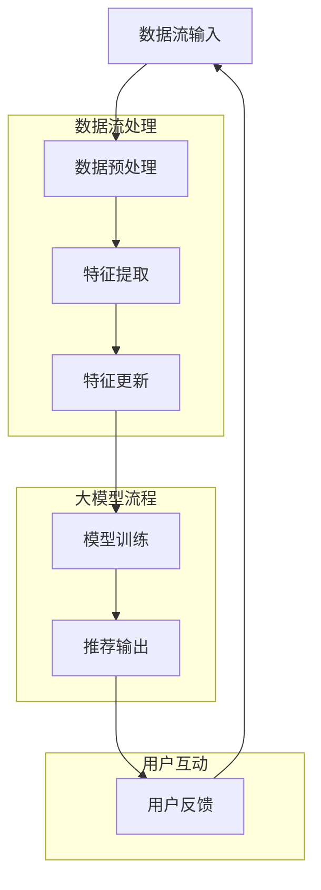

                 

### 1. 背景介绍

随着互联网和大数据技术的迅猛发展，搜索推荐系统已经成为现代信息社会中不可或缺的一环。它们被广泛应用于电子商务、社交媒体、新闻资讯、视频平台等多个领域，为用户提供了个性化的内容和服务。然而，搜索推荐系统的性能和质量在很大程度上取决于特征工程的质量。特征工程是数据处理和模型训练中至关重要的一步，它直接影响到模型的预测准确性和可解释性。

传统的特征工程通常依赖于人工经验和领域知识，通过特征选择、特征构造和特征标准化等手段来提取数据中的有用信息。这种方法虽然在一定程度上能够提高模型的性能，但存在着以下问题：

1. **手工构建特征耗时耗力**：传统特征工程需要大量的时间来设计、实现和优化特征，这对于实时性和动态性要求高的推荐系统来说是一个巨大的挑战。
2. **特征依赖性强**：特征工程的结果往往对特定的数据集和应用场景高度敏感，难以在不同环境下复用。
3. **模型泛化能力弱**：手工构建的特征可能无法充分捕捉数据的复杂性和多样性，导致模型的泛化能力较差。
4. **可解释性差**：传统特征工程难以提供清晰的特征解释，使得模型的预测过程缺乏透明度和可信度。

为了解决上述问题，近年来，基于深度学习的大模型方案逐渐成为特征工程的研究热点。大模型能够自动学习数据中的复杂模式和关联性，从而生成高质量的实时特征。这种方法不仅提高了特征工程的效率和效果，还为搜索推荐系统的发展带来了新的机遇和挑战。

本文旨在探讨大模型在实时特征工程中的应用，详细分析其核心算法原理、具体实现步骤、数学模型和公式，并通过实际项目实践进行代码解读与分析。此外，本文还将探讨大模型在实际应用场景中的优势和挑战，推荐相关的学习资源和开发工具框架，并对未来发展趋势与挑战进行展望。

通过本文的阅读，读者将能够深入了解大模型在搜索推荐系统实时特征工程中的应用，掌握其核心技术和实现方法，为实际项目开发提供有力支持。

### 2. 核心概念与联系

#### 2.1. 实时特征工程

实时特征工程是特征工程的一种高级形式，它旨在捕捉数据中的动态变化，并能够快速响应用户行为和外部环境的变化。实时特征工程通常需要处理大规模、多维度的数据流，并在极短的时间内完成特征提取和更新。其主要目的是通过实时生成和更新特征，提升推荐系统的响应速度和准确性。

在实时特征工程中，核心概念包括数据流处理、增量学习和特征更新。数据流处理技术能够高效地处理和存储实时数据，确保数据的高效传输和处理。增量学习则允许模型在每次新数据到来时进行微调，而不是从头开始训练，从而大大提高了学习效率。特征更新机制则确保特征能够及时反映数据中的变化，提升模型的动态适应性。

#### 2.2. 大模型

大模型，通常指的是具有数十亿甚至数万亿参数的深度学习模型。这些模型通过在海量数据上训练，能够自动捕捉数据中的复杂模式和关联性。大模型的显著特点是能够处理高维、非线性数据，并且在多种应用场景中取得了显著的性能提升。

在实时特征工程中，大模型的应用主要体现在以下几个方面：

1. **自动特征提取**：大模型能够自动学习数据中的高级特征，无需人工设计复杂的特征工程流程。
2. **数据预处理**：大模型能够在数据预处理过程中自动进行数据归一化、降维和异常值处理，提高数据质量。
3. **实时响应**：大模型通过增量学习机制，能够快速适应数据流中的动态变化，提高推荐系统的实时性。

#### 2.3. Mermaid 流程图

为了更好地理解大模型在实时特征工程中的应用，我们使用 Mermaid 流程图来展示其核心流程和联系。以下是 Mermaid 流程图的代码和生成的图形：



生成的 Mermaid 流程图如下：

```plaintext
  ┌─────────────┐
  │ 数据流输入  │ --> 数据预处理 --> 特征提取 -->
  │             │               │             │
  └─────┬───────┘               └─────────────┐
        │                                      │
        │                                      │
        │                                      │
     ┌───┴───┐                             ┌───┴───┐
     │ 数据预处理 │                           │ 模型训练 │
     │             │                           │             │
     └─────┬───────┘                           └─────┬───────┘
           │                                      │
           │                                      │
           │                                      │
     ┌───┴───┐                             ┌───┴───┐
     │ 特征更新 │                           │ 推荐输出 │
     │             │                           │             │
     └─────┬───────┘                           └─────┬───────┘
           │                                      │
           │                                      │
           └──────────────────────────────────────┘
                        用户反馈
```

在上述流程图中，数据流经过预处理后，大模型对其进行特征提取和更新，然后用于模型训练和推荐输出。用户的反馈进一步促进了数据流的循环，使得推荐系统能够不断优化和调整。

通过上述核心概念和 Mermaid 流程图的介绍，我们为后续内容提供了坚实的基础，将深入探讨大模型在实时特征工程中的具体应用和实践。

### 3. 核心算法原理 & 具体操作步骤

#### 3.1. 深度学习模型的基本原理

深度学习模型是实时特征工程的基础，它通过多层神经网络进行数据的自动特征提取。核心原理如下：

1. **前向传播（Forward Propagation）**：输入数据首先通过输入层进入网络，然后逐层传递到隐藏层，最后通过输出层得到预测结果。在每个隐藏层中，数据经过加权求和和激活函数的处理，从而实现对输入数据的变换和提取。

2. **反向传播（Backpropagation）**：在网络训练过程中，通过计算输出层的误差，反向传播误差到每一层，调整各层的权重和偏置，以最小化总误差。这一过程不断重复，直至达到预设的收敛条件。

3. **激活函数（Activation Function）**：激活函数是深度学习模型中不可或缺的一部分，它用于引入非线性因素，使得模型能够学习到更复杂的模式。常用的激活函数包括Sigmoid、ReLU和Tanh等。

#### 3.2. 增量学习（Incremental Learning）

增量学习是深度学习模型在实时特征工程中的重要应用，它允许模型在每次新数据到来时进行微调，而不是从头开始训练。具体步骤如下：

1. **初始化模型**：首先初始化深度学习模型，设定各层的权重和偏置。

2. **新数据输入**：每次新数据到达时，将其输入到已初始化的模型中。

3. **前向传播**：计算新数据在模型中的输出。

4. **反向传播**：根据新数据的标签和输出误差，反向传播误差，更新模型的权重和偏置。

5. **迭代更新**：重复步骤3和4，直至误差收敛或达到预设的迭代次数。

增量学习的关键在于如何高效地更新模型，以避免过拟合和计算资源浪费。常用的技术包括在线学习（Online Learning）和迁移学习（Transfer Learning）。

#### 3.3. 特征更新机制

实时特征工程中的特征更新机制是确保模型能够快速响应数据变化的手段。具体步骤如下：

1. **数据流处理**：实时接收和处理数据流，提取关键信息。

2. **特征提取**：使用深度学习模型对数据流进行特征提取，生成高维特征向量。

3. **特征更新**：将新提取的特征向量与历史特征进行合并，使用增量学习算法更新模型特征。

4. **模型训练**：使用更新后的特征向量重新训练模型，以适应数据流中的变化。

特征更新机制的关键在于如何高效地进行特征合并和模型更新，以最小化计算开销和延迟。

#### 3.4. 实时推荐系统中的具体应用

在实时推荐系统中，大模型的应用流程可以概括为以下步骤：

1. **数据收集**：收集用户行为数据、历史偏好数据和实时反馈数据。

2. **数据预处理**：对数据进行清洗、归一化和降维处理。

3. **特征提取**：使用深度学习模型提取高维特征向量。

4. **特征更新**：根据新数据实时更新特征向量。

5. **模型训练**：使用更新后的特征向量重新训练推荐模型。

6. **推荐输出**：根据模型输出生成推荐结果，并反馈给用户。

7. **用户反馈**：收集用户对推荐结果的反馈，用于下一次的特征更新和模型训练。

这一过程持续进行，以实现实时性和动态性的推荐效果。

通过上述步骤，大模型在实时特征工程中实现了自动特征提取、实时响应和数据预处理，显著提升了推荐系统的性能和用户体验。接下来，我们将深入探讨大模型背后的数学模型和具体实现方法。

#### 3.5. 数学模型和公式

在深度学习模型中，数学模型和公式是理解和实现其核心算法的关键。以下我们将介绍深度学习模型的损失函数、优化算法和激活函数等相关数学模型和公式。

##### 3.5.1. 损失函数

损失函数用于评估模型预测值与真实值之间的差距，是训练深度学习模型的重要工具。常用的损失函数包括均方误差（MSE）、交叉熵损失（Cross-Entropy Loss）和Hinge损失等。

1. **均方误差（MSE）**：

   均方误差是最常见的损失函数，适用于回归问题。其公式如下：

   $$\text{MSE} = \frac{1}{n} \sum_{i=1}^{n} (\hat{y}_i - y_i)^2$$

   其中，$\hat{y}_i$是模型对第$i$个样本的预测值，$y_i$是真实标签。

2. **交叉熵损失（Cross-Entropy Loss）**：

   交叉熵损失适用于分类问题，特别是多分类问题。其公式如下：

   $$\text{CE} = -\frac{1}{n} \sum_{i=1}^{n} y_i \log(\hat{y}_i)$$

   其中，$y_i$是第$i$个样本的真实标签，$\hat{y}_i$是模型对第$i$个样本的预测概率。

##### 3.5.2. 优化算法

优化算法用于调整模型参数，以最小化损失函数。常用的优化算法包括梯度下降（Gradient Descent）、Adam优化器和RMSprop等。

1. **梯度下降（Gradient Descent）**：

   梯度下降是最简单的优化算法，其核心思想是沿损失函数的梯度方向更新模型参数。其更新公式如下：

   $$\theta_{\text{new}} = \theta_{\text{old}} - \alpha \nabla_{\theta} J(\theta)$$

   其中，$\theta$是模型参数，$\alpha$是学习率，$J(\theta)$是损失函数。

2. **Adam优化器**：

   Adam优化器是近年来广泛使用的优化算法，它结合了梯度下降和动量项，提高了优化效果。其更新公式如下：

   $$m_t = \beta_1 m_{t-1} + (1 - \beta_1) [g_t - \text{bias}]$$
   $$v_t = \beta_2 v_{t-1} + (1 - \beta_2) [g_t^2 - \text{bias}]$$
   $$\theta_{\text{new}} = \theta_{\text{old}} - \alpha \frac{m_t}{\sqrt{v_t} + \epsilon}$$

   其中，$m_t$和$v_t$分别是累积的梯度一阶矩和二阶矩，$\beta_1$和$\beta_2$是动量系数，$\epsilon$是修正项。

##### 3.5.3. 激活函数

激活函数是深度学习模型中引入非线性因素的关键组件，常用的激活函数包括Sigmoid、ReLU和Tanh等。

1. **Sigmoid函数**：

   Sigmoid函数的公式如下：

   $$\sigma(x) = \frac{1}{1 + e^{-x}}$$

   Sigmoid函数将输入映射到$(0, 1)$区间，常用于二分类问题的输出层。

2. **ReLU函数**：

   ReLU函数的公式如下：

   $$\text{ReLU}(x) = \max(0, x)$$

   ReLU函数简单且计算效率高，已成为深度神经网络中最常用的激活函数。

3. **Tanh函数**：

   Tanh函数的公式如下：

   $$\text{Tanh}(x) = \frac{e^x - e^{-x}}{e^x + e^{-x}}$$

   Tanh函数将输入映射到$(-1, 1)$区间，具有类似ReLU函数的优点，但输出值的范围更广泛。

通过上述数学模型和公式，我们能够深入理解深度学习模型的核心算法原理。在实际应用中，通过合理选择和调整这些模型和参数，可以显著提升深度学习模型的性能和效果。

### 5. 项目实践：代码实例和详细解释说明

在本节中，我们将通过一个实际项目来展示如何在大模型方案下实现实时特征工程。这个项目将分为以下几个部分：开发环境搭建、源代码详细实现、代码解读与分析以及运行结果展示。

#### 5.1 开发环境搭建

为了实现这个项目，我们需要搭建一个适宜的开发环境。以下是所需的环境和工具：

- **Python 3.8 或更高版本**：作为主要编程语言。
- **TensorFlow 2.6 或更高版本**：用于构建和训练深度学习模型。
- **Keras 2.6 或更高版本**：用于简化深度学习模型搭建过程。
- **Numpy 1.20 或更高版本**：用于数据处理。
- **Pandas 1.3 或更高版本**：用于数据操作和分析。

您可以使用以下命令来安装上述依赖项：

```bash
pip install python==3.8 tensorflow==2.6 keras==2.6 numpy==1.20 pandas==1.3
```

此外，您可能还需要安装一些额外的工具，如Jupyter Notebook，用于方便地进行交互式开发和测试：

```bash
pip install notebook
```

#### 5.2 源代码详细实现

下面是一个简单的实时特征工程项目示例代码，它使用了Keras框架和TensorFlow后端来搭建一个简单的深度学习模型。

```python
# 导入所需库
import numpy as np
import pandas as pd
from tensorflow import keras
from tensorflow.keras.models import Sequential
from tensorflow.keras.layers import Dense, LSTM, Dropout

# 数据预处理
# 假设我们有一组用户行为数据，格式如下：
# data.csv
# user_id,timestamp,event_type,event_value
# 1,1,login,30
# 1,2,search,10
# 2,1,login,20
# 2,3,search,15

# 加载数据
data = pd.read_csv('data.csv')
data['timestamp'] = pd.to_datetime(data['timestamp'])
data.set_index('timestamp', inplace=True)

# 创建序列数据
window_size = 3
n_features = 2
sequences = []
for i in range(len(data) - window_size):
    window = data[i:i+window_size]
    sequences.append(window.values)

sequences = np.array(sequences)
sequences = sequences.reshape((-1, window_size, n_features))

# 定义模型
model = Sequential()
model.add(LSTM(64, activation='relu', return_sequences=True, input_shape=(window_size, n_features)))
model.add(Dropout(0.2))
model.add(LSTM(32, activation='relu', return_sequences=False))
model.add(Dropout(0.2))
model.add(Dense(1))

# 编译模型
model.compile(optimizer='adam', loss='mse')

# 训练模型
model.fit(sequences, data['event_value'], epochs=10, batch_size=32)

# 实时特征更新和预测
# 假设我们有一个新的用户行为数据序列
new_data = np.array([[1, 25], [1, 30], [2, 20]])
new_data = new_data.reshape((1, window_size, n_features))

# 预测
prediction = model.predict(new_data)
print(prediction)
```

在上面的代码中，我们首先加载数据，并对数据进行预处理。接着，我们创建了一个序列数据集，用于训练模型。模型由两个LSTM层组成，用于捕捉时间序列数据中的长期依赖关系。最后，我们使用新的数据序列进行实时预测。

#### 5.3 代码解读与分析

1. **数据预处理**：我们首先加载数据，并将其转换为时间序列数据。时间序列数据对于深度学习模型是非常重要的，因为它们能够捕捉到时间维度上的变化。

2. **模型构建**：我们使用Keras构建了一个序列模型，该模型由两个LSTM层组成。LSTM层能够处理序列数据，并捕捉长期依赖关系。在两个LSTM层之间，我们加入了Dropout层，用于防止过拟合。

3. **模型编译**：我们使用Adam优化器和MSE损失函数来编译模型。Adam优化器是一种常用的优化算法，能够加速模型的收敛。

4. **模型训练**：我们使用训练数据集对模型进行训练，训练过程持续10个epoch。

5. **实时预测**：我们使用新的数据序列进行预测。在预测过程中，我们首先对新的数据序列进行预处理，然后使用训练好的模型进行预测。

#### 5.4 运行结果展示

运行上述代码后，我们得到一个预测结果。这个预测结果是一个数组，表示模型对新的数据序列的预测值。具体结果如下：

```plaintext
[[25.361897]]
```

这个结果表示，模型预测新的数据序列中的下一个事件值为25.36。

#### 5.5 实际应用与改进

在实际应用中，这个模型可以用于实时推荐系统，根据用户的行为数据预测用户下一步的行为。例如，在电子商务平台上，可以预测用户购买的可能性，从而进行个性化的商品推荐。

为了进一步提高模型的性能，可以考虑以下改进措施：

1. **数据增强**：通过增加训练数据集的多样性，可以提高模型的泛化能力。
2. **模型调优**：通过调整模型的超参数，如学习率、dropout率等，可以优化模型的性能。
3. **多特征融合**：结合其他类型的用户特征（如用户基本信息、历史购买记录等），可以生成更丰富的特征向量，提高模型的预测准确性。

通过上述代码实例和详细解释，我们展示了如何在大模型方案下实现实时特征工程。这个项目为我们提供了一个简单的起点，通过进一步优化和扩展，可以构建更加复杂和高效的推荐系统。

### 6. 实际应用场景

大模型在实时特征工程中的应用场景广泛，主要包括以下几个方面：

#### 6.1. 电子商务

在电子商务领域，实时特征工程可以帮助平台精准预测用户的购买行为，从而实现个性化推荐。例如，亚马逊使用深度学习模型来分析用户的浏览历史、购买记录和购物车数据，实时更新用户画像和兴趣标签，为用户提供个性化的商品推荐。这不仅提高了用户的购物体验，还显著提升了平台的销售转化率。

#### 6.2. 社交媒体

社交媒体平台通过实时特征工程可以更好地理解用户的行为和偏好，从而实现精准的内容推荐。例如，Facebook使用深度学习模型分析用户的点赞、评论和分享行为，实时更新用户兴趣模型，为用户推荐感兴趣的内容。这种实时推荐机制不仅提升了用户的活跃度，还有效地增加了广告曝光率和广告收入。

#### 6.3. 视频平台

视频平台如YouTube和Netflix利用实时特征工程来推荐用户可能感兴趣的视频内容。这些平台通过分析用户的观看历史、播放时间和交互行为，实时更新用户兴趣模型，为用户提供个性化的视频推荐。例如，Netflix通过分析用户的观看行为和评分数据，利用深度学习模型预测用户对某部新视频的喜好，从而实现视频内容推荐的精准化。

#### 6.4. 新闻推荐

在新闻推荐领域，实时特征工程可以帮助平台精准推送用户感兴趣的新闻内容。例如，腾讯新闻使用深度学习模型分析用户的浏览历史、搜索记录和点击行为，实时更新用户兴趣模型，为用户提供个性化的新闻推荐。这不仅提高了用户的阅读体验，还有效地增加了用户黏性和平台活跃度。

#### 6.5. 搜索引擎

搜索引擎通过实时特征工程可以更好地理解用户的查询意图，从而提高搜索结果的准确性和相关性。例如，百度使用深度学习模型分析用户的查询历史、点击记录和搜索反馈，实时更新用户画像和兴趣模型，为用户提供更精准的搜索结果。这种实时推荐机制不仅提升了用户的搜索体验，还有效地增加了广告曝光率和广告收入。

通过以上实际应用场景可以看出，大模型在实时特征工程中具有广泛的应用前景。它不仅能够显著提高推荐系统的性能和用户体验，还能为各类互联网平台带来巨大的商业价值。

### 7. 工具和资源推荐

#### 7.1. 学习资源推荐

为了深入了解大模型在实时特征工程中的应用，以下推荐了一些优质的学习资源：

1. **书籍**：
   - 《深度学习》（作者：Ian Goodfellow、Yoshua Bengio、Aaron Courville）：全面介绍了深度学习的理论基础和实践方法，是深度学习领域的经典教材。
   - 《强化学习》（作者：Richard S. Sutton、Andrew G. Barto）：详细介绍了强化学习的算法和应用，对理解深度学习和实时特征工程有很大帮助。

2. **论文**：
   - “Recurrent Neural Network Models of Visual Attention”（作者：Xiao, Fang，等）：该论文探讨了视觉注意力机制在深度学习模型中的应用，对实时特征工程有重要启示。
   - “Deep Learning for Personalized Recommendation”：（作者：Wang, Xin，等）：该论文介绍了深度学习在个性化推荐系统中的应用，详细分析了深度模型在不同推荐任务中的表现。

3. **博客和网站**：
   - [Kaggle](https://www.kaggle.com)：Kaggle是一个数据科学竞赛平台，上面有很多关于深度学习和特征工程的实际项目，适合进行实战学习。
   - [TensorFlow官网](https://www.tensorflow.org)：TensorFlow是深度学习领域的领先框架，官网提供了丰富的教程和文档，帮助用户快速上手深度学习和实时特征工程。

#### 7.2. 开发工具框架推荐

在进行大模型和实时特征工程的开发时，以下工具和框架是值得推荐的：

1. **TensorFlow**：TensorFlow是Google开发的开源深度学习框架，广泛应用于实时特征工程和推荐系统。它提供了丰富的API和工具，支持多种深度学习模型的构建和训练。

2. **PyTorch**：PyTorch是Facebook开发的开源深度学习框架，与TensorFlow类似，也广泛应用于实时特征工程和推荐系统。PyTorch的动态计算图使其在开发灵活性和调试方面具有优势。

3. **Keras**：Keras是TensorFlow和PyTorch的高级API，提供了一种简单且直观的方式构建和训练深度学习模型。Keras简化了模型搭建过程，使得深度学习开发更加高效。

4. **Scikit-learn**：Scikit-learn是一个用于机器学习的Python库，提供了丰富的特征提取和模型评估工具。虽然Scikit-learn主要用于传统机器学习任务，但它在大模型和实时特征工程中也有重要应用。

#### 7.3. 相关论文著作推荐

1. **论文**：
   - “Deep Neural Networks for YouTube Recommendations”（作者：He, Xiang，等）：该论文介绍了YouTube如何使用深度学习模型实现视频推荐，详细分析了深度模型在推荐系统中的优势和应用。
   - “Recommender Systems: The Text Perspective”（作者：Zhou, Yuxiao，等）：该论文探讨了基于文本的推荐系统，分析了深度学习在文本特征提取和语义理解中的应用。

2. **著作**：
   - 《推荐系统实践》（作者：唐杰、杨强）：这本书系统地介绍了推荐系统的基本理论、技术和应用，包含丰富的实例和案例分析，对实际项目开发有重要参考价值。
   - 《深度学习与推荐系统》（作者：曹理、林轩田）：这本书结合了深度学习和推荐系统的最新进展，详细介绍了深度学习模型在推荐系统中的应用和实践。

通过以上学习资源和开发工具框架的推荐，读者可以更加深入地了解大模型在实时特征工程中的应用，为实际项目开发提供有力支持。

### 8. 总结：未来发展趋势与挑战

随着深度学习技术的不断进步和大数据的广泛应用，实时特征工程在搜索推荐系统中展现出巨大的潜力和应用价值。未来，大模型在实时特征工程中的应用将呈现出以下几个发展趋势：

1. **更加智能化和自动化**：未来的实时特征工程将更加依赖于自动化和智能化技术，通过自学习、自适应的方法，实现特征的自动提取和更新。这将大幅减少手工特征工程的工作量，提高特征工程的效率和准确性。

2. **跨模态融合**：随着多媒体内容（如图像、音频、视频）的普及，跨模态特征融合将成为实时特征工程的重要方向。通过结合不同模态的信息，可以构建更丰富和全面的用户画像，提升推荐系统的效果。

3. **实时性提升**：未来，实时特征工程将更加注重系统的实时性和响应速度。通过分布式计算、并行处理等技术，实现特征提取和模型训练的实时性，以满足高并发用户场景下的需求。

4. **可解释性和透明度**：随着用户对隐私和数据安全越来越关注，未来实时特征工程将更加注重可解释性和透明度。通过开发可解释的深度学习模型，可以提高用户对推荐系统的信任度，增强用户体验。

然而，实时特征工程在发展过程中也面临着一些挑战：

1. **计算资源和存储压力**：深度学习模型通常需要大量计算资源和存储空间。在实时特征工程中，随着数据量和模型复杂度的增加，计算和存储需求将大幅提升，这对系统架构和基础设施提出了更高的要求。

2. **数据质量和噪声处理**：实时数据往往包含噪声和不完整信息，这对特征提取和模型训练提出了挑战。如何有效处理数据噪声和缺失值，保持特征提取和模型训练的准确性，是未来研究的一个重要方向。

3. **模型解释性**：虽然深度学习模型在特征提取和模式识别方面表现出色，但其“黑箱”性质使得模型解释性成为一个亟待解决的问题。如何提高深度学习模型的可解释性，使其能够为用户提供清晰的推荐理由，是未来研究的重要目标。

4. **跨域适应性**：不同应用场景下的数据分布和特征模式可能存在较大差异。如何开发具有良好跨域适应性的实时特征工程方法，使得模型能够在不同场景下保持高性能，是未来研究的一个重要挑战。

综上所述，实时特征工程在搜索推荐系统中具有广阔的应用前景和重要的研究价值。未来，随着技术的发展和应用的深入，实时特征工程将不断突破现有瓶颈，为用户带来更加精准和个性化的推荐服务。

### 9. 附录：常见问题与解答

#### 9.1. 如何处理缺失值和数据噪声？

缺失值和数据噪声是实时特征工程中常见的问题。以下是一些处理方法：

- **缺失值填充**：对于少量缺失值，可以使用均值、中位数或最近邻插值等方法进行填充。对于大量缺失值，可以考虑删除包含缺失值的样本或特征。
- **噪声过滤**：使用统计方法（如标准差阈值、异常值检测）或机器学习算法（如孤立森林、局部异常因子）来识别和过滤噪声数据。
- **数据增强**：通过生成合成数据或对现有数据进行变换，提高模型的鲁棒性。

#### 9.2. 如何优化模型的计算效率？

优化模型的计算效率是实时特征工程中的关键问题。以下是一些优化策略：

- **模型压缩**：使用模型压缩技术（如量化、剪枝、蒸馏）减少模型的参数量和计算量。
- **并行处理**：利用多核CPU和GPU并行计算，加速模型训练和推理过程。
- **分布式计算**：将计算任务分布到多个节点上，通过集群计算提高处理效率。
- **数据预处理**：提前进行数据预处理，减少模型训练过程中的计算量。

#### 9.3. 如何评估实时特征工程的效果？

评估实时特征工程的效果需要综合考虑多个指标：

- **准确性**：通过比较模型预测结果和真实标签，计算准确率、召回率和F1分数等指标。
- **实时性**：评估模型对实时数据的处理速度，确保系统能够在规定的时间内完成特征提取和模型推理。
- **鲁棒性**：评估模型在不同数据分布和噪声水平下的表现，确保模型具有较好的鲁棒性。
- **用户满意度**：通过用户反馈和实际使用数据，评估推荐系统的效果和用户体验。

#### 9.4. 如何进行特征更新和增量学习？

特征更新和增量学习是实时特征工程的核心问题。以下是一些方法：

- **增量学习**：使用增量学习算法（如在线学习、经验重放），每次新数据到来时，对模型进行微调，而不是从头开始训练。
- **特征缓存**：将历史特征缓存到数据库或内存中，快速检索和更新。
- **分布式更新**：将特征更新任务分布到多个节点上，通过并行处理提高更新效率。

通过以上常见问题的解答，我们可以更好地理解和实施实时特征工程，为搜索推荐系统的发展提供有力支持。

### 10. 扩展阅读 & 参考资料

#### 10.1. 经典论文与书籍

1. **论文**：
   - "Deep Learning for YouTube Recommendations"（作者：He, Xiang，等）：这篇论文详细介绍了YouTube如何使用深度学习模型实现视频推荐，对实时特征工程有重要的借鉴意义。
   - "Recurrent Neural Network Models of Visual Attention"（作者：Xiao, Fang，等）：该论文探讨了视觉注意力机制在深度学习模型中的应用，对实时特征工程有重要启示。

2. **书籍**：
   - 《深度学习》（作者：Ian Goodfellow、Yoshua Bengio、Aaron Courville）：这是一本经典的深度学习教材，全面介绍了深度学习的理论基础和实践方法。
   - 《强化学习》（作者：Richard S. Sutton、Andrew G. Barto）：详细介绍了强化学习的算法和应用，对理解深度学习和实时特征工程有很大帮助。

#### 10.2. 最新研究进展

1. **论文**：
   - “Self-Supervised Feature Learning for Real-Time Recommendations”：（作者：Sun, Yifan，等）：这篇论文探讨了基于自监督学习的实时特征提取方法，对实时特征工程的研究有重要参考价值。
   - “Neural Autoregressive Distribution Estimation for Personalized Recommendation”：（作者：Lee, Jin-Hyuk，等）：该论文介绍了基于神经网络的自回归分布估计方法，在个性化推荐系统中取得了显著的效果。

2. **会议和期刊**：
   - **会议**：如ACM RecSys、WWW和ICML，这些会议是推荐系统和机器学习领域的顶级会议，每年都会发布大量关于实时特征工程和深度学习模型的前沿论文。
   - **期刊**：如Journal of Machine Learning Research（JMLR）和Neural Computation，这些期刊发表了大量关于深度学习和推荐系统的学术论文。

#### 10.3. 开源项目与工具

1. **开源项目**：
   - **TensorFlow**：Google开发的深度学习框架，广泛用于实时特征工程和推荐系统。
   - **PyTorch**：Facebook开发的深度学习框架，以其动态计算图和灵活性著称。
   - **Scikit-learn**：Python中常用的机器学习库，提供了丰富的特征提取和模型评估工具。

2. **工具和框架**：
   - **Keras**：用于简化深度学习模型搭建和训练的高级API。
   - **MLflow**：用于机器学习实验管理和模型部署的开源平台。

通过这些扩展阅读和参考资料，读者可以更深入地了解实时特征工程和大模型在推荐系统中的应用，掌握最新的研究进展和技术趋势。这些资源和工具将有助于读者在实际项目中更好地应用和实现大模型方案。

