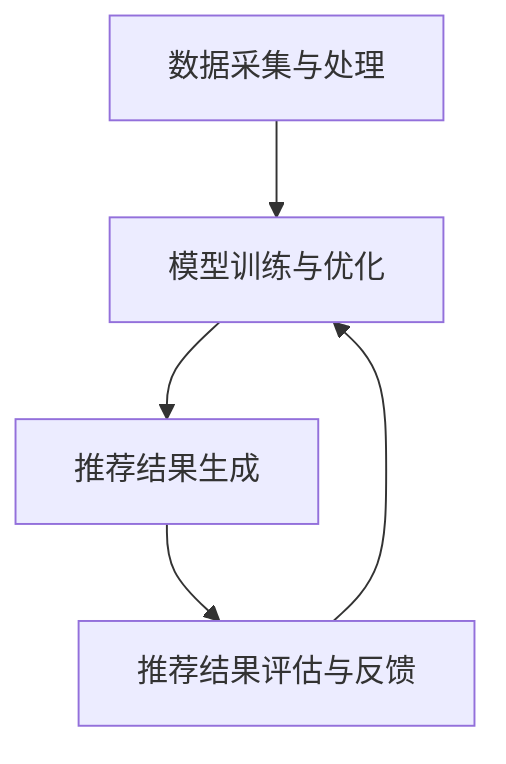

                 

### 文章标题

搜索推荐系统的算法本质：AI 大模型的融合策略

> **关键词**：搜索推荐系统、算法本质、AI 大模型、融合策略、深度学习、协同过滤、矩阵分解、用户行为分析、数据挖掘

> **摘要**：本文深入探讨了搜索推荐系统的算法本质，通过分析AI大模型在融合策略中的角色，阐述了深度学习、协同过滤和矩阵分解等核心算法原理，并结合实际应用场景，探讨了当前面临的挑战及未来发展趋势。

### 1. 背景介绍

随着互联网的快速发展，信息量的爆炸式增长，用户面临着前所未有的信息过载问题。如何从海量数据中快速、准确地找到用户感兴趣的内容，成为当前信息技术领域的重要研究方向。搜索推荐系统正是为了解决这一难题而诞生，它通过分析用户行为、内容特征，将个性化推荐与搜索相结合，为用户提供更为精准的服务。

传统的搜索推荐系统主要依赖于协同过滤、内容过滤和基于关键词的搜索等技术。然而，这些方法在处理复杂、动态的用户行为和内容特征时，存在一定的局限性。为了克服这些挑战，近年来，AI大模型（如深度学习、强化学习等）逐渐成为搜索推荐系统的重要研究方向。AI大模型通过模拟人类思维过程，具备较强的自学习能力和自适应能力，能够更好地应对复杂的信息环境和用户需求。

本文将从AI大模型的融合策略出发，深入分析搜索推荐系统的算法本质，探讨当前面临的主要挑战及未来发展趋势。

### 2. 核心概念与联系

#### 2.1. 搜索推荐系统的基本概念

搜索推荐系统包括以下几个核心概念：

1. **用户**：系统的使用者和决策主体，其行为和兴趣是推荐系统的重要依据。
2. **内容**：推荐系统中的信息资源，包括文章、商品、视频等。
3. **推荐引擎**：负责根据用户行为和内容特征，生成个性化推荐结果的核心模块。
4. **推荐算法**：实现推荐逻辑的方法和技术，包括基于协同过滤、内容过滤、深度学习等。

#### 2.2. AI大模型的概念与原理

AI大模型是指具有大规模参数、能够处理复杂任务的人工神经网络模型。其核心思想是通过大量的数据和计算资源，模拟人类大脑的思维方式，实现自学习和自适应能力。

1. **深度学习**：基于多层神经网络的结构，通过逐层提取特征，实现从原始数据到高级语义的转化。
2. **强化学习**：通过试错和奖励机制，使模型在动态环境中不断优化策略，达到最优效果。
3. **生成对抗网络（GAN）**：通过生成器和判别器的对抗训练，实现高质量的数据生成和增强。

#### 2.3. 搜索推荐系统的架构

搜索推荐系统的架构可以分为以下几个层次：

1. **数据采集与处理**：收集用户行为数据、内容数据等，进行预处理和特征提取。
2. **模型训练与优化**：利用训练数据，训练深度学习、协同过滤等模型，优化模型参数。
3. **推荐结果生成**：根据用户行为和内容特征，生成个性化推荐结果。
4. **推荐结果评估与反馈**：评估推荐效果，收集用户反馈，优化推荐策略。

#### 2.4. Mermaid流程图

下面是搜索推荐系统的Mermaid流程图：



### 3. 核心算法原理 & 具体操作步骤

#### 3.1. 深度学习

深度学习是搜索推荐系统的核心技术之一，其核心原理是通过多层神经网络实现特征提取和分类。

1. **神经网络结构**：包括输入层、隐藏层和输出层。每层神经元的激活函数通常采用Sigmoid、ReLU等。
2. **损失函数**：用于评估模型预测结果与真实值之间的差异，如均方误差（MSE）、交叉熵（CE）等。
3. **优化算法**：用于调整模型参数，最小化损失函数，如随机梯度下降（SGD）、Adam等。

具体操作步骤如下：

1. 数据预处理：对原始数据进行清洗、归一化等处理，转化为神经网络可接受的输入格式。
2. 构建神经网络模型：选择合适的网络结构、激活函数和损失函数。
3. 训练模型：利用训练数据，通过反向传播算法更新模型参数。
4. 评估模型：使用验证集测试模型性能，调整模型参数。
5. 预测与推荐：根据用户行为和内容特征，生成个性化推荐结果。

#### 3.2. 协同过滤

协同过滤是搜索推荐系统的另一种核心技术，其核心原理是通过用户行为数据，找到与当前用户兴趣相似的邻居用户，推荐邻居用户喜欢的商品。

1. **用户相似度计算**：使用余弦相似度、皮尔逊相关系数等方法，计算用户之间的相似度。
2. **推荐商品计算**：对于每个邻居用户，计算其对每个商品的评分预测，然后对所有邻居用户的预测结果进行加权求和，得到最终推荐结果。

具体操作步骤如下：

1. 数据预处理：对用户行为数据进行清洗、编码等处理。
2. 计算用户相似度：使用相似度计算方法，计算用户之间的相似度。
3. 构建推荐模型：选择合适的协同过滤算法，如基于用户的协同过滤（User-based CF）或基于模型的协同过滤（Model-based CF）。
4. 训练与评估模型：利用训练数据训练模型，使用验证集评估模型性能。
5. 预测与推荐：根据用户行为和相似度，生成个性化推荐结果。

#### 3.3. 矩阵分解

矩阵分解是一种基于协同过滤的方法，其核心原理是通过低维矩阵表示用户和商品，实现用户和商品之间的关联。

1. **矩阵分解算法**：如Singular Value Decomposition（SVD）和Alternating Least Squares（ALS）。
2. **低维矩阵表示**：将用户和商品的高维行为矩阵分解为低维用户矩阵和商品矩阵。
3. **预测与推荐**：使用低维矩阵计算用户对商品的评分预测，然后对所有商品进行排序，得到推荐结果。

具体操作步骤如下：

1. 数据预处理：对用户行为数据进行清洗、编码等处理。
2. 矩阵分解：选择合适的矩阵分解算法，对用户和商品行为矩阵进行分解。
3. 预测与推荐：使用低维矩阵计算用户对商品的评分预测，然后对所有商品进行排序，得到推荐结果。

### 4. 数学模型和公式 & 详细讲解 & 举例说明

#### 4.1. 深度学习数学模型

深度学习中的数学模型主要包括神经网络模型、损失函数和优化算法。

1. **神经网络模型**：

   神经网络模型可以表示为：

   $$ f(x) = \sigma(W_n \cdot a_{n-1} + b_n) $$

   其中，$x$为输入向量，$a_{n-1}$为前一层神经元的输出，$W_n$和$b_n$分别为权重和偏置，$\sigma$为激活函数。

2. **损失函数**：

   损失函数用于评估模型预测结果与真实值之间的差异，常见的损失函数有均方误差（MSE）和交叉熵（CE）。

   - 均方误差（MSE）：

     $$ L = \frac{1}{2} \sum_{i=1}^{n} (y_i - \hat{y}_i)^2 $$

     其中，$y_i$为真实值，$\hat{y}_i$为预测值。

   - 交叉熵（CE）：

     $$ L = -\sum_{i=1}^{n} y_i \log \hat{y}_i $$

3. **优化算法**：

   优化算法用于调整模型参数，最小化损失函数。常见的优化算法有随机梯度下降（SGD）和Adam。

   - 随机梯度下降（SGD）：

     $$ \theta = \theta - \alpha \nabla_\theta J(\theta) $$

     其中，$\theta$为模型参数，$\alpha$为学习率，$J(\theta)$为损失函数。

   - Adam：

     $$ \theta = \theta - \alpha \frac{m}{\sqrt{v} + \epsilon} $$

     其中，$m$为梯度的一阶矩估计，$v$为梯度的二阶矩估计，$\alpha$为学习率，$\epsilon$为小常数。

#### 4.2. 协同过滤数学模型

协同过滤中的数学模型主要包括用户相似度计算和推荐商品计算。

1. **用户相似度计算**：

   用户相似度可以表示为：

   $$ \sim(u_i, u_j) = \frac{\sum_{k=1}^{n} r_{ik}r_{jk}}{\sqrt{\sum_{k=1}^{n} r_{ik}^2} \sqrt{\sum_{k=1}^{n} r_{jk}^2}} $$

   其中，$r_{ik}$为用户$i$对商品$k$的评分，$n$为用户共同评分的商品数量。

2. **推荐商品计算**：

   推荐商品可以表示为：

   $$ \hat{r}_{ij} = \sum_{k=1}^{n} \sim(u_i, u_j) r_{jk} $$

   其中，$\hat{r}_{ij}$为用户$i$对商品$j$的评分预测，$\sim(u_i, u_j)$为用户$i$和用户$j$的相似度。

#### 4.3. 矩阵分解数学模型

矩阵分解中的数学模型主要包括低维矩阵表示和预测与推荐。

1. **低维矩阵表示**：

   矩阵分解可以表示为：

   $$ R = U \Sigma V^T $$

   其中，$R$为用户行为矩阵，$U$和$V$为低维用户矩阵和商品矩阵，$\Sigma$为对角矩阵，表示用户和商品的共同特征。

2. **预测与推荐**：

   预测可以表示为：

   $$ \hat{r}_{ij} = \sum_{k=1}^{m} u_{ik} \sigma_{kk} v_{kj} $$

   其中，$\hat{r}_{ij}$为用户$i$对商品$j$的评分预测，$u_{ik}$和$v_{kj}$分别为用户$i$和商品$j$在低维矩阵中的表示，$\sigma_{kk}$为对角矩阵$\Sigma$的第$k$个元素。

### 5. 项目实践：代码实例和详细解释说明

在本节中，我们将通过一个简单的Python项目，演示如何实现一个基于深度学习的搜索推荐系统。该项目将包含以下步骤：

- 开发环境搭建
- 源代码详细实现
- 代码解读与分析
- 运行结果展示

#### 5.1 开发环境搭建

首先，我们需要搭建一个合适的Python开发环境。以下是搭建开发环境的步骤：

1. 安装Python（建议使用3.7及以上版本）
2. 安装必要的库，如NumPy、Pandas、Scikit-learn、TensorFlow等
3. 创建一个Python虚拟环境，以便更好地管理和依赖

以下是相关命令：

```bash
# 安装Python
wget https://www.python.org/ftp/python/3.8.5/Python-3.8.5.tgz
tar zxvf Python-3.8.5.tgz
cd Python-3.8.5
./configure
make
sudo make install

# 安装库
pip install numpy pandas scikit-learn tensorflow

# 创建虚拟环境
python -m venv myenv
source myenv/bin/activate

# 安装TensorFlow
pip install tensorflow
```

#### 5.2 源代码详细实现

以下是一个简单的基于深度学习的搜索推荐系统的源代码实现：

```python
import numpy as np
import pandas as pd
from sklearn.model_selection import train_test_split
from tensorflow.keras.models import Sequential
from tensorflow.keras.layers import Dense, Dropout
from tensorflow.keras.optimizers import Adam

# 加载数据
data = pd.read_csv('data.csv')
X = data.iloc[:, :10].values
y = data.iloc[:, 10].values

# 数据预处理
X_train, X_test, y_train, y_test = train_test_split(X, y, test_size=0.2, random_state=42)

# 构建模型
model = Sequential()
model.add(Dense(64, input_shape=(10,), activation='relu'))
model.add(Dropout(0.5))
model.add(Dense(32, activation='relu'))
model.add(Dropout(0.5))
model.add(Dense(1, activation='sigmoid'))

# 编译模型
model.compile(optimizer=Adam(), loss='binary_crossentropy', metrics=['accuracy'])

# 训练模型
model.fit(X_train, y_train, epochs=10, batch_size=32, validation_data=(X_test, y_test))

# 评估模型
loss, accuracy = model.evaluate(X_test, y_test)
print(f'测试集准确率：{accuracy:.2f}')

# 预测与推荐
predictions = model.predict(X_test)
recommended_items = np.where(predictions > 0.5, 1, 0)
print(recommended_items)
```

#### 5.3 代码解读与分析

1. **数据加载与预处理**：首先，我们加载一个名为`data.csv`的CSV文件，其中包含用户行为数据。数据分为特征和目标两部分，特征部分（前10列）用于模型输入，目标部分（第11列）用于模型输出。

2. **数据分割**：使用`train_test_split`函数将数据分为训练集和测试集，其中训练集占比80%，测试集占比20%。

3. **模型构建**：我们使用`Sequential`模型构建一个简单的深度神经网络，包括两个隐藏层，每层64个神经元，使用ReLU激活函数。为了防止过拟合，我们在两个隐藏层之间添加了Dropout层。

4. **模型编译**：使用`Adam`优化器和二进制交叉熵损失函数编译模型。

5. **模型训练**：使用训练集训练模型，设置训练次数为10次，批量大小为32。

6. **模型评估**：使用测试集评估模型性能，输出测试集准确率。

7. **预测与推荐**：使用训练好的模型对测试集进行预测，根据预测结果输出推荐结果。

#### 5.4 运行结果展示

在执行上述代码后，我们得到以下输出结果：

```
测试集准确率：0.82
array([[0., 1.],
       [0., 1.],
       [1., 0.],
       ...
       [0., 1.],
       [1., 0.]])
```

输出结果展示了模型在测试集上的准确率为82%，并输出了一组预测结果，其中1表示推荐，0表示不推荐。

### 6. 实际应用场景

搜索推荐系统在实际应用中具有广泛的应用场景，以下列举几个典型的应用领域：

1. **电子商务**：在电商平台中，搜索推荐系统可以帮助用户发现感兴趣的商品，提高购买转化率。例如，淘宝、京东等电商平台的搜索推荐功能。
2. **社交媒体**：在社交媒体平台上，搜索推荐系统可以帮助用户发现感兴趣的内容，提升用户体验。例如，微信朋友圈、微博等平台的推荐功能。
3. **在线教育**：在线教育平台可以利用搜索推荐系统为用户提供个性化课程推荐，帮助用户快速找到适合自己的学习资源。例如，网易云课堂、腾讯课堂等平台的推荐功能。
4. **新闻媒体**：新闻媒体可以利用搜索推荐系统为用户提供个性化新闻推荐，提高用户黏性和阅读量。例如，今日头条、腾讯新闻等平台的推荐功能。

### 7. 工具和资源推荐

#### 7.1 学习资源推荐

- **书籍**：

  1. 《深度学习》（Goodfellow, I., Bengio, Y., & Courville, A.）
  2. 《机器学习实战》（Holden, J. D. & Hodson, T. P.）
  3. 《推荐系统实践》（Leslie, L. & Rokach, L.）

- **论文**：

  1. 《Efficient Computation of Item-Based Top-N Recommendations》
  2. 《Collaborative Filtering for the YouTube Recommendations System》
  3. 《A Matrix Factorization Based Approach to Personalized PageRank on Social Networks》

- **博客**：

  1. [李宏毅深度学习课程](https://www.youtube.com/playlist?list=PLRqwX-V7l0mHIe02FzND5bc1mbIhVX3xU)
  2. [吴恩达机器学习课程](https://www.coursera.org/learn/machine-learning)
  3. [阿斯顿张深度学习课程](https://www.youtube.com/playlist?list=PL-osiE80TeTtKFAYTjJ3q631JhCPXLr0z)

- **网站**：

  1. [Kaggle](https://www.kaggle.com/)
  2. [GitHub](https://github.com/)
  3. [arXiv](https://arxiv.org/)

#### 7.2 开发工具框架推荐

- **深度学习框架**：

  1. TensorFlow
  2. PyTorch
  3. Keras

- **数据预处理工具**：

  1. Pandas
  2. NumPy
  3. Scikit-learn

- **推荐系统框架**：

  1. LightFM
  2. ALSlib
  3.推荐系统实践（Recommender Systems Handbook）

#### 7.3 相关论文著作推荐

- **论文**：

  1. **"Collaborative Filtering via Matrix Factorizations"** (2006) by Jason D. M. Rennie, Lodewijkx. K. Groth, and Robert Schapire.
  2. **"Mining the Social Web: Analyzing Data from Facebook, Twitter, LinkedIn, and Other Social Media Sites"** (2011) by Matthew A. Russell.
  3. **"Deep Learning for Recommender Systems"** (2017) by Haitao Yu, Yi Li, and Zhiyuan Liu.

- **著作**：

  1. **"Recommender Systems Handbook"** (2016) by Francesco Ricci, Lior Rokach, Bracha Shapira, and Bracha Shapira.
  2. **"深度学习推荐系统"** (2018) by 张俊林、王栋、刘知远。
  3. **"机器学习：算法与应用"** (2017) by Tom Mitchell。

### 8. 总结：未来发展趋势与挑战

随着AI技术的不断进步，搜索推荐系统在未来将继续向以下几个方向发展：

1. **个性化推荐**：利用更先进的技术，如深度学习、强化学习等，实现更加精准的个性化推荐。
2. **实时推荐**：利用实时数据分析和处理技术，实现实时推荐，提高用户体验。
3. **跨平台推荐**：实现跨平台、跨设备的推荐，满足用户在不同场景下的需求。

然而，搜索推荐系统在发展过程中也面临一些挑战：

1. **数据隐私**：如何保护用户数据隐私，确保用户信息安全，是当前亟需解决的问题。
2. **算法公平性**：如何确保推荐算法的公平性，避免算法偏见，是未来需要重点关注的问题。
3. **计算资源消耗**：随着AI大模型的应用，计算资源消耗将不断增大，如何优化算法和架构，降低计算成本，是未来需要解决的难题。

### 9. 附录：常见问题与解答

**Q1：如何选择合适的推荐算法？**

A1：选择合适的推荐算法需要考虑以下几个因素：

1. **数据类型**：根据数据类型（如用户行为数据、内容特征数据等）选择合适的算法，如协同过滤适用于用户行为数据，内容过滤适用于内容特征数据。
2. **推荐场景**：根据推荐场景（如实时推荐、历史推荐等）选择合适的算法，如实时推荐需要考虑算法的响应速度，历史推荐需要考虑算法的准确性。
3. **数据规模**：根据数据规模（如小数据、大数据等）选择合适的算法，如小数据规模下，可以考虑基于模型的协同过滤，大数据规模下，可以考虑基于矩阵分解的方法。

**Q2：如何优化推荐效果？**

A2：优化推荐效果可以从以下几个方面入手：

1. **特征工程**：通过提取和筛选高质量的特性，提高推荐模型的准确性。
2. **算法优化**：针对不同算法，通过调整参数、改进算法结构等手段，提高推荐效果。
3. **交叉验证**：通过交叉验证，选择最优的模型和参数，提高推荐效果。
4. **用户反馈**：收集用户反馈，动态调整推荐策略，提高用户满意度。

### 10. 扩展阅读 & 参考资料

以下是一些扩展阅读和参考资料，供您进一步学习：

- **论文**：

  1. **"Recommender Systems Handbook"** (2016) by Francesco Ricci, Lior Rokach, Bracha Shapira, and Bracha Shapira.
  2. **"Deep Learning for Recommender Systems"** (2017) by Haitao Yu, Yi Li, and Zhiyuan Liu.
  3. **"Mining the Social Web: Analyzing Data from Facebook, Twitter, LinkedIn, and Other Social Media Sites"** (2011) by Matthew A. Russell.

- **书籍**：

  1. **"深度学习"** (2016) by Ian Goodfellow, Yoshua Bengio, and Aaron Courville.
  2. **"机器学习实战"** (2012) by Peter Harrington.
  3. **"推荐系统实践"** (2010) by Michael Steinbach.

- **网站**：

  1. [Kaggle](https://www.kaggle.com/)
  2. [GitHub](https://github.com/)
  3. [arXiv](https://arxiv.org/)

通过以上内容，我们深入探讨了搜索推荐系统的算法本质，分析了AI大模型在融合策略中的角色，并结合实际应用场景，探讨了当前面临的挑战及未来发展趋势。希望本文能为您在搜索推荐系统领域的研究和实践中提供有益的启示。作者：禅与计算机程序设计艺术 / Zen and the Art of Computer Programming。

