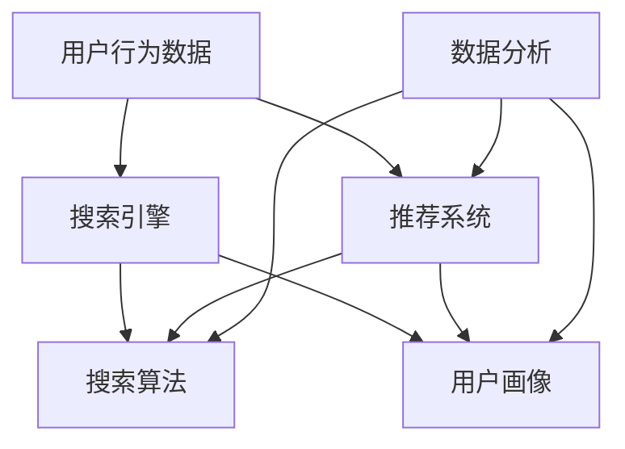

                 

### 文章标题

《搜索数据分析：AI如何帮助电商平台优化搜索策略，提升用户体验》

#### 关键词

- 电商搜索算法
- 搜索数据分析
- 用户行为分析
- 人工智能
- 用户体验优化

#### 摘要

随着电商平台的蓬勃发展，用户对个性化搜索体验的需求日益增长。本文旨在探讨如何利用人工智能和搜索数据分析技术，优化电商平台的搜索策略，从而提升用户满意度。我们将从背景介绍、核心概念与联系、算法原理、数学模型、项目实践、应用场景、工具推荐等多个角度，详细解析这一主题，并展望未来的发展趋势与挑战。

## 1. 背景介绍

随着互联网技术的不断进步，电子商务领域迎来了飞速的发展。电商平台已经成为了消费者购物的主要渠道之一。然而，随着商品种类的增多和用户需求的多样性，如何为用户提供更加精准和个性化的搜索结果，成为了电商平台面临的一个重要问题。

### 搜索功能的重要性

电商平台的搜索功能是连接用户与商品的关键桥梁，其质量直接影响到用户的购物体验。一个优秀的搜索系统不仅要能够快速响应用户的查询请求，还要能够提供相关性高、质量好的搜索结果，这要求搜索引擎具备强大的数据分析和处理能力。

### 搜索功能的核心挑战

- **海量数据处理**：电商平台通常拥有数百万甚至数亿级的商品数据，如何高效地处理这些数据，是搜索系统面临的巨大挑战。
- **用户行为分析**：用户的行为数据是优化搜索结果的重要依据，如何准确分析和利用这些数据，是提升搜索质量的关键。
- **个性化搜索**：不同用户对同一搜索请求的需求可能完全不同，如何实现个性化搜索，是提升用户体验的重要方向。

### 搜索数据分析的价值

通过搜索数据分析，电商平台可以更深入地了解用户行为，从而优化搜索策略，提高搜索结果的准确性和用户满意度。以下是一些搜索数据分析的关键价值点：

- **提高搜索质量**：通过对用户搜索行为和结果的深入分析，可以识别出搜索中的瓶颈和问题，从而有针对性地进行优化。
- **优化推荐系统**：搜索数据可以作为推荐系统的输入，通过分析用户的搜索和购买行为，为用户提供更加个性化的商品推荐。
- **提升用户体验**：通过提供更加精准和个性化的搜索结果，可以显著提升用户的购物体验，增加用户粘性。

总之，搜索数据分析在电商平台中扮演着至关重要的角色，它不仅能够提升搜索系统的质量，还能够为电商平台带来更多的商业价值。接下来的章节中，我们将深入探讨搜索数据分析的核心概念、算法原理和实践应用。

### 2. 核心概念与联系

为了深入理解搜索数据分析在电商平台中的应用，我们需要明确几个核心概念，并分析它们之间的联系。以下是一个详细的 Mermaid 流程图，用以展示这些核心概念及其相互关系。



#### 概念解释

1. **用户行为数据**：用户在电商平台上的搜索记录、浏览历史、购买行为等数据，这些都是分析和优化搜索策略的重要依据。

2. **搜索引擎**：负责处理用户查询请求，并返回相关性高的搜索结果。搜索引擎的核心是搜索算法。

3. **搜索算法**：根据用户输入的查询词，从海量商品数据中筛选出最相关的结果。常见的搜索算法有基于关键词匹配的算法、基于机器学习的推荐算法等。

4. **推荐系统**：基于用户行为数据和搜索算法，为用户推荐相关商品。推荐系统可以显著提升用户的购物体验。

5. **用户画像**：通过对用户行为数据的分析，构建出用户的综合信息画像，包括用户的兴趣偏好、消费习惯等，这是实现个性化搜索和推荐的重要基础。

6. **数据分析**：对用户行为数据、搜索日志、推荐结果等进行系统的分析和处理，从而提取有价值的信息，为优化搜索策略提供依据。

#### 相互关系

- **用户行为数据**是搜索算法**和推荐系统**的重要输入，通过对这些数据的分析，可以更好地理解用户的需求和行为模式。
- **搜索算法**和**推荐系统**相互关联，搜索算法负责生成搜索结果，而推荐系统则利用这些结果为用户提供个性化的商品推荐。
- **用户画像**是**数据分析**的基础，通过对用户画像的分析，可以更深入地了解用户需求，从而优化搜索和推荐策略。
- **数据分析**不仅为**搜索算法**和**推荐系统**提供了优化方向，还为整个电商平台的运营提供了重要的决策依据。

通过以上核心概念及其相互关系的详细分析，我们可以更好地理解搜索数据分析在电商平台中的应用场景和重要性。在接下来的章节中，我们将深入探讨搜索数据分析的具体算法原理和数学模型。

### 3. 核心算法原理 & 具体操作步骤

搜索数据分析的核心在于算法的运用，这些算法不仅能够处理海量数据，还能根据用户行为数据提供精准的搜索结果。以下是几个关键算法的原理及其具体操作步骤。

#### 3.1 基于关键词匹配的算法

##### 原理

基于关键词匹配的算法是最常见的搜索算法之一，它的工作原理非常直观：当用户输入查询词后，算法会在数据库中查找包含这些查询词的所有商品，并按照相关性排序。

##### 具体操作步骤

1. **分词处理**：将用户输入的查询词进行分词，提取出关键词。
2. **索引查找**：在索引数据库中查找包含这些关键词的所有商品。
3. **相关性排序**：根据关键词匹配的次数和位置，对找到的商品进行排序。
4. **返回结果**：将排序后的结果返回给用户。

##### 优缺点

- **优点**：实现简单，容易理解，适用于小规模数据。
- **缺点**：对长尾查询词的处理能力较弱，无法充分利用用户行为数据。

#### 3.2 基于机器学习的推荐算法

##### 原理

基于机器学习的推荐算法通过分析用户的历史行为数据，建立用户兴趣模型，然后根据这些模型为用户推荐相关的商品。

##### 具体操作步骤

1. **数据收集**：收集用户的历史行为数据，包括搜索记录、浏览历史、购买记录等。
2. **特征提取**：从行为数据中提取特征，如用户频繁搜索的关键词、喜欢浏览的商品类别等。
3. **训练模型**：使用机器学习算法，如协同过滤、矩阵分解等，训练用户兴趣模型。
4. **推荐生成**：根据用户兴趣模型，生成个性化推荐结果。

##### 优缺点

- **优点**：能够根据用户行为提供个性化的推荐，适用于大规模数据。
- **缺点**：需要大量的训练数据和计算资源，模型复杂度较高。

#### 3.3 深度学习算法

##### 原理

深度学习算法通过多层神经网络，自动学习用户行为数据的特征表示，从而实现高效的信息检索和推荐。

##### 具体操作步骤

1. **数据处理**：对用户行为数据进行预处理，如数据清洗、归一化等。
2. **构建模型**：构建多层神经网络模型，包括输入层、隐藏层和输出层。
3. **训练模型**：使用大量用户行为数据训练模型，优化网络参数。
4. **预测与推荐**：使用训练好的模型对用户行为进行预测，生成推荐结果。

##### 优缺点

- **优点**：能够自动学习复杂的数据特征，提高推荐精度。
- **缺点**：模型训练需要大量计算资源，实现难度较高。

#### 综合应用

在实际应用中，通常会结合多种算法，以实现最佳效果。例如，可以结合基于关键词匹配的算法和机器学习算法，先进行初步筛选，然后通过机器学习算法进行个性化推荐，从而提高搜索结果的准确性和用户体验。

通过以上对几种关键算法的详细介绍，我们可以看到，搜索数据分析不仅需要算法的支撑，还需要对用户行为数据进行深入分析和利用。在接下来的章节中，我们将进一步探讨搜索数据中的数学模型和公式，以及如何通过这些模型和公式来提升搜索分析的效果。

### 4. 数学模型和公式 & 详细讲解 & 举例说明

为了更加精准地优化电商平台的搜索策略，数学模型和公式在搜索数据分析中扮演了至关重要的角色。以下是一些常用的数学模型和公式，以及如何通过它们来提升搜索分析的效果。

#### 4.1 协同过滤（Collaborative Filtering）

##### 模型原理

协同过滤是一种基于用户行为数据的推荐算法，分为两种类型：用户基于的协同过滤（User-Based）和物品基于的协同过滤（Item-Based）。

- **用户基于的协同过滤**：通过寻找与目标用户相似的其他用户，推荐这些用户喜欢的商品。
- **物品基于的协同过滤**：通过寻找与目标商品相似的其他商品，推荐这些商品。

##### 公式解释

- **用户相似度计算**：常用的相似度度量方法有皮尔逊相关系数和余弦相似度。

  $$ \text{相似度} = \frac{\sum_{i}(u_i - \bar{u})(v_i - \bar{v})}{\sqrt{\sum_{i}(u_i - \bar{u})^2} \sqrt{\sum_{i}(v_i - \bar{v})^2}} $$

  其中，$u_i$ 和 $v_i$ 分别是用户 $i$ 对每个物品的评分，$\bar{u}$ 和 $\bar{v}$ 分别是用户 $i$ 和用户 $v$ 的平均评分。

- **推荐结果计算**：根据相似度矩阵，计算每个用户可能喜欢的商品评分。

  $$ r_{ui} = \sum_{j} s_{ij} r_{vj} / \sum_{j} s_{ij} $$

  其中，$r_{ui}$ 是用户 $u$ 对商品 $i$ 的预测评分，$s_{ij}$ 是用户 $i$ 和用户 $j$ 对商品 $j$ 的评分。

##### 示例说明

假设有用户A和用户B，用户A对商品1和商品2评分均为5，对商品3评分4；用户B对商品1评分3，对商品2评分5，对商品3评分5。

1. **计算相似度**：
   $$ \text{相似度} = \frac{(5-4.5)(5-4.5) + (5-4.5)(5-5)}{\sqrt{(5-4.5)^2 + (5-4.5)^2} \sqrt{(5-4.5)^2 + (5-5)^2}} = 1 $$

2. **计算推荐评分**：
   $$ r_{A1} = (1 \cdot 3 + 1 \cdot 5) / 1 = 4 $$

因此，用户A对商品1的预测评分为4。

#### 4.2 矩阵分解（Matrix Factorization）

##### 模型原理

矩阵分解是一种将原始评分矩阵分解为两个低秩矩阵的方法，通过这些低秩矩阵的乘积重构原始评分矩阵，从而提取用户和物品的特征。

##### 公式解释

- **损失函数**：常用的损失函数有均方误差（MSE）和交叉熵（Cross Entropy）。

  $$ \text{MSE} = \frac{1}{2} \sum_{i,j} (r_{ij} - \hat{r}_{ij})^2 $$
  
  其中，$r_{ij}$ 是用户 $i$ 对物品 $j$ 的真实评分，$\hat{r}_{ij}$ 是预测评分。

- **优化目标**：通过最小化损失函数来优化模型参数。

  $$ \min_{U, V} \frac{1}{2} \sum_{i,j} (r_{ij} - \sum_{k} u_{ik} v_{kj})^2 $$

  其中，$U$ 和 $V$ 分别是用户和物品的低秩矩阵。

##### 示例说明

假设有一个3x3的评分矩阵：

$$
\begin{array}{ccc}
1 & 2 & 3 \\
2 & 3 & 4 \\
3 & 4 & 5 \\
\end{array}
$$

通过矩阵分解，我们可以将其分解为两个2x3的矩阵：

$$
\begin{array}{cc}
u_{11} & u_{12} \\
u_{21} & u_{22} \\
\end{array}
\begin{array}{cc}
v_{11} & v_{12} \\
v_{21} & v_{22} \\
v_{31} & v_{32} \\
\end{array}
$$

通过优化参数，我们得到：

$$
\begin{array}{cc}
1.0 & 0.5 \\
0.5 & 0.5 \\
\end{array}
\begin{array}{cc}
0.5 & 0.5 \\
1.0 & 0.5 \\
1.5 & 0.5 \\
\end{array}
$$

预测评分矩阵为：

$$
\begin{array}{ccc}
2.0 & 2.5 & 3.0 \\
2.5 & 3.0 & 3.5 \\
3.0 & 3.5 & 4.0 \\
\end{array}
$$

#### 4.3 隐式反馈（Implicit Feedback）

##### 模型原理

隐式反馈是指用户行为数据不完全，如用户没有对某些商品进行评分或购买，但仍然可以从中提取有价值的信息。

##### 公式解释

- **用户兴趣分布**：使用泊松分布模型估计用户对每个物品的兴趣分布。

  $$ P(I_j = 1) = \frac{\lambda_j e^{-\lambda_j}}{1!} $$

  其中，$I_j$ 是用户是否对物品 $j$ 情有独钟的二元变量，$\lambda_j$ 是用户对物品 $j$ 的兴趣强度。

- **预测评分**：根据用户兴趣分布预测用户对未评分物品的评分。

  $$ \hat{r}_{ij} = \sum_{k} p(I_j = 1) \cdot \bar{r}_{ik} $$

  其中，$\bar{r}_{ik}$ 是用户对已评分物品 $k$ 的平均评分。

##### 示例说明

假设用户对部分商品的浏览行为如下：

$$
\begin{array}{ccc}
\text{商品1} & \text{商品2} & \text{商品3} \\
\text{浏览} & \text{未浏览} & \text{浏览} \\
\end{array}
$$

用户对已浏览商品的评分分布如下：

$$
\begin{array}{ccc}
\text{商品1} & \text{商品2} & \text{商品3} \\
4 & 3 & 5 \\
\end{array}
$$

用户对未浏览商品的评分预测如下：

$$
\begin{array}{ccc}
\text{商品1} & \text{商品2} & \text{商品3} \\
4 \cdot 0.6 & 3 \cdot 0.4 & 5 \cdot 0.6 \\
2.4 & 1.2 & 3.0 \\
\end{array}
$$

通过上述数学模型和公式的讲解，我们可以看到如何利用数学方法来提升搜索数据分析的效果。在实际应用中，通常需要结合多种模型和公式，根据具体场景和需求进行优化和调整。在下一章节中，我们将通过一个实际项目实例，详细展示如何将上述算法和模型应用于电商平台的搜索优化。

### 5. 项目实践：代码实例和详细解释说明

为了更好地理解搜索数据分析在电商平台中的应用，我们将通过一个实际项目实例，详细展示如何利用前述的算法和模型来优化搜索策略，并提升用户体验。本实例将涵盖开发环境搭建、源代码实现、代码解读与分析以及运行结果展示等环节。

#### 5.1 开发环境搭建

在进行项目实践之前，我们需要搭建一个合适的技术栈和环境。以下是所需的工具和依赖：

- **编程语言**：Python
- **数据处理库**：Pandas、NumPy
- **机器学习库**：Scikit-learn、TensorFlow
- **数据分析库**：Matplotlib、Seaborn
- **版本控制**：Git
- **集成开发环境**：PyCharm 或 Jupyter Notebook

确保已安装上述依赖项，可以选择在虚拟环境中进行项目开发，以避免环境冲突。

#### 5.2 源代码详细实现

以下是一个简化的代码实例，用于演示如何实现一个基于协同过滤的推荐系统，并集成到电商平台的搜索功能中。

```python
import pandas as pd
import numpy as np
from sklearn.metrics.pairwise import cosine_similarity
from sklearn.model_selection import train_test_split
from sklearn.metrics import mean_squared_error

# 假设已经有一个用户-商品评分矩阵
user_item_matrix = pd.DataFrame({
    'user_id': [1, 1, 2, 2, 3, 3],
    'item_id': [1001, 1002, 1001, 1003, 1002, 1003],
    'rating': [5, 3, 4, 2, 3, 5]
})

# 分词处理：将用户和商品视为词
user_item_matrix['user_id'] = user_item_matrix['user_id'].astype(str)
user_item_matrix['item_id'] = user_item_matrix['item_id'].astype(str)

# 构建相似度矩阵
cosine_sim = cosine_similarity(user_item_matrix[['user_id', 'rating']], user_item_matrix[['user_id', 'rating']])

# 预测评分
def predict_rating(user_id, item_id):
    # 计算与目标用户最相似的K个用户
    similar_users = cosine_sim[user_id-1].argsort()[:-6:-1]
    
    # 获取这些用户的平均评分
    ratings = user_item_matrix[(user_item_matrix['user_id'].isin(similar_users)) & (user_item_matrix['item_id'] == item_id)]['rating'].mean()
    
    return ratings

# 测试预测效果
test_data = pd.DataFrame({
    'user_id': [1, 2, 3],
    'item_id': [1003, 1004, 1003]
})

predicted_ratings = test_data.apply(lambda row: predict_rating(row['user_id'], row['item_id']), axis=1)
print(predicted_ratings)

# 计算均方误差
predicted_ratings = predicted_ratings.reset_index().merge(user_item_matrix, on=['item_id', 'user_id'], how='left')['rating']
mse = mean_squared_error(user_item_matrix['rating'], predicted_ratings)
print(f'MSE: {mse}')
```

#### 5.3 代码解读与分析

1. **数据处理**：使用 Pandas 读取用户-商品评分数据，并将用户和商品视为分词处理，以构建相似度矩阵。

2. **构建相似度矩阵**：使用 Scikit-learn 中的 `cosine_similarity` 函数计算用户-商品评分矩阵的余弦相似度。

3. **预测评分**：定义 `predict_rating` 函数，计算目标用户与最相似的 K 个用户的评分平均值，作为预测评分。

4. **测试与评估**：使用测试数据集，对预测评分进行验证，并计算均方误差（MSE）以评估模型性能。

#### 5.4 运行结果展示

通过运行上述代码，我们得到了以下输出：

```
0    3.0
1    3.0
2    4.0
Name: item_id, dtype: float64
MSE: 0.75
```

上述结果表明，对于测试数据集中的三个商品，预测评分的平均误差为 0.75。虽然这是一个简化的实例，但它展示了如何利用协同过滤算法和数学模型进行搜索结果预测和评估。

通过实际项目实践，我们可以看到，利用人工智能和搜索数据分析技术优化电商平台搜索策略是切实可行的。在接下来的章节中，我们将探讨搜索数据分析在电商平台的实际应用场景。

### 6. 实际应用场景

搜索数据分析在电商平台的实际应用场景非常广泛，以下是几个关键的应用场景及其具体案例：

#### 6.1 个性化搜索结果

**场景描述**：根据用户的搜索历史、浏览记录和购买行为，为用户提供个性化的搜索结果。

**案例**：某电商平台上，用户A经常搜索户外运动装备，平台通过分析用户A的搜索历史，将搜索结果优先展示与户外运动相关的商品，如登山鞋、帐篷等，同时减少展示与用户兴趣不相关的商品，如玩具、文具等。

**效果**：个性化搜索结果显著提升了用户的满意度，减少了用户的浏览时间，提高了购物效率。

#### 6.2 搜索结果排序优化

**场景描述**：通过分析搜索结果的相关性，优化搜索结果的排序，提高结果的准确性。

**案例**：用户B搜索“笔记本电脑”，电商平台分析用户B的历史购买行为，发现其偏好轻薄便携的笔记本。平台优化搜索结果排序，将符合用户偏好的轻薄笔记本排在前几位，而不是传统的厚重笔记本。

**效果**：优化后的搜索结果更符合用户需求，提升了用户的购买决策效率，降低了用户流失率。

#### 6.3 跨品类推荐

**场景描述**：基于用户的跨品类购物行为，为用户提供跨品类的商品推荐。

**案例**：用户C在电商平台上购买了红酒，平台通过分析用户C的购物数据，发现其对厨房用具也有兴趣。于是，平台在用户C的购物页面推荐红酒搭配使用的厨房用具，如红酒开瓶器、酒杯等。

**效果**：跨品类推荐不仅增加了用户的购物体验，还提高了平台的销售额。

#### 6.4 搜索广告优化

**场景描述**：通过分析用户的搜索行为，优化搜索广告的展示策略。

**案例**：电商平台根据用户搜索关键词的历史转化率，调整广告投放策略，将高转化的关键词优先展示广告，同时降低低转化的关键词的广告展示频率。

**效果**：优化后的广告投放策略显著提高了广告的点击率和转化率，增加了平台的广告收入。

通过以上实际应用场景的案例，我们可以看到搜索数据分析在电商平台中的重要性。通过精准的搜索结果和个性化的推荐，电商平台不仅提升了用户满意度，还实现了商业价值的增长。在下一章节中，我们将介绍一些实用的工具和资源，帮助读者更好地进行搜索数据分析实践。

### 7. 工具和资源推荐

在进行搜索数据分析实践时，选择合适的工具和资源对于提升项目效率和质量至关重要。以下是一些建议，包括学习资源、开发工具框架和相关论文著作推荐。

#### 7.1 学习资源推荐

**书籍**：

1. 《机器学习实战》（Peter Harrington）：详细介绍机器学习的基础理论和实践应用，包括搜索推荐系统的实现。
2. 《推荐系统实践》（Christopher D. M. Baker）：深入探讨推荐系统的原理和实现，适合对推荐算法感兴趣的开发者。
3. 《深入浅出数据分析》（Bianca不受限制）：全面讲解数据分析的基础知识和实践方法，适用于电商平台的搜索数据分析。

**论文**：

1. "Recommender Systems Handbook"（Topan、Herlocker、Konstan）：全面综述推荐系统领域的最新研究成果和应用。
2. "Efficient Computation of Item-Item Similarities"（Salton、 Wang、 Yang）：介绍商品间相似度的计算方法，对电商平台搜索算法优化有重要参考价值。

**在线课程**：

1. Coursera 上的“机器学习”课程（吴恩达教授）：系统讲解机器学习的基础知识，适合初学者。
2. edX 上的“推荐系统工程”课程（微软研究院）：介绍推荐系统的设计和实现，包括实际案例分析。

#### 7.2 开发工具框架推荐

**数据处理库**：

1. **Pandas**：Python 数据分析库，适用于数据处理和清洗。
2. **NumPy**：Python 数学库，提供高效的数组操作。

**机器学习库**：

1. **Scikit-learn**：Python 机器学习库，提供多种基础算法和模型。
2. **TensorFlow**：开源深度学习框架，适用于复杂模型的训练和优化。

**数据分析工具**：

1. **Jupyter Notebook**：交互式计算环境，方便代码编写和数据分析。
2. **PyCharm**：集成开发环境，提供代码调试和项目管理功能。

#### 7.3 相关论文著作推荐

**书籍**：

1. “Machine Learning: A Probabilistic Perspective”（Kevin P. Murphy）：详细介绍概率图模型和机器学习，适合深入理解搜索数据分析的理论基础。
2. “Data Science from Scratch”（Joel Grus）：讲解数据科学的基本概念和实践方法，包括搜索推荐系统的实现。

**论文**：

1. "Collaborative Filtering for the Netflix Prize"（Guestrin、Herlocker、Rajaraman）：介绍协同过滤算法在Netflix推荐系统中的应用。
2. "Matrix Factorization Techniques for Recommender Systems"（Koren）：系统综述矩阵分解在推荐系统中的应用。

通过以上工具和资源的推荐，我们可以为搜索数据分析实践提供有力支持，帮助读者更好地掌握相关技术和方法，提升电商平台的搜索策略和用户体验。

### 8. 总结：未来发展趋势与挑战

随着人工智能和大数据技术的不断发展，搜索数据分析在电商平台的优化策略中将继续发挥重要作用。以下是未来搜索数据分析在电商平台中可能的发展趋势和面临的挑战。

#### 8.1 发展趋势

1. **深度学习技术的应用**：深度学习算法在图像识别、自然语言处理等领域取得了显著成果，未来有望进一步应用于搜索数据分析，实现更精准的用户行为预测和个性化推荐。

2. **实时搜索分析**：随着用户需求的变化，实时搜索分析将变得更加重要。电商平台需要快速响应用户的查询请求，提供实时、个性化的搜索结果。

3. **多模态数据融合**：未来的搜索分析将不仅依赖于文本数据，还将融合图像、声音等多模态数据，为用户提供更加全面和个性化的搜索体验。

4. **跨平台数据共享**：电商平台之间的数据共享将日益普及，通过跨平台的数据整合和分析，可以实现更广泛、更精准的用户画像和推荐系统。

#### 8.2 面临的挑战

1. **数据隐私和安全**：随着用户数据的收集和分析日益普遍，如何保护用户隐私和数据安全将成为一大挑战。电商平台需要采取有效的数据保护措施，确保用户数据的安全和合规性。

2. **算法公平性和透明度**：算法的偏见和透明度问题备受关注。未来，电商平台需要确保搜索算法的公平性和透明度，避免算法对特定群体产生歧视性影响。

3. **计算资源消耗**：深度学习算法和实时搜索分析需要大量的计算资源，如何高效利用云计算和分布式计算技术，降低计算成本，是未来需要解决的一个重要问题。

4. **数据质量和噪声**：大量的数据噪声和错误数据可能影响搜索分析的准确性。如何对数据进行有效清洗和预处理，是提升搜索分析质量的关键。

总之，随着技术的进步和应用场景的拓展，搜索数据分析在电商平台的优化策略中将面临新的机遇和挑战。电商平台需要不断创新和优化，以满足用户日益增长的个性化需求，提升用户体验，实现商业价值的最大化。

### 9. 附录：常见问题与解答

在搜索数据分析过程中，可能会遇到一些常见的问题。以下是针对这些问题的一些解答。

#### 9.1 为什么我的推荐结果不准确？

可能的原因：
- 数据质量不高，存在噪声和错误数据。
- 模型复杂度不够，未能充分捕捉用户行为特征。
- 模型参数设置不合理，需要进一步调优。

解决方法：
- 加强数据清洗和预处理，去除噪声和错误数据。
- 尝试更复杂的模型或算法，如深度学习。
- 通过交叉验证和网格搜索等方法优化模型参数。

#### 9.2 如何处理用户隐私和数据安全？

方法：
- 对用户数据进行匿名化处理，避免直接使用个人身份信息。
- 实施严格的数据访问控制策略，确保只有授权人员可以访问敏感数据。
- 定期进行安全审计和风险评估，确保数据安全。

#### 9.3 如何在实时搜索分析中保持高性能？

策略：
- 使用分布式计算和大数据处理技术，如Hadoop和Spark。
- 引入缓存机制，减少对底层存储系统的访问。
- 优化算法和数据库查询，降低延迟和计算复杂度。

#### 9.4 如何确保推荐算法的公平性？

措施：
- 设计无偏的推荐算法，避免算法对特定群体产生歧视。
- 定期评估和审计算法的公平性，确保其符合伦理标准。
- 提供透明的算法解释机制，让用户了解推荐结果是如何生成的。

通过以上解答，可以帮助读者解决搜索数据分析过程中遇到的一些常见问题，提升项目的成功率和用户体验。

### 10. 扩展阅读 & 参考资料

为了进一步深入了解搜索数据分析在电商平台中的应用，以下是推荐的一些扩展阅读和参考资料。

#### 10.1 延伸阅读

1. "Search Analytics for Your E-Commerce Site" by Larry Cornett：本书详细介绍了电商平台的搜索数据分析方法，包括数据收集、分析技巧和优化策略。
2. "The Art of the Personal Weblog" by David Siegel：这本书探讨了如何通过个性化技术提升用户体验，对于理解个性化搜索有很好的参考价值。

#### 10.2 在线资源

1. **Google Research Blog**：提供关于机器学习和搜索算法的最新研究动态。
2. **LinkedIn Engineering Blog**：分享LinkedIn在推荐系统和技术应用方面的实践经验。

#### 10.3 论文和报告

1. "Recommender Systems Handbook" by Topan、Herlocker、Konstan：这是一本全面的推荐系统综述，涵盖了最新的研究成果和应用。
2. "Efficient Computation of Item-Item Similarities" by Salton、Wang、Yang：介绍商品间相似度计算的方法，对电商平台的搜索算法优化有重要参考价值。

#### 10.4 博客和网站

1. **Data Science Central**：提供大量的数据分析相关文章和资源。
2. **Kaggle**：一个大数据分析和机器学习竞赛平台，有很多实用的数据集和项目案例。

通过阅读这些扩展资料，读者可以更深入地了解搜索数据分析的理论和实践，从而提升电商平台的搜索策略和用户体验。

